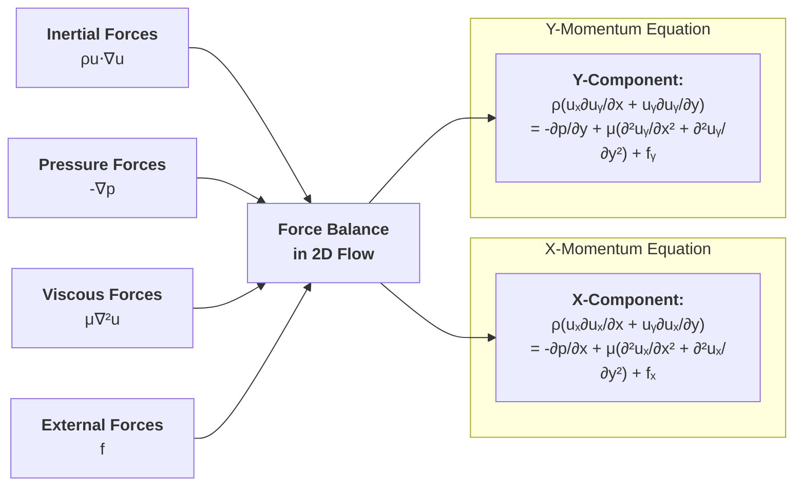
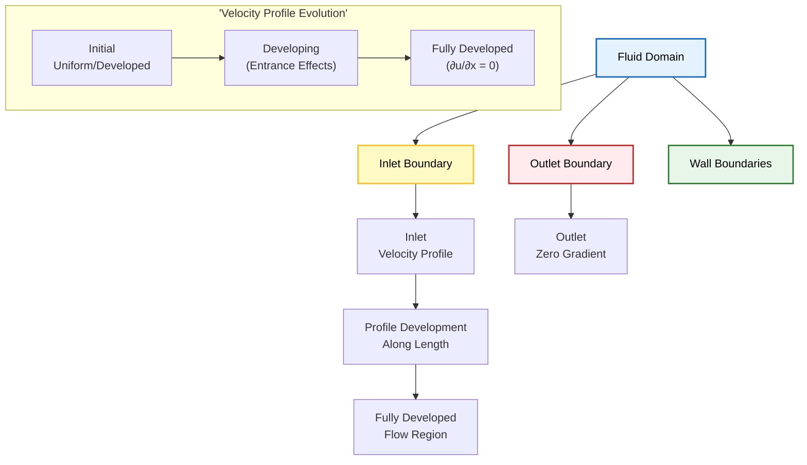
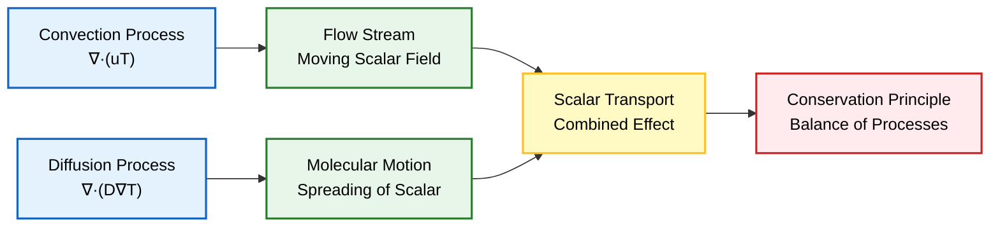

# แบบฝึกหัดเพื่อความเชี่ยวชาญใน CFD และ OpenFOAM

## แบบฝึกหัดที่ 1: หาสมการ Continuity

**วัตถุประสงค์**: ใช้แนวคิดปริมาตรควบคุม (control volume approach) เพื่อหาสมการ Continuity สำหรับการไหลแบบ 1 มิติ (1D flow)

### หลักการพื้นฐาน

พิจารณาปริมาตรควบคุมเชิงอนุพันธ์ (differential control volume) ที่มีความยาว $\mathrm{d}x$ และพื้นที่หน้าตัด $A$ ในระบบการไหลแบบ 1 มิติ

**หลักการอนุรักษ์มวล**: ฟลักซ์มวลสุทธิ (net mass flux) ที่ผ่านพื้นผิวควบคุม (control surfaces) จะต้องเท่ากับอัตราการสะสมมวล (rate of mass accumulation) ภายในปริมาตร


### การคำนวณฟลักซ์มวล

- **อัตราการไหลเข้าของมวล (Mass inlet rate):** $\dot{m}_{in} = \rho u A$
- **อัตราการไหลออกของมวล (Mass outlet rate):** $\dot{m}_{out} = \left(\rho u + \frac{\partial(\rho u)}{\partial x}\mathrm{d}x\right)A$
- **อัตราการสะสมมวล (Mass accumulation rate):** $\dot{m}_{accum} = \frac{\partial \rho}{\partial t} A \mathrm{d}x$

### การประยุกต์ใช้การอนุรักษ์มวล

การประยุกต์ใช้การอนุรักษ์มวล:
$$\dot{m}_{accum} = \dot{m}_{in} - \dot{m}_{out}$$

การแทนค่าสมการ:
$$\frac{\partial \rho}{\partial t} A \mathrm{d}x = \rho u A - \left(\rho u + \frac{\partial(\rho u)}{\partial x}\mathrm{d}x\right)A$$

การทำให้ง่ายขึ้นและตัดพจน์:
$$\frac{\partial \rho}{\partial t} \mathrm{d}x = -\frac{\partial(\rho u)}{\partial x}\mathrm{d}x$$

การหารด้วย $\mathrm{d}x$ จะได้สมการ Continuity แบบ 1 มิติ:
$$\frac{\partial \rho}{\partial t} + \frac{\partial(\rho u)}{\partial x} = 0$$

สมการพื้นฐานนี้แสดงถึงการอนุรักษ์มวลในระบบการไหล และเป็นหนึ่งในสองสมการพื้นฐานของพลศาสตร์ของไหล (fluid dynamics) ควบคู่ไปกับสมการโมเมนตัม (momentum equation)

---

## แบบฝึกหัดที่ 2: ทำให้สมการ Navier-Stokes ง่ายขึ้น

**วัตถุประสงค์**: ทำให้สมการ Navier-Stokes ง่ายลงอย่างเป็นระบบสำหรับการไหลแบบคงที่ (steady), อัดไม่ได้ (incompressible), 2 มิติ (2D flow)

### สมการ Navier-Stokes ฉบับเต็ม

$$\rho \left(\frac{\partial \mathbf{u}}{\partial t} + (\mathbf{u} \cdot \nabla)\mathbf{u}\right) = -\nabla p + \mu \nabla^2 \mathbf{u} + \mathbf{f}$$

**คำนิยามตัวแปร:**
- $\rho$ = ความหนาแน่นของไหล (fluid density)
- $\mathbf{u}$ = เวกเตอร์ความเร็ว (velocity vector)
- $t$ = เวลา (time)
- $p$ = ความดัน (pressure)
- $\mu$ = ความหนืดแบบไดนามิก (dynamic viscosity)
- $\mathbf{f}$ = แรงภายนอก (body force)
- $\nabla$ = เวกเตอร์เกรเดียนต์ (gradient operator)
- $\nabla^2$ = เลปลาเซียน (Laplacian operator)

### การทำให้ง่ายขึ้นทีละขั้นตอน

#### **ขั้นตอนที่ 1: สภาวะคงที่ (Steady-state)**
สำหรับการไหลแบบคงที่ พจน์อนุพันธ์เทียบกับเวลาจะหายไป:
$$\rho (\mathbf{u} \cdot \nabla)\mathbf{u} = -\nabla p + \mu \nabla^2 \mathbf{u} + \mathbf{f}$$

#### **ขั้นตอนที่ 2: การไหลแบบอัดไม่ได้ (Incompressible flow)**
สำหรับการไหลแบบอัดไม่ได้ ความหนาแน่น $\rho$ มีค่าคงที่ และ $\nabla \cdot \mathbf{u} = 0$
$$\rho (\mathbf{u} \cdot \nabla)\mathbf{u} = -\nabla p + \mu \nabla^2 \mathbf{u} + \mathbf{f}$$

#### **ขั้นตอนที่ 3: การไหลแบบ 2 มิติ (2D flow)**
สำหรับการไหลแบบ 2 มิติ เวกเตอร์ความเร็ว $\mathbf{u} = (u_x, u_y, 0)$ และ $\frac{\partial}{\partial z} = 0$

**สมการโมเมนตัมในแนวแกน x:**
$$\rho \left(u_x \frac{\partial u_x}{\partial x} + u_y \frac{\partial u_x}{\partial y}\right) = -\frac{\partial p}{\partial x} + \mu \left(\frac{\partial^2 u_x}{\partial x^2} + \frac{\partial^2 u_x}{\partial y^2}\right) + f_x$$

**สมการโมเมนตัมในแนวแกน y:**
$$\rho \left(u_x \frac{\partial u_y}{\partial x} + u_y \frac{\partial u_y}{\partial y}\right) = -\frac{\partial p}{\partial y} + \mu \left(\frac{\partial^2 u_y}{\partial x^2} + \frac{\partial^2 u_y}{\partial y^2}\right) + f_y$$





### ผลลัพธ์สุดท้าย

สมการที่ง่ายขึ้นเหล่านี้เป็นพื้นฐานสำหรับการจำลอง CFD แบบ 2 มิติ สภาวะคงที่ อัดไม่ได้ ส่วนใหญ่ และแสดงถึงสมดุลพื้นฐานระหว่าง:

- **แรงเฉื่อย (Inertial forces)**: $\rho (\mathbf{u} \cdot \nabla)\mathbf{u}$
- **แรงดัน (Pressure forces)**: $-\nabla p$
- **แรงหนืด (Viscous forces)**: $\mu \nabla^2 \mathbf{u}$
- **แรงภายนอก (Body forces)**: $\mathbf{f}$

---

## แบบฝึกหัดที่ 3: ฟิสิกส์ของ Boundary Condition

**วัตถุประสงค์**: อธิบายเหตุผลทางกายภาพสำหรับ Boundary Condition ทางออกทั่วไปในการจำลอง CFD

### หลักการทางกายภาพ

การเลือก Boundary Condition ที่ทางออกของการไหลถูกควบคุมโดยพื้นฐานจากฟิสิกส์ของการไหลและลักษณะทางคณิตศาสตร์ของสมการควบคุม (governing equations)





### Boundary Condition สำหรับความเร็ว

**`zeroGradient` สำหรับความเร็ว**

**คำจำกัดความ**: โปรไฟล์ความเร็ว (velocity profile) พัฒนาเต็มที่แล้วที่ทางออก ซึ่งหมายถึง:
$$\frac{\partial \mathbf{u}}{\partial n} = 0$$
โดยที่ $n$ คือทิศทางตั้งฉากกับ Boundary ทางออก

**เหตุผลทางกายภาพ**:
- **การพัฒนาโปรไฟล์**: ตำแหน่งทางออกส่วนใหญ่ การไหลได้เคลื่อนที่ห่างจากสิ่งรบกวนทางเรขาคณิต (geometric disturbances) เพียงพอที่จะเข้าสู่สภาวะที่พัฒนาแล้ว (developed state)
- **ป้องกันการรบกวนเทียม**: มันป้องกันการเร่งหรือลดความเร็วเทียม (artificial acceleration or deceleration) ที่จะเกิดขึ้นหากมีการกำหนดค่าความเร็วคงที่
- **การปรับตัวตามธรรมชาติ**: ช่วยให้ความเร็วปรับตัวตามธรรมชาติโดยอิงจากฟิสิกส์การไหลต้นน้ำ (upstream flow physics)
- **ลักษณะทางคณิตศาสตร์**: แสดงถึง **Neumann boundary condition** ที่เคารพลักษณะไฮเพอร์โบลิก (hyperbolic nature) ของพจน์ Convection

### Boundary Condition สำหรับความดัน

**`fixedValue` สำหรับความดัน**

**คำจำกัดความ**: ระบุค่าอ้างอิงความดันที่ทางออก โดยทั่วไปจะตั้งค่าเป็นความดันเกจศูนย์ (zero gauge pressure)

**ความจำเป็นทางคณิตศาสตร์และฟิสิกส์**:
- **การกำหนดค่าอ้างอิง**: สนามความดัน (pressure field) ถูกกำหนดได้เพียงค่าคงที่ที่ไม่เจาะจง (Pressure gradient ไม่ใช่ความดันสัมบูรณ์ ที่ขับเคลื่อนการไหล)
- **การป้องกันความผิดปกติ**: หากไม่มีค่าอ้างอิงความดัน ระบบเชิงเส้น (linear system) จะมีความผิดปกติทางคณิตศาสตร์ (mathematically singular)
- **ให้แรงขับเคลื่อน**: มันให้แรงขับเคลื่อน (driving force) สำหรับการไหลผ่าน Pressure gradient ระหว่างทางเข้าและทางออก
- **ลักษณะทางคณิตศาสตร์**: แสดงถึง **Dirichlet boundary condition** ที่ให้ข้อจำกัดที่จำเป็นสำหรับสมการความดันแบบ Elliptic

### สรุปฟิสิกส์การไหลพื้นฐาน

ในสถานการณ์การไหลจริงส่วนใหญ่ **Pressure gradient ขับเคลื่อนการไหล** มากกว่าค่าความดันสัมบูรณ์ การกำหนดความดันที่ทางออกและปล่อยให้ความเร็วพัฒนาตามธรรมชาติ เราจำลองความเป็นจริงทางกายภาพที่:

1. **ความแตกต่างของความดันสร้างแรงขับเคลื่อน** สำหรับการไหล
2. **โปรไฟล์ความเร็วพัฒนา** ตามเรขาคณิต, ความหนืด และเงื่อนไขต้นน้ำ
3. **การไหลออกจากโดเมนโดยมีข้อจำกัดเทียมน้อยที่สุด**

การรวมกันของ Boundary Condition นี้ช่วยให้มั่นใจถึงความสมจริงทางกายภาพและความเสถียรเชิงตัวเลขในการจำลอง CFD

---

## แบบฝึกหัดที่ 4: การนำ OpenFOAM fvMatrix ไปใช้งาน

**วัตถุประสงค์**: เขียนสูตร OpenFOAM fvMatrix สำหรับสมการ Scalar Transport แบบสภาวะคงที่ (steady-state scalar transport equation) และทำความเข้าใจรายละเอียดการนำไปใช้งาน

### สมการ Scalar Transport

สมการ Scalar Transport แสดงถึงสมดุลระหว่าง **Convection** (ด้านซ้าย) และ **Diffusion** (ด้านขวา) ของปริมาณ Scalar $T$:
$$\nabla \cdot (\mathbf{u} T) = \nabla \cdot (D \nabla T)$$

**คำนิยามตัวแปร**:
- $T$ = ปริมาณ Scalar (เช่น อุณหภูมิ, ความเข้มข้น)
- $\mathbf{u}$ = เวกเตอร์ความเร็ว
- $D$ = สัมประสิทธิ์การแพร่ (diffusion coefficient)
- $\nabla$ = เวกเตอร์เกรเดียนต์





### OpenFOAM Code Implementation

ใน OpenFOAM สิ่งนี้ถูกนำไปใช้งานโดยใช้วิธี Finite Volume (finite volume method) ด้วยตัวดำเนินการ `fvm` (finite volume matrix)

**สูตร fvMatrix หลัก:**
```cpp
// Solve the steady-state scalar transport equation
fvScalarMatrix TEqn
(
    // Convection term: ∇·(u·T)
    fvm::div(phi, T)
    
    // Diffusion term: ∇·(D·∇T)
  - fvm::laplacian(D, T)
);
```

### การตีความทางคณิตศาสตร์

| OpenFOAM Operator | Mathematical Term | Description |
|-------------------|-------------------|-------------|
| `fvm::div(phi, T)` | $\nabla \cdot (\mathbf{u} T)$ | Convection term |
| `fvm::laplacian(D, T)` | $\nabla \cdot (D \nabla T)$ | Diffusion term |
| `phi` | $\phi = \mathbf{u} \cdot \mathbf{S}_f$ | Surface flux field |
| `fvm::` | - | Implicit treatment (matrix coefficients) |
| `fvc::` | - | Explicit treatment (evaluated with current field) |

**คำอธิบายเพิ่มเติม**:
- **`fvm::div(phi, T)`**: นำไปใช้งานพจน์ Convection โดยที่ `phi` คือ Field ฟลักซ์พื้นผิว (surface flux field) $\phi = \mathbf{u} \cdot \mathbf{S}_f$ (ความเร็ว Dot กับเวกเตอร์พื้นที่ผิว)
- **`fvm::laplacian(D, T)`**: นำไปใช้งานพจน์ Diffusion โดยใช้การ Discretization แบบ Finite Volume มาตรฐาน
- **คำนำหน้า `fvm::`**: ระบุว่าตัวดำเนินการเหล่านี้มีส่วนร่วมในสัมประสิทธิ์เมทริกซ์ (การจัดการแบบ Implicit)
- **Implicit เทียบกับ Explicit**: การใช้ `fvm` สร้างระบบ Implicit ที่ถูกแก้พร้อมกัน ในขณะที่ `fvc` จะจัดการพจน์ต่างๆ อย่าง Explicit โดยใช้ค่า Field ปัจจุบัน

### การนำไปใช้งานที่สมบูรณ์ใน Solver

**การประกาศตัวแปร (typically in createFields.H):**
```cpp
volScalarField T
(
    IOobject
    (
        "T",
        runTime.timeName(),
        mesh,
        IOobject::MUST_READ,
        IOobject::AUTO_WRITE
    ),
    mesh
);

volVectorField U
(
    IOobject
    (
        "U",
        runTime.timeName(),
        mesh,
        IOobject::MUST_READ,
        IOobject::AUTO_WRITE
    ),
    mesh
);

surfaceScalarField phi = fvc::interpolate(U) & mesh.Sf();

// Diffusion coefficient (can be constant or field)
volScalarField D
(
    IOobject
    (
        "D",
        runTime.timeName(),
        mesh,
        IOobject::READ_IF_PRESENT,
        IOobject::AUTO_WRITE
    ),
    mesh,
    dimensionedScalar("D", dimensionSet(0,2,-1,0,0,0,0), 0.1)
);
```

**วงจรแก้ปัญหาหลัก:**
```cpp
// Main solver loop
while (simple.correctNonOrthogonal())
{
    fvScalarMatrix TEqn
    (
        fvm::div(phi, T) - fvm::laplacian(D, T)
    );
    
    TEqn.relax();
    TEqn.solve();
}
```

### การนำ Boundary Condition ไปใช้งาน

**ไฟล์ 0/T:**
```cpp
dimensions      [0 0 0 1 0 0 0];

internalField   uniform 300;

boundaryField
{
    inlet
    {
        type            fixedValue;
        value           uniform 350;
    }
    
    outlet
    {
        type            zeroGradient;
    }
    
    walls
    {
        type            fixedValue;
        value           uniform 300;
    }
}
```

### ข้อควรพิจารณาขั้นสูง

| ลักษณะ | คำอธิบาย | OpenFOAM Implementation |
|---------|-----------|------------------------|
| **Convection Schemes** | สามารถใช้ Discretization Scheme ที่แตกต่างกันได้ (upwind, linear, Gamma เป็นต้น) | `divSchemes { div(phi,T) Gauss upwind; }` |
| **Under-relaxation** | มักจำเป็นสำหรับความเสถียร | `TEqn.relax();` |
| **Transient Problems** | เพิ่มพจน์การเปลี่ยนแปลงตามเวลา | `fvm::ddt(T) + fvm::div(phi,T) - fvm::laplacian(D,T)` |
| **Source Terms** | การจัดการ Source term แบบ Implicit | `fvm::Sp(source, T)` |

การนำไปใช้งานนี้เป็นพื้นฐานสำหรับการถ่ายเทความร้อน (heat transfer), การขนส่งชนิด (species transport) และการคำนวณ Scalar Field อื่นๆ อีกมากมายใน OpenFOAM Solver
