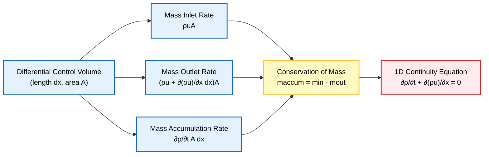
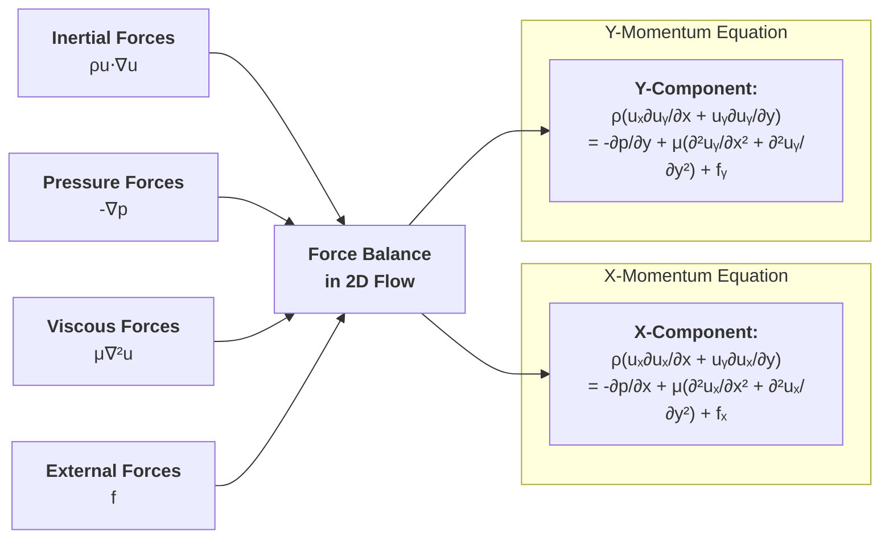
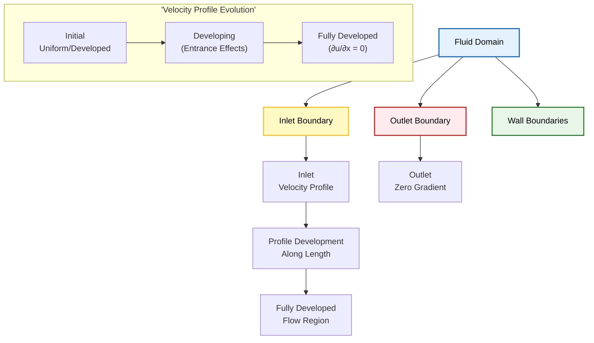
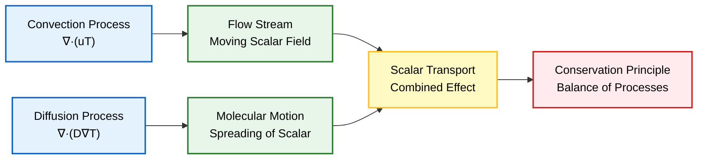
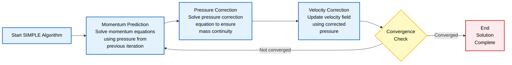

# แบบฝึกหัดเพื่อความเชี่ยวชาญใน CFD และ OpenFOAM

เอกสารนี้รวบรวมแบบฝึกหัดที่ครอบคลุมเพื่อพัฒนาความเข้าใจใน **สมการควบคุม (Governing Equations)**, **การนำไปใช้ใน OpenFOAM**, และ **แนวคิดทางฟิสิกส์** ที่สำคัญใน Computational Fluid Dynamics (CFD)

---

## แบบฝึกหัดที่ 1: หาสมการ Continuity

**วัตถุประสงค์**: ใช้แนวคิดปริมาตรควบคุม (control volume approach) เพื่อหาสมการ Continuity สำหรับการไหลแบบ 1 มิติ (1D flow)

### หลักการพื้นฐาน

พิจารณาปริมาตรควบคุมเชิงอนุพันธ์ (differential control volume) ที่มีความยาว $\mathrm{d}x$ และพื้นที่หน้าตัด $A$ ในระบบการไหลแบบ 1 มิติ

**หลักการอนุรักษ์มวล**: ฟลักซ์มวลสุทธิ (net mass flux) ที่ผ่านพื้นผิวควบคุม (control surfaces) จะต้องเท่ากับอัตราการสะสมมวล (rate of mass accumulation) ภายในปริมาตร


> **Figure 1:** การหาอนุพันธ์ของสมการความต่อเนื่องแบบ 1 มิติ โดยใช้การวิเคราะห์ปริมาตรควบคุม และการรักษาสมดุลระหว่างอัตราการไหลของมวลขาเข้า ขาออก และอัตราการสะสมมวล เพื่อสร้างกฎการอนุรักษ์ในรูปอนุพันธ์
### การคำนวณฟลักซ์มวล

- **อัตราการไหลเข้าของมวล (Mass inlet rate):** $\dot{m}_{in} = \rho u A$
- **อัตราการไหลออกของมวล (Mass outlet rate):** $\dot{m}_{out} = \left(\rho u + \frac{\partial(\rho u)}{\partial x}\mathrm{d}x\right)A$
- **อัตราการสะสมมวล (Mass accumulation rate):** $\dot{m}_{accum} = \frac{\partial \rho}{\partial t} A \mathrm{d}x$

### การประยุกต์ใช้การอนุรักษ์มวล

การประยุกต์ใช้การอนุรักษ์มวล:
$$\dot{m}_{accum} = \dot{m}_{in} - \dot{m}_{out}$$

การแทนค่าสมการ:
$$\frac{\partial \rho}{\partial t} A \mathrm{d}x = \rho u A - \left(\rho u + \frac{\partial(\rho u)}{\partial x}\mathrm{d}x\right)A$$

การทำให้ง่ายขึ้นและตัดพจน์:
$$\frac{\partial \rho}{\partial t} \mathrm{d}x = -\frac{\partial(\rho u)}{\partial x}\mathrm{d}x$$

การหารด้วย $\mathrm{d}x$ จะได้สมการ Continuity แบบ 1 มิติ:
$$\frac{\partial \rho}{\partial t} + \frac{\partial(\rho u)}{\partial x} = 0$$

สมการพื้นฐานนี้แสดงถึงการอนุรักษ์มวลในระบบการไหล และเป็นหนึ่งในสองสมการพื้นฐานของพลศาสตร์ของไหล (fluid dynamics) ควบคู่ไปกับสมการโมเมนตัม (momentum equation)

---

## แบบฝึกหัดที่ 2: ทำให้สมการ Navier-Stokes ง่ายขึ้น

**วัตถุประสงค์**: ทำให้สมการ Navier-Stokes ง่ายลงอย่างเป็นระบบสำหรับการไหลแบบคงที่ (steady), อัดไม่ได้ (incompressible), 2 มิติ (2D flow)

### สมการ Navier-Stokes ฉบับเต็ม

$$\rho \left(\frac{\partial \mathbf{u}}{\partial t} + (\mathbf{u} \cdot \nabla)\mathbf{u}\right) = -\nabla p + \mu \nabla^2 \mathbf{u} + \mathbf{f}$$

**คำนิยามตัวแปร:**
- $\rho$ = ความหนาแน่นของไหล (fluid density)
- $\mathbf{u}$ = เวกเตอร์ความเร็ว (velocity vector)
- $t$ = เวลา (time)
- $p$ = ความดัน (pressure)
- $\mu$ = ความหนืดแบบไดนามิก (dynamic viscosity)
- $\mathbf{f}$ = แรงภายนอก (body force)
- $\nabla$ = เวกเตอร์เกรเดียนต์ (gradient operator)
- $\nabla^2$ = เลปลาเซียน (Laplacian operator)

### การทำให้ง่ายขึ้นทีละขั้นตอน

#### **ขั้นตอนที่ 1: สภาวะคงที่ (Steady-state)**
สำหรับการไหลแบบคงที่ พจน์อนุพันธ์เทียบกับเวลาจะหายไป:
$$\rho (\mathbf{u} \cdot \nabla)\mathbf{u} = -\nabla p + \mu \nabla^2 \mathbf{u} + \mathbf{f}$$

#### **ขั้นตอนที่ 2: การไหลแบบอัดไม่ได้ (Incompressible flow)**
สำหรับการไหลแบบอัดไม่ได้ ความหนาแน่น $\rho$ มีค่าคงที่ และ $\nabla \cdot \mathbf{u} = 0$
$$\rho (\mathbf{u} \cdot \nabla)\mathbf{u} = -\nabla p + \mu \nabla^2 \mathbf{u} + \mathbf{f}$$

#### **ขั้นตอนที่ 3: การไหลแบบ 2 มิติ (2D flow)**
สำหรับการไหลแบบ 2 มิติ เวกเตอร์ความเร็ว $\mathbf{u} = (u_x, u_y, 0)$ และ $\frac{\partial}{\partial z} = 0$

**สมการโมเมนตัมในแนวแกน x:**
$$\rho \left(u_x \frac{\partial u_x}{\partial x} + u_y \frac{\partial u_x}{\partial y}\right) = -\frac{\partial p}{\partial x} + \mu \left(\frac{\partial^2 u_x}{\partial x^2} + \frac{\partial^2 u_x}{\partial y^2}\right) + f_x$$

**สมการโมเมนตัมในแนวแกน y:**
$$\rho \left(u_x \frac{\partial u_y}{\partial x} + u_y \frac{\partial u_y}{\partial y}\right) = -\frac{\partial p}{\partial y} + \mu \left(\frac{\partial^2 u_y}{\partial x^2} + \frac{\partial^2 u_y}{\partial y^2}\right) + f_y$$


> **Figure 2:** การแยกส่วนประกอบของสมการโมเมนตัม Navier-Stokes แบบ 2 มิติ แสดงให้เห็นว่าสมดุลของแรงเฉื่อย แรงดัน แรงหนืด และแรงภายนอก ถูกนำไปใช้แยกกันในทิศทางพิกัด $x$ และ $y$ อย่างไร
### ผลลัพธ์สุดท้าย

สมการที่ง่ายขึ้นเหล่านี้เป็นพื้นฐานสำหรับการจำลอง CFD แบบ 2 มิติ สภาวะคงที่ อัดไม่ได้ ส่วนใหญ่ และแสดงถึงสมดุลพื้นฐานระหว่าง:

- **แรงเฉื่อย (Inertial forces)**: $\rho (\mathbf{u} \cdot \nabla)\mathbf{u}$
- **แรงดัน (Pressure forces)**: $-\nabla p$
- **แรงหนืด (Viscous forces)**: $\mu \nabla^2 \mathbf{u}$
- **แรงภายนอก (Body forces)**: $\mathbf{f}$

---

## แบบฝึกหัดที่ 3: ฟิสิกส์ของ Boundary Condition

**วัตถุประสงค์**: อธิบายเหตุผลทางกายภาพสำหรับ Boundary Condition ทางออกทั่วไปในการจำลอง CFD

### หลักการทางกายภาพ

การเลือก Boundary Condition ที่ทางออกของการไหลถูกควบคุมโดยพื้นฐานจากฟิสิกส์ของการไหลและลักษณะทางคณิตศาสตร์ของสมการควบคุม (governing equations)


> **Figure 3:** เหตุผลทางกายภาพสำหรับเงื่อนไขขอบเขตการไหล แสดงให้เห็นวิวัฒนาการของโปรไฟล์ความเร็วจากทางเข้าไปยังสภาวะที่พัฒนาเต็มที่ (fully developed) ที่ทางออก ซึ่งเป็นจุดที่ใช้เงื่อนไข zero-gradient

### Boundary Condition สำหรับความเร็ว

**`zeroGradient` สำหรับความเร็ว**

**คำจำกัดความ**: โปรไฟล์ความเร็ว (velocity profile) พัฒนาเต็มที่แล้วที่ทางออก ซึ่งหมายถึง:
$$\frac{\partial \mathbf{u}}{\partial n} = 0$$
โดยที่ $n$ คือทิศทางตั้งฉากกับ Boundary ทางออก

**เหตุผลทางกายภาพ**:
- **การพัฒนาโปรไฟล์**: ตำแหน่งทางออกส่วนใหญ่ การไหลได้เคลื่อนที่ห่างจากสิ่งรบกวนทางเรขาคณิต (geometric disturbances) เพียงพอที่จะเข้าสู่สภาวะที่พัฒนาแล้ว (developed state)
- **ป้องกันการรบกวนเทียม**: มันป้องกันการเร่งหรือลดความเร็วเทียม (artificial acceleration or deceleration) ที่จะเกิดขึ้นหากมีการกำหนดค่าความเร็วคงที่
- **การปรับตัวตามธรรมชาติ**: ช่วยให้ความเร็วปรับตัวตามธรรมชาติโดยอิงจากฟิสิกส์การไหลต้นน้ำ (upstream flow physics)
- **ลักษณะทางคณิตศาสตร์**: แสดงถึง **Neumann boundary condition** ที่เคารพลักษณะไฮเพอร์โบลิก (hyperbolic nature) ของพจน์ Convection

### Boundary Condition สำหรับความดัน

**`fixedValue` สำหรับความดัน**

**คำจำกัดความ**: ระบุค่าอ้างอิงความดันที่ทางออก โดยทั่วไปจะตั้งค่าเป็นความดันเกจศูนย์ (zero gauge pressure)

**ความจำเป็นทางคณิตศาสตร์และฟิสิกส์**:
- **การกำหนดค่าอ้างอิง**: สนามความดัน (pressure field) ถูกกำหนดได้เพียงค่าคงที่ที่ไม่เจาะจง (Pressure gradient ไม่ใช่ความดันสัมบูรณ์ ที่ขับเคลื่อนการไหล)
- **การป้องกันความผิดปกติ**: หากไม่มีค่าอ้างอิงความดัน ระบบเชิงเส้น (linear system) จะมีความผิดปกติทางคณิตศาสตร์ (mathematically singular)
- **ให้แรงขับเคลื่อน**: มันให้แรงขับเคลื่อน (driving force) สำหรับการไหลผ่าน Pressure gradient ระหว่างทางเข้าและทางออก
- **ลักษณะทางคณิตศาสตร์**: แสดงถึง **Dirichlet boundary condition** ที่ให้ข้อจำกัดที่จำเป็นสำหรับสมการความดันแบบ Elliptic

### สรุปฟิสิกส์การไหลพื้นฐาน

ในสถานการณ์การไหลจริงส่วนใหญ่ **Pressure gradient ขับเคลื่อนการไหล** มากกว่าค่าความดันสัมบูรณ์ การกำหนดความดันที่ทางออกและปล่อยให้ความเร็วพัฒนาตามธรรมชาติ เราจำลองความเป็นจริงทางกายภาพที่:

1. **ความแตกต่างของความดันสร้างแรงขับเคลื่อน** สำหรับการไหล
2. **โปรไฟล์ความเร็วพัฒนา** ตามเรขาคณิต, ความหนืด และเงื่อนไขต้นน้ำ
3. **การไหลออกจากโดเมนโดยมีข้อจำกัดเทียมน้อยที่สุด**

การรวมกันของ Boundary Condition นี้ช่วยให้มั่นใจถึงความสมจริงทางกายภาพและความเสถียรเชิงตัวเลขในการจำลอง CFD

---

## แบบฝึกหัดที่ 4: การนำ OpenFOAM fvMatrix ไปใช้งาน

**วัตถุประสงค์**: เขียนสูตร OpenFOAM fvMatrix สำหรับสมการ Scalar Transport แบบสภาวะคงที่ (steady-state scalar transport equation) และทำความเข้าใจรายละเอียดการนำไปใช้งาน

### สมการ Scalar Transport

สมการ Scalar Transport แสดงถึงสมดุลระหว่าง **Convection** (ด้านซ้าย) และ **Diffusion** (ด้านขวา) ของปริมาณ Scalar $T$:
$$\nabla \cdot (\mathbf{u} T) = \nabla \cdot (D \nabla T)$$

**คำนิยามตัวแปร**:
- $T$ = ปริมาณ Scalar (เช่น อุณหภูมิ, ความเข้มข้น)
- $\mathbf{u}$ = เวกเตอร์ความเร็ว
- $D$ = สัมประสิทธิ์การแพร่ (diffusion coefficient)
- $\nabla$ = เวกเตอร์เกรเดียนต์


> **Figure 4:** แบบจำลองแนวคิดของการขนส่งสเกลาร์ (Scalar transport) ซึ่งรวมผลของการพา (convective transport) จากการเคลื่อนที่ของไหล และการแพร่ (diffusive spreading) เพื่อสร้างหลักการอนุรักษ์สเกลาร์ทั่วไป
### OpenFOAM Code Implementation

ใน OpenFOAM สิ่งนี้ถูกนำไปใช้งานโดยใช้วิธี Finite Volume (finite volume method) ด้วยตัวดำเนินการ `fvm` (finite volume matrix)

**สูตร fvMatrix หลัก:**
```cpp
// Solve the steady-state scalar transport equation
fvScalarMatrix TEqn
(
    // Convection term: ∇·(u·T)
    fvm::div(phi, T)

    // Diffusion term: ∇·(D·∇T)
  - fvm::laplacian(D, T)
);
```

### การตีความทางคณิตศาสตร์

| OpenFOAM Operator | Mathematical Term | Description |
|-------------------|-------------------|-------------|
| `fvm::div(phi, T)` | $\nabla \cdot (\mathbf{u} T)$ | Convection term |
| `fvm::laplacian(D, T)` | $\nabla \cdot (D \nabla T)$ | Diffusion term |
| `phi` | $\phi = \mathbf{u} \cdot \mathbf{S}_f$ | Surface flux field |
| `fvm::` | - | Implicit treatment (matrix coefficients) |
| `fvc::` | - | Explicit treatment (evaluated with current field) |

**คำอธิบายเพิ่มเติม**:
- **`fvm::div(phi, T)`**: นำไปใช้งานพจน์ Convection โดยที่ `phi` คือ Field ฟลักซ์พื้นผิว (surface flux field) $\phi = \mathbf{u} \cdot \mathbf{S}_f$ (ความเร็ว Dot กับเวกเตอร์พื้นที่ผิว)
- **`fvm::laplacian(D, T)`**: นำไปใช้งานพจน์ Diffusion โดยใช้การ Discretization แบบ Finite Volume มาตรฐาน
- **คำนำหน้า `fvm::`**: ระบุว่าตัวดำเนินการเหล่านี้มีส่วนร่วมในสัมประสิทธิ์เมทริกซ์ (การจัดการแบบ Implicit)
- **Implicit เทียบกับ Explicit**: การใช้ `fvm` สร้างระบบ Implicit ที่ถูกแก้พร้อมกัน ในขณะที่ `fvc` จะจัดการพจน์ต่างๆ อย่าง Explicit โดยใช้ค่า Field ปัจจุบัน

### การนำไปใช้งานที่สมบูรณ์ใน Solver

**การประกาศตัวแปร (typically in createFields.H):**
```cpp
volScalarField T
(
    IOobject
    (
        "T",
        runTime.timeName(),
        mesh,
        IOobject::MUST_READ,
        IOobject::AUTO_WRITE
    ),
    mesh
);

volVectorField U
(
    IOobject
    (
        "U",
        runTime.timeName(),
        mesh,
        IOobject::MUST_READ,
        IOobject::AUTO_WRITE
    ),
    mesh
);

surfaceScalarField phi = fvc::interpolate(U) & mesh.Sf();

// Diffusion coefficient (can be constant or field)
volScalarField D
(
    IOobject
    (
        "D",
        runTime.timeName(),
        mesh,
        IOobject::READ_IF_PRESENT,
        IOobject::AUTO_WRITE
    ),
    mesh,
    dimensionedScalar("D", dimensionSet(0,2,-1,0,0,0,0), 0.1)
);
```

**วงจรแก้ปัญหาหลัก:**
```cpp
// Main solver loop
while (simple.correctNonOrthogonal())
{
    fvScalarMatrix TEqn
    (
        fvm::div(phi, T) - fvm::laplacian(D, T)
    );

    TEqn.relax();
    TEqn.solve();
}
```

### การนำ Boundary Condition ไปใช้งาน

**ไฟล์ 0/T:**
```cpp
dimensions      [0 0 0 1 0 0 0];

internalField   uniform 300;

boundaryField
{
    inlet
    {
        type            fixedValue;
        value           uniform 350;
    }

    outlet
    {
        type            zeroGradient;
    }

    walls
    {
        type            fixedValue;
        value           uniform 300;
    }
}
```

### ข้อควรพิจารณาขั้นสูง

| ลักษณะ | คำอธิบาย | OpenFOAM Implementation |
|---------|-----------|------------------------|
| **Convection Schemes** | สามารถใช้ Discretization Scheme ที่แตกต่างกันได้ (upwind, linear, Gamma เป็นต้น) | `divSchemes { div(phi,T) Gauss upwind; }` |
| **Under-relaxation** | มักจำเป็นสำหรับความเสถียร | `TEqn.relax();` |
| **Transient Problems** | เพิ่มพจน์การเปลี่ยนแปลงตามเวลา | `fvm::ddt(T) + fvm::div(phi,T) - fvm::laplacian(D,T)` |
| **Source Terms** | การจัดการ Source term แบบ Implicit | `fvm::Sp(source, T)` |

การนำไปใช้งานนี้เป็นพื้นฐานสำหรับการถ่ายเทความร้อน (heat transfer), การขนส่งชนิด (species transport) และการคำนวณ Scalar Field อื่นๆ อีกมากมายใน OpenFOAM Solver

---

## แบบฝึกหัดที่ 5: การวิเคราะห์เลขไร้มิติ

**วัตถุประสงค์**: คำนวณและวิเคราะห์เลขไร้มิติสำคัญใน CFD เพื่อทำนายระบอบการไหลและเลือก Solver ที่เหมาะสม

### Reynolds Number ($Re$)

Reynolds number แสดงถึงอัตราส่วนของแรงเฉื่อยต่อแรงหนืดในการไหล:

$$Re = \frac{\rho U L}{\mu} = \frac{\text{Inertial Forces}}{\text{Viscous Forces}}$$

โดยที่:
- $\rho$ = ความหนาแน่นของของไหล [kg/m³]
- $U$ = ความเร็วจำเพาะ [m/s]
- $L$ = มาตราส่วนความยาวจำเพาะ [m]
- $\mu$ = ความหนืดพลวัต [Pa·s]

### Flow Regime Classification

| ค่า Reynolds Number | ระบอบการไหล | ลักษณะการไหล |
|---------------------|--------------|----------------|
| $Re < 2300$ | Laminar | การไหลเป็นชั้นๆ ไม่มีการปนเปื้อน |
| $2300 < Re < 4000$ | Transitional | การเปลี่ยนผ่านจาก Laminar เป็น Turbulent |
| $Re > 4000$ | Turbulent | การไหลมีการปนเปื้อนและกระเพื่อม |

### Mach Number ($Ma$)

Mach number แสดงถึงอัตราส่วนของความเร็วการไหลต่อความเร็วเสียงเฉพาะที่:

$$Ma = \frac{U}{c} = \frac{\text{Flow Velocity}}{\text{Speed of Sound}}$$

โดยที่:
- $U$ = ความเร็วการไหล [m/s]
- $c$ = ความเร็วเสียงเฉพาะที่ [m/s]
- $c = \sqrt{\gamma R T}$ สำหรับ Ideal Gas

### Mach Number Flow Regimes

| ค่า Mach Number | ระบอบการไหล | ผลกระทบของ Compressibility |
|-----------------|---------------|------------------------------|
| $Ma < 0.3$ | Incompressible | ความแปรผันของความหนาแน่นน้อยมาก |
| $0.3 < Ma < 0.8$ | Subsonic Compressible | มีผลกระทบของ compressibility เล็กน้อย |
| $Ma = 1$ | Sonic | สภาวะวิกฤต การไหลผ่านความเร็วเสียง |
| $0.8 < Ma < 1.2$ | Transonic | บริเวณ Subsonic/Supersonic ผสมกัน |
| $Ma > 1.2$ | Supersonic | การไหลเร็วกว่าเสียง Shock Wave ก่อตัว |

### OpenFOAM Solver Selection

```cpp
// Low Mach number (Ma < 0.3) - incompressible solvers
solver simpleFoam;        // Steady-state
solver pimpleFoam;        // Transient
solver icoFoam;          // Laminar transient

// Compressible flow solvers (Ma > 0.3)
solver rhoSimpleFoam;     // Steady compressible
solver rhoPimpleFoam;     // Transient compressible
solver sonicFoam;        // Transonic/supersonic flow

// High-speed flow with shock waves
solver reactingFoam;      // Combustion with compressibility

// Thermophysical properties for compressible flow
thermoType
{
    type            heRhoThermo;
    mixture         pureMixture;
    transport       sutherland;
    thermo          hConst;
    energy          sensibleEnthalpy;
    equationOfState perfectGas;
    specie          specie;
}
```

### Froude Number ($Fr$)

Froude number บ่งบอกถึงความสำคัญสัมพัทธ์ของแรงเฉื่อยต่อแรงโน้มถ่วง และมีความสำคัญอย่างยิ่งสำหรับการไหลที่มี Free Surface:

$$Fr = \frac{U}{\sqrt{gL}} = \sqrt{\frac{\text{Inertial Forces}}{\text{Gravitational Forces}}}$$

### Prandtl Number ($Pr$)

$$Pr = \frac{c_p \mu}{k} = \frac{\text{Momentum Diffusivity}}{\text{Thermal Diffusivity}}$$

**ความสำคัญ:**
- จำเป็นสำหรับแอปพลิเคชันการถ่ายเทความร้อน
- $Pr \approx 0.7$ สำหรับก๊าซ
- $Pr \approx 7$ สำหรับน้ำ

---

## แบบฝึกหัดที่ 6: การเขียนสมการใน OpenFOAM

**วัตถุประสงค์**: แปลงสมการทางคณิตศาสตร์เป็นโค้ด OpenFOAM ที่ถูกต้อง

### สมการ Momentum แบบ Incompressible

$$\rho \left(\frac{\partial \mathbf{u}}{\partial t} + \mathbf{u} \cdot \nabla \mathbf{u}\right) = -\nabla p + \mu \nabla^2 \mathbf{u} + \mathbf{f}$$

### OpenFOAM Implementation

```cpp
// Momentum equation (UEqn.H)
fvVectorMatrix UEqn
(
    fvm::ddt(rho, U)              // Time derivative: ∂(ρU)/∂t
  + fvm::div(rhoPhi, U)           // Convection: ∇•(ρUU)
 ==
    fvm::laplacian(muEff, U)      // Diffusion: ∇•(μ∇U)
  - fvc::div(rhoPhi, muEff*...)   // Reynolds stress / deviatoric part
);

UEqn.relax();                     // Numerical stability trick
solve(UEqn == -fvc::grad(p));     // Solve: LHS = -∇p
```

### การแปลงพจน์สมการ

| พจน์สมการ | คณิตศาสตร์ | OpenFOAM |
|-------------|-------------|---------|
| Time derivative | $\frac{\partial (\rho \mathbf{u})}{\partial t}$ | `fvm::ddt(rho, U)` |
| Convection | $\nabla \cdot (\rho \mathbf{u} \mathbf{u})$ | `fvm::div(rhoPhi, U)` |
| Pressure gradient | $-\nabla p$ | `-fvc::grad(p)` |
| Viscous diffusion | $\mu \nabla^2 \mathbf{u}$ | `fvm::laplacian(mu, U)` |
| Body forces | $\mathbf{f}$ | `fvOptions(rho, U)` |

---

## แบบฝึกหัดที่ 7: Pressure-Velocity Coupling

**วัตถุประสงค์**: เข้าใจและใช้งานอัลกอริทึม SIMPLE, PISO และ PIMPLE ใน OpenFOAM

### อัลกอริทึม SIMPLE

**ขั้นตอนอัลกอริทึม SIMPLE**:
1. **Momentum Prediction**: แก้สมการโมเมนตัมโดยใช้ความดันจาก time step ก่อนหน้า
2. **Pressure Correction**: แก้สมการแก้ไขความดันเพื่อให้เกิดความต่อเนื่องของมวล
3. **Velocity Correction**: แก้ไขความเร็วโดยใช้ความดันที่ถูกแก้ไข
4. **Convergence Check**: ตรวจสอบการลู่เข้าและทำซ้ำถ้าจำเป็น

### การนำไปใช้ใน OpenFOAM

```cpp
// อัลกอริทึม SIMPLE
while (simple.correctNonOrthogonal())
{
    // สมการโมเมนตัม
    tmp<fvVectorMatrix> UEqn(fvm::ddt(U) + fvm::div(phi, U));
    UEqn().relax();

    // สมการความดัน
    adjustPhi(phi, U, p);

    // ลูปการเชื่อมโยงความดัน-ความเร็ว
    for (int corr = 0; corr < nCorr; corr++)
    {
        // แก้โมเมนตัม
        solve(UEqn() == -fvc::grad(p));

        // แก้ความดัน
        solve(fvm::laplacian(rAU, p) == fvc::div(phi));
    }
}
```

### ความแตกต่างระหว่าง Algorithms

| Feature | SIMPLE | PISO | PIMPLE |
|---------|--------|------|---------|
| **Temporal Accuracy** | First-order | Second-order | Configurable |
| **Number of Corrections** | Single per iteration | Multiple per time step | Multiple per time step |
| **Stability** | High (with relaxation) | Moderate | High |
| **Computational Cost** | Low | High | Moderate-High |
| **Best For** | Steady-state problems | Accurate transient solutions | Large time step simulations |


> **Figure 5:** ขั้นตอนการทำงานของอัลกอริทึม SIMPLE สำหรับการเชื่อมโยงความดันและความเร็ว โดยเน้นย้ำถึงกระบวนการวนซ้ำของการทำนายโมเมนตัมและการแก้ไขความดัน ซึ่งเป็นหัวใจสำคัญสำหรับแบบฝึกหัดการไหลแบบอัดตัวไม่ได้ในสภาวะคงตัว

---

## แบบฝึกหัดที่ 8: Initial Conditions และ Boundary Conditions

**วัตถุประสงค์**: ตั้งค่า Initial Conditions และ Boundary Conditions ที่เหมาะสมสำหรับปัญหา CFD

### Velocity Field Initialization (`0/U`)

```cpp
FoamFile
{
    version     2.0;
    format      ascii;
    class       volVectorField;
    object      U;
}
// * * * * * * * * * * * * * * * * * * * * * * * * * * //

dimensions      [0 1 -1 0 0 0 0];  // m/s: ความยาว/เวลา
internalField   uniform (0 0 0);   // ฟิลด์ความเร็วเริ่มต้น

boundaryField
{
    inlet
    {
        type            fixedValue;
        value           uniform (10 0 0); // ความเร็วขาเข้าแบบ Uniform 10 m/s
    }
    outlet
    {
        type            zeroGradient;     // การไหลที่พัฒนาเต็มที่
    }
    walls
    {
        type            noSlip;           // เงื่อนไข No-Slip
    }
    symmetry
    {
        type            symmetryPlane;    // ขอบเขตสมมาตร
    }
}
```

### Pressure Field Initialization (`0/p`)

```cpp
FoamFile
{
    version     2.0;
    format      ascii;
    class       volScalarField;
    object      p;
}
// * * * * * * * * * * * * * * * * * * * * * * * * * * //

dimensions      [0 2 -2 0 0 0 0];  // Pa: kg/(m·s²)
internalField   uniform 101325;    // ค่าอ้างอิงความดันบรรยากาศ

boundaryField
{
    inlet
    {
        type            zeroGradient;
    }
    outlet
    {
        type            fixedValue;
        value           uniform 101325; // ความดันเกจ = 0
    }
    walls
    {
        type            zeroGradient;
    }
}
```

### Temperature Field Initialization (`0/T`)

```cpp
FoamFile
{
    version     2.0;
    format      ascii;
    class       volScalarField;
    object      T;
}
// * * * * * * * * * * * * * * * * * * * * * * * * * * //

dimensions      [0 0 0 1 0 0 0];  // หน่วยอุณหภูมิ
internalField   uniform 300;      // อุณหภูมิเริ่มต้น 300 K

boundaryField
{
    hotWall
    {
        type            fixedValue;
        value           uniform 400; // ผนังร้อน 400 K
    }
    coldWall
    {
        type            fixedValue;
        value           uniform 280; // ผนังเย็น 280 K
    }
    inlet
    {
        type            fixedValue;
        value           uniform 320; // อุณหภูมิขาเข้า 320 K
    }
}
```

---

## แบบฝึกหัดที่ 9: การวิเคราะห์และแก้ไขปัญหา

**วัตถุประสงค์**: ระบุและแก้ไขปัญหาที่พบบ่อยในการจำลอง CFD

### ปัญหาที่พบบ่อย

| ปัญหา | สาเหตุ | วิธีแก้ไข |
|--------|--------|------------|
| **Divergence** | Boundary Condition ไม่เหมาะสม | ตรวจสอบ BC และกำหนดค่าที่เหมาะสม |
| **Slow Convergence** | Under-relaxation สูงเกินไป | ลดค่า under-relaxation factors |
| **Non-physical Results** | Mesh quality ไม่ดี | ปรับปรุง mesh quality |
| **Mass Conservation Error** | Pressure-velocity coupling ไม่ดี | เพิ่ม iterations ใน pressure correction |

### การตรวจสอบ Mesh Quality

```bash
# ตรวจสอบคุณภาพ Mesh
checkMesh -case .

# ตรวจสอบไฟล์ Field
foamListFields -case .

# ตรวจสอบความสอดคล้องของมิติ
foamInfoDict -case .
```

### ข้อควรพิจารณาเรื่อง Numerical Stability

1. **Well-posed problems**: ตรวจสอบให้แน่ใจว่าปัญหาทางคณิตศาสตร์ถูกจำกัดอย่างเหมาะสมด้วยการรวมกันของเงื่อนไข Dirichlet และ Neumann ที่เหมาะสม

2. **Pressure-velocity coupling**: สำหรับ **Incompressible Flows** ให้หลีกเลี่ยงการระบุทั้ง Velocity และ Pressure ที่ขอบเขตเดียวกันเพื่อรักษา Numerical Stability

3. **Backflow treatment**: **Outlet Boundaries** ควรจัดการกับการไหลย้อนกลับที่อาจเกิดขึ้นโดยใช้ `outletInlet` หรือ Outlet Conditions เฉพาะทาง

4. **Temporal consistency**: สำหรับ **Transient Simulations** ตรวจสอบให้แน่ใจว่า Boundary Conditions เปลี่ยนแปลงอย่างราบรื่นเพื่อหลีกเลี่ยง Numerical Oscillations

---

## แบบฝึกหัดที่ 10: โปรเจกต์ประยุกต์

**วัตถุประสงค์**: ประยุกต์ใช้ความรู้ทั้งหมดเพื่อแก้ปัญหา CFD ที่สมบูรณ์

### สถานการณ์: การไหลในท่อ (Pipe Flow)

จงแก้ปัญหาการไหลแบบ Laminar ในท่อรูปทรงกระบอก:

**ข้อมูลปัญหา:**
- เส้นผ่านศูนย์กลางท่อ: $D = 0.05$ m
- ความยาวท่อ: $L = 1.0$ m
- ความเร็วเฉลี่ย: $U_{avg} = 0.01$ m/s
- ของไหล: น้ำ ($\rho = 1000$ kg/m³, $\mu = 0.001$ Pa·s)

**งานที่ต้องทำ:**

1. **คำนวณ Reynolds Number** และระบุระบอบการไหล
2. **เลือก Solver ที่เหมาะสม** สำหรับปัญหานี้
3. **ตั้งค่า Boundary Conditions** สำหรับ Inlet, Outlet, และ Walls
4. **สร้าง Mesh** ที่เหมาะสมสำหรับการแก้ปัญหา
5. **เขียน OpenFOAM Case Files** ที่จำเป็น
6. **รันการจำลอง** และวิเคราะห์ผลลัพธ์

### คำตอบแนะนำ

**1. Reynolds Number:**
$$Re = \frac{\rho U D}{\mu} = \frac{1000 \times 0.01 \times 0.05}{0.001} = 50$$

เนื่องจาก $Re < 2300$ → **Laminar Flow**

**2. Solver Selection:**
```cpp
solver icoFoam;  // Laminar transient incompressible solver
```

**3. Boundary Conditions:**

**Inlet (Parabolic profile):**
```cpp
inlet
{
    type            fixedValue;
    value           #codeStream
    {
        code
        #{
            const vectorField& C = mesh().C();
            vectorField& U = *this;
            const scalar radius = 0.025; // รัศมีท่อ
            const scalar Umax = 0.02;     // ความเร็วสูงสุด

            forAll(C, i)
            {
                scalar r = sqrt(C[i].y()*C[i].y() + C[i].z()*C[i].z());
                scalar u_parabolic = Umax * (1.0 - sqr(r/radius));
                U[i] = vector(u_parabolic, 0, 0);
            }
        #};
    };
}
```

**Outlet:**
```cpp
outlet
{
    type            zeroGradient;
}
```

**Walls:**
```cpp
walls
{
    type            noSlip;
}
```

---

## สรุปประเด็นสำคัญ

### 1. กฎการอนุรักษ์: รากฐานของ CFD

**ทุกสิ่งใน computational fluid dynamics (CFD)** สร้างขึ้นบนหลักการพื้นฐานของการอนุรักษ์มวล (mass), โมเมนตัม (momentum) และพลังงาน (energy)

กฎการอนุรักษ์เหล่านี้แสดงถึงข้อจำกัดทางกายภาพที่ควบคุมพฤติกรรมของไหล และเป็นแกนหลักทางคณิตศาสตร์ของการจำลอง CFD ทั้งหมด

### 2. สมการความต่อเนื่อง: หลักการอนุรักษ์มวล

**สมการความต่อเนื่อง (continuity equation)** แสดงออกทางคณิตศาสตร์ถึงหลักการพื้นฐานที่ว่ามวลไม่สามารถถูกสร้างหรือทำลายได้ภายในระบบของไหล

สำหรับ **incompressible flows** ซึ่ง density คงที่ สมการความต่อเนื่องจะลดรูปอย่างมาก:
$$\nabla \cdot \mathbf{u} = 0$$

ข้อจำกัดนี้ทำให้มั่นใจว่าการไหลของไหลยังคงเป็น **solenoidal (divergence-free)**

### 3. สมการ Navier-Stokes: กฎข้อที่สองของนิวตันสำหรับของไหล

**สมการ Navier-Stokes** แสดงถึงการกำหนดทางคณิตศาสตร์ของกฎข้อที่สองของนิวตันว่าด้วยการเคลื่อนที่ที่นำมาใช้กับ fluid elements

โดยหลักแล้วระบุว่าแรงที่กระทำต่ออนุภาคของไหลเท่ากับมวลของอนุภาคนั้นคูณด้วยความเร่ง สมการเหล่านี้จะรักษาสมดุลระหว่าง:
- **Inertial forces**
- **Pressure forces**
- **Viscous forces**
- **External body forces**

### 4. ไวยากรณ์ OpenFOAM: การแปลสัญลักษณ์ทางคณิตศาสตร์

**ไวยากรณ์ของ OpenFOAM** ได้รับการออกแบบมาโดยเจตนาให้สะท้อนสัญลักษณ์ vector ทางคณิตศาสตร์ที่ใช้ในสมการพลศาสตร์ของไหลอย่างใกล้ชิด

ทำให้โค้ดใช้งานง่ายขึ้นสำหรับวิศวกรและนักวิทยาศาสตร์ที่คุ้นเคยกับคณิตศาสตร์พื้นฐาน

### 5. Boundary Conditions: สิ่งจำเป็นสำหรับ Physical Solutions

**Boundary conditions** มีความสำคัญอย่างยิ่งต่อการได้มาซึ่ง solution ที่ไม่ซ้ำกันและถูกต้องทางกายภาพสำหรับปัญหา CFD

เนื่องจาก governing equations เองยอมรับ solutions ที่ไม่มีที่สิ้นสุดหากไม่มีข้อจำกัดที่เหมาะสม ใน finite volume method, boundary conditions จะต้องถูกระบุสำหรับตัวแปรทั้งหมดที่ domain boundaries ทั้งหมด

---

**บทสรุป**: เอกสารแบบฝึกหัดนี้ครอบคลุมแนวคิดพื้นฐานและการนำไปใช้งานจริงของ CFD ใน OpenFOAM โดยเน้นที่ความเข้าใจในสมการควบคุม (governing equations), การแปลงเป็นโค้ด OpenFOAM, และแนวทางการแก้ปัญหาที่มีประสิทธิภาพ
