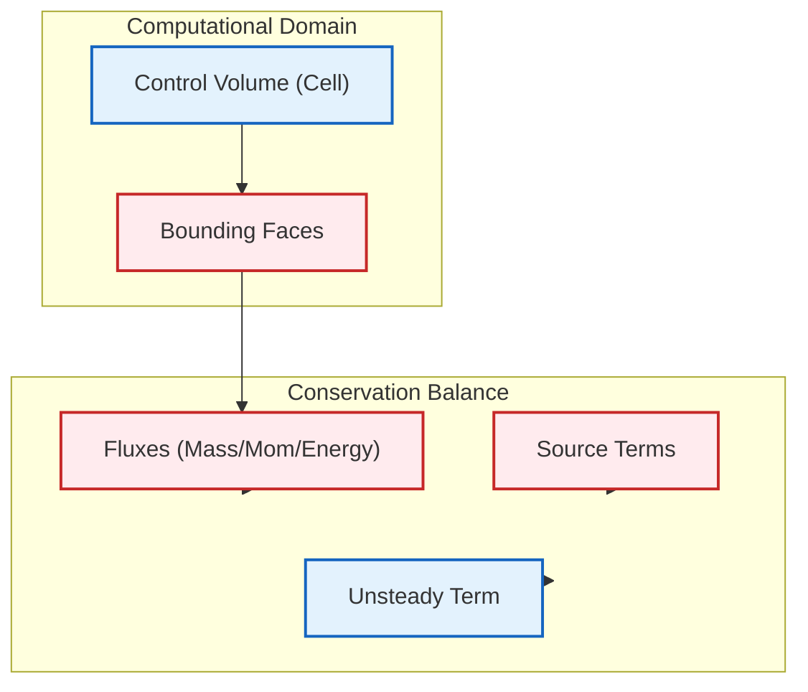
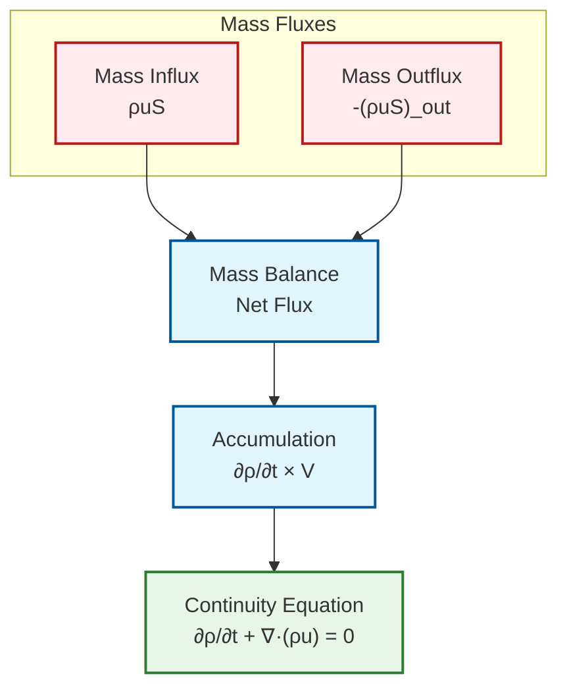
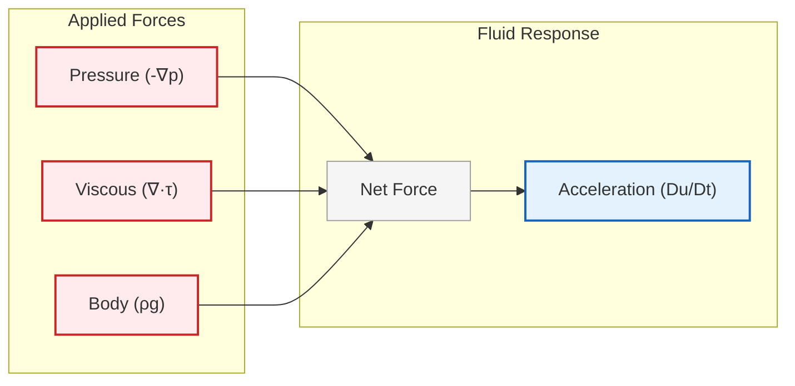
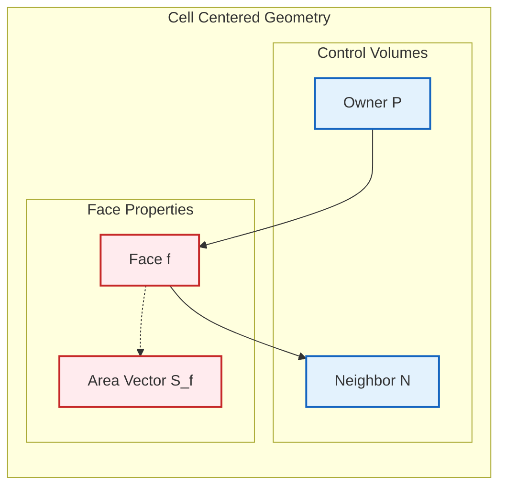
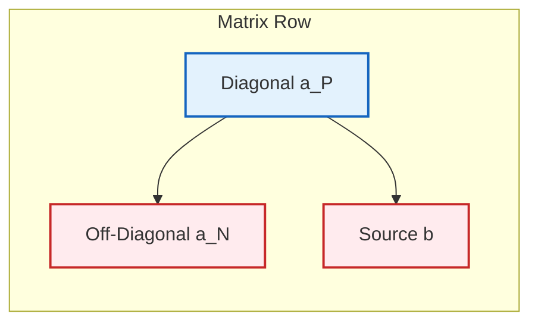
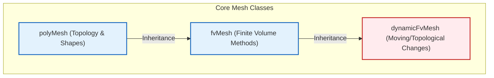
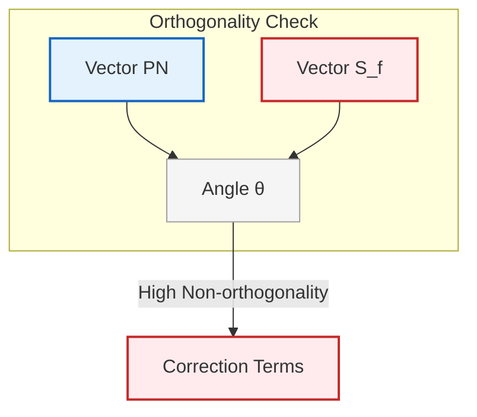

# ภาพรวม Finite Volume Method ใน OpenFOAM

## บทนำ

**Finite Volume Method (FVM)** เป็นเทคนิคการประมาณค่าแบบตัวเลข (numerical discretization technique) ที่ OpenFOAM ใช้ในการแปลงสมการเชิงอนุพันธ์ย่อย (Partial Differential Equations หรือ PDEs) ที่ควบคุมการไหลของของไหลให้เป็นระบบสมการพีชคณิตที่สามารถคำนวณหาคำตอบได้

เอกสารนี้ให้ภาพรวมแบบครอบคลุมของ Finite Volume Method ใน OpenFOAM ครอบคลุมตั้งแต่แนวคิดพื้นฐาน สมการควบคุม การทำให้เป็นดิสครีต การประกอบเมทริกซ์ การนำไปใช้ในโค้ด ไปจนถึงแนวปฏิบัติที่ดีที่สุด

---

## แนวคิดพื้นฐานของ Finite Volume Method

### หลักการอนุรักษ์

Finite Volume Method ทำงานบน**รูปแบบอินทิกรัลของสมการการอนุรักษ์ (conservation equations)** ซึ่งรับประกันว่าปริมาณทางกายภาพพื้นฐาน เช่น:

- **มวล (Mass)**
- **โมเมนตัม (Momentum)**
- **พลังงาน (Energy)**

จะถูกอนุรักษ์ไว้ในระดับดิสครีต


> **Figure 1:** การแบ่งโดเมนการคำนวณออกเป็นปริมาตรควบคุมจำกัด แสดงโครงสร้างเซลล์เฉพาะที่ (จุดศูนย์กลาง, หน้า, จุดยอด) และความสมดุลพื้นฐานของฟลักซ์มวล โมเมนตัม และพลังงานข้ามขอบเขต

### **2. Discretization**
การแปลงโดเมนต่อเนื่อง (Continuous Domain) ให้เป็นชิ้นส่วนย่อย ๆ (Discrete Volumes) หรือ "Cells" ซึ่งรวมกันเรียกว่า "Mesh"

> [!TIP]
> **Practical Analogy: ภาพดิจิทัล vs ภาพวาดตัวจริง**
>
> ลองจินตนาการว่า **Continuous Domain** คือ "ทิวทัศน์จริง" ที่เรามองเห็น ซึ่งมีความละเอียดไม่สิ้นสุดและสีสันที่เปลี่ยนไปอย่างต่อเนื่อง
>
> **Discretization (FVM)** คือการถ่ายภาพทิวทัศน์นั้นด้วย **กล้องดิจิทัล**:
> *   **Control Volume (Cell)** = **Pixel** หนึ่งจุดบนภาพ
> *   **Cell Center Value** = สีเฉลี่ยของ Pixel นั้น
> *   **Resolution (Mesh Resolution)** = จำนวน Megapixels ยิ่งมี Pixel (Cell) มาก ภาพก็ยิ่งคมชัดและเหมือนจริง แต่ไฟล์ (การคำนวณ) ก็จะใหญ่ขึ้นตามไปด้วย
> *   FVM จะคำนวณว่าสีของ Pixel หนึ่ง "ไหล" ไปยัง Pixel ข้างๆ อย่างไร เพื่อสร้างภาพเคลื่อนไหว (Simulation) ที่ถูกต้อง

### **3. System of Algebraic Equations**

### แนวทางการใช้ Control Volume

**Finite Volume Method** แบ่ง Computational Domain ออกเป็นชุดของ **Control Volume (Cells)** ที่ไม่ทับซ้อนกัน โดย:

- **Governing Equations** จะถูกอินทิเกรตเหนือ Control Volume แต่ละอัน
- รับประกันการอนุรักษ์มวล โมเมนตัม และพลังงานในระดับท้องถิ่น (local conservation)
- เป็นรากฐานทางคณิตศาสตร์ของ **Computational Framework ของ OpenFOAM**
- วิธีการที่เข้มงวดในการ Discretize **Partial Differential Equations** โดยยังคงรักษ์ Conservation Laws พื้นฐานทางฟิสิกส์ไว้

---

## สมการควบคุม (Governing Equations)

### การอนุรักษ์มวล

**สมการความต่อเนื่อง** (continuity equation) แสดงหลักการอนุรักษ์มวลในระบบของไหล


> **Figure 2:** การหาที่มาของสมการความต่อเนื่องผ่านสมดุลมวลบนปริมาตรควบคุม โดยเชื่อมโยงฟลักซ์ผิวสุทธิเข้ากับการสะสมมวลเชิงเวลาภายในปริมาตร

**รูปแบบทั่วไป:**
$$\frac{\partial \rho}{\partial t} + \nabla \cdot (\rho \mathbf{u}) = 0$$

**สำหรับการไหลแบบอัดตัวไม่ได้** ($\rho = \text{constant}$):
$$\nabla \cdot \mathbf{u} = 0$$

### การอนุรักษ์โมเมนตัม

**สมการโมเมนตัม** (momentum equation) ซึ่งได้มาจากกฎข้อที่สองของนิวตัน ควบคุมการเคลื่อนที่ของอนุภาคของไหล


> **Figure 3:** สมดุลแรงพลวัตในสมการโมเมนตัม ซึ่งแรงที่ผิวและแรงภายนอกสุทธิเป็นตัวขับเคลื่อนความเร่งเนื่องจากความเฉื่อยขององค์ประกอบของไหลตามกฎข้อที่สองของนิวตัน

**รูปแบบทั่วไป:**
$$\rho \frac{\partial \mathbf{u}}{\partial t} + \rho (\mathbf{u} \cdot \nabla) \mathbf{u} = -\nabla p + \mu \nabla^2 \mathbf{u} + \mathbf{f}$$

### การอนุรักษ์พลังงาน

**สมการพลังงาน** (energy equation) ควบคุมการถ่ายเทพลังงานความร้อน (thermal energy) ภายในระบบของไหล

สำหรับของไหลที่มีอุณหภูมิ $T$ สมการพลังงานในรูของอุณหภูมิคือ:

$$\rho c_p \frac{\partial T}{\partial t} + \rho c_p \mathbf{u} \cdot \nabla T = k \nabla^2 T + Q$$

---

## การทำให้เป็นส่วนย่อยเชิงพื้นที่ (Spatial Discretization)

### โครงสร้าง Mesh

#### แนวทางแบบ Cell-Centered

OpenFOAM ใช้แผนการทำให้เป็นส่วนย่อยแบบ **Finite Volume** ที่เน้น **cell-centered** โดยที่ตัวแปรหลักทั้งหมด (velocity, pressure, temperature, ฯลฯ) จะถูกเก็บไว้ที่จุดศูนย์กลางทางเรขาคณิตของเซลล์คำนวณ

แนวทางนี้มีข้อดีหลายประการสำหรับการคำนวณ CFD:
- **คุณสมบัติการอนุรักษ์** (conservation properties)
- **การนำ Boundary Condition ที่ซับซ้อนไปใช้ได้อย่างตรงไปตรงมา**


> **Figure 4:** การนิยามทางเรขาคณิตของปริมาตรควบคุมแบบเน้นจุดศูนย์กลางเซลล์ โดยระบุเซลล์เจ้าของและเซลล์ข้างเคียง เวกเตอร์แนวฉากของหน้าเซลล์ ($n_f$) เวกเตอร์พื้นที่หน้าเซลล์ ($S_f$) และจุดศูนย์กลางเซลล์ ($P, N$) ที่ใช้ในการคำนวณเกรเดียนต์และฟลักซ์

### การคำนวณ Face Flux

#### นิพจน์ Flux ทั่วไป

ในกรอบ Finite Volume Terms การขนส่งทั้งหมดใน Governing Equations จะแสดงเป็น Fluxes ที่ผ่าน Cell Faces

$$\sum_f \mathbf{F}_f \cdot \mathbf{S}_f = 0$$

โดยที่:
- $\mathbf{F}_f$ แทน Flux Vector ที่ Face f
- $\mathbf{S}_f$ คือ Face Area Vector

#### 1. Convective Fluxes ($\nabla \cdot (\phi \mathbf{u})$)

**Term Convective สำหรับ Scalar Field $\phi$**:
$$\int_V \nabla \cdot (\phi \mathbf{u}) \, \mathrm{d}V = \sum_f \phi_f (\mathbf{u}_f \cdot \mathbf{S}_f) = \sum_f \phi_f \Phi_f$$

**Interpolation Schemes สำหรับ $\phi_f$**:

| Scheme | รูปแบบสมการ | ความแม่นยำ | ข้อดี | ข้อเสีย | กรณีที่เหมาะสม |
|--------|--------------|-------------|--------|--------|----------------|
| **CDS** (Central Differencing) | $\phi_f = 0.5(\phi_P + \phi_N)$ | Order 2 | High accuracy for smooth profiles | Unbounded oscillations in steep gradients | Laminar flow, fine meshes |
| **UDS** (Upwind) | $\phi_f = \phi_P$ if $\Phi_f > 0$ | Order 1 | Numerically stable, bounded | Significant numerical diffusion | High convection, coarse meshes |
| **QUICK** | $\phi_f = \frac{6}{8}\phi_P + \frac{3}{8}\phi_N - \frac{1}{8}\phi_{NN}$ | Order 3 | Excellent accuracy | Can be unstable for high convection | Structured grids, smooth flows |
| **MUSCL/TVD** | $\phi_f = \phi_U + \phi(r) \cdot \frac{1}{2}(\phi_D - \phi_U)$ | Order 2 | High accuracy with boundedness | Complex implementation | General CFD applications |

#### 2. Diffusive Fluxes ($\nabla \cdot (\Gamma \nabla \phi)$)

**Term Diffusive สำหรับ Scalar Field $\phi$ ที่มี Diffusion Coefficient $\Gamma$**:
$$\int_V \nabla \cdot (\Gamma \nabla \phi) \, \mathrm{d}V = \sum_f \Gamma_f (\nabla \phi)_f \cdot \mathbf{S}_f$$

**การประมาณค่า Gradient**:

สำหรับ Orthogonal Meshes ค่า Gradient ที่ Face จะถูกประมาณโดยใช้ Finite Differences ระหว่าง Adjacent Cell Centers:

$$(\nabla \phi)_f \cdot \mathbf{S}_f = |\mathbf{S}_f| \frac{\phi_N - \phi_P}{|\mathbf{d}_{PN}|}$$

---

## การทำให้เป็นดิสครีตเชิงเวลา (Temporal Discretization)

### Time Integration Schemes

| Scheme | รูปแบบสมการ | ความแม่นยำ | ความเสถียร | ข้อจำกัด | กรณีที่เหมาะสม |
|--------|--------------|-------------|------------|-----------|----------------|
| **Euler Explicit** | $\phi^{n+1} = \phi^n + \Delta t \cdot \mathcal{L}(\phi^n)$ | Order 1 | Conditionally stable | CFL < 1, small time steps | Explicit dynamics, small problems |
| **Euler Implicit** | $\phi^{n+1} = \phi^n + \Delta t \cdot \mathcal{L}(\phi^{n+1})$ | Order 1 | Unconditionally stable | Requires nonlinear solve | Steady-state, large time steps |
| **Crank-Nicolson** | $\phi^{n+1} = \phi^n + \frac{\Delta t}{2} [\mathcal{L}(\phi^n) + \mathcal{L}(\phi^{n+1})]$ | Order 2 | Good stability | Moderate complexity | Accurate transient flows |
| **BDF (Order 2)** | $\phi^{n+1} = \frac{4}{3}\phi^n - \frac{1}{3}\phi^{n-1} + \frac{2}{3}\Delta t \cdot \mathcal{L}(\phi^{n+1})$ | Order 2 | Good stability | Requires 2 previous steps | High accuracy transient |

---

## การประกอบเมทริกซ์ (Matrix Assembly)

## จากสมการสู่เมทริกซ์

สำหรับแต่ละเซลล์ เราจะได้สมการที่เชื่อมโยง $\phi_P$ กับเซลล์เพื่อนบ้าน $\phi_N$:
$$a_P \phi_P + \sum_N a_N \phi_N = b$$

เมื่อเราเขียนสมการนี้สำหรับ *ทุก* เซลล์ เราจะได้ระบบสมการเชิงเส้นขนาดใหญ่:
$$[A][x] = [b]$$

*   **[A]**: Sparse matrix ที่ประกอบด้วยสัมประสิทธิ์ ($a_P, a_N$) ซึ่งได้มาจากรูปทรงเรขาคณิตและฟลักซ์ (fluxes)
*   **[x]**: Vector of unknowns (เช่น Pressure ที่ทุกเซลล์)
*   **[b]**: Source vector ที่ประกอบด้วยเทอมที่ชัดเจน (explicit terms) และค่า Boundary values

OpenFOAM solvers (PCG, PBiCG) จะแก้สมการเมทริกซ์นี้ด้วยวิธีวนซ้ำ (iteratively)

### ตัวอย่างสัมประสิทธิ์เมทริกซ์ (Matrix Coefficients Example)

สำหรับการแพร่กระจายแบบบริสุทธิ์ ($\nabla^2 \phi = 0$):
*   $a_N = -\frac{\Gamma A_f}{d_{PN}}$ (สัมประสิทธิ์เพื่อนบ้าน)
*   $a_P = -\sum a_N$ (สัมประสิทธิ์แนวทแยง)


> **Figure 5:** การเปลี่ยนความสัมพันธ์ระหว่างเซลล์ที่อยู่ติดกันให้เป็นสัมประสิทธิ์เมทริกซ์ ($a_P, a_N$) โดยแสดงให้เห็นว่าฟลักซ์ที่หน้าเซลล์เป็นตัวกำหนดโครงสร้างแบบเบาบาง (sparse) ของระบบสมการเชิงเส้น $[A][x] = [b]$

### โครงสร้าง Coefficient Matrix

การทำให้เป็นส่วนย่อยเชิงพื้นที่และเชิงเวลาของ Governing Equations ส่งผลให้เกิด Sparse Linear System:

$$\mathbf{A} \cdot \boldsymbol{\phi} = \mathbf{b}$$

โดยที่:
- $\mathbf{A}$ คือ Coefficient Matrix
- $\boldsymbol{\phi}$ คือ Solution Vector
- $\mathbf{b}$ คือ Source Vector

**คุณสมบัติที่สำคัญ**:
- **Diagonal Dominance**: $|A_{PP}| \geq \sum_{N} |A_{PN}|$ เพื่อความเสถียร
- **Sparsity Pattern**: แต่ละแถวมี Non-Zero Entries เฉพาะสำหรับเซลล์นั้นเองและเซลล์ข้างเคียงโดยตรง
- **Natural Sparsity**: เกิดจากการทำให้เป็นส่วนย่อยแบบ Finite Volume

---

## การนำ OpenFOAM ไปใช้งาน

## คลาสหลัก

### **fvMesh**: คลาสเมชพื้นฐานใน OpenFOAM

`fvMesh` คือคลาสเมชพื้นฐานใน OpenFOAM ที่จัดเก็บข้อมูลทางเรขาคณิตและโทโพโลยีทั้งหมดที่จำเป็นสำหรับการดิสครีตแบบปริมาตรจำกัด (finite volume discretization)


> **Figure 6:** ลำดับชั้นของคลาสที่เกี่ยวข้องกับ Mesh ใน OpenFOAM แสดงการสืบทอดของ `fvMesh` จากคลาสฐานที่จัดการด้านโทโพโลยีและการจัดการฟิลด์ เพื่อรองรับการทำงานของปริมาตรควบคุมที่ซับซ้อน

### **volScalarField / volVectorField**: คลาสฟิลด์แบบเทมเพลต

คลาสฟิลด์แบบเทมเพลตเหล่านี้แสดงถึงตัวแปรที่กำหนด ณ จุดศูนย์กลางเซลล์ (จุดควบคุมปริมาตรจำกัด)

```cpp
// Define a volScalarField for pressure
// Constructor with IOobject for file I/O operations
volScalarField p
(
    IOobject
    (
        "p",                      // Field name
        runTime.timeName(),       // Time directory
        mesh,                     // Reference to mesh
        IOobject::MUST_READ,      // Read from file if exists
        IOobject::AUTO_WRITE      // Write automatically at output
    ),
    mesh                          // Reference to fvMesh
);
```

**คำอธิบาย:**
- **📂 Source:** ไฟล์ต้นฉบับอ้างอิงจาก `applications/solvers/stressAnalysis/solidDisplacementFoam/solidDisplacementThermo/solidDisplacementThermo.C`
- **Explanation:** การสร้าง volScalarField สำหรับ pressure field โดยใช้ IOobject เพื่อจัดการการอ่าน/เขียนข้อมูล โดย field จะถูกเก็บที่จุดศูนย์กลางเซลล์ (cell centers) ของ finite volume mesh
- **Key Concepts:** volScalarField, IOobject, MUST_READ, AUTO_WRITE, cell-centered storage

### **fvMatrix**: หัวใจสำคัญของระบบพีชคณิตเชิงเส้น

`fvMatrix` คือหัวใจสำคัญของระบบพีชคณิตเชิงเส้นของ OpenFOAM ซึ่งแสดงถึงรูปแบบการดิสครีตของสมการเชิงอนุพันธ์ย่อย (partial differential equations)

```cpp
// Create finite volume matrix for energy equation
// Implicit temporal derivative term
fvScalarMatrix TEqn
(
    fvm::ddt(rho, T)           // ∂(ρT)/∂t - Implicit time derivative
  + fvm::div(phi, T)           // ∇·(φT) - Implicit convective term
  - fvm::laplacian(k, T)       // ∇·(k∇T) - Implicit diffusive term
 ==
    fvc::div(q)                // ∇·q - Explicit source term
);
```

**คำอธิบาย:**
- **📂 Source:** ไฟล์ต้นฉบับอ้างอิงจาก `applications/solvers/multiphase/multiphaseEulerFoam/phaseSystems/phaseSystem/phaseSystem.H`
- **Explanation:** การสร้างสมการเมทริกซ์สำหรับสมการพลังงาน โดยใช้ fvm (finite volume method) สำหรับเทอม implicit และ fvc (finite volume calculus) สำหรับเทอม explicit ซึ่งจะถูกแปลงเป็นระบบสมการเชิงเส้น [A][x] = [b]
- **Key Concepts:** fvScalarMatrix, fvm::ddt, fvm::div, fvm::laplacian, fvc::div, implicit vs explicit

## ตัวอย่างโค้ด: การแปลงสมการคณิตศาสตร์เป็นโค้ด

### **สมการคณิตศาสตร์**:
$$\frac{\partial \rho \mathbf{U}}{\partial t} + \nabla \cdot (\phi \mathbf{U}) - \nabla \cdot (\mu \nabla \mathbf{U}) = -\nabla p$$

### **OpenFOAM Code Implementation:**

```cpp
// Momentum equation solver implementation
// Construct finite volume matrix for velocity
fvVectorMatrix UEqn
(
    fvm::ddt(rho, U)                    // ∂(ρU)/∂t - Implicit temporal
  + fvm::div(phi, U)                    // ∇·(φU) - Implicit convection
  - fvm::laplacian(mu, U)               // ∇·(μ∇U) - Implicit diffusion
 ==
    -fvc::grad(p)                       // -∇p - Explicit pressure gradient
);

// Apply under-relaxation for stability
UEqn.relax();                         

// Solve momentum equation with pressure source
solve(UEqn == -fvc::grad(p));          
```

**คำอธิบาย:**
- **📂 Source:** ไฟล์ต้นฉบับอ้างอิงจาก `applications/utilities/miscellaneous/foamDictionary/foamDictionary.C`
- **Explanation:** การแปลงสมการโมเมนตัมให้อยู่ในรูปแบบโค้ด OpenFOAM โดยแยกเทอม implicit และ explicit อย่างชัดเจน การใช้ under-relaxation ช่วยเพิ่มความเสถียรของการคำนวณ และการแก้สมการด้วย pressure gradient เป็น explicit source
- **Key Concepts:** fvVectorMatrix, momentum equation, under-relaxation, pressure-velocity coupling

---

## Pressure-Velocity Coupling

การเชื่อมโยงระหว่าง Pressure และ Velocity Fields เป็นสิ่งสำคัญของการจำลอง Incompressible Flow

| Algorithm | ลักษณะการทำงาน | รอบการทำซ้ำ | ข้อดี | ข้อเสีย |
|-----------|-----------------|---------------|--------|----------|
| **SIMPLE** | Sequential solution with under-relaxation | Multiple per time step | Robust, steady-state | Slow convergence |
| **PISO** | Multiple pressure corrections per time step | 2-3 corrections per step | Accurate for transient | Can be unstable |
| **PIMPLE** | Hybrid SIMPLE + PISO | Flexible | Good for both steady/transient | More complex |


> **Figure 7:** ตรรกะเชิงเปรียบเทียบของอัลกอริทึม SIMPLE, PISO และ PIMPLE สำหรับการเชื่อมโยงความดันและความเร็ว แสดงวงรอบการแก้ไขซ้ำที่จำเป็นสำหรับ Solver ทั้งแบบสภาวะคงตัวและแบบไม่คงที่

---

## แนวปฏิบัติที่ดีที่สุด (Best Practices)

### คุณภาพของ Mesh (Mesh Quality)

คุณภาพของ Mesh เป็นปัจจัยสำคัญที่ส่งผลต่อความแม่นยำและความเสถียรของการจำลอง CFD

#### พารามิเตอร์คุณภาพหลัก

**Non-orthogonality**
การวัดมุมระหว่าง Face normal vector และเส้นเชื่อมต่อจุดศูนย์กลางของ Cell ที่อยู่ติดกัน พารามิเตอร์นี้ส่งผลโดยตรงต่อความแม่นยำของการคำนวณ Gradient

- **ค่าที่แนะนำ**: < 50°
- **ขีดจำกัดวิกฤต**: > 70° อาจเกิด Numerical diffusion ที่สำคัญ
- **การควบคุม**: `nonOrthogonalCorrectors` ใน `fvSolution` dictionary


> **Figure 8:** การวิเคราะห์ความไม่ตั้งฉาก (Non-orthogonality) ของ Mesh แสดงความเบี่ยงเบนระหว่างเส้นที่เชื่อมต่อจุดศูนย์กลางเซลล์กับเวกเตอร์แนวฉากของหน้าเซลล์ ซึ่งส่งผลโดยตรงต่อความแม่นยำของการประมาณค่าเกรเดียนต์โดยใช้ทฤษฎีบทของเกาส์

**Skewness**
การวัดปริมาณการเบี่ยงเบนของจุด Face-cell intersection จาก Geometric face center

- **ค่าที่แนะนำ**: < 0.5
- **ขีดจำกัดวิกฤต**: > 0.6 สามารถลดความแม่นยำได้อย่างรุนแรง
- **ผลกระทบ**: นำข้อผิดพลาด Interpolation เข้ามาในการคำนวณ Face value
- **เครื่องมือวินิจฉัย**: `checkMesh` utility

### การเลือก Numerical Scheme (Numerical Scheme Selection)

#### **Temporal Discretization Schemes**

| Scheme | ลำดับความแม่นยำ | คำอธิบาย | กรณีที่เหมาะสม |
|--------|-----------------|-----------|---------------|
| Euler | First-order explicit | เรียบง่าย คำนวณเร็ว | การทดสอบเบื้องต้น |
| Backward | Second-order implicit | สมดุลระหว่างความเร็วและความแม่นยำ | การจำลอง Transient ทั่วไป |
| CrankNicolson | Second-order | ความแม่นยำยอดเยี่ยม | การจำลองที่ต้องการความแม่นยำสูง |

#### **Spatial Discretization for Convective Terms**

| Scheme | คุณสมบัติ | ข้อดี | ข้อเสีย |
|--------|------------|---------|---------|
| Gauss linear | Central differencing | Second-order accurate | ไม่เสถียรสำหรับ Reynolds สูง |
| Gauss upwind | First-order upwind | Stability สูงมาก | Numerical diffusion สูง |
| Gauss limitedLinear | Limited linear | สมดุลระหว่าง accuracy และ stability | Complex implementation |
| Gauss vanLeer | Van Leer limiter | สมดุลดี | Computational cost สูง |

**OpenFOAM Code Implementation:**
```cpp
// Example: Setting discretization schemes in fvSchemes
// This controls spatial discretization for div, grad, laplacian terms
divSchemes
{
    // Limited linear scheme for momentum - TVD compliant
    div(phi,U)      Gauss limitedLinearV 1;
    
    // Limited linear for turbulent kinetic energy
    div(phi,k)      Gauss limitedLinear 1;
    
    // Upwind for dissipation rate - robust but diffusive
    div(phi,epsilon) Gauss upwind;
}
```

**คำอธิบาย:**
- **📂 Source:** ไฟล์ต้นฉบับอ้างอิงจาก `applications/utilities/preProcessing/changeDictionary/changeDictionary.C`
- **Explanation:** การตั้งค่า discretization schemes ในไฟล์ fvSchemes เพื่อควบคุมความแม่นยำและความเสถียรของการคำนวณ โดย limitedLinearV ให้ความสมดุลระหว่างความแม่นยำและความเสถียรด้วย TVD (Total Variation Diminishing) limiter
- **Key Concepts:** divSchemes, Gauss linear, limitedLinear, upwind, TVD limiter, numerical diffusion

### การตรวจสอบการลู่เข้า (Convergence Monitoring)

#### **Residuals**

แสดงถึงการวัดว่า Solution ปัจจุบันเป็นไปตาม Discretized governing equations ได้ดีเพียงใด

$$r = |A\phi - b|$$

- **การลดลงที่ต้องการ**: 3-6 ระดับขนาด (orders of magnitude)
- **การตรวจสอบ**: `residuals` subdictionary ใน `functions` ของ `controlDict`
- **เกณฑ์การลู่เข้า**: < 1e-5 สำหรับ Solvers ส่วนใหญ่

#### **Under-relaxation**

เทคนิค Stabilization ที่ช่วยชะลออัตราการเปลี่ยนแปลงเพื่อป้องกัน Numerical oscillations และ Divergence

$$\phi^{new} = \phi^{old} + \alpha (\phi^{calc} - \phi^{old})$$

**การตั้งค่าใน `fvSolution`:**
```cpp
// Under-relaxation factors for stability
// Controls rate of change between iterations
relaxationFactors
{
    fields
    {
        p               0.3;    // Pressure - aggressive relaxation
        U               0.5;    // Velocity - moderate relaxation
    }
    equations
    {
        k               0.7;    // Turbulent kinetic energy
        epsilon         0.7;    // Dissipation rate
    }
}
```

**คำอธิบาย:**
- **📂 Source:** ไฟล์ต้นฉบับอ้างอิงจาก `applications/solvers/multiphase/multiphaseEulerFoam/phaseSystems/PhaseSystems/ThermalPhaseChangePhaseSystem/ThermalPhaseChangePhaseSystem.C`
- **Explanation:** การตั้งค่า under-relaxation factors เพื่อควบคุมความเสถียรของการแก้สมการ โดยค่าที่ต่ำกว่า (เช่น 0.3) จะช่วยให้การคำนวณเสถียรขึ้นแต่จะลู่เข้าช้าลง ใช้ร่วมกับอัลกอริทึม SIMPLE/PIMPLE
- **Key Concepts:** under-relaxation, relaxation factors, convergence stability, SIMPLE algorithm

---

## สรุป

Finite Volume Method ใน OpenFOAM เป็นกรอบการทำงานที่ทรงพลังสำหรับการจำลอง CFD ซึ่งมีจุดแข็งหลัก ๆ ดังนี้:

1. **การอนุรักษ์โดยธรรมชาติ**: รับประกันการอนุรักษ์มวล โมเมนตัม และพลังงานในระดับดิสครีต

2. **ความยืดหยุ่น**: รองรับ Unstructured Meshes ที่ซับซ้อนและ Boundary Conditions ที่หลากหลาย

3. **สถาปัตยกรรมแบบเทมเพลต**: ช่วยให้สามารถนำโค้ดกลับมาใช้ใหม่ได้กับปริมาณทางฟิสิกส์ที่แตกต่างกัน

4. **ระบบเมทริกซ์เบาบาง**: ช่วยให้สามารถแก้ปัญหาขนาดใหญ่ได้อย่างมีประสิทธิภาพ

5. **การจัดการข้อผิดพลาดที่แข็งแกร่ง**: รองรับ Mesh Quality ที่หลากหลายและมี Correction Schemes สำหรับ Non-orthogonal Meshes

การเข้าใจหลักการเหล่านี้เป็นสิ่งสำคัญสำหรับการใช้งาน OpenFOAM อย่างมีประสิทธิภาพและการพัฒนา Solvers แบบ Custom

---

> [!TIP] **เอกสารที่เกี่ยวข้อง**
> - [[01_Introduction]] - บทนำสู่ Finite Volume Method
> - [[02_Fundamental_Concepts]] - แนวคิดพื้นฐานและ Control Volume
> - [[03_Spatial_Discretization]] - การทำให้เป็นส่วนย่อยเชิงพื้นที่
> - [[04_Temporal_Discretization]] - การทำให้เป็นส่วนย่อยเชิงเวลา
> - [[05_Matrix_Assembly]] - การประกอบเมทริกซ์
> - [[06_OpenFOAM_Implementation]] - การนำไปใช้ใน OpenFOAM
> - [[07_Best_Practices]] - แนวปฏิบัติที่ดีที่สุด
> - [[08_Exercises]] - แบบฝึกหัด

---

## ตรวจสอบความเข้าใจ (Concept Check)

1. **ถาม:** ทำไม FVM ถึงเน้นเรื่อง "Integral Form" ของสมการมากกว่า Differential Form?
   <details>
   <summary>เฉลย</summary>
   <b>ตอบ:</b> เพราะ Integral Form รับประกัน **การอนุรักษ์ (Conservation)** ของมวล/พลังงาน ในระดับเซลล์โดยธรรมชาติ ถ้ามีอะไรไหลออกจากเซลล์ A มันต้องไหลเข้าเซลล์ B เสมอ ไม่มีทางหายไปไหน
   </details>

2. **ถาม:** ความแตกต่างที่สำคัญที่สุดระหว่าง `fvm::` และ `fvc::` ใน OpenFOAM คืออะไร?
   <details>
   <summary>เฉลย</summary>
   <b>ตอบ:</b>
   - `fvm::` (Method) = **Implicit**: สร้างสัมประสิทธิ์ใน Matrix เพื่อแก้สมการ (ใช้กับเทอมที่เราต้องการหาค่าในอนาคต)
   - `fvc::` (Calculus) = **Explicit**: คำนวณค่าออกมาเลยโดยใช้ข้อมูลที่มีอยู่แล้ว (ใช้กับเทอมที่รู้ค่าแล้วหรือ source term)
   </details>

3. **ถาม:** ในการคำนวณ Gradient `fvc::grad(p)` โปรแกรมรู้ค่า p ที่ "หน้า (Face)" ของเซลล์ได้อย่างไร ในเมื่อ p ถูกเก็บที่ "จุดศูนย์กลาง (Center)"?
   <details>
   <summary>เฉลย</summary>
   <b>ตอบ:</b> ต้องใช้ **Interpolation Scheme** (เช่น Linear/Central Differencing) เพื่อประมาณค่าจากจุดศูนย์กลางเซลล์ (Cell Centers) ไปยังจุดกึ่งกลางหน้า (Face Centers) ก่อนคำนวณ
   </details>