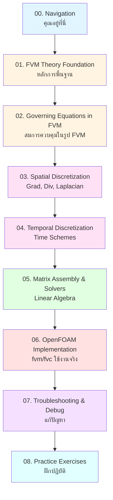
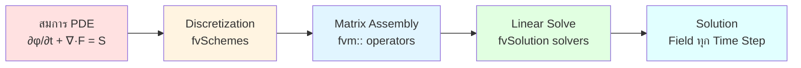

# ภาพรวม Finite Volume Method

> **ทำไมต้องเข้าใจ FVM?**
> - เลือก **Discretization Schemes** ใน `fvSchemes` ได้ถูกต้อง
> - แก้ปัญหา **Divergence** ได้โดยไม่ต้องลองผิดลองถูก
> - ตรวจสอบ **Mesh Quality** ว่าเหมาะกับโจทย์หรือไม่
> - อ่านและแก้ไข **Solver Source Code** ได้

---

## เส้นทางการเรียนรู้ FVM ใน OpenFOAM

---

## ขั้นตอนการแปลง PDE → OpenFOAM

---

## Mapping สู่ OpenFOAM

| แนวคิด FVM | OpenFOAM File/Class | เรียนรายละเอียดที่ |
|-----------|---------------------|------------------|
| Control Volume & Mesh | `constant/polyMesh/` | 01, 03 |
| Field Initialization | `0/` directory | 02 |
| Discretization Schemes | `system/fvSchemes` | 03, 04 |
| Linear Solvers | `system/fvSolution` | 05 |
| Pressure-Velocity Coupling | `system/fvSolution` | 02 |
| Matrix Coefficients | `fvMatrix<type>` | 05, 06 |
| Implicit Operators | `fvm::ddt`, `fvm::div`, `fvm::laplacian` | 06 |
| Explicit Operators | `fvc::grad`, `fvc::div`, `fvc::laplacian` | 06 |

---

## โครงสร้างบทเรียน

| ไฟล์ | เนื้อหาหลัก | คำถามหลัก |
|------|------------|-----------|
| **01. FVM Theory Foundation** | Control Volume, Conservation, Mesh structure | FVM คืออะไร? ทำไม conservation? |
| **02. Governing Equations in FVM** | Continuity, Momentum, Energy in FVM form, SIMPLE/PISO | สมการกลายเป็น matrix อย่างไร? |
| **03. Spatial Discretization** | Gradient, Convection, Diffusion schemes | Term ต่างๆ discretize อย่างไร? |
| **04. Temporal Discretization** | Time schemes, CFL, Stability | Time step เลือกอย่างไร? |
| **05. Matrix Assembly & Solvers** | System [A][x]=[b], Iterative solvers, Preconditioners | แก้ linear system อย่างไร? |
| **06. OpenFOAM Implementation** | fvm/fvc operators, Solver customization | เขียน code อย่างไร? |
| **07. Troubleshooting & Debug** | Common errors, Diagnostic workflow, Best practices | ปัญหาเกิดจากอะไร? แก้ยังไง? |
| **08. Practice Exercises** | Progressive problems with solutions | ลงมือฝึกอย่างไร? |

---

## Quick Start: คุณควรเริ่มที่ไหน?

| ระดับของคุณ | เส้นทางแนะนำ |
|-------------|--------------|
| **มือใหม่กับ OpenFOAM** | 01 → 02 → 06 → 08 |
| **เข้าใจ CFD แล้ว** | 02 → 03 → 04 → 05 → 06 |
| **แก้ปัญหา Divergence** | 07 → 03 → 04 → 02 |
| **Custom Solver** | 01 → 02 → 05 → 06 |

---

## ข้อดีของ Finite Volume Method

| จุดแข็ง | ผลใน OpenFOAM |
|---------|--------------|
| **Conservation** | มวล/โมเมนตัม/พลังงานอนุรักษ์ในระดับ cell |
| **Flexibility** | รองรับ polyhedral, unstructured mesh |
| **Robustness** | จัดการ complex boundaries ได้ดี |
| **Efficiency** | Sparse matrix → iterative solvers รวดเร็ว |

---

## เอกสารที่เกี่ยวข้อง

- **บทก่อนหน้า:** [../01_GOVERNING_EQUATIONS/00_Overview.md](../01_GOVERNING_EQUATIONS/00_Overview.md) — สมการควบคุม
- **ถัดไป:** [01_Introduction.md](01_Introduction.md) → เจาะลึกทฤษฎี FVM

---

## พร้อมหรือยัง?

✅ **เข้าใจ workflow แล้ว** → ไป 01_Introduction.md  
❓ **ต้องการ review สมการก่อน** → กลับไป 01_GOVERNING_EQUATIONS