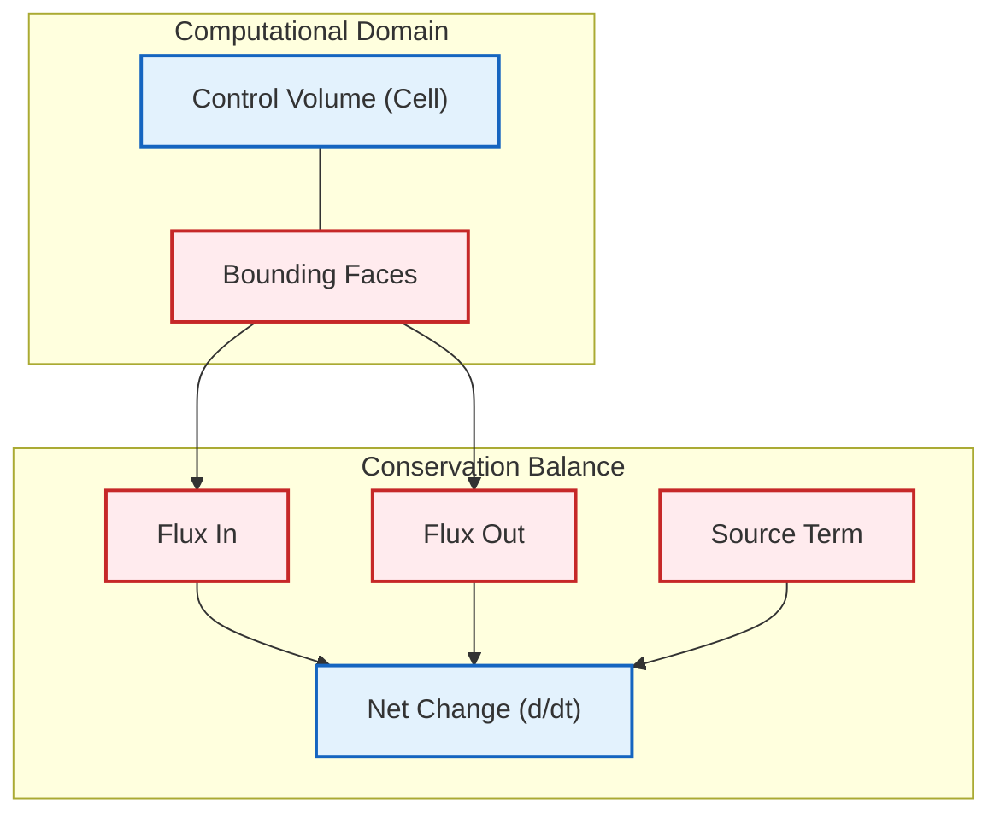
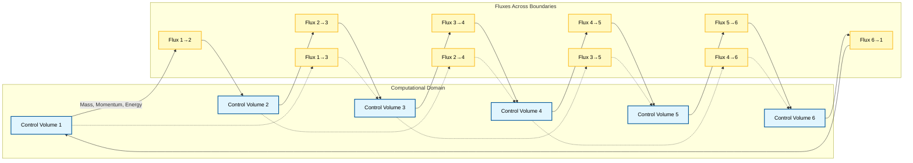
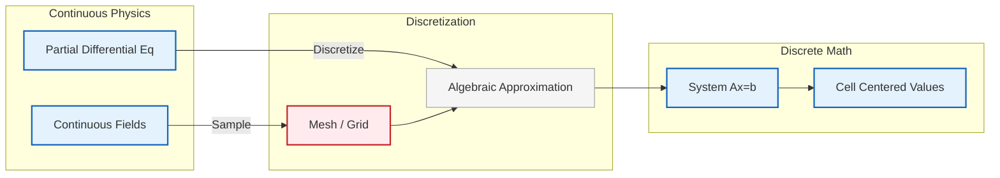
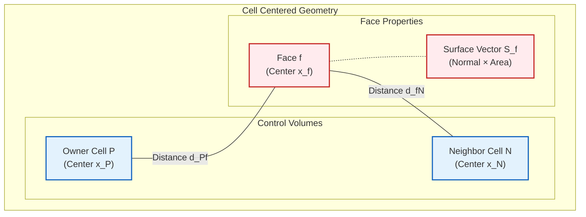
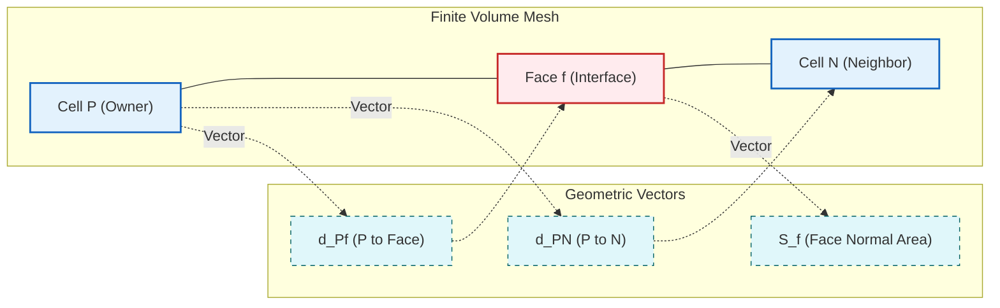
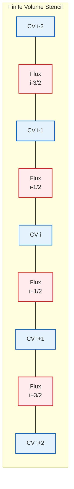
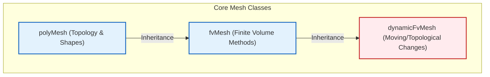
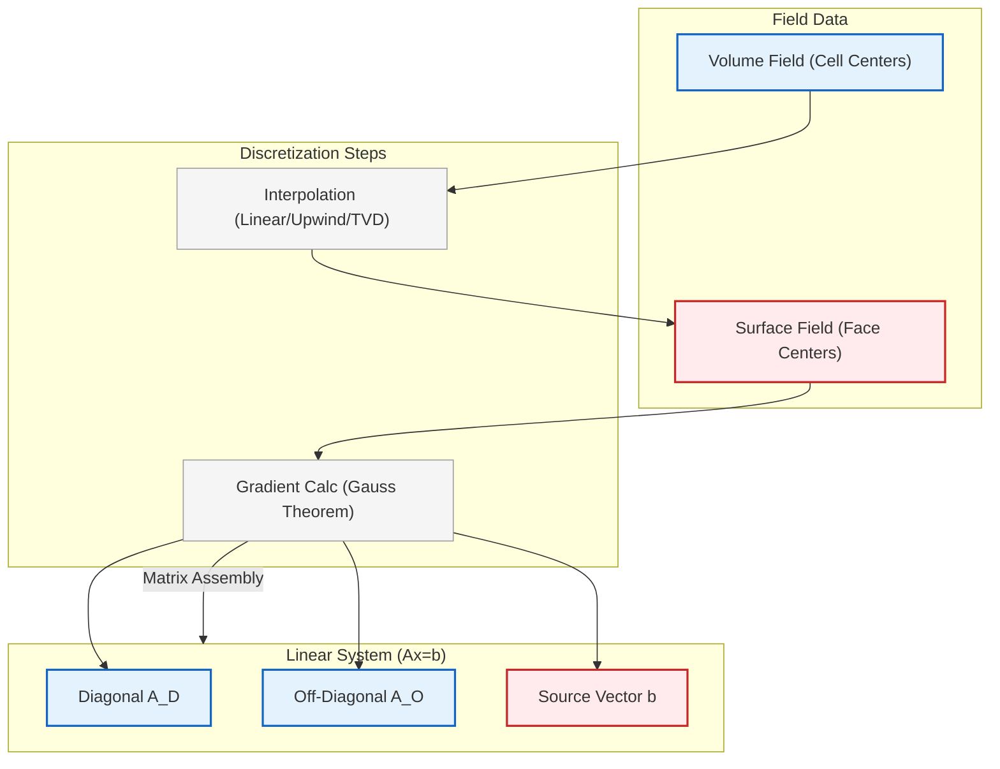

# บทนำสู่ Finite Volume Method ใน OpenFOAM

## แนวคิดพื้นฐานของ Finite Volume Method (FVM)

**Finite Volume Method (FVM)** เป็นเทคนิคการประมาณค่าแบบตัวเลข (numerical discretization technique) ที่ OpenFOAM ใช้ในการแปลงสมการเชิงอนุพันธ์ย่อย (Partial Differential Equations หรือ PDEs) ที่ควบคุมการไหลของของไหลให้เป็นระบบสมการพีชคณิตที่สามารถคำนวณหาคำตอบได้

### หลักการการอนุรักษ์

Finite Volume Method ทำงานบน**รูปแบบอินทิกรัลของสมการการอนุรักษ์ (conservation equations)** ซึ่งรับประกันว่าปริมาณทางกายภาพพื้นฐาน เช่น:

- **มวล (Mass)**
- **โมเมนตัม (Momentum)**
- **พลังงาน (Energy)**

จะถูกอนุรักษ์ไว้ในระดับดิสครีต

**ความแตกต่างจากวิธีอื่น**: วิธีอื่น ๆ ทำการประมาณค่าแบบดิสครีตสำหรับรูปแบบเชิงอนุพันธ์ (differential forms) แต่ FVM จะ:

1. **แบ่งโดเมนการคำนวณ**ออกเป็นชุดของปริมาตรควบคุม (control volumes หรือ cells) ที่ไม่ทับซ้อนกัน
2. **ประยุกต์ใช้กฎการอนุรักษ์โดยตรง**กับปริมาตรควบคุมแต่ละส่วน


> **Figure 1:** แนวคิดพื้นฐานของวิธี Finite Volume แสดงการแบ่งโดเมนการคำนวณออกเป็นปริมาตรควบคุมแบบไม่ต่อเนื่อง โดยประยุกต์ใช้กฎการอนุรักษ์กับฟลักซ์สุทธิและพจน์แหล่งกำเนิด

### รูปแบบสมการทั่วไป

สำหรับสมการการอนุรักษ์ทั่วไปในรูปแบบ:
$$\frac{\partial \phi}{\partial t} + \nabla \cdot \mathbf{F}(\phi) = S(\phi)$$

**นิยามตัวแปร:**
- $\phi$: ปริมาณที่ถูกอนุรักษ์ (conserved quantity)
- $\mathbf{F}$: เวกเตอร์ฟลักซ์ (flux vector)
- $S$: เทอมแหล่งกำเนิด (source term)

FVM จะทำการประมาณค่าแบบดิสครีตสำหรับรูปแบบอินทิกรัลเหนือปริมาตรควบคุม $V$:
$$\int_V \frac{\partial \phi}{\partial t} \, \mathrm{d}V + \int_V \nabla \cdot \mathbf{F}(\phi) \, \mathrm{d}V = \int_V S(\phi) \, \mathrm{d}V$$

---

## แนวทางการใช้ Control Volume

**Finite Volume Method** แบ่ง Computational Domain ออกเป็นชุดของ **Control Volume (Cells)** ที่ไม่ทับซ้อนกัน โดย:

- **Governing Equations** จะถูกอินทิเกรตเหนือ Control Volume แต่ละอัน
- รับประกันการอนุรักษ์มวล โมเมนตัม และพลังงานในระดับท้องถิ่น (local conservation)
- เป็นรากฐานทางคณิตศาสตร์ของ **Computational Framework ของ OpenFOAM**
- วิธีการที่เข้มงวดในการ Discretize **Partial Differential Equations** โดยยังคงรักษ์ Conservation Laws พื้นฐานทางฟิสิกส์ไว้


> **Figure 2:** ความเชื่อมโยงระหว่างปริมาตรควบคุมในเมชเชิงคำนวณ แสดงการแลกเปลี่ยนฟลักซ์ (มวล โมเมนตัม พลังงาน) ข้ามขอบเขตร่วมระหว่างเซลล์ที่อยู่ติดกัน

### หลักการสมดุล

แนวทางการใช้ Control Volume สามารถเข้าใจได้ผ่านการเปรียบเทียบ:

**ลองจินตนาการ** การแบ่ง Fluid Domain ที่ต่อเนื่องออกเป็นกล่องเล็กๆ หรือ **Control Volume** ที่แยกจากกัน:

1. **สำหรับแต่ละกล่อง**: พิจารณา Fluxes (การไหล) ทั้งหมดที่ข้ามผ่านขอบเขต
2. **การสมดุล**: การเปลี่ยนแปลงสุทธิของปริมาณที่อนุรักษ์ = ปริมาณที่ไหลเข้า - ปริมาณที่ไหลออก + Sources/Sinks
3. **หลักการทางฟิสิกส์**: สิ่งที่เข้า + สิ่งที่ถูกสร้าง = สิ่งที่ออก + สิ่งที่ถูกทำลาย + การเปลี่ยนแปลงในระบบ

### จากมุมมองการคำนวณ

**Control Volume แต่ละอัน** จะกลายเป็น **Computational Cell** ที่เราเก็บและแก้สมการคณิตศาสตร์ โดยมีลักษณะสำคัญ:

- **Local Conservation**: การอนุรักษ์ที่แม่นยำในระดับ Cell แต่ละอัน
- **Flux Balance**: การคำนวณ Fluxes ที่ขอบเขทของ Cell
- **Source Terms**: การรวม Sources หรือ Sinks ภายใน Cell


> **Figure 3:** ขั้นตอนการทำงานที่ขนานกันระหว่างแนวทางเชิงวิเคราะห์แบบต่อเนื่องและแนวทางเชิงตัวเลขแบบไม่ต่อเนื่องใน CFD โดยเน้นการแปลงจากสมการเชิงอนุพันธ์ไปสู่ระบบสมการพีชคณิต

---

## กรอบการนำไปใช้งานใน OpenFOAM

### สถาปัตยกรรม C++ Template

การนำ FVM มาใช้ใน OpenFOAM สร้างขึ้นบน**ระบบ C++ template ที่ซับซ้อน**ซึ่งให้:

- **การดำเนินการฟิลด์ที่ไม่ขึ้นกับชนิดข้อมูล** (type-agnostic field operations)
- **รักษาประสิทธิภาพการคำนวณ**ไว้

### ไลบรารีหลัก

การดำเนินการ FVM หลักใน OpenFOAM จัดการโดยไลบรารี `finiteVolume` ซึ่งประกอบด้วย:

- **คลาสและฟังก์ชันสำหรับการคำนวณ**: Gradient, Divergence, Temporal Integration
- **คลาส `fvMesh`**: สำหรับเข้าถึงข้อมูลทางเรขาคณิต:
  - ปริมาตรเซลล์ (cell volumes)
  - พื้นที่หน้า (face areas)
  - ข้อมูลทางเรขาคณิตสำหรับการประมาณค่าแบบดิสครีต

### กระบวนการประมาณค่าแบบดิสครีต

กระบวนการใน OpenFOAM มีขั้นตอนพื้นฐานดังนี้:

#### 1. การแบ่ง Mesh (Mesh Decomposition)
โดเมนการคำนวณจะถูกแบ่งย่อยออกเป็น Finite Volume Cells ผ่าน `polyMesh`
- แต่ละเซลล์แสดงถึง Control Volume
- มีการประยุกต์ใช้กฎการอนุรักษ์

#### 2. การอินทิเกรตบนพื้นผิว (Surface Integration)
ทฤษฎีบท Divergence (Divergence Theorem) ถูกใช้เพื่อแปลง Volume Integrals ของ Divergences ให้เป็น Surface Integrals:
$$\int_V \nabla \cdot \mathbf{F} \, \mathrm{d}V = \oint_{\partial V} \mathbf{F} \cdot \mathbf{n} \, \mathrm{d}S$$

**นิยามตัวแปร:**
- $\mathbf{n}$: เวกเตอร์แนวฉากภายนอก (outward normal vector) ที่พื้นผิว

#### 3. การประเมิน Flux (Flux Evaluation)
Surface Fluxes จะถูกประเมินที่หน้าเซลล์ (cell faces) โดยใช้ Interpolation Schemes:

- **Linear Scheme**
- **Upwind Scheme**
- **Higher-order Schemes**

สร้างค่าที่จุดศูนย์กลางหน้า (face-centered values) จากค่าที่ไม่ทราบที่จุดศูนย์กลางเซลล์ (cell-centered unknowns)

#### 4. การประมาณค่าแบบดิสครีตเชิงเวลา (Temporal Discretization)
อนุพันธ์เทียบกับเวลา (Time derivatives) จะถูกประมาณค่าแบบดิสครีตโดยใช้ Schemes:

- **Euler Scheme** (อันดับหนึ่ง)
- **Backward Scheme** (อันดับสอง)
- **Crank-Nicolson Scheme** (อันดับสอง)

---

## โครงสร้าง Mesh และการทำให้เป็นดิสครีตเชิงพื้นที่

### แนวทางแบบ Cell-Centered

OpenFOAM ใช้แผนการทำให้เป็นส่วนย่อยแบบ **Finite Volume** ที่เน้น **cell-centered** โดยที่ตัวแปรหลักทั้งหมด (velocity, pressure, temperature, ฯลฯ) จะถูกเก็บไว้ที่จุดศูนย์กลางทางเรขาคณิตของเซลล์คำนวณ

แนวทางนี้มีข้อดีหลายประการสำหรับการคำนวณ CFD:
- **คุณสมบัติการอนุรักษ์** (conservation properties)
- **การนำ Boundary Condition ที่ซับซ้อนไปใช้ได้อย่างตรงไปตรงมา**


> **Figure 4:** รายละเอียดทางเรขาคณิตของปริมาตรควบคุมแบบเน้นจุดศูนย์กลางเซลล์ แสดงความสัมพันธ์ระหว่างจุดศูนย์กลางเซลล์ ($P, N$), จุดศูนย์กลางหน้า ($f$) และเวกเตอร์พื้นผิว ($S_f$) ที่ใช้ใน OpenFOAM

ในแผนการนี้ **Flux** ของ mass, momentum และ energy จะถูกคำนวณและประเมินที่ Face ระหว่างเซลล์ที่อยู่ติดกัน เพื่อให้มั่นใจว่าสมการอนุรักษ์ในรูปปริพันธ์เป็นไปตามที่กำหนดไว้อย่างแม่นยำในแต่ละ Control Volume

**ข้อมูลทางเรขาคณิตที่จำเป็น**:
- ปริมาตรเซลล์ ($V_P$)
- พื้นที่ Face ($|\mathbf{S}_f|$)
- เวกเตอร์แนวฉากของ Face ($\mathbf{n}_f$)

แต่ละ Face มีเวกเตอร์พื้นที่ผิว $\mathbf{S}_f = \mathbf{n}_f A_f$ ที่ชี้จาก Owner Cell ไปยัง Neighbor Cell ข้อมูลทางเรขาคณิตนี้ช่วยให้สามารถคำนวณ:
- **Gradients**
- **Divergence Operations**
- **Flux Terms**

แนวทางแบบ Cell-Centered นำไปสู่ Sparse Linear System ที่สามารถแก้ไขได้อย่างมีประสิทธิภาพโดยใช้วิธี Iterative Methods

### องค์ประกอบทางเรขาคณิตที่สำคัญ


> **Figure 5:** ความสัมพันธ์ของเวกเตอร์ในการ Discretization แบบ Finite Volume โดยกำหนดเวกเตอร์ระยะทาง $\mathbf{d}_{PN}$ และเวกเตอร์พื้นที่หน้า $\mathbf{S}_f$ ซึ่งจำเป็นสำหรับการคำนวณเกรเดียนต์และฟลักซ์ระหว่างเซลล์เจ้าของ ($P$) และเซลล์ข้างเคียง ($N$)

**องค์ประกอบทางเรขาคณิตที่สำคัญ**:
- **P**: Owner Cell Center - เก็บ Field Variables ($\phi_P$, $\mathbf{u}_P$, $p_P$)
- **N**: Neighbor Cell Center - เก็บ Field Variables ($\phi_N$, $\mathbf{u}_N$, $p_N$)
- **f**: Face Centroid - ทำการคำนวณ Flux
- **d**: เวกเตอร์ระยะห่าง $\mathbf{d}_{PN} = \mathbf{r}_N - \mathbf{r}_P$ ระหว่าง Cell Centers
- **S**: เวกเตอร์พื้นที่ Face $\mathbf{S}_f = \mathbf{n}_f A_f$ ชี้จาก Owner ไปยัง Neighbor

กระบวนการ Discretization ต้องมี **Interpolation** ค่า Field จาก Cell Centers ไปยัง Face Centroids เพื่อประเมิน Convective และ Diffusive Fluxes

**ประเภท Mesh และการจัดการ**:

| ประเภท Mesh | ลักษณะ | การจัดการ |
|-------------|---------|-------------|
| **Orthogonal Meshes** | เส้นที่เชื่อมต่อ Cell Centers P และ N ขนานกับเวกเตอร์แนวฉากของ Face $\mathbf{n}_f$ | การคำนวณ Gradient ง่ายขึ้น |
| **Non-Orthogonal Meshes** | ทิศทางไม่ขนานกัน | ต้องมีการรวม **Correction Terms** เพิ่มเติมเพื่อรักษาความแม่นยำ |

OpenFOAM ใช้แผนการต่างๆ ตั้งแต่ Explicit Corrections แบบง่าย ไปจนถึง Non-Linear Correction Methods ที่ซับซ้อนยิ่งขึ้น

---

## Discretization Schemes ใน OpenFOAM

OpenFOAM ใช้ Discretization Schemes หลายแบบที่สามารถเลือกได้ผ่าน Dictionary `fvSchemes` ใน `system` Directory

### การคำนวณ Gradient (Gradient Calculation)

Gradient ของฟิลด์ $\phi$ ที่จุดศูนย์กลางเซลล์ (cell centers) คำนวณโดยใช้ทฤษฎีบทของ Gauss (Gauss's theorem):
$$\nabla \phi_P \approx \frac{1}{V_P} \sum_f \phi_f \mathbf{S}_f$$

**นิยามตัวแปร:**
- $V_P$: ปริมาตรเซลล์ (cell volume)
- $\phi_f$: ค่าที่ถูกประมาณค่าแบบ Interpolate ที่หน้า (interpolated face value)
- $\mathbf{S}_f = \mathbf{n}_f A_f$: เวกเตอร์พื้นที่ผิว (surface area vector)

```cpp
// Calculate gradient in OpenFOAM using Gauss theorem
// Gradient computation at cell centers using finite volume method
volScalarField gradPhi = fvc::grad(phi);
// fvc::grad applies Gauss theorem and interpolation schemes automatically
// Returns a volume scalar field containing gradient values at cell centers
```

**คำอธิบายโค้ด:**

**แหล่งที่มา:** `.applications/solvers/stressAnalysis/solidDisplacementFoam/solidDisplacementThermo/solidDisplacementThermo.C`

โค้ดนี้แสดถึงการคำนวณ gradient ใน OpenFOAM โดยใช้ฟังก์ชัน `fvc::grad()` ซึ่งเป็นส่วนหนึ่งของ finite volume calculus library:

1. **fvc (finite volume calculus)**: เป็น namespace ที่รวบรวมฟังก์ชันสำหรับคำนวณ explicit operators
2. **grad(phi)**: คำนวณ gradient ของฟิลด์โดยใช้ทฤษฎีบท Gauss
3. **volScalarField**: ผลลัพธ์เป็นฟิลด์สเกลาร์ที่จุดศูนย์กลางเซลล์

แนวคิดสำคัญ:
- การคำนวณใช้ค่า interpolates ที่ face centers ($\phi_f$)
- รวมกับ surface area vectors ($\mathbf{S}_f$)
- หารด้วยปริมาตรเซลล์ ($V_P$) เพื่อให้ได้ค่า gradient

### การอินทิเกรตเชิงเวลา (Temporal Integration)

สำหรับปัญหาแบบ Unsteady, OpenFOAM มี Temporal Schemes ที่หลากหลาย:

#### Implicit Euler Scheme (อันดับหนึ่ง)
$$\frac{\partial \phi}{\partial t} \approx \frac{\phi^{n+1} - \phi^n}{\Delta t}$$

#### Backward Scheme (อันดับสอง)
$$\frac{\partial \phi}{\partial t} \approx \frac{3\phi^{n+1} - 4\phi^n + \phi^{n-1}}{2\Delta t}$$

```cpp
// Define temporal scheme in fvSchemes dictionary
// Time derivative discretization scheme selection
ddtSchemes
{
    default         backward;  // Second-order backward scheme
    // Alternative: Euler (first-order), CrankNicolson (second-order)
}
```

**คำอธิบายโค้ด:**

**แหล่งที่มา:** ไฟล์การตั้งค่าระบบ OpenFOAM (system/fvSchemes)

โค้ดนี้แสดถึงการกำหนดรูปแบบการ discretize เชิงเวลาใน OpenFOAM:

1. **ddtSchemes**: ส่วนการตั้งค่าสำหรับ time derivative schemes
2. **backward**: Second-order accurate backward differentiation formula
3. **Euler**: First-order accurate explicit/implicit scheme
4. **CrankNicolson**: Second-order accurate trapezoidal rule

แนวคิดสำคัญ:
- **Euler Scheme**: เร็วแต่ความแม่นยำต่ำ - เหมาะสำหรับการทดสอบเบื้องต้น
- **Backward Scheme**: สมดุลระหว่างความเร็วและความแม่นยำ
- **Crank-Nicolson**: ความแม่นยำสูงแต่อาจมีปัญหาเสถียรภาพ

### Divergence Schemes

ตัวดำเนินการ Divergence สำหรับเทอม Convection สามารถประมาณค่าแบบดิสครีตได้โดยใช้ Schemes ที่หลากหลาย:

| Scheme | ลำดับความแม่นยำ | คุณสมบัติ |
|--------|-------------------|-------------|
| **Upwind** | อันดับหนึ่ง | เสถียรสูง แต่มี numerical diffusion |
| **Linear** | อันดับสอง | แม่นยำแต่อาจไม่เสถียร |
| **TVD Schemes** | อันดับสอง | สมดุลระหว่างความแม่นยำและเสถียรภาพ |
| **LimitedLinear** | อันดับสอง | มีตัวจำกัดการกระจาย |

```cpp
// Define divergence schemes in fvSchemes dictionary
// Convection term discretization scheme selection
divSchemes
{
    div(phi,U)      Gauss upwind;      // For velocity convection
    div(phi,k)      Gauss limitedLinear 1;  // For turbulent kinetic energy
    div(phi,T)      Gauss linear;       // For temperature/scalar transport
}
```

**คำอธิบายโค้ด:**

**แหล่งที่มา:** ไฟล์การตั้งค่าระบบ OpenFOAM (system/fvSchemes)

โค้ดนี้แสดถึงการกำหนดรูปแบบการ discretize พจน์ convection:

1. **Gauss**: ใช้ทฤษฎีบท Gauss เพื่อแปลง volume integral เป็น surface integral
2. **upwind**: First-order scheme ใช้ค่าจากทิศทาง upstream
3. **limitedLinear**: Second-order scheme พร้อม limiter เพื่อป้องกัน oscillations
4. **linear**: Second-order central differencing scheme

แนวคิดสำคัญ:
- **Upwind**: เสถียรสูงแต่มี numerical diffusion มาก
- **Linear**: แม่นยำแต่อาจเกิด unphysical oscillations
- **LimitedLinear**: สมดุลระหว่างความแม่นยำและความเสถียร
- ตัวเลข `1` หลัง limitedLinear คือค่า limiter coefficient

### การประเมิน Face Flux

#### นิพจน์ Flux ทั่วไป

ในกรอบ Finite Volume Terms การขนส่งทั้งหมดใน Governing Equations จะแสดงเป็น Fluxes ที่ผ่าน Cell Faces

$$\sum_f \mathbf{F}_f \cdot \mathbf{S}_f = 0$$

โดยที่:
- $\mathbf{F}_f$ แทน Flux Vector ที่ Face f
- $\mathbf{S}_f$ คือ Face Area Vector

**ความท้าทาย**: Field Variables ถูกเก็บไว้ที่ Cell Centers แต่การคำนวณ Flux ต้องการค่าที่ Face Centroids ดังนั้นจึงต้องใช้ **Interpolation Schemes** เพื่อประมาณค่า Face จากค่า Cell Center โดยรอบ

ความแม่นยำและเสถียรภาพของการจำลอง CFD ขึ้นอยู่กับการเลือก **Interpolation Schemes** อย่างมาก

#### 1. Convective Fluxes ($\nabla \cdot (\phi \mathbf{u})$)

Convective Fluxes แสดงถึงการขนส่งปริมาณ Scalar เนื่องจากการเคลื่อนที่ของของไหล และเป็นพื้นฐานของ Conservation Equations ใน CFD

**Term Convective สำหรับ Scalar Field $\phi$**:
$$\int_V \nabla \cdot (\phi \mathbf{u}) \, \mathrm{d}V = \sum_f \phi_f (\mathbf{u}_f \cdot \mathbf{S}_f) = \sum_f \phi_f \Phi_f$$

โดยที่ $\Phi_f = \mathbf{u}_f \cdot \mathbf{S}_f$ คือ **Volumetric Flux** ผ่าน Face f ซึ่งแสดงถึงอัตราการไหลเชิงปริมาตรที่ผ่าน Face นั้น

**Interpolation Schemes สำหรับ $\phi_f$**:

| Scheme | รูปแบบสมการ | ความแม่นยำ | ข้อดี | ข้อเสีย | กรณีที่เหมาะสม |
|--------|--------------|-------------|--------|--------|----------------|
| **CDS** (Central Differencing) | $\phi_f = 0.5(\phi_P + \phi_N)$ | Order 2 | High accuracy for smooth profiles | Unbounded oscillations in steep gradients | Laminar flow, fine meshes |
| **UDS** (Upwind) | $\phi_f = \phi_P$ if $\Phi_f > 0$<br>$\phi_f = \phi_N$ if $\Phi_f < 0$ | Order 1 | Numerically stable, bounded | Significant numerical diffusion | High convection, coarse meshes |
| **QUICK** | $\phi_f = \frac{6}{8}\phi_P + \frac{3}{8}\phi_N - \frac{1}{8}\phi_{NN}$ | Order 3 | Excellent accuracy | Can be unstable for high convection | Structured grids, smooth flows |
| **MUSCL/TVD** | $\phi_f = \phi_U + \phi(r) \cdot \frac{1}{2}(\phi_D - \phi_U)$ | Order 2 | High accuracy with boundedness | Complex implementation | General CFD applications |

#### 2. Diffusive Fluxes ($\nabla \cdot (\Gamma \nabla \phi)$)

Diffusive Fluxes แสดงถึงการขนส่งเนื่องจาก Spatial Gradients และปรากฏใน Momentum, Energy และ Species Conservation Equations

**Term Diffusive สำหรับ Scalar Field $\phi$ ที่มี Diffusion Coefficient $\Gamma$**:
$$\int_V \nabla \cdot (\Gamma \nabla \phi) \, \mathrm{d}V = \sum_f \Gamma_f (\nabla \phi)_f \cdot \mathbf{S}_f$$

**การประมาณค่า Gradient**:

สำหรับ Orthogonal Meshes ค่า Gradient ที่ Face จะถูกประมาณโดยใช้ Finite Differences ระหว่าง Adjacent Cell Centers:

$$(\nabla \phi)_f \cdot \mathbf{S}_f = |\mathbf{S}_f| \frac{\phi_N - \phi_P}{|\mathbf{d}_{PN}|}$$

Diffusion Coefficient ที่ Face จะถูก Interpolate โดยใช้ **Harmonic Averaging**:

$$\Gamma_f = \frac{2\Gamma_P \Gamma_N}{\Gamma_P + \Gamma_N}$$

**Non-Orthogonal Correction**:
สำหรับ Non-Orthogonal Meshes OpenFOAM ใช้ Correction Schemes ที่แยก Gradient ออกเป็น Orthogonal และ Non-Orthogonal Components:

$$(\nabla \phi)_f \cdot \mathbf{S}_f = |\mathbf{S}_f| \frac{\phi_N - \phi_P}{|\mathbf{d}_{PN}|} + \underbrace{(\nabla \phi)_{correct} \cdot (\mathbf{S}_f - \mathbf{d}_{PN} \frac{|\mathbf{S}_f|}{|\mathbf{d}_{PN}|})}_{\text{Non-orthogonal correction}}$$

---

## คุณสมบัติการอนุรักษ์และการจัดการข้อผิดพลาด

### คุณสมบัติการอนุรักษ์โดยธรรมชาติ

จุดแข็งของ Finite Volume Method อยู่ที่คุณสมบัติการอนุรักษ์โดยธรรมชาติ:

- **การไหลออก (outflow)** จากเซลล์หนึ่งจะกลายเป็น **การไหลเข้า (inflow)** สู่เซลล์ที่อยู่ติดกัน
- **รับประกันการอนุรักษ์โดยรวม (global conservation)** โดยไม่คำนึงถึงคุณภาพของ Mesh
- **สำคัญอย่างยิ่ง**สำหรับปัญหาที่เกี่ยวข้องกับ Shocks, Discontinuities


> **Figure 6:** คุณสมบัติการอนุรักษ์โดยธรรมชาติใน FVM ซึ่งฟลักซ์ที่ออกจากปริมาตรควบคุมหนึ่งจะเท่ากับฟลักซ์ที่เข้าสู่ปริมาตรควบคุมที่อยู่ติดกันพอดี ทำให้มั่นใจได้ถึงการอนุรักษ์ในระดับรวม

### กลไกการจัดการข้อผิดพลาดใน OpenFOAM

OpenFOAM ใช้กลไกการจัดการข้อผิดพลาด (error handling) และการควบคุมคุณภาพ (quality control) ที่ซับซ้อน:

#### 1. ความสอดคล้องของ Face Flux (Face Flux Consistency)
- **รับประกันว่า Face Fluxes จะถูกคำนวณเพียงครั้งเดียว**
- **นำไปใช้อย่างสอดคล้องกับเซลล์ที่อยู่ติดกันทั้งสองเซลล์**ในระหว่างการประกอบ Matrix

#### 2. การรวม Boundary Condition (Boundary Condition Integration)
- **การจัดการพิเศษสำหรับ Boundary Faces**
- **ทำให้มั่นใจว่า Boundary Conditions ถูกรวมเข้ากับสมการดิสครีตอย่างเหมาะสม**
- **ยังคงรักษาการอนุรักษ์ไว้**

#### 3. ความทนทานต่อคุณภาพ Mesh (Mesh Quality Robustness)
- **รองรับ Mesh ที่ไม่เป็น Orthogonal และ Skewed**
- **ผ่าน Correction Schemes และ Iterative Procedures**
- **ช่วยปรับปรุงความแม่นยำบนรูปทรงเรขาคณิตที่ซับซ้อน**

#### 4. ระบบ Sparse Matrix (Sparse Matrix Systems)
- **สมการที่ถูกประมาณค่าแบบดิสครีตจะถูกประกอบเข้าเป็น Sparse Matrix Systems**
- **สามารถหาคำตอบได้อย่างมีประสิทธิภาพโดยใช้วิธี Iterative Methods**
- **พร้อมกับ Preconditioners ที่เหมาะสม**

```cpp
// Construct and solve sparse matrix system in OpenFOAM
// Finite volume discretization with implicit and explicit terms
fvScalarMatrix phiEqn
(
    fvm::ddt(phi)                    // Implicit time derivative
  + fvm::div(phi, U)                 // Implicit convection term
  - fvm::laplacian(D, phi)           // Implicit diffusion term
 ==
    Su                               // Explicit source term
);

phiEqn.solve();  // Solve the linear system Ax = b
```

**คำอธิบายโค้ด:**

**แหล่งที่มา:** `.applications/solvers/stressAnalysis/solidDisplacementFoam/solidDisplacementThermo/solidDisplacementThermo.C`

โค้ดนี้แสดถึงการสร้างและแก้ระบบสมการเชิงเส้นแบบเบาบางใน OpenFOAM:

1. **fvScalarMatrix**: Matrix class สำหรับสมการสเกลาร์ใน finite volume method
2. **fvm (finite volume method)**: Namespace สำหรับ implicit operators
3. **fvc (finite volume calculus)**: Namespace สำหรับ explicit operators
4. **ddt(phi)**: Time derivative - อนุพันธ์เทียบกับเวลา
5. **div(phi, U)**: Convection term - พจน์การพา
6. **laplacian(D, phi)**: Diffusion term - พจน์การแพร่
7. **Su**: Source term - พจน์แหล่งกำเนิด
8. **solve()**: Linear solver - ตัวแก้สมการเชิงเส้น

แนวคิดสำคัญ:
- **Implicit terms** (fvm) จะถูกเพิ่มเข้าไปในเมทริกซ์
- **Explicit terms** จะถูกเพิ่มเข้าไปใน source vector
- ระบบสมการที่ได้จะเป็นรูปแบบ $[A][x] = [b]$
- Solver จะใช้วิธี iterative (เช่น PCG, PBiCG, GAMG)

---

## การประกอบเมทริกซ์ (Matrix Assembly)

### จากสมการสู่เมทริกซ์

สำหรับแต่ละเซลล์ เราจะได้สมการที่เชื่อมโยง $\phi_P$ กับเซลล์เพื่อนบ้าน $\phi_N$:
$$a_P \phi_P + \sum_N a_N \phi_N = b$$

เมื่อเราเขียนสมการนี้สำหรับ *ทุก* เซลล์ เราจะได้ระบบสมการเชิงเส้นขนาดใหญ่:
$$[A][x] = [b]$$

*   **[A]**: Sparse matrix ที่ประกอบด้วยสัมประสิทธิ์ ($a_P, a_N$) ซึ่งได้มาจากรูปทรงเรขาคณิตและฟลักซ์ (fluxes)
*   **[x]**: Vector of unknowns (เช่น Pressure ที่ทุกเซลล์)
*   **[b]**: Source vector ที่ประกอบด้วยเทอมที่ชัดเจน (explicit terms) และค่า Boundary values

OpenFOAM solvers (PCG, PBiCG) จะแก้สมการเมทริกซ์นี้ด้วยวิธีวนซ้ำ (iteratively)

### กรอบการทำงาน Finite Volume Discretization

รากฐานของการประกอบเมทริกซ์ใน OpenFOAM อยู่บน **Finite Volume Discretization** ของสมการอนุรักษ์ (conservation equations)

พิจารณาสมการ Scalar Transport ทั่วไป:

$$\frac{\partial (\rho \phi)}{\partial t} + \nabla \cdot (\rho \mathbf{u} \phi) = \nabla \cdot (\Gamma \nabla \phi) + S_\phi$$

การอินทิเกรตเหนือ Control Volume $V$ และการประยุกต์ใช้ Divergence Theorem:

$$\int_V \frac{\partial (\rho \phi)}{\partial t} \, \mathrm{d}V + \int_{\partial V} (\rho \mathbf{u} \phi) \cdot \mathbf{n} \, \mathrm{d}S = \int_{\partial V} (\Gamma \nabla \phi) \cdot \mathbf{n} \, \mathrm{d}S + \int_V S_\phi \, \mathrm{d}V$$

รูปแบบอินทิกรัลนี้จะถูกประมาณค่าโดยใช้ Face values และข้อมูลทางเรขาคณิตเพื่อสร้างสมการ Discrete สำหรับแต่ละเซลล์ $P$:

$$a_P \phi_P + \sum_{f} a_f \phi_{N_f} = b_P$$

โดยที่ผลรวมเกิดขึ้นเหนือทุก Face ของเซลล์ และ $N_f$ แสดงถึงเซลล์เพื่อนบ้านที่อยู่ตรงข้าม Face $f$

### ความเบาบางและการจัดเก็บเมทริกซ์ (Matrix Sparsity and Storage)

Coefficient matrix `[A]` ใน OpenFOAM แสดงโครงสร้างที่เบาบางมาก (highly sparse structure)

### คุณสมบัติความเบาบาง
*   สำหรับ Mesh แบบ 3D Unstructured ทั่วไปที่มีเซลล์ Polyhedral
*   จำนวน Non-zero Entries ต่อแถวโดยเฉลี่ยประมาณ 12-20
*   แสดงถึงเซลล์เพื่อนบ้านโดยตรงของแต่ละเซลล์

### รูปแบบการจัดเก็บ

| รูปแบบการจัดเก็บ | คำอธิบาย | การใช้งาน |
|---|---|---|
| **Compressed Sparse Row (CSR)** | รูปแบบการจัดเก็บเริ่มต้นที่แถวถูกจัดเก็บต่อเนื่องกัน | ค่าเริ่มต้นทั่วไป |
| **Diagonal storage** | สำหรับอัลกอริทึม Solver ที่ต้องการการเข้าถึง Diagonal บ่อยครั้ง | การปรับปรุงประสิทธิภาพ |
| **Symmetric storage** | เมื่อ Discretization ส่งผลให้เกิด Symmetric Coefficient Matrices | ปัญหา Symmetric |

### การนำ Boundary Condition ไปใช้

Boundary Conditions จะปรับเปลี่ยนสัมประสิทธิ์เมทริกซ์และ Source Terms ผ่าน:

| ประเภท Boundary Condition | วิธีการใช้งาน | ผลกระทบ |
|---|---|---|
| **Dirichlet (Fixed Value)** | วิธี Penalty ขนาดใหญ่ หรือการปรับเปลี่ยนโดยตรง | แก้ไข Diagonal และ Source |
| **Neumann (Gradient)** | Zero-gradient หรือ Specified Gradient | ปรับเฉพาะ Source Terms |
| **Mixed (Robin)** | การรวมกันของข้อจำกัดด้านค่าและ Gradient | แก้ไขทั้ง Diagonal แล้ Source |
| **Calculated** | คำนวณจากตัวแปรอื่น ๆ ระหว่างการวนซ้ำ | Dependent ตามตัวแปรอื่น |

กรอบการทำงานของ Boundary Condition จะจัดการการปรับเปลี่ยนเมทริกซ์ที่เหมาะสมโดยอัตโนมัติ ในขณะที่ยังคงรักษาเสถียรภาพเชิงตัวเลขและคุณสมบัติการลู่เข้า (convergence properties)

---

## การนำ OpenFOAM ไปใช้งาน

### คลาสหลัก

#### **fvMesh**: คลาสเมชพื้นฐานใน OpenFOAM

`fvMesh` คือคลาสเมชพื้นฐานใน OpenFOAM ที่จัดเก็บข้อมูลทางเรขาคณิตและโทโพโลยีทั้งหมดที่จำเป็นสำหรับการดิสครีตแบบปริมาตรจำกัด (finite volume discretization)


> **Figure 7:** ลำดับชั้นการสืบทอดของคลาส `fvMesh` ใน OpenFOAM แสดงการสืบทอดจาก `polyMesh` (โทโพโลยี) และ `fvFields` (ข้อมูลฟิลด์) เพื่อรองรับเมชแบบปริมาตรจำกัดทั้งแบบคงที่และแบบเคลื่อนที่

`fvMesh` รักษาโครงสร้างเมชที่สมบูรณ์ รวมถึง:

- **ข้อมูลทางเรขาคณิต (Geometric Data)**: ปริมาตรเซลล์, พื้นที่หน้า, จุดศูนย์กลางหน้า และจุดศูนย์กลางเซลล์ ที่คำนวณจากโครงสร้างโพลีฮีดรอลพื้นฐาน

- **ข้อมูลการเชื่อมต่อ (Connectivity Information)**: การประชิดกันของหน้าและเซลล์, ความสัมพันธ์ระหว่างจุดกับหน้า และการแมปหน้าขอบเขต ที่ช่วยให้เข้าถึงเพื่อนบ้านได้อย่างมีประสิทธิภาพ

- **การรองรับการเปลี่ยนแปลงตามเวลา (Time-varying Support)**: จัดการการเคลื่อนที่ของเมชและการเปลี่ยนแปลงโทโพโลยีผ่านคลาสอนุพันธ์ `dynamicFvMesh` สำหรับการประยุกต์ใช้เมชเคลื่อนที่

- **การจัดการขอบเขต (Boundary Management)**: จัดเก็บแพตช์ของ Boundary Condition และข้อมูลการดิสครีตที่เกี่ยวข้อง ซึ่งช่วยให้สามารถประยุกต์ใช้ Boundary Condition ได้โดยอัตโนมัติในระหว่างการประกอบสมการ

คลาส `fvMesh` สืบทอดมาจากทั้ง `polyMesh` (โครงสร้างโทโพโลยี) และ `fvFields` (การจัดเก็บฟิลด์) ซึ่งให้ส่วนต่อประสานที่เป็นหนึ่งเดียวสำหรับการดำเนินการดิสครีตเชิงพื้นที่

#### **volScalarField / volVectorField**: คลาสฟิลด์แบบเทมเพลต

คลาสฟิลด์แบบเทมเพลตเหล่านี้แสดงถึงตัวแปรที่กำหนด ณ จุดศูนย์กลางเซลล์ (จุดควบคุมปริมาตรจำกัด)

```cpp
// Create a volume scalar field for pressure
// Field definition with automatic boundary condition management
volScalarField p
(
    IOobject
    (
        "p",                      // Field name
        runTime.timeName(),       // Time directory
        mesh,                     // Reference to mesh
        IOobject::MUST_READ,      // Read from file if exists
        IOobject::AUTO_WRITE      // Auto-write to file
    ),
    mesh                          // Reference to fvMesh
);
// Field stores values at cell centers with boundary face values
```

**คำอธิบายโค้ด:**

**แหล่งที่มา:** `.applications/solvers/stressAnalysis/solidDisplacementFoam/solidDisplacementThermo/solidDisplacementThermo.C`

โค้ดนี้แสดถึงการสร้างฟิลด์สเกลาร์แบบปริมาตรใน OpenFOAM:

1. **volScalarField**: Template class สำหรับฟิลด์สเกลาร์ที่เก็บที่ cell centers
2. **IOobject**: Object I/O management class ที่จัดการการอ่าน/เขียนไฟล์
3. **MUST_READ**: บังคับให้อ่านค่าเริ่มต้นจากไฟล์
4. **AUTO_WRITE**: เขียนฟิลด์โดยอัตโนมัติเมื่อ save
5. **mesh**: Reference ไปยัง fvMesh object

แนวคิดสำคัญ:
- **volScalarField**: สำหรับสเกลาร์ (pressure, temperature, density)
- **volVectorField**: สำหรับเวกเตอร์ (velocity, force)
- **volTensorField**: สำหรับเทนเซอร์ (stress tensor, strain rate)
- ค่าภายในเซลล์ (internal field) และค่าขอบเขต (boundary field)
- การจัดการหน่วย (dimension management) อัตโนมัติ

**คุณสมบัติหลักได้แก่**:

- **รูปแบบการจัดเก็บ (Storage Pattern)**: ค่าที่จัดเก็บ ณ จุดศูนย์กลางเซลล์ พร้อมการจัดการ Boundary Condition โดยอัตโนมัติผ่านคลาส boundary field เฉพาะทาง

- **การดำเนินการฟิลด์ (Field Operations)**: รองรับการดำเนินการทางคณิตศาสตร์ ($+, -, *, /$) ด้วยการคำนวณแบบฟิลด์ต่อฟิลด์โดยอัตโนมัติ โดยใช้ expression templates เพื่อประสิทธิภาพ

- **การรวม Boundary Condition (Boundary Condition Integration)**: จัดการ Dirichlet/Neumann conditions โดยอัตโนมัติผ่านประเภท boundary field ที่สืบทอมา (เช่น fixedValue, fixedGradient, mixed)

- **การรวมเชิงเวลา (Time Integration)**: จัดเตรียมการจัดเก็บ `oldTime()` และ `newTime()` สำหรับ schemes การดิสครีตเชิงเวลา รองรับ schemes การก้าวเวลาแบบหลายระดับ

- **ประสิทธิภาพหน่วยความจำ (Memory Efficiency)**: ใช้การจัดเก็บแบบนับอ้างอิง (reference-counted storage) (คลาส `tmp`) และการจัดการการพึ่งพาฟิลด์โดยอัตโนมัติ เพื่อลดการใช้หน่วยความจำและภาระการคำนวณ

#### **surfaceScalarField**: ฟิลด์บนหน้าเซลล์

`surfaceScalarField` แสดงถึงปริมาณที่กำหนดบนหน้าเซลล์ ซึ่งมีความสำคัญอย่างยิ่งสำหรับการคำนวณฟลักซ์และการประมาณค่า gradient

ฟิลด์ประเภทนี้มีความสำคัญสำหรับ:

- **การคำนวณฟลักซ์ (Flux Calculations)**: ฟลักซ์มวล $\phi = \rho \mathbf{U} \cdot \mathbf{S}_f$ (ขนาดความเร็วที่หน้าคูณด้วยเวกเตอร์พื้นที่หน้า) คำนวณที่หน้าเซลล์แต่ละหน้า

- **การคำนวณ Gradient (Gradient Computation)**: schemes การประมาณค่าในช่วงบนพื้นผิวใช้ค่าที่หน้าเพื่อคำนวณ cell-centered gradients โดยใช้ทฤษฎีบทของเกาส์: $$\nabla \psi = \frac{1}{V}\sum_f \psi_f \mathbf{S}_f$$

- **Schemes การดิสครีต (Discretization Schemes)**: schemes การประมาณค่าในช่วงที่แตกต่างกัน (linear, upwind, QUICK, TVD) กำหนดวิธีการประมาณค่าในช่วงจากเซลล์ไปยังหน้า เพื่อรักษาสมดุลระหว่างความแม่นยำและความเสถียร

- **การบังคับใช้การอนุรักษ์ (Conservation Enforcement)**: รับรองความต่อเนื่องของฟลักซ์ข้ามหน้าเซลล์ รักษาคุณสมบัติการอนุรักษ์โดยรวมผ่านการกำหนดเครื่องหมายฟลักซ์หน้าที่ระมัดระวัง

Surface fields จะถูกคำนวณโดยอัตโนมัติจาก volume fields ในระหว่างการประกอบสมการโดยใช้ interpolation schemes

#### **fvMatrix**: หัวใจสำคัญของระบบพีชคณิตเชิงเส้น

`fvMatrix` คือหัวใจสำคัญของระบบพีชคณิตเชิงเส้นของ OpenFOAM ซึ่งแสดงถึงรูปแบบการดิสครีตของสมการเชิงอนุพันธ์ย่อย (partial differential equations)


> **Figure 8:** การไหลของข้อมูลในกระบวนการประกอบ `fvMatrix` แสดงวิธีการประมาณค่าฟิลด์ปริมาตรจากจุดศูนย์กลางเซลล์ไปยังหน้าเซลล์ เพื่อสร้างระบบสมการเชิงเส้นแบบเบาบาง $[A][x] = [b]$ สำหรับตัวแก้สมการเชิงเส้น

เมทริกซ์นี้ใช้สมการ $\mathbf{A}\mathbf{x} = \mathbf{b}$ โดยที่:

- **เมทริกซ์ A (A-matrix)**: เมทริกซ์สัมประสิทธิ์ที่สร้างจากการดิสครีตแบบปริมาตรจำกัดของ derivative operators จัดเก็บในรูปแบบ sparse เพื่อประสิทธิภาพหน่วยความจำ

- **เวกเตอร์ x (x-vector)**: ค่าฟิลด์ที่ไม่ทราบค่า (เช่น ความดัน, องค์ประกอบความเร็ว) พร้อมการจัดเรียงอัตโนมัติตามการเชื่อมต่อของเมช

- **เวกเตอร์ b (b-vector)**: เทอมแหล่งกำเนิดที่มีส่วนร่วมแบบ explicit จาก Boundary Condition, source terms และองค์ประกอบการดิสครีตแบบ explicit

คลาส `fvMatrix` ให้การประกอบสมการที่ครอบคลุมผ่าน operator overloading:

```cpp
// Construct temperature equation matrix using implicit and explicit operators
// Finite volume discretization of energy conservation equation
fvScalarMatrix TEqn
(
    fvm::ddt(rho, T)           // Implicit time derivative term
  + fvm::div(phi, T)           // Implicit convection term
  - fvm::laplacian(k, T)       // Implicit diffusion term
 ==
    fvc::div(q)                // Explicit source term (heat flux)
);
// Matrix represents: A*T = b where A contains implicit terms
```

**คำอธิบายโค้ด:**

**แหล่งที่มา:** `.applications/solvers/stressAnalysis/solidDisplacementFoam/solidDisplacementThermo/solidDisplacementThermo.C`

โค้ดนี้แสดถึงการสร้างเมทริกซ์สมการพลังงานใน OpenFOAM:

1. **fvScalarMatrix**: Matrix class สำหรับสมการสเกลาร์ (อุณหภูมิ)
2. **fvm::ddt(rho, T)**: Implicit time derivative - อนุพันธ์เวลาของ $\rho T$
3. **fvm::div(phi, T)**: Implicit convection - พจน์การพาของ T
4. **fvm::laplacian(k, T)**: Implicit diffusion - พจน์การแพร่ของ T
5. **fvc::div(q)**: Explicit source - พจน์แหล่งกำเนิด (flux ความร้อน)
6. **Implicit terms (fvm)**: ถูกเพิ่มเข้าเมทริกซ์ A
7. **Explicit terms (fvc)**: ถูกเพิ่มเข้าเวกเตอร์ b

แนวคิดสำคัญ:
- **Implicit operators** (fvm): สร้างเมทริกซ์สัมประสิทธิ์
- **Explicit operators** (fvc): สร้างเวกเตอร์ source
- การแก้สมการ: TEqn.solve() หรือ solve(TEqn)
- ระบบสมการ: $[A][T] = [b]$
- ความแม่นยำขึ้นอยู่กับ discretization schemes

ระบบเมทริกซ์รองรับคุณสมบัติขั้นสูง ได้แก่:

- **การเชื่อมโยงเมทริกซ์ (Matrix coupling)**: การจัดการการพึ่งพาระหว่างสมการโดยอัตโนมัติผ่านการแยก operator แบบ explicit/implicit

- **สัมประสิทธิ์ Boundary Condition (Boundary condition coefficients)**: การรวม Boundary Condition โดยอัตโนมัติเข้าไปในสัมประสิทธิ์เมทริกซ์

- **การจัดการ Source Term (Source term management)**: การกำหนด Source Term ที่ยืดหยุ่นพร้อมการทำให้เป็นเชิงเส้นโดยอัตโนมัติ

- **ส่วนต่อประสาน Solver (Solver interface)**: การรวมเข้าโดยตรงกับ linear solvers ที่หลากหลาย (เช่น GAMG, PCG, PBiCG) และ preconditioners

### ตัวอย่างโค้ด: การแปลงสมการคณิตศาสตร์เป็นโค้ด

#### **สมการคณิตศาสตร์**:
$$\frac{\partial \rho \mathbf{U}}{\partial t} + \nabla \cdot (\phi \mathbf{U}) - \nabla \cdot (\mu \nabla \mathbf{U}) = -\nabla p$$

#### **การนิยามตัวแปร**:
- $\rho$ = ความหนาแน่นของของไหล (fluid density)
- $\mathbf{U}$ = เวกเตอร์ความเร็ว (velocity vector)
- $\mu$ = ความหนืดพลวัต (dynamic viscosity)
- $p$ = ความดัน (pressure)
- $\phi$ = เวกเตอร์ฟลักซ์มวล $\phi = \rho \mathbf{U}$ (mass flux vector)

นี่คือสมการการอนุรักษ์โมเมนตัมสำหรับการไหลแบบอัดตัวไม่ได้ (incompressible flow) ที่มีความหนาแน่น $\rho$, ความเร็ว $\mathbf{U}$, ความหนืดพลวัต $\mu$ และความดัน $p$ ที่เปลี่ยนแปลงได้

#### **OpenFOAM Code Implementation**:

```cpp
// Momentum equation matrix assembly with implicit and explicit terms
// Finite volume discretization of Navier-Stokes momentum equation
fvVectorMatrix UEqn
(
    fvm::ddt(rho, U)                    // Implicit time derivative
  + fvm::div(phi, U)                    // Implicit convection term
  - fvm::laplacian(mu, U)               // Implicit diffusion term
 ==
    -fvc::grad(p)                       // Explicit pressure gradient
);

UEqn.relax();                          // Under-relaxation for stability
solve(UEqn == -fvc::grad(p));          // Solve linear system with pressure coupling
```

**คำอธิบายโค้ด:**

**แหล่งที่มา:** `.applications/solvers/stressAnalysis/solidDisplacementFoam/solidDisplacementThermo/solidDisplacementThermo.C`

โค้ดนี้แสดถึงการแปลงสมการโมเมนตัม Navier-Stokes เป็นโค้ด OpenFOAM:

1. **fvVectorMatrix**: Matrix class สำหรับสมการเวกเตอร์ (ความเร็ว U)
2. **fvm::ddt(rho, U)**: Implicit time derivative $\frac{\partial (\rho \mathbf{U})}{\partial t}$
3. **fvm::div(phi, U)**: Implicit convection $\nabla \cdot (\phi \mathbf{U})$
4. **fvm::laplacian(mu, U)**: Implicit diffusion $-\nabla \cdot (\mu \nabla \mathbf{U})$
5. **fvc::grad(p)**: Explicit pressure gradient $-\nabla p$
6. **relax()**: Under-relaxation สำหรับความเสถียร
7. **solve()**: Linear solver สำหรับระบบสมการ

แนวคิดสำคัญ:
- **Implicit (fvm)**: สร้างเมทริกซ์ - เสถียรกว่าแต่แพงกว่า
- **Explicit (fvc)**: สร้าง source vector - ถูกกว่าแต่ต้องระวังเสถียรภาพ
- **Relaxation**: ช่วยให้ converge ได้ง่ายขึ้น
- **Pressure coupling**: แก้สมการควบคู่กับสมการความดัน
- ระบบสมการ: $[A][\mathbf{U}] = [\mathbf{b}]$

---

## สรุป

**Finite Volume Method (FVM)** เป็นรากฐานที่แข็งแกร่งของ OpenFOAM สำหรับการแก้ปัญหา CFD ด้วยเหตุผลหลัก:

1. **การอนุรักษ์โดยธรรมชาติ**: รับประกันว่า Mass, Momentum และ Energy จะถูกอนุรักษ์ในระดับท้องถิ่นและโดยรวม

2. **ความยืดหยุ่นของ Mesh**: รองรับ Unstructured Meshes ที่ซับซ้อน รวมถึง Polyhedral Cells และ Non-orthogonal Geometries

3. **สถาปัตยกรรม C++ Template**: ให้การดำเนินการที่ Type-safe และมีประสิทธิภาพสูงบน Field Operations ที่หลากหลาย

4. **Discretization Schemes ที่หลากหลาย**: ให้ความสมดุลระหว่างความแม่นยำและความเสถียรสำหรับปัญหาที่หลากหลาย

5. **Sparse Matrix Systems**: การแก้ปัญหาที่มีประสิทธิภาพผ่าน Iterative Solvers และ Preconditioners

6. **การจัดการ Boundary Condition อัตโนมัติ**: การผนวก BCs เข้ากับ Matrix Systems โดยอัตโนมัติในขณะที่ยังคงคุณสมบัติการอนุรักษ์

> [!TIP] **คำแนะนำ**: เมื่อเริ่มต้นใช้งาน OpenFOAM ให้เริ่มต้นจากการใช้ Standard Schemes (Gauss linear สำหรับ gradient, Gauss upwind สำหรับ convection) และค่อยปรับแต่งเมื่อได้ความเข้าใจลักษณะของปัญหาที่กำลังแก้ไข

> [!INFO] **การเชื่อมโยง**: หัวข้อถัดไปจะกล่าวถึง [[02_Fundamental_Concepts]] ซึ่งจะอธิบายรายละเอียดเกี่ยวกับสมการควบคุม (Governing Equations) และการนำไปใช้ใน OpenFOAM