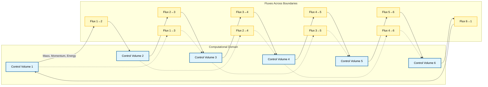
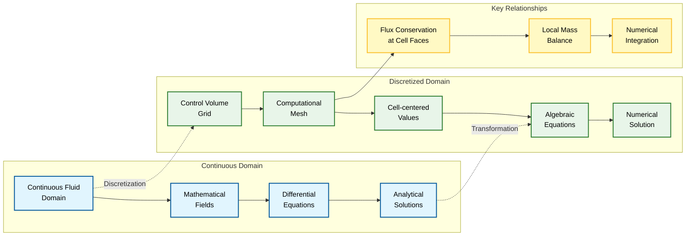
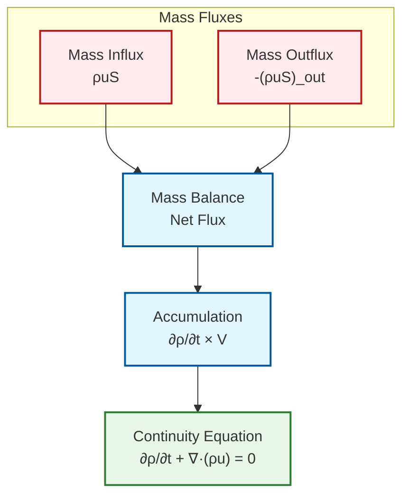
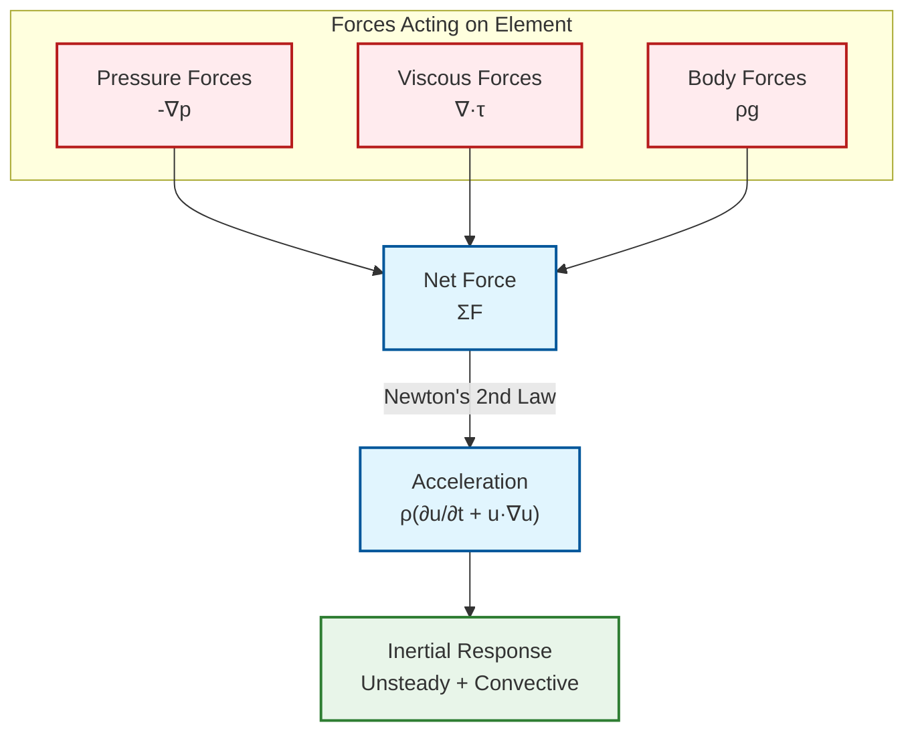
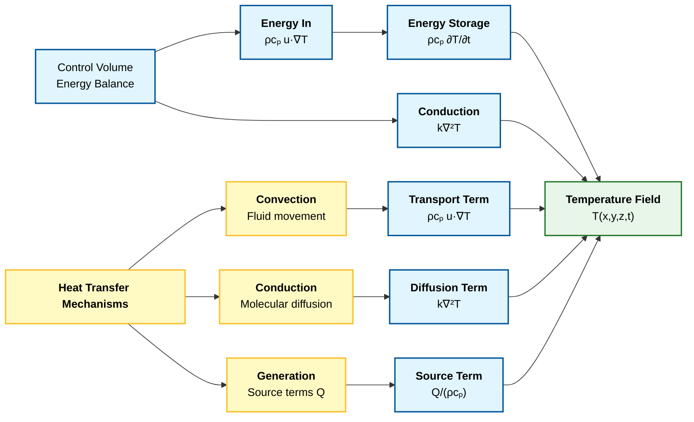
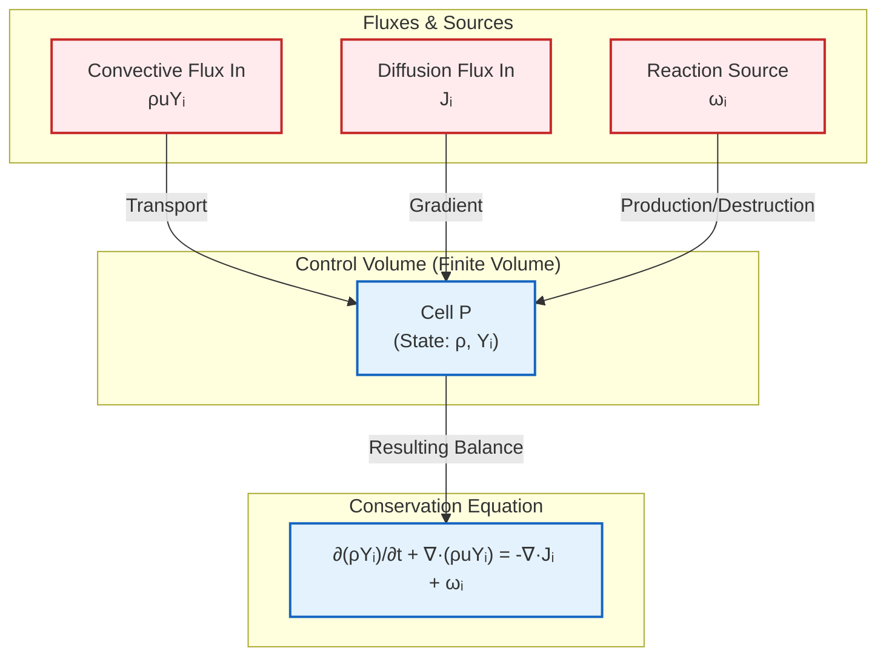
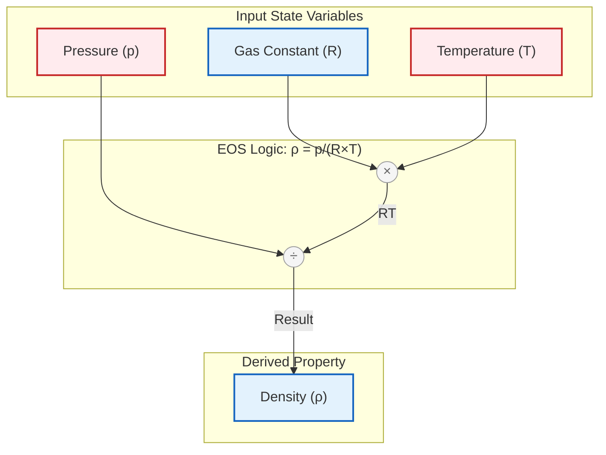
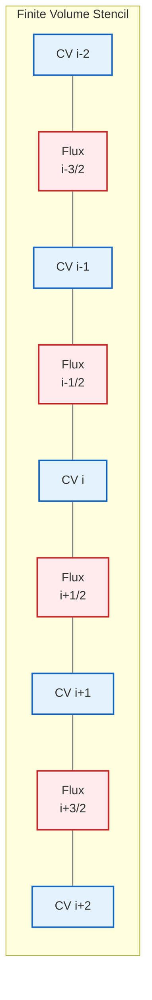

# แนวคิดพื้นฐานของ Finite Volume Method

## แนวทางการใช้ Control Volume

**Finite Volume Method** แบ่ง Computational Domain ออกเป็นชุดของ **Control Volume (Cells)** ที่ไม่ทับซ้อนกัน โดย:

- **Governing Equations** จะถูกอินทิเกรตเหนือ Control Volume แต่ละอัน
- รับประกันการอนุรักษ์มวล โมเมนตัม และพลังงานในระดับท้องถิ่น (local conservation)
- เป็นรากฐานทางคณิตศาสตร์ของ **Computational Framework ของ OpenFOAM**
- วิธีการที่เข้มงวดในการ Discretize **Partial Differential Equations** โดยยังคงรักษ์ Conservation Laws พื้นฐานทางฟิสิกส์ไว้


> **Figure 1:** การแบ่งโดเมนการคำนวณออกเป็นปริมาตรควบคุม (เซลล์) ที่ไม่ทับซ้อนกัน แสดงการไหลของมวล โมเมนตัม และพลังงาน (ฟลักซ์) ข้ามขอบเขตระหว่างเซลล์ที่อยู่ติดกัน


### หลักการสมดุล

แนวทางการใช้ Control Volume สามารถเข้าใจได้ผ่านการเปรียบเทียบ:

**ลองจินตนาการ** การแบ่ง Fluid Domain ที่ต่อเนื่องออกเป็นกล่องเล็กๆ หรือ **Control Volume** ที่แยกจากกัน:

1. **สำหรับแต่ละกล่อง**: พิจารณา Fluxes (การไหล) ทั้งหมดที่ข้ามผ่านขอบเขต
2. **การสมดุล**: การเปลี่ยนแปลงสุทธิของปริมาณที่อนุรักษ์ = ปริมาณที่ไหลเข้า - ปริมาณที่ไหลออก + Sources/Sinks
3. **หลักการทางฟิสิกส์**: สิ่งที่เข้า + สิ่งที่ถูกสร้าง = สิ่งที่ออก + สิ่งที่ถูกทำลาย + การเปลี่ยนแปลงในระบบ

### จากมุมมองการคำนวณ

**Control Volume แต่ละอัน** จะกลายเป็น **Computational Cell** ที่เราเก็บและแก้สมการคณิตศาสตร์ โดยมีลักษณะสำคัญ:

- **Local Conservation**: การอนุรักษ์ที่แม่นยำในระดับ Cell แต่ละอัน
- **Flux Balance**: การคำนวณ Fluxes ที่ขอบเขทของ Cell
- **Source Terms**: การรวม Sources หรือ Sinks ภายใน Cell


> **Figure 2:** ความสัมพันธ์ระหว่างโดเมนแบบต่อเนื่องและโดเมนแบบดิสครีต แสดงกระบวนการแปลงสมการเชิงอนุพันธ์และฟิลด์ทางคณิตศาสตร์ให้เป็นระบบสมการพีชคณิตและค่าตัวแปรประจำเซลล์ที่สามารถหาผลเฉลยเชิงตัวเลขได้


### การอนุรักษ์มวล (Mass Conservation)

**สมการความต่อเนื่อง** (continuity equation) แสดงหลักการอนุรักษ์มวลในระบบของไหล


> **Figure 3:** การหาที่มาของสมการความต่อเนื่องผ่านสมดุลมวลบนปริมาตรควบคุม โดยการรักษาสมดุลระหว่างฟลักซ์มวลที่ไหลเข้าและไหลออกกับการสะสมมวลภายในปริมาตร


**รูปแบบทั่วไป:**
$$\frac{\partial \rho}{\partial t} + \nabla \cdot (\rho \mathbf{u}) = 0$$

โดยที่:
* $\rho$ = ความหนาแน่นของของไหล (fluid density)
* $\mathbf{u}$ = เวกเตอร์ความเร็ว (velocity vector)

**สำหรับการไหลแบบอัดตัวไม่ได้** ($\rho = \text{constant}$):
$$\nabla \cdot \mathbf{u} = 0$$

เงื่อนไข **divergence-free condition** นี้ทำให้มั่นใจได้ว่าอัตราการไหลเชิงปริมาตร (volumetric flow rate) ที่ไหลเข้าสู่ปริมาตรควบคุมขนาดเล็กมาก ๆ จะเท่ากับอัตราการไหลเชิงปริมาตรที่ไหลออก ซึ่งเป็นการรักษาสภาพการอนุรักษ์มวลตลอดทั่วทั้งโดเมน (domain)

### การอนุรักษ์โมเมนตัม (Momentum Conservation)

**สมการโมเมนตัม** (momentum equation) ซึ่งได้มาจากกฎข้อที่สองของนิวตัน ควบคุมการเคลื่อนที่ของอนุภาคของไหล


> **Figure 4:** สมดุลแรงพลวัตในสมการโมเมนตัม ซึ่งแรงที่ผิว (แรงดันและแรงหนืด) และแรงภายนอก ส่งผลต่อความเร่งและการตอบสนองเชิงความเฉื่อยขององค์ประกอบของไหล


**รูปแบบทั่วไป:**
$$\rho \frac{\partial \mathbf{u}}{\partial t} + \rho (\mathbf{u} \cdot \nabla) \mathbf{u} = -\nabla p + \mu \nabla^2 \mathbf{u} + \mathbf{f}$$

โดยที่:
* $p$ = ความดันสถิต (static pressure)
* $\mu$ = ความหนืดจลน์ (dynamic viscosity)
* $\mathbf{f}$ = แรงที่กระทำต่อปริมาตร (body forces) เช่น แรงโน้มถ่วง ($\rho \mathbf{g}$)

#### การวิเคราะห์แต่ละพจน์:

**ด้านซ้ายมือ (Local + Convective Acceleration):**
* $\rho \frac{\partial \mathbf{u}}{\partial t}$ = ความเร่งเฉพาะที่ (local acceleration)
* $\rho (\mathbf{u} \cdot \nabla) \mathbf{u}$ = ความเร่งแบบพา (convective acceleration)

**ด้านขวามือ (Surface + Body Forces):**
* $-\nabla p$ = แรงดัน (pressure forces)
* $\mu \nabla^2 \mathbf{u}$ = แรงหนืด (viscous forces)
* $\mathbf{f}$ = แรงภายนอก (external body forces)

ระบบสมการเชิงอนุพันธ์ย่อยแบบไม่เชิงเส้น (nonlinear system of partial differential equations) นี้เป็นรากฐานของการวิเคราะห์พลศาสตร์ของไหล (fluid dynamics analysis) ใน OpenFOAM

### การอนุรักษ์พลังงาน (Energy Conservation)

**สมการพลังงาน** (energy equation) ควบคุมการถ่ายเทพลังงานความร้อน (thermal energy) ภายในระบบของไหล


> **Figure 5:** ส่วนประกอบของสมดุลพลังงานบนปริมาตรควบคุม แสดงกลไกการถ่ายโอนความร้อนผ่านการพา (Convection) และการนำ (Conduction) รวมถึงพจน์แหล่งกำเนิดและการสะสมพลังงาน


$$\rho c_p \frac{\partial T}{\partial t} + \rho c_p \mathbf{u} \cdot \nabla T = k \nabla^2 T + Q$$

โดยที่:
* $c_p$ = ความจุความร้อนจำเพาะที่ความดันคงที่ (specific heat capacity at constant pressure)
* $k$ = สภาพนำความร้อน (thermal conductivity)
* $Q$ = แหล่งกำเนิดความร้อน (heat sources) หรือตัวรับความร้อน (sinks) ภายในโดเมน (domain)

#### การวิเคราะห์แต่ละพจน์:

**ด้านซ้ายมือ (Temporal + Convective Energy Transport):**
* $\rho c_p \frac{\partial T}{\partial t}$ = การเปลี่ยนแปลงพลังงานความร้อนตามเวลา
* $\rho c_p \mathbf{u} \cdot \nabla T$ = การลำเลียงพลังงานความร้อนแบบพา

**ด้านขวามือ (Diffusion + Generation):**
* $k \nabla^2 T$ = การถ่ายเทความร้อนแบบนำ (conductive heat transfer) ตามกฎของฟูเรียร์ (Fourier's law)
* $Q$ = พจน์การเกิดความร้อนเชิงปริมาตร (volumetric heat generation)

**การใช้งานใน OpenFOAM:**
ใน OpenFOAM implementations สมการนี้อาจถูกแก้ในรูปของ:
* **เอนทาลปี** (enthalpy) $h$
* **พลังงานภายใน** (internal energy) $e$
* **อุณหภูมิสัมผัส** (sensible temperature)

ขึ้นอยู่กับ Thermophysical Model ที่ใช้

### การถ่ายเทชนิดสาร (Species Transport)

สำหรับการไหลแบบหลายองค์ประกอบ (multicomponent flows) ที่มีการถ่ายเทชนิดสารเคมี (chemical species transport) จะต้องแก้สมการอนุรักษ์สำหรับชนิดสาร $i$ แต่ละชนิด:


> **Figure 6:** สมดุลการถ่ายเทชนิดสารและหลักการอนุรักษ์ แสดงการเปลี่ยนแปลงตามเวลา การพา การแพร่ และพจน์การผลิตหรือทำลายจากการทำปฏิกิริยาเคมีภายในปริมาตรควบคุม


โดยที่:
* $Y_i$ = สัดส่วนมวล (mass fraction) ของชนิดสาร $i$
* $\mathbf{J}_i$ = เวกเตอร์ฟลักซ์การแพร่ (diffusive flux vector) สำหรับชนิดสาร $i$
* $\dot{\omega}_i$ = อัตราการผลิต/การทำลายสุทธิ (net rate of production/destruction) อันเนื่องมาจากปฏิกิริยาเคมี

#### กฎของฟิค (Fick's Law):

ฟลักซ์การแพร่ (diffusive flux) $\mathbf{J}_i$ โดยทั่วไปจะจำลองโดยใช้กฎของฟิคสำหรับการแพร่แบบไบนารี (binary diffusion):

$$\mathbf{J}_i = -\rho D_i \nabla Y_i$$

โดยที่:
* $D_i$ = สัมประสิทธิ์การแพร่ (diffusion coefficient) ของชนิดสาร $i$ ในสารผสม

#### เงื่อนไขการอนุรักษ์:
* สมการเหล่านี้รับรองการอนุรักษ์ชนิดสารแต่ละชนิด
* ยังคงรักษาการอนุรักษ์มวลโดยรวมผ่านสมการความต่อเนื่อง
* ผลรวมของสัดส่วนมวลของชนิดสารทั้งหมดจะต้องเป็นไปตาม $\sum_i Y_i = 1$ ณ ทุกจุดในโดเมน (domain)

### สมการสภาวะ (Equation of State)

**สมการสภาวะ** (equation of state) ให้ความสัมพันธ์ทางอุณหพลศาสตร์ระหว่างความดัน ความหนาแน่น และอุณหภูมิ ซึ่งเป็นการปิดระบบสมการควบคุม (governing equations)


> **Figure 7:** ความสัมพันธ์ทางอุณหพลศาสตร์ในสมการสถานะ ซึ่งปิดระบบสมการควบคุมโดยการเชื่อมโยงความดัน อุณหภูมิ และความหนาแน่นผ่านค่าคงที่ของก๊าซ


สำหรับก๊าซในอุดมคติ ความสัมพันธ์แสดงได้ดังนี้:

$$p = \rho R T$$

โดยที่:
* $R$ = ค่าคงที่ของก๊าซจำเพาะ (specific gas constant)

#### การใช้งานใน OpenFOAM:

ใน OpenFOAM สิ่งนี้ถูกนำไปใช้ผ่านคลาส Thermophysical Model เช่น:

| Model | Description | Use Case |
|-------|-------------|----------|
| `perfectGas` | ก๊าซในอุดมคติ | ก๊าซที่มีอุณหภูมิสูงและความดันต่ำ |
| `icoPolynomial` | พหุนามความหนาแน่นคงที่ | ของไหลอัดตัวไม่ได้ที่มีคุณสมบัติแปรผันตามอุณหภูมิ |
| `hPolynomial` | พหุนามเอนทาลปี | ของไหลที่มีความสัมพันธ์อุณหภูมิ-เอนทาลปีซับซ้อน |

#### ผลกระทบของการเลือกโมเดล:

การเลือกโมเดลสมการสภาวะ (equation of state model) ที่เหมาะสมส่งผลกระทบอย่างมากต่อ:

* **การเชื่อมโยงระหว่างสมการโมเมนตัมและพลังงาน**
* **การจำลองการไหลแบบอัดตัวได้** (compressible flow simulations)
* **บทบาทของการเปลี่ยนแปลงความหนาแน่นในพลศาสตร์ของการไหล**

**สำหรับการไหลแบบอัดตัวไม่ได้** (incompressible flows) ความหนาแน่นจะถือว่าคงที่ ทำให้ไม่จำเป็นต้องใช้ความสัมพันธ์ของสมการสภาวะที่ชัดเจน

---

## รูปแบบสมการทั่วไป (General Form)

สำหรับสมการการอนุรักษ์ทั่วไปในรูปแบบ:

$$\frac{\partial \phi}{\partial t} + \nabla \cdot \mathbf{F}(\phi) = S(\phi)$$

**นิยามตัวแปร:**
- $\phi$: ปริมาณที่ถูกอนุรักษ์ (conserved quantity)
- $\mathbf{F}$: เวกเตอร์ฟลักซ์ (flux vector)
- $S$: เทอมแหล่งกำเนิด (source term)

FVM จะทำการประมาณค่าแบดิสครีตสำหรับรูปแบบอินทิกรัลเหนือปริมาตรควบคุม $V$:

$$\int_V \frac{\partial \phi}{\partial t} \, \mathrm{d}V + \int_V \nabla \cdot \mathbf{F}(\phi) \, \mathrm{d}V = \int_V S(\phi) \, \mathrm{d}V$$

## คุณสมบัติการอนุรักษ์และการจัดการข้อผิดพลาด

### คุณสมบัติการอนุรักษ์โดยธรรมชาติ

จุดแข็งของ Finite Volume Method อยู่ที่คุณสมบัติการอนุรักษ์โดยธรรมชาติ:

- **การไหลออก (outflow)** จากเซลล์หนึ่งจะกลายเป็น **การไหลเข้า (inflow)** สู่เซลล์ที่อยู่ติดกัน
- **รับประกันการอนุรักษ์โดยรวม (global conservation)** โดยไม่คำนึงถึงคุณภาพของ Mesh
- **สำคัญอย่างยิ่ง**สำหรับปัญหาที่เกี่ยวข้องกับ Shocks, Discontinuities


> **Figure 8:** คุณสมบัติการอนุรักษ์โดยธรรมชาติใน FVM แสดงให้เห็นว่าฟลักซ์ที่ไหลออกจากเซลล์หนึ่งจะกลายเป็นฟลักซ์ที่ไหลเข้าสู่เซลล์ข้างเคียงโดยตรง ทำให้มั่นใจในความถูกต้องของการอนุรักษ์ในระดับรวม


OpenFOAM ใช้กลไกการจัดการข้อผิดพลาด (error handling) และการควบคุมคุณภาพ (quality control) ที่ซับซ้อน:

#### 1. ความสอดคล้องของ Face Flux (Face Flux Consistency)
- **รับประกันว่า Face Fluxes จะถูกคำนวณเพียงครั้งเดียว**
- **นำไปใช้อย่างสอดคล้องกับเซลล์ที่อยู่ติดกันทั้งสองเซลล์**ในระหว่างการประกอบ Matrix

#### 2. การรวม Boundary Condition (Boundary Condition Integration)
- **การจัดการพิเศษสำหรับ Boundary Faces**
- **ทำให้มั่นใจว่า Boundary Conditions ถูกรวมเข้ากับสมการดิสครีตอย่างเหมาะสม**
- **ยังคงรักษาการอนุรักษ์ไว้**

#### 3. ความทนทานต่อคุณภาพ Mesh (Mesh Quality Robustness)
- **รองรับ Mesh ที่ไม่เป็น Orthogonal และ Skewed**
- **ผ่าน Correction Schemes และ Iterative Procedures**
- **ช่วยปรับปรุงความแม่นยำบนรูปทรงเรขาคณิตที่ซับซ้อน**

#### 4. ระบบ Sparse Matrix (Sparse Matrix Systems)
- **สมการที่ถูกประมาณค่าแบดิสครีตจะถูกประกอบเข้าเป็น Sparse Matrix Systems**
- **สามารถหาคำตอบได้อย่างมีประสิทธิภาพโดยใช้วิธี Iterative Methods**
- **พร้อมกับ Preconditioners ที่เหมาะสม**

**OpenFOAM Code Implementation:**
```cpp
// Create and solve sparse matrix system for transport equation
// สร้างและแก้ระบบเมทริกซ์เบาบสำหรับสมการขนส่ง
fvScalarMatrix phiEqn
(
    // Temporal derivative term - unsteady contribution
    fvm::ddt(phi)
    // Convective term - transport due to fluid motion
  + fvm::div(phi, U)
    // Diffusive term - Laplacian diffusion with coefficient D
  - fvm::laplacian(D, phi)
    // Source term on right-hand side
 ==
    Su
);

// Solve the linear system to obtain new phi field
// แก้ระบบเชิงเส้นเพื่อหาฟิลด์ phi ใหม่
phiEqn.solve();
```

> **📂 Source:** `.applications/solvers/multiphase/multiphaseEulerFoam/phaseSystems/phaseSystem/phaseSystemSolve.C`
> 
> **คำอธิบาย (Explanation):** โค้ดตัวอย่างนี้แสดงการใช้งานคลาส `fvScalarMatrix` ใน OpenFOAM เพื่อสร้างและแก้สมการขนส่งแบบดิสครีต ซึ่งประกอบด้วย:
> - **Temporal derivative** (`fvm::ddt`) - พจน์อนุพันธ์เชิงเวลาสำหรับการคำนวณแบบไม่สถานะ
> - **Convective term** (`fvm::div`) - พจน์การพาแบบอิงปริมาตร (implicit)
> - **Diffusive term** (`fvm::laplacian`) - พจน์การแพร่แบบ Laplacian
> - **Source term** (`Su`) - เทอมแหล่งกำเนิดบนด้านขวามือของสมการ
> 
> **Key Concepts:**
> - **Finite Volume Discretization**: การแปลงสมการเชิงอนุพันธ์ให้เป็นระบบเชิงเส้นเบาบ (sparse linear system)
> - **Implicit vs Explicit**: การใช้ `fvm::` (finite volume method/implicit) แทน `fvc::` (finite volume calculus/explicit)
> - **Matrix Assembly**: การประกอบเมทริกซ์จากการ discretization แต่ละพจน์
> - **Linear Solver**: การเรียก `solve()` เพื่อแก้ระบบสมการเชิงเส้นด้วย iterative solvers

---

## การเชื่อมโยง Pressure-Velocity (Pressure-Velocity Coupling)

การเชื่อมโยงระหว่าง Pressure และ Velocity Fields เป็นสิ่งสำคัญของการจำลอง Incompressible Flow

| Algorithm | ลักษณะการทำงาน | รอบการทำซ้ำ | ข้อดี | ข้อเสีย |
|-----------|-----------------|---------------|--------|----------|
| **SIMPLE** | Sequential solution with under-relaxation | Multiple per time step | Robust, steady-state | Slow convergence |
| **PISO** | Multiple pressure corrections per time step | 2-3 corrections per step | Accurate for transient | Can be unstable |
| **PIMPLE** | Hybrid SIMPLE + PISO | Flexible | Good for both steady/transient | More complex |

### SIMPLE Algorithm Steps:
1. แก้สมการ Momentum ด้วย Pressure ที่คาดเดา $p^*$
2. แก้สมการ Pressure Correction
3. แก้ไข Pressure และ Velocity Fields
4. อัปเดต Turbulence และ Scalar Fields อื่นๆ
5. ตรวจสอบ Convergence (ทำซ้ำหากจำเป็น)

### PISO Algorithm Steps:
1. ทำนาย Velocity Field $\mathbf{u}^*$
2. แก้สมการ Pressure
3. แก้ไข Velocity Field
4. ทำซ้ำการแก้ไข Pressure-Velocity 2-3 ครั้ง
5. ก้าวไปสู่ Time Step ถัดไป

---

## ข้อดีและข้อจำกัดของ Finite Volume Method

### ข้อดี:

> [!INFO] **ข้อดีหลักของ FVM**
> - **การอนุรักษ์โดยธรรมชาติ**: รับประกันการอนุรักษ์ในระดับจากเซลล์
> - **ความยืดหยุ่นของ Mesh**: รองรับ Unstructured Meshes ที่ซับซ้อน
> - **การจัดการ Boundary Condition**: ใช้งานง่ายกับเรขาคณิตที่ซับซ้อน
> - **ประสิทธิภาพ**: Sparse Matrix Systems ที่สามารถแก้ไขได้อย่างมีประสิทธิภาพ
> - **ความแม่นยำ**: สามารถใช้ Higher-Order Schemes ได้

### ข้อจำกัด:

> [!WARNING] **ข้อจำกัดที่ต้องพิจารณา**
> - **ความซับซ้อนของ Discretization**: ต้องการ Interpolation Schemes ที่เหมาะสม
> - **Numerical Diffusion**: อาจเกิดจาก First-Order Schemes
> - **ความละเอียดของ Mesh**: ต้องการ Mesh ที่ละเอียดสำหรับ Gradient สูง
> - **เวลาคำนวณ**: การแก้ Implicit Systems อาจใช้เวลานาน

---

## สรุป

**Finite Volume Method** เป็นกรอบการทำงานที่มีประสิทธิภาพสำหรับการจำลอง CFD ซึ่ง:

1. **แบ่ง Domain** ออกเป็น Control Volumes ที่ไม่ทับซ้อนกัน
2. **อินทิเกรต** สมการควบคุมเหนือแต่ละ Control Volume
3. **ใช้ Divergence Theorem** แปลง Volume Integrals เป็น Surface Integrals
4. **ประมาณค่า Fluxes** ที่ Face Boundaries ด้วย Interpolation Schemes
5. **สร้าง Sparse Linear Systems** ที่สามารถแก้ไขได้อย่างมีประสิทธิภาพ

ใน OpenFOAM กรอบการทำงานนี้ถูกนำไปใช้ผ่าน Class `fvMatrix` ซึ่งให้การดำเนินการ Discretization ที่สม่ำเสมอและมีประสิทธิภาพสำหรับสมการ Conservation ทั้งหมด