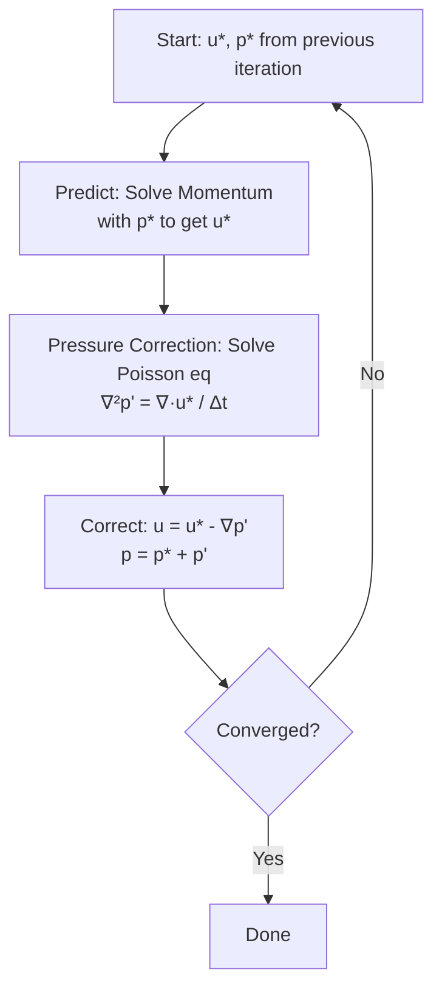

# Physics & Governing Equations in FVM Context

> **Learning Objectives**
> - Understand the governing equations (mass, momentum, energy) and their physical meaning
> - Learn how these equations are discretized using the Finite Volume Method
> - Grasp the pressure-velocity coupling challenge and solution algorithms
> - Recognize the general transport equation form that underlies all CFD problems

> **Prerequisites**
> - Familiarity with basic calculus (partial derivatives, divergence, gradient)
> - Understanding of vectors and tensor notation
> - Knowledge of fluid mechanics fundamentals from [01_Introduction](01_Introduction.md)

---

## What Equations Are We Discretizing?

> **Why This Matters:**
> CFD solvers don't "simulate" fluid flow — they solve mathematical equations that describe fluid physics. Understanding **what** equations we solve and **why** they take their specific form is fundamental to debugging convergence issues, choosing appropriate schemes, and interpreting results correctly.

The Finite Volume Method (FVM) provides the framework for **discretization** — converting continuous partial differential equations (PDEs) into algebraic equations solvable on computers. Before discretizing, we must understand the physics:

```
Continuous Physics (PDEs) → FVM Discretization → Algebraic System → Numerical Solution
         ↑                                                                 ↓
         └─────────────────── This file covers this step ───────────────────┘
```

---

## General Transport Equation

> **The Universal Form:**
> ALL conservation laws in fluid dynamics can be written in this single form:

$$\underbrace{\frac{\partial (\rho \phi)}{\partial t}}_{\text{Time Derivative}} + \underbrace{\nabla \cdot (\rho \mathbf{u} \phi)}_{\text{Convection}} = \underbrace{\nabla \cdot (\Gamma_\phi \nabla \phi)}_{\text{Diffusion}} + \underbrace{S_\phi}_{\text{Source}}$$

| Symbol | Meaning | Physical Interpretation |
|--------|---------|------------------------|
| $\phi$ | General scalar | Mass (1), momentum (u, v, w), energy (T or h), turbulence quantities (k, ε, ω) |
| $\rho$ | Density | Fluid density (constant for incompressible, variable for compressible) |
| $\mathbf{u}$ | Velocity vector | Flow field $(u, v, w)$ |
| $\Gamma_\phi$ | Diffusion coefficient | Viscosity (μ) for momentum, thermal conductivity (k) for energy |
| $S_\phi$ | Source term | Body forces, pressure gradients, heat sources, turbulence production |

> **Why This Form Matters:**
> - **Code Efficiency:** OpenFOAM uses a single discretization template for ALL equations
> - **Understanding:** Master this form → understand ALL solver implementations
> - **Debugging:** Errors manifest differently in each term (instability → convection, slow convergence → diffusion)

**For incompressible flow** ($\rho = \text{constant}$), this simplifies to:

$$\frac{\partial \phi}{\partial t} + \nabla \cdot (\mathbf{u} \phi) = \nabla \cdot (D \nabla \phi) + S$$

where $D = \Gamma_\phi / \rho$ is the kinematic diffusion coefficient.

---

## FVM Discretization of the Transport Equation

### Integral Form

FVM begins by integrating the transport equation over a **control volume** (cell):

$$\int_V \frac{\partial \phi}{\partial t} dV + \int_V \nabla \cdot (\mathbf{u} \phi) dV = \int_V \nabla \cdot (D \nabla \phi) dV + \int_V S dV$$

Applying the **divergence theorem** to convert volume integrals of divergences to surface integrals:

$$\underbrace{\int_V \frac{\partial \phi}{\partial t} dV}_{\text{Accumulation}} + \underbrace{\oint_A (\mathbf{u} \phi) \cdot d\mathbf{A}}_{\text{Convection Flux}} = \underbrace{\oint_A (D \nabla \phi) \cdot d\mathbf{A}}_{\text{Diffusion Flux}} + \underbrace{\int_V S dV}_{\text{Source}}$$

### Discrete Form (Single Cell)

For a single cell $P$ with volume $V_P$ and faces $f$:

$$\underbrace{V_P \frac{\phi_P^{n+1} - \phi_P^n}{\Delta t}}_{\text{Temporal Change}} + \underbrace{\sum_f \mathbf{F}_f \cdot \mathbf{S}_f \phi_f}_{\text{Net Convection}} = \underbrace{\sum_f D_f (\nabla \phi)_f \cdot \mathbf{S}_f}_{\text{Net Diffusion}} + \underbrace{V_P S_P}_{\text{Source}}$$

where:
- $\mathbf{F}_f = \mathbf{u}_f \cdot \mathbf{S}_f$ = volumetric flux through face $f$ [m³/s]
- $\mathbf{S}_f$ = face area vector (magnitude = face area, direction = outward normal)
- $\phi_f$ = value of $\phi$ at the face (obtained via interpolation — see [03_Spatial_Discretization](03_Spatial_Discretization.md))
- $(\nabla \phi)_f$ = gradient of $\phi$ at the face

**This is the equation that OpenFOAM solves for EVERY variable!**

---

## Individual Conservation Equations

Each conservation law is a specific case of the general transport equation with appropriate $\phi$, $\Gamma_\phi$, and $S_\phi$:

### 1. Mass Conservation (Continuity Equation)

**For $\phi = 1$ (mass fraction per unit mass):**

$$\frac{\partial \rho}{\partial t} + \nabla \cdot (\rho \mathbf{u}) = 0$$

**FVM Discrete Form:**

$$\frac{(\rho_P V_P)^{n+1} - (\rho_P V_P)^n}{\Delta t} + \sum_f \rho_f \mathbf{F}_f \cdot \mathbf{S}_f = 0$$

**For incompressible flow** ($\rho = \text{constant}$):

$$\nabla \cdot \mathbf{u} = 0 \quad \Rightarrow \quad \sum_f \mathbf{F}_f \cdot \mathbf{S}_f = 0$$

> **Physical Meaning:**
> - **Rate of mass accumulation** + **Net mass flux out** = 0
> - Mass cannot be created or destroyed
> - For incompressible flow: volume flux into cell = volume flux out of cell

> **Why This Equation Is Special:**
> - **No time derivative** for steady incompressible flow → acts as a **constraint**
> - **No pressure variable** → doesn't form a standalone equation
> - **Used to derive pressure equation** in pressure-velocity coupling algorithms
> - **NOT solved directly** — instead, pressure correction enforces $\nabla \cdot \mathbf{u} = 0$

**OpenFOAM Implementation:**
```cpp
// Continuity is enforced via pressure correction (see below)
// Not solved as a standalone equation
```

---

### 2. Momentum Conservation (Navier-Stokes Equation)

**For $\phi = \mathbf{u}$ (velocity vector):**

$$\rho \frac{\partial \mathbf{u}}{\partial t} + \rho (\mathbf{u} \cdot \nabla) \mathbf{u} = -\nabla p + \mu \nabla^2 \mathbf{u} + \mathbf{f}$$

**Term-by-Term Breakdown:**

| Term | Mathematical Form | Physical Meaning | OpenFOAM Operator |
|------|-------------------|------------------|-------------------|
| **Unsteady** | $\rho \frac{\partial \mathbf{u}}{\partial t}$ | Local acceleration: rate of velocity change at a fixed point | `fvm::ddt(rho, U)` |
| **Convection** | $\rho (\mathbf{u} \cdot \nabla) \mathbf{u}$ | Inertial force: fluid momentum transport (NONLINEAR!) | `fvm::div(phi, U)` |
| **Pressure Gradient** | $-\nabla p$ | Surface force: pressure pushes from high to low | `fvc::grad(p)` (explicit) |
| **Diffusion** | $\mu \nabla^2 \mathbf{u}$ | Viscous force: friction dampens velocity gradients | `fvm::laplacian(mu, U)` |
| **Source** | $\mathbf{f}$ | Body forces: gravity, buoyancy, centrifugal | `SU` or `Sp` functions |

**FVM Discrete Form (for x-component $u$):**

$$\rho V_P \frac{u_P^{n+1} - u_P^n}{\Delta t} + \rho \sum_f \mathbf{F}_f \cdot \mathbf{S}_f u_f = -\sum_f p_f \mathbf{S}_f^x + \mu \sum_f (\nabla u)_f \cdot \mathbf{S}_f + V_P f^x_P$$

**Key Challenges:**

1. **Nonlinearity (Convection Term):**
   - Contains $\mathbf{u} \cdot \nabla \mathbf{u}$ — velocity multiplied by its own gradient
   - Requires **linearization** (use previous iteration values for $\mathbf{F}_f = \rho \mathbf{u}_f \cdot \mathbf{S}_f$)
   - Can cause **instability** if upwind direction is not respected

2. **Pressure-Velocity Coupling:**
   - Pressure gradient $-\nabla p$ drives flow BUT pressure is unknown
   - Continuity provides constraint BUT has no pressure
   - Requires **special algorithms** (SIMPLE, PISO, PIMPLE — see below)

3. **Boundary Conditions:**
   - Velocity specified at walls (no-slip: $\mathbf{u} = 0$)
   - Pressure specified at inlets/outlets
   - Cannot specify both velocity AND pressure at same boundary (over-specified)

> **⚠️ Critical Insight: The Convection Challenge**
> The convection term $\rho (\mathbf{u} \cdot \nabla) \mathbf{u}$ is the PRIMARY source of:
> - **Nonlinearity** → requires iteration
> - **Instability** → requires upwind schemes or limiters
> - **Convergence difficulty** → dominant at high Reynolds numbers
> 
> **Why:** Information travels **with the flow** (hyperbolic character), unlike diffusion which spreads in all directions (elliptic/parabolic). This requires **upwind-biased discretization** — see [03_Spatial_Discretization](03_Spatial_Discretization.md).

**OpenFOAM Implementation (Vector form):**
```cpp
// Momentum equation for incompressible flow
fvVectorMatrix UEqn
(
    fvm::ddt(U)                    // ∂u/∂t
  + fvm::div(phi, U)               // ∇·(uu) — nonlinear!
  - fvm::laplacian(nu, U)          // ν∇²u
 ==
    - fvc::grad(p)                 // -∇p — explicit!
  + SU                              // Source terms (e.g., gravity)
);
```

> **💡 Why is pressure gradient `fvc::grad(p)` (explicit)?**
> Because pressure $p$ is obtained from a **separate** pressure correction equation. At the current iteration, $p$ is "known" from the previous correction step, so $\nabla p$ is computed explicitly and added as a source term to the momentum matrix.

---

### 3. Energy Conservation

**For $\phi = T$ (temperature) or $h$ (enthalpy):**

$$\rho c_p \frac{\partial T}{\partial t} + \rho c_p \mathbf{u} \cdot \nabla T = k \nabla^2 T + Q$$

**When Is This Required?**

| Scenario | Solve Energy? | Reason |
|----------|---------------|--------|
| **Isothermal incompressible flow** (e.g., water at 20°C in a pipe) | ❌ No | ρ and μ constant → decoupled from momentum |
| **Heat transfer problems** | ✅ Yes | Temperature affects buoyancy (natural convection) or is output of interest |
| **Compressible flow** | ✅ Yes | ρ depends on T via equation of state |
| **Reacting flows** | ✅ Yes | Reaction rates depend on T |

**FVM Discrete Form:**

$$\rho c_p V_P \frac{T_P^{n+1} - T_P^n}{\Delta t} + \rho c_p \sum_f \mathbf{F}_f \cdot \mathbf{S}_f T_f = k \sum_f (\nabla T)_f \cdot \mathbf{S}_f + V_P Q_P$$

**OpenFOAM Implementation:**
```cpp
// Energy equation (temperature form)
fvScalarMatrix TEqn
(
    fvm::ddt(T)
  + fvm::div(phi, T)
  - fvm::laplacian(alpha, T)  // α = k/(ρ·c_p) = thermal diffusivity
 ==
    Source/vol               // Volumetric heat source
);
```

**Coupling with Momentum:**
- For **natural convection**, $T$ affects density via Boussinesq approximation: $\rho = \rho_0[1 - \beta(T - T_0)]$
- Buoyancy force added to momentum: $\mathbf{f}_{buoyancy} = \rho \mathbf{g} \beta (T - T_0)$

---

## Pressure-Velocity Coupling: The Core Challenge

> **The "Chicken-and-Egg" Problem:**
> 
> ```
> ┌─────────────────────────────────────────────────────┐
> │                                                     │
> │   Momentum Eq:  ∂u/∂t + (u·∇)u = -∇p + ν∇²u        │
> │                         ↑                           │
> │                         │                           │
> │                    Need p to solve for u           │
> │                         │                           │
> │                         │                           │
> │   Continuity Eq:      ∇·u = 0                      │
> │                         ↑                           │
> │                         │                           │
> │              Use u to constrain p                  │
> │                                                     │
> └─────────────────────────────────────────────────────┘
> ```
> 
> - To solve momentum → need pressure $p$
> - To find pressure $p$ → need velocity $\mathbf{u}$ (to satisfy continuity)
> - But $\mathbf{u}$ depends on $p$!

### Solution: Projection Methods

The strategy is to **decouple** pressure and velocity using a **predictor-corrector** approach:



### Three Main Algorithms

| Algorithm | Full Name | Application | Key Features |
|-----------|-----------|-------------|--------------|
| **SIMPLE** | Semi-Implicit Method for Pressure-Linked Equations | Steady-state problems | Iterative convergence with under-relaxation |
| **PISO** | Pressure-Implicit with Splitting of Operators | Transient problems with small Δt | Multiple corrector steps per time step |
| **PIMPLE** | PISO + SIMPLE | Transient problems with large Δt (coarse time steps) | Hybrid: outer SIMPLE-like loop + inner PISO correctors |

#### SIMPLE Algorithm (Steady-State)

```
for (int iter = 0; iter < maxIter; iter++)
{
    // 1. Guess pressure field p* (initially = 0 or previous)
    
    // 2. Solve momentum equation with p* → get intermediate velocity u*
    solve(fvm::ddt(U) + fvm::div(phi, U) - fvm::laplacian(nu, U) == -fvc::grad(p*));
    
    // 3. Solve pressure correction equation
    //    Derived from: ∇·u = 0
    //    Results in:  ∇·(∇p') = ∇·u* / Δt  (Poisson equation)
    solve(fvm::laplacian(1/A, p') == fvc::div(phi)/A);
    
    // 4. Correct pressure and velocity
    p = p* + alpha_p * p';      // alpha_p = under-relaxation factor (0.1-0.5)
    U = U* - (1/A) * grad(p');  // A = matrix diagonal coefficients
    
    // 5. Check convergence (residuals of p and U)
    if (max(residual_p, residual_U) < tolerance) break;
}
```

**Under-relaxation factors** (vital for stability):
- $\alpha_p = 0.1$ - $0.3$ (pressure)
- $\alpha_U = 0.5$ - $0.7$ (velocity)

> **Why Under-Relaxation?**
> - SIMPLE assumes $p$ and $\mathbf{u}$ are "kind of" coupled
> - Without under-relaxation → pressure corrections overshoot → divergence
> - Trade-off: slower convergence but stable

#### PISO Algorithm (Transient)

```
for (int timeStep = 0; timeStep < nSteps; timeStep++)
{
    for (int corrector = 0; corrector < nCorrectors; corrector++)
    {
        // 1. Solve momentum with current p
        solve(fvm::ddt(U) + fvm::div(phi, U) - fvm::laplacian(nu, U) == -fvc::grad(p));
        
        // 2. Solve pressure correction
        solve(fvm::laplacian(1/A, p') == fvc::div(phi)/A);
        
        // 3. Correct WITHOUT under-relaxation
        p += p';
        U -= (1/A) * grad(p');
    }
}
```

**Key differences from SIMPLE:**
- No under-relaxation (small Δt provides stability)
- Multiple corrector loops per time step (typically 2-4)
- Each corrector improves satisfaction of $\nabla \cdot \mathbf{u} = 0$
- Accuracy improves with corrector iterations

#### PIMPLE (Hybrid)

Combines SIMPLE outer iterations with PISO inner correctors:

```cpp
PIMPLE
{
    nOuterCorrectors 10;    // SIMPLE-like outer iterations
    nCorrectors      2;     // PISO-like inner correctors
    nNonOrthogonalCorrectors 0;
    
    // Under-relaxation for outer loop
    relTol          0.01;   // Relative tolerance
    residualControl
    {
        p       1e-4;
        U       1e-4;
    }
}
```

**When to use PIMPLE?**
- Large time steps (Co number > 1)
- Transient simulations where per-time-step convergence is critical
- Complex physics (multiphase, combustion, heat transfer)

---

## FVM vs fvc: Conceptual Understanding

> **💡 The Fundamental Distinction in OpenFOAM**

OpenFOAM provides two ways to evaluate spatial derivatives — this distinction is CRITICAL for understanding how discretization works:

| Prefix | Full Name | Mathematical Operation | Usage | Result |
|--------|-----------|------------------------|-------|--------|
| **`fvm::`** | Finite Volume **Matrix** | Implicit discretization | For **unknown** variables being solved | Matrix coefficients (diagonal, off-diagonal, source) |
| **`fvc::`** | Finite Volume **Calculated** | Explicit evaluation | For **known** variables from previous iteration | Numerical value (field) |

### When to Use Which?

**Use `fvm::`** (Implicit) when:
- The variable is **unknown** in the current iteration (e.g., solving for $\phi$)
- You want **numerical stability** (larger time steps possible)
- Example: `fvm::ddt(T)`, `fvm::div(phi, U)`, `fvm::laplacian(nu, U)`

**Use `fvc::`** (Explicit) when:
- The variable is **known** from the previous iteration/time step
- You want **computational speed** (fewer matrix coefficients)
- Example: `fvc::grad(p)` (p is known from pressure correction), `fvc::div(phi)` (flux is fixed)

### Impact on Matrix Assembly

For a generic transport equation:

```cpp
fvScalarMatrix phiEqn
(
    fvm::ddt(rho, phi)              // IMPLICIT: adds to diagonal & off-diagonal
  + fvm::div(phi, U)                // IMPLICIT: adds to diagonal & off-diagonal
  - fvm::laplacian(Gamma, phi)      // IMPLICIT: adds to diagonal & off-diagonal
 ==
    fvc::div(S)                     // EXPLICIT: adds only to source term
  + Su                              // Explicit source
);
```

**Resulting matrix structure:**

$$
\underbrace{\begin{bmatrix}
a_P & a_N & \cdots \\
a_N & a_P & \cdots \\
\vdots & \vdots & \ddots
\end{bmatrix}}_{\text{From fvm:: terms}
\begin{bmatrix}
\phi_P \\ \phi_N \\ \vdots
\end{bmatrix}
= \underbrace{\begin{bmatrix}
b_P \\ b_N \\ \vdots
\end{bmatrix}}_{\text{From fvc:: terms + sources}
$$

- **`fvm::`** → modifies matrix coefficients ($a_P$, $a_N$, etc.)
- **`fvc::`** → modifies right-hand-side vector ($b_P$, $b_N$)

> **⚠️ Critical Rule:**
> 
> - **Implicit (fvm)** = Unconditionally stable but computationally expensive per iteration
> - **Explicit (fvc)** = Conditionally stable (Δt limited by CFL condition) but cheap
> 
> **Practical guidance:** Use `fvm::` for the variable you're solving. Use `fvc::` for coupling terms involving other variables.

**Example: Why pressure gradient is explicit in momentum:**
```cpp
// Momentum equation solving for U
fvVectorMatrix UEqn
(
    fvm::ddt(U)
  + fvm::div(phi, U)          // IMPLICIT: U is unknown
  - fvm::laplacian(nu, U)     // IMPLICIT: U is unknown
 ==
    - fvc::grad(p)             // EXPLICIT: p is known from pressure correction
);

// p' equation (pressure correction)
fvScalarMatrix pEqn
(
    fvm::laplacian(1/A, p')    // IMPLICIT: p' is unknown
 ==
    fvc::div(phi)              // EXPLICIT: phi uses U from momentum
);
```

This **decoupling** enables the predictor-corrector approach!

---

## Summary: The Equation System in OpenFOAM

At each iteration (or time step), OpenFOAM solves a **coupled system** of equations:

```
┌──────────────────────────────────────────────────────────────┐
│                    INCOMPRESSIBLE FLOW                        │
├──────────────────────────────────────────────────────────────┤
│ 1. Momentum:      ∂u/∂t + ∇·(uu) = -∇p + ν∇²u + f            │
│    → Solved for:  U (velocity)                               │
│    → Requires:   p (from step 2)                             │
│    → Uses:        fvm::ddt, fvm::div, fvm::laplacian         │
│                  fvc::grad (pressure - explicit)             │
├──────────────────────────────────────────────────────────────┤
│ 2. Pressure:      ∇²p' = (ρ/Δt) ∇·u*                         │
│    → Solved for:  p' (pressure correction)                  │
│    → Requires:   u* (from step 1)                            │
│    → Uses:        fvm::laplacian (implicit)                  │
│                  fvc::div (explicit divergence)              │
├──────────────────────────────────────────────────────────────┤
│ 3. Correction:   u = u* - ∇p'/A                              │
│                  p = p* + α·p'                                │
│    → Updates:    velocity and pressure fields                │
├──────────────────────────────────────────────────────────────┤
│ 4. Energy:       ∂T/∂t + ∇·(uT) = α∇²T + Q                   │
│    → Solved for:  T (temperature)                            │
│    → Coupled via: Buoyancy force in momentum (natural convection)│
└──────────────────────────────────────────────────────────────┘
```

---

## Key Files Reference

| File Location | Purpose | What You'll Find |
|---------------|---------|------------------|
| `0/U`, `0/p`, `0/T` | Initial & boundary conditions | Field values at t=0 and boundary specifications |
| `constant/transportProperties` | Fluid properties | Kinematic viscosity (ν), density (ρ) |
| `constant/turbulenceProperties` | Turbulence model | Selection of k-ε, k-ω, Spalart-Allmaras, etc. |
| `system/fvSchemes` | Discretization schemes | Choice of interpolation (upwind, linear, limited) |
| `system/fvSolution` | Solver algorithms | SIMPLE/PISO/PIMPLE settings, tolerances, relaxation |

---

## Concept Check

<details>
<summary><b>Q1: Why can't we solve the continuity equation directly for pressure?</b></summary>

**Answer:**
The continuity equation for incompressible flow, $\nabla \cdot \mathbf{u} = 0$, contains **no pressure term**. It's a constraint on velocity, not an equation for pressure. To introduce pressure, we:
1. Take the divergence of the momentum equation
2. Use the continuity constraint ($\nabla \cdot \mathbf{u} = 0$)
3. This yields a **Poisson equation** for pressure: $\nabla^2 p = \text{(function of velocity)}$

This is why pressure-velocity coupling algorithms (SIMPLE/PISO) are required — they derive a pressure equation from the continuity constraint.
</details>

<details>
<summary><b>Q2: In the momentum equation, why is the convection term the primary source of nonlinearity?</b></summary>

**Answer:**
The convection term $\rho (\mathbf{u} \cdot \nabla) \mathbf{u}$ contains velocity **multiplying** its own gradient. This means:
1. **Nonlinear coupling**: The coefficient ($\rho \mathbf{u}$) depends on the solution ($\mathbf{u}$)
2. **Iteration required**: We linearize by using velocity from the previous iteration to compute fluxes $\mathbf{F}_f = \rho \mathbf{u}_f \cdot \mathbf{S}_f$
3. **Directional dependence**: Information travels downstream, requiring upwind-biased discretization
4. **Potential instability**: At high Reynolds numbers, convection dominates diffusion, leading to possible oscillations or blow-up

Compare to diffusion ($\mu \nabla^2 \mathbf{u}$) and unsteady ($\partial \mathbf{u}/\partial t$) terms, which are linear in $\mathbf{u}$.
</details>

<details>
<summary><b>Q3: When should you use SIMPLE vs. PISO vs. PIMPLE?</b></summary>

**Answer:**

| Algorithm | Use Case | Why |
|-----------|----------|-----|
| **SIMPLE** | Steady-state problems | Iterates until convergence; under-relaxation ensures stability |
| **PISO** | Transient with small Δt (Co < 1) | Multiple correctors per step achieve temporal accuracy without under-relaxation |
| **PIMPLE** | Transient with large Δt (Co > 1) | Outer SIMPLE loop handles strong coupling; inner PISO handles time accuracy |

**Rule of thumb:**
- Steady RANS simulation → SIMPLE
- Transient LES/DNS with small time steps → PISO
- Transient with coarse time steps (e.g., for faster computation) → PIMPLE
</details>

<details>
<summary><b>Q4: What's the practical difference between fvm:: and fvc:: operators?</b></summary>

**Answer:**

| Aspect | `fvm::` (Implicit) | `fvc::` (Explicit) |
|--------|-------------------|-------------------|
| **Matrix contribution** | Modifies coefficients (diagonal, off-diagonal) | Adds to source term only |
| **Variable state** | Unknown (being solved) | Known (from previous iteration) |
| **Stability** | Unconditionally stable | Conditionally stable (CFL-limited) |
| **Computational cost** | Higher (matrix assembly + solving) | Lower (explicit evaluation) |
| **Example usage** | `fvm::ddt(U)`, `fvm::div(phi, U)` | `fvc::grad(p)`, `fvc::div(phi)` |

**Key principle:** Use `fvm::` for the variable you're solving. Use `fvc::` for coupling terms involving variables from other equations.
</details>

<details>
<summary><b>Q5: Why is the general transport equation form so important?</b></summary>

**Answer:**

Because ALL CFD equations follow the same template:
- Mass ($\phi=1$)
- Momentum ($\phi = \mathbf{u}, \mathbf{v}, \mathbf{w}$)
- Energy ($\phi = T$ or $h$)
- Turbulence ($\phi = k, \epsilon, \omega$)
- Scalars ($\phi = $ concentration, moisture, etc.)

**Practical benefits:**
1. **Code reuse:** OpenFOAM uses one discretization framework for all equations
2. **Unified understanding:** Learn one equation → understand all solvers
3. **Debugging:** Errors manifest predictably per term (convection instability, diffusion slow convergence)
4. **Extension:** Adding a new scalar? Just define $\Gamma_\phi$ and $S_\phi$!
</details>

---

## Related Documents

- **Previous:** [01_FVM_Theory_Foundation.md](01_FVM_Theory_Foundation.md) — Conservation laws and flux balance
- **Next:** [03_Spatial_Discretization.md](03_Spatial_Discretization.md) — How to interpolate face values and compute gradients
- **Applications:** 
  - [06_OpenFOAM_Implementation.md](06_OpenFOAM_Implementation.md) — Practical fvm/fvc usage in code
  - [04_Temporal_Discretization.md](04_Temporal_Discretization.md) — Time integration schemes
  - [05_Matrix_Solution.md](05_Matrix_Solution.md) — Linear solvers and matrix assembly