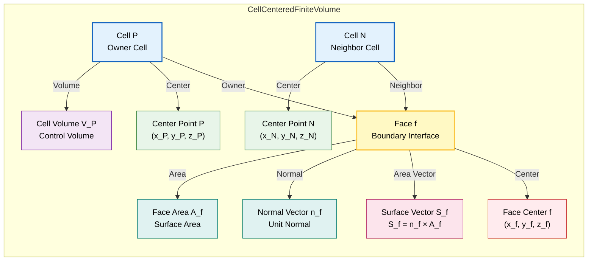
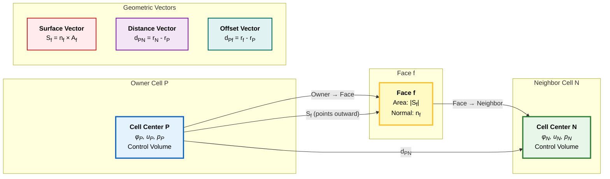

# การทำให้เป็นส่วนย่อยเชิงพื้นที่ (Spatial Discretization)

## โครงสร้าง Mesh

### แนวทางแบบ Cell-Centered

OpenFOAM ใช้แผนการทำให้เป็นส่วนย่อยแบบ **Finite Volume** ที่เน้น **cell-centered** โดยที่ตัวแปรหลักทั้งหมด (velocity, pressure, temperature, ฯลฯ) จะถูกเก็บไว้ที่จุดศูนย์กลางทางเรขาคณิตของเซลล์คำนวณ

แนวทางนี้มีข้อดีหลายประการสำหรับการคำนวณ CFD:
- **คุณสมบัติการอนุรักษ์** (conservation properties)
- **การนำ Boundary Condition ที่ซับซ้อนไปใช้ได้อย่างตรงไปตรงมา**


> **Figure 1:** การนิยามทางเรขาคณิตของปริมาตรควบคุมแบบเน้นจุดศูนย์กลางเซลล์ โดยระบุเซลล์เจ้าของและเซลล์ข้างเคียง เวกเตอร์แนวฉากของหน้าเซลล์ ($n_f$) เวกเตอร์พื้นที่หน้าเซลล์ ($S_f$) และจุดศูนย์กลางเซลล์ ($P, N$) ที่ใช้ในการคำนวณเกรเดียนต์และฟลักซ์
 เพื่อให้มั่นใจว่าสมการอนุรักษ์ในรูปปริพันธ์เป็นไปตามที่กำหนดไว้อย่างแม่นยำในแต่ละ Control Volume

**ข้อมูลทางเรขาคณิตที่จำเป็น**:
- ปริมาตรเซลล์ ($V_P$)
- พื้นที่ Face ($|\mathbf{S}_f|$)
- เวกเตอร์แนวฉากของ Face ($\mathbf{n}_f$)

แต่ละ Face มีเวกเตอร์พื้นที่ผิว $\mathbf{S}_f = \mathbf{n}_f A_f$ ที่ชี้จาก Owner Cell ไปยัง Neighbor Cell ข้อมูลทางเรขาคณิตนี้ช่วยให้สามารถคำนวณ:
- **Gradients**
- **Divergence Operations**
- **Flux Terms**

แนวทางแบบ Cell-Centered นำไปสู่ Sparse Linear System ที่สามารถแก้ไขได้อย่างมีประสิทธิภาพโดยใช้วิธี Iterative Methods

### การแสดงภาพ Mesh Topology

การทำให้เป็นส่วนย่อยแบบ Finite Volume ใน OpenFOAM อาศัย **Mesh Topology** เฉพาะที่กำหนดความสัมพันธ์ระหว่าง Cells, Faces และ Computational Points


> **Figure 2:** จุดคำนวณและเวกเตอร์ทางเรขาคณิตใน FVM แสดงความสัมพันธ์ระหว่างจุดศูนย์กลางเซลล์เจ้าของ (P) และเพื่อนบ้าน (N) รวมถึงเวกเตอร์ระยะทาง ($d_{PN}$) และเวกเตอร์พื้นที่หน้า ($S_f$) ที่ใช้ในการประมาณค่าและการคำนวณฟลักซ์

- **P**: Owner Cell Center - เก็บ Field Variables ($\phi_P$, $\mathbf{u}_P$, $p_P$)
- **N**: Neighbor Cell Center - เก็บ Field Variables ($\phi_N$, $\mathbf{u}_N$, $p_N$)
- **f**: Face Centroid - ทำการคำนวณ Flux
- **d**: เวกเตอร์ระยะทาง $\mathbf{d}_{PN} = \mathbf{r}_N - \mathbf{r}_P$ ระหว่าง Cell Centers
- **S**: เวกเตอร์พื้นที่ Face $\mathbf{S}_f = \mathbf{n}_f A_f$ ชี้จาก Owner ไปยัง Neighbor

กระบวนการ Discretization ต้องมี **Interpolation** ค่า Field จาก Cell Centers ไปยัง Face Centroids เพื่อประเมิน Convective และ Diffusive Fluxes

**ประเภท Mesh และการจัดการ**:

| ประเภท Mesh | ลักษณะ | การจัดการ |
|-------------|---------|-------------|
| **Orthogonal Meshes** | เส้นที่เชื่อมต่อ Cell Centers P และ N ขนานกับเวกเตอร์แนวฉากของ Face $\mathbf{n}_f$ | การคำนวณ Gradient ง่ายขึ้น |
| **Non-Orthogonal Meshes** | ทิศทางไม่ขนานกัน | ต้องมีการรวม **Correction Terms** เพิ่มเติมเพื่อรักษาความแม่นยำ |

OpenFOAM ใช้แผนการต่างๆ ตั้งแต่ Explicit Corrections แบบง่าย ไปจนถึง Non-Linear Correction Methods ที่ซับซ้อนยิ่งขึ้น

---

## การคำนวณ Face Flux

### นิพจน์ Flux ทั่วไป

ในกรอบ Finite Volume Terms การขนส่งทั้งหมดใน Governing Equations จะแสดงเป็น Fluxes ที่ผ่าน Cell Faces

$$\sum_f \mathbf{F}_f \cdot \mathbf{S}_f = 0$$

โดยที่:
- $\mathbf{F}_f$ แทน Flux Vector ที่ Face f
- $\mathbf{S}_f$ คือ Face Area Vector

**ความท้าทาย**: Field Variables ถูกเก็บไว้ที่ Cell Centers แต่การคำนวณ Flux ต้องการค่าที่ Face Centroids ดังนั้นจึงต้องใช้ **Interpolation Schemes** เพื่อประมาณค่า Face จากค่า Cell Center โดยรอบ

ความแม่นยำและเสถียรภาพของการจำลอง CFD ขึ้นอยู่กับการเลือก **Interpolation Schemes** อย่างมาก

### 1. Convective Fluxes ($\nabla \cdot (\phi \mathbf{u})$)

Convective Fluxes แสดงถึงการขนส่งปริมาณ Scalar เนื่องจากการเคลื่อนที่ของของไหล และเป็นพื้นฐานของ Conservation Equations ใน CFD

**Term Convective สำหรับ Scalar Field $\phi$**:
$$\int_V \nabla \cdot (\phi \mathbf{u}) \, \mathrm{d}V = \sum_f \phi_f (\mathbf{u}_f \cdot \mathbf{S}_f) = \sum_f \phi_f \Phi_f$$

โดยที่ $\Phi_f = \mathbf{u}_f \cdot \mathbf{S}_f$ คือ **Volumetric Flux** ผ่าน Face f ซึ่งแสดงถึงอัตราการไหลเชิงปริมาตรที่ผ่าน Face นั้น

> [!TIP] **ข้อควรสังเกต**: Volumetric Flux $\Phi_f$ ถูกคำนวณเพียงครั้งเดียวและใช้อย่างสอดคล้องกับทั้ง Owner และ Neighbor cells เพื่อรับรองคุณสมบัติการอนุรักษ์

**Interpolation Schemes สำหรับ $\phi_f$**:

| Scheme | รูปแบบสมการ | ความแม่นยำ | ข้อดี | ข้อเสีย | กรณีที่เหมาะสม |
|--------|--------------|-------------|--------|--------|----------------|
| **CDS** (Central Differencing) | $\phi_f = 0.5(\phi_P + \phi_N)$ | Order 2 | High accuracy for smooth profiles | Unbounded oscillations in steep gradients | Laminar flow, fine meshes |
| **UDS** (Upwind) | $\phi_f = \phi_P$ if $\Phi_f > 0$<br>$\phi_f = \phi_N$ if $\Phi_f < 0$ | Order 1 | Numerically stable, bounded | Significant numerical diffusion | High convection, coarse meshes |
| **QUICK** | $\phi_f = \frac{6}{8}\phi_P + \frac{3}{8}\phi_N - \frac{1}{8}\phi_{NN}$ | Order 3 | Excellent accuracy | Can be unstable for high convection | Structured grids, smooth flows |
| **MUSCL/TVD** | $\phi_f = \phi_U + \phi(r) \cdot \frac{1}{2}(\phi_D - \phi_U)$ | Order 2 | High accuracy with boundedness | Complex implementation | General CFD applications |

#### รายละเอียดเพิ่มเติม: Higher-Order Schemes

**QUICK (Quadratic Upstream Interpolation for Convective Kinematics)**:
$$\phi_f = \frac{6}{8}\phi_P + \frac{3}{8}\phi_N - \frac{1}{8}\phi_{NN}$$

แผนการอันดับสามนี้ให้ความแม่นยำที่ดีเยี่ยมสำหรับ Structured Grids แต่อาจไม่เสถียรสำหรับการไหลแบบ High Convection

**TVD (Total Variation Diminishing) Schemes**:
แผนการเหล่านี้รวมความแม่นยำสูงเข้ากับ Boundedness ผ่าน Flux Limiters $\phi(r)$:

$$\phi_f = \phi_U + \phi(r) \cdot \frac{1}{2}(\phi_D - \phi_U)$$

โดยที่:
- $r$ คือ Smoothness Indicator
- $D$ และ $U$ แทนค่า Downstream และ Upstream

**Common Flux Limiters**:
- Minmod: $\phi(r) = \max(0, \min(1, r))$
- Van Leer: $\phi(r) = \frac{r + |r|}{1 + |r|}$
- Superbee: $\phi(r) = \max(0, \min(2r, 1), \min(r, 2))$

### 2. Diffusive Fluxes ($\nabla \cdot (\Gamma \nabla \phi)$)

Diffusive Fluxes แสดงถึงการขนส่งเนื่องจาก Spatial Gradients และปรากฏใน Momentum, Energy และ Species Conservation Equations

**Term Diffusive สำหรับ Scalar Field $\phi$ ที่มี Diffusion Coefficient $\Gamma$**:
$$\int_V \nabla \cdot (\Gamma \nabla \phi) \, \mathrm{d}V = \sum_f \Gamma_f (\nabla \phi)_f \cdot \mathbf{S}_f$$

#### การประมาณค่า Gradient

สำหรับ Orthogonal Meshes ค่า Gradient ที่ Face จะถูกประมาณโดยใช้ Finite Differences ระหว่าง Adjacent Cell Centers:

$$(\nabla \phi)_f \cdot \mathbf{S}_f = |\mathbf{S}_f| \frac{\phi_N - \phi_P}{|\mathbf{d}_{PN}|}$$

Diffusion Coefficient ที่ Face จะถูก Interpolate โดยใช้ **Harmonic Averaging**:

$$\Gamma_f = \frac{2\Gamma_P \Gamma_N}{\Gamma_P + \Gamma_N}$$

#### Non-Orthogonal Correction

สำหรับ Non-Orthogonal Meshes OpenFOAM ใช้ Correction Schemes ที่แยก Gradient ออกเป็น Orthogonal และ Non-Orthogonal Components:

$$(\nabla \phi)_f \cdot \mathbf{S}_f = |\mathbf{S}_f| \frac{\phi_N - \phi_P}{|\mathbf{d}_{PN}|} + \underbrace{(\nabla \phi)_{correct} \cdot (\mathbf{S}_f - \mathbf{d}_{PN} \frac{|\mathbf{S}_f|}{|\mathbf{d}_{PN}|})}_{\text{Non-orthogonal correction}}$$

> [!WARNING] **ข้อควรระวัง**: Non-orthogonality สูง (> 70°) อาจทำให้เกิด Numerical diffusion ที่สำคัญและลดความแม่นยำของการคำนวณ Gradient

---

## Gradient Calculation Schemes

การคำนวณ Gradient ใน OpenFOAM ใช้ทฤษฎีบทของ Gauss (Gauss's theorem) ซึ่งเป็นรากฐานของการทำให้เป็นส่วนย่อยแบบ Finite Volume

### Gauss Theorem

Gradient ของฟิลด์ $\phi$ ที่จุดศูนย์กลางเซลล์ (cell centers) คำนวณโดยใช้ทฤษฎีบทของ Gauss:

$$\nabla \phi_P \approx \frac{1}{V_P} \sum_f \phi_f \mathbf{S}_f$$

**นิยามตัวแปร**:
- $V_P$: ปริมาตรเซลล์ (cell volume)
- $\phi_f$: ค่าที่ถูกประมาณค่าแบบ Interpolate ที่หน้า (interpolated face value)
- $\mathbf{S}_f = \mathbf{n}_f A_f$: เวกเตอร์พื้นที่ผิว (surface area vector)

### Gradient Schemes ใน OpenFOAM

| Scheme | คำอธิบาย | ความแม่นยำ | การใช้งาน |
|--------|------------|-------------|-------------|
| **Gauss linear** | Standard linear interpolation พร้อม Correction | Order 2 | ค่าเริ่มต้นทั่วไป |
| **leastSquares** | ใช้ Least squares method | Order 2+ | แม่นยำกว่าบน Complex meshes |
| **fourthOrder** | Fourth-order accurate | Order 4 | Structured meshes เท่านั้น |

**OpenFOAM Code Implementation**:

```cpp
// การคำนวณ gradient ใน OpenFOAM
volScalarField gradPhi = fvc::grad(phi);
// ใช้ Gauss theorem และ interpolation schemes
```

**การตั้งค่าใน fvSchemes**:

```cpp
gradSchemes
{
    default         Gauss linear;
}
```

---

## การประกอบ Matrix จาก Spatial Discretization

การทำให้เป็นส่วนย่อยเชิงพื้นที่ของ Governing Equations ส่งผลให้เกิดระบบสมการเชิงเส้นแบบ Sparse

$$\mathbf{A} \cdot \boldsymbol{\phi} = \mathbf{b}$$

โดยที่:
- $\mathbf{A}$ คือ Coefficient Matrix
- $\boldsymbol{\phi}$ คือ Solution Vector
- $\mathbf{b}$ คือ Source Vector

### คุณสมบัติที่สำคัญของเมทริกซ์

- **Diagonal Dominance**: $|A_{PP}| \geq \sum_{N} |A_{PN}|$ เพื่อความเสถียร
- **Sparsity Pattern**: แต่ละแถวมี Non-Zero Entries เฉพาะสำหรับเซลล์นั้นเองและเซลล์ข้างเคียงโดยตรง
- **Natural Sparsity**: เกิดจากการทำให้เป็นส่วนย่อยแบบ Finite Volume

### การคำนวณสัมประสิทธิ์ (Coefficient Calculation Examples)

#### เทอมการแพร่ (Diffusion Terms)

สำหรับกระบวนการที่เน้นการแพร่ (diffusion-dominated processes):

$$a_f = \frac{\Gamma_f A_f}{\delta_f}$$

โดยที่:
- $\Gamma_f = \frac{2\Gamma_P \Gamma_N}{\Gamma_P + \Gamma_N}$ (Harmonic Mean)
- $A_f$ คือพื้นที่ Face
- $\delta_f$ คือระยะห่างระหว่างจุดศูนย์กลางเซลล์

#### เทอมการพา (Convection Terms)

สำหรับปัญหา Convection-Diffusion ที่ใช้ Upwind Differencing:

$$a_f = \rho_f \mathbf{u}_f \cdot \mathbf{S}_f + \frac{\Gamma_f A_f}{\delta_f}$$

โดยที่เครื่องหมายของเทอม Convective ขึ้นอยู่กับ:
- ทิศทางการไหล
- Upwind Scheme ที่ใช้

### อัลกอริทึมการประกอบเมทริกซ์ (Matrix Assembly Algorithm)

การสร้างเมทริกซ์จริงใน OpenFOAM เป็นไปตามอัลกอริทึมที่เป็นระบบ:

```cpp
for (label cell = 0; cell < nCells; cell++)
{
    // Initialize diagonal coefficient
    a_P = 0.0;

    // Loop through all faces of this cell
    forAll(mesh.cells()[cell], faceI)
    {
        label face = mesh.cells()[cell][faceI];

        if (face < nInternalFaces)
        {
            // Internal face - contributes to both diagonal and off-diagonal
            label neighbor = mesh.owner()[face] == cell ?
                           mesh.neighbour()[face] : mesh.owner()[face];

            // Calculate face flux and coefficients
            scalar faceCoeff = calculateFaceCoefficient(face, cell, neighbor);

            // Off-diagonal contribution
            a_f[face] = -faceCoeff;

            // Diagonal contribution
            a_P += faceCoeff;
        }
        else
        {
            // Boundary face - contributes only to diagonal and source term
            scalar boundaryCoeff = calculateBoundaryContribution(face, cell);
            a_P += boundaryCoeff;
            b_P += boundaryCoeff * boundaryValue[face];
        }
    }

    // Add source terms
    b_P += sourceTerm[cell] * mesh.V()[cell];

    // Store in matrix structure
    matrix.setDiagonal(cell, a_P);
    for (label faceI = 0; faceI < nFacesPerCell; faceI++)
    {
        if (isInternalFace[faceI])
        {
            matrix.setOffDiagonal(cell, neighborCell[faceI], a_f[faceI]);
        }
    }
    matrix.setSource(cell, b_P);
}
```

---

## การนำ Boundary Condition ไปใช้

### การจัดการ Boundary Face

ที่ขอบเขตโดเมน การทำให้เป็นส่วนย่อยแบบ Finite Volume ต้องมีการจัดการเป็นพิเศษ เนื่องจากไม่มีเซลล์ข้างเคียงที่ด้านนอก

**ประเภทของ Boundary Conditions**:

| Type | นิยาม | การนำไปใช้ใน Matrix | การใช้งาน |
|------|--------|-------------------------|-------------|
| **Dirichlet** | Fixed value $\phi_b$ at boundary | Direct contribution to diagonal | Fixed temperature, velocity inlet |
| **Neumann** | Fixed gradient $(\nabla \phi)_b$ at boundary | Both diagonal and source terms | Heat flux, zero gradient outlet |
| **Mixed** | $\alpha \phi_f + \beta (\nabla \phi)_f \cdot \mathbf{n}_f = \gamma$ | Complex modification | Heat transfer with convection |

**Dirichlet Boundary**:
$$\phi_f = \phi_b$$
Contribution: $A_{PP} \mathrel{+=} \Gamma_f \frac{|\mathbf{S}_f|}{|\mathbf{d}_{Pb}|}$

**Neumann Boundary**:
$$\phi_f = \phi_P + (\nabla \phi)_b \cdot \mathbf{d}_{Pb}$$
Contribution: $A_{PP} \mathrel{+=} -\Gamma_f \frac{|\mathbf{S}_f|}{|\mathbf{d}_{Pb}|}, \quad b_P \mathrel{+=} \Gamma_f (\nabla \phi)_b \cdot \mathbf{S}_f$

### การจัดการ Wall Boundary

บริเวณใกล้ผนัง (Near-Wall Regions) ต้องมีการทำให้เป็นส่วนย่อยเป็นพิเศษเพื่อจับ Wall Boundary Layer Physics

**Wall Functions**: โดยใช้ Logarithmic Law of the Wall:
$$u^+ = \frac{1}{\kappa} \ln y^+ + B$$

โดยที่:
- $u^+ = u/u_\tau$ (non-dimensional velocity)
- $y^+ = y u_\tau/\nu$ (non-dimensional distance)
- $\kappa$ คือ von Kármán constant (≈ 0.41)
- $B$ คือ log-law constant (≈ 5.5)

**Enhanced Wall Treatment**: การรวม Wall Functions เข้ากับการปรับ Mesh ให้ละเอียดขึ้นใกล้ผนัง (Near-Wall Mesh Refinement) เพื่อความแม่นยำที่ดีขึ้นในการไหลที่ซับซ้อน

---

## เทคนิคการทำให้เป็นส่วนย่อยขั้นสูง (Advanced Discretization Techniques)

### Adaptive Mesh Refinement

OpenFOAM รองรับ **Dynamic Mesh Adaptation** ตามคุณสมบัติของ Solution

**Error Indicators**:
- **Gradient-based**: $|\nabla \phi|$ - ระบุบริเวณที่มี gradient สูง
- **Residual-based**: $\|R(\phi)\|$ - ระบุบริเวณที่มีความคลาดเคลื่อนตามสมการ
- **Feature-based**: Vorticity Magnitude, Pressure Gradient - ระบุบริเวณที่มีคุณสมบัติทางกายภาพน่าสนใจ

**Refinement Criteria**:
$$\text{Refine if } |\nabla \phi| > \phi_{ref} \quad \text{and} \quad \Delta x > \Delta x_{min}$$

Discretization Coefficients ต้องถูกคำนวณใหม่หลังจากการปรับ Mesh แต่ละครั้งเพื่อรักษา Consistency และ Conservation Properties

---

## การนำไปใช้ในโครงสร้างโค้ด OpenFOAM

### Core Discretization Classes

**OpenFOAM Code Implementation**

**fvScalarMatrix**: Template Class สำหรับการประกอบ Sparse Matrices สำหรับ Scalar Field Equations:

```cpp
fvScalarMatrix TEqn
(
    rho*cp*ddt(T) + rho*cp*div(phi, T)
  - div(k*grad(T)) == Q
);
```

**คลาสการทำให้เป็นส่วนย่อยหลัก**:
- **fvm::ddt()**: Temporal Derivative Discretization (implicit)
- **fvc::ddt()**: Explicit Temporal Derivative Calculation
- **fvm::div()**: Implicit Divergence Term Discretization
- **fvc::div()**: Explicit Divergence Term Calculation
- **fvm::laplacian()**: Implicit Laplacian Term Discretization
- **fvc::grad()**: Explicit Gradient Calculation

**ตัวอย่างการสร้างสมการ Momentum**:
```cpp
fvVectorMatrix UEqn
(
    fvm::ddt(rho, U) + fvm::div(phi, U) - fvm::laplacian(mu, U) == -grad(p)
);
```

**ตัวอย่างการใช้งาน Boundary Conditions**:
```cpp
// Dirichlet boundary (fixed value)
U.boundaryFieldRef()[inletID] = vector(1.0, 0.0, 0.0);

// Neumann boundary (fixed gradient)
T.boundaryFieldRef()[outletID].gradient() = 0.0;
```

**โครงสร้าง Matrix Operations**:
```cpp
// Add source term
UEqn += SU;

// Apply under-relaxation
UEqn.relax();

// Solve the system
solve(UEqn == -grad(p));
```

### surfaceScalarField: ฟิลด์บนหน้าเซลล์

`surfaceScalarField` แสดงถึงปริมาณที่กำหนดบนหน้าเซลล์ ซึ่งมีความสำคัญอย่างยิ่งสำหรับการคำนวณฟลักซ์และการประมาณค่า gradient

ฟิลด์ประเภทนี้มีความสำคัญสำหรับ:

- **การคำนวณฟลักซ์ (Flux Calculations)**: ฟลักซ์มวล $\phi = \rho \mathbf{U} \cdot \mathbf{S}_f$ (ขนาดความเร็วที่หน้าคูณด้วยเวกเตอร์พื้นที่หน้า) คำนวณที่หน้าเซลล์แต่ละหน้า

- **การคำนวณ Gradient (Gradient Computation)**: schemes การประมาณค่าในช่วงบนพื้นผิวใช้ค่าที่หน้าเพื่อคำนวณ cell-centered gradients โดยใช้ทฤษฎีบทของเกาส์: $$\nabla \psi = \frac{1}{V}\sum_f \psi_f \mathbf{S}_f$$

- **Schemes การดิสครีต (Discretization Schemes)**: schemes การประมาณค่าในช่วงที่แตกต่างกัน (linear, upwind, QUICK, TVD) กำหนดวิธีการประมาณค่าในช่วงจากเซลล์ไปยังหน้า เพื่อรักษาสมดุลระหว่างความแม่นยำและความเสถียร

- **การบังคับใช้การอนุรักษ์ (Conservation Enforcement)**: รับรองความต่อเนื่องของฟลักซ์ข้ามหน้าเซลล์ รักษาคุณสมบัติการอนุรักษ์โดยรวมผ่านการกำหนดเครื่องหมายฟลักซ์หน้าที่ระมัดระวัง

Surface fields จะถูกคำนวณโดยอัตโนมัติจาก volume fields ในระหว่างการประกอบสมการโดยใช้ interpolation schemes พร้อมตัวเลือกสำหรับข้อจำกัดด้าน boundedness และการผสมผสาน convection-diffusion

---

## บทสรุป

การทำให้เป็นส่วนย่อยเชิงพื้นที่เป็นกระบวนการพื้นฐานที่แปลง Partial Differential Equations ให้เป็นระบบสมการพีชคณิต ซึ่งเป็นรากฐานของการแก้ปัญหา CFD ด้วยเชิงตัวเลข

**ปัจจัยสำคัญในการเลือก Spatial Discretization**:
1. **ความแม่นยำ** (Accuracy requirements)
2. **ความเสถียร** (Stability constraints)
3. **คุณภาพ Mesh** (Mesh quality)
4. **ลักษณะปัญหา** (Problem characteristics)

**ข้อดีของกรอบการทำงาน OpenFOAM**:
- ความยืดหยุ่นในการเลือก Discretization Scheme
- การปรับแต่งให้เข้ากับการใช้งานเฉพาะ
- การรักษาความเสถียรเชิงตัวเลข
- ประสิทธิภาพการคำนวณสูงด้วย Sparse Matrix Systems

การเลือก Scheme ที่เหมาะสมเป็นการแลกเปลี่ยนระหว่างความแม่นยำ ความเสถียร และต้นทุนการคำนวณ ซึ่งขึ้นอยู่กับลักษณะเฉพาะของปัญหาที่กำลังแก้ไข
