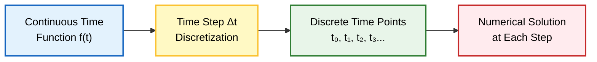
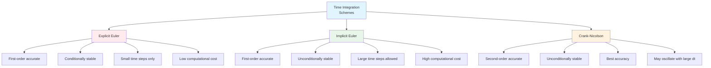
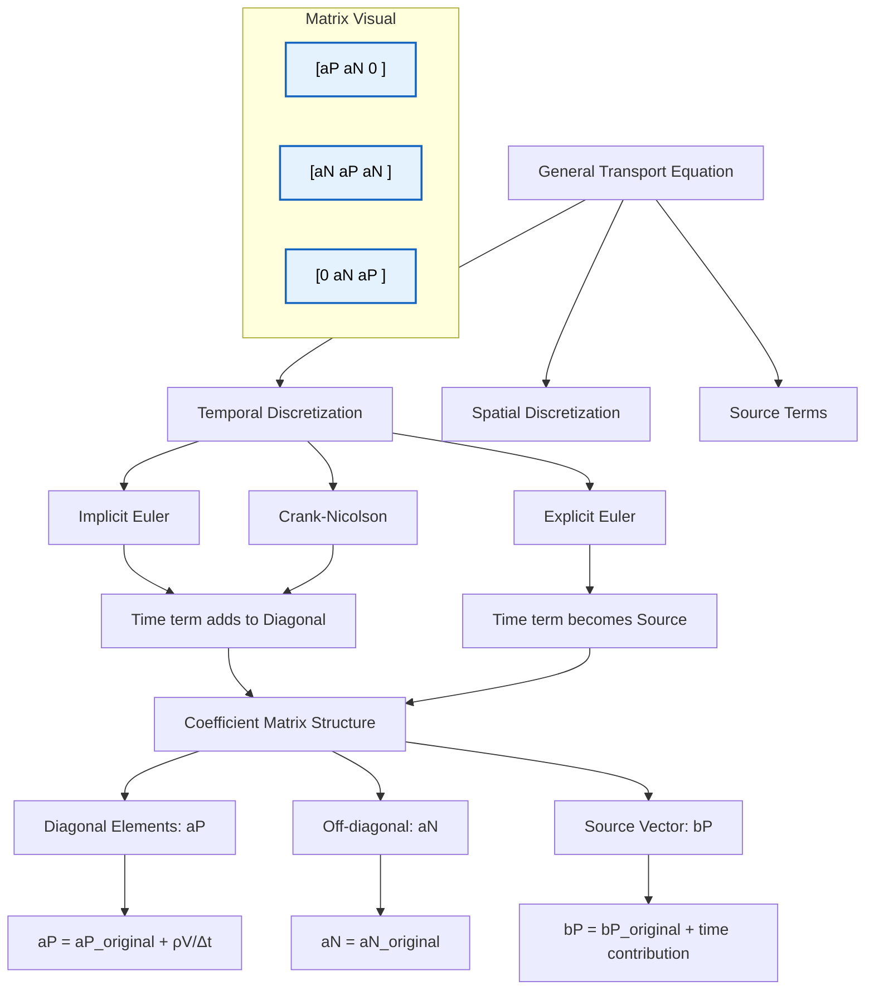
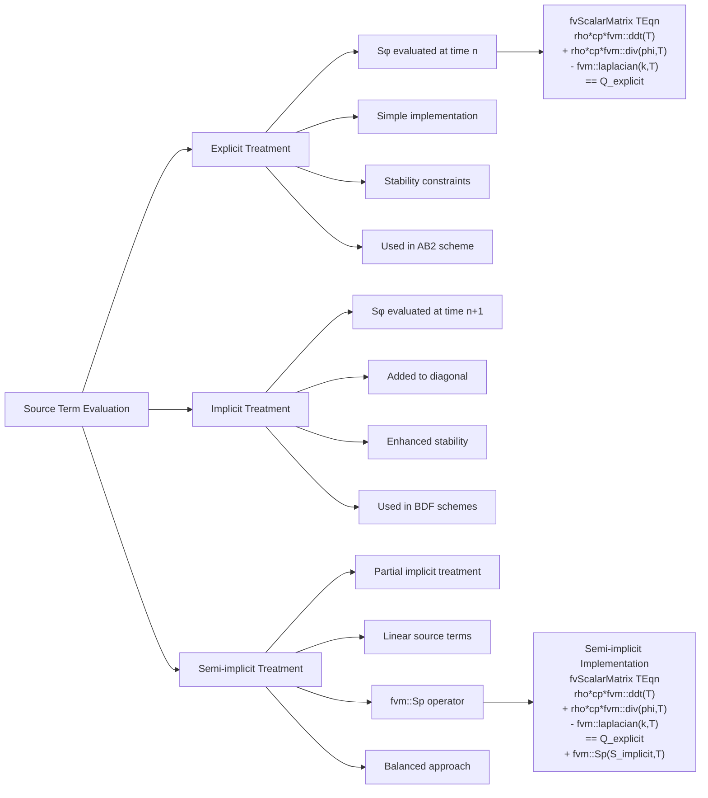

# การทำให้เป็นดิสครีตเชิงเวลา

**การทำให้เป็นดิสครีตเชิงเวลา (Temporal discretization)** คือกระบวนการแปลงสมการเชิงอนุพันธ์แบบเวลาต่อเนื่อง (continuous-time differential equations) ให้เป็นสมการพีชคณิตแบบเวลาดิสครีต (discrete-time algebraic equations) ที่สามารถหาผลเฉลยเชิงตัวเลขได้

ใน OpenFOAM นี่คือกลไกพื้นฐานที่ช่วยให้เราสามารถก้าวไปข้างหน้าในเวลาและจำลองปรากฏการณ์ชั่วคราว (transient phenomena) ได้



---

## วิธีการอินทิเกรตเชิงเวลา (Time Integration Methods)

### **Explicit Euler (Forward Euler)**

วิธี Explicit Euler หรือที่รู้จักกันในชื่อ Forward Euler ใช้วิธีการใช้ค่าจากช่วงเวลาปัจจุบัน ($n$) เพื่อคำนวณการเปลี่ยนแปลงไปยังช่วงเวลาถัดไป ($n+1$):

$$\frac{\phi^{n+1} - \phi^n}{\Delta t} = f(\phi^n)$$

จัดเรียงใหม่เพื่อหาค่าในอนาคต:

$$\phi^{n+1} = \phi^n + \Delta t \cdot f(\phi^n) \tag{1.1}$$

**คุณสมบัติหลัก:**
- มีความแม่นยำอันดับหนึ่งเชิงเวลา (First-order accurate in time)
- ง่ายต่อการนำไปใช้งานและแก้ไข
- ใช้ต้นทุนการคำนวณต่ำต่อช่วงเวลา
- ต้องใช้ช่วงเวลาที่สั้นมากเพื่อความเสถียร (CFL < 1)
- เสถียรแบบมีเงื่อนไข (Conditionally stable) - อาจไม่เสถียรสำหรับ $\Delta t$ ขนาดใหญ่

> [!INFO] **การใช้งาน Explicit Euler**
> วิธีนี้เหมาะสำหรับปัญหาที่มีความเร็วการเปลี่ยนแปลงต่ำ หรือการทดสอบเบื้องต้นเนื่องจากความง่ายในการนำไปใช้

**OpenFOAM Code Implementation:**
```cpp
// ใน fvSchemes
ddtSchemes
{
    default         Euler;
}
```

---

### **Implicit Euler (Backward Euler)**

วิธี Implicit Euler หรือที่รู้จักกันในชื่อ Backward Euler ใช้วิธีการใช้ค่าจากช่วงเวลาในอนาคต ($n+1$) ในการคำนวณ:

$$\frac{\phi^{n+1} - \phi^n}{\Delta t} = f(\phi^{n+1})$$

วิธีนี้ต้องแก้ระบบสมการเชิงเส้น (system of linear equations) ในแต่ละช่วงเวลา เนื่องจาก $\phi^{n+1}$ ปรากฏอยู่ทั้งสองข้าง:

$$\phi^{n+1} - \Delta t \cdot f(\phi^{n+1}) = \phi^n \tag{1.2}$$

**คุณสมบัติหลัก:**
- มีความแม่นยำอันดับหนึ่งเชิงเวลา (First-order accurate in time)
- ซับซ้อนกว่าในการแก้ (ต้องมีการผกผันเมทริกซ์)
- เสถียรอย่างไม่มีเงื่อนไข (Unconditionally stable) สำหรับปัญหาเชิงเส้น
- อนุญาตให้ใช้ช่วงเวลาที่ใหญ่กว่าวิธี Explicit มาก
- มีต้นทุนการคำนวณสูงกว่าต่อช่วงเวลา

> [!WARNING] **ข้อจำกัดของ Implicit Euler**
> แม้จะเสถียรอย่างไม่มีเงื่อนไข แต่ความแม่นยำอันดับหนึ่งอาจไม่เพียงพอสำหรับปัญหาที่ต้องการความแม่นยำสูง

**OpenFOAM Code Implementation:**
```cpp
// ใน fvSchemes
ddtSchemes
{
    default         backward;
}
```

---

### **Crank-Nicolson Scheme**

วิธี Crank-Nicolson เป็น Scheme ที่มีความแม่นยำอันดับสอง (second-order accurate) ซึ่งหาค่าเฉลี่ยของระดับเวลาเก่าและใหม่:

$$\frac{\phi^{n+1} - \phi^n}{\Delta t} = \frac{1}{2}[f(\phi^n) + f(\phi^{n+1})] \tag{1.3}$$

**คุณสมบัติหลัก:**
- มีความแม่นยำอันดับสองเชิงเวลา (Second-order accurate in time)
- เสถียรอย่างไม่มีเงื่อนไข (Unconditionally stable) สำหรับปัญหาเชิงเส้น
- มีความแม่นยำดีกว่าทั้ง Explicit และ Implicit Euler
- ต้องแก้ระบบสมการ (ลักษณะแบบ Implicit)
- อาจแสดงการแกว่งเชิงตัวเลข (numerical oscillations) สำหรับช่วงเวลาขนาดใหญ่

> [!TIP] **การเลือก Blending Factor**
> ใน OpenFOAM สามารถปรับ Blending factor สำหรับ Crank-Nicolson ได้ ซึ่งช่วยควบคุมระดับ Implicitness

**OpenFOAM Code Implementation:**
```cpp
// ใน fvSchemes
ddtSchemes
{
    default         CrankNicolson 0.5;  // 0.5 = blending factor
}
```

---

### **การเปรียบเทียบวิธีการอินทิเกรตเชิงเวลา**



| ชื่อ Scheme | ความแม่นยำ | ความเสถียร | ต้นทุนการคำนวณ | กรณีที่เหมาะสม |
|-------------|-------------|-------------|------------------|-------------------|
| **Explicit Euler** | อันดับหนึ่ง | มีเงื่อนไข (CFL < 1) | ต่ำ | ปัญหาง่าย การเรียนรู้ |
| **Implicit Euler** | อันดับหนึ่ง | ไม่มีเงื่อนไข | สูง | CFD ชั่วคราวทั่วไป |
| **Crank-Nicolson** | อันดับสอง | ไม่มีเงื่อนไข | สูง | ปัญหาที่ต้องความแม่นยำสูง |

---

## การนำไปใช้งานใน OpenFOAM

### **Class สำหรับการทำให้เป็นดิสครีตเชิงเวลา**

OpenFOAM นำการทำให้เป็นดิสครีตเชิงเวลาไปใช้ผ่าน Class หลักหลาย Class:

1. **EulerDdtScheme**: นำ Scheme แบบ Explicit Euler ไปใช้
2. **backwardDdtScheme**: นำ Scheme แบบ Implicit Euler ไปใช้
3. **CrankNicolsonDdtScheme**: นำ Scheme แบบ Crank-Nicolson ไปใช้

### **โครงสร้าง fvMatrix**

การทำให้เป็นดิสครีตเชิงเวลามีส่วนร่วมในแนวทแยงมุมของเมทริกซ์สัมประสิทธิ์ (coefficient matrix) สำหรับสมการการขนส่งทั่วไป:

$$\frac{\partial (\rho \phi)}{\partial t} + \nabla \cdot (\rho \mathbf{u} \phi) = \nabla \cdot (\Gamma \nabla \phi) + S_\phi \tag{1.4}$$

**นิยามตัวแปร:**
- $\rho$ = ความหนาแน่น (density)
- $\phi$ = ตัวแปรที่สนใจ (scalar/vector field)
- $\mathbf{u}$ = ความเร็ว (velocity vector)
- $\Gamma$ = สัมประสิทธิ์การแพร่ (diffusion coefficient)
- $S_\phi$ = พจน์ต้นทาง (source term)
- $V$ = ปริมาตรของ cell

**พจน์เชิงเวลาจะกลายเป็น:**
- **Explicit**: $\frac{\rho V}{\Delta t} \phi^n$ (ย้ายไปที่พจน์ Source)
- **Implicit**: $\frac{\rho V}{\Delta t} \phi^{n+1}$ (เพิ่มเข้าในแนวทแยงมุม)



---

### **การควบคุมช่วงเวลา (Time Step Control)**

OpenFOAM มีกลไกหลายอย่างสำหรับการควบคุมช่วงเวลา:

1. **ช่วงเวลาคงที่ (Fixed time step)**: ระบุโดยตรงใน `controlDict`
2. **ช่วงเวลาที่ปรับได้ (Adjustable time step)**: อิงตาม Courant number หรือเกณฑ์อื่น ๆ
3. **Courant number สูงสุด (Maximum Courant number)**: พารามิเตอร์ `maxCo` ใน `controlDict`

**OpenFOAM Code Implementation:**
```cpp
// ใน controlDict สำหรับ adjustable time stepping
adjustTimeStep  yes;
maxCo           0.5;
maxDeltaT       1.0;
```

---

### **PISO vs SIMPLE vs PIMPLE**

การเลือกการทำให้เป็นดิสครีตเชิงเวลามีผลต่อ Algorithm การเชื่อมโยงความดัน-ความเร็ว (pressure-velocity coupling algorithm):

**ความแตกต่างของ Algorithm:**
- **SIMPLE**: สภาวะคงที่, ใช้การก้าวเวลาแบบ Pseudo-time
- **PISO**: ชั่วคราว, การก้าวเวลาแบบ Explicit พร้อมลูปแก้ไข
- **PIMPLE**: แบบผสม, อนุญาตให้ใช้ช่วงเวลาที่ใหญ่ขึ้นพร้อมการผ่อนปรน (under-relaxation)

```mermaid
graph TD
    subgraph "SIMPLE (Steady-State)"
        S_Start["Start Iteration"] --> S_Mom["Momentum Predictor"]
        S_Mom --> S_Pres["Pressure Equation"]
        S_Pres --> S_Corr["Correct U & p"]
        S_Corr --> S_Turb["Turbulence/Energy"]
        S_Turb --> S_Conv{"Converged?"}
        S_Conv -- No --> S_Start
        S_Conv -- Yes --> S_End["End Simulation"]
    end

    subgraph "PISO (Transient)"
        P_Start["Start Time Step"] --> P_Mom["Momentum Predictor"]
        P_Mom --> P_Loop["PISO Loop (2-3 times)"]
        P_Loop --> P_Pres["Pressure Equation"]
        P_Pres --> P_Corr["Correct U & p"]
        P_Corr --> P_Loop
        P_Corr -- "Loop Done" --> P_Turb["Turbulence/Energy"]
        P_Turb --> P_End["Next Time Step"]
    end

    subgraph "PIMPLE (Hybrid Transient)"
        Pi_Start["Start Time Step"] --> Pi_Outer["Outer Loop (SIMPLE)"]
        Pi_Outer --> Pi_Mom["Momentum Predictor"]
        Pi_Mom --> Pi_Inner["Inner Loop (PISO)"]
        Pi_Inner --> Pi_Pres["Pressure Equation"]
        Pi_Pres --> Pi_Corr["Correct U & p"]
        Pi_Corr --> Pi_Inner
        Pi_Corr -- "Inner Done" --> Pi_Turb["Turbulence/Energy"]
        Pi_Turb --> Pi_Conv{"Converged?"}
        Pi_Conv -- No --> Pi_Outer
        Pi_Conv -- Yes --> Pi_End["Next Time Step"]
    end

    classDef simple fill:#e3f2fd,stroke:#1565c0,stroke-width:2px;
    classDef piso fill:#e8f5e9,stroke:#2e7d32,stroke-width:2px;
    classDef pimple fill:#fff3e0,stroke:#ef6c00,stroke-width:2px;

    class S_Start,S_Mom,S_Pres,S_Corr,S_Turb,S_Conv,S_End simple;
    class P_Start,P_Mom,P_Loop,P_Pres,P_Corr,P_Turb,P_End piso;
    class Pi_Start,Pi_Outer,Pi_Mom,Pi_Inner,Pi_Pres,Pi_Corr,Pi_Turb,Pi_Conv,Pi_End pimple;
```



---

## ข้อควรพิจารณาเชิงปฏิบัติ

### **การแลกเปลี่ยนระหว่างความเสถียรและความแม่นยำ (Stability vs Accuracy Trade-off)**

- **Scheme แบบ Explicit**: มีศักยภาพความแม่นยำสูงแต่ถูกจำกัดด้วยความเสถียร
- **Scheme แบบ Implicit**: มีความเสถียรดีเยี่ยม แต่อาจทำให้เกิดการแพร่เชิงตัวเลข (numerical diffusion)
- **Scheme อันดับสูงกว่า**: มีความแม่นยำดีขึ้นแต่มีความซับซ้อนเพิ่มขึ้น

### **แนวทางการเลือกช่วงเวลา (Time Step Selection Guidelines)**

1. **Explicit Euler**: $\Delta t < \frac{\text{CFL} \cdot \Delta x}{|\mathbf{u}|}$
2. **Implicit Euler**: ถูกจำกัดด้วยความแม่นยำ ไม่ใช่ความเสถียร
3. **Crank-Nicolson**: ความสมดุลระหว่างความเสถียรและความแม่นยำ

### **การใช้งานทั่วไป (Common Applications)**

| Application | วิธีที่แนะนำ | เหตุผล |
|-------------|----------------|---------|
| **การพาความร้อนอย่างง่าย** | Explicit Euler | ความเรียบง่าย ต้นทุนต่ำ |
| **การศึกษา/การเรียนการสอน** | Explicit Euler | ความชัดเจนของ algorithm |
| **CFD ชั่วคราวส่วนใหญ่** | Implicit Euler | ความเสถียร ความยืดหยุ่น |
| **ปัญหาที่มี Source term แข็ง** | Implicit Euler | การจัดการ Source term ที่ดีกว่า |
| **ปัญหาที่ต้องความแม่นยำสูง** | Crank-Nicolson | ความแม่นยำอันดับสอง |
| **การแพร่กระจายของคลื่น** | Crank-Nicolson | ลดการกระจายของคลื่น |

---

## ตัวอย่างโค้ด: การอินทิเกรตเชิงเวลาแบบกำหนดเอง

```cpp
// การนำการทำให้เป็นดิสครีตเชิงเวลาแบบกำหนดเองไปใช้
template<class Type>
class customDdtScheme : public fv::ddtScheme<Type>
{
    // Constructor
    customDdtScheme(const fvMesh& mesh)
        : fv::ddtScheme<Type>(mesh) {}

    // ฟังก์ชันการทำให้เป็นดิสครีตเชิงเวลา
    virtual tmp<GeometricField<Type, fvPatchField, volMesh>>
    fvcDdt(const GeometricField<Type, fvPatchField, volMesh>& vf)
    {
        // รับข้อมูล Mesh และเวลา
        const fvMesh& mesh = this->mesh();
        const scalarField& rDeltaT = mesh.time().deltaT()();

        // คำนวณอนุพันธ์เชิงเวลา
        return (vf.oldTime() - vf) * rDeltaT;
    }

    // ฟังก์ชันสำหรับ fvMatrix (implicit treatment)
    virtual tmp<fvMatrix<Type>>
    fvmDdt(const GeometricField<Type, fvPatchField, volMesh>& vf)
    {
        const fvMesh& mesh = this->mesh();
        const scalarField& rDeltaT = mesh.time().deltaT()();

        tmp<fvMatrix<Type>> tfvm
        (
            new fvMatrix<Type>(vf, rDeltaT.dimensions()*vf.dimensions())
        );

        fvMatrix<Type>& fvm = tfvm.ref();

        // เพิ่มเข้าสู่แนวทแยงมุม
        fvm.diag() += rDeltaT*mesh.V();

        // Source term จากค่าเวลาเก่า
        fvm.source() -= rDeltaT*vf.oldTime().internalField()*mesh.V();

        return tfvm;
    }
};
```

---

## หัวข้อขั้นสูง

### **การก้าวเวลาแบบปรับได้ (Adaptive Time Stepping)**

OpenFOAM รองรับการก้าวเวลาแบบปรับได้โดยอิงตาม:
- **ขีดจำกัด Courant number**
- **การลู่เข้าของ Residual**
- **เกณฑ์การเปลี่ยนแปลงของผลลัพธ์**
- **เหตุการณ์เชิงเวลาทางกายภาพ**

**OpenFOAM Code Implementation:**
```cpp
// ใน controlDict
adjustTimeStep  yes;
maxCo           0.5;        // Maximum Courant number
maxAlphaCo      0.2;        // Maximum Courant for volumetric fields
rDeltaTSmoothingCoeff 0.1;  // Smoothing coefficient
```

---

### **Scheme แบบ Multi-step**

เพื่อความแม่นยำอันดับสูงขึ้น OpenFOAM ได้นำ Scheme เหล่านี้ไปใช้:
- **BDF schemes**: Backward Differentiation Formulas
- **Adams-Bashforth**: Scheme แบบ Multi-step ชนิด Explicit
- **Adams-Moulton**: Scheme แบบ Multi-step ชนิด Implicit

**Multi-step Scheme Comparison:**
| Scheme | Order | Type | Stability | Use Case |
|--------|-------|------|-----------|----------|
| **BDF1** | 1st | Implicit | Excellent | General transient |
| **BDF2** | 2nd | Implicit | Good | Higher accuracy needs |
| **Adams-Bashforth 2** | 2nd | Explicit | Conditional | Non-stiff problems |
| **Adams-Moulton** | 2nd | Implicit | Excellent | Stiff problems |

---

### **การอินทิเกรตพจน์ Source (Source Terms Integration)**

ข้อควรพิจารณาพิเศษสำหรับพจน์ Source:
- **การจัดการแบบ Explicit**: $S_\phi^n$ ถูกประเมินที่เวลาเก่า
- **การจัดการแบบ Implicit**: $S_\phi^{n+1}$ มีส่วนร่วมในแนวทแยงมุม
- **Semi-implicit**: การจัดการแบบ Implicit บางส่วนเพื่อความเสถียร

**OpenFOAM Code Implementation:**
```cpp
// ตัวอย่างการจัดการ Source term แบบ semi-implicit
fvScalarMatrix TEqn
(
    rho*cp*fvm::ddt(T)
  + rho*cp*fvm::div(phi, T)
  - fvm::laplacian(k, T)
 ==
    // Explicit source term
    Q_explicit
  + fvm::Sp(S_implicit, T)  // Semi-implicit source term
);
```



---

## บทสรุป

**การทำให้เป็นดิสครีตเชิงเวลา** เป็นองค์ประกอบสำคัญของการจำลอง CFD ที่กำหนดความแม่นยำที่เราสามารถแก้ไขปรากฏการณ์ที่ขึ้นกับเวลาได้

**ปัจจัยสำคัญในการเลือก Scheme:**
1. **ความต้องการความแม่นยำ** (Accuracy requirements)
2. **ข้อจำกัดความเสถียร** (Stability constraints)
3. **ต้นทุนการคำนวณ** (Computational cost)
4. **ลักษณะปัญหา** (Problem characteristics)

**ข้อดีของกรอบการทำงาน OpenFOAM:**
- ความยืดหยุ่นในการเลือก Scheme
- การปรับแต่งให้เข้ากับการใช้งานเฉพาะ
- การรักษาความเสถียรเชิงตัวเลข
- ประสิทธิภาพการคำนวณ

การเลือก Scheme ที่เหมาะสมเป็นการแลกเปลี่ยนระหว่างต้นทุนการคำนวณ ความเสถียร และข้อกำหนดด้านความแม่นยำ ซึ่งขึ้นอยู่กับลักษณะเฉพาะของปัญหาที่กำลังแก้ไข

---

> [!INFO] **การเชื่อมโยงกับ Note อื่น ๆ**
> - ดู [[03_Spatial_Discretization]] สำหรับความเข้าใจเพิ่มเติมเกี่ยวกับการทำให้เป็นดิสครีตเชิงพื้นที่
> - ศึกษา [[05_Matrix_Assembly]] เพื่อเข้าใจว่า temporal terms มีผลต่อ coefficient matrices อย่างไร
> - อ้างอิง [[06_OpenFOAM_Implementation]] สำหรับตัวอย่างการนำไปใช้งานจริง
> - ดู [[07_Best_Practices]] สำหรับแนวทางในการเลือก temporal scheme ที่เหมาะสม
