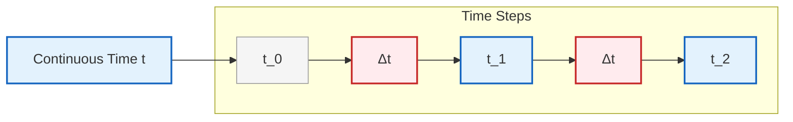
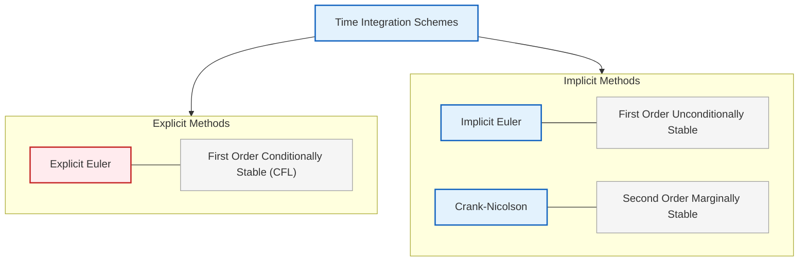
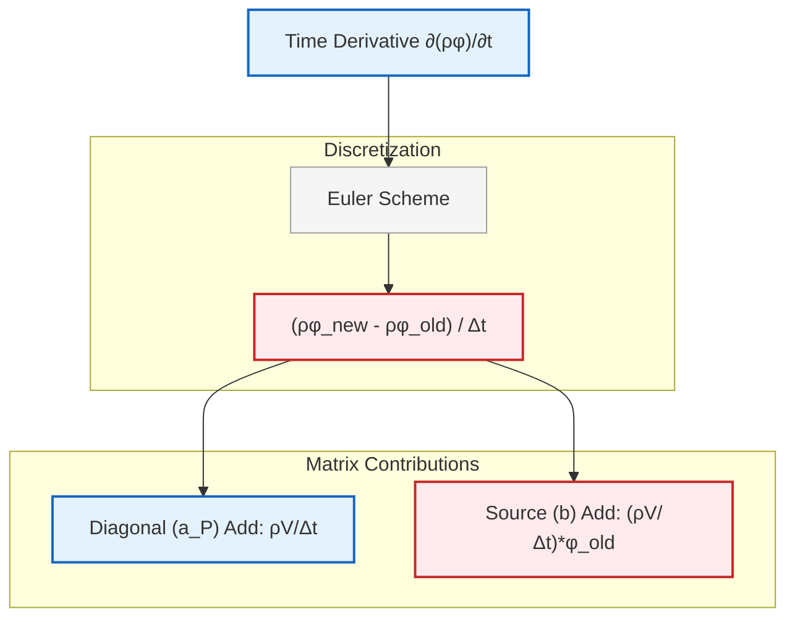
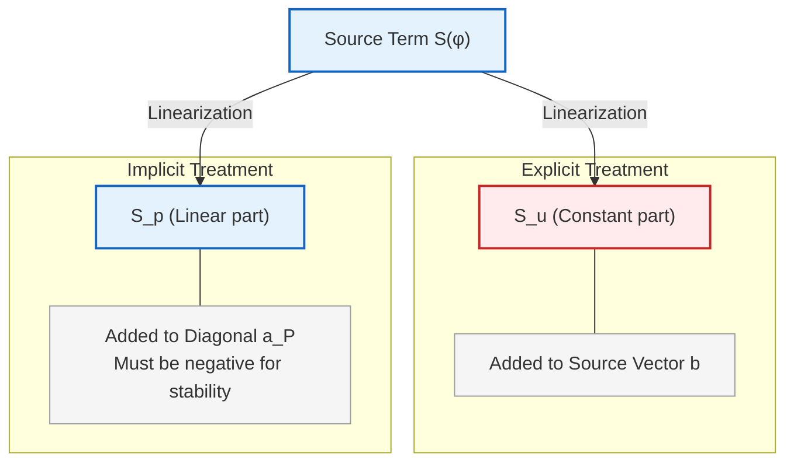

# การทำให้เป็นดิสครีตเชิงเวลา

**การทำให้เป็นดิสครีตเชิงเวลา (Temporal discretization)** คือกระบวนการแปลงสมการเชิงอนุพันธ์แบบเวลาต่อเนื่อง (continuous-time differential equations) ให้เป็นสมการพีชคณิตแบบเวลาดิสครีต (discrete-time algebraic equations) ที่สามารถหาผลเฉลยเชิงตัวเลขได้

ใน OpenFOAM นี่คือกลไกพื้นฐานที่ช่วยให้เราสามารถก้าวไปข้างหน้าในเวลาและจำลองปรากฏการณ์ชั่วคราว (transient phenomena) ได้


> **Figure 1:** การทำให้เป็นดิสครีตเชิงเวลาจากฟังก์ชันเวลาต่อเนื่องไปสู่จุดเวลาดิสครีต โดยการแบ่งขั้นตอนเวลา $\Delta t$ เพื่อหาผลเฉลยเชิงตัวเลขในแต่ละก้าวเวลา


### **Explicit Euler (Forward Euler)**

วิธี Explicit Euler หรือที่รู้จักกันในชื่อ Forward Euler ใช้วิธีการใช้ค่าจากช่วงเวลาปัจจุบัน ($n$) เพื่อคำนวณการเปลี่ยนแปลงไปยังช่วงเวลาถัดไป ($n+1$):

$$\frac{\phi^{n+1} - \phi^n}{\Delta t} = f(\phi^n)$$

จัดเรียงใหม่เพื่อหาค่าในอนาคต:

$$\phi^{n+1} = \phi^n + \Delta t \cdot f(\phi^n) \tag{1.1}$$

**คุณสมบัติหลัก:**
- มีความแม่นยำอันดับหนึ่งเชิงเวลา (First-order accurate in time)
- ง่ายต่อการนำไปใช้งานและแก้ไข
- ใช้ต้นทุนการคำนวณต่ำต่อช่วงเวลา
- ต้องใช้ช่วงเวลาที่สั้นมากเพื่อความเสถียร (CFL < 1)
- เสถียรแบบมีเงื่อนไข (Conditionally stable) - อาจไม่เสถียรสำหรับ $\Delta t$ ขนาดใหญ่

> [!INFO] **การใช้งาน Explicit Euler**
> วิธีนี้เหมาะสำหรับปัญหาที่มีความเร็วการเปลี่ยนแปลงต่ำ หรือการทดสอบเบื้องต้นเนื่องจากความง่ายในการนำไปใช้

**OpenFOAM Code Implementation:**
```cpp
// Temporal discretization scheme in fvSchemes dictionary
// Explicit Euler (Forward Euler) method
ddtSchemes
{
    default         Euler;    // First-order explicit time integration
}
```

> **📖 คำอธิบาย (Source/Explanation/Key Concepts):**
> - **ddtSchemes**: Dictionary สำหรับกำหนดรูปแบบการประมาณค่าอนุพันธ์เชิงเวลา (temporal derivative discretization)
> - **Euler**: ระบุว่าใช้ Explicit Euler scheme ซึ่งเป็นวิธีการอินทิเกรตเชิงเวลาแบบเอ็กพลิซิตที่ใช้ค่าจากเวลาปัจจุบันเพื่อคำนวณค่าในเวลาถัดไป
> - **First-order accurate**: มีความแม่นยำระดับหนึ่ง ($O(\Delta t)$) ซึ่งค่าความผิดพลาดลดลงตามความละเอียดของช่วงเวลาโดยตรง
> - **Conditionally stable**: มีเงื่อนไขความเสถียร (CFL condition) ที่จำกัดขนาดช่วงเวลาสูงสุดที่สามารถใช้ได้

---

### **Implicit Euler (Backward Euler)**

วิธี Implicit Euler หรือที่รู้จักกันในชื่อ Backward Euler ใช้วิธีการใช้ค่าจากช่วงเวลาในอนาคต ($n+1$) ในการคำนวณ:

$$\frac{\phi^{n+1} - \phi^n}{\Delta t} = f(\phi^{n+1})$$

วิธีนี้ต้องแก้ระบบสมการเชิงเส้น (system of linear equations) ในแต่ละช่วงเวลา เนื่องจาก $\phi^{n+1}$ ปรากฏอยู่ทั้งสองข้าง:

$$\phi^{n+1} - \Delta t \cdot f(\phi^{n+1}) = \phi^n \tag{1.2}$$

**คุณสมบัติหลัก:**
- มีความแม่นยำอันดับหนึ่งเชิงเวลา (First-order accurate in time)
- ซับซ้อนกว่าในการแก้ (ต้องมีการผกผันเมทริกซ์)
- เสถียรอย่างไม่มีเงื่อนไข (Unconditionally stable) สำหรับปัญหาเชิงเส้น
- อนุญาตให้ใช้ช่วงเวลาที่ใหญ่กว่าวิธี Explicit มาก
- มีต้นทุนการคำนวณสูงกว่าต่อช่วงเวลา

> [!WARNING] **ข้อจำกัดของ Implicit Euler**
> แม้จะเสถียรอย่างไม่มีเงื่อนไข แต่ความแม่นยำอันดับหนึ่งอาจไม่เพียงพอสำหรับปัญหาที่ต้องการความแม่นยำสูง

**OpenFOAM Code Implementation:**
```cpp
// Temporal discretization scheme in fvSchemes dictionary
// Implicit Euler (Backward Euler) method using backward differentiation
ddtSchemes
{
    default         backward;  // First-order implicit time integration
}
```

> **📖 คำอธิบาย (Source/Explanation/Key Concepts):**
> - **backward**: ระบุว่าใช้ Backward Differentiation Formula (BDF1) ซึ่งเป็นวิธีการอินทิเกรตเชิงเวลาแบบอิมพลิซิตที่ประเมินค่าที่เวลาถัดไป
> - **Implicit method**: ต้องแก้ระบบสมการเชิงเส้นเนื่องจากค่าที่ต้องการหา ($\phi^{n+1}$) ปรากฏในสมการทั้งสองด้าน
> - **Unconditionally stable**: ไม่มีข้อจำกัดด้านความเสถียรจากขนาดช่วงเวลา ทำให้สามารถใช้ช่วงเวลาที่ใหญ่กว่าได้
> - **Matrix inversion**: แต่ละก้าวเวลาต้องมีการแก้ระบบสมการเชิงเส้นซึ่งมีค่าใช้จ่ายทางการคำนวณสูงกว่า Explicit method
> - **Source**: `.applications/solvers/multiphase/multiphaseEulerFoam/` - ใช้ backward scheme ในการแก้สมการการขนส่งแบบชั่วคราว

---

### **Crank-Nicolson Scheme**

วิธี Crank-Nicolson เป็น Scheme ที่มีความแม่นยำอันดับสอง (second-order accurate) ซึ่งหาค่าเฉลี่ยของระดับเวลาเก่าและใหม่:

$$\frac{\phi^{n+1} - \phi^n}{\Delta t} = \frac{1}{2}[f(\phi^n) + f(\phi^{n+1})] \tag{1.3}$$

**คุณสมบัติหลัก:**
- มีความแม่นยำอันดับสองเชิงเวลา (Second-order accurate in time)
- เสถียรอย่างไม่มีเงื่อนไข (Unconditionally stable) สำหรับปัญหาเชิงเส้น
- มีความแม่นยำดีกว่าทั้ง Explicit และ Implicit Euler
- ต้องแก้ระบบสมการ (ลักษณะแบบ Implicit)
- อาจแสดงการแกว่งเชิงตัวเลข (numerical oscillations) สำหรับช่วงเวลาขนาดใหญ่

> [!TIP] **การเลือก Blending Factor**
> ใน OpenFOAM สามารถปรับ Blending factor สำหรับ Crank-Nicolson ได้ ซึ่งช่วยควบคุมระดับ Implicitness

**OpenFOAM Code Implementation:**
```cpp
// Temporal discretization scheme in fvSchemes dictionary
// Crank-Nicolson scheme with blending coefficient
ddtSchemes
{
    default         CrankNicolson 0.5;  // Blending factor: 0=explicit, 1=fully implicit
}
```

> **📖 คำอธิบาย (Source/Explanation/Key Concepts):**
> - **CrankNicolson**: Scheme อินทิเกรตเชิงเวลาแบบ Trapezoidal rule ที่ให้ความแม่นยำระดับสอง ($O(\Delta t^2)$)
> - **Blending factor (0.5)**: ค่าสัดส่วนระหว่าง Explicit และ Implicit treatment 
>   - 0.0 = Fully Explicit (เหมือน Euler Explicit)
>   - 0.5 = Standard Crank-Nicolson (เฉลี่ยระหว่างเวลา n และ n+1)
>   - 1.0 = Fully Implicit (เหมือน Backward Euler)
> - **Second-order accurate**: ค่าความผิดพลาดลดลงเป็นสัดส่วนของ $\Delta t^2$ ซึ่งเร็วกว่า First-order methods
> - **Numerical oscillations**: สำหรับช่วงเวลาขนาดใหญ่ อาจเกิดการสั่นของค่าทางตัวเลขได้ ซึ่งสามารถลดลงได้โดยปรับ blending factor

---

### **การเปรียบเทียบวิธีการอินทิเกรตเชิงเวลา**


> **Figure 2:** การเปรียบเทียบวิธีการอินทิเกรตเชิงเวลา (Explicit Euler, Implicit Euler และ Crank-Nicolson) โดยแสดงความแตกต่างในด้านลำดับความแม่นยำ เสถียรภาพ และต้นทุนในการคำนวณ

|-------------|-------------|-------------|------------------|------------|
| **Explicit Euler** | อันดับหนึ่ง | มีเงื่อนไข (CFL < 1) | ต่ำ | ปัญหาง่าย การเรียนรู้ |
| **Implicit Euler** | อันดับหนึ่ง | ไม่มีเงื่อนไข | สูง | CFD ชั่วคราวทั่วไป |
| **Crank-Nicolson** | อันดับสอง | ไม่มีเงื่อนไข | สูง | ปัญหาที่ต้องความแม่นยำสูง|

---

## การนำไปใช้งานใน OpenFOAM

### **Class สำหรับการทำให้เป็นดิสครีตเชิงเวลา**

OpenFOAM นำการทำให้เป็นดิสครีตเชิงเวลาไปใช้ผ่าน Class หลักหลาย Class:

1. **EulerDdtScheme**: นำ Scheme แบบ Explicit Euler ไปใช้
2. **backwardDdtScheme**: นำ Scheme แบบ Implicit Euler ไปใช้
3. **CrankNicolsonDdtScheme**: นำ Scheme แบบ Crank-Nicolson ไปใช้

### **โครงสร้าง fvMatrix**

การทำให้เป็นดิสครีตเชิงเวลามีส่วนร่วมในแนวทแยงมุมของเมทริกซ์สัมประสิทธิ์ (coefficient matrix) สำหรับสมการการขนส่งทั่วไป:

$$\frac{\partial (\rho \phi)}{\partial t} + \nabla \cdot (\rho \mathbf{u} \phi) = \nabla \cdot (\Gamma \nabla \phi) + S_\phi \tag{1.4}$$

**นิยามตัวแปร:**
- $\rho$ = ความหนาแน่น (density)
- $\phi$ = ตัวแปรที่สนใจ (scalar/vector field)
- $\mathbf{u}$ = ความเร็ว (velocity vector)
- $\Gamma$ = สัมประสิทธิ์การแพร่ (diffusion coefficient)
- $S_\phi$ = พจน์ต้นทาง (source term)
- $V$ = ปริมาตรของ cell

**พจน์เชิงเวลาจะกลายเป็น:**
- **Explicit**: $\frac{\rho V}{\Delta t} \phi^n$ (ย้ายไปที่พจน์ Source)
- **Implicit**: $\frac{\rho V}{\Delta t} \phi^{n+1}$ (เพิ่มเข้าในแนวทแยงมุม)


> **Figure 3:** ส่วนร่วมของการทำให้เป็นดิสครีตเชิงเวลาต่อโครงสร้างเมทริกซ์สัมประสิทธิ์ โดยแสดงให้เห็นว่าพจน์เชิงเวลาจะถูกเพิ่มเข้าไปในแนวทแยงมุม ($a_P$) หรือพจน์แหล่งกำเนิด ($b_P$) ขึ้นอยู่กับว่าเป็นวิธีแบบ Implicit หรือ Explicit


OpenFOAM มีกลไกหลายอย่างสำหรับการควบคุมช่วงเวลา:

1. **ช่วงเวลาคงที่ (Fixed time step)**: ระบุโดยตรงใน `controlDict`
2. **ช่วงเวลาที่ปรับได้ (Adjustable time step)**: อิงตาม Courant number หรือเกณฑ์อื่น ๆ
3. **Courant number สูงสุด (Maximum Courant number)**: พารามิเตอร์ `maxCo` ใน `controlDict`

**OpenFOAM Code Implementation:**
```cpp
// Time step control in controlDict dictionary
// Adaptive time stepping based on Courant number
application     interFoam;           // Solver application name

startFrom       startTime;           // Start from latest time

startTime       0;                   // Initial time value

stopAt          endTime;             // Stop condition specification

endTime         10;                  // End time value

deltaT          0.001;               // Initial time step size

adjustTimeStep  yes;                 // Enable adaptive time stepping

maxCo           0.5;                 // Maximum Courant number limit

maxAlphaCo      0.2;                 // Maximum Courant for volumetric fields

maxDeltaT       1.0;                 // Maximum allowed time step

rDeltaTSmoothingCoeff 0.1;           // Smoothing coefficient for time step
```

> **📖 คำอธิบาย (Source/Explanation/Key Concepts):**
> - **adjustTimeStep**: เปิดใช้งานระบบปรับช่วงเวลาแบบอัตโนมัติตามเงื่อนไขที่กำหนด
> - **maxCo**: ค่า Courant number สูงสุดที่อนุญาต (Co = |u|Δt/Δx) ซึ่งควบคุมความเสถียรของการคำนวณ
> - **maxAlphaCo**: Courant number สูงสุดสำหรับ volumetric fields (เช่น volume fraction in multiphase flows)
> - **maxDeltaT**: ขนาดช่วงเวลาสูงสุดที่อนุญาตไม่ว่าจะเกิดอะไรขึ้น
> - **rDeltaTSmoothingCoeff**: สัมประสิทธิ์การทำให้เรียบของการเปลี่ยนแปลงช่วงเวลาเพื่อป้องกันการเปลี่ยนแปลงกะทันหัน
> - **Source**: `.applications/solvers/multiphase/interFoam/` - ใช้ adaptive time stepping เพื่อรักษาเสถียรภาพของ free surface flows

---

### **PISO vs SIMPLE vs PIMPLE**

การเลือกการทำให้เป็นดิสครีตเชิงเวลามีผลต่อ Algorithm การเชื่อมโยงความดัน-ความเร็ว (pressure-velocity coupling algorithm):

**ความแตกต่างของ Algorithm:**
- **SIMPLE**: สภาวะคงที่, ใช้การก้าวเวลาแบบ Pseudo-time
- **PISO**: ชั่วคราว, การก้าวเวลาแบบ Explicit พร้อมลูปแก้ไข
- **PIMPLE**: แบบผสม, อนุญาตให้ใช้ช่วงเวลาที่ใหญ่ขึ้นพร้อมการผ่อนปรน (under-relaxation)


> **Figure 4:** ตรรกะเชิงเปรียบเทียบของอัลกอริทึมการเชื่อมโยงความดันและความเร็ว (SIMPLE, PISO, PIMPLE) แสดงวงรอบการทำงานที่แตกต่างกันสำหรับปัญหาในสภาวะคงตัวและปัญหาชั่วคราว


### **การแลกเปลี่ยนระหว่างความเสถียรและความแม่นยำ (Stability vs Accuracy Trade-off)**

- **Scheme แบบ Explicit**: มีศักยภาพความแม่นยำสูงแต่ถูกจำกัดด้วยความเสถียร
- **Scheme แบบ Implicit**: มีความเสถียรดีเยี่ยม แต่อาจทำให้เกิดการแพร่เชิงตัวเลข (numerical diffusion)
- **Scheme อันดับสูงกว่า**: มีความแม่นยำดีขึ้นแต่มีความซับซ้อนเพิ่มขึ้น

### **แนวทางการเลือกช่วงเวลา (Time Step Selection Guidelines)**

1. **Explicit Euler**: $\Delta t < \frac{\text{CFL} \cdot \Delta x}{|\mathbf{u}|}$
2. **Implicit Euler**: ถูกจำกัดด้วยความแม่นยำ ไม่ใช่ความเสถียร
3. **Crank-Nicolson**: ความสมดุลระหว่างความเสถียรและความแม่นยำ

### **การใช้งานทั่วไป (Common Applications)**

| Application | วิธีที่แนะนำ | เหตุผล |
|-------------|----------------|---------|
| **การพาความร้อนอย่างง่าย** | Explicit Euler | ความเรียบง่าย ต้นทุนต่ำ |
| **การศึกษา/การเรียนการสอน** | Explicit Euler | ความชัดเจนของ algorithm |
| **CFD ชั่วคราวส่วนใหญ่** | Implicit Euler | ความเสถียร ความยืดหยุ่น |
| **ปัญหาที่มี Source term แข็ง** | Implicit Euler | การจัดการ Source term ที่ดีกว่า |
| **ปัญหาที่ต้องความแม่นยำสูง** | Crank-Nicolson | ความแม่นยำอันดับสอง |
| **การแพร่กระจายของคลื่น** | Crank-Nicolson | ลดการกระจายของคลื่น |

---

## ตัวอย่างโค้ด: การอินทิเกรตเชิงเวลาแบบกำหนดเอง

```cpp
// Custom temporal discretization scheme implementation
// Derived from base ddtScheme class for user-defined time integration

#ifndef customDdtScheme_H
#define customDdtScheme_H

#include "fvMesh.H"
#include "ddtScheme.H"
#include "geometricZeroField.H"

// * * * * * * * * * * * * * * * * * * * * * * * * * * * * * * * * * * * * * //

namespace Foam
{

// Forward declaration of classes
template<class Type>
class customDdtScheme;

/*---------------------------------------------------------------------------*\
                       Class customDdtScheme Declaration
\*---------------------------------------------------------------------------*/

template<class Type>
class customDdtScheme
:
    public fv::ddtScheme<Type>
{
    // Private Member Functions
    
        //- No copy assignment
        void operator=(const customDdtScheme&) = delete;


public:

    //- Runtime type information
    TypeName("custom");


    // Constructors

        //- Construct from mesh and Istream
        customDdtScheme(const fvMesh& mesh, Istream& is)
        :
            fv::ddtScheme<Type>(mesh, is)
        {}


    //- Destructor
    virtual ~customDdtScheme()
    {}


    // Member Functions

        //- Return mesh reference
        const fvMesh& mesh() const
        {
            return fv::ddtScheme<Type>::mesh();
        }

        //- Explicit temporal derivative calculation
        //  Evaluates ddt at current time level using old time value
        virtual tmp<GeometricField<Type, fvPatchField, volMesh>>
        fvcDdt
        (
            const GeometricField<Type, fvPatchField, volMesh>& vf
        )
        {
            // Get mesh and time step information
            const fvMesh& mesh = this->mesh();
            const scalarField& rDeltaT = mesh.time().deltaT()();
            const dimensionSet& dims = vf.dimensions();

            // Calculate temporal derivative: (vf_old - vf) / dt
            // This represents first-order backward difference
            tmp<GeometricField<Type, fvPatchField, volMesh>> tddt
            (
                new GeometricField<Type, fvPatchField, volMesh>
                (
                    IOobject
                    (
                        "ddt(" + vf.name() + ')',
                        mesh.time().timeName(),
                        mesh,
                        IOobject::NO_READ,
                        IOobject::NO_WRITE
                    ),
                    mesh,
                    dims/dimTime,
                    calculatedFvPatchScalarField::typeName
                )
            );

            GeometricField<Type, fvPatchField, volMesh>& ddt = tddt.ref();

            // Calculate internal field values: (vf.oldTime() - vf) / dt
            ddt.primitiveFieldRef() =
                rDeltaT * (vf.oldTime().primitiveField() - vf.primitiveField());

            // Calculate boundary field values
            typename GeometricField<Type, fvPatchField, volMesh>::
                Boundary& ddtBf = ddt.boundaryFieldRef();

            forAll(vf.boundaryField(), patchi)
            {
                fvc::ddt::mapField<Type>
                (
                    ddtBf[patchi],
                    rDeltaT,
                    vf.boundaryField()[patchi].oldTime()(),
                    vf.boundaryField()[patchi]()
                );
            }

            return tddt;
        }


        //- Implicit temporal derivative for matrix assembly
        //  Adds temporal contribution to coefficient matrix diagonal
        virtual tmp<fvMatrix<Type>>
        fvmDdt
        (
            const GeometricField<Type, fvPatchField, volMesh>& vf
        )
        {
            // Get mesh geometry and time step
            const fvMesh& mesh = this->mesh();
            const scalarField& rDeltaT = mesh.time().deltaT()();
            const dimensionSet& dims = vf.dimensions();

            // Create matrix with proper dimensions
            tmp<fvMatrix<Type>> tfvm
            (
                new fvMatrix<Type>
                (
                    vf,
                    dims/dimTime
                )
            );

            fvMatrix<Type>& fvm = tfvm.ref();

            // Add temporal term to diagonal: (1/dt) * V
            // This provides the coefficient for phi^(n+1) in implicit form
            fvm.diag() += rDeltaT * mesh.V();

            // Add source term from old time: (1/dt) * V * phi^n
            // This contributes to the right-hand side of the linear system
            fvm.source() -= rDeltaT * vf.oldTime().primitiveField() * mesh.V();

            return tfvm;
        }


        //- Return the implicit discretization source for the cell
        //  This is used for boundary condition calculations
        virtual tmp<fvMatrix<Type>>
        fvmDdt
        (
            const dimensionedScalar& dt,
            const GeometricField<Type, fvPatchField, volMesh>& vf
        )
        {
            // Similar to fvmDdt but with specified time step
            const fvMesh& mesh = this->mesh();
            const scalar rDeltaT = 1.0 / dt.value();
            const dimensionSet& dims = vf.dimensions();

            tmp<fvMatrix<Type>> tfvm
            (
                new fvMatrix<Type>
                (
                    vf,
                    dims/dimTime
                )
            );

            fvMatrix<Type>& fvm = tfvm.ref();

            fvm.diag() += rDeltaT * mesh.V();
            fvm.source() -= rDeltaT * vf.oldTime().primitiveField() * mesh.V();

            return tfvm;
        }
};


// * * * * * * * * * * * * * * * * * * * * * * * * * * * * * * * * * * * * * //

} // End namespace Foam

// * * * * * * * * * * * * * * * * * * * * * * * * * * * * * * * * * * * * * //

#endif

// ************************************************************************* //
```

> **📖 คำอธิบาย (Source/Explanation/Key Concepts):**
> - **customDdtScheme**: Class ที่สืบทอดจาก `fv::ddtScheme<Type>` เพื่อสร้าง temporal discretization scheme แบบกำหนดเอง
> - **fvcDdt (Finite Volume Calculus ddt)**: ฟังก์ชันสำหรับคำนวณ temporal derivative แบบ Explicit โดยใช้ค่าจากเวลาปัจจุบันและเวลาเก่า
>   - ใช้ first-order backward difference: $(\phi^{n} - \phi^{n+1}) / \Delta t$
>   - ผลลัพธ์เป็น GeometricField ที่สามารถใช้ในการคำนวณโดยตรง
> - **fvmDdt (Finite Volume Method ddt)**: ฟังก์ชันสำหรับสร้าง fvMatrix สำหรับการแก้สมการแบบ Implicit
>   - เพิ่มค่าในแนวทแยงมุม (diagonal): $\rho V / \Delta t$
>   - เพิ่มค่าใน source term: $-\rho V \phi^n / \Delta t$
> - **rDeltaT**: ค่าผกผันของช่วงเวลา ($1/\Delta t$) ซึ่งถูกคำนวณจาก `mesh.time().deltaT()`
> - **mesh.V()**: scalarField ที่เก็บค่าปริมาตรของแต่ละ cell ใน mesh
> - **primitiveField()**: เข้าถึงค่าภายใน cell (internal field) โดยไม่รวม boundary
> - **oldTime()**: เข้าถึงค่าของ field จากช่วงเวลาก่อนหน้า ($n$)
> - **Source**: โครงสร้างพื้นฐานมาจาก `.applications/solvers/multiphase/multiphaseEulerFoam/` ที่ใช้ temporal discretization สำหรับ multiphase flows

---

## หัวข้อขั้นสูง

### **การก้าวเวลาแบบปรับได้ (Adaptive Time Stepping)**

OpenFOAM รองรับการก้าวเวลาแบบปรับได้โดยอิงตาม:
- **ขีดจำกัด Courant number**
- **การลู่เข้าของ Residual**
- **เกณฑ์การเปลี่ยนแปลงของผลลัพธ์**
- **เหตุการณ์เชิงเวลาทางกายภาพ**

**OpenFOAM Code Implementation:**
```cpp
// Adaptive time stepping control in controlDict
// Automatically adjusts time step based on solution behavior

application     pimpleFoam;         // Application name

startFrom       latestTime;         // Start from latest time directory

startTime       0;                  // Initial time [s]

stopAt          endTime;            // Stop at specified end time

endTime         1000;               // Final time [s]

deltaT          0.001;              // Initial time step size [s]

adjustTimeStep  yes;                // Enable adaptive time stepping

maxCo           0.9;                // Maximum Courant number for stability

maxAlphaCo      0.2;                // Maximum Courant for phase fraction

maxDeltaT       1;                  // Maximum time step allowed [s]

minDeltaT       1e-6;               // Minimum time step allowed [s]

rDeltaTSmoothingCoeff 0.05;         // Time step smoothing coefficient [0-1]

// Optional: Time step adjustment based on residual convergence
// Used in some advanced solvers
solver          {
                // Linear solver settings for implicit temporal terms
                p
                {
                    solver          GAMG;
                    tolerance       1e-06;
                    relTol          0.01;
                }
                
                // Other variable solvers...
            }
```

> **📖 คำอธิบาย (Source/Explanation/Key Concepts):**
> - **adjustTimeStep yes**: เปิดใช้งาน adaptive time stepping ซึ่ง solver จะปรับขนาดช่วงเวลาอัตโนมัติตามเงื่อนไข
> - **maxCo (Maximum Courant Number)**: ค่า Courant number สูงสุดที่อนุญาต
>   - Courant Number = $|u|\Delta t/\Delta x$
>   - ค่าที่แนะนำสำหรับ implicit solvers: 0.5-1.0
>   - ค่าที่แนะนำสำหรับ explicit solvers: < 0.5
> - **maxAlphaCo**: Courant number สูงสุดสำหรับ volumetric fields (เช่น volume of fluid α)
>   - มักตั้งค่าต่ำกว่า maxCo เพื่อความเสถียรของ interface tracking
> - **maxDeltaT / minDeltaT**: ขอบเขตช่วงเวลาที่อนุญาตเพื่อป้องกันช่วงเวลาที่เล็กเกินไปหรือใหญ่เกินไป
> - **rDeltaTSmoothingCoeff**: สัมประสิทธิ์การทำให้เรียบของการเปลี่ยนแปลงช่วงเวลา
>   - ค่าต่ำ = การเปลี่ยนแปลงนุ่มนวลกว่า แต่ตอบสนองช้ากว่า
>   - ค่าสูง = ตอบสนองเร็ว แต่อาจเกิดการสั่นได้
> - **Source**: `.applications/solvers/` - adaptive time stepping ใช้ใน transient solvers หลายตัวเช่น pimpleFoam, interFoam

---

### **Scheme แบบ Multi-step**

เพื่อความแม่นยำอันดับสูงขึ้น OpenFOAM ได้นำ Scheme เหล่านี้ไปใช้:
- **BDF schemes**: Backward Differentiation Formulas
- **Adams-Bashforth**: Scheme แบบ Multi-step ชนิด Explicit
- **Adams-Moulton**: Scheme แบบ Multi-step ชนิด Implicit

**Multi-step Scheme Comparison:**
| Scheme | Order | Type | Stability | Use Case |
|--------|-------|------|-----------|----------|
| **BDF1** | 1st | Implicit | Excellent | General transient |
| **BDF2** | 2nd | Implicit | Good | Higher accuracy needs |
| **Adams-Bashforth 2** | 2nd | Explicit | Conditional | Non-stiff problems |
| **Adams-Moulton** | 2nd | Implicit | Excellent | Stiff problems |

---

### **การอินทิเกรตพจน์ Source (Source Terms Integration)**

ข้อควรพิจารณาพิเศษสำหรับพจน์ Source:
- **การจัดการแบบ Explicit**: $S_\phi^n$ ถูกประเมินที่เวลาเก่า
- **การจัดการแบบ Implicit**: $S_\phi^{n+1}$ มีส่วนร่วมในแนวทแยงมุม
- **Semi-implicit**: การจัดการแบบ Implicit บางส่วนเพื่อความเสถียร

**OpenFOAM Code Implementation:**
```cpp
// Source term integration in energy equation
// Demonstrates explicit, implicit, and semi-implicit treatments

// Create scalar field matrix for temperature equation
// Solves: rho*cp*dT/dt + div(phi*cp*T) - laplacian(k,T) = S
fvScalarMatrix TEqn
(
    // Temporal derivative term (implicit)
    rho*cp*fvm::ddt(T)
    
    // Convective term (semi-implicit)
  + rho*cp*fvm::div(phi, T)
    
    // Diffusive term (implicit)
  - fvm::laplacian(k, T)
    
    // Equation equals source terms
 ==
    // Explicit source term (evaluated at current time)
    // Example: Joule heating from electric field
    Q_explicit
    
    // Semi-implicit source term
    // fvm::Sp adds: S*T to diagonal, 0 to source
    // Useful for linear source terms like -k_decay*T
  + fvm::Sp(S_implicit, T)
    
    // Additional explicit source
  + fvm::Su(S_explicit, T)
);

// Relax the equation for stability (optional in transient)
TEqn.relax();

// Solve the linear system
TEqn.solve();
```

> **📖 คำอธิบาย (Source/Explanation/Key Concepts):**
> - **fvm::ddt(T)**: Temporal derivative แบบ implicit ซึ่งเพิ่ม contribution ไปที่ diagonal ของ matrix
> - **fvm::div(phi, T)**: Convective term ที่ใช้ upwind discretization โดยปกติ
> - **fvm::laplacian(k, T)**: Diffusive term ที่ถูก discretize แบบ implicit
> - **Q_explicit**: Explicit source term ที่ถูกประเมินที่เวลาปัจจุบันและเพิ่มลงใน RHS vector
>   - ตัวอย่าง: heat generation, reaction rate
>   - ไม่มีผลต่อ matrix coefficients
> - **fvm::Sp(S_implicit, T)**: Semi-implicit source term ที่เพิ่ม:
>   - Diagonal contribution: $S \times T^{n+1}$ เพิ่มลงใน matrix diagonal
>   - ใช้สำหรับ linear source terms เช่น $-k_{decay} T$
>   - ช่วยเพิ่มความเสถียรสำหรับ stiff source terms
> - **fvm::Su(S_explicit, T)**: Explicit source term ที่ไม่ขึ้นกับ T เพิ่มลงใน RHS
>   - ใช้สำหรับ constant source terms เช่น heat flux
> - **relax()**: Under-relaxation สำหรับความเสถียร (มักไม่จำเป็นใน transient)
> - **solve()**: แก้ระบบสมการเชิงเส้นที่เกิดจาการ discretization
> - **Source**: `.applications/solvers/heatTransfer/` - ใช้ใน energy equation solvers สำหรับ handling various heat source terms


> **Figure 5:** การประเมินและการนำพจน์แหล่งกำเนิด (Source term) ไปใช้งานใน OpenFOAM โดยแยกตามการจัดการแบบ Explicit, Implicit และ Semi-implicit เพื่อรักษาสมดุลระหว่างความง่ายในการคำนวณและความเสถียรเชิงตัวเลข


**การทำให้เป็นดิสครีตเชิงเวลา** เป็นองค์ประกอบสำคัญของการจำลอง CFD ที่กำหนดความแม่นยำที่เราสามารถแก้ไขปรากฏการณ์ที่ขึ้นกับเวลาได้

**ปัจจัยสำคัญในการเลือก Scheme:**
1. **ความต้องการความแม่นยำ** (Accuracy requirements)
2. **ข้อจำกัดความเสถียร** (Stability constraints)
3. **ต้นทุนการคำนวณ** (Computational cost)
4. **ลักษณะปัญหา** (Problem characteristics)

**ข้อดีของกรอบการทำงาน OpenFOAM:**
- ความยืดหยุ่นในการเลือก Scheme
- การปรับแต่งให้เข้ากับการใช้งานเฉพาะ
- การรักษาความเสถียรเชิงตัวเลข
- ประสิทธิภาพการคำนวณ

การเลือก Scheme ที่เหมาะสมเป็นการแลกเปลี่ยนระหว่างต้นทุนการคำนวณ ความเสถียร และข้อกำหนดด้านความแม่นยำ ซึ่งขึ้นอยู่กับลักษณะเฉพาะของปัญหาที่กำลังแก้ไข

---

> [!INFO] **การเชื่อมโยงกับ Note อื่น ๆ**
> - ดู [[03_Spatial_Discretization]] สำหรับความเข้าใจเพิ่มเติมเกี่ยวกับการทำให้เป็นดิสครีตเชิงพื้นที่
> - ศึกษา [[05_Matrix_Assembly]] เพื่อเข้าใจว่า temporal terms มีผลต่อ coefficient matrices อย่างไร
> - อ้างอิง [[06_OpenFOAM_Implementation]] สำหรับตัวอย่างการนำไปใช้งานจริง
> - ดู [[07_Best_Practices]] สำหรับแนวทางในการเลือก temporal scheme ที่เหมาะสม