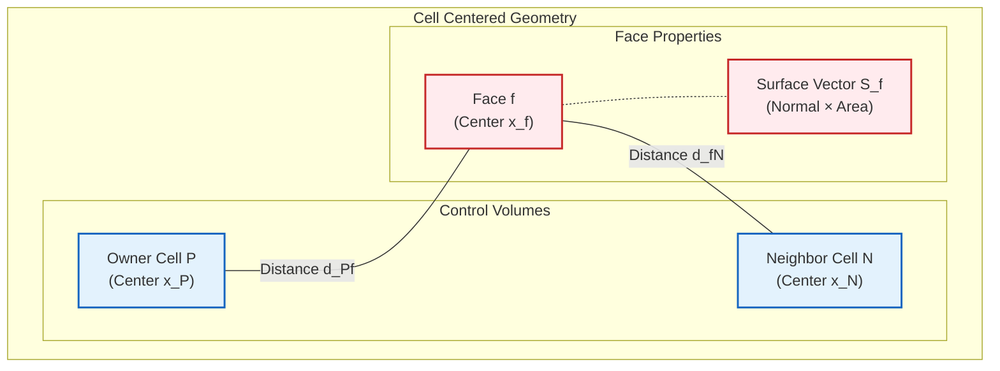
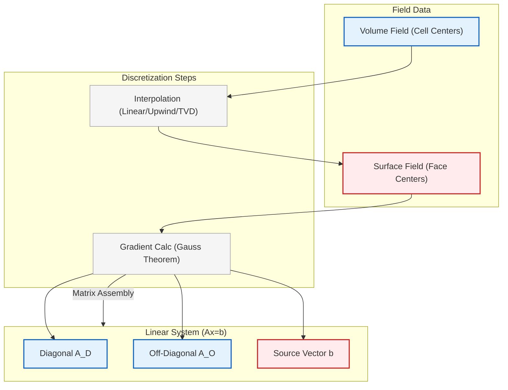
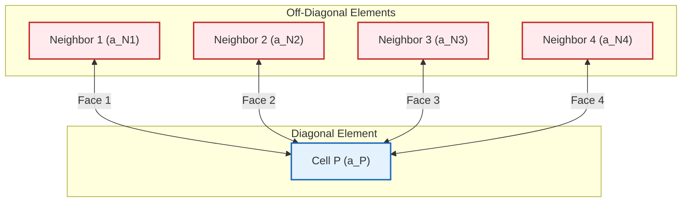
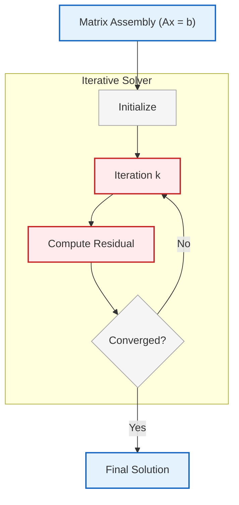

# การประกอบเมทริกซ์ (Matrix Assembly)

## ภาพรวม

การประกอบเมทริกซ์ (Matrix Assembly) คือ **กระบวนการแปลงสมการอนุพันธ์ย่อย** (partial differential equations) ให้เป็น **ระบบสมการเชิงเส้น** (system of linear equations) ที่สามารถแก้ไขได้ด้วยวิธีเชิงตัวเลข

ใน OpenFOAM กระบวนการนี้เป็น **หัวใจสำคัญ** ของการแก้ปัญหา CFD ทั้งหมด โดยเชื่อมโยงระหว่าง:
- **Spatial Discretization**: การแบ่งโดเมนเป็น Control Volumes
- **Temporal Discretization**: การก้าวเวลาในการจำลอง
- **Linear Solvers**: การแก้ระบบสมการขนาดใหญ่

> [!INFO] **ความสำคัญ**
> การประกอบเมทริกซ์ที่ถูกต้องเป็นรากฐานของการจำลอง CFD ที่แม่นยำและเสถียร ข้อผิดพลาดในขั้นตอนนี้จะนำไปสู่ผลลัพธ์ที่คลาดเคลื่อนหรือการลู่เข้าที่ล้มเหลว

---

## จากสมการสู่เมทริกซ์

### การแปลงสมการควบคุม

พิจารณาสมการ Scalar Transport ทั่วไป:

$$\frac{\partial (\rho \phi)}{\partial t} + \nabla \cdot (\rho \mathbf{u} \phi) = \nabla \cdot (\Gamma \nabla \phi) + S_\phi$$

**เทอมของสมการ:**
- $\frac{\partial (\rho \phi)}{\partial t}$: เทอมเชิงเวลา (temporal term)
- $\nabla \cdot (\rho \mathbf{u} \phi)$: เทอมการพา (convection term)
- $\nabla \cdot (\Gamma \nabla \phi)$: เทอมการแพร่ (diffusion term)
- $S_\phi$: เทอมแหล่งกำเนิด (source term)

### กระบวนการ Discretization

เมื่ออินทิกรัลเหนือ Control Volume $V_P$ และประยุกต์ใช้ **Gauss Divergence Theorem**:

$$\int_{V_P} \frac{\partial (\rho \phi)}{\partial t} \, \mathrm{d}V + \int_{\partial V_P} (\rho \mathbf{u} \phi) \cdot \mathbf{n} \, \mathrm{d}S = \int_{\partial V_P} (\Gamma \nabla \phi) \cdot \mathbf{n} \, \mathrm{d}S + \int_{V_P} S_\phi \, \mathrm{d}V$$

ซึ่งนำไปสู่รูปแบบ Discrete สำหรับแต่ละเซลล์ $P$:

$$a_P \phi_P + \sum_{N} a_N \phi_N = b_P \tag{1}$$

โดยที่:
- $a_P$: สัมประสิทธิ์แนวทแยง (diagonal coefficient) สำหรับเซลล์ $P$
- $a_N$: สัมประสิทธิ์เพื่อนบ้าน (off-diagonal coefficients) สำหรับเซลล์ $N$
- $b_P$: เวกเตอร์แหล่งกำเนิด (source vector)
- ผลรวม $\sum_N$ เกิดขึ้นเหนือเซลล์เพื่อนบ้านทั้งหมดของเซลล์ $P$

### ระบบสมการเชิงเส้น

เมื่อเขียนสมการ (1) สำหรับ *ทุก* เซลล์ใน Mesh เราจะได้ระบบสมการเชิงเส้นขนาดใหญ่:

$$[A][x] = [b]$$

**องค์ประกอบของระบบ:**

| องค์ประกอบ | สัญลักษณ์ | คำอธิบาย |
|-----------|--------|----------------|
| **Coefficient Matrix** | $[A]$ | Sparse matrix ที่ประกอบด้วยสัมประสิทธิ์ ($a_P, a_N$) |
| **Solution Vector** | $[x]$ | Vector of unknowns (เช่น pressure ที่ทุกเซลล์) |
| **Source Vector** | $[b]$ | Vector ที่ประกอบด้วยเทอม explicit และ boundary values |

OpenFOAM solvers เช่น **PCG** (Preconditioned Conjugate Gradient) และ **PBiCG** (Preconditioned Bi-Conjugate Gradient) จะแก้ระบบเมทริกซ์นี้ด้วยวิธีวนซ้ำ (iterative methods)

---

## กรอบการทำงาน Finite Volume Discretization

### แนวทาง Cell-Centered

OpenFOAM ใช้แผนการทำให้เป็นส่วนย่อยแบบ **Finite Volume** ที่เน้น **cell-centered** โดยที่ตัวแปรหลักทั้งหมด (velocity, pressure, temperature, ฯลฯ) จะถูกเก็บไว้ที่จุดศูนย์กลางทางเรขาคณิตของเซลล์คำนวณ


> **Figure 1:** การนิยามทางเรขาคณิตของปริมาตรควบคุมแบบเน้นจุดศูนย์กลางเซลล์ โดยระบุเซลล์เจ้าของและเซลล์ข้างเคียง รอยต่อระหว่างเซลล์ (หน้า) และข้อมูลพื้นที่และปริมาตรที่จำเป็นสำหรับการคำนวณฟลักซ์และเกรเดียนต์


**ข้อมูลทางเรขาคณิตที่ใช้ในการประกอบเมทริกซ์:**
- **ปริมาตรเซลล์** ($V_P$): ใช้สำหรับ Volume Integrals
- **พื้นที่ Face** ($|\mathbf{S}_f|$): ใช้สำหรับ Surface Integrals
- **เวกเตอร์แนวฉากของ Face** ($\mathbf{n}_f$): กำหนดทิศทางของ Flux
- **เวกเตอร์พื้นที่ผิว** ($\mathbf{S}_f = \mathbf{n}_f A_f$): ชี้จาก Owner Cell ไปยัง Neighbor Cell

แต่ละ Face มีเวกเตอร์พื้นที่ผิว $\mathbf{S}_f$ ที่ชี้จาก Owner Cell ไปยัง Neighbor Cell ข้อมูลทางเรขาคณิตนี้ช่วยให้สามารถคำนวณ:
- **Gradients**: การไหลของปริมาณในช่วงทางเชิงพื้นที่
- **Divergence Operations**: การไหลเข้า/ออกของ Control Volume
- **Flux Terms**: การถ่ายโอนปริมาณข้าม Face

### การประยุกต์ใช้ Gauss Divergence Theorem

สำหรับการแปลง Volume Integrals เป็น Surface Integrals:

$$\int_V \nabla \cdot \mathbf{F} \, \mathrm{d}V = \int_{\partial V} \mathbf{F} \cdot \mathbf{n} \, \mathrm{d}S$$

ใน Finite Volume Method:
$$\int_V \nabla \cdot \mathbf{F} \, \mathrm{d}V = \sum_{f} \mathbf{F}_f \cdot \mathbf{S}_f$$

---

## กระบวนการสร้างเมทริกซ์โดยละเอียด

### ขั้นตอนการประกอบเมทริกซ์

กระบวนการสร้างระบบเมทริกซ์ใน OpenFOAM เกี่ยวข้องกับ:

1. **Discretization**: สมการควบคุมอย่างเป็นระบบโดยใช้วิธี Finite Volume Method
2. **การแปลง**: รูปแบบอินทิกรัลของสมการการขนส่งเป็นรูปแบบพีชคณิต
3. **การประมาณค่า**: อินทิกรัลพื้นผิวและปริมาตรอย่างระมัดระวัง
4. **การใช้**: Gauss divergence theorem เพื่อแปลง Volume Integrals เป็น Surface Integrals

### คลาส `fvMatrix` Template Class

ในทางปฏิบัติ การประกอบเมทริกซ์ใน OpenFOAM จะถูกจัดการผ่าน **`fvMatrix` template class** ซึ่งจัดการโครงสร้าง Sparse Matrix ได้อย่างมีประสิทธิภาพ


> **Figure 2:** การไหลของข้อมูลในกระบวนการประกอบ `fvMatrix` แสดงการประมาณค่าจากปริมาตรไปยังพื้นผิว และการใช้แผนการคำนวณต่าง ๆ (Interpolation schemes) เพื่อสร้างระบบสมการเชิงเส้นแบบเบาบางสำหรับ Solver


การสร้างเมทริกซ์จริงใน OpenFOAM เป็นไปตามอัลกอริทึมที่เป็นระบบ:

```cpp
// Loop over all cells in the mesh
for (label cell = 0; cell < nCells; cell++)
{
    // Initialize diagonal coefficient
    a_P = 0.0;

    // Loop through all faces of this cell
    forAll(mesh.cells()[cell], faceI)
    {
        label face = mesh.cells()[cell][faceI];

        if (face < nInternalFaces)
        {
            // Internal face - contributes to both diagonal and off-diagonal
            label neighbor = mesh.owner()[face] == cell ?
                           mesh.neighbour()[face] : mesh.owner()[face];

            // Calculate face flux and coefficients
            scalar faceCoeff = calculateFaceCoefficient(face, cell, neighbor);

            // Off-diagonal contribution
            a_f[face] = -faceCoeff;

            // Diagonal contribution
            a_P += faceCoeff;
        }
        else
        {
            // Boundary face - contributes only to diagonal and source term
            scalar boundaryCoeff = calculateBoundaryContribution(face, cell);
            a_P += boundaryCoeff;
            b_P += boundaryCoeff * boundaryValue[face];
        }
    }

    // Add source terms
    b_P += sourceTerm[cell] * mesh.V()[cell];

    // Store in matrix structure
    matrix.setDiagonal(cell, a_P);
    for (label faceI = 0; faceI < nFacesPerCell; faceI++)
    {
        if (isInternalFace[faceI])
        {
            matrix.setOffDiagonal(cell, neighborCell[faceI], a_f[faceI]);
        }
    }
    matrix.setSource(cell, b_P);
}
```

**คำอธิบาย:**
- **ขั้นตอนการประกอบเมทริกซ์**: โค้ดแสดงกระบวนการวนซ้ำผ่านทุกเซลล์ใน Mesh เพื่อสร้างสัมประสิทธิ์เมทริกซ์
- **การจัดการ Internal Face**: สำหรับหน้าภายใน (internal faces) จะมีการคำนวณสัมประสิทธิ์ที่เชื่อมโยงระหว่างเซลล์ปัจจุบันกับเซลล์เพื่อนบ้าน ทั้งในส่วนของสัมประสิทธิ์แนวทแยง (diagonal) และนอกแนวทแยง (off-diagonal)
- **การจัดการ Boundary Face**: สำหรับหน้าขอบ (boundary faces) จะมีการเพิ่มเฉพาะสัมประสิทธิ์แนวทแยงและเวกเตอร์แหล่งกำเนิด (source vector) โดยใช้ค่าขอบเขต (boundary values)
- **การเก็บข้อมูลเมทริกซ์**: หลังจากคำนวณสัมปราสิทธิ์ทั้งหมดแล้ว จะถูกเก็บในโครงสร้างเมทริกซ์แบบ Sparse เพื่อให้การแก้ปัญหามีประสิทธิภาพ

**แนวคิดสำคัญ:**
- **Sparse Matrix Structure**: เมทริกซ์ที่เกิดจาก Finite Volume Method มีโครงสร้างแบบ Sparse เนื่องจากแต่ละเซลล์เชื่อมโยงเฉพาะกับเซลล์เพื่อนบ้านโดยตรงเท่านั้น
- **Face-based Assembly**: การประกอบเมทริกซ์พื้นฐานอยู่ที่การวนซ้ำผ่านทุกหน้า (faces) ของเซลล์ และคำนวณ Flux ที่ผ่านแต่ละหน้า
- **Coefficient Calculation**: สัมประสิทธิ์ที่คำนวณได้จากแต่ละหน้าจะถูกแบ่งเป็นส่วนที่เพิ่มขึ้นกับ Diagonal และ Off-diagonal ของเมทริกซ์
- **Source Terms Integration**: เทอมแหล่งกำเนิด (source terms) จะถูกคำนวณและเพิ่มเข้ากับ Source Vector โดยคูณด้วยปริมาตรเซลล์

---

## ความเบาบางและการจัดเก็บเมทริกซ์ (Matrix Sparsity and Storage)

### คุณสมบัติความเบาบางของเมทริกซ์

Coefficient matrix `[A]` ใน OpenFOAM แสดงโครงสร้างที่เบาบางมาก (highly sparse structure) เนื่องจาก:

- **Local Connectivity**: แต่ละเซลล์เชื่อมโยงเฉพาะกับเซลล์เพื่อนบ้านโดยตรงเท่านั้น
- **Finite Volume Discretization**: สมการแต่ละเซลล์เกี่ยวข้องเฉพาะเซลล์นั้นและเพื่อนบ้านที่ใกล้ที่สุด

**คุณสมบัติความเบาบาง:**
- สำหรับ Mesh แบบ 3D Unstructured ทั่วไปที่มีเซลล์ Polyhedral
- จำนวน Non-zero Entries ต่อแถวโดยเฉลี่ยประมาณ **12-20**
- แสดงถึงเซลล์เพื่อนบ้านโดยตรงของแต่ละเซลล์

### รูปแบบการจัดเก็บเมทริกซ์

| รูปแบบการจัดเก็บ | คำอธิบาย | การใช้งาน |
|---|---|---|
| **Compressed Sparse Row (CSR)** | รูปแบบการจัดเก็บเริ่มต้นที่แถวถูกจัดเก็บต่อเนื่องกัน | ค่าเริ่มต้นทั่วไป |
| **Diagonal storage** | สำหรับอัลกอริทึม Solver ที่ต้องการการเข้าถึง Diagonal บ่อยครั้ง | การปรับปรุงประสิทธิภาพ |
| **Symmetric storage** | เมื่อ Discretization ส่งผลให้เกิด Symmetric Coefficient Matrices | ปัญหา Symmetric |


### โครงสร้างเมทริกซ์แบบ Sparse

> [!TIP]
> **Practical Analogy: ระบบเมทริกซ์ใน FVM คือ "Social Network"**
>
> ลองจินตนาการว่า **Cell แต่ละเซลล์คือ "ผู้ใช้งาน Facebook"** คนหนึ่ง
>
> *   **$a_P$ (Diagonal):** คือ ตัวตนของผู้ใช้คนนั้น
> *   **$a_N$ (Off-diagonal):** คือ **"เพื่อน" (Friends)** ที่เชื่อมต่อกันโดยตรง
> *   **Sparsity (ความเบาบาง):** ผู้ใช้คนหนึ่งอาจมีเพื่อนแค่ 4-6 คน (Neighbor Cells) บนโลกที่มีผู้ใช้เป็นล้านคน (Total Cells)
>     *   ในเมทริกซ์ แถวหนึ่งๆ (ที่แทนผู้ใช้ 1 คน) จึงมีค่าแค่ไม่กี่ช่อง ส่วนที่เหลือเป็นศูนย์หมด เพราะเขาไม่ได้เป็นเพื่อนกับทุกคนในโลก!
> *   **Matrix Solving:** คือการพยายามกระจายข่าว (Flow Information) จากคนหนึ่งไปสู่เพื่อนของเขา และเพื่อนของเพื่อน ต่อไปเรื่อยๆ จนกระทั่งทุกคนในเครือข่ายได้รับข้อมูลที่ถูกต้องตรงกัน (Converged Solution)


> **Figure 3:** การเปลี่ยนความสัมพันธ์ระหว่างเซลล์ที่อยู่ติดกันให้เป็นสัมประสิทธิ์เมทริกซ์ ($a_P, a_N$) โดยแสดงให้เห็นว่าฟลักซ์ที่ผ่านหน้าเซลล์แต่ละหน้าส่งผลต่อสัมประสิทธิ์ในแนวทแยงและนอกแนวทแยงของเมทริกซ์อย่างไร


### ตัวอย่างสัมประสิทธิ์เมทริกซ์

สำหรับการแพร่กระจายแบบบริสุทธิ์ ($\nabla^2 \phi = 0$):

$$a_N = -\frac{\Gamma A_f}{d_{PN}} \tag{2}$$

$$a_P = -\sum_N a_N \tag{3}$$

โดยที่:
- $\Gamma$: สัมประสิทธิ์การแพร่ (diffusion coefficient)
- $A_f$: พื้นที่ Face
- $d_{PN}$: ระยะห่างระหว่างจุดศูนย์กลางเซลล์ P และ N

### เทอมการแพร่ (Diffusion Terms)

สำหรับกระบวนการที่เน้นการแพร่ (diffusion-dominated processes):

$$a_f = \frac{\Gamma_f A_f}{\delta_f} \tag{4}$$

โดยที่:
- $\Gamma_f = \frac{2\Gamma_P \Gamma_N}{\Gamma_P + \Gamma_N}$ (Harmonic Mean)
- $A_f$ คือพื้นที่ Face
- $\delta_f$ คือระยะห่างระหว่างจุดศูนย์กลางเซลล์

### เทอมการพา (Convection Terms)

สำหรับปัญหา Convection-Diffusion ที่ใช้ Upwind Differencing:

$$a_f = \rho_f \mathbf{u}_f \cdot \mathbf{S}_f + \frac{\Gamma_f A_f}{\delta_f} \tag{5}$$

โดยที่เครื่องหมายของเทอม Convective ขึ้นอยู่กับ:
- ทิศทางการไหล
- Upwind Scheme ที่ใช้

---

## การนำ Boundary Condition ไปใช้

### การจัดการ Boundary Condition ในเมทริกซ์

Boundary Conditions จะปรับเปลี่ยนสัมประสิทธิ์เมทริกซ์และ Source Terms ผ่านกลไกต่างๆ:

| ประเภท Boundary Condition | วิธีการใช้งาน | ผลกระทบ |
|---|---|---|
| **Dirichlet (Fixed Value)** | วิธี Penalty ขนาดใหญ่ หรือการปรับเปลี่ยนโดยตรง | แก้ไข Diagonal และ Source |
| **Neumann (Gradient)** | Zero-gradient หรือ Specified Gradient | ปรับเฉพาะ Source Terms |
| **Mixed (Robin)** | การรวมกันของข้อจำกัดด้านค่าและ Gradient | แก้ไขทั้ง Diagonal และ Source |
| **Calculated** | คำนวณจากตัวแปรอื่น ๆ ระหว่างการวนซ้ำ | Dependent ตามตัวแปรอื่น |

### การนำไปใช้ใน OpenFOAM

**Dirichlet Boundary**:
$$\phi_f = \phi_b$$

Contribution: $A_{PP} \mathrel{+=} \Gamma_f \frac{|\mathbf{S}_f|}{|\mathbf{d}_{Pb}|}$

**Neumann Boundary**:
$$\phi_f = \phi_P + (\nabla \phi)_b \cdot \mathbf{d}_{Pb}$$

Contribution: $A_{PP} \mathrel{+=} -\Gamma_f \frac{|\mathbf{S}_f|}{|\mathbf{d}_{Pb}|}, \quad b_P \mathrel{+=} \Gamma_f (\nabla \phi)_b \cdot \mathbf{S}_f$

> [!TIP] **Automatic Boundary Handling**
> กรอบการทำงานของ Boundary Condition จะจัดการการปรับเปลี่ยนเมทริกซ์ที่เหมาะสมโดยอัตโนมัติ ในขณะที่ยังคงรักษาเสถียรภาพเชิงตัวเลขและคุณสมบัติการลู่เข้า (convergence properties)

---

## การเพิ่มประสิทธิภาพการประกอบเมทริกซ์ (Matrix Assembly Optimization)

### กลยุทธ์การเพิ่มประสิทธิภาพ

OpenFOAM ใช้กลยุทธ์การเพิ่มประสิทธิภาพหลายอย่างเพื่อให้การประกอบเมทริกซ์มีประสิทธิภาพสูงสุด:

| กลยุทธ์ | คำอธิบาย | ประโยชน์ |
|---|---|---|
| **Cache-friendly memory access** | การจัดลำดับ Loop เพื่อเพิ่มการใช้ Cache ให้สูงสุด | ลด Memory Latency |
| **Vectorized operations** | คำสั่ง SIMD สำหรับการคำนวณสัมประสิทธิ์ | เพิ่ม Parallel Processing |
| **Parallel assembly** | Domain Decomposition และการสร้างเมทริกซ์แบบ Thread-safe | รองรับ Multi-core |
| **Lazy evaluation** | การคำนวณสัมประสิทธิ์ Face ที่มีค่าใช้จ่ายสูงแบบ Deferred | ลดการคำนวณซ้ำ |
| **Matrix reuse** | การอัปเดตแบบ Incremental สำหรับ Steady-state หรือ Pseudo-transient | เพิ่มความเร็วใน Convergence |

### การเพิ่มประสิทธิภาพด้วยฮาร์ดแวร์

**SIMD (Single Instruction, Multiple Data)**:
- ใช้คำสั่ง SIMD เพื่อคำนวณสัมประสิทธิ์หลายค่าพร้อมกัน
- เพิ่มประสิทธิภาพการคำนวณสำหรับ Mesh ที่มีเซลล์จำนวนมาก

**OpenMP Parallelization**:
- แบ่งการประกอบเมทริกซ์เป็น Threads หลายตัว
- ใช้งานได้ดีกับ Multi-core Processors

---

## การรวม Solver (Solver Integration)

### ประเภทของ Solver

ระบบเมทริกซ์ที่ประกอบขึ้นจะถูกแก้โดยใช้วิธี Iterative ที่ใช้ประโยชน์จากโครงสร้างเมทริกซ์:

| ประเภท Solver | วิธีการ | ปัญหาที่เหมาะสม |
|---|---|---|
| **Krylov subspace methods** | PCG, PBiCG, GMRES | ปัญหาทั่วไป |
| **Multigrid methods** | GAMG สำหรับ Geometric Algebraic Multigrid | ปัญหาขนาดใหญ่ |
| **Preconditioning** | Diagonal, ILU, AMG, PETSc Preconditioners | การเร่ง Convergence |
| **Convergence acceleration** | Relaxation Techniques และ Residual Smoothing | ปัญหาที่ยากต่อการลู่เข้า |

### การเลือก Solver และ Preconditioner

การเลือก Solver ที่เหมาะสมขึ้นอยู่กับ:

1. **ลักษณะของปัญหา**:
   - Symmetric vs. Non-symmetric matrices
   - Positive Definite vs. Indefinite matrices

2. **คุณสมบัติของเมทริกซ์**:
   - Condition number
   - Sparsity pattern
   - Matrix size

3. **ทรัพยากรการคำนวณที่มีอยู่**:
   - หน่วยความจำที่มี
   - จำนวน CPU cores
   - GPU availability

### ขั้นตอนการแก้สมการ


> **Figure 4:** ขั้นตอนการหาผลเฉลยแบบวนซ้ำสำหรับระบบสมการเชิงเส้น แสดงกระบวนการตั้งแต่การเลือก Solver การกำหนดค่าเริ่มต้น ไปจนถึงการตรวจสอบการลู่เข้าของค่าความคลาดเคลื่อน (Residual)


### ตัวอย่างการใช้งาน `fvMatrix`

**สมการคณิตศาสตร์**:
$$\frac{\partial \rho \mathbf{U}}{\partial t} + \nabla \cdot (\phi \mathbf{U}) - \nabla \cdot (\mu \nabla \mathbf{U}) = -\nabla p$$

### OpenFOAM Code Implementation

```cpp
// Construct the momentum equation matrix
fvVectorMatrix UEqn
(
    fvm::ddt(rho, U)                    // Implicit temporal derivative
  + fvm::div(phi, U)                    // Implicit convection term
  - fvm::laplacian(mu, U)               // Implicit diffusion term
 ==
    -fvc::grad(p)                       // Explicit pressure gradient
);

// Apply under-relaxation for stability
UEqn.relax();

// Solve the momentum equation
solve(UEqn == -fvc::grad(p));
```

**คำอธิบาย:**
- **การสร้างเมทริกซ์โมเมนตัม**: โค้ดแสดงการสร้างเมทริกซ์สมการโมเมนตัมที่มีทั้งเทอม Implicit (เชิงเวลา, การพา, การแพร่) และเทอม Explicit (เกรเดียนต์ความดัน)
- **การปรับเปลี่ยน Implicit Terms**: ใช้ `fvm::` (finite volume method) สำหรับเทอมที่ต้องการให้ถูกจัดการแบบ Implicit ซึ่งจะถูกเพิ่มเข้าไปในเมทริกซ์สัมประสิทธิ์
- **การปรับเปลี่ยน Explicit Terms**: ใช้ `fvc::` (finite volume calculus) สำหรับเทอมที่ถูกคำนวณแบบ Explicit และถูกเพิ่มเข้าไปใน Source Vector
- **การผ่อนคลาย (Relaxation)**: การใช้ `UEqn.relax()` เพื่อเพิ่มความเสถียรของการแก้ปัญหาแบบวนซ้ำ โดยลดการเปลี่ยนแปลงของค่าโซลูชันระหว่างการวนซ้ำ
- **การแก้สมการ**: ฟังก์ชัน `solve()` จะเรียกใช้ Solver เชิงเส้นที่เหมาะสมเพื่อหาผลเฉลยของระบบสมการ

**แนวคิดสำคัญ:**
- **Implicit vs Explicit Discretization**: การแยกแยะระหว่างเทอมที่ถูกจัดการแบบ Implicit (เพิ่มลงในเมทริกซ์) และ Explicit (เพิ่มลงใน Source Vector) เป็นสิ่งสำคัญสำหรับความเสถียรและประสิทธิภาพของการแก้ปัญหา
- **Matrix Assembly Process**: กระบวนการประกอบเมทริกซ์รวมถึงการวนซ้ำผ่านทุกเซลล์ใน Mesh, การคำนวณสัมประสิทธิ์จาก Flux ผ่านหน้า (faces), และการจัดการ Boundary Conditions
- **Solver Integration**: หลังจากประกอบเมทริกซ์แล้ว Solver เชิงเส้นจะถูกเรียกใช้เพื่อหาผลเฉลยของระบบสมการ โดยใช้วิธีการแบบวนซ้ำเช่น PCG, PBiCG, หรือ GMRES

### คลาสการทำให้เป็นส่วนย่อยหลัก

**คลาส Discretization หลักใน OpenFOAM:**
- **`fvm::ddt()`**: Temporal Derivative Discretization (implicit)
- **`fvc::ddt()`**: Explicit Temporal Derivative Calculation
- **`fvm::div()`**: Implicit Divergence Term Discretization
- **`fvc::div()`**: Explicit Divergence Term Calculation
- **`fvm::laplacian()`**: Implicit Laplacian Term Discretization
- **`fvc::grad()`**: Explicit Gradient Calculation

### ตัวอย่างการสร้างสมการ Energy

```cpp
// Construct the energy equation matrix
fvScalarMatrix TEqn
(
    rho*cp*fvm::ddt(T)           // Temporal derivative (implicit)
  + rho*cp*fvm::div(phi, T)       // Convection term (implicit)
  - fvm::laplacian(k, T)          // Diffusion term (implicit)
 ==
    Q                              // Source term (explicit)
);

// Apply under-relaxation for stability
TEqn.relax();

// Solve the energy equation system
solve(TEqn);
```

**คำอธิบาย:**
- **การสร้างสมการพลังงาน**: โค้ดแสดงการสร้างเมทริกซ์สมการพลังงานสำหรับการแก้ปัญหาการถ่ายเทความร้อน
- **Implicit Terms**: เทอมเชิงเวลา, การพา, และการแพร่ถูกจัดการแบบ Implicit โดยใช้ `fvm::` เพื่อให้ถูกเพิ่มเข้าไปในเมทริกซ์สัมปราสิทธิ์
- **Explicit Source Term**: เทอมแหล่งกำเนิด (Q) ถูกจัดการแบบ Explicit โดยถูกเพิ่มเข้าไปใน Source Vector
- **การผ่อนคลาย (Relaxation)**: การใช้ `TEqn.relax()` เพื่อเพิ่มความเสถียรของการแก้ปัญหา โดยลดการเปลี่ยนแปลงของอุณหภูมิระหว่างการวนซ้ำ
- **การแก้สมการ**: ฟังก์ชัน `solve()` จะเรียกใช้ Solver เชิงเส้นเพื่อหาผลเฉลยของสมการพลังงาน

**แนวคิดสำคัญ:**
- **Energy Conservation**: สมการพลังงานประกอบด้วยเทอมเชิงเวลา, การพา, การแพร่ และเทอมแหล่งกำเนิด ซึ่งเป็นการแสดงหลักการอนุรักษ์พลังงาน
- **Coupling with Flow Field**: สมการพลังงานมีความสัมพันธ์กับสมการโมเมนตัมและความต่อเนื่องผ่านตัวแปรความเจาะจง (rho), ความจุความร้อน (cp), และสัมประสิทธิ์การนำความร้อน (k)
- **Temperature-Dependent Properties**: ในปัญหาที่ซับซ้อน คุณสมบัติของของไหลอาจขึ้นอยู่กับอุณหภูมิ ซึ่งจะส่งผลให้เกิดการเชื่อมโยงที่ไม่เชิงเส้นระหว่างสมการ
- **Under-Relaxation Factor**: การปรับค่าสัมประสิทธิ์การผ่อนคลายเป็นสิ่งสำคัญสำหรับการรักษาความเสถียรของการแก้ปัญหาแบบวนซ้ำ โดยเฉพาะสำหรับปัญหาที่มีการเชื่อมโยงที่ซับซ้อน

### การจัดการ Source Term

```cpp
// Add source term to the equation
UEqn += SU;

// Apply under-relaxation
UEqn.relax();

// Semi-implicit source term handling
fvScalarMatrix TEqn
(
    rho*cp*fvm::ddt(T)
  + rho*cp*fvm::div(phi, T)
  - fvm::laplacian(k, T)
 ==
    Q_explicit                    // Explicit source term
  + fvm::Sp(S_implicit, T)        // Semi-implicit source term
);
```

**คำอธิบาย:**
- **การเพิ่ม Source Term แบบ Explicit**: การใช้ `UEqn += SU` เพื่อเพิ่ม Source Term แบบ Explicit ให้กับเมทริกซ์ ซึ่งจะถูกเพิ่มเข้าไปใน Source Vector
- **การจัดการ Source Term แบบ Semi-Implicit**: การใช้ `fvm::Sp(S_implicit, T)` เพื่อจัดการ Source Term แบบ Semi-Implicit โดยเทอมที่ขึ้นกับตัวแปร T จะถูกเพิ่มเข้าไปในเมทริกซ์สัมประสิทธิ์ ในขณะที่ส่วนที่ไม่ขึ้นกับ T จะถูกเพิ่มเข้าไปใน Source Vector
- **การผ่อนคลาย (Relaxation)**: การใช้ `UEqn.relax()` หลังจากเพิ่ม Source Term เพื่อเพิ่มความเสถียรของการแก้ปัญหา
- **ประสิทธิภาพการแก้ปัญหา**: การจัดการ Source Term แบบ Semi-Implicit สามารถเพิ่มประสิทธิภาพและความเสถียรของการแก้ปัญหาได้ โดยเฉพาะสำหรับ Source Term ที่มีค่าสัมประสิทธิ์ขนาดใหญ่

**แนวคิดสำคัญ:**
- **Explicit vs Semi-Implicit Source Treatment**: การแยกแยะระหว่าง Source Term แบบ Explicit (เพิ่มลงใน Source Vector) และ Semi-Implicit (แบ่งเป็นส่วนที่เพิ่มในเมทริกซ์และ Source Vector) เป็นสิ่งสำคัญสำหรับความเสถียรของการแก้ปัญหา
- **Linearization of Nonlinear Source Terms**: สำหรับ Source Term ที่ไม่เชิงเส้น การแบ่งเป็นส่วน Implicit และ Explicit สามารถช่วยในการ Linearization และเพิ่มความเสถียรของการแก้ปัญหา
- **Source Term Linearization**: เทคนิค `fvm::Sp()` ใช้สำหรับการจัดการ Source Term แบบ Linearized โดยที่: $S(\phi) \approx S_{explicit} + S_{implicit} \cdot \phi$
- **Convergence Improvement**: การจัดการ Source Term อย่างเหมาะสมสามารถปรับปรุงความเร็วในการลู่เข้าของการแก้ปัญหาแบบวนซ้ำได้อย่างมีนัยสำคัญ

---

## บทสรุป

**การประกอบเมทริกซ์ (Matrix Assembly)** เป็นกระบวนการที่เป็นหัวใจสำคัญของการจำลอง CFD ใน OpenFOAM ซึ่งเชื่อมโยงระหว่างทฤษฎี Finite Volume Method กับการนำไปใช้ในโค้ดจริง

**ประเด็นสำคัญ:**

1. **Discretization**: การแปลงสมการอนุพันธ์ย่อยให้เป็นรูปแบบพีชคณิต
2. **Matrix Structure**: โครงสร้าง Sparse Matrix ที่เกิดจาก Finite Volume Method
3. **Coefficient Calculation**: การคำนวณสัมประสิทธิ์จาก Geometric Information และ Physical Properties
4. **Boundary Conditions**: การนำ Boundary Condition ไปใช้ในระบบเมทริกซ์
5. **Solver Integration**: การแก้ระบบสมการเชิงเส้นที่เกิดขึ้น

**ข้อดีของกรอบการทำงาน OpenFOAM:**
- การจัดการ Automatic Matrix Assembly
- ความยืดหยุ่นในการเลือก Discretization Schemes
- ประสิทธิภาพสูงสำหรับ Sparse Linear Systems
- การรองรับ Parallel Processing

> [!WARNING] **ข้อควรระวัง**
> การประกอบเมทริกซ์ที่ไม่ถูกต้องอาจนำไปสู่:
> - การลู่เข้าที่ล้มเหลว
> - ผลลัพธ์ที่คลาดเคลื่อนทางกายภาพ
> - ความไม่เสถียรเชิงตัวเลข

การเข้าใจกระบวนการประกอบเมทริกซ์อย่างลึกซึ้งเป็นสิ่งสำคัญสำหรับการพัฒนา Solver ที่มีประสิทธิภาพและแม่นยำใน OpenFOAM

---

## 🧠 Concept Check: ทดสอบความเข้าใจ

<details>
<summary><b>1. Sparse Matrix (เมทริกซ์เบาบาง) คืออะไร และทำไม FVM ถึงสร้าง Matrix แบบนี้?</b></summary>

**คำตอบ:** Sparse Matrix คือเมทริกซ์ที่มีสมาชิกเป็น **ศูนย์ (Zero)** แทบทั้งหมด มีสมาชิกที่มีค่าจริง (Non-zero) เพียงเล็กน้อย
FVM สร้าง Matrix แบบนี้เพราะ **แต่ละ Cell เชื่อมต่อกับ Cell เพื่อนบ้าน (Neighbors) ที่อยู่ติดกันเท่านั้น** (เช่น 4-6 เซลล์) ไม่ได้เชื่อมต่อกับทุกเซลล์ใน Mesh ดังนั้นในแต่ละแถวของ Matrix จึงมีค่าแค่ไม่กี่ตำแหน่งที่ตรงกับเพื่อนบ้าน ส่วนที่เหลือเป็นศูนย์หมด
</details>

<details>
<summary><b>2. "Diagonal Dominance" (การเด่นในแนวทแยง) สำคัญอย่างไรต่อการแก้สมการ Linear System?</b></summary>

**คำตอบ:** Diagonal Dominance หมายถึงค่าสัมบูรณ์ของสมาชิกในแนวทแยง ($|a_P|$) มีค่ามากกว่าผลรวมของสมาชิกอื่นๆ ในแถวเดียวกัน ($\sum |a_N|$)
คุณสมบัตินี้สำคัญมากเพราะ **มันการันตีว่า Iterative Solver จะสามารถหาคำตอบได้ (Converge)** ถ้า Matrix ไม่มีคุณสมบัตินี้ Solver อาจจะวนลูปไม่รู้จบหรือคำนวณระเบิดได้ FVM จึงออกแบบมาเพื่อรักษาคุณสมบัตินี้ (เช่น การเอาเทอมลบไปไว้ฝั่งขวา หรือเพิ่ม time contribution ในแนวทแยง)
</details>

<details>
<summary><b>3. ถ้าเราใช้ Mixed Boundary Condition (Robin) จะส่งผลต่อ Matrix อย่างไร?</b></summary>

**คำตอบ:** จะส่งผลต่อ **ทั้ง Diagonal ($a_P$) และ Source Vector ($b$)**
ต่างจาก Dirichlet (ส่งผลหลักๆ ต่อ Diagonal/Source แบบ Fix) หรือ Neumann (ส่งผลต่อ Source) แบบ Mixed จะมีความสัมพันธ์ระหว่างค่าและเกรเดียนต์ ทำให้ต้องปรับแก้สัมประสิทธิ์ทั้งสองส่วนเพื่อให้สอดคล้องกัน
</details>