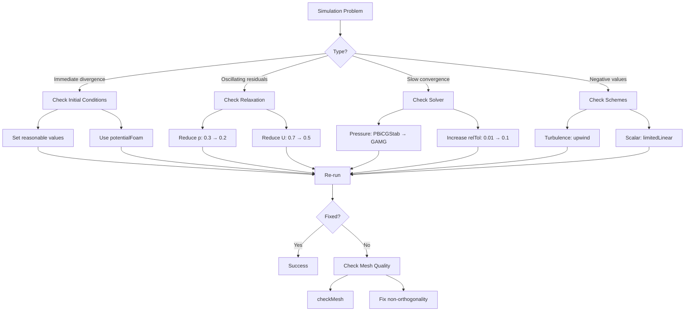

# Matrix Assembly and Linear Solvers

กระบวนการแปลง PDE → ระบบสมการเชิงเส้น $[A][\phi] = [b]$

> **ทำไมต้องสนใจ Matrix Assembly?**
> - **Debug ได้ถูกจุด:** เข้าใจ matrix = เข้าใจว่า discretization scheme ทำงานอย่างไร
> - **แก้ปัญหา divergence:** รู้ทันทีว่า diagonal dominance หายไปไหน
> - **เลือก solver ได้เหมาะสม:** แต่ละ equation ต้องการ solver ที่ต่างกัน
> - **ปรับ performance:** ทราบว่า tolerance/relaxation ส่งผลอย่างไร
> - **Custom source terms:** เขียน semi-implicit source ได้ถูกต้อง
> - **fvm vs fvc mastery:** เข้าใจว่าอะไรควรเป็น implicit หรือ explicit

---

## Prerequisites

⚠️ **ควรอ่านก่อน:**
- [02_Fundamental_Concepts.md](02_Fundamental_Concepts.md) — FVM Theory Foundation และ general transport equation
- [03_Spatial_Discretization.md](03_Spatial_Discretization.md) — Diffusion/Convection coefficients และ non-orthogonal correction
- [04_Temporal_Discretization.md](04_Temporal_Discretization.md) — Temporal contribution และ CFL

---

## Learning Objectives

หลังจากอ่านบทนี้ คุณจะสามารถ:
- **คำนวณ** coefficient แต่ละตัวใน matrix ($a_P$, $a_N$, $b_P$) จาก discretization terms ทุกประเภท
- **อธิบาย** โครงสร้าง sparse matrix และทำไม OpenFOAM เลือกใช้ LDU format
- **เลือก** linear solver ที่เหมาะสมกับแต่ละประเภทสมการ (GAMG vs PBiCGStab)
- **แก้ปัญหา** matrix instability และ solver divergence อย่างเป็นระบบ
- **ปรับแต่ง** relaxation factors, tolerance, และ solver settings อย่างมีหลักการ
- **เขียน** semi-implicit source terms ที่ stable
- **แยกแยะ** ได้อย่างชัดเจนว่าควรใช้ `fvm::` หรือ `fvc::` สำหรับแต่ละ term

---

## Part 1: Matrix Assembly Overview

### หนึ่ง Cell = หนึ่งสมการ

หลัง Discretization ทุก Cell จะได้สมการ:

$$a_P \phi_P + \sum_{N} a_N \phi_N = b_P$$

> **💡 คิดแบบนี้:**
> แต่ละ cell มี "สมการตัวเอง" ที่บอกว่า:
> "ค่าที่ฉัน ($\phi_P$) ขึ้นกับค่าที่เพื่อนบ้าน ($\phi_N$) และ sources ($b_P$)"

เมื่อรวมทุก Cell → ได้ระบบ:

$$[A][\phi] = [b]$$

| Component | มาจาก | ทำไมสำคัญ | ลักษณะ |
|-----------|-------|----------|---------|
| $a_P$ (Diagonal) | ddt, diffusion, convection, source | ต้องใหญ่พอ → stability | ติดบวก, ใหญ่สุด |
| $a_N$ (Off-diagonal) | diffusion, convection ที่ Neighbors | เชื่อม cells เข้าด้วยกัน | ติดลบ (diffusion) หรือผสม (convection) |
| $b_P$ (Source/RHS) | Explicit terms, BCs, old time values | "ข้อมูลที่รู้แล้ว" | Known values |

### Diagonal Dominance: Key to Stability

**Definition:** สมการมี diagonal dominance ถ้า:

$$|a_P| \geq \sum_{N} |a_N|$$

> **⚠️ Critical:** Diagonal dominance เป็นเงื่อนไข **สำคัญที่สุด** สำหรับ convergence ของ iterative solvers

**ทำไมสำคัญ:**
- Guarantees solver converge (สำหรับ M-matrices)
- ลด oscillation ใน solution
- เพิ่ม robustness ของ nonlinear iteration
- เป็นเป้าหมายของ relaxation strategies

---

## Part 2: Sparse Matrix Structure - Visualized

### ทำมาที่ไหน?

Matrix $[A]$ มีโครงสร้าง **Sparse** เพราะ:
- แต่ละ Cell เชื่อมต่อกับ **Neighbors เท่านั้น** (ไม่ใช่ทุก Cell)
- Non-zero entries ≈ 6-20 ต่อแถว (3D hexahedral mesh)
- Storing only non-zeros → memory O(N) แทน O(N²)

### ASCII Visualization: 1D Mesh

```
1D Mesh Example (5 cells):
┌─────┬─────┬─────┬─────┬─────┐
│  0  │  1  │  2  │  3  │  4  │
└─────┴─────┴─────┴─────┴─────┘
  └───────┘       └───────┘
    neighbors       neighbors

Corresponding Matrix [A] (5×5):
Cell 0: [●    ○    ○    ○    ○ ]   ← Diagonal (a_P) + 1 neighbor (a_N)
Cell 1: [●    ●    ○    ○    ○ ]   ← Diagonal (a_P) + 2 neighbors
Cell 2: [○    ●    ●    ●    ○ ]   ← Diagonal (a_P) + 2 neighbors
Cell 3: [○    ○    ●    ●    ● ]   ← Diagonal (a_P) + 2 neighbors
Cell 4: [○    ○    ○    ●    ● ]   ← Diagonal (a_P) + 1 neighbor

Legend: ● = Non-zero, ○ = Zero (not stored)
```

### ASCII Visualization: 2D Structured Mesh

```
5×5 Mesh (25 cells):
    Cell connectivity pattern:
     0───1───2───3───4
     │   │   │   │   │
     5───6───7───8───9
     │   │   │   │   │
    10──11──12──13───14
     │   │   │   │   │
    15──16──17──18───19
     │   │   │   │   │
    20──21──22──23───24

Matrix Structure (25×25):
Row 0:  ● ● ○ ○ ○  ● ○ ○ ○ ○  ○ ○ ○ ○ ○  ○ ○ ○ ○ ○  ○ ○ ○ ○ ○
Row 1:  ● ● ● ○ ○  ○ ● ○ ○ ○  ○ ○ ○ ○ ○  ○ ○ ○ ○ ○  ○ ○ ○ ○ ○
Row 2:  ○ ● ● ● ○  ○ ○ ● ○ ○  ○ ○ ○ ○ ○  ○ ○ ○ ○ ○  ○ ○ ○ ○ ○
Row 6:  ● ○ ○ ○ ○  ● ● ● ○ ○  ● ○ ○ ○ ○  ○ ○ ○ ○ ○  ○ ○ ○ ○ ○
Row 12: ○ ○ ● ○ ○  ○ ● ● ● ○  ○ ● ● ● ○  ○ ○ ○ ○ ○  ○ ○ ○ ○ ○
...
Row 24: ○ ○ ○ ○ ○  ○ ○ ○ ○ ○  ○ ○ ○ ○ ○  ○ ○ ○ ○ ●  ○ ○ ● ● ●

Pattern: Interior cells = 5 non-zeros, Edge cells = 3-4 non-zeros
         Corner cells = 2-3 non-zeros
```

### ASCII Visualization: 3D Connectivity

```
3D Hexahedral Mesh (Cell P with 6 neighbors):
              N (top)
               │
               │
    W ──────── P ──────── E
               │
               │
              S (bottom)

     (front/rear faces not shown for clarity)

Matrix [A] for Cell P:
        N  S  E  W  Fr Re  (neighbors)
Row P: [● ● ● ● ● ●]  ← 6 non-zeros + diagonal
        ↓
    Only 7 entries stored out of N_total_cells possible!
```

### ทำไม Sparse สำคัญ?

| แง่มุม | Dense Matrix | Sparse Matrix |
|---------|--------------|---------------|
| **Memory** | O(N²) → 1M cells = 10¹² entries ❌ | O(N) → 1M cells = ~6M entries ✅ |
| **Computation** | O(N²) operations | O(N) operations |
| **Speed** | ช้ามาก | เร็วมาก (iterative solvers) |
| **Format** | 2D array | CSR, CSC, LDU (OpenFOAM) |

### OpenFOAM's LDU Format

OpenFOAM ใช้ **LDU (Lower-Diagonal-Upper)** format:

```cpp
// LDU Storage for a mesh with N cells
scalarField L;    // Lower triangular coefficients (owner→neighbour)
scalarField D;    // Diagonal coefficients
scalarField U;    // Upper triangular coefficients (neighbour→owner)

labelList l;      // Addressing: L[i] connects cell owner[i] to neighbour[i]
labelList u;      // Addressing: U[i] connects cell owner[i] to neighbour[i]
```

**Memory Layout:**

```
Cell Connectivity:
    Owner cells:  [0, 0, 1, 1, 2, ...]
    Neighbour:    [1, 3, 2, 4, 5, ...]

Coefficients (size = nFaces):
    Lower:  [L₀, L₁, L₂, L₃, L₄, ...]  // Owner→Neighbour
    Upper:  [U₀, U₁, U₂, U₃, U₄, ...]  // Neighbour→Owner (Lᵢ = Uᵢ for symmetric)
    Diagonal: [D₀, D₁, D₂, D₃, ...]    // size = nCells
```

**Advantages:**
- เก็บเฉพาะ non-zeros → memory efficient
- Symmetric matrix: L = U (เก็บชุดเดียว)
- ออกแบบมาสำหรับ FVM connectivity
- รวดเร็วสำหรับ matrix-vector multiplication

> **💡 นั่นคือเหตุผล:** OpenFOAM ใช้ iterative solvers (GAMG, PBiCGStab) ไม่ใช่ direct solvers (LU, QR)

---

## Part 3: Coefficient Calculations - Complete Guide

### สรุป: Term → Coefficient Mapping

| Term | $a_P$ (Diagonal) | $a_N$ (Off-diagonal) | $b_P$ (Source) | Stability Effect |
|------|-----------------|---------------------|---------------|------------------|
| **Temporal** | $+\frac{\rho V}{\Delta t}$ | — | $+\frac{\rho V}{\Delta t} \phi^n$ | ✅ เพิ่ม diagonal dominant |
| **Diffusion** | $-\sum a_N$ | $-\frac{D_f A_f}{d_{PN}}$ | — | ✅ สร้าง diagonal dominant |
| **Convection** | $-\sum a_N$ | Upwind: $\max(-\Phi_f, 0)$ | — | ⚠️ อาจลด diagonal dominant |
| **Source (explicit)** | — | — | $S_u V$ | ⚠️ ไม่มีผลต่อ diagonal |
| **Source (implicit)** | $+S_p V$ | — | $S_u V$ | ✅ เพิ่ม diagonal (ถ้า $S_p < 0$) |

### 3.1 Temporal Term (Implicit Euler)

$$\frac{\partial \phi}{\partial t} \rightarrow a_P += \frac{\rho V}{\Delta t}, \quad b_P += \frac{\rho V}{\Delta t} \phi^n$$

**ทำมาจากไหน?** ดู [04_Temporal_Discretization.md](04_Temporal_Discretization.md) สำหรับ temporal schemes

**ทำไมช่วย Stability?**
- เพิ่ม $\frac{\rho V}{\Delta t}$ เข้า diagonal → diagonal ใหญ่ขึ้น
- $\Delta t$ เล็ก → contribution มาก → stable มากขึ้น
- นี่คือเหตุผลว่าทำไม **ลด $\Delta t$ ช่วยแก้ divergence**

**ตัวอย่างการคำนวณ (Step-by-Step):**

สมมติ:
- $\rho = 1000$ kg/m³
- $V = 0.001$ m³ (cell volume)
- $\Delta t = 0.01$ s
- $\phi^n = 300$ K (old time value)

**Step 1: คำนวณ temporal coefficient**
$$a_P^{temp} = \frac{\rho V}{\Delta t} = \frac{1000 \times 0.001}{0.01} = 100$$

**Step 2: คำนวณ source contribution**
$$b_P^{temp} = a_P^{temp} \times \phi^n = 100 \times 300 = 30000$$

→ Temporal term เพิ่ม diagonal 100 (ช่วย stability มาก!)

### 3.2 Diffusion Term (Central Difference)

$$\nabla \cdot (D \nabla \phi) \rightarrow a_N = -\frac{D_f A_f}{d_{PN}}, \quad a_P = -\sum_N a_N$$

**ทำมาจากไหน?** ดู [03_Spatial_Discretization.md](03_Spatial_Discretization.md) สำหรับ non-orthogonal correction

**ตัวอย่างการคำนวณ (Step-by-Step):**

**Problem:** 2D steady-state heat conduction ใน Cell P ที่มี 4 neighbors

```
       N (d = 0.01 m, T = 310 K)
       |
       |  D = 50 W/m·K
       |
W ----- P ----- E  (d = 0.01 m each)
       |         T = 290 K
       |
       S (T = 285 K)

Cell P: T = 300 K (initial guess)
- Face area A_f = 0.01 m² (ทุก face)
- Distance d_PN = 0.01 m (ทุก neighbor)
```

**Step 1: คำนวณ $a_N$ สำหรับแต่ละ neighbor**

$$a_N = -\frac{D A_f}{d_{PN}} = -\frac{50 \times 0.01}{0.01} = -50$$

→ ทุก neighbor ได้ $a_N = -50$ (ติดลบเสมอสำหรับ diffusion!)

**Step 2: คำนวณ $a_P$**

$$a_P^{diff} = -\sum_N a_N = -(-50 - 50 - 50 - 50) = 200$$

**Step 3: ตรวจสอบ Diagonal Dominance**

$$|a_P| = 200 > \sum |a_N| = 4 \times 50 = 200$$

→ Borderline diagonal dominant ($|a_P| = \sum |a_N|$)

**ทำไม Diffusion ดีสำหรับ Stability?**
- $a_N < 0$ เสมอ (ติดลบ)
- $a_P = -\sum a_N > 0$ (เป็นบวก)
- → **Diagonal Dominant** → Stable!

### 3.3 Convection Term (Upwind Scheme)

$$\nabla \cdot (\phi \mathbf{u}) \rightarrow a_N = \max(-\Phi_f, 0)$$

โดย $\Phi_f = \mathbf{u}_f \cdot \mathbf{S}_f$ (face flux)

**ทำมาจากไหน?** ดู [03_Spatial_Discretization.md](03_Spatial_Discretization.md) สำหรับ convection schemes

**ตัวอย่างการคำนวณ (Step-by-Step):**

**Problem:** 1D convection ของ scalar T ไปทางบวก

```
Flow direction: →

    W       P       E
    ●───────■───────●
   T_W     T_P     T_E
           ↑
    Face f (between P and E)

Given:
- u_f = 10 m/s (velocity at face)
- A_f = 0.01 m² (face area)
- Flow ไปทางบวก (จาก W → P → E)
```

**Step 1: คำนวณ Face Flux**

$$\Phi_f = u_f A_f = 10 \times 0.01 = 0.1 \text{ m³/s}$$

**Step 2: คำนวณ $a_N$ สำหรับแต่ละ neighbor**

สำหรับ upwind:
- ถ้า $\Phi_f > 0$ (flow ไปทางบวก): ใช้ค่า upstream (W สำหรับ face W-P, P สำหรับ face P-E)
- ถ้า $\Phi_f < 0$ (flow ไปทางลบ): ใช้ค่า upstream (P สำหรับ face W-P, E สำหรับ face P-E)

**สำหรับ Cell P:**
- Face ด้านซ้าย (W-P): $\Phi_f > 0$ → information มาจาก W → $a_W = \Phi_f = 0.1$
- Face ด้านขวา (P-E): $\Phi_f > 0$ → information ไปที่ E → $a_E = \max(-0.1, 0) = 0$

$$a_W^{conv} = 0.1, \quad a_E^{conv} = 0$$

**Step 3: คำนวณ $a_P$**

$$a_P^{conv} = -\sum_N a_N = -(0.1 + 0) = -0.1$$

⚠️ **Problem:** $a_P = -0.1$ (ติดลบ!) → Unstable!

**แก้ไข:** ต้องเพิ่ม temporal term หรือ diffusion term เพื่อให้ $a_P > 0$

**ทำไม Convection อาจเป็นปัญหา?**
- Upwind: $a_N$ มาจากด้าน upstream เท่านั้น → อาจทำให้ $a_P$ ติดลบ
- Central: $a_N$ มาจากทั้งสองด้าน → อาจทำให้ **diagonal dominance ลดลง** → unstable

### 3.4 Combined Example: Convection-Diffusion with Temporal

**Problem:** 1D transient convection-diffusion ของ T

```
    W       P       E
    ●───────■───────●
   T_W     T_P     T_E

Given:
- u = 1 m/s, A = 0.01 m²
- D = 0.1 m²/s, d = 0.01 m
- ρ = 1000 kg/m³, V = 0.001 m³
- Δt = 0.01 s
- T_W = 100°C, T_E = 50°C, T_Pⁿ = 75°C
```

**Step 1: Temporal Contribution**

$$a_P^{temp} = \frac{\rho V}{\Delta t} = \frac{1000 \times 0.001}{0.01} = 100$$
$$b_P^{temp} = a_P^{temp} \times T_P^n = 100 \times 75 = 7500$$

**Step 2: Convection Contribution (Upwind)**

$$\Phi_f = u A = 1 \times 0.01 = 0.01$$

$$a_W^{conv} = \Phi_f = 0.01$$
$$a_E^{conv} = \max(-\Phi_f, 0) = 0$$
$$a_P^{conv} = -0.01$$

**Step 3: Diffusion Contribution (Central)**

$$a_N^{diff} = -\frac{D A}{d} = -\frac{0.1 \times 0.01}{0.01} = -0.1$$

$$a_W^{diff} = -0.1$$
$$a_E^{diff} = -0.1$$
$$a_P^{diff} = -(-0.1 - 0.1) = 0.2$$

**Step 4: Combine All**

$$a_W = 0.01 - 0.1 = -0.09$$
$$a_E = 0 - 0.1 = -0.1$$
$$a_P = 100 - 0.01 + 0.2 = 100.19$$
$$b_P = 7500$$

**Step 5: Check Diagonal Dominance**

$$|a_P| = 100.19, \quad \sum |a_N| = |-0.09| + |-0.1| = 0.19$$

→ **Very diagonal dominant!** (Ratio = 0.19/100.19 = 0.002)

**Step 6: Solve**

$$100.19 T_P - 0.09 T_W - 0.1 T_E = 7500$$

$$T_P = \frac{7500 + 0.09 \times 100 + 0.1 \times 50}{100.19} = 75.3°C$$

→ Temporal term ช่วยให้ stable มาก!

### 3.5 Higher-Order Convection Schemes

Different schemes affect coefficients differently:

| Scheme | $a_N$ Formula | Diagonal Effect | Boundedness |
|--------|--------------|-----------------|-------------|
| **Upwind** | $\max(-\Phi_f, 0)$ | Moderate | ✅ Bounded |
| **Linear** | $\alpha \Phi_f$ (symmetric) | May reduce dominance | ❌ Unbounded |
| **Linear Upwind** | Upwind + gradient correction | Better accuracy | ✅ Bounded |
| **TVD/Limited** | Blended with limiter | Adaptive | ✅ Bounded |

**Practical Rule:** เมื่อใช้ higher-order schemes → ลด relaxation เพื่อรักษา stability

### 3.6 Non-Orthogonal Correction Effect

เมื่อ mesh ไม่ orthogonal → diffusion term แตกเป็น 2 ส่วน (ดูจาก [03_Spatial_Discretization.md](03_Spatial_Discretization.md)):

**Explicit correction:**
$$a_P^{orth} = -\sum a_N^{orth}$$
$$b_P^{correct} = \sum D_f (\nabla \phi)_f \cdot \mathbf{k}$$

→ Correction term ไปที่ RHS → **ลด stability** ถ้ามุมเบี่ยงเบนมาก

**Implicit correction:**
- เพิ่ม iteration ภายใน time step (`nNonOrthogonalCorrectors`)
- ทำให้ solution converge ช้าลง

---

## Part 4: fvm vs fvc - The Critical Distinction

### ความแตกต่างที่สำคัญที่สุด

| Prefix | ชื่อเต็ม | ผลลัพธ์ | ใช้เมื่อ | Matrix Effect |
|--------|---------|---------|---------|---------------|
| `fvm::` | Finite Volume Method | → Matrix ($a_P$, $a_N$) | Unknown (กำลังหา) | ✅ เพิ่ม coefficients |
| `fvc::` | Finite Volume Calculus | → Field (ตัวเลขทันที) | Known (รู้ค่าแล้ว) | ❌ ไปที่ RHS ($b_P$) |

> **ทำไมต้องแยก?**
> - **fvm:** $\phi$ ยังไม่รู้ → ต้องเก็บเป็น coefficient ใน matrix
> - **fvc:** $\phi$ รู้แล้ว → คำนวณเป็นตัวเลขได้เลย → ใส่ source

### Decision Tree: fvm or fvc?

```
Is this variable being solved in the current equation?
│
├─ YES → Use fvm:: (implicit, builds matrix)
│         └─ Example: fvm::ddt(U), fvm::div(phi, U)
│
└─ NO  → Use fvc:: (explicit, goes to RHS)
          └─ Example: fvc::grad(p), fvc::curl(U)
```

### ตัวอย่าง: Momentum Equation

$$\rho\frac{\partial \mathbf{u}}{\partial t} + \nabla \cdot (\rho \mathbf{u} \mathbf{u}) = -\nabla p + \nabla \cdot (\mu \nabla \mathbf{u})$$

```cpp
fvVectorMatrix UEqn
(
    fvm::ddt(rho, U)              // U ไม่รู้ → เข้า Diagonal (a_P += ρV/Δt)
  + fvm::div(phi, U)              // U ไม่รู้ → เข้า Diagonal + Off-diagonal
  - fvm::laplacian(mu, U)         // U ไม่รู้ → เข้า Diagonal + Off-diagonal
 ==
    -fvc::grad(p)                 // p รู้แล้ว → คำนวณเป็น Source vector
);
```

**ทำไม `fvc::grad(p)`?**
- p มาจาก pressure correction (SIMPLE/PISO) = รู้ค่าแล้วจาก iteration ก่อนหน้า
- ใส่เป็น explicit source ใน RHS
- ไม่สามารถใช้ `fvm::grad(p)` เพราะ gradient operator ไม่สร้าง symmetric matrix

### Matrix Implications Summary

| Operator | fvm:: (Implicit) | fvc:: (Explicit) | Matrix Effect |
|----------|------------------|------------------|---------------|
| `ddt(ρ, φ)` | ✅ | ✅ | fvm: $a_P += \frac{\rho V}{\Delta t}$, $b_P += \frac{\rho V}{\Delta t} \phi^n$ |
| `div(φ, U)` | ✅ | ✅ | fvm: $a_P, a_N$ เพิ่ม, fvc: คำนวณเป็นเลข |
| `laplacian(Γ, φ)` | ✅ | ✅ | fvm: $a_P, a_N$ เพิ่ม, fvc: คำนวณเป็นเลข |
| `grad(φ)` | ❌ | ✅ | **ไม่มี fvm::grad** — gradient ไม่สร้าง symmetric matrix |
| `curl(φ)` | ❌ | ✅ | **ไม่มี fvm::curl** — เหมือนกัน |
| `div(φ)` | ❌ | ✅ | fvc ใช้คำนวณ divergence ของ known flux field |

> **⚠️ หมายเหตุ:** ไม่มี `fvm::grad()` เพราะ $\nabla \phi$ ไม่ linearize กับ $\phi$ ได้ดี และไม่ได้สร้าง M-matrix

### When to Use Which?

```cpp
// ✅ CORRECT: fvm for unknown, fvc for known
fvScalarMatrix TEqn
(
    fvm::ddt(T)              // Unknown: T
  + fvm::div(phi, T)         // Unknown: T
  - fvm::laplacian(k, T)     // Unknown: T
 ==
    fvc::div(phi, T_old)     // Known: T_old (explicit convection for test)
);

// ❌ WRONG: fvc for unknown (unstable!)
fvScalarMatrix TEqn
(
    fvc::ddt(T)              // Bad! No matrix for time derivative
  + fvc::div(phi, T)         // Bad! No matrix for convection
);

// ⚠️ CONTEXT-DEPENDENT: Pressure in momentum equation
// In SIMPLE/PISO algorithms:
fvVectorMatrix UEqn
(
    fvm::ddt(U)
  + fvm::div(phi, U)
  - fvm::laplacian(nu, U)
 ==
    -fvc::grad(p)  // p is "known" from previous corrector iteration
);
```

### Performance Implications

| Approach | Matrix Size | Solver Cost | Stability | ใช้เมื่อ |
|----------|-------------|-------------|-----------|----------|
| **All fvm** | เต็ม | สูง | สูง | Coupled solvers |
| **Mixed fvm/fvc** | ปานกลาง | ปานกลาง | ปานกลาง | Segregated (SIMPLE/PISO) |
| **All fvc** | ไม่มี | ต่ำ | ต่ำมาก | Explicit methods |

---

## Part 5: Boundary Conditions - Matrix Effects

### ประเภท BC และผลต่อ Coefficients

| BC Type | ความหมาย | ผลต่อ $a_P$ | ผลต่อ $a_N$ | ผลต่อ $b_P$ | OpenFOAM |
|---------|-----------|-------------|-------------|-------------|----------|
| **fixedValue** | Dirichlet: ค่าคงที่ | แก้ไข | ลบ neighbor | เพิ่มค่า BC | `fixedValue` |
| (Dirichlet) | $\phi = \phi_{bc}$ | $a_P \leftarrow \sum a_N$ | 0 | $b_P += \sum a_N \phi_{bc}$ | |
| **zeroGradient** | Neumann: gradient = 0 | — | — | — | `zeroGradient` |
| (Neumann) | $\partial \phi / \partial n = 0$ | ไม่เปลี่ยน | ไม่มี off-diag | ไม่เปลี่ยน | |
| **mixed** | ผสม Dirichlet + Neumann | แก้ไข | แก้ไข | เพิ่มค่า BC | `mixed` |
| **calculated** | คำนวณจาก BC อื่น | — | — | — | `calculated` |
| **fixedFluxPressure** | Fixed gradient | แก้ไข | — | เพิ่มค่า BC | `fixedFluxPressure` |
| **codedFixedValue** | User-coded | แก้ไข | ลบ neighbor | เพิ่มค่า BC | `codedFixedValue` |

### ตัวอย่าง: fixedValue

**Physical:** Inlet velocity U = (10 0 0) m/s

```cpp
// 0/U
boundaryField
{
    inlet
    {
        type    fixedValue;
        value   uniform (10 0 0);
    }
}
```

**Matrix Effect (Implicit):**

ก่อน BC (interior cell):
$$a_P U_P + a_W U_W + a_E U_E = b_P$$

หลัง BC (neighbor W เป็น boundary):
- $U_W$ ถูกกำหนด = 10 m/s → move to RHS
- $a_W \leftarrow 0$ (ไม่มี off-diagonal)
- $a_P \leftarrow a_P + a_W$ (diagonal ใหญ่ขึ้น)
- $b_P \leftarrow b_P + a_W \times 10$ (BC contribution)

$$a_P' U_P + a_E U_E = b_P'$$

โดยที่:
- $a_P' = a_P + a_W$
- $b_P' = b_P + a_W \times 10$

### ตัวอย่าง: zeroGradient

**Physical:** Outlet — ปล่อยไหลอิสระ

```cpp
// 0/T
boundaryField
{
    outlet
    {
        type            zeroGradient;
    }
}
```

**Matrix Effect:**

- $\partial T / \partial n = 0$ → $T_{boundary} = T_P$ → ไม่ต้องเพิ่ม term
- Off-diagonal ที่ boundary ถูกลบออก
- Diagonal ไม่เปลี่ยน

### BC Impact on Diagonal Dominance

| BC Type | Effect on Diagonal | Stability Impact |
|---------|-------------------|------------------|
| **fixedValue** | ✅ เพิ่ม ($a_P += \sum a_N$) | **Improves** |
| **zeroGradient** | — ไม่เปลี่ยน | Neutral |
| **mixed** | ⚠️ ขึ้นกับ weight | Variable |
| **inletOutlet** | ⚠️ ขึ้นกับ flow direction | Variable |

> **💡 Key Insight:** fixedValue BC เพิ่ม diagonal dominant (ดีสำหรับ stability) แต่ zeroGradient ไม่เปลี่ยน matrix

---

## Part 6: Source Terms - Explicit vs Semi-Implicit

### Explicit Source (พื้นฐาน)

```cpp
fvScalarMatrix TEqn
(
    fvm::ddt(T)
  + fvm::div(phi, T)
  - fvm::laplacian(k, T)
 ==
    Q   // Heat source (explicit)
);
```

**Matrix Effect:** Q ไปที่ RHS ($b_P$) เท่านั้น

$$a_P T_P + \sum a_N T_N = b_P + Q V$$

**ข้อเสีย:** ไม่เพิ่ม diagonal → ลด stability

### Semi-Implicit Source (แนะนำ!)

$$S = S_u + S_p \cdot \phi$$

โดยที่:
- $S_u$ = explicit part (ไป RHS)
- $S_p$ = implicit coefficient (ไป diagonal)

```cpp
fvScalarMatrix TEqn
(
    fvm::ddt(T)
  + fvm::div(phi, T)
  - fvm::laplacian(k, T)
 ==
    Su                       // Explicit part → b_P
  + fvm::Sp(Sp, T)          // Implicit part → a_P
);
```

**Matrix Effect:**

$$a_P' T_P + \sum a_N T_N = b_P'$$

โดยที่:
- $a_P' = a_P - S_p V$ (ลบ because $S_p T_P$ ถูกย้ายไป LHS)
- $b_P' = b_P + S_u V$

### ตัวอย่าง: Heat Generation with Temperature Dependence

**Problem:** Chemical reaction สร้างความร้อน $S = Q_0 - k T$

- $Q_0 = 1000$ W/m³ (constant heat generation)
- $k = 10$ W/m³K (temperature-dependent loss)
- $V = 0.001$ m³

**Explicit source (ไม่ดี):**

```cpp
volScalarField Q = 1000 - 10*T;

fvScalarMatrix TEqn
(
    fvm::ddt(T) - fvm::laplacian(k, T) == Q
);
```

→ $Q$ ถูกคำนวณจาก $T$ รอบก่อน → **unstable** ถ้า $Q$ ใหญ่

**Semi-implicit source (ดี):**

```cpp
fvScalarMatrix TEqn
(
    fvm::ddt(T) - fvm::laplacian(k, T)
 ==
    1000                   // Su = 1000
  - fvm::Sp(10, T)        // Sp = -10 (implicit)
);
```

**Matrix Effect:**

$$a_P' = a_P - (-10) V = a_P + 10 \times 0.001 = a_P + 0.01$$

→ Diagonal **ใหญ่ขึ้น** → **stable ขึ้น!**

### ทำไม Semi-Implicit ดีกว่า?

| แง่มุม | Explicit Source | Semi-Implicit Source |
|---------|----------------|---------------------|
| **Stability** | ❌ ไม่เพิ่ม diagonal | ✅ เพิ่ม diagonal (ถ้า $S_p < 0$) |
| **Accuracy** | ⚠️ Depends on $\Delta t$ | ✅ Unconditionally stable |
| **Speed** | ✅ ไม่ต้อง recompute | ⚠️ ต้อง recompute matrix |
| **ใช้เมื่อ** | Sources เล็กๆ | Sources ใหญ่หรือมี $S_p \phi$ |

**Rule:** ถ้า source มี term ที่ proportional กับ $\phi$ → ใช้ `fvm::Sp()`!

### OpenFOAM Source Functions

| Function | Purpose | Matrix Effect |
|----------|---------|---------------|
| `fvm::Sp(ρ, φ)` | Semi-implicit source coefficient | เพิ่ม diagonal |
| `fvm::Su(Su, φ)` | Explicit source (same as just Su) | RHS only |
| `fvOptions(φ)` | Framework for sources | Depends on option |

---

## Part 7: Linear Solvers - Selection and Tuning

### Solver Selection Guide

| Solver | Matrix Type | ใช้กับ | Algorithm | Speed | Stability | Memory |
|--------|-------------|--------|-----------|-------|-----------|--------|
| **GAMG** | Symmetric | p (pressure), T (diffusion-dominated) | Multigrid | ⚡⚡⚡ เร็วมาก | ✅ ดี | ต่ำ |
| **PCG** | Symmetric PD | p (alternative), diffusion | Conjugate Gradient | ⚡⚡ เร็ว | ✅ ดีมาก | ต่ำ |
| **PBiCGStab** | Asymmetric | U, k, ε, ω | Stabilized Bi-CG | ⚡ ปานกลาง | ✅ ดี | ปานกลาง |
| **smoothSolver** | Any | เล็ก/ง่าย | Gauss-Seidel | 🐢 ช้า | ✅ ดีมาก | ต่ำมาก |
| **biCGStab** | Asymmetric | General | Bi-Conjugate Gradient | ⚡ ปานกลาง | ⚠️ อาจ diverge | ปานกลาง |

### ทำไม GAMG เร็วสำหรับ Pressure?

**GAMG** = Geometric Algebraic Multigrid

**ไอเดีย:** แก้สมการบน multiple grid resolutions

```
Fine Grid (1M cells)     →  Slow แก้ high-freq error
        ↓ restrict
Coarse Grid (250K cells)  →  Medium แก้ mid-freq error
        ↓ restrict
Coarser Grid (62K cells)  →  Fast แก้ low-freq error
        ↓ restrict
Coarsest (15K cells)      →  Very fast แก้ global error
        ↓ prolongate
...  going back up with corrections
```

**ทำงาน:**
1. **Pre-smoothing:** ลด high-freq error บน fine grid (Gauss-Seidel)
2. **Restriction:** ส่ง residual ไป coarse grid
3. **Coarse solve:** แก้ low-freq error บน coarse grid
4. **Prolongation:** ส่ง correction กลับไป fine grid
5. **Post-smoothing:** ลด remaining high-freq error

**ทำไมเหมาะกับ Pressure:**
- Pressure equation = Laplacian (elliptic) → information travels globally
- PCG: ลด error ทีละ frequency → ต้อง iterate มาก
- GAMG: ลด error ทุก frequency พร้อมกัน → converge เร็วมาก

### ตั้งค่าใน `system/fvSolution`

```cpp
solvers
{
    p
    {
        solver          GAMG;               // Multigrid for Laplacian
        smoother        GaussSeidel;        // Pre/post-smoothing
        tolerance       1e-06;              // Absolute convergence (residual < 1e-6)
        relTol          0.01;               // Relative (stop after 100x reduction)

        // GAMG-specific
        nPreSweeps      1;                  // Pre-smoothing iterations
        nPostSweeps     2;                  // Post-smoothing iterations
        nFinestSweeps   2;                  // Extra sweeps on finest level

        cacheAgglomeration on;              // Cache agglomeration (faster repeat runs)
        nCellsInCoarsestLevel 50;           // Min cells on coarsest level

        // Alternative smoothers
        // smoother        DIC;               // Diagonal Incomplete Cholesky
        // smoother        DICGaussSeidel;    // Hybrid
    }

    pFinal
    {
        $p;                                 // Copy settings from p entry
        relTol          0;                  // ต้อง converge ถึง tolerance
    }

    U
    {
        solver          PBiCGStab;          // For asymmetric matrix
        preconditioner  DILU;               // Diagonal Incomplete LU

        tolerance       1e-05;
        relTol          0.1;                // ยอมแค่ลด 10 เท่า

        // PBiCGStab-specific
        minIter         0;
        maxIter         1000;
    }

    k
    {
        solver          PBiCGStab;
        preconditioner  DILU;
        tolerance       1e-06;
        relTol          0.1;
    }

    T
    {
        solver          GAMG;               // If diffusion-dominated
        tolerance       1e-06;
        relTol          0.01;
    }
}
```

### Tolerance vs relTol

| Parameter | ความหมาย | ตั้งค่าอย่างไร | ตัวอย่าง |
|-----------|----------|----------------|----------|
| `tolerance` | Absolute residual | ตาม accuracy ที่ต้องการ | 1e-6 (pressure) |
| `relTol` | Relative reduction | Intermediate: 0.1, Final: 0 | 0.01 → ลด 100 เท่า |

**Convergence criteria:** Solver จะหยุดเมื่อ:
```
initial_residual * relTol < tolerance
```

**ตัวอย่าง:**
- Initial residual = 1e-2
- `relTol` = 0.01
- `tolerance` = 1e-6

Stop when: `1e-2 * 0.01 = 1e-4` (ถึง 1e-4 ก็พอแล้ว!)

แต่ถ้า `relTol = 0`:
Stop when: `current_residual < 1e-6` (ต้องถึง 1e-6 จริงๆ)

### Preconditioners for Asymmetric Solvers

| Preconditioner | Full Name | Speed | Memory | เหมาะกับ |
|----------------|-----------|-------|--------|-----------|
| **DILU** | Diagonal ILU | เร็ว | ต่ำ | General purpose |
| **FDIC** | Fast DIC | เร็วมาก | ต่ำ | Structured meshes |
| **DIC** | Diagonal IC | เร็ว | ต่ำ | Symmetric positive definite |
| **GAMG** | (as preconditioner) | ปานกลาง | สูง | Large systems |

---

## Part 8: Under-Relaxation - Stability vs Speed

### ทำไมต้องใช้?

**ปัญหา:** SIMPLE/PISO algorithms ไม่ stable ถ้าใช้ค่าใหม่ทั้งหมด

**ทางออก:** ผสมค่าเก่ากับค่าใหม่

$$\phi_{new} = \alpha \cdot \phi_{calculated} + (1-\alpha) \cdot \phi_{old}$$

โดยที่:
- $\alpha$ = relaxation factor (0 < α ≤ 1)
- $\alpha$ ต่ำ = เปลี่ยนช้า → stable แต่ converge ช้า
- $\alpha$ สูง = เปลี่ยนเร็ว → converge เร็ว แต่อาจ oscillate

### ตั้งค่าใน `system/fvSolution`

```cpp
relaxationFactors
{
    fields
    {
        p       0.3;    // Pressure: ค่อยๆ เปลี่ยน (sensitive)
    }
    equations
    {
        U       0.7;    // Velocity: เปลี่ยนเร็วกว่าได้
        k       0.7;    // Turbulence kinetic energy
        epsilon 0.7;    // Dissipation rate
        omega   0.7;    // Specific dissipation rate
    }
}
```

### ทำไม p ใช้ค่าต่ำ (0.3)?

| Field | α แนะนำ | เหตุผล |
|-------|----------|---------|
| **p** | 0.2 - 0.3 | Pressure correction โดนเกินไป (over-correction) → oscillate |
| **U** | 0.6 - 0.8 | Velocity ถูก pressure "บังคับ" → stable กว่า |
| **k, ε, ω** | 0.7 - 0.8 | Turbulence fields มี diffusion มาก → stable |

**ค่าต่ำ = "ค่อยๆ เชื่อ"** → stable แต่ช้าหน่อย

### Relaxation ใน Matrix Terms

OpenFOAM implement relaxation ผ่าน matrix modification:

```cpp
// สมการดั้งเดิม: a_P φ_P + Σ a_N φ_N = b_P

// หลัง relaxation (α):
// a_P/α φ_P + Σ a_N φ_N = b_P + (1/α - 1) a_P φ_P_old
```

ผล:
- Diagonal ($a_P$) ใหญ่ขึ้น (หารด้วย α < 1)
→ **Diagonal dominant มากขึ้น** → stable

### PIMPLE Algorithm Relaxation

```cpp
PIMPLE
{
    nOuterCorrectors 2;      // PISO-like iterations

    // Transient simulation with relaxation
    nCorrectors      2;
    nNonOrthogonalCorrectors 0;

    // Relaxation factors (for transient)
    relaxationFactors
    {
        fields
        {
            p       0.3;
        }
        equations
        {
            U       0.7;
        }
    }
}
```

**Note:** PIMPLE combines PISO (transient) + SIMPLE (under-relaxation)

---

## Part 9: Debugging Matrix Problems

### Checklist การแก้ปัญหา Matrix

| Symptom | สาเหตุที่เป็นไปได้ | วิธีตรวจสอบ | วิธีแก้ |
|---------|------------------|---------------|---------|
| **Divergence immediately** | Matrix ไม่ stable | Check diagonal dominance | ลด `deltaT`, เปลี่ยนเป็น upwind |
| **Residuals oscillate** | Over-correction | Check relaxation factors | ลด relaxation (0.7 → 0.5) |
| **Slow convergence** | Matrix ill-conditioned | Check condition number | เปลี่ยน solver (PBiCGStab → GAMG) |
| **Negative values** | Undershoot | Check boundedness | เปลิยนเป็น upwind/limitedLinear |
| **"Maximum iterations exceeded"** | Solver ไม่ converge | Check tolerance | เพิ่ม tolerance, เพิ่ม maxIter |
| **Very small residuals but no change** | Under-relaxation มากเกินไป | Check field values | เพิ่ม relaxation |

### Problem 1: Immediate Divergence

```
--> FOAM FATAL ERROR: Maximum number of iterations exceeded
```

**สาเหตุ:** Matrix ไม่ stable พอ

**ลองทำ (ตามลำดับ):**

1. **ลด `deltaT`** → เพิ่ม temporal contribution ใน diagonal
   ```cpp
   deltaT  0.0001;  // ลดจาก 0.001
   // หรือใช้ adjustable time step
   adjustTimeStep yes;
   maxCo 0.3;      // Courant < 0.3
   ```

2. **ลด `relTol`** → converge แน่นขึ้น
   ```cpp
   solvers
   {
       U { relTol 0.01; }  // ลดจาก 0.1
   }
   ```

3. **ลด relaxation** → เปลี่ยนช้าลง
   ```cpp
   relaxationFactors
   {
       equations { U 0.5; }  // ลดจาก 0.7
   }
   ```

4. **เปลี่ยน convection scheme** → เปลี่ยนเป็น upwind
   ```cpp
   divSchemes
   {
       div(phi,U)  Gauss upwind;  // เปลี่ยนจาก linear
   }
   ```

5. **ตรวจสอบ BCs** — ต้องไม่ conflict
   ```bash
   # ตรวจสอบว่า mass balance ถูกต้อง
   postProcess -func 'patchFlowRate(name=inlet)'
   postProcess -func 'patchFlowRate(name=outlet)'
   ```

### Problem 2: Slow Convergence

**สาเหตุ:** Solver ไม่ efficient หรือ tolerance เข้มไป

**ลองทำ:**

1. **เปลี่ยน solver** (สำหรับ pressure)
   ```cpp
   solvers
   {
       p { solver PBiCGStab; }  // แก้เป็น
       p { solver GAMG; }       // เร็วกว่ามาก
   }
   ```

2. **เพิ่ม `relTol`** สำหรับ intermediate iterations
   ```cpp
   solvers
   {
       p { relTol 0.1; }   // เพิ่มจาก 0.01
       pFinal { relTol 0; } // Final iteration ยัง converge เต็มที่
   }
   ```

3. **เปลี่ยน preconditioner** (สำหรับ asymmetric matrix)
   ```cpp
   solvers
   {
       U { preconditioner DILU; }   // ดี
       U { preconditioner FDIC; }   // ลองตัวนี้
   }
   ```

### Problem 3: Check Residuals

```bash
foamLog log.simpleFoam
gnuplot residuals
```

**Residual ที่ดี:**
- ลดลงอย่างต่อเนื่อง (monotonic decrease)
- ลดได้ 4-6 orders of magnitude
- ไม่ oscillate

**Residual ที่ไม่ดี:**
- Oscillate → ลด relaxation
- Plateau → เปลี่ยน solver/scheme
- Increase → divergence แน่ๆ

### Problem 4: Diagonal Dominance Check

**วิธีตรวจสอบ (คร่าวๆ):**

```cpp
// ใน custom solver code ของคุณ
scalar maxDiag = max(UEqn.A()).value();
scalar minDiag = min(UEqn.A()).value();
scalar avgOffDiag = average(sum(abs(UEqn.H()))).value();

Info << "Diagonal range: " << minDiag << " ~ " << maxDiag << endl;
Info << "Avg off-diagonal: " << avgOffDiag << endl;

Info << "Diagonal dominance ratio: "
     << avgOffDiag / maxDiag << endl;
```

**Result:**
- Ratio < 0.5: ดีมาก (very dominant)
- Ratio 0.5 - 0.9: ดี (acceptable)
- Ratio > 0.9: อันตราย (near loss of dominance)
- Ratio > 1.0: Unstable (แน่ๆ)

### Problem 5: Negative Values

**อาการ:** k < 0, epsilon < 0, T < 0

**สาเหตุ:** Higher-order schemes ทำ undershoot

**การแก้:**

```cpp
// ❌ ผิด — ใช้ linear กับ turbulence
div(phi,k)      Gauss linear;
div(phi,epsilon) Gauss linear;

// ✅ ถูก — ใช้ upwind เสมอ
div(phi,k)      Gauss upwind;
div(phi,epsilon) Gauss upwind;
div(phi,omega)  Gauss upwind;

// ✅ ถูก — ใช้ limited scheme กับ scalar
div(phi,T)      Gauss limitedLinear 1;
```

> **💡 Rule:** k, ε, ω **ต้องใช้ upwind** เสมอ — เพื่อรักษา boundedness

### Debugging Workflow



---

## Part 10: Advanced Topics

### 10.1 Matrix Condition Number

**Definition:**

$$\kappa(A) = \|A\| \cdot \|A^{-1}\| = \frac{|\lambda_{max}|}{|\lambda_{min}|}$$

- $\kappa \approx 1$: ดีมาก (well-conditioned)
- $\kappa \approx 100$: ยอมรับได้
- $\kappa > 1000$: ill-conditioned → converge ยาก

**Factors affecting condition number:**
- High aspect ratio cells → increases $\kappa$
- Large differences in coefficients → increases $\kappa$
- Small diagonal dominance → increases $\kappa$

### 10.2 Matrix Preconditioning Techniques

**Jacobi Preconditioning:**
```cpp
M = diag(A)
Solve M^{-1} A x = M^{-1} b
```

**Gauss-Seidel:**
```cpp
M = D + L  // Diagonal + Lower
Solve M^{-1} A x = M^{-1} b
```

**Incomplete LU (ILU):**
```cpp
A ≈ L U  // Factorization without fill-in
Solve M^{-1} A x = M^{-1} b where M = L U
```

### 10.3 Coupled vs Segregated Solvers

| Approach | Description | Pros | Cons | Solvers |
|----------|-------------|------|------|---------|
| **Segregated** | Solve each variable separately | Memory efficient | Slow convergence (SIMPLE iterations) | simpleFoam, pisoFoam |
| **Coupled** | Solve U and p simultaneously | Fast convergence | High memory | coupled solver, buoyantFoam |

### 10.4 Matrix-Free Methods

สำหรับ very large problems:

- **Matrix-free GMRES:** ไม่เก็บ matrix explicitly
- **Krylov subspace methods:** ใช้ matrix-vector products เท่านั้น
- **Application:** DNS, LES ที่มี cells หลายสิบล้าน

---

## Visual Diagram: Matrix Assembly Flow

```mermaid
graph TD
    A[PDE สมการ] --> B[Discretize ทุก Term]

    B --> C[Temporal Term]
    B --> D[Diffusion Term]
    B --> E[Convection Term]
    B --> F[Source Term]
    B --> G[Boundary Conditions]

    C --> C1[a_P += ρV/Δt]
    C --> C2[b_P += ρV/Δt·φⁿ]

    D --> D1[a_N = -DA/d]
    D --> D2[a_P = -Σa_N]

    E --> E1[a_N = max-Φf 0]
    E --> E2[a_P = -Σa_N]

    F --> F1[Semi-implicit]
    F1 --> F2[a_P -= Sp·V]
    F2 --> F3[b_P += Su·V]

    G --> G1[fixedValue]
    G --> G2[zeroGradient]
    G1 --> G3[a_P += ΣaN_b]
    G1 --> G4[b_P += ΣaN_b·φ_bc]

    C1 & D2 & E2 & F2 & G3 --> H[Sum Contributions]
    C2 & F3 & G4 --> H

    H --> I[a_P φ_P + ΣaN φ_N = b_P]

    I --> J[Assemble Global Matrix]
    J --> K[A][φ] = [b]]

    K --> L[Sparse Structure]
    L --> M[Iterative Solver]

    M --> N{Converged?}
    N -->|No| O[Update Solution]
    O --> P[Apply Relaxation]
    P --> M

    N -->|Yes| Q[Next Time Step / Iteration]

    style C1 fill:#e1ffe1
    style D2 fill:#e1ffe1
    style E2 fill:#fff4e1
    style F2 fill:#e1f5ff
    style G3 fill:#ffe1e1
    style K fill:#ffe1ff
```

---

## Concept Check

<details>
<summary><b>1. คำนวณ coefficient สำหรับ diffusion term (Step-by-Step)</b></summary>

**Problem:** 2D steady-state heat conduction ใน Cell P

Given:
- D = 100 W/m·K (thermal conductivity)
- Cell P มี 4 neighbors (N, S, E, W)
- Face area A_f = 0.02 m² (ทุก face)
- Distance d_PN = 0.005 m (ทุก neighbor)

**Solution:**

Step 1: คำนวณ $a_N$ สำหรับแต่ละ neighbor
$$a_N = -\frac{D A_f}{d_{PN}} = -\frac{100 \times 0.02}{0.005} = -400$$

Step 2: คำนวณ $a_P$
$$a_P = -\sum_N a_N = -(-400 \times 4) = 1600$$

Step 3: ตรวจสอบ diagonal dominance
$$|a_P| = 1600 > \sum |a_N| = 1600$$

→ Borderline diagonal dominant (เท่ากับพอดี)
</details>

<details>
<summary><b>2. fvm กับ fvc ต่างกันอย่างไร? ใช้เมื่อไหร่?</b></summary>

| | fvm | fvc |
|-|-----|-----|
| Output | Matrix coefficients ($a_P$, $a_N$) | Field values (ตัวเลข) |
| ใช้กับ | Unknown (กำลังจะหา) | Known (รู้แล้ว) |
| Matrix Effect | เพิ่ม coefficients | ไปที่ RHS ($b_P$) |
| ตัวอย่าง | `fvm::ddt(U)`, `fvm::div(phi, U)` | `fvc::grad(p)`, `fvc::div(phi)` |

**Rule:** ถ้าตัวแปรอยู่ใน LHS ของสมการที่กำลัง solve → ใช้ fvm
</details>

<details>
<summary><b>3. ทำไม GAMG เร็วกว่า PCG สำหรับ pressure?</b></summary>

**GAMG** = Geometric Algebraic Multigrid

- **PCG:** ลด error ทีละ frequency → ต้อง iterate มาก
- **GAMG:** ลด error ทุก frequency พร้อมกัน (coarse grid จัดการ low frequency)

Pressure = Laplacian equation → information ต้องเดินทางไกล (elliptic)
GAMG "เห็น" ทั้งโดเมนจาก coarse grid → converge เร็วมาก

**Speed:** GAMG > PCG ≈ 5-10x faster สำหรับ large problems
</details>

<details>
<summary><b>4. relaxation 0.3 กับ 0.7 ต่างกันอย่างไร?</b></summary>

$$\phi_{new} = \alpha \cdot \phi_{calculated} + (1-\alpha) \cdot \phi_{old}$$

| α | การเปลี่ยนแปลง | Stability | Speed |
|---|---------------|-----------|-------|
| 0.3 | เปลี่ยน 30% | สูง | ช้า |
| 0.7 | เปลี่ยน 70% | ต่ำ | เร็ว |

- **Pressure (α=0.3):** sensitive → ต้องค่อยๆ เปลี่ยน
- **Velocity (α=0.7):** stable กว่า → เปลี่ยนเร็วได้

**Matrix Effect:** α ต่ำ = diagonal ใหญ่ขึ้น (หารด้วย α)
</details>

<details>
<summary><b>5. ทำไมลด Δt ช่วยแก้ divergence?</b></summary>

Temporal term เพิ่ม diagonal:
$$a_P += \frac{\rho V}{\Delta t}$$

$\Delta t$ เล็ก → $\frac{\rho V}{\Delta t}$ ใหญ่ → diagonal dominant มากขึ้น → stable

**ตัวอย่าง:**
- Δt = 0.01 s → $a_P += 100$
- Δt = 0.001 s → $a_P += 1000$ (ใหญ่ขึ้น 10x!)
</details>

<details>
<summary><b>6. Semi-implicit source ทำไมช่วย stability?</b></summary>

$$S = S_u + S_p \cdot \phi$$

ถ้า $S_p < 0$ (เช่น reaction $S = -k\phi$):

**Explicit:**
$$a_P \phi_P + \sum a_N \phi_N = b_P + S V$$

**Semi-implicit:**
$$a_P' \phi_P + \sum a_N \phi_N = b_P'$$

โดยที่:
- $a_P' = a_P - S_p V = a_P - (-k) V = a_P + k V$ → **ใหญ่ขึ้น!**
- $b_P' = b_P + S_u V$

→ Diagonal dominant มากขึ้น → **stable ขึ้น**
</details>

<details>
<summary><b>7. Boundary conditions ทำอะไรกับ matrix?</b></summary>

| BC Type | Matrix Effect |
|---------|--------------|
| **fixedValue** | $a_P \leftarrow a_P + \sum a_N$ (diagonal ใหญ่ขึ้น) |
| | $a_N \leftarrow 0$ (ลบ off-diagonal) |
| | $b_P \leftarrow b_P + \sum a_N \phi_{bc}$ |
| **zeroGradient** | ไม่เปลี่ยน matrix |
| **mixed** | ผสม fixedValue + zeroGradient |

→ fixedValue เพิ่ม diagonal dominant (ดีสำหรับ stability)
</details>

<details>
<summary><b>8. สรุป: ทุก term ใน PDE ไปที่ไหนใน matrix?</b></summary>

| PDE Term | $a_P$ | $a_N$ | $b_P$ | Stability |
|----------|-------|-------|-------|-----------|
| $\frac{\partial \phi}{\partial t}$ | $+\frac{\rho V}{\Delta t}$ | — | $+\frac{\rho V}{\Delta t} \phi^n$ | ✅ |
| $\nabla \cdot (D \nabla \phi)$ | $-\sum a_N$ | $-\frac{DA}{d}$ | — | ✅ |
| $\nabla \cdot (\phi \mathbf{u})$ | $-\sum a_N$ | $\max(-\Phi_f, 0)$ | — | ⚠️ |
| $S_u$ | — | — | $+S_u V$ | ⚠️ |
| $S_p \phi$ | $+S_p V$ | — | $+S_u V$ | ✅ (ถ้า $S_p < 0$) |
| fixedValue BC | $+\sum a_N$ | 0 | $+\sum a_N \phi_{bc}$ | ✅ |
| zeroGradient BC | — | — | — | — |
</details>

---

## Summary: Key Takeaways

| แนวคิด | สิ่งที่ต้องจำ |
|---------|--------------|
| **Sparse Matrix** | Non-zero เฉพาะ neighbors → O(N) memory → Iterative solvers |
| **Temporal** | $a_P += \frac{\rho V}{\Delta t}$ → ลด Δt = ช่วย stability |
| **Diffusion** | $a_N < 0$ เสมอ → Diagonal dominant → Stable |
| **Convection** | Upwind → $a_N$ มาจาก upstream → อาจลด diagonal dominant |
| **fvm vs fvc** | fvm → matrix (unknown), fvc → RHS (known) |
| **GAMG** | Multigrid → ลด error ทุก frequency → เร็วมากสำหรับ pressure |
| **Relaxation** | α ต่ำ → diagonal ใหญ่ขึ้น → stable แต่ช้า |
| **Semi-Implicit** | $S_p < 0$ → เพิ่ม diagonal → stable |
| **BCs** | fixedValue → เพิ่ม diagonal, zeroGradient → ไม่เปลี่ยน |
| **Debug** | Check diagonal dominance, residuals, relaxation, mesh quality |

---

## เอกสารที่เกี่ยวข้อง

### ภายใน Module นี้
- **บทก่อนหน้า:** [04_Temporal_Discretization.md](04_Temporal_Discretization.md) — Temporal Schemes และ CFL
- **บทถัดไป:** [06_OpenFOAM_Implementation.md](06_OpenFOAM_Implementation.md) — Implementation ใน OpenFOAM
- **Fundamentals:** [02_Fundamental_Concepts.md](02_Fundamental_Concepts.md) — FVM Theory Foundation
- **Spatial:** [03_Spatial_Discretization.md](03_Spatial_Discretization.md) — Convection/Diffusion Schemes

### ภายนอก Module
- **Advanced:** [../../../05_OPENFOAM_PROGRAMMING/CONTENT/06_MATRICES_LINEARALGEBRA/00_Overview.md](../../../05_OPENFOAM_PROGRAMMING/CONTENT/06_MATRICES_LINEARALGEBRA/00_Overview.md) — OpenFOAM Matrix Classes
- **Troubleshooting:** [07_Best_Practices.md](07_Best_Practices.md) — Debugging และ Best Practices

---

## Further Reading

### OpenFOAM Source Code
- `src/finiteVolume/fvMatrices/` — fvMatrix implementation
- `src/matrices/lduMatrix/` — Sparse matrix storage (LDU format)
- `src/OpenFOAM/matrices/` — Linear algebra classes
- `src/finiteVolume/fvMatrices/fvScalarMatrix/` — Scalar matrix operations
- `src/finiteVolume/fvMatrices/fvVectorMatrix/` — Vector matrix operations

### Recommended Papers
1. Saad, Y. (2003). *Iterative Methods for Sparse Linear Systems* (2nd ed.). SIAM.
2. Ferziger, J. H., & Perić, M. (2002). *Computational Methods for Fluid Dynamics* (3rd ed.). Springer. (Chapter 5: Discretization)
3. Jasak, H. (1996). *Error Analysis and Estimation for the Finite Volume Method* (PhD Thesis). Imperial College London.
4. Wesseling, P. (2001). *Principles of Computational Fluid Dynamics*. Springer. (Chapter 4: The pressure correction method)

### Online Resources
- [OpenFOAM User Guide: System/fvSolution](https://www.openfoam.com/documentation/user-guide/fvSolution.php)
- [CFD Online: Linear Solvers](https://www.cfd-online.com/Wiki/Linear_solvers)
- [OpenFOAM CFD: fvMatrix Source Documentation](https://www.openfoam.com/documentation/guide/)

### Practice Exercises
ดู [08_Exercises.md](08_Exercises.md) สำหรับ:
- Matrix coefficient calculation exercises
- Solver selection problems
- Debugging scenarios
- Semi-implicit source implementation practice