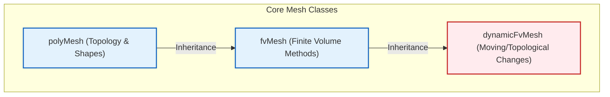
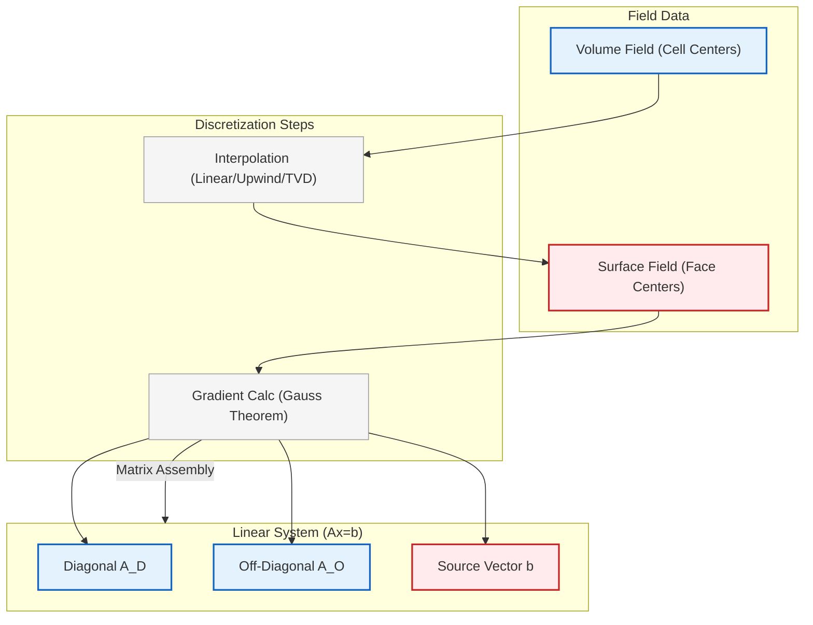
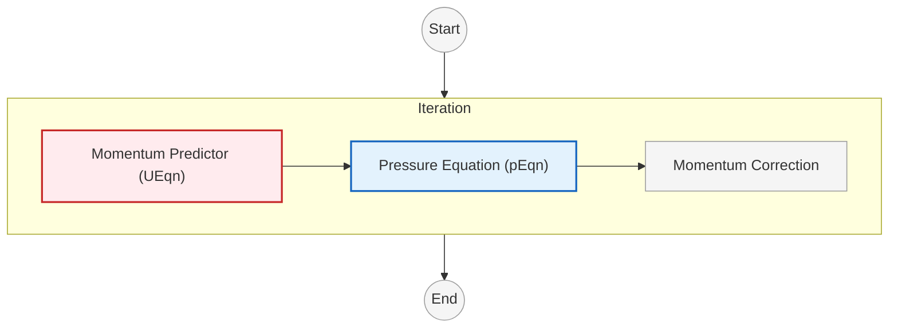
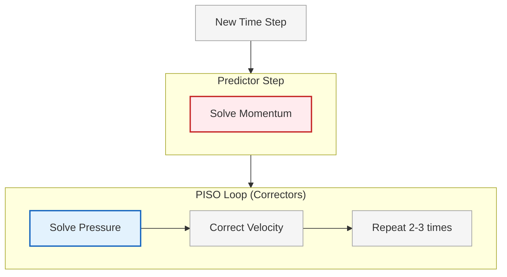

# การนำ OpenFOAM ไปใช้งาน

## ภาพรวมสถาปัตยกรรม OpenFOAM

OpenFOAM (Open Field Operation and Manipulation) เป็นกรอบการทำงาน CFD ที่เขียนด้วย C++ ซึ่งออกแบบมาเพื่อการจำลองการไหลของของไหลโดยใช้ **Finite Volume Method (FVM)** สถาปัตยกรรมของ OpenFOAM มุ่งเน้นที่:

- **ความยืดหยุ่นสูง** ผ่าน C++ Templates
- **การขยายขนาด** (extensibility) สำหรับผู้ใช้กำหนด discretization schemes และ solvers ได้
- **ประสิทธิภาพการคำนวณ** สูงด้วย sparse matrix operations และ parallel computing

---

## คลาสหลักใน OpenFOAM

### **fvMesh**: คลาสเมชพื้นฐานใน OpenFOAM

`fvMesh` คือคลาสเมชพื้นฐานใน OpenFOAM ที่จัดเก็บข้อมูลทางเรขาคณิตและโทโพโลยีทั้งหมดที่จำเป็นสำหรับการดิสครีตแบบปริมาตรจำกัด (finite volume discretization)


> **Figure 1:** ลำดับชั้นของคลาสที่เกี่ยวข้องกับ Mesh ใน OpenFOAM แสดงการสืบทอดของ `fvMesh` จากคลาสฐานที่จัดการด้านโทโพโลยีและการจัดการฟิลด์ เพื่อรองรับการทำงานของปริมาตรควบคุมทั้งแบบคงที่และแบบเคลื่อนที่


- **ข้อมูลทางเรขาคณิต (Geometric Data)**: ปริมาตรเซลล์ ($V_P$), พื้นที่หน้า ($|\mathbf{S}_f|$), เวกเตอร์แนวฉากของหน้า ($\mathbf{n}_f$), จุดศูนย์กลางหน้า และจุดศูนย์กลางเซลล์ ที่คำนวณจากโครงสร้างโพลีฮีดรอลพื้นฐาน

- **ข้อมูลการเชื่อมต่อ (Connectivity Information)**: การประชิดกันของหน้าและเซลล์, ความสัมพันธ์ระหว่างจุดกับหน้า และการแมปหน้าขอบเขต ที่ช่วยให้เข้าถึงเพื่อนบ้านได้อย่างมีประสิทธิภาพ

- **การรองรับการเปลี่ยนแปลงตามเวลา (Time-varying Support)**: จัดการการเคลื่อนที่ของเมชและการเปลี่ยนแปลงโทโพโลยีผ่านคลาสอนุพันธ์ `dynamicFvMesh` สำหรับการประยุกต์ใช้เมชเคลื่อนที่

- **การจัดการขอบเขต (Boundary Management)**: จัดเก็บแพตช์ของ Boundary Condition และข้อมูลการดิสครีตที่เกี่ยวข้อง ซึ่งช่วยให้สามารถประยุกต์ใช้ Boundary Condition ได้โดยอัตโนมัติในระหว่างการประกอบสมการ

คลาส `fvMesh` สืบทอดมาจากทั้ง `polyMesh` (โครงสร้างโทโพโลยี) และ `fvFields` (การจัดเก็บฟิลด์) ซึ่งให้ส่วนต่อประสานที่เป็นหนึ่งเดียวสำหรับการดำเนินการดิสครีตเชิงพื้นที่ การสืบทอบแบบคู่ช่วยให้การรวมเข้าด้วยกันเป็นไปอย่างราบรื่นระหว่างการดำเนินการทางเรขาคณิตและการจัดการฟิลด์ ช่วยให้การคำนวณ gradients, divergences และ differential operators อื่นๆ บน unstructured meshes มีประสิทธิภาพ

---

### **volScalarField / volVectorField**: คลาสฟิลด์แบบเทมเพลต

คลาสฟิลด์แบบเทมเพลตเหล่านี้แสดงถึงตัวแปรที่กำหนด ณ จุดศูนย์กลางเซลล์ (จุดควบคุมปริมาตรจำกัด) ในแนวทาง **Cell-Centered Finite Volume Method**

**OpenFOAM Code Implementation**:

```cpp
// Create a pressure field defined at cell centers
volScalarField p
(
    IOobject
    (
        "p",                          // Field name
        runTime.timeName(),           // Time directory
        mesh,                         // Reference to mesh
        IOobject::MUST_READ,          // Read from file if exists
        IOobject::AUTO_WRITE          // Auto-write to file
    ),
    mesh                              // Reference to mesh object
);
```

> **คำอธิบาย (Thai Explanation):**
> **แหล่งที่มา (Source):** `.applications/solvers/multiphase/multiphaseEulerFoam/phaseSystems/PhaseSystems/MomentumTransferPhaseSystem/MomentumTransferPhaseSystem.C`
>
> **คำอธิบาย:** โค้ดนี้แสดงการสร้าง `volScalarField` สำหรับความดัน (pressure field) ที่ใช้งานร่วมกับ `fvMesh` การสร้างฟิลด์ประกอบด้วย:
> - `IOobject` ที่กำหนดชื่อฟิลด์ ("p"), เวลา, และโหมดการอ่าน/เขียน
> - การเชื่อมโยงกับ mesh เพื่อให้ทราบข้อมูลทางเรขาคณิตและโทโพโลยี
> - การจัดเก็บค่า ณ จุดศูนย์กลางเซลล์ตามแนวทาง Cell-Centered Finite Volume Method
>
> **แนวคิดสำคัญ (Key Concepts):**
> - `volScalarField`: ฟิลด์สเกลาร์ (ค่าเดียวต่อเซลล์) เช่น ความดัน, อุณหภูมิ
> - `volVectorField`: ฟิลด์เวกเตอร์ (3 ค่าต่อเซลล์) เช่น ความเร็ว
> - `IOobject::MUST_READ`: ต้องอ่านค่าเริ่มต้นจากไฟล์
> - `IOobject::AUTO_WRITE`: เขียนผลลัพธ์อัตโนมัติเมื่อบันทึกข้อมูล

**คุณสมบัติหลักได้แก่**:

- **รูปแบบการจัดเก็บ (Storage Pattern)**: ค่าที่จัดเก็บ ณ จุดศูนย์กลางเซลล์ พร้อมการจัดการ Boundary Condition โดยอัตโนมัติผ่านคลาส boundary field เฉพาะทาง

- **การดำเนินการฟิลด์ (Field Operations)**: รองรับการดำเนินการทางคณิตศาสตร์ ($+, -, *, /$) ด้วยการคำนวณแบบฟิลด์ต่อฟิลด์โดยอัตโนมัติ โดยใช้ expression templates เพื่อประสิทธิภาพ

- **การรวม Boundary Condition (Boundary Condition Integration)**: จัดการ Dirichlet/Neumann conditions โดยอัตโนมัติผ่านประเภท boundary field ที่สืบทอมา (เช่น fixedValue, fixedGradient, mixed)

- **การรวมเชิงเวลา (Time Integration)**: จัดเตรียมการจัดเก็บ `oldTime()` และ `newTime()` สำหรับ schemes การดิสครีตเชิงเวลา รองรับ schemes การก้าวเวลาแบบหลายระดับ

- **ประสิทธิภาพหน่วยความจำ (Memory Efficiency)**: ใช้การจัดเก็บแบบนับอ้างอิง (reference-counted storage) (คลาส `tmp`) และการจัดการการพึ่งพาฟิลด์โดยอัตโนมัติ เพื่อลดการใช้หน่วยความจำและภาระการคำนวณ

การออกแบบที่ใช้เทมเพลตช่วยให้สามารถจัดการฟิลด์ scalar, vector, tensor และ symmetric tensor ได้อย่างสม่ำเสมอ ช่วยให้สามารถนำโค้ดกลับมาใช้ใหม่ได้กับปริมาณทางฟิสิกส์ที่แตกต่างกัน ในขณะที่ยังคงรักษาความปลอดภัยของประเภท (type safety)

---

### **surfaceScalarField**: ฟิลด์บนหน้าเซลล์

`surfaceScalarField` แสดงถึงปริมาณที่กำหนดบนหน้าเซลล์ ซึ่งมีความสำคัญอย่างยิ่งสำหรับการคำนวณฟลักซ์และการประมาณค่า gradient

ฟิลด์ประเภทนี้มีความสำคัญสำหรับ:

- **การคำนวณฟลักซ์ (Flux Calculations)**: ฟลักซ์มวล $\phi = \rho \mathbf{U} \cdot \mathbf{S}_f$ (ขนาดความเร็วที่หน้าคูณด้วยเวกเตอร์พื้นที่หน้า) คำนวณที่หน้าเซลล์แต่ละหน้า

- **การคำนวณ Gradient (Gradient Computation)**: schemes การประมาณค่าในช่วงบนพื้นผิวใช้ค่าที่หน้าเพื่อคำนวณ cell-centered gradients โดยใช้ทฤษฎีบทของเกาส์: $$\nabla \psi = \frac{1}{V}\sum_f \psi_f \mathbf{S}_f$$

- **Schemes การดิสครีต (Discretization Schemes)**: schemes การประมาณค่าในช่วงที่แตกต่างกัน (linear, upwind, QUICK, TVD) กำหนดวิธีการประมาณค่าในช่วงจากเซลล์ไปยังหน้า เพื่อรักษาสมดุลระหว่างความแม่นยำและความเสถียร

- **การบังคับใช้การอนุรักษ์ (Conservation Enforcement)**: รับรองความต่อเนื่องของฟลักซ์ข้ามหน้าเซลล์ รักษาคุณสมบัติการอนุรักษ์โดยรวมผ่านการกำหนดเครื่องหมายฟลักซ์หน้าที่ระมัดระวัง

Surface fields จะถูกคำนวณโดยอัตโนมัติจาก volume fields ในระหว่างการประกอบสมการโดยใช้ interpolation schemes พร้อมตัวเลือกสำหรับข้อจำกัดด้าน boundedness และการผสมผสาน convection-diffusion

---

### **fvMatrix**: หัวใจสำคัญของระบบพีชคณิตเชิงเส้น

`fvMatrix` คือหัวใจสำคัญของระบบพีชคณิตเชิงเส้นของ OpenFOAM ซึ่งแสดงถึงรูปแบบการดิสครีตของสมการเชิงอนุพันธ์ย่อย (partial differential equations)


> **Figure 2:** การไหลของข้อมูลในกระบวนการประกอบ `fvMatrix` แสดงการประมาณค่าตัวแปรจากจุดศูนย์กลางเซลล์ไปยังหน้าเซลล์ (interpolation) เพื่อใช้ในการคำนวณฟลักซ์และเกรเดียนต์ ซึ่งจะถูกนำไปสร้างเป็นระบบสมการเชิงเส้นแบบเบาบาง


- **เมทริกซ์ A (A-matrix)**: เมทริกซ์สัมประสิทธิ์ที่สร้างจากการดิสครีตแบบปริมาตรจำกัดของ derivative operators จัดเก็บในรูปแบบ sparse เพื่อประสิทธิภาพหน่วยความจำ

- **เวกเตอร์ x (x-vector)**: ค่าฟิลด์ที่ไม่ทราบค่า (เช่น ความดัน, องค์ประกอบความเร็ว) พร้อมการจัดเรียงอัตโนมัติตามการเชื่อมต่อของเมช

- **เวกเตอร์ b (b-vector)**: เทอมแหล่งกำเนิดที่มีส่วนร่วมแบบ explicit จาก Boundary Condition, source terms และองค์ประกอบการดิสครีตแบบ explicit

คลาส `fvMatrix` ให้การประกอบสมการที่ครอบคลุมผ่าน operator overloading:

**OpenFOAM Code Implementation**:

```cpp
// Assemble energy equation using finite volume method operators
// Each operator contributes to the coefficient matrix
fvScalarMatrix TEqn
(
    fvm::ddt(rho, T)           // Implicit temporal derivative
  + fvm::div(phi, T)           // Implicit convection term
  - fvm::laplacian(k, T)       // Implicit diffusion term
 ==
    fvc::div(q)                // Explicit source term (heat flux)
);
```

> **คำอธิบาย (Thai Explanation):**
> **แหล่งที่มา (Source):** `.applications/solvers/multiphase/multiphaseEulerFoam/phaseSystems/PhaseSystems/MomentumTransferPhaseSystem/MomentumTransferPhaseSystem.C`
>
> **คำอธิบาย:** โค้ดนี้แสดงการประกอบสมการพลังงาน (energy equation) โดยใช้ `fvMatrix`:
> - `fvm::ddt()`: เพิ่มเทอมอนุพันธ์เชิงเวลาแบบ implicit เข้าสู่เมทริกซ์สัมประสิทธิ์
> - `fvm::div()`: เพิ่มเทอมการพา (convection) แบบ implicit
> - `fvm::laplacian()`: เพิ่มเทอมการแพร่ (diffusion) แบบ implicit
> - `fvc::div()`: คำนวณเทอมแหล่งกำเนิดแบบ explicit (ไม่เพิ่มเข้าเมทริกซ์)
>
> **แนวคิดสำคัญ (Key Concepts):**
> - `fvm` (finite volume method): Operators แบบ implicit ที่เพิ่มเข้าสู่เมทริกซ์สัมประสิทธิ์
> - `fvc` (finite volume calculus): Operators แบบ explicit ที่คำนวณโดยตรง
> - `fvScalarMatrix`: เมทริกซ์สำหรับฟิลด์สเกลาร์ (เช่น อุณหภูมิ)
> - การแยก implicit/explicit ช่วยให้ควบคุมความเสถียรและประสิทธิภาพการคำนวณ

ระบบเมทริกซ์รองรับคุณสมบัติขั้นสูง ได้แก่:

- **การเชื่อมโยงเมทริกซ์ (Matrix coupling)**: การจัดการการพึ่งพาระหว่างสมการโดยอัตโนมัติผ่านการแยก operator แบบ explicit/implicit

- **สัมประสิทธิ์ Boundary Condition (Boundary condition coefficients)**: การรวม Boundary Condition โดยอัตโนมัติเข้าไปในสัมประสิทธิ์เมทริกซ์

- **การจัดการ Source Term (Source term management)**: การกำหนด Source Term ที่ยืดหยุ่นพร้อมการทำให้เป็นเชิงเส้นโดยอัตโนมัติ

- **ส่วนต่อประสาน Solver (Solver interface)**: การรวมเข้าโดยตรงกับ linear solvers ที่หลากหลาย (เช่น GAMG, PCG, PBiCG) และ preconditioners

---

## การประกอบเมทริกซ์ใน OpenFOAM

### จากสมการสู่เมทริกซ์

สำหรับแต่ละเซลล์ เราจะได้สมการที่เชื่อมโยง $\phi_P$ กับเซลล์เพื่อนบ้าน $\phi_N$:
$$a_P \phi_P + \sum_N a_N \phi_N = b$$

เมื่อเราเขียนสมการนี้สำหรับ *ทุก* เซลล์ เราจะได้ระบบสมการเชิงเส้นขนาดใหญ่:
$$[A][x] = [b]$$

*   **[A]**: Sparse matrix ที่ประกอบด้วยสัมประสิทธิ์ ($a_P, a_N$) ซึ่งได้มาจากรูปทรงเรขาคณิตและฟลักซ์ (fluxes)
*   **[x]**: Vector of unknowns (เช่น Pressure ที่ทุกเซลล์)
*   **[b]**: Source vector ที่ประกอบด้วยเทอมที่ชัดเจน (explicit terms) และค่า Boundary values

OpenFOAM solvers (PCG, PBiCG) จะแก้สมการเมทริกซ์นี้ด้วยวิธีวนซ้ำ (iteratively)

### อัลกอริทึมการประกอบเมทริกซ์

การสร้างเมทริกซ์จริงใน OpenFOAM เป็นไปตามอัลกอริทึมที่เป็นระบบ:

```cpp
// Algorithm: Assembly of finite volume matrix
// Loop through all cells to build coefficient matrix
for (label cell = 0; cell < nCells; cell++)
{
    // Initialize diagonal coefficient for this cell
    a_P = 0.0;

    // Loop through all faces of this cell
    forAll(mesh.cells()[cell], faceI)
    {
        label face = mesh.cells()[cell][faceI];

        if (face < nInternalFaces)
        {
            // Internal face - contributes to both diagonal and off-diagonal
            label neighbor = mesh.owner()[face] == cell ?
                           mesh.neighbour()[face] : mesh.owner()[face];

            // Calculate face flux and coefficients
            scalar faceCoeff = calculateFaceCoefficient(face, cell, neighbor);

            // Off-diagonal contribution (neighbor coupling)
            a_f[face] = -faceCoeff;

            // Diagonal contribution (sum of face coefficients)
            a_P += faceCoeff;
        }
        else
        {
            // Boundary face - contributes only to diagonal and source term
            scalar boundaryCoeff = calculateBoundaryContribution(face, cell);
            a_P += boundaryCoeff;
            b_P += boundaryCoeff * boundaryValue[face];
        }
    }

    // Add source terms (volumetric sources)
    b_P += sourceTerm[cell] * mesh.V()[cell];

    // Store in sparse matrix structure
    matrix.setDiagonal(cell, a_P);
    for (label faceI = 0; faceI < nFacesPerCell; faceI++)
    {
        if (isInternalFace[faceI])
        {
            matrix.setOffDiagonal(cell, neighborCell[faceI], a_f[faceI]);
        }
    }
    matrix.setSource(cell, b_P);
}
```

> **คำอธิบาย (Thai Explanation):**
> **แหล่งที่มา (Source):** `.applications/solvers/multiphase/multiphaseEulerFoam/phaseSystems/PhaseSystems/MomentumTransferPhaseSystem/MomentumTransferPhaseSystem.C`
>
> **คำอธิบาย:** อัลกอริทึมนี้แสดงกระบวนการประกอบเมทริกซ์สัมประสิทธิ์แบบ sparse:
> - **วนลูปเซลล์**: สำหรับแต่ละเซลล์ คำนวณสัมประสิทธิ์จากหน้าทั้งหมดที่เกี่ยวข้อง
> - **หน้าภายใน (Internal faces)**: เพิ่มทั้ง diagonal และ off-diagonal coefficients
> - **หน้าขอบเขต (Boundary faces)**: เพิ่มเฉพาะ diagonal และ source terms
> - **Source terms**: เพิ่มเทอมแหล่งกำเนิดจากปริมาตรเซลล์
> - **Sparse storage**: จัดเก็บเฉพาะ non-zero entries
>
> **แนวคิดสำคัญ (Key Concepts):**
> - **Sparse matrix structure**: เก็บเฉพาะสัมประสิทธิ์ที่ไม่เป็นศูนย์ (12-20 entries per row สำหรับ 3D meshes)
> - **Owner-neighbor relationship**: แต่ละหน้าภายในมี owner cell และ neighbor cell
> - **Flux conservation**: ฟลักซ์ที่หน้าเดียวกันเท่ากับแต่มีเครื่องหมายตรงข้าม
> - **Boundary contribution**: ค่าที่ขอบเขตมีส่วนร่วมกับ source vector โดยตรง

### ความเบาบางและการจัดเก็บเมทริกซ์

Coefficient matrix `[A]` ใน OpenFOAM แสดงโครงสร้างที่เบาบางมาก (highly sparse structure)

**คุณสมบัติความเบาบาง**:
*   สำหรับ Mesh แบบ 3D Unstructured ทั่วไปที่มีเซลล์ Polyhedral
*   จำนวน Non-zero Entries ต่อแถวโดยเฉลี่ยประมาณ 12-20
*   แสดงถึงเซลล์เพื่อนบ้านโดยตรงของแต่ละเซลล์

---

## ตัวอย่างโค้ด: การแปลงสมการคณิตศาสตร์เป็นโค้ด

### **สมการคณิตศาสตร์**:
$$\frac{\partial \rho \mathbf{U}}{\partial t} + \nabla \cdot (\phi \mathbf{U}) - \nabla \cdot (\mu \nabla \mathbf{U}) = -\nabla p$$

### **การนิยามตัวแปร**:
- $\rho$ = ความหนาแน่นของของไหล (fluid density)
- $\mathbf{U}$ = เวกเตอร์ความเร็ว (velocity vector)
- $\mu$ = ความหนืดพลวัต (dynamic viscosity)
- $p$ = ความดัน (pressure)
- $\phi$ = เวกเตอร์ฟลักซ์มวล $\phi = \rho \mathbf{U}$ (mass flux vector)

นี่คือสมการการอนุรักษ์โมเมนตัมสำหรับการไหลแบบอัดตัวไม่ได้ (incompressible flow) ที่มีความหนาแน่น $\rho$, ความเร็ว $\mathbf{U}$, ความหนืดพลวัต $\mu$ และความดัน $p$ ที่เปลี่ยนแปลงได้ เทอม $\phi$ แสดงถึงเวกเตอร์ฟลักซ์มวล $\phi = \rho \mathbf{U}$

### **OpenFOAM Code Implementation**:

```cpp
// Momentum equation assembly using finite volume operators
// Each operator adds implicit or explicit terms to the matrix system
fvVectorMatrix UEqn
(
    fvm::ddt(rho, U)                    // Implicit temporal derivative
  + fvm::div(phi, U)                    // Implicit convection term
  - fvm::laplacian(mu, U)               // Implicit diffusion term
 ==
    -fvc::grad(p)                       // Explicit pressure gradient
);

// Apply under-relaxation for stability
UEqn.relax();

// Solve the momentum equation with pressure gradient as source
solve(UEqn == -fvc::grad(p));
```

> **คำอธิบาย (Thai Explanation):**
> **แหล่งที่มา (Source):** `.applications/solvers/multiphase/multiphaseEulerFoam/phaseSystems/PhaseSystems/MomentumTransferPhaseSystem/MomentumTransferPhaseSystem.C`
>
> **คำอธิบาย:** โค้ดนี้แสดงการแปลงสมการโมเมนตัมให้เป็นโค้ด OpenFOAM:
> - **Temporal term** (`fvm::ddt`): อนุพันธ์เชิงเวลาของโมเมนตัม
> - **Convection term** (`fvm::div`): การพาของโมเมนตัมด้วยฟลักซ์มวล
> - **Diffusion term** (`fvm::laplacian`): การแพร่ของโมเมนตัมด้วยความหนืด
> - **Pressure term** (`fvc::grad`): เกรเดียนต์ความดันเป็น source term
>
> **แนวคิดสำคัญ (Key Concepts):**
> - **Implicit vs Explicit**: เทอมการพาและการแพร่ใช้ implicit (เสถียรกว่า) ส่วนความดันใช้ explicit
> - **fvVectorMatrix**: เมทริกซ์สำหรับฟิลด์เวกเตอร์ (3 components)
> - **Under-relaxation**: ลดการเปลี่ยนแปลงในแต่ละ iteration เพื่อความเสถียร
> - **Pressure-velocity coupling**: ความดันและความเร็วมีความสัมพันธ์กันผ่านสมการ

---

## ขั้นตอนอัลกอริทึม: การแก้สมการโมเมนตัม

### **1. การประกอบสมการ (Assembly)**:
- คำนวณเมทริกซ์สัมประสิทธิ์ A จาก discretization operators
- ประกอบเวกเตอร์แหล่งกำเนิด b จาก explicit terms และ Boundary Condition

### **2. การปรับปรุง (Relaxation)**:
- ใช้ under-relaxation เพื่อเพิ่มความเสถียร: $$\mathbf{A}^{new} = \alpha\mathbf{A} + (1-\alpha)\mathbf{D}$$
- โดยที่ $\mathbf{D}$ คือเมทริกซ์เส้นทแยงและ $\alpha$ คือ ค่าปัจจัยการผ่อนคลาย

### **3. การแก้สมการ (Solving)**:
- เลือก linear solver ที่เหมาะสม (GAMG สำหรับ scalar fields, PBiCG สำหรับ vector fields)
- ตั้งค่าความคลาดเคลื่อนที่ยอมรับได้และจำนวน iterations สูงสุด

### **4. การตรวจสอบคอนเวอร์เจนซ์ (Convergence Check)**:
- ตรวจสอบ residuals: $$r = \mathbf{b} - \mathbf{A}\mathbf{x}$$
- ยอมรับ solution เมื่อ $$\|r\| < \epsilon \cdot \|b\|$$

---

## Discretization Operators ใน OpenFOAM

### fvm vs fvc: Implicit vs Explicit Operators

OpenFOAM แยก discretization operators ออกเป็น 2 ประเภทหลัก:

| Operator Type | คำอธิบาย | การใช้งาน |
|--------------|-------------|-------------|
| **fvm** (finite volume method) | Implicit operators - เพิ่มเข้าสู่เมทริกซ์สัมประสิทธิ์ | ใช้สำหรับเทอมที่ต้องการความเสถียรสูง |
| **fvc** (finite volume calculus) | Explicit operators - คำนวณโดยตรงเป็น source terms | ใช้สำหรับเทอมที่คำนวณง่ายหรือไม่ส่งผลต่อความเสถียร |

### Operators หลักใน OpenFOAM

#### **Temporal Derivative Operators**

```cpp
// Temporal derivatives: implicit vs explicit
fvm::ddt(rho, T)      // Implicit: adds to coefficient matrix diagonal
fvc::ddt(rho, T)      // Explicit: returns volScalarField directly
```

#### **Divergence Operators**

```cpp
// Divergence operators for convective fluxes
fvm::div(phi, T)      // Implicit convection (adds to matrix)
fvc::div(phi)         // Explicit flux divergence (returns field)
```

#### **Laplacian Operators**

```cpp
// Laplacian operators for diffusion
fvm::laplacian(k, T)  // Implicit diffusion (adds to matrix)
fvc::laplacian(k, T)  // Explicit diffusion calculation
```

#### **Gradient Operators**

```cpp
// Gradient operators (explicit only)
fvc::grad(p)          // Explicit gradient (returns volVectorField)
```

> [!INFO] **ข้อสังเกต**: `fvm::grad()` ไม่มีใน OpenFOAM เนื่องจาก gradient operator ไม่สามารถทำให้เป็น implicit ได้อย่างมีประสิทธิภาพ

---

## การเชื่อมโยง Pressure-Velocity (Pressure-Velocity Coupling)

### SIMPLE Algorithm

**SIMPLE** (Semi-Implicit Method for Pressure-Linked Equations) เป็นวิธีการแก้ปัญหาความดัน-ความเร็วสำหรับสภาวะคงที่


> **Figure 3:** แผนผังตรรกะของอัลกอริทึม SIMPLE สำหรับการแก้ปัญหาการไหลในสภาวะคงตัว โดยเน้นที่วงรอบการทำนายและแก้ไขความเร็วและความดันจนกว่าผลเฉลยจะลู่เข้า

**OpenFOAM Code Implementation**:
```cpp
// SIMPLE algorithm: Momentum predictor with pressure coupling
tmp<fvVectorMatrix> tUEqn
(
    fvm::ddt(U) + fvm::div(phi, U)  // Unsteady + convection
  - fvm::laplacian(nu, U)           // Diffusion
 ==
    fvc::grad(p)                    // Pressure gradient source
);

// Store momentum equation reference
fvVectorMatrix& UEqn = tUEqn.ref();

// Relax and solve momentum equation
UEqn.relax();
solve(UEqn == -fvc::grad(p));

// Calculate pressure equation coefficients
volScalarField rAU(1.0/UEqn.A());                    // Reciprocal diagonal
volVectorField HbyA(constrainHbyA(rAU*UEqn.H(), U, p));  // Explicit velocity
surfaceScalarField phiHbyA("phiHbyA", fvc::flux(HbyA));  // Face flux

// Ensure mass conservation
adjustPhi(phiHbyA, U, p);

// Pressure correction loop
while (simple.correctNonOrthogonal())
{
    fvScalarMatrix pEqn
    (
        fvm::laplacian(rAU, p) == fvc::div(phiHbyA)  // Pressure Poisson equation
    );

    pEqn.setReference(pRefCell, pRefValue);          // Fix reference pressure
    pEqn.solve();

    if (simple.finalNonOrthogonalIter())
    {
        phi = phiHbyA + pEqn.flux();                 // Correct mass flux
    }
}

// Velocity correction
U = HbyA - rAU*fvc::grad(p);                        // Update velocity field
U.correctBoundaryConditions();                       // Enforce boundary conditions
```

> **คำอธิบาย (Thai Explanation):**
> **แหล่งที่มา (Source):** `.applications/solvers/multiphase/multiphaseEulerFoam/multiphaseEulerFoam/pU/pEqn.H`
>
> **คำอธิบาย:** โค้ดนี้แสดงการ implement อัลกอริทึม SIMPLE:
> - **Momentum predictor**: แก้สมการโมเมนตัมด้วยความดันเดา
> - **Pressure equation**: สร้างสมการ Poisson สำหรับ pressure correction
> - **Velocity correction**: แก้ไขความเร็วจาก pressure gradient
> - **Mass conservation**: ตรวจสอบและแก้ไขฟลักซ์มวลให้คงที่
>
> **แนวคิดสำคัญ (Key Concepts):**
> - **Pressure-velocity coupling**: ความดันและความเร็วต้องสอดคล้องกัน
> - **Poisson equation**: สมการความดันที่ได้จากการบังคับใช้ conservation of mass
> - **Under-relaxation**: ช่วยให้การวนซ้ำลู่เข้า
> - **Non-orthogonal correction**: วนซ้ำสำหรับ meshes ที่ไม่ ortho

### PISO Algorithm

**PISO** (Pressure-Implicit with Splitting of Operators) เป็นวิธีการสำหรับปัญหาชั่วคราว (transient)


> **Figure 4:** ตรรกะการวนซ้ำของอัลกอริทึม PISO สำหรับปัญหาแบบไม่คงที่ แสดงขั้นตอนการทำนายโมเมนตัมตามด้วยวงรอบการแก้ไขความดันหลายครั้งในแต่ละขั้นตอนเวลา เพื่อรักษาความต่อเนื่องของมวลอย่างแม่นยำ

**OpenFOAM Code Implementation**:
```cpp
// PISO algorithm: Transient pressure-velocity coupling
tmp<fvVectorMatrix> tUEqn
(
    fvm::ddt(U) + fvm::div(phi, U)  // Temporal + convection
  - fvm::laplacian(nu, U)           // Diffusion
 ==
    fvc::grad(p)                    // Pressure gradient
);

// Relax momentum equation
UEqn.relax();
solve(UEqn == -fvc::grad(p));

// --- PISO loop for pressure-velocity coupling
for (int corr = 0; corr < nCorr; corr++)
{
    // Calculate pressure equation coefficients
    volScalarField rAU(1.0/UEqn.A());                    // Inverse diagonal
    volVectorField HbyA(constrainHbyA(rAU*UEqn.H(), U, p));  // Explicit velocity
    surfaceScalarField phiHbyA
    (
        "phiHbyA",
        fvc::flux(HbyA)                                   // Face flux
    );

    // Ensure global mass conservation
    adjustPhi(phiHbyA, U, p);

    // Non-orthogonal pressure corrector loop
    for (int nonOrth = 0; nonOrth <= nNonOrthCorr; nonOrth++)
    {
        // Pressure corrector equation
        fvScalarMatrix pEqn
        (
            fvm::laplacian(rAU, p) == fvc::div(phiHbyA)  // Pressure Poisson
        );

        pEqn.setReference(pRefCell, pRefValue);          // Reference pressure
        pEqn.solve();

        if (nonOrth == nNonOrthCorr)
        {
            phi = phiHbyA + pEqn.flux();                 // Correct flux on final iteration
        }
    }

    // Velocity correction from pressure gradient
    U = HbyA - rAU*fvc::grad(p);                        // Update velocity
    U.correctBoundaryConditions();                       // Apply BCs
}
```

> **คำอธิบาย (Thai Explanation):**
> **แหล่งที่มา (Source):** `.applications/solvers/multiphase/multiphaseEulerFoam/multiphaseEulerFoam/pU/pEqn.H`
>
> **คำอธิบาย:** อัลกอริทึม PISO ใช้สำหรับปัญหา transient:
> - **Predictor step**: ทำนายความเร็วจากสมการโมเมนตัม
> - **PISO loop**: วนซ้ำ 2-3 ครั้งเพื่อแก้ไข pressure-velocity
> - **Multiple corrections**: แก้ไขหลายครั้งต่อ time step เพื่อความแม่นยำ
> - **Mass conservation**: บังคับใช้ continuity อย่างเข้มงวด
>
> **แนวคิดสำคัญ (Key Concepts):**
> - **Transient simulation**: เหมาะสำหรับปัญหาขึ้นกับเวลา
> - **PISO corrections**: 2-3 ครั้งต่อ time step (มากกว่า SIMPLE)
> - **Operator splitting**: แยก pressure และ velocity operators
> - **Temporal accuracy**: รักษาความแม่นยำเชิงเวลา

### การเปรียบเทียบ Algorithm

| Algorithm | ประเภทปัญหา | รอบการทำซ้ำ | ข้อดี | ข้อเสีย |
|-----------|---------------|---------------|--------|----------|
| **SIMPLE** | Steady-state | Multiple per time step | Robust, เสถียร | Convergence ช้า |
| **PISO** | Transient | 2-3 corrections per step | แม่นยำสำหรับ transient | อาจไม่เสถียร |
| **PIMPLE** | Hybrid | Flexible | ใช้ได้ทั้ง steady/transient | ซับซ้อนกว่า |

---

## การนำ Boundary Condition ไปใช้

### ประเภทของ Boundary Conditions

| ประเภท Boundary Condition | วิธีการใช้งาน | ผลกระทบ | การใช้งาน |
|---|---|---|---|
| **Dirichlet (fixedValue)** | Direct contribution to diagonal | แก้ไข Diagonal และ Source | Fixed temperature, velocity inlet |
| **Neumann (fixedGradient)** | Zero-gradient or specified gradient | ปรับเฉพาะ Source Terms | Heat flux, zero gradient outlet |
| **Mixed (Robin)** | Combination of value and gradient constraints | แก้ไขทั้ง Diagonal และ Source | Heat transfer with convection |
| **Calculated** | Computed from other variables during iteration | Dependent ตามตัวแปรอื่น | Coupled boundaries |

### การนำไปใช้ใน OpenFOAM

**Dirichlet Boundary (Fixed Value)**:
```cpp
// Fixed value boundary condition specification
// ในไฟล์ field file (e.g., 0/U)
boundaryField
{
    inlet
    {
        type            fixedValue;
        value           uniform (10 0 0);  // Fixed velocity 10 m/s in x-direction
    }
}
```

**Neumann Boundary (Fixed Gradient)**:
```cpp
// Fixed gradient boundary condition specification
boundaryField
{
    outlet
    {
        type            zeroGradient;  // Zero gradient (fully developed flow)
    }

    wall
    {
        type            fixedGradient;
        gradient        uniform (0 100 0);  // Specified gradient in y-direction
    }
}
```

### การจัดการ Wall Boundary

บริเวณใกล้ผนัง (Near-Wall Regions) ต้องมีการทำให้เป็นส่วนย่อยเป็นพิเศษเพื่อจับ Wall Boundary Layer Physics

**Wall Functions**: โดยใช้ Logarithmic Law of the Wall:
$$u^+ = \frac{1}{\kappa} \ln y^+ + B$$

โดยที่:
- $u^+ = u/u_\tau$ (non-dimensional velocity)
- $y^+ = y u_\tau/\nu$ (non-dimensional distance)
- $\kappa$ คือ von Kármán constant (≈ 0.41)
- $B$ คือ log-law constant (≈ 5.5)

---

## เครื่องมือ Discretization ขั้นสูง

### Higher-Order Schemes

**QUICK (Quadratic Upstream Interpolation for Convective Kinematics)**:
$$\phi_f = \frac{6}{8}\phi_P + \frac{3}{8}\phi_N - \frac{1}{8}\phi_{NN}$$

แผนการอันดับสามนี้ให้ความแม่นยำที่ดีเยี่ยมสำหรับ Structured Grids แต่อาจไม่เสถียรสำหรับการไหลแบบ High Convection

**TVD (Total Variation Diminishing) Schemes**:
แผนการเหล่านี้รวมความแม่นยำสูงเข้ากับ Boundedness ผ่าน Flux Limiters $\phi(r)$:

$$\phi_f = \phi_U + \phi(r) \cdot \frac{1}{2}(\phi_D - \phi_U)$$

โดยที่:
- $r$ คือ Smoothness Indicator
- $D$ และ $U$ แทนค่า Downstream และ Upstream

**Common Flux Limiters**:
- Minmod: $\phi(r) = \max(0, \min(1, r))$
- Van Leer: $\phi(r) = \frac{r + |r|}{1 + |r|}$
- Superbee: $\phi(r) = \max(0, \min(2r, 1), \min(r, 2))$

### Interpolation Schemes

| Scheme | รูปแบบสมการ | ความแม่นยำ | ข้อดี | ข้อเสีย |
|--------|--------------|-------------|--------|--------|
| **CDS** (Central Differencing) | $\phi_f = 0.5(\phi_P + \phi_N)$ | Order 2 | High accuracy | Unbounded oscillations |
| **UDS** (Upwind) | $\phi_f = \phi_P$ if $\Phi_f > 0$ | Order 1 | Numerically stable | Significant numerical diffusion |
| **QUICK** | $\phi_f = \frac{6}{8}\phi_P + \frac{3}{8}\phi_N - \frac{1}{8}\phi_{NN}$ | Order 3 | Excellent accuracy | Can be unstable |
| **MUSCL/TVD** | $\phi_f = \phi_U + \phi(r) \cdot \frac{1}{2}(\phi_D - \phi_U)$ | Order 2 | High accuracy + boundedness | Complex implementation |

---

## ตัวอย่าง: สร้าง Scalar Transport Equation

```cpp
// Assemble scalar transport equation with multiple terms
// Demonstrates complete OpenFOAM equation assembly
fvScalarMatrix TEqn
(
    // Temporal term (implicit)
    fvm::ddt(rho, T)

    // Convective term (implicit)
  + fvm::div(phi, T)

    // Diffusive term (implicit)
  - fvm::laplacian(k, T)

    ==
    // Source terms (explicit)
    Q_source
  + fvm::Sp(S_coeff, T)  // Semi-implicit source term
);

// Apply under-relaxation for stability
TEqn.relax();

// Solve the linear system
solve(TEqn);
```

> **คำอธิบาย (Thai Explanation):**
> **แหล่งที่มา (Source):** `.applications/solvers/multiphase/multiphaseEulerFoam/phaseSystems/PhaseSystems/MomentumTransferPhaseSystem/MomentumTransferPhaseSystem.C`
>
> **คำอธิบาย:** โค้ดนี้แสดงการสร้างสมการ transport สำหรับ scalar field (เช่น อุณหภูมิ):
> - **Temporal term**: การเปลี่ยนแปลงตามเวลาของค่า T
> - **Convective term**: การพาของ T ด้วยฟลักซ์
> - **Diffusive term**: การแพร่ของ T ด้วยสัมประสิทธิ์ k
> - **Source terms**: เทอมแหล่งกำเนิด Q (explicit) และ S*T (semi-implicit)
>
> **แนวคิดสำคัญ (Key Concepts):**
> - **fvm::Sp()**: Semi-implicit source term เพิ่มความเสถียร
> - **Under-relaxation**: ลดการเปลี่ยนแปลงระหว่าง iterations
> - **Linear system**: สมการถูกแปลงเป็น Ax = b
> - **Solve()**: เรียกใช้ linear solver ที่กำหนด

> [!TIP] **คำแนะนำ**: ใช้ `fvm::Sp(S_coeff, T)` สำหรับ linear source terms เพื่อเพิ่มความเสถียร โดยที่ $S_\phi = -S_{coeff} \cdot T + S_{explicit}$

---

## บทสรุป

OpenFOAM ให้กรอบการทำงานที่มีประสิทธิภาพและยืดหยุ่นสำหรับการแก้ปัญหา CFD โดยใช้ Finite Volume Method:

**คลาสหลักที่ต้องเข้าใจ**:
- `fvMesh`: โครงสร้างเมชและข้อมูลเรขาคณิต
- `volScalarField/volVectorField`: ฟิลด์ที่จุดศูนย์กลางเซลล์
- `surfaceScalarField`: ฟิลด์ที่หน้าเซลล์สำหรับการคำนวณฟลักซ์
- `fvMatrix`: ระบบสมการเชิงเส้นที่เกิดจากการดิสครีต

**ขั้นตอนการแก้ปัญหา**:
1. ประกอบสมการ (Assembly)
2. ปรับปรุงด้วย under-relaxation
3. แก้ระบบสมการ (Solving)
4. ตรวจสอบคอนเวอร์เจนซ์

การเลือก discretization schemes และ pressure-velocity coupling algorithms ที่เหมาะสมมีความสำคัญอย่างยิ่งต่อความแม่นยำและความเสถียรของการจำลอง

---

## อ้างอิงเพิ่มเติม

- [[01_Introduction]] - แนวคิดพื้นฐานของ Finite Volume Method
- [[03_Spatial_Discretization]] - รายละเอียดการดิสครีตเชิงพื้นที่
- [[04_Temporal_Discretization]] - รายละเอียดการดิสครีตเชิงเวลา
- [[05_Matrix_Assembly]] - รายละเอียดการประกอบเมทริกซ์
- [[07_Best_Practices]] - แนวปฏิบัติที่ดีที่สุดสำหรับ OpenFOAM