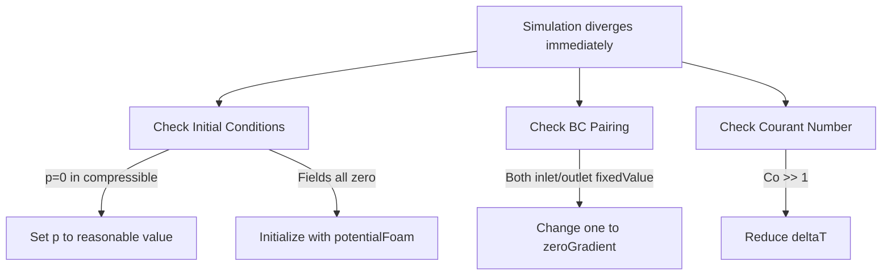
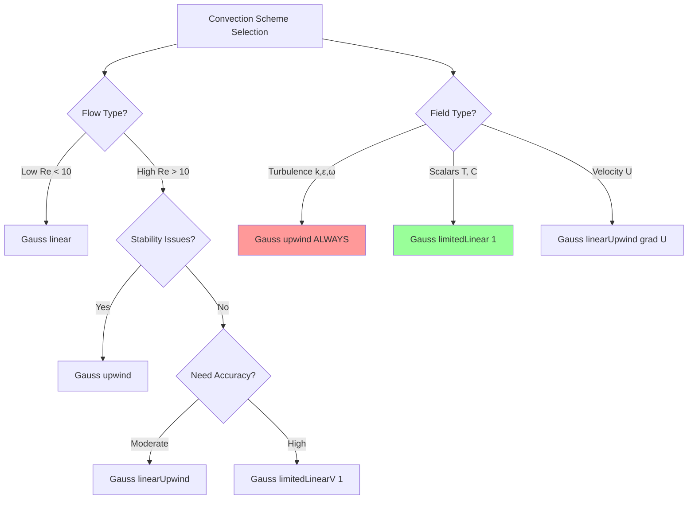
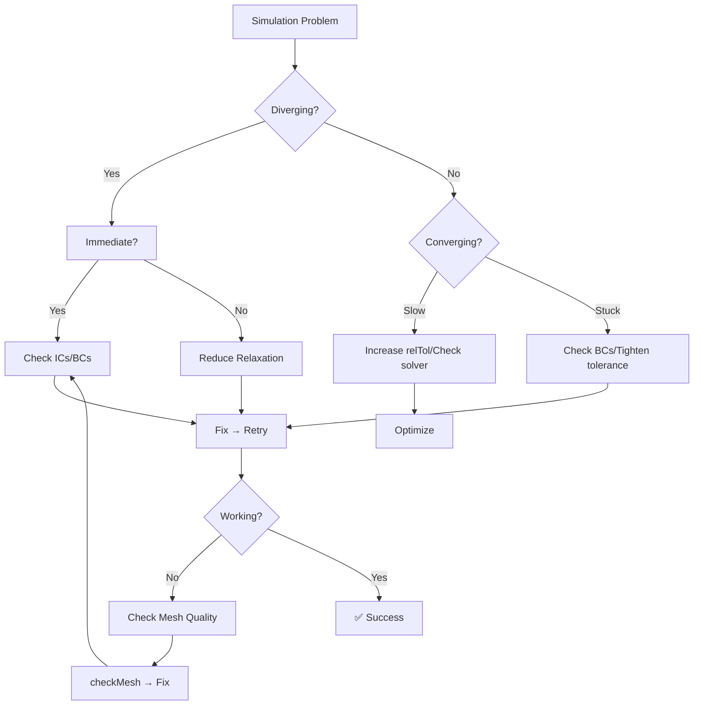

# Troubleshooting & Settings Guide

แนวทางการ Debug และ Tuning OpenFOAM Simulations เพื่อแก้ปัญหาที่เกิดขึ้นจริง

> **ทำไมต้องมี Guide นี้?**
> - ปัญหา CFD มี "กับดัก" ที่ผู้เริ่มต้นมักเจอ — diverge, converge ช้า, ผลลัพธ์ผิด
> - Settings ที่ถูกต้องช่วยประหยัดเวลาและทรัพยากรมหาศาล
> - เรียนรู้จากประสบการณ์รวม ดีกว่า trial-and-error เอง

## Prerequisites

⚠️ **ควรอ่านก่อน:** 
- [03_Spatial_Discretization.md](03_Spatial_Discretization.md) — Non-orthogonality, interpolation schemes, gradient corrections
- [05_Linear_Solvers_Matrix_Assembly.md](05_Linear_Solvers_Matrix_Assembly.md) — Matrix assembly, solver algorithms
- [06_OpenFOAM_Implementation.md](06_OpenFOAM_Implementation.md) — Practical implementation details

## Learning Objectives

หลังจากอ่านบทนี้ คุณจะสามารถ:
- **วินิจฉัย** สาเหตุ divergence จาก 10 อาการที่พบบ่อย
- **เลือก** discretization schemes ที่เหมาะสมกับ flow regime
- **ตั้งค่า** solver tolerances และ relaxation factors อย่างเหมาะสม
- **ตรวจสอบ** convergence และปรับแต่ง performance
- **แก้ปัญหา** common errors ได้อย่างมีระบบ

---

## Part 1: Top 10 Common Errors

### Error 1: Immediate Divergence (t=0 → t=1)

**อาการ:** Residual พุ่งสูงขึ้นทันทีหลัง start

#### Diagnosis Table

| สาเหตุ | ตรวจสอบ | การแก้ไข |
|--------|---------|----------|
| Initial conditions ผิด | ค่า 0 ที่ไม่ควรเป็น 0 (เช่น p=0 ใน compressible) | ใช้ `potentialFoam` หรือ set ค่าเริ่มต้นสมเหตุสมผล |
| BCs ไม่ consistent | inlet U fixed + outlet p fixed? | ตรวจ pairing: inlet→outlet |
| Time step ใหญ่เกินไป | `Co > 1` ใน log | ลด `deltaT` 10x หรือตั้ง `maxCo 0.5` |
| Scheme ไม่เสถียร | ใช้ `linear` กับ high Re flow | เปลี่ยนเป็น `upwind` หรือ `linearUpwind` |

#### Diagnosis Flow



---

### Error 2: Gradual Divergence

**อาการ:** ไปได้สักพัก แล้ว residual เพิ่มขึ้นเรื่อยๆ

| สาเหตุ | ตรวจสอบ | การแก้ไข |
|--------|---------|----------|
| Relaxation สูงเกินไป | p=0.9 ใน SIMPLE | ลดเป็น p=0.2-0.3 |
| Mesh quality | `checkMesh` → non-ortho > 70° | ใช้ `limited corrected`, เพิ่ม correctors |
| Physics mismatch | ใช้ wall function แต่ y+ < 5 | Refine mesh หรือเปลี่ยน low-Re model |

> **📖 Mesh Quality:** ดูการแก้ non-orthogonality ที่ [03_Spatial_Discretization.md](03_Spatial_Discretization.md) → Mesh Structure Section

---

### Error 3: Residuals Stuck

**อาการ:** Residual ลด 2-3 orders แล้วหยุด ไม่ลดต่อ

| สาเหตุ | ตรวจสอบ | การแก้ไข |
|--------|---------|----------|
| relTol สูงเกินไป | `relTol 0.1` → หยุดเร็วเกินไป | ลดเป็น `0.01` หรือ `0` |
| BC conflict | `fixedValue` ทุกที่ → ไม่มี outlet | เปลี่ยนเป็น `zeroGradient` บางที่ |
| จริงๆ แล้ว converged | Monitor field values ไม่เปลี่ยน | Check mass balance |

---

### Error 4: Oscillating Residuals

**อาการ:** Residual ขึ้นลงวน loop

| สาเหตุ | ตรวจสอบ | การแก้ไข |
|--------|---------|----------|
| Convection scheme ไม่มี limiter | ใช้ `linear` กับ sharp gradient | เปลี่ยนเป็น `limitedLinear` |
| Relaxation ต่ำเกินไป | p=0.1 → converge ช้ามาก | เพิ่มเป็น 0.3-0.5 |
| Time step ไม่ consistent | Transient แต่ deltaT เปลี่ยนบ่อย | ตั้ง `adjustTimeStep no` |

---

### Error 5: Negative Turbulence Values

**อาการ:** `k < 0` หรือ `epsilon < 0` → diverge

**สาเหตุหลัก:** Higher-order schemes ทำ undershoot

```cpp
// ❌ ผิด — ใช้ linear กับ turbulence
div(phi,k)      Gauss linear;

// ✅ ถูก — ใช้ upwind เสมอ
div(phi,k)      Gauss upwind;
div(phi,epsilon) Gauss upwind;
```

> **💡 Rule:** k, ε, ω **ต้องใช้ upwind** เสมอ — เพื่อรักษา boundedness

---

### Error 6: Mass Balance Not Satisfied

**อาการ:** inlet flow rate ≠ outlet flow rate

**Diagnosis:**
```bash
postProcess -func 'patchFlowRate(name=inlet)'
postProcess -func 'patchFlowRate(name=outlet)'
```

**การแก้:**
- Tighten pressure tolerance: `tolerance 1e-6; relTol 0;`
- เพิ่ม iterations: ใช้ `pFinal` ใน PIMPLE
- ตรวจ mesh: ไม่มี leakage paths?

---

### Error 7: Solution Not Changing

**อาการ:** Residual ต่ำ แต่ field monitors ไม่เปลี่ยน

**สาเหตุ:** เกิดจาก under-relaxation มากเกินไป

**การแก้:**
```cpp
relaxationFactors
{
    p           0.3;  // ถ้าต่ำไป → เพิ่มเป็น 0.5
    U           0.7;
    k           0.7;
}
```

---

### Error 8: Simulation Too Slow

**อาการ:** Converge ได้แต่ใช้เวลานาน

| สาเหตุ | การแก้ |
|--------|---------|
| Linear solver tolerance เข้มไป | เพิ่ม `relTol 0.01` → `0.1` |
| Mesh ละเอียดเกินไป | ลอง coarse mesh ก่อน |
| Inefficient solver | Pressure ใช้ GAMG แทน PCG |
| ไม่ได้ใช้ parallel | Decompose ด้วย scotch |

---

### Error 9: Poor Results (Numerical Diffusion)

**อาการ:** Solution เบลอเกินไป ไม่เห็น detail

**สาเหตุ:** ใช้ `upwind` มากเกินไป

**การแก้:**
```cpp
div(phi,U)  Gauss upwind;           // เริ่มต้น
div(phi,U)  Gauss linearUpwind grad(U);  // แม่นยำขึ้น
```

---

### Error 10: CheckMesh Fails

**อาการ:** `checkMesh` → errors

**ตรวจสอบตามลำดับ:**

1. **Non-orthogonality > 70°** → อันตราย
   - สร้าง mesh ใหม่ หรือ
   - ใช้ `nNonOrthogonalCorrectors 3;`

2. **Skewness > 0.6** → interpolation error
   - Refine mesh บริเวณ high skew

3. **Aspect ratio > 100** → numerical diffusion
   - แก้ geometry หรือ split cells

> **📖 Detailed Mesh Analysis:** ดูเทคนิคการแก้ปัญหา mesh ที่ [03_Spatial_Discretization.md](03_Spatial_Discretization.md)

---

## Part 2: Divergence Troubleshooting Table

### Quick Reference Guide

| อาการ | สาเหตุที่เป็นไปได้ | การแก้ไขแรก | การแก้ไขรอง |
|--------|-----------------|--------------|-------------|
| **Diverge ทันที** | ICs = 0 | `potentialFoam` | ตั้งค่าเริ่มต้นสมเหตุสมผล |
| | BCs conflict | ตรวจ inlet/outlet pairing | เปลี่ยนเป็น zeroGradient |
| | Co >> 1 | ลด deltaT | ตั้ง maxCo 0.5 |
| **Diverge ค่อยๆ** | Relaxation สูง | ลด p เป็น 0.2-0.3 | ลด U, k เป็น 0.5 |
| | Mesh quality | เพิ่ม nonOrthoCorrectors | สร้าง mesh ใหม่ |
| | Physics mismatch | ตรวจ y+ | เปลี่ยน turbulence model |
| **Residual หยุด** | relTol สูง | ลดเป็น 0.01 | ตั้งเป็น 0 |
| | BC conflict | เพิ่ม outlet | เปลี่ยน BC type |
| | Converged จริง | Check mass balance | — |
| **Residual oscillate** | Scheme ไม่มี limiter | เปลี่ยนเป็น limitedLinear | ลงเป็น upwind |
| | Relaxation ต่ำ | เพิ่มเป็น 0.3-0.5 | — |
| | Time step | fix deltaT | — |
| **k < 0** | Scheme ผิด | เปลี่ยนเป็น upwind | — |
| **Mass imbalance** | Pressure tolerance | ลด relTol → 0 | เพิ่ม pFinal |
| | Mesh leakage | checkMesh | แก้ mesh |

---

## Part 3: Scheme Selection Flowchart

### Decision Tree for Convection Schemes



### Quick Reference Table

| Field | Recommended | Alternative | เมื่อไหร่ใช้ |
|-------|-------------|-------------|--------------|
| **U (Velocity)** | `linearUpwind grad(U)` | `upwind` | High Re หรือ diverge → ลง upwind |
| **p (Pressure)** | N/A | — | จัดการผ่าน U schemes |
| **k, ε, ω** | `upwind` | — | **เสมอ** — boundedness |
| **T (Scalar)** | `limitedLinear 1` | `upwind` | Oscillate → ลง upwind |
| **Other scalars** | `limitedLinear 1` | `linearUpwind` | ตามความต้องการ |

### Laplacian Schemes (Diffusion)

```cpp
// Standard case (orthogonal mesh)
laplacianSchemes
{
    default    Gauss linear corrected;
}

// High non-orthogonality (> 60°)
laplacianSchemes
{
    default    Gauss linear limited 0.5;
}
```

### Temporal Schemes

| Scheme | Order | Stability | ใช้เมื่อ | Application |
|--------|-------|-----------|----------|-------------|
| `Euler` | 1st | สูงมาก | เริ่มต้น, debugging | ง่าย, robust |
| `backward` | 2nd | สูง | ต้องการ accuracy | General transient |
| `CrankNicolson` | 2nd | ปานกลาง | Waves, acoustics | Energy conservation |

**Rule of Thumb:**
1. เริ่มด้วย `Euler` — แน่ใจว่า stable แล้ว
2. เปลี่ยนเป็น `backward` — สำหรับ production runs

---

## Part 4: Solver Tuning Guide

### 4.1 Solver Selection

| Field | Solver | Preconditioner | ทำไม |
|-------|--------|----------------|------|
| **p** | `GAMG` | GaussSeidel | Multigrid เร็วสุดสำหรับ Laplacian |
| **U** | `PBiCGStab` | DILU | Asymmetric matrix (convection) |
| **k, ε, ω** | `PBiCGStab` | DILU | เหมือน U |
| **T, scalars** | `PBiCGStab` | DILU | เหมือน U |

> **📖 Solver Algorithms:** ดูรายละเอียด matrix solvers ที่ [05_Linear_Solvers_Matrix_Assembly.md](05_Linear_Solvers_Matrix_Assembly.md)

### 4.2 Tolerance Settings

```cpp
solvers
{
    p
    {
        solver      GAMG;
        tolerance   1e-6;    // Absolute tolerance
        relTol      0.01;    // Relative: stop หลังจากลด 100x
        smoother    GaussSeidel;
    }

    pFinal  // ใช้กับ PIMPLE — final loop
    {
        $p;      // สืบทอดจาก p
        relTol   0;         // Force ให้ converge จริงๆ
    }

    U
    {
        solver      PBiCGStab;
        preconditioner  DILU;
        tolerance   1e-5;
        relTol      0.1;     // U หย่อนกว่า p ได้
    }

    k
    {
        solver      PBiCGStab;
        tolerance   1e-6;
        relTol      0.1;
    }

    epsilon
    {
        $k;      // เหมือน k
    }
}
```

### 4.3 Relaxation Factors

**Steady-State (SIMPLE):**
```cpp
relaxationFactors
{
    p           0.3;    // 0.2-0.5 — ต่ำช่วยลด oscillation
    U           0.7;    // 0.5-0.9
    k           0.7;    // 0.5-0.9
    epsilon     0.7;    // 0.5-0.9
}
```

**Transient (PIMPLE):**
```cpp
relaxationFactors
{
    p           0.7-1.0;    // Transient ใช้สูงกว่า
    U           0.9-1.0;
    k           0.9-1.0;
    epsilon     0.9-1.0;
}
```

> **💡 ทำไม steady ใช้ relaxation ต่ำ?**
> - SIMPLE ไม่ exact → ค่าใหม่อาจผิดมาก
> - Relaxation "ขัดขวาง" การเปลี่ยนแปลงเร็วเกินไป → stability

### 4.4 Algorithm-Specific Settings

**SIMPLE (Steady):**
```cpp
SIMPLE
{
    nNonOrthogonalCorrectors 0;  // สำหรับ orthogonal mesh
    // หรือ
    nNonOrthogonalCorrectors 2;  // สำหรับ non-orthogonal (> 40°)

    consistent      yes;          // Improve mass conservation
}
```

**PIMPLE (Transient):**
```cpp
PIMPLE
{
    nCorrectors     2;            // 2-3 pressure corrections per time step
    nNonOrthogonalCorrectors 0;   // ถ้า mesh ดี
    nOuterCorrectors 1;           // = SIMPLE ถ้า > 1

    // สำหรับ quasi-steady transient
    nOuterCorrectors 10;          // Converge จริงๆ ต่อ time step
}
```

> **📖 Algorithm Details:** ดู SIMPLE/PISO/PIMPLE theory ที่ [02_Fundamental_Concepts.md](02_Fundamental_Concepts.md)

---

## Part 5: Convergence Monitoring

### 5.1 Residual Monitoring Setup

```cpp
// system/controlDict
functions
{
    residuals
    {
        type            residuals;
        libs            (utilityFunctionObjects);
        writeControl    timeStep;
        fields          (p U k epsilon);
    }

    // Monitor ค่าที่จุดสนใจ
    probes
    {
        type            probes;
        libs            (sampling);
        writeControl    timeStep;
        probeLocations
        (
            (0.1 0.0 0.0)
            (0.5 0.0 0.0)
            (0.9 0.0 0.0)
        );
        fields          (p U);
    }
}
```

### 5.2 Analyze Logs

```bash
# Extract residuals
foamLog log.simpleFoam

# Plot residuals
gnuplot residuals.gp

# Check Courant number
grep "Courant number mean" log.simpleFoam
```

### 5.3 Interpreting Residual Plots

**สัญญาณที่ดี:**
```
✅ Monotonic decrease (ลดลงเรื่อยๆ)
✅ Level: 3+ orders reduction (1e-2 → 1e-5)
✅ No oscillations
```

**สัญญาณอันตราย:**
```
❌ Residuals increasing  → กำลังจะ diverge
❌ Oscillating            → ไม่ converge หรือ unstable
❌ Flatline early         → relTol สูงเกินไป หรือ BC conflict
```

### 5.4 Convergence Criteria

| Metric | Target | Notes |
|--------|--------|-------|
| **Residuals** | 3+ orders | 1e-2 → 1e-5 |
| **Mass balance** | < 1% error | `patchFlowRate` inlet vs outlet |
| **Field monitors** | ไม่เปลี่ยน | Check point probes |

> **⚠️ คำเตือน:** Residuals ต่ำ ≠ Converged จริง — ต้อง check mass balance และ field values

---

## Part 6: Performance Optimization

### 6.1 Parallel Computing

**Setup:**
```cpp
// system/decomposeParDict
numberOfSubdomains  8;
method              scotch;  // Automatic load balancing
```

**Run:**
```bash
decomposePar                         # แบ่ง mesh
mpirun -np 8 simpleFoam -parallel    # รัน parallel
reconstructPar                        # รวมผลลัพธ์
```

**Guidelines:**

| Metric | Target | ทำไม |
|--------|--------|------|
| Cells/processor | 50,000-100,000 | Balance communication vs compute |
| Geometry | Complex → `scotch` | Auto-decomposition |
| Geometry | Structured → `hierarchical` | Efficient blocks |

**Rule of Thumb:**
- < 100k cells: ไม่คุ้ม parallel
- 100k-1M: 4-16 cores
- > 1M: 16-64 cores

### 6.2 Solver Performance Tips

| Strategy | Impact | เมื่อไหร่ใช้ |
|----------|--------|--------------|
| ใช้ GAMG สำหรับ pressure | 2-5x faster | เสมอ |
| relTol 0.1 แทน 0.01 | 1.5-2x faster | Initial iterations |
| Preconditioner DILU | 1.2-1.5x faster | Asymmetric matrices |
| Upwind แทน linearUpwind | 2-3x faster | Diverging cases |

### 6.3 Memory Optimization

```cpp
solvers
{
    p
    {
        solver          GAMG;
        aggregator      cell;          // Reduce memory
        mergeLevels     1;             // Coarse grid merge
    }
}
```

---

## Part 7: Pre-Run Checklist

✅ **Mesh Quality**
- [ ] `checkMesh` passes (no errors)
- [ ] Non-orthogonality < 70° (หรือมี corrections)
- [ ] Skewness < 0.6
- [ ] Aspect ratio < 100

✅ **Boundary Conditions**
- [ ] Inlet/outlet pairing consistent
- [ ] Walls: `noSlip` สำหรับ velocity
- [ ] No `fixedValue` ทุกที่

✅ **Initial Conditions**
- [ ] ไม่ใช้ 0 ทั้งหมด (ถ้าไม่เหมาะสม)
- [ ] ใช้ `potentialFoam` หรือ `mapFields` จาก case ที่คล้ายกัน

✅ **Time Step**
- [ ] `Co < 1` (transient)
- [ ] Stable residuals (steady-state)

✅ **Schemes**
- [ ] Convection appropriate for flow regime
- [ ] Turbulence uses `upwind`
- [ ] Laplacian uses `corrected` หรือ `limited`

✅ **Solver Settings**
- [ ] Tolerances set correctly
- [ ] Relaxations reasonable (0.3-0.7 for SIMPLE)
- [ ] Non-orthogonal correctors enabled (ถ้า mesh เบี้ยว)

---

## Part 8: Debugging Workflow



**Step-by-Step Debugging:**

1. **Check Mesh:** `checkMesh` → fix errors
2. **Check BCs:** Consistent pairing?
3. **Check ICs:** `foamListTimes` → inspect `0/` folder
4. **Reduce Complexity:** Switch to upwind, coarse mesh
5. **Gradual Refinement:** Increase accuracy step-by-step

---

## Part 9: Performance Optimization Tips

### 9.1 Parallel Performance

**Optimal Cell Distribution:**
```cpp
// Complex geometry
numberOfSubdomains  16;
method              scotch;

// Structured mesh
numberOfSubdomains  8;
method              hierarchical;
simpleCoeffs
{
    n   (4 2 1);    // Manual decomposition
}
```

**Speedup Check:**
```bash
# Sequential
time simpleFoam

# Parallel
time decomposePar && mpirun -np 4 simpleFoam -parallel && time reconstructPar

# Target: 4 cores → ~3-3.5x speedup
```

### 9.2 Memory Reduction

| Technique | Impact | เมื่อไหร่ใช้ |
|-----------|--------|--------------|
| GAMG aggregator | 20-30% less memory | Large meshes (> 1M cells) |
| Sparse matrix format | Default | เสมอ |
| Reduce write frequency | 10-15% less I/O | Transient runs |

### 9.3 Solver Efficiency

**Quick Wins:**
```cpp
// 1. Use pFinal for tight convergence
pFinal
{
    $p;
    relTol   0;    // Only force final convergence
}

// 2. Optimize relTol
solvers
{
    U
    {
        relTol  0.1;    // Initial iterations
    }
    UFinal
    {
        relTol  0;     // Final iteration only
    }
}

// 3. Use non-orthogonal correctors wisely
nNonOrthogonalCorrectors 1;    // Start with 1
// Increase only if diverging
```

---

## Concept Check

<details>
<summary><b>1. Simulation diverges ทันทีที่ start — ตรวจสอบอะไรก่อน?</b></summary>

**ตามลำดับความสำคัญ:**

1. **Initial Conditions:** p=0 ใน compressible? fields=0 ทั้งหมด?
   ```bash
   ls 0/
   foamListTimes
   ```

2. **Boundary Conditions:** Inlet/outlet consistent?
   ```bash
   # inlet U fixed → outlet p fixed
   # inlet p fixed → outlet U fixed
   ```

3. **Time Step:** Co >> 1?
   ```bash
   grep "Courant number" log.simpleFoam
   # ถ้า > 1 → ลด deltaT
   ```

4. **Mesh:** `checkMesh` → errors?

**การแก้:**
- ICs: `potentialFoam -writep`
- BCs: แก้ pairing
- Time step: `deltaT 0.001;` หรือ `maxCo 0.5;`
</details>

<details>
<summary><b>2. Residual ลดแล้วหยุดที่ 1e-3 — ทำอย่างไร?</b></summary>

**สาเหตุที่เป็นไปได้:**

1. **relTol สูงเกินไป**
   ```cpp
   solvers
   {
       p
       {
           relTol   0.01;   // ลดเป็น 0.001 หรือ 0
       }
   }
   ```

2. **BC Conflict**
   ```cpp
   // ตรวจ 0/p, 0/U — มี fixedValue ทุกที่?
   outlet
   {
       type    zeroGradient;
   }
   ```

3. **จริงๆ แล้ว converged** — check mass balance
   ```bash
   postProcess -func 'patchFlowRate(name=inlet)'
   postProcess -func 'patchFlowRate(name=outlet)'
   ```
</details>

<details>
<summary><b>3. Turbulence field (k) ติดลบ — ทำไม?</b></summary>

**สาเหตุ:** Higher-order scheme ทำ undershoot

```cpp
// ❌ ผิด
div(phi,k)  Gauss linear;

// ✅ ถูก
div(phi,k)  Gauss upwind;
```

**ทำไมต้อง upwind:**
- k, ε, ω **ต้อง >= 0** เสมอ
- Higher-order schemes อาจ oscillate → ค่าลบ
- k < 0 → คำนวณ νt ไม่ได้ → **diverge**

> **💡 Rule:** k, ε, ω เสมอใช้ `upwind` — stability > accuracy
</details>

<details>
<summary><b>4. GAMG vs PCG สำหรับ Pressure — เลือกอะไร?</b></summary>

**ใช้ GAMG สำหรับ pressure:**

```cpp
solvers
{
    p
    {
        solver      GAMG;       // ✅ เร็วกว่า 2-5x
        smoother    GaussSeidel;
    }
}
```

**ทำไม GAMG:**
- **GAMG** = Geometric Algebraic MultiGrid
- แก้บน coarse mesh ก่อน → prolongate ลง fine mesh
- Pressure = Laplacian (elliptic) → information travels globally
- GAMG "เห็น" global domain → converge เร็วมาก
</details>

<details>
<summary><b>5. Relaxation factor ทำไมสำคัญ?</b></summary>

**Relaxation controls การอัพเดทค่าใหม่:**

$$\phi_{new} = \phi_{old} + \alpha (\phi_{calculated} - \phi_{old})$$

| α | Effect | เมื่อไหร่ใช้ |
|---|--------|-------------|
| 0.2-0.3 | เปลี่ยนช้ามาก → stable | Diverging cases |
| 0.5-0.7 | balance | Standard SIMPLE |
| 0.9-1.0 | เปลี่ยนเร็ว → เสี่ยง | PIMPLE, transient |

**ทำไมลดช่วย divergence:**
- ค่าต่ำ = เชื่อค่าใหม่น้อย → เปลี่ยนช้า
- ป้องกัน overcorrection → ลด oscillation
</details>

<details>
<summary><b>6. ปรับ parallel performance อย่างไร?</b></summary>

**ตรวจสอบ scalability:**

```bash
# Sequential
time simpleFoam

# Parallel
time decomposePar && time mpirun -np 4 simpleFoam -parallel && time reconstructPar

# 4 cores → ควรได้ ~3-3.5x faster
```

**ถ้าช้ากว่าที่ควร:**
- Cells/processor น้อยเกินไป (< 10k)
- Communication overhead > compute gain
- ลดจำนวน processors

**Method selection:**
```cpp
// Complex geometry → scotch
method  scotch;

// Structured mesh → hierarchical
method  hierarchical;
simpleCoeffs { n (4 2 1); }
```
</details>

---

## Related Documentation

### Within This Module
- **Previous:** [06_OpenFOAM_Implementation.md](06_OpenFOAM_Implementation.md) — Practical implementation
- **Mesh Quality:** [03_Spatial_Discretization.md](03_Spatial_Discretization.md) — Non-orthogonality corrections
- **Matrix Solvers:** [05_Linear_Solvers_Matrix_Assembly.md](05_Linear_Solvers_Matrix_Assembly.md) — Solver algorithms
- **Algorithms:** [02_Fundamental_Concepts.md](02_Fundamental_Concepts.md) — SIMPLE/PISO/PIMPLE theory
- **Next:** [08_Exercises.md](08_Exercises.md) — Practice problems

### Boundary Conditions
- **y+ Calculation:** ดู [03_BOUNDARY_CONDITIONS/](../../03_BOUNDARY_CONDITIONS/) module

### External Resources
- OpenFOAM User Guide: Solver settings
- OpenFOAM Programmer's Guide: Discretization schemes
- CFD Online: Troubleshooting forums

---

## Summary: Key Takeaways

1. **Top 3 Divergence Causes:** (1) BC inconsistency, (2) ICs = 0, (3) Time step ใหญ่
2. **Golden Rules:** k, ε, ω ใช้ upwind **เสมอ**; pressure ใช้ GAMG
3. **Debugging Order:** Mesh → BCs → ICs → Schemes → Solver settings
4. **Convergence:** Residuals 3+ orders + mass balance < 1% + field monitors stable
5. **Performance:** 50k-100k cells/processor; use scotch for complex geometry
6. **Quick Wins:** relTol 0.1 for initial runs; pFinal for tight convergence; upwind for stability