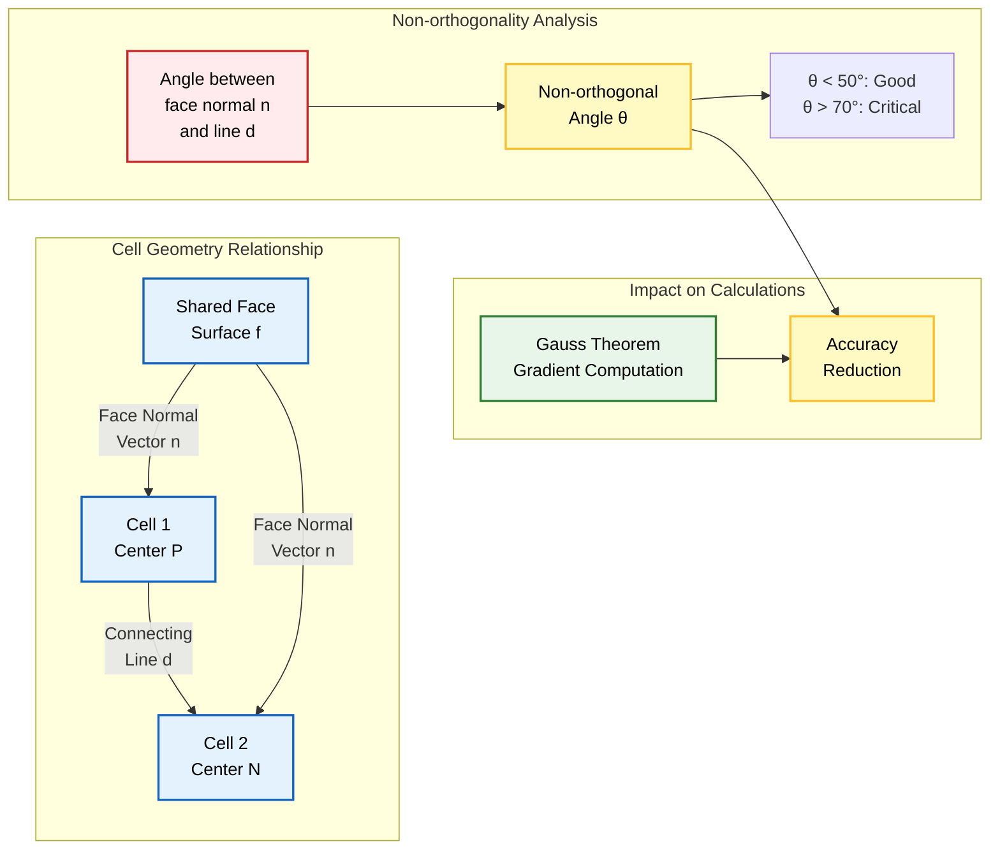
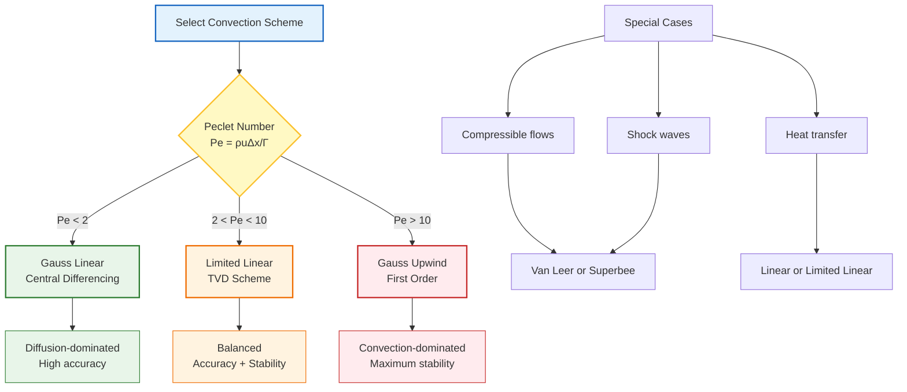
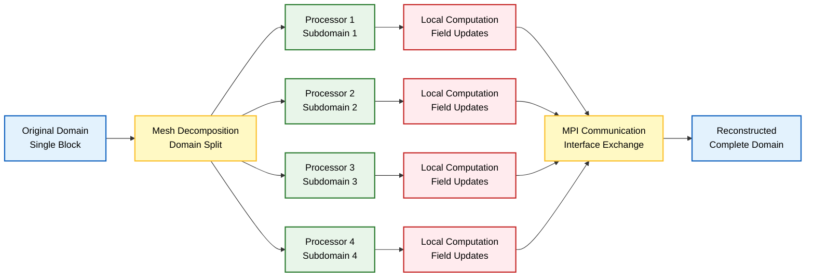
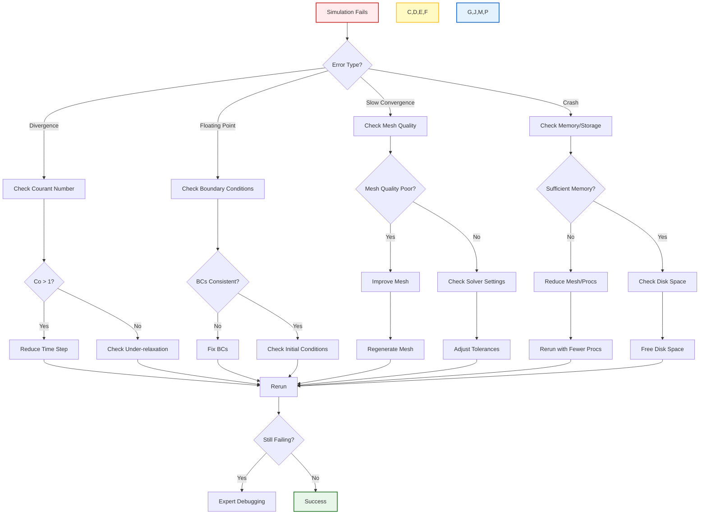
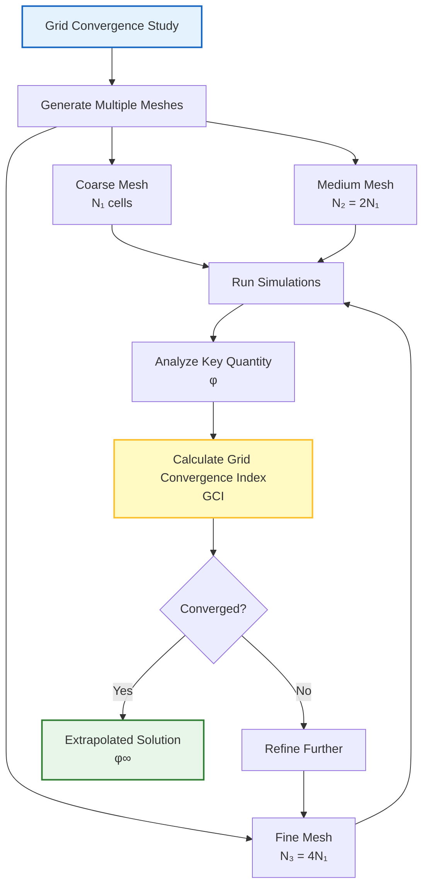

# แนวปฏิบัติที่ดีที่สุด (Best Practices)

## ภาพรวม (Overview)

เอกสารฉบับนี้รวบรวมแนวปฏิบัติที่ดีที่สุดสำหรับการจำลอง CFD ด้วย OpenFOAM โดยครอบคลุมตั้งแต่การเตรียม Mesh การตั้งค่า Numerical Schemes การเลือก Solver ไปจนถึงการตรวจสอบความถูกต้องและการยืนยันผลลัพธ์ แนวปฏิบัติเหล่านี้มีจุดประสงค์เพื่อปรับปรุงความน่าเชื่อถือ ความแม่นยำ และประสิทธิภาพของการจำลอง

```mermaid
graph TD
    A[Best Practices Framework] --> B[Mesh Quality]
    A --> C[Numerical Schemes]
    A --> D[Solver Settings]
    A --> E[Boundary Conditions]
    A --> F[Computational Efficiency]
    A --> G[Debugging]
    A --> H[Validation & Verification]

    B --> B1[Non-orthogonality<br/>< 50°]
    B --> B2[Skewness<br/>< 0.5]
    B --> B3[Aspect Ratio<br/>< 10]

    C --> C1[Temporal Schemes]
    C --> C2[Spatial Schemes]
    C --> C3[Gradient Methods]

    D --> D1[Linear Solvers]
    D --> D2[Preconditioners]
    D --> D3[Convergence Criteria]

    E --> E1[Wall Boundaries]
    E --> E2[Inlet Conditions]
    E --> E3[Outlet Conditions]

    F --> F1[Parallel Computing]
    F --> F2[Memory Optimization]
    F --> F3[AMR]

    G --> G1[Troubleshooting]
    G --> G2[Diagnostics Tools]

    H --> H1[Verification]
    H --> H2[Validation]
    H --> H3[Uncertainty Analysis]

    style A fill:#e3f2fd,stroke:#1565c0,stroke-width:3px,color:#000
    style B fill:#e8f5e9,stroke:#2e7d32,stroke-width:2px,color:#000
    style C fill:#fff9c4,stroke:#fbc02d,stroke-width:2px,color:#000
    style D fill:#ffebee,stroke:#c62828,stroke-width:2px,color:#000
    style E fill:#f3e5f5,stroke:#7b1fa2,stroke-width:2px,color:#000
    style F fill:#e0f2f1,stroke:#00796b,stroke-width:2px,color:#000
    style G fill:#fff3e0,stroke:#ef6c00,stroke-width:2px,color:#000
    style H fill:#fce4ec,stroke:#ad1457,stroke-width:2px,color:#000

    classDef process fill:#e3f2fd,stroke:#1565c0,stroke-width:1px,color:#000
    classDef storage fill:#e8f5e9,stroke:#2e7d32,stroke-width:1px,color:#000

    class B1,B2,B3,C1,C2,C3,D1,D2,D3,E1,E2,E3,F1,F2,F3,G1,G2,H1,H2,H3 process
```



> **Figure 1:** กรอบแนวคิดแนวปฏิบัติที่ดีที่สุดสำหรับการจำลอง CFD ครอบคลุมตั้งแต่คุณภาพของ Mesh, แผนการคำนวณเชิงตัวเลข, การตั้งค่า Solver ไปจนถึงการตรวจสอบความถูกต้องและการยืนยันผลลัพธ์


คุณภาพของ Mesh เป็นปัจจัยสำคัญที่ส่งผลต่อความแม่นยำและความเสถียรของการจำลอง CFD คุณภาพ Mesh ที่ไม่ดีอาจทำให้เกิดข้อผิดพลาดเชิงตัวเลข ลดความแม่นยำของ Solution และอาจทำให้การจำลองเกิดการ Divergence ได้

> [!WARNING] ความสำคัญของ Mesh Quality
> Mesh ที่มีคุณภาพต่ำอาจทำให้เกิด:
> - Numerical diffusion ที่สูงขึ้น
> - การคำนวณ Gradient ที่ไม่แม่นยำ
> - การลู่เข้าที่ช้าลงหรือล้มเหลว
> - ผลลัพธ์ทางฟิสิกส์ที่ผิดพลาด

### พารามิเตอร์คุณภาพหลัก

#### **Non-orthogonality**

การวัดมุมระหว่าง Face normal vector และเส้นเชื่อมต่อจุดศูนย์กลางของ Cell ที่อยู่ติดกัน พารามิเตอร์นี้ส่งผลโดยตรงต่อความแม่นยำของการคำนวณ Gradient โดยใช้ Gauss theorem

$$\cos(\theta) = \frac{\mathbf{n}_f \cdot \mathbf{d}_{PN}}{|\mathbf{n}_f| |\mathbf{d}_{PN}|}$$

โดยที่:
- $\mathbf{n}_f$ = Face normal vector
- $\mathbf{d}_{PN}$ = เวกเตอร์เชื่อมต่อระหว่าง Cell Center P และ N
- $\theta$ = Non-orthogonal angle

**ค่าที่แนะนำ:**
- **< 50°**: คุณภาพดี (Good quality)
- **50° - 70°**: ยอมรับได้ (Acceptable)
- **> 70°**: วิกฤต (Critical) อาจเกิด Numerical diffusion ที่สำคัญ

**การควบคุม:**
```cpp
// ใน fvSolution dictionary
solvers
{
    p
    {
        solver          GAMG;
        tolerance       1e-6;
        relTol          0.1;
        smoother        GaussSeidel;
        nNonOrthogonalCorrectors 2;  // จำนวน correction iterations
    }
}
```



> **Figure 2:** การวิเคราะห์ความไม่ตั้งฉาก (Non-orthogonality) ของ Mesh และผลกระทบต่อการคำนวณเกรเดียนต์โดยใช้ทฤษฎีบทของเกาส์ ซึ่งความเบี่ยงเบนที่มากเกินไปจะลดความแม่นยำของผลเฉลยลง


การวัดปริมาณการเบี่ยงเบนของจุด Face-cell intersection จาก Geometric face center

$$\text{Skewness} = \frac{|\mathbf{d}_{Pf} + \mathbf{d}_{fN}|}{|\mathbf{d}_{PN}|}$$

**ค่าที่แนะนำ:**
- **< 0.5**: คุณภาพดี
- **0.5 - 0.6**: ยอมรับได้
- **> 0.6**: วิกฤต สามารถลดความแม่นยำได้อย่างรุนแรง

**ผลกระทบ:**
- นำข้อผิดพลาด Interpolation เข้ามาในการคำนวณ Face value
- ลดความแม่นยำของ Flux calculations
- อาจทำให้เกิดการลู่เข้าที่ไม่ดี

**เครื่องมือวินิจฉัย:**
```bash
# ตรวจสอบคุณภาพ Mesh
checkMesh

# ตรวจสอบเฉพาะ skewness
checkMesh -skew
```

#### พารามิเตอร์คุณภาพเพิ่มเติม

| พารามิเตอร์ | ค่าที่แนะนำ | ผลกระทบหากเกินขีดจำกัด | การวัด |
|--------------|-------------|---------------------|----------|
| **Aspect ratio** | < 10 | ลดความแม่นยำในทิศทางที่ยาว | $\frac{\Delta x_{max}}{\Delta x_{min}}$ |
| **Cell expansion ratio** | < 1.5 | สร้าง Numerical errors | $\frac{\Delta x_{adjacent}}{\Delta x_{current}}$ |
| **Mesh gradation** | ค่อยๆ เปลี่ยน | หากเปลี่ยนแปลงเร็วเกินไป อาจไม่ลู่เข้า | การเปลี่ยนขนาดเซลล์ต่อเนื่อง |
| **Concavity** | < 80° | ปัญหา Interpolation | มุมภายในของเซลล์ |
| **Volume change** | < 20% | Numerical instability | การเปลี่ยนแปลงปริมาตรเซลล์ |

> [!TIP] การเตรียม Mesh ที่ดี
> 1. เริ่มต้นด้วย Structured mesh หากเป็นไปได้
> 2. ใช้ Boundary layer mesh สำหรับปัญหาที่มี Wall shear
> 3. หลีกเลี่ยงการเปลี่ยนขนาดเซลล์ที่รุนแรง
> 4. ตรวจสอบคุณภาพ Mesh ด้วย `checkMesh` ก่อนเริ่ม simulation

---

## การตรวจสอบการลู่เข้า (Convergence Monitoring)

การประเมิน Convergence ใน OpenFOAM โดยทั่วไปเกี่ยวข้องกับการตรวจสอบตัวบ่งชี้หลายตัวที่รวมกันกำหนดความน่าเชื่อถือของ Solution

### **Residuals**

แสดงถึงการวัดว่า Solution ปัจจุบันเป็นไปตาม Discretized governing equations ได้ดีเพียงใด

$$r = |A\phi - b|$$

โดยที่:
- $A$ = Coefficient matrix
- $\phi$ = Solution vector
- $b$ = Source vector

**การตรวจสอบ Residuals:**
```cpp
// ใน controlDict
functions
{
    residuals
    {
        type            residuals;
        libs            ("libutilityFunctionObjects.so");
        writeResidualFields  no;
        fields          (p U k epsilon);
    }
}
```

**เกณฑ์การลู่เข้า:**
- **การลดลงที่ต้องการ**: 3-6 ระดับขนาด (orders of magnitude)
- **เกณฑ์การลู่เข้า**: < 1e-5 สำหรับ Solvers ส่วนใหญ่
- **Steady-state**: Residuals ควรลดลงจนถึง plateau ที่ค่าต่ำ
- **Transient**: Residuals ต่ำกว่า threshold ในแต่ละ time step

### **Under-relaxation**

เทคนิค Stabilization ที่ช่วยชะลออัตราการเปลี่ยนแปลงเพื่อป้องกัน Numerical oscillations และ Divergence

$$\phi^{new} = \phi^{old} + \alpha (\phi^{calc} - \phi^{old})$$

โดยที่:
- $\phi^{new}$ = Updated solution
- $\phi^{old}$ = Previous iteration value
- $\phi^{calc}$ = ค่าที่คำนวณใหม่
- $\alpha$ = Under-relaxation factor (โดยทั่วไป 0.3-0.8)

**การตั้งค่าใน `fvSolution`:**
```cpp
relaxationFactors
{
    fields
    {
        p               0.3;    // Pressure: การผ่อนปรนสูง
        U               0.5;    // Velocity: การผ่อนปรนปานกลาง
        T               0.5;    // Temperature: การผ่อนปรนปานกลาง
    }
    equations
    {
        k               0.7;    // TKE: การผ่อนปรนต่ำ
        epsilon         0.7;    // Dissipation: การผ่อนปรนต่ำ
    }
}
```

**คำแนะนำการตั้งค่า:**
- **Steady-state problems**: ใช้การผ่อนปรนสูงกว่า (0.3-0.5)
- **Transient problems**: สามารถใช้การผ่อนปรนต่ำกว่า (0.7-0.9)
- **Highly non-linear**: ลดค่า alpha หากไม่ลู่เข้า
- **Near convergence**: เพิ่มค่า alpha เพื่อเร่งการลู่เข้า

### ตัวบ่งชี้การลู่เข้าเพิ่มเติม

| ตัวบ่งชี้ | คำอธิบาย | เกณฑ์ |
|------------|-----------|--------|
| **Mass balance** | Net mass flux ที่ boundaries | < 1% ของ inlet mass flow |
| **Force convergence** | Forces บน surfaces ที่สนใจ | < 1% change ใน 50 iterations |
| **Field monitoring** | ค่าที่จุดเฝ้าสังเกต | ค่าคงที่หรือ oscillate น้อย |
| **Global quantities** | Integrated quantities (lift, drag) | ค่าคงที่หรือ trend ชัดเจน |

---

## การเลือก Numerical Scheme (Numerical Scheme Selection)

### **Temporal Discretization Schemes**

| Scheme | ลำดับความแม่นยำ | รูปแบบสมการ | ความเสถียร | กรณีที่เหมาะสม |
|--------|-----------------|--------------|-------------|----------------|
| **Euler** | First-order explicit | $\phi^{n+1} = \phi^n + \Delta t \cdot f(\phi^n)$ | Conditionally stable (CFL < 1) | การทดสอบเบื้องต้น, Simple problems |
| **Backward** | Second-order implicit | $\frac{3\phi^{n+1} - 4\phi^n + \phi^{n-1}}{2\Delta t}$ | Unconditionally stable | การจำลอง Transient ทั่วไป, Large time steps |
| **CrankNicolson** | Second-order | $\frac{\phi^{n+1} - \phi^n}{\Delta t} = \frac{1}{2}[f(\phi^n) + f(\phi^{n+1})]$ | Good stability | การจำลองที่ต้องการความแม่นยำสูง |
| **BDF2** | Second-order | $\phi^{n+1} = \frac{4}{3}\phi^n - \frac{1}{3}\phi^{n-1} + \frac{2}{3}\Delta t \cdot f(\phi^{n+1})$ | Good stability | High accuracy transient, Stiff problems |

**การตั้งค่าใน `fvSchemes`:**
```cpp
ddtSchemes
{
    default         backward;  // หรือ Euler, CrankNicolson
}
```

**คำแนะนำ:**
- **Explicit Euler**: เฉพาะการทดสอบเบื้องต้น เนื่องจากต้องการ time step เล็กมาก
- **Implicit Euler**: สำหรับ steady-state และ transient ทั่วไป
- **CrankNicolson**: เมื่อต้องการความแม่นยำสูง แต่ระวัง oscillations
- **BDF2**: สำหรับ transient ที่ต้องการความแม่นยำสูงและ stability ดี

### **Spatial Discretization for Convective Terms**

| Scheme | รูปแบบสมการ | ความแม่นยำ | ข้อดี | ข้อเสีย | กรณีที่เหมาะสม |
|--------|--------------|-------------|--------|---------|----------------|
| **Gauss linear** | $\phi_f = 0.5(\phi_P + \phi_N)$ | Order 2 | Second-order accurate | ไม่เสถียรสำหรับ Reynolds สูง, $Pe > 2$ | Laminar flow, Fine meshes |
| **Gauss upwind** | $\phi_f = \phi_P$ if $\Phi_f > 0$ | Order 1 | Stability สูงมาก | Numerical diffusion สูง | High convection, Coarse meshes |
| **Gauss limitedLinear** | $\phi_f = \phi_P + \psi(r) \cdot \frac{1}{2}(\phi_N - \phi_P)$ | Order 2 | สมดุลระหว่าง accuracy และ stability | Complex implementation | General CFD applications |
| **Gauss vanLeer** | Van Leer limiter | Order 2 | สมดุลดี | Computational cost สูง | Compressible flows, Shocks |
| **Gauss QUICK** | $\phi_f = \frac{6}{8}\phi_P + \frac{3}{8}\phi_N - \frac{1}{8}\phi_{NN}$ | Order 3 | Excellent accuracy | Can be unstable | Structured grids, Smooth flows |

**OpenFOAM Code Implementation:**
```cpp
// ใน fvSchemes dictionary
divSchemes
{
    div(phi,U)      Gauss limitedLinearV 1;    // Velocity: TVD
    div(phi,k)      Gauss limitedLinear 1;     // TKE: TVD
    div(phi,epsilon) Gauss upwind;             // Dissipation: Upwind
    div(phi,T)      Gauss linear;              // Temperature: Central
}
```

**คำแนะนำการเลือก Scheme:**


> **Figure 3:** แผนผังการตัดสินใจสำหรับการเลือกแผนการคำนวณการพา (Convection scheme) ตามเลขเพกเลต์ ($Pe$) เพื่อรักษาสมดุลระหว่างความแม่นยำและเสถียรภาพตามลักษณะการไหล


| Scheme | คำอธิบาย | ความแม่นยำ | กรณีที่เหมาะสม | Computational Cost |
|--------|------------|-------------|-----------------|-------------------|
| **Gauss linear** | Standard linear interpolation พร้อม Correction | Order 2 | Orthogonal meshes ส่วนใหญ่ | ต่ำ |
| **leastSquares** | Least squares reconstruction | Order 2+ | Complex meshes | สูง |
| **fourthOrder** | Fourth-order accurate | Order 4 | Structured meshes | สูงมาก |

**การตั้งค่าใน `fvSchemes`:**
```cpp
gradSchemes
{
    default         Gauss linear;  // Standard scheme
    // หรือสำหรับความแม่นยำสูงกว่า
    // default         leastSquares;  // สำหรับ complex meshes
}
```

**Non-Orthogonal Correction:**
สำหรับ meshes ที่ไม่ orthogonal อย่างสิ้นเชิง:

$$(\nabla \phi)_f \cdot \mathbf{S}_f = |\mathbf{S}_f| \frac{\phi_N - \phi_P}{|\mathbf{d}_{PN}|} + \underbrace{(\nabla \phi)_{correct} \cdot (\mathbf{S}_f - \mathbf{d}_{PN} \frac{|\mathbf{S}_f|}{|\mathbf{d}_{PN}|})}_{\text{Non-orthogonal correction}}$$

การควบคุมจำนวน correction iterations:
```cpp
// ใน fvSolution
solvers
{
    p
    {
        nNonOrthogonalCorrectors 2;  // เพิ่มสำหรับ high non-orthogonality
    }
}
```

---

## การปรับแต่งการตั้งค่า Solver (Solver Settings Optimization)

### **การเลือก Linear Solver**

| Solver | เหมาะสำหรับ | ข้อดี | ข้อเสีย | Preconditioners |
|--------|---------------|---------|---------|----------------|
| **GAMG** | Large systems ที่มีการเปลี่ยนแปลง Coefficient ราบรื่น | ความเร็วสูงสำหรับ Mesh ใหญ่, Excellent scaling | Memory intensive, Complex setup | DIC, GaussSeidel |
| **PCG** | Symmetric positive definite matrices | Efficient สำหรับ Diffusion equations, Robust | จำกัดกับ symmetric systems | DIC, Cholesky |
| **PBiCGStab** | Non-symmetric systems | Flexible สำหรับ Convection-diffusion, Good stability | อาจต้องการ precondioners | DILU, FDILU |
| **GMRES** | Highly Non-Symmetric, Ill-conditioned | Excellent for difficult systems | Memory usage increases with iterations | DILU, ILU |
| **smoothSolver** | Simple problems | Memory usage ต่ำ, Simple | Convergence ช้าสำหรับ Complex systems | GaussSeidel, DIC |

**การตั้งค่า Tolerance:**
```cpp
solvers
{
    p
    {
        solver          GAMG;
        tolerance       1e-6;      // Absolute tolerance
        relTol          0.1;       // Relative tolerance (10%)
        smoother        GaussSeidel;
        nPreSweeps      0;
        nPostSweeps     2;
        nFinestSweeps   2;
        cacheAgglomeration on;
        agglomerator    faceAreaPair;
        mergeLevels     1;
    }

    U
    {
        solver          PBiCGStab;
        preconditioner  DILU;
        tolerance       1e-5;
        relTol          0;         // Tight tolerance
        minIter         0;
        maxIter         1000;
    }

    k
    {
        solver          PBiCGStab;
        preconditioner  DILU;
        tolerance       1e-6;
        relTol          0.1;
    }

    epsilon
    {
        solver          PBiCGStab;
        preconditioner  DILU;
        tolerance       1e-6;
        relTol          0.1;
    }
}
```

**คำแนะนำการตั้งค่า:**
- **Pressure (p)**: ใช้ GAMG สำหรับ meshes ใหญ่, PCG สำหรับ meshes เล็ก
- **Velocity (U)**: PBiCGStab หรือ GMRES สำหรับ convection-dominated flows
- **Turbulence (k, epsilon)**: PBiCGStab หรือ smoothSolver
- **Scalars (T, species)**: เลือกตาม symmetry ของ equation

**Tolerance Guidelines:**

| ตัวแปร | Absolute Tolerance | Relative Tolerance | คำอธิบาย |
|---------|-------------------|-------------------|-----------|
| **Pressure** | 1e-6 to 1e-8 | 0.01 - 0.1 | ต้องความแม่นยำสูง |
| **Velocity** | 1e-5 to 1e-6 | 0 - 0.1 | Tight tolerance สำคัญ |
| **Turbulence** | 1e-6 | 0.1 | Moderate tolerance |
| **Scalars** | 1e-6 to 1e-7 | 0.01 - 0.1 | ขึ้นกับความ sensitivity |

> [!TIP] การเพิ่มประสิทธิภาพ Solver
> 1. เริ่มต้นด้วย tolerances หลวมๆ สำหรับ initial iterations
> 2. ค่อยๆ ผูก tolerances ขณะ approach convergence
> 3. ใช้ `solverPerformance` function object เพื่อตรวจสอบ
> 4. ปรับจำนวน iterations สูงสุดตามความจำเป็น

---

## การใช้งาน Boundary Condition (Boundary Condition Implementation)

### **Wall Boundaries**

**Velocity:**
- **No-slip conditions**: $\mathbf{u} = 0$ (สำหรับ viscous flows)
- **Slip conditions**: $(\mathbf{u} \cdot \mathbf{n}) = 0$ (สำหรับ inviscid flows)

**Thermal:**
- **Fixed temperature**: `fixedValue`
- **Heat flux**: `fixedGradient`
- **Convection**: `externalWallHeatFlux`

**Turbulence Wall Functions:**

| Wall Function | การใช้งาน | $y^+$ range | คำอธิบาย |
|---------------|-------------|------------|-----------|
| **kqRWallFunction** | จัดการ Turbulence kinetic energy | 30 < $y^+$ < 300 | Standard wall function |
| **nutkWallFunction** | จัดการ Turbulent viscosity | 30 < $y^+$ < 300 | $\mu_t = \kappa y u_\tau$ |
| **epsilonWallFunction** | ควบคุม Dissipation rate | 30 < $y^+$ < 300 | $\varepsilon = \frac{u_\tau^3}{\kappa y}$ |
| **omegaWallFunction** | จัดการ Specific dissipation | All $y^+$ | Low-Reynolds compatible |

**ตัวอย่างการตั้งค่า:**
```cpp
// 0/U
wall
{
    type            noSlip;  // หรือ fixedValue
    value           uniform (0 0 0);
}

// 0/T
wall
{
    type            fixedValue;     // Fixed temperature
    value           uniform 300;

    // หรือ
    type            fixedGradient;   // Fixed heat flux
    gradient        uniform 100;

    // หรือ
    type            externalWallHeatFlux;
    mode            coefficient;
    hCoefficient    uniform 10;
    Ta              uniform 300;
}

// 0/k
wall
{
    type            kqRWallFunction;
    value           uniform 0;
}

// 0/epsilon หรือ 0/omega
wall
{
    type            epsilonWallFunction;  // หรือ omegaWallFunction
    value           uniform 0;
}
```

### **Inlet Boundaries**

| Boundary Condition | การใช้งาน | ตัวอย่าง Code | หมายเหตุ |
|--------------------|-------------|-----------------|----------|
| **fixedValue** | กำหนดค่าที่แน่นอน | `inlet { type fixedValue; value uniform 10; }` | ง่ายที่สุด, Constant values |
| **fixedGradient** | ระบุค่า Gradient | `inlet { type fixedGradient; gradient uniform 0; }` | Zero-gradient inlet |
| **timeVaryingMappedFixedValue** | Map จาก External data | `inlet { type timeVaryingMappedFixedValue; ... }` | Transient profiles |
| **turbulentInlet** | แนะนำ Turbulent fluctuations | `inlet { type turbulentInlet; ... }` | Realistic turbulence |
| **surfaceFilm** | Film inlet | `inlet { type surfaceFilm; ... }` | Thin film flows |

**ตัวอย่าง Velocity Inlet:**
```cpp
// 0/U
inlet
{
    type            fixedValue;
    value           uniform (10 0 0);  // m/s ในทิศทาง x
}

// หรือด้วย profile
inlet
{
    type            codedFixedValue;
    value           uniform (0 0 0);
    code
    #{
        vectorField& inletField = *this;

        // Parabolic profile
        scalar y = this->patch().Cf().component(1);
        scalar Umax = 10.0;
        scalar H = 1.0;

        forAll(inletField, i)
        {
            inletField[i] = vector(Umax * 4.0 * y[i] * (H - y[i]) / sqr(H), 0, 0);
        }
    #};
}
```

### **Outlet Boundaries**

| Boundary Condition | คำอธิบาย | เหมาะสำหรับ | ตัวอย่าง |
|--------------------|------------|-------------|-----------|
| **zeroGradient** | $\nabla \phi = 0$ | Fully developed flows | `outlet { type zeroGradient; }` |
| **inletOutlet** | สลับระหว่าง Inlet/Outlet | การไหลย้อนกลับที่เป็นไปได้ | `outlet { type inletOutlet; inletValue uniform 0; value uniform 0; }` |
| **outletInlet** | คล้าย inletOutlet | การระบุย้อนกลับ | `outlet { type outletInlet; outletValue uniform 0; value uniform 0; }` |
| **pressureInletOutletVelocity** | Pressure-driven | Transient กับ backflow | `outlet { type pressureInletOutletVelocity; value uniform (0 0 0); }` |

**ตัวอย่าง Pressure Outlet:**
```cpp
// 0/p
outlet
{
    type            fixedValue;
    value           uniform 0;  // Gauge pressure = 0
}

// 0/U
outlet
{
    type            pressureInletOutletVelocity;
    value           uniform (0 0 0);
}

// 0/T
outlet
{
    type            inletOutlet;
    inletValue      uniform 300;
    value           uniform 300;
}
```

---

## ประสิทธิภาพการคำนวณ (Computational Efficiency)

### **Parallel Computing**

**ขั้นตอนการดำเนินการ:**

```bash
# 1. Decompose case for parallel execution
decomposePar -force

# 2. Run parallel simulation
mpirun -np 4 solver -case . -parallel

# 3. Reconstruct results
reconstructPar

# 4. หรือ reconstruct บาง time directories
reconstructPar -latestTime
```



> **Figure 4:** ขั้นตอนการทำงานของการคำนวณแบบขนานผ่านการแบ่งโดเมน (Domain decomposition) แสดงการแยกส่วน Mesh ไปยังตัวประมวลผลต่าง ๆ และการสื่อสารผ่าน MPI เพื่อรวมผลลัพธ์กลับมาเป็นโดเมนที่สมบูรณ์


```cpp
// system/decomposeParDict
method          scotch;  // หรือ hierarchical, simple, manual

numberOfSubdomains 4;

scotchCoeffs
{
    // Processor weights
    processorWeights
    (
        1
        1
        1
        1
    );
}

// สำหรับ hierarchical method
hierarchicalCoeffs
{
    n           (4 1 1);  // 4 ใน x, 1 ใน y, 1 ใน z
    delta       0.001;
    order       xyz;
}
```

**คำแนะนำ Parallelization:**
- **Load balancing**: ใช้ `scotch` หรือ `metis` สำหรับ automatic balancing
- **Number of processors**: 10,000 - 100,000 cells per processor
- **Scaling efficiency**: Monitor speedup และ parallel efficiency
- **Memory consideration**: ตรวจสอบ memory per node

### **Memory Optimization**

**เทคนิคการจัดการ Memory:**

```cpp
// 1. การใช้ Field types ที่เหมาะสม
volScalarField p(mesh);      // Correct: Scalar field
volVectorField U(mesh);      // Correct: Vector field

// 2. การใช้ autoPtr และ tmp
autoPtr<volScalarField> pPtr(new volScalarField(mesh));
tmp<volScalarField> tGradP = fvc::grad(p);

// 3. การลดการจัดเก็บที่ไม่จำเป็น
// ไม่ store ค่า intermediate ที่ไม่จำเป็น
// ใช้ expression templates สำหรับ operations
```

**Best Practices:**
- ใช้ `tmp<T>` สำหรับ intermediate fields
- หลีกเลี่ยงการสร้าง field copies
- ใช้ `autoPtr<T>` สำหรับ large objects
- Reuse temporaries ใน loops
- Clear unused fields: `field.clear()`

### **Adaptive Mesh Refinement (AMR)**

**ประเภท Dynamic Mesh:**

| ประเภท | คำอธิบาย | การใช้งาน |
|--------|------------|-------------|
| **dynamicRefineFvMesh** | การ Refinement แบบ Cell-based ตาม Criteria | Localized phenomena |
| **dynamicFvMesh** | General dynamic mesh framework | Moving/deforming meshes |
| **dynamicMotionSolverFvMesh** | Motion solver coupled | Fluid-structure interaction |

**การตั้งค่า AMR:**

```cpp
// system/dynamicMeshDict
dynamicFvMesh   dynamicRefineFvMesh;

refinementLevel 2;  // Maximum refinement levels

refinementBoxes
{
    box1
    {
        min (0.1 0 0);
        max (0.2 1 1);
        cellSize 0.01;
    }
}

// Refinement criteria
refineInterval  1;  // Refine every time step

fields
(
    U
    p
);
```

**Refinement Criteria:**
$$\text{Refine if } |\nabla \phi| > \phi_{ref} \quad \text{and} \quad \Delta x > \Delta x_{min}$$

AMR มีคุณค่าสำหรับปัญหาที่มี Localized phenomena:
- **Shock waves**: Compressible flows
- **Flame fronts**: Combustion
- **Moving interfaces**: Multiphase flows
- **Boundary layers**: Near-wall refinement

> [!TIP] การใช้ AMR อย่างมีประสิทธิภาพ
> 1. เริ่มต้นด้วย coarse mesh
> 2. ตั้งค่า refinement criteria ที่เหมาะสม
> 3. จำกัด maximum refinement levels
> 4. ตรวจสอบ load balancing สำหรับ parallel runs

---

## การแก้ไขข้อผิดพลาดและการแก้ไขปัญหา (Debugging and Troubleshooting)

### **ปัญหาทั่วไปและการแก้ไข**

| ปัญหา | สาเหตุที่เป็นไปได้ | การแก้ไข | เครื่องมือวินิจฉัย |
|--------|------------------|-----------|-----------------|
| **Divergence** | Time step ใหญ่เกินไป, Mesh ไม่ดี | ลด Time step, ปรับ Under-relaxation | ตรวจสอบ residuals, Courant number |
| **Floating point exceptions** | Boundary conditions ไม่ถูกต้อง, Zero denominators | ตรวจสอบ BCs, เพิ่ม small value | `foamDebugSwitches`, Stack trace |
| **Matrix not factorizable** | Mesh quality แย่, Ill-conditioned matrix | ปรับปรุง Mesh, เปลี่ยน Solver | `checkMesh`, Condition number |
| **Slow convergence** | Bad initial guess, Inconsistent settings | ลด tolerances, ปรับ under-relaxation | Residual plotting |
| **Oscillations** | High order schemes, Large time steps | ลด order scheme, ลด time step | Time history monitoring |

### **เครื่องมือวินิจฉัย**

**1. checkMesh:**
```bash
# Full mesh check
checkMesh

# Specific checks
checkMesh -allGeometry -allTopology

# Mesh quality report
checkMesh -writeAllFields
```

**2. foamDebugSwitches:**
```bash
# Enable debug output
foamDebugSwitches

# ตรวจสอบ specific switches
foamDebugSwitches | grep -i solver

# Set debug level
export FOAM_DEBUG=1
```

**3. Debug Functions:**
```cpp
// ใน controlDict
functions
{
    convergence
    {
        type            sets;
        libs            ("libfieldFunctionObjects.so");

        set             midLine;
        source          cellToPoint;
        fields
        (
            p
            U
        );
    }

    probes
    {
        type            probes;
        libs            ("libsampling.so");

        probeLocations  ( (0.1 0.1 0) (0.2 0.1 0) );
        fields          (p U k epsilon);
    }
}
```

**4. Performance Monitoring:**
```bash
# Timing information
mpirun -np 4 solver -parallel -parallel

# Profiling
foamProfiler

# Memory usage
foamListTimes
```

### ขั้นตอนการแก้ปัญหาเชิงระบบ


> **Figure 5:** ขั้นตอนการแก้ปัญหาอย่างเป็นระบบเมื่อการจำลองล้มเหลว โดยไล่เรียงจากการตรวจสอบประเภทของข้อผิดพลาด (เช่น การไม่ลู่เข้า หรือข้อผิดพลาดทางคณิตศาสตร์) ไปจนถึงการปรับปรุงพารามิเตอร์และการรันซ้ำ


### **Version Control ด้วย Git**

```bash
# Initialize repository
git init

# Create .gitignore
cat > .gitignore << EOF
# OpenFOAM outputs
*.bak
processor*
[0-9]*
[0-9]*.[0-9]*
*log.*
*log.*

# Core files
core
*.foam

# Editor files
*.swp
*~
.vscode/
.idea/
EOF

# Add and commit
git add .
git commit -m "Initial case setup"
```

### **กลยุทธ์การสำรองข้อมูล**

**1. Critical Time Snapshots:**
```bash
# Backup specific time directories
cp -r 5.0 5.0_backup
cp -r 10.0 10.0_backup
```

**2. Mesh and BC Files:**
```bash
# Separate mesh storage
mkdir -p MESH_BACKUP
cp -r constant/polyMesh MESH_BACKUP/
cp -r 0/* MESH_BACKUP/
```

**3. Automated Backup Scripts:**
```bash
#!/bin/bash
# backupScript.sh

CASE_DIR=$1
BACKUP_DIR=$2
TIMESTAMP=$(date +%Y%m%d_%H%M%S)

mkdir -p $BACKUP_DIR/$TIMESTAMP

# Backup critical files
cp -r $CASE_DIR/constant/polyMesh $BACKUP_DIR/$TIMESTAMP/
cp -r $CASE_DIR/0 $BACKUP_DIR/$TIMESTAMP/
cp -r $CASE_DIR/system $BACKUP_DIR/$TIMESTAMP/

# Backup latest results
LATEST_TIME=$(ls -t $CASE_DIR | grep -E '^[0-9]+$' | head -1)
cp -r $CASE_DIR/$LATEST_TIME $BACKUP_DIR/$TIMESTAMP/

echo "Backup completed: $BACKUP_DIR/$TIMESTAMP"
```

### **เอกสารประกอบที่ควรรวม**

**README Template:**

```markdown
# Case Name

## Description
- Problem type: [e.g., Backward facing step]
- Fluid: [e.g., Water]
- Operating conditions: [e.g., Re = 10,000]

## Mesh
- Type: [e.g., Structured/Unstructured]
- Cell count: [e.g., 1M cells]
- Quality metrics:
  - Max non-orthogonality: [value]
  - Max skewness: [value]

## Solver Settings
- Solver: [e.g., simpleFoam]
- Schemes: [List key schemes]
- Tolerances: [List key tolerances]

## Boundary Conditions
- Inlet: [Description]
- Outlet: [Description]
- Walls: [Description]

## Running
- Decompose: `decomposePar`
- Run: `mpirun -np X solver -parallel`
- Reconstruct: `reconstructPar`

## Results
- Convergence: [Description]
- Key metrics: [e.g., Drag coefficient]

## Notes
- [Any special notes or issues]
```

---

## การเชื่อมโยง Multi-Physics (Multi-Physics Coupling)

### **กลยุทธ์การเชื่อมโยง**

**Sequential Coupling:**
- Physics ถูกแก้ตามลำดับ
- ง่ายกว่าแต่มีความแม่นยำน้อยกว่า
- Computational cost ต่ำ
- เหมาะสำหรับ Weakly coupled problems

**Coupled Solving:**
- สมการหลายสมการถูกแก้พร้อมกัน
- แม่นยำกว่าแต่มี Computational cost สูง
- เหมาะสำหรับ Strongly coupled problems
- ต้องการ Coupled solvers

```cpp
// ตัวอย่าง coupled solver (thermophysical)
solve
(
    fvm::ddt(rho, U) + fvm::div(phi, U) - fvm::laplacian(mu, U)
 ==
    -grad(p)
);

solve
(
    fvm::ddt(rho, e) + fvm::div(phi, e) - fvm::laplacian(alpha, e)
 ==
    p*fvc::div(phi) + viscousHeating
);

p.ref() = rho*psi()*e.ref();  // Equation of state coupling
```

### **การตรวจสอบความสอดคล้อง**

**1. Mass conservation:**
$$\sum_{\text{inlets}} \dot{m} - \sum_{\text{outlets}} \dot{m} = 0$$

**2. Energy balance:**
$$\dot{E}_{\text{in}} + \dot{Q}_{\text{generated}} = \dot{E}_{\text{out}} + \dot{Q}_{\text{stored}}$$

**3. Momentum conservation:**
$$\sum \mathbf{F}_{\text{pressure}} + \sum \mathbf{F}_{\text{viscous}} + \sum \mathbf{F}_{\text{body}} = 0 \quad \text{(steady-state)}$$

### **ข้อควรพิจารณาด้าน Stability**

1. **Time step selection**: ตาม Physics ที่เร็วที่สุด
   - Fluid time scale: $\Delta t_f \sim \frac{\Delta x}{|\mathbf{u}|}$
   - Thermal time scale: $\Delta t_T \sim \frac{\Delta x^2}{\alpha}$
   - Use minimum: $\Delta t = \min(\Delta t_f, \Delta t_T)$

2. **Boundary condition consistency**: สอดคล้องกันในทุก Physics
   - Temperature-dependent properties
   - Pressure-velocity coupling
   - Mass transfer coupling

3. **Scaling of coupled equations**:
   - Normalize variables
   - Balance equation magnitudes
   - Use appropriate preconditioning

---

## การตรวจสอบความถูกต้องและการยืนยัน (Validation and Verification)

### **Verification**

การยืนยัน Numerical implementation:

**Grid Convergence Study:**


> **Figure 6:** ขั้นตอนการศึกษาความอิสระของ Mesh (Grid convergence study) เพื่อการยืนยันผลเลขนัยสำคัญเชิงตัวเลข โดยการเปรียบเทียบผลลัพธ์จาก Mesh หลายขนาดเพื่อหาผลเฉลยที่แม่นยำที่สุด

1. สร้าง Mesh หลายขนาด (coarse, medium, fine)
2. ทำการจำลองบนแต่ละ Mesh
3. วิเคราะห์ Order of accuracy: $p = \frac{\ln|\phi_2 - \phi_1|}{\ln|\phi_3 - \phi_2|}$
4. ตรวจสอบ Richardson extrapolation: $\phi_{\infty} \approx \phi_3 + \frac{\phi_3 - \phi_2}{r^p - 1}$

**Time Step Independence:**
- ทำการจำลองด้วย Time steps หลายขนาด
- เปรียบเทียบ Solutions
- หา Time step ที่ Converged

```cpp
// ตัวอย่าง time step study
// controlDict
application     simpleFoam;

startFrom       startTime;
startTime       0;

stopAt          endTime;
endTime         1.0;

deltaT          0.001;  // Try: 0.001, 0.0005, 0.00025
```

### **Validation**

การเปรียบเทียบกับ Experimental หรือ Theoretical data:

**Benchmark Cases:**
- **Lid-driven cavity**: Classic benchmark
- **Backward facing step**: Separation and reattachment
- **Flow around cylinder**: Vortex shedding
- **Turbulent channel flow**: Wall-bounded turbulence

**Experimental Validation:**
- เปรียบเทียบกับการวัดจาก Wind tunnel
- Field measurements
- PIV (Particle Image Velocimetry) data
- Hot-wire anemometry

**Validation Metrics:**

| Metric | คำอธิบาย | การคำนวณ |
|--------|------------|-----------|
| **L₂ norm** | Root mean square error | $\sqrt{\frac{1}{N}\sum_{i=1}^{N}(\phi_{\text{CFD},i} - \phi_{\text{exp},i})^2}$ |
| **L∞ norm** | Maximum error | $\max_i |\phi_{\text{CFD},i} - \phi_{\text{exp},i}|$ |
| **Correlation coefficient** | Linear correlation | $\frac{\text{cov}(\phi_{\text{CFD}}, \phi_{\text{exp}})}{\sigma_{\text{CFD}} \sigma_{\text{exp}}}$ |
| **Relative error** | Percentage error | $\frac{|\phi_{\text{CFD}} - \phi_{\text{exp}}|}{|\phi_{\text{exp}}|} \times 100\%$ |

### **Uncertainty Quantification**

การประเมิน Sensitivity ต่อ Model parameters:

**1. Mesh sensitivity analysis:**
- Vary mesh density
- Monitor solution changes
- Establish mesh independence

**2. Time step sensitivity:**
- Vary time step size
- Check temporal accuracy
- Confirm Courant number criteria

**3. Turbulence model sensitivity:**
- Compare k-ε, k-ω, SST models
- Assess impact on key quantities
- Select appropriate model

**4. Boundary condition sensitivity:**
- Vary inlet profiles
- Test different outlet conditions
- Evaluate sensitivity to uncertainties

```cpp
// Sensitivity study example
// Run multiple cases with different parameters

// Case 1: Standard
divSchemes { div(phi,U) Gauss linear; }

// Case 2: Upwind
divSchemes { div(phi,U) Gauss upwind; }

// Case 3: Limited linear
divSchemes { div(phi,U) Gauss limitedLinear 1; }

// Compare results
```

---

## สรุป (Summary)

แนวปฏิบัติที่ดีที่สุดเหล่านี้ เมื่อนำไปใช้อย่างเป็นระบบ จะช่วยปรับปรุงความน่าเชื่อถือ ความแม่นยำ และประสิทธิภาพของการจำลอง OpenFOAM ในแอปพลิเคชัน CFD ที่หลากหลาย

### **Checklist ก่อนเริ่ม Simulation:**

- [ ] **Mesh Quality**: `checkMesh` passes all checks
- [ ] **Boundary Conditions**: Consistent and physically correct
- [ ] **Numerical Schemes**: Appropriate for flow physics
- [ ] **Solver Settings**: Tolerances and solvers configured
- [ ] **Initial Conditions**: Realistic starting field
- [ ] **Time Step**: CFL < 1 (explicit) or reasonable (implicit)
- [ ] **Parallel Setup**: Proper decomposition
- [ ] **Backup**: Mesh and initial conditions backed up
- [ ] **Documentation**: Case properly documented

### **Monitoring ระหว่าง Simulation:**

- [ ] **Residuals**: Decreasing appropriately
- [ ] **Courant Number**: Within acceptable limits
- [ ] **Mass Balance**: Conserved
- [ ] **Force Convergence**: Stable for steady-state
- [ ] **Field Monitors**: Physical behavior
- [ ] **Disk Space**: Sufficient available
- [ ] **Memory Usage**: Within limits

### **Post-Simulation Analysis:**

- [ ] **Convergence**: Properly converged
- [ ] **Conservation**: Mass, momentum, energy
- [ ] **Validation**: Compared with data/experiment
- [ ] **Verification**: Grid independence confirmed
- [ ] **Documentation**: Results properly archived
- [ ] **Backup**: Final results safely stored

> [!SUCCESS] การประยุกต์ใช้อย่างมืออาชีพ
> การปฏิบัติตามแนวทางเหล่านี้จะช่วยให้การจำลอง CFD ของคุณมีความน่าเชื่อถือ ผลลัพธ์ที่แม่นยำ และสามารถทำซ้ำได้ (reproducible) ซึ่งเป็นสิ่งสำคัญสำหรับงานวิจัยและการพัฒนาในอุตสาหกรรม
