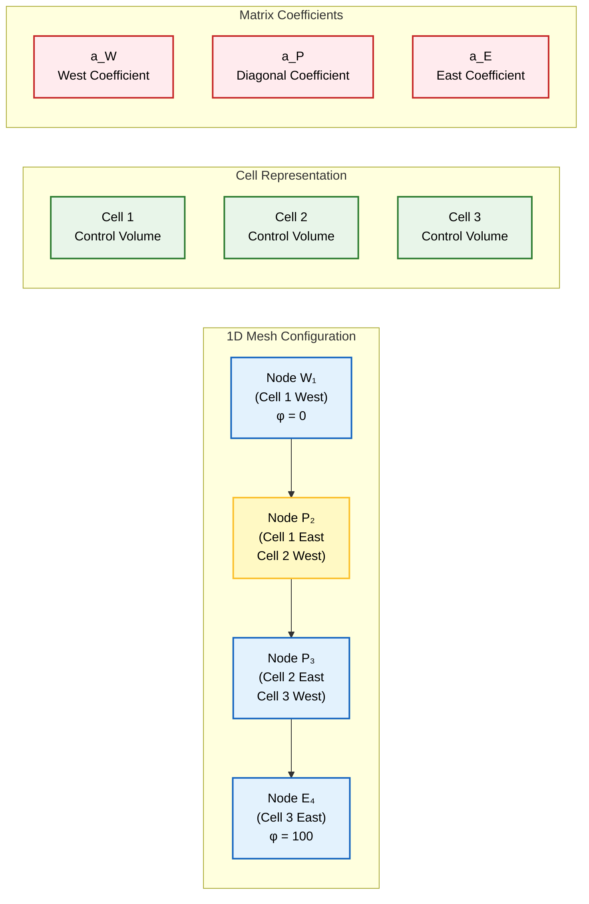
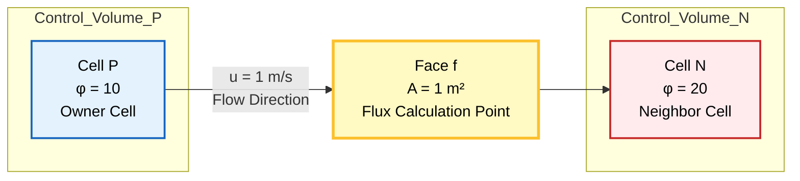

# แบบฝึกหัด OpenFOAM: การ Discretization และการคำนวณฟลักซ์

> [!INFO] วัตถุประสงค์การฝึกหัด
> แบบฝึกหัดชุดนี้มุ่งเสริมสร้างความเข้าใจใน **Finite Volume Discretization** ผ่านปัญหาเชิงปฏิบัติที่ครอบคลุม:
> - การประกอบเมทริกซ์จากสมการเชิงอนุพันธ์
> - การคำนวณ Face Flux ด้วย Schemes ที่แตกต่างกัน
> - การนำไปใช้ใน OpenFOAM Code

---

## แบบฝึกหัดที่ 1: การประกอบเมทริกซ์

### รูปแบบปัญหา

กำหนดปัญหา Diffusion แบบ 1 มิติ ดังนี้:

| พารามิเตอร์ | ค่า |
|--------------|-----|
| **Mesh** | 1 มิติ สม่ำเสมอ 3 เซลล์ (4 โหนด) |
| **สมการ** | $\frac{d^2\phi}{dx^2}=0$ |
| **เงื่อนไขขอบ** | Dirichlet: $\phi_1 = 0$, $\phi_4 = 100$ |
| **วัตถุประสงค์** | เขียนเมทริกซ์ $[A]$ และแก้ระบบสมการ |

### การแสดงภาพ Mesh


> **Figure 1:** การกำหนดรูปแบบ Mesh 1 มิติ และสัมประสิทธิ์เมทริกซ์ แสดงตำแหน่งของโหนด จุดศูนย์กลางเซลล์ และความสัมพันธ์ของปริมาตรควบคุมสำหรับปัญหาการแพร่


#### Step 1: การอินทิเกรตบน Control Volume

เริ่มต้นจากสมการ Diffusion:
$$\frac{d^2\phi}{dx^2} = 0$$

อินทิเกรตบน Control Volume $V$:
$$\int_V \frac{d^2\phi}{dx^2} \, \mathrm{d}V = \left[\frac{d\phi}{dx}\right]_W^E = 0$$

#### Step 2: การใช้ Finite Volume Discretization

ประมาณค่า Gradient ด้วย **Central Differencing**:
$$\frac{\phi_E - \phi_P}{\Delta x_{PE}} - \frac{\phi_P - \phi_W}{\Delta x_{PW}} = 0$$

สำหรับ Mesh สม่ำเสมอ ($\Delta x_{PE} = \Delta x_{PW} = \Delta x$):
$$\frac{\phi_E - \phi_P}{\Delta x} - \frac{\phi_P - \phi_W}{\Delta x} = 0$$

จัดรูปใหม่:
$$-\phi_W + 2\phi_P - \phi_E = 0$$

### โครงสร้างเมทริกซ์

#### สมการสำหรับแต่ละเซลล์

จากการ discretization เราได้สมการทั่วไป:
$$a_P \phi_P = a_E \phi_E + a_W \phi_W$$

โดยที่:
- **Cell 2** (P = 2): $a_P \phi_2 = a_E \phi_3 + a_W \phi_1$
- **Cell 3** (P = 3): $a_P \phi_3 = a_E \phi_4 + a_W \phi_2$

#### สัมประสิทธิ์เมทริกซ์

สำหรับ Mesh สม่ำเสมอ:
$$a_E = a_W = \frac{1}{\Delta x}, \quad a_P = \frac{2}{\Delta x}$$

เมื่อ $\Delta x = 1$:
$$a_E = a_W = 1, \quad a_P = 2$$

### รูปแบบเมทริกซ์แบบเต็ม

#### รูปแบบทั่วไป

ระบบสมการเชิงเส้น: $[A]\{\vec{\phi}\} = \{\vec{b}\}$

$$\begin{bmatrix}
a_P & -a_E & 0 \\
-a_W & a_P & -a_E \\
0 & -a_W & a_P
\end{bmatrix}
\begin{bmatrix}
\phi_2 \\
\phi_3 \\
\phi_4
\end{bmatrix}
=
\begin{bmatrix}
a_W \phi_1 \\
0 \\
0
\end{bmatrix}$$

#### กรณีเฉพาะ

เมื่อ $\Delta x = 1$ และ $\phi_1 = 0$ (จาก Boundary Condition):

$$[A] = \begin{bmatrix}
2 & -1 & 0 \\
-1 & 2 & -1 \\
0 & -1 & 2
\end{bmatrix}, \quad
\{\vec{b}\} = \begin{bmatrix}
0 \\
0 \\
100
\end{bmatrix}$$

> [!TIP] คุณสมบัติของเมทริกซ์
> เมทริกซ์ Tridiagonal นี้มีคุณสมบัติเฉพาะ:
> - **Sparse Matrix**: มีค่าไม่เท่ากับศูนย์เฉพาะบน Diagonal และใกล้ Diagonal
> - **Symmetric**: สมมาตรเมื่อ Diffusion Coefficient คงที่
> - **Diagonally Dominant**: ค่าบน Diagonal > ผลรวมค่าในแถวเดียวกัน (absolute value)

### การแก้ระบบสมการ

#### วิธี TDMA (Tridiagonal Matrix Algorithm)

เนื่องจากเมทริกซ์มีรูปแบบ Tridiagonal สามารถแก้ได้อย่างมีประสิทธิภาพ:

$$\begin{bmatrix}
2 & -1 & 0 \\
-1 & 2 & -1 \\
0 & -1 & 2
\end{bmatrix}
\begin{bmatrix}
\phi_2 \\
\phi_3 \\
\phi_4
\end{bmatrix}
=
\begin{bmatrix}
0 \\
0 \\
100
\end{bmatrix}$$

**ผลลัพธ์**:
- $\phi_2 = 25$
- $\phi_3 = 50$
- $\phi_4 = 100$

### OpenFOAM Code Implementation

```cpp
// Matrix assembly for diffusion equation
// การประกอบเมทริกซ์สำหรับสมการ Diffusion
fvScalarMatrix phiEqn
(
    -fvm::laplacian(D, phi)  // D = diffusion coefficient
);

// Solve the linear system
// การแก้ระบบสมการ
phiEqn.solve();

// Or use specific solver
// หรือใช้ solver เฉพาะ
solve
(
    fvm::laplacian(D, phi) == sourceTerm
);
```

> **คำอธิบาย (Explanation):**
> - **`fvScalarMatrix`**: Finite Volume matrix for scalar field transport (เมทริกซ์ Finite Volume สำหรับการถ่ายเท scalar field)
> - **`fvm::laplacian(D, phi)`**: Implicit discretization of diffusion term (การ discretization แบบ implicit ของเทอม diffusion)
> - **`solve()`**: Direct solver call (การเรียก solver โดยตรง)
> - **`D`**: Diffusion coefficient (สัมประสิทธิ์การแพร่)
> 
> **แนวคิดสำคัญ (Key Concepts):**
> 1. **Implicit Discretization**: Coefficient matrix built with diagonal dominance (การสร้างเมทริกซ์สัมประสิทธิ์แบบ implicit)
> 2. **Laplacian Operator**: Second-order spatial derivative (ตัวดำเนินการอนุพันธ์อันดับสอง)
> 3. **Linear System Solver**: Iterative or direct methods (วิธีการแก้ระบบสมการเชิงเส้น)

> **📂 Source:** `.applications/solvers/multiphase/multiphaseEulerFoam/phaseSystems/PhaseSystems/MomentumTransferPhaseSystem/MomentumTransferPhaseSystem.C`

---

## แบบฝึกหัดที่ 2: การคำนวณฟลักซ์

### รูปแบบปัญหา

**ข้อมูลที่กำหนด**:

| ตัวแปร | ค่า | หน่วย |
|---------|-----|--------|
| $\phi_P$ | 10 | - |
| $\phi_N$ | 20 | - |
| $u$ | 1 | m/s |
| $\rho$ | 1 | kg/m³ |
| $A_f$ | 1 | m² |

**เงื่อนไข**: ความเร็วการไหล $u = 1$ m/s จาก P ไป N (ทิศทางบวก)

**วัตถุประสงค์**: คำนวณ **Face Flux** โดยใช้:
- a) Central Differencing Scheme
- b) Upwind Differencing Scheme

### การแสดงภาพ Control Volume


> **Figure 2:** ปริมาตรควบคุมสำหรับการคำนวณฟลักซ์ แสดงการไหลจากเซลล์เจ้าของ (Owner) ไปยังเซลล์ข้างเคียง (Neighbor) ผ่านหน้าเซลล์ซึ่งเป็นจุดคำนวณฟลักซ์ของการพา


#### นิยาม Convective Flux

**Convective Flux** ที่ข้าม Face ระหว่าง Control Volume P และ N:

$$F_f = \rho u_f \phi_f$$

**นิยามตัวแปร**:
- $F_f$ = Convective Mass Flux (kg/s)
- $\rho$ = ความหนาแน่น (kg/m³)
- $u_f$ = ความเร็วปกติที่ Face (m/s)
- $\phi_f$ = ค่าของตัวแปรที่ Face (interpolated value)

#### ความท้าทายของการคำนวณ

ปัญหาหลัก: **Field Variables ถูกเก็บไว้ที่ Cell Centers** แต่การคำนวณ Flux ต้องการค่าที่ **Face Centroids**

ดังนั้นจึงต้องใช้ **Interpolation Schemes** เพื่อประมาณค่า Face จากค่า Cell Center โดยรอบ

---

### a) Central Differencing Scheme (CDS)

#### หลักการ

ประมาณค่า Face โดยใช้ **Linear Interpolation** ระหว่างจุดศูนย์กลางเซลล์ที่อยู่ติดกัน

#### สมการ

$$\phi_f^{CD} = \frac{\phi_P + \phi_N}{2}$$

#### การคำนวณ

$$\phi_f^{CD} = \frac{10 + 20}{2} = 15$$

#### ผลลัพธ์ Flux

$$F_f^{CD} = \rho \cdot u \cdot \phi_f^{CD} \cdot A_f$$
$$F_f^{CD} = 1 \times 1 \times 15 \times 1 = 15 \, \text{kg/s}$$

> [!INFO] คุณสมบัติของ Central Differencing
> - **ความแม่นยำ**: Order 2 (Second-order accurate)
> - **ความเสถียร**: Unstable สำหรับ $Pe > 2$
> - **ข้อดี**: แม่นยำสูงสำหรับ Flow ที่ละเอียด
> - **ข้อเสีย**: สร้าง Oscillations ใน Steep gradients

---

### b) Upwind Differencing Scheme (UDS)

#### หลักการ

ใช้ค่าเซลล์ **Upstream** ตามทิศทางการไหลของของไหล

#### เงื่อนไขการเลือกค่า

$$\phi_f^{UD} = \begin{cases}
\phi_P & \text{if } \Phi_f > 0 \text{ (flow from P to N)} \\
\phi_N & \text{if } \Phi_f < 0 \text{ (flow from N to P)}
\end{cases}$$

โดยที่ $\Phi_f = \rho u_f A_f$ คือ **Volumetric Flux** ผ่าน Face

#### การคำนวณ

เนื่องจาก $u = 1$ m/s เป็นบวก (ไหลจาก P ไป N):
- **Upwind cell = P**
- $\phi_f^{UD} = \phi_P = 10$

#### ผลลัพธ์ Flux

$$F_f^{UD} = \rho \cdot u \cdot \phi_f^{UD} \cdot A_f$$
$$F_f^{UD} = 1 \times 1 \times 10 \times 1 = 10 \, \text{kg/s}$$

> [!INFO] คุณสมบัติของ Upwind Differencing
> - **ความแม่นยำ**: Order 1 (First-order accurate)
> - **ความเสถียร**: Unconditionally stable
> - **ข้อดี**: เสถียรเสมอ ไม่มี Oscillations
> - **ข้อเสีย**: Numerical diffusion สูง (ทำให้ Gradient เบาบางลง)

---

### การเปรียบเทียบ Schemes

#### สรุปผลลัพธ์

| Scheme | $\phi_f$ | Flux $F_f$ | ความแม่นยำ | ความเสถียร |
|--------|---------|-----------|-------------|-------------|
| **Central Differencing** | 15 | 15 kg/s | Order 2 | Unstable for $Pe > 2$ |
| **Upwind Differencing** | 10 | 10 kg/s | Order 1 | Unconditionally stable |

#### การวิเคราะห์ Peclet Number

**Peclet Number** สำหรับ Interface:

$$Pe = \frac{\rho u \Delta x}{\Gamma} = \frac{\text{Convective Transport}}{\text{Diffusive Transport}}$$

**นิยามตัวแปร**:
- $Pe$ = Peclet Number (อัตราส่วน Convection ต่อ Diffusion)
- $\Gamma$ = Diffusion Coefficient
- $\Delta x$ = ระยะห่างระหว่างจุดศูนย์กลางเซลล์

**เกณฑ์การเลือก Scheme**:
- $Pe < 2$: **Central Differencing** เหมาะสม (Diffusion-dominated)
- $Pe > 2$: **Upwind Differencing** จำเป็น (Convection-dominated)

#### ความแตกต่างทางกายภาพ

**ความแตกต่าง**: 33% ระหว่าง Scheme ทั้งสอง (15 เทียบกับ 10)

**การเลือกใช้ Scheme**:
- **Central Differencing**: เหมาะสำหรับ Laminar flow, Fine meshes, Diffusion-dominated flows
- **Upwind Differencing**: จำเป็นสำหรับ High Reynolds number flows, Coarse meshes, Convection-dominated flows

---

### OpenFOAM Code Implementation

```cpp
// Central differencing (linear scheme)
// การแทรกค่าด้วยแบบ Central differencing (linear scheme)
surfaceScalarField phiCDS
(
    linearInterpolate(phi)  // Interpolates to face centers
);

// Build convection matrix using specified scheme
// การสร้างเมทริกซ์การพาโดยใช้ scheme ที่กำหนด
fvScalarMatrix phiEqn
(
    fvm::div(phi, phi)  // Uses scheme specified in fvSchemes
);

// Define scheme in fvSchemes dictionary
// การกำหนด scheme ใน fvSchemes
divSchemes
{
    div(phi,phi)      Gauss linear;      // Central differencing
    div(phi,U)        Gauss upwind;      // Upwind differencing
}

// Calculate flux directly
// การคำนวณ flux โดยตรง
surfaceScalarField fluxPhi = fvc::flux(phi) * phiCDS;

// Check output values
// การตรวจสอบค่า
Info << "Face flux (CDS): " << sum(fluxPhi) << endl;
```

> **คำอธิบาย (Explanation):**
> - **`surfaceScalarField`**: Field defined on mesh faces (ฟิลด์ที่นิยามบนหน้าเซลล์)
> - **`linearInterpolate(phi)`**: Linear interpolation from cell centers to faces (การแทรกค่าเชิงเส้นจากจุดศูนย์กลางเซลล์ไปยังหน้าเซลล์)
> - **`fvm::div(phi, phi)`**: Implicit convection discretization (การ discretization การพาแบบ implicit)
> - **`fvc::flux(phi)`**: Explicit flux calculation (การคำนวณ flux แบบ explicit)
> - **`Gauss`**: Finite volume theorem integration (การอินทิเกรตด้วยทฤษฎีบทของ Gauss)
> 
> **แนวคิดสำคัญ (Key Concepts):**
> 1. **Interpolation Schemes**: Converting cell-centered values to face values (การแปลงค่าจากจุดศูนย์กลางเซลล์ไปยังหน้าเซลล์)
> 2. **Divergence Theorem**: Surface integral of fluxes (การอินทิเกรตพื้นผิวของฟลักซ์)
> 3. **Numerical Stability**: Peclet number considerations (พิจารณาความเสถียรของ Peclet number)

> **📂 Source:** `.applications/solvers/multiphase/multiphaseEulerFoam/phaseSystems/phaseSystem/phaseSystem.H`

---

## แบบฝึกหัดที่ 3: การประยุกต์ใช้งาน OpenFOAM

### โจทย์

สร้าง OpenFOAM Case สำหรับแก้ปัญหา Convection-Diffusion แบบ 1 มิติ:

$$\frac{\partial \phi}{\partial t} + u \frac{\partial \phi}{\partial x} = \Gamma \frac{\partial^2 \phi}{\partial x^2}$$

### ข้อกำหนด

| พารามิเตอร์ | ค่า |
|--------------|-----|
| Domain | $x \in [0, 1]$ |
| Mesh | 10 เซลล์ สม่ำเสมอ |
| Velocity $u$ | 1 m/s (ค่าคงที่) |
| Diffusion $\Gamma$ | 0.1 m²/s |
| Boundary Conditions | $\phi(0) = 0$, $\phi(1) = 100$ |

### โครงสร้าง Case

```bash
tutorialCase/
├── 0/
│   └── phi           # Initial & boundary conditions
├── constant/
│   └── transportProperties  # Physical properties
├── system/
│   ├── controlDict   # Simulation control
│   ├── fvSchemes     # Discretization schemes
│   └── fvSolution    # Solver settings
└── Allrun            # Script to run simulation
```

### การนำไปใช้งาน

#### 1. ไฟล์ `0/phi`

```cpp
FoamFile
{
    version     2.0;
    format      ascii;
    class       volScalarField;
    object      phi;
}
// * * * * * * * * * * * * * * //

dimensions      [0 0 0 0 0 0 0];

internalField   uniform 0;

boundaryField
{
    inlet
    {
        type            fixedValue;
        value           uniform 0;
    }

    outlet
    {
        type            fixedValue;
        value           uniform 100;
    }

    sides
    {
        type            empty;
    }
}
```

#### 2. ไฟล์ `constant/transportProperties`

```cpp
FoamFile
{
    version     2.0;
    format      ascii;
    class       dictionary;
    object      transportProperties;
}
// * * * * * * * * * * * * * * //

U               U [0 1 -1 0 0 0 0] 1;  // Velocity: 1 m/s
DT              DT [0 2 -1 0 0 0 0] 0.1; // Diffusion: 0.1 m²/s
```

#### 3. ไฟล์ `system/fvSchemes`

```cpp
FoamFile
{
    version     2.0;
    format      ascii;
    class       dictionary;
    object      fvSchemes;
}
// * * * * * * * * * * * * * * //

ddtSchemes
{
    default         Euler;
}

gradSchemes
{
    default         Gauss linear;
}

divSchemes
{
    default         none;
    div(phi,phi)    Gauss upwind;      // เปลี่ยนเป็น linear เพื่อทดสอบ CDS
}

laplacianSchemes
{
    default         Gauss linear corrected;
}
```

#### 4. ไฟล์ `system/fvSolution`

```cpp
FoamFile
{
    version     2.0;
    format      ascii;
    class       dictionary;
    object      fvSolution;
}
// * * * * * * * * * * * * * * //

solvers
{
    phi
    {
        solver          PCG;
        preconditioner  DIC;
        tolerance       1e-06;
        relTol          0;
    }
}

SIMPLE
{
    nNonOrthogonalCorrectors 0;
}
```

#### 5. ไฟล์ `system/controlDict`

```cpp
FoamFile
{
    version     2.0;
    format      ascii;
    class       dictionary;
    object      controlDict;
}
// * * * * * * * * * * * * * * //

application     scalarTransportFoam;

startFrom       startTime;

startTime       0;

stopAt          endTime;

endTime         10;

deltaT          0.01;

writeControl    timeStep;

writeInterval   100;

purgeWrite      0;

writeFormat     ascii;

writePrecision  6;

writeCompression off;

timeFormat      general;

runTimeModifiable true;
```

### การวิเคราะห์ผลลัพธ์

#### การเปรียบเทียบ Schemes

ทดสอบ 2 Schemes โดยเปลี่ยนใน `fvSchemes`:

```cpp
// Test 1: Upwind
div(phi,phi)    Gauss upwind;

// Test 2: Central Differencing
div(phi,phi)    Gauss linear;
```

#### การตรวจสอบ Convergence

```bash
# ตรวจสอบ residuals
grep "Initial residual" log.scalarTransportFoam

# พล็อตผลลัพธ์
paraFoam
```

> [!TIP] การตีความผลลัพธ์
> - **Upwind**: Solution จะเรียบเกินไปเนื่องจาก Numerical diffusion
> - **Central**: Solution จะมี Oscillations ถ้า Peclet number สูง
> - เปรียบเทียบกับ Analytical solution:
> $$\phi(x) = \frac{e^{Pe \cdot x} - 1}{e^{Pe} - 1} \cdot 100$$

---

## แบบฝึกหัดเพิ่มเติม

### แบบฝึกหัดที่ 4: การวิเคราะห์ Peclet Number

กำหนด:
- $u = 2$ m/s
- $\Gamma = 0.1$ m²/s
- $\Delta x = 0.1$ m

**คำถาม**:
1. คำนวณ Peclet Number
2. เลือก Scheme ที่เหมาะสมและอธิบายเหตุผล

**คำตอบ**:
$$Pe = \frac{\rho u \Delta x}{\Gamma} = \frac{1 \times 2 \times 0.1}{0.1} = 2$$

เนื่องจาก $Pe = 2$ (อยู่บนเขตแดน):
- สามารถใช้ **Central Differencing** แต่อาจไม่เสถียร
- แนะนำให้ใช้ **Upwind Differencing** หรือ **Hybrid Scheme**

---

### แบบฝึกหัดที่ 5: Higher-Order Schemes

**TVDFVM Scheme** (Total Variation Diminishing):

$$\phi_f = \phi_U + \psi(r) \cdot \frac{1}{2}(\phi_D - \phi_U)$$

โดยที่:
- $r$ = Smoothness indicator
- $\psi(r)$ = Flux limiter function

**Flux Limiters**:
- **Minmod**: $\psi(r) = \max(0, \min(1, r))$
- **Van Leer**: $\psi(r) = \frac{r + |r|}{1 + |r|}$
- **Superbee**: $\psi(r) = \max(0, \min(2r, 1), \min(r, 2))$

**การนำไปใช้ใน OpenFOAM**:

```cpp
// High-resolution schemes with flux limiters
divSchemes
{
    div(phi,phi)    Gauss vanLeer;       // Van Leer limiter
    div(phi,U)      Gauss limitedLinearV 1;  // Limited linear
}
```

> **คำอธิบาย (Explanation):**
> - **`Gauss vanLeer`**: Van Leer flux limiter scheme (รูปแบบ flux limiter ของ Van Leer)
> - **`limitedLinearV`**: Limited linear scheme with Venkatatsh limiter (รูปแบบเชิงเส้นจำกัดด้วย limiter ของ Venkatatsh)
> - **`1`**: Limiter coefficient (ค่าสัมประสิทธิ์ limiter)
> 
> **แนวคิดสำคัญ (Key Concepts):**
> 1. **TVD Schemes**: Total Variation Diminishing for monotonic solutions (รูปแบบ TVD สำหรับการแก้สมการแบบ monotonic)
> 2. **Flux Limiters**: Non-linear functions to prevent oscillations (ฟังก์ชันไม่เชิงเส้นเพื่อป้องกันการสั่น)
> 3. **High-Order Accuracy**: Second-order with boundedness (ความแม่นยำอันดับสองพร้อมการจำกัดขอบเขต)

> **📂 Source:** `.applications/solvers/compressible/rhoCentralFoam/rhoCentralFoam.C`

---

## บทสรุป

### หัวข้อสำคัญที่เรียนรู้

1. **Matrix Assembly**: การแปลงสมการเชิงอนุพันธ์เป็นระบบพีชคณิตเชิงเส้น
2. **Flux Calculation**: การประมาณค่า Face values ด้วย Interpolation schemes
3. **Scheme Selection**: การเลือก Scheme ที่เหมาะสมตาม Peclet number
4. **OpenFOAM Implementation**: การนำทฤษฎีไปใช้ในโค้ดจริง

### แนวทางการศึกษาต่อ

| หัวข้อ | แหล่งอ้างอิง |
|---------|-----------------|
| **Spatial Discretization** | [[03_Spatial_Discretization]] |
| **Temporal Discretization** | [[04_Temporal_Discretization]] |
| **Matrix Assembly** | [[05_Matrix_Assembly]] |
| **OpenFOAM Implementation** | [[06_OpenFOAM_Implementation]] |
| **Best Practices** | [[07_Best_Practices]] |

### คำถามท้ายบท

1. จะเกิดอะไรขึ้นถ้าใช้ Central Differencing กับ High Peclet number flow?
2. ทำไม Upwind Differencing จึงเสถียรกว่าแต่กลับมี Numerical diffusion?
3. จะเลือก Scheme อย่างไรสำหรับ Transient convection-diffusion problem?
4. จะสร้าง Higher-order scheme ที่มีทั้งความแม่นยำและความเสถียรได้อย่างไร?

---

## References

- OpenFOAM User Guide: Section 4.4 - Finite Volume Discretization
- Jasak, H. (1996). "Error Analysis and Estimation for the Finite Volume Method"
- Ferziger, J. H., & Peric, M. (2002). "Computational Methods for Fluid Dynamics"
- Hirsch, C. (2007). "Numerical Computation of Internal and External Flows"