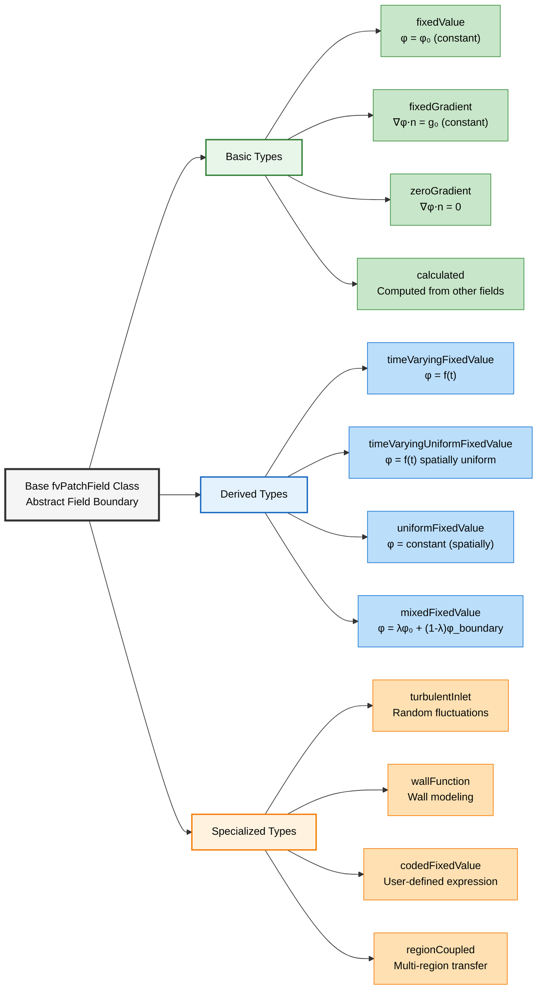

# ภาพรวม Boundary Conditions ใน OpenFOAM

**Boundary Condition** เป็นองค์ประกอบพื้นฐานในการจำลองพลศาสตร์ของไหลเชิงคำนวณ (Computational Fluid Dynamics หรือ CFD) ซึ่งกำหนดว่าคุณสมบัติของไหลมีพฤติกรรมอย่างไรที่ขอบเขตทางกายภาพของโดเมนการคำนวณ

> [!INFO] ความสำคัญของ Boundary Condition
> Boundary Condition มีความสำคัญอย่างยิ่งในการจำลอง CFD เนื่องจากเป็นตัวกำหนดว่าของไหลมีปฏิสัมพันธ์กับขอบเขตโดเมนอย่างไร การเลือก Boundary Condition ที่เหมาะสมมีอิทธิพลอย่างมากต่อความแม่นยำและความเสถียรของการคำนวณ

---

## ความสำคัญและบทบาทของ Boundary Condition

### บทบาทหลัก

**Boundary Condition** มีหน้าที่สำคัญหลายประการในการจำลอง CFD:

- **การบังคับใช้ข้อจำกัดทางกายภาพ**: เช่น เงื่อนไขไม่ลื่น (no-slip conditions) ที่ผนังแข็ง
- **การระบุแรงขับเคลื่อน**: เช่น การไล่ระดับความดัน (pressure gradients) หรือความเร็วขาเข้าที่กำหนด
- **การรับรองการอนุรักษ์มวล**: ผ่านเงื่อนไขทางเข้า/ออก (inlet/outlet conditions) ที่เหมาะสม
- **การสร้างผลเฉลยเอกลักษณ์**: ให้แผนการแยกส่วนเชิงตัวเลขสร้างผลลัพธ์ที่มีความหมายทางกายภาพ

### ปัญหาที่กำหนดไม่ดี (Ill-posed Problems)

หากไม่มีการกำหนด Boundary Condition ที่เหมาะสม การกำหนดสูตรทางคณิตศาสตร์จะไม่สมบูรณ์ นำไปสู่ปัญหาที่กำหนดไม่ดี (ill-posed problems) ซึ่งไม่สามารถหาผลเฉลยที่เป็นเอกลักษณ์ได้

---

## พื้นฐานทางคณิตศาสตร์ของ Boundary Conditions

สำหรับตัวแปร Field ทั่วไป $\phi$, Boundary Condition สามารถแบ่งออกได้เป็นสามประเภททางคณิตศาสตมหลักๆ

---

### Dirichlet Boundary Conditions (Fixed Value)

**Dirichlet Boundary Condition** กำหนดค่าของตัวแปร Field โดยตรงที่พื้นผิวขอบเขต ในทางคณิตศาสตร์ สามารถแสดงได้ดังนี้:

$$\phi|_{\partial\Omega} = \phi_{\text{specified}}$$

*   $\phi$ แทนตัวแปร Field (เช่น องค์ประกอบความเร็ว, อุณหภูมิ หรือความดัน)
*   $\partial\Omega$ แสดงถึงขอบเขตของโดเมนการคำนวณ $\Omega$

#### ความหมายทางกายภาพ
การตีความทางกายภาพของ Dirichlet Condition คือ **ขอบเขตทำหน้าที่เป็นแหล่งกำเนิดหรือแหล่งรับ** ที่รักษาระดับตัวแปร Field ไว้ที่ค่าที่กำหนด โดยไม่คำนึงถึงผลลัพธ์ภายใน

#### OpenFOAM Code Implementation

```cpp
// Example in OpenFOAM dictionary format for velocity field
boundaryField
{
    inlet
    {
        type            fixedValue;
        value           uniform (10 0 0);  // Fixed velocity vector in m/s
    }

    wallTemperature
    {
        type            fixedValue;
        value           uniform 300;       // Fixed temperature in Kelvin
    }
}
```

> **📂 Source:** `.applications/solvers/multiphase/multiphaseEulerFoam/multiphaseCompressibleMomentumTransportModels/derivedFvPatchFields/fixedMultiPhaseHeatFlux/fixedMultiPhaseHeatFluxFvPatchScalarField.H`

> **📖 คำอธิบาย:**
> โค้ดด้านบนสาธิตการใช้งาน `fixedValue` boundary condition ในรูปแบบไฟล์ Dictionary ของ OpenFOAM ซึ่งเป็นวิธีการระบุค่าขอบเขตแบบ Dirichlet โดยตรง
>
> **รายละเอียด:**
> - **Patch "inlet"**: กำหนดความเร็วคงที่ 10 m/s ในทิศทาง x สำหรับขาเข้าของไหล
> - **Patch "wallTemperature"**: กำหนดอุณหภูมิคงที่ 300 K บนผนัง
>
> **แนวคิดสำคัญ:**
> - `type` ระบุประเภทของ boundary condition
> - `value` กำหนดค่าคงที่ที่ต้องการบังคับใช้
> - `uniform` หมายถึงค่าเดียวกันบนพื้นที่ patch ทั้งหมด

**เงื่อนไขเหล่านี้มักใช้สำหรับ:**

*   **ความเร็วขาเข้า (Inlet velocities)**: การกำหนดโปรไฟล์ความเร็วที่ทางเข้าของไหล
*   **อุณหภูมิผนัง (Wall temperatures)**: การกำหนดการกระจายตัวของอุณหภูมิบนพื้นผิวที่ถูกทำให้ร้อน/เย็น
*   **ค่าความเข้มข้น (Concentration values)**: การกำหนดความเข้มข้นของสปีชีส์ที่ขอบเขตการถ่ายโอนมวล

---

### Neumann Boundary Conditions (Fixed Gradient)

**Neumann Boundary Condition** กำหนด Normal Gradient ของตัวแปร Field ที่ขอบเขต ซึ่งเทียบเท่ากับการกำหนด Flux ที่ไหลผ่านขอบเขตนั้น การแสดงทางคณิตศาสตร์คือ:

$$\frac{\partial \phi}{\partial n}\bigg|_{\partial\Omega} = g_{\text{specified}}$$

*   $\frac{\partial}{\partial n}$ แทนอนุพันธ์ในทิศทาง Normal ไปยังขอบเขต
*   $g_{\text{specified}}$ คือค่า Gradient ที่กำหนด

#### ความสำคัญทางกายภาพ
ความสำคัญทางกายภาพของ Neumann Condition คือ **การควบคุมอัตราการเปลี่ยนแปลงของตัวแปร Field** ในทิศทาง Normal ไปยังขอบเขต ซึ่งเป็นการจัดการ Flux ที่ไหลผ่านพื้นผิวขอบเขตได้อย่างมีประสิทธิภาพ

#### OpenFOAM Code Implementation

```cpp
boundaryField
{
    outlet
    {
        type            fixedGradient;
        gradient        uniform (0 0 0);   // Zero gradient (fully developed flow)
    }

    heatFluxWall
    {
        type            fixedGradient;
        gradient        uniform 1000;      // Heat flux in W/m²
    }
}
```

> **📂 Source:** `.applications/solvers/multiphase/multiphaseEulerFoam/multiphaseCompressibleMomentumTransportModels/derivedFvPatchFields/fixedMultiPhaseHeatFlux/fixedMultiPhaseHeatFluxFvPatchScalarField.C`

> **📖 คำอธิบาย:**
> โค้ดนี้แสดงการใช้งาน `fixedGradient` boundary condition ซึ่งเป็นการนำ Neumann condition มาใช้ใน OpenFOAM
>
> **รายละเอียด:**
> - **Patch "outlet"**: กำหนด gradient เป็นศูนย์ (0,0,0) สำหรับการไหลที่พัฒนาเต็มที่
> - **Patch "heatFluxWall"**: กำหนด heat flux 1000 W/m² ผ่าน gradient ของอุณหภูมิ
>
> **แนวคิดสำคัญ:**
> - `fixedGradient` คือการกำหนดความชันของตัวแปรในทิศทาง normal
> - Gradient เป็นศูนย์หมายถึงไม่มีการเปลี่ยนแปลงของค่าตัวแปรขณะผ่านขอบเขต
> - ในปัญหา heat transfer, gradient ของอุณหภูมิสัมพันธ์กับ heat flux ผ่านกฎของ Fourier

**เงื่อนไข Zero Gradient (`zeroGradient`) มีความสำคัญอย่างยิ่งสำหรับ:**

*   **ขอบเขตทางออก (Outlet boundaries)**: การสมมติว่าการไหลพัฒนาเต็มที่ (fully developed flow) ซึ่งการเปลี่ยนแปลงตามทิศทางการไหลมีค่าน้อยมาก
*   **ระนาบสมมาตร (Symmetry planes)**: ที่ไม่มี Flux ไหลผ่านขอบเขตสมมาตร
*   **ผนังฉนวนความร้อน (Adiabatic walls)**: ที่ไม่มีการถ่ายเทความร้อน (Heat Flux)

> [!TIP] ผนัง Adiabatic
> สำหรับปัญหา Heat Transfer, เงื่อนไข $\frac{\partial T}{\partial n} = 0$ หมายความว่าไม่มีการถ่ายเทความร้อนผ่านขอบเขต หรือผนังเป็นฉนวนความร้อนแบบสมบูรณ์

---

### Mixed Boundary Conditions (Robin Conditions)

**Mixed Boundary Condition** รวมการกำหนดทั้งค่าและ Gradient ผ่านพารามิเตอร์การถ่วงน้ำหนัก Robin Boundary Condition แสดงได้ดังนี้:

$$\alpha \phi + \beta \frac{\partial \phi}{\partial n} = \gamma$$

*   $\alpha$, $\beta$ และ $\gamma$ เป็นสัมประสิทธิ์ที่กำหนดความสำคัญสัมพัทธ์ของพจน์ค่าและพจน์ Gradient

#### การประยุกต์ใช้สำคัญ - Newton's Cooling Law

$$-k\frac{\partial T}{\partial n} = h(T_s - T_\infty)$$

โดยที่:
* $k$ = Thermal Conductivity
* $h$ = Convective Heat Transfer Coefficient
* $T_s$ = Surface Temperature
* $T_\infty$ = Ambient Fluid Temperature

#### OpenFOAM Code Implementation

```cpp
boundaryField
{
    convectiveWall
    {
        type            mixed;
        refGradient     uniform 0;
        refValue        uniform 300;
        valueFraction   uniform 0.5;     // Weighting factor (0 = gradient, 1 = value)
    }
}
```

> **📂 Source:** `.applications/solvers/multiphase/multiphaseEulerFoam/multiphaseCompressibleMomentumTransportModels/derivedFvPatchFields/alphatPhaseJayatillekeWallFunction/alphatPhaseJayatillekeWallFunctionFvPatchScalarField.C`

> **📖 คำอธิบาย:**
> โค้ดนี้แสดงการใช้งาน `mixed` boundary condition ซึ่งเป็นการนำ Robin condition มาประยุกต์ใช้ใน OpenFOAM
>
> **รายละเอียด:**
> - **Patch "convectiveWall"**: จำลองการถ่ายเทความร้อนแบบ convection ผสมระหว่างการกำหนดค่าและ gradient
> - `refGradient`: ค่า gradient อ้างอิง (เช่น สำหรับกรณี adiabatic)
> - `refValue`: ค่า field อ้างอิง (เช่น อุณหภูมิผนัง)
> - `valueFraction`: สัมประสิทธิ์การถ่วงน้ำหนัก (0-1)
>
> **แนวคิดสำคัญ:**
> - `valueFraction = 1`: ลดรูปเป็น Dirichlet condition (fixedValue)
> - `valueFraction = 0`: ลดรูปเป็น Neumann condition (fixedGradient)
> - ค่าระหว่าง 0-1: ผสมสองเงื่อนไขเข้าด้วยกันแบบถ่วงน้ำหนัก

พารามิเตอร์ `valueFraction` ควบคุลการถ่วงน้ำหนัก:

*   `valueFraction = 1`: Dirichlet Condition บริสุทธิ์
*   `valueFraction = 0`: Neumann Condition บริสุทธิ์
*   `0 < valueFraction < 1`: Mixed Condition

**Boundary Condition นี้มีประโยชน์อย่างยิ่งสำหรับ:**

*   **การถ่ายเทความร้อนแบบ Conjugate (Conjugate heat transfer)**: ซึ่งทั้งอุณหภูมิและผลกระทบของ Heat Flux มีความสำคัญ
*   **ขอบเขตการแผ่รังสี (Radiation boundaries)**: ซึ่งการถ่ายเทความร้อนแบบแผ่รังสีเชื่อมโยงกับการถ่ายเทความร้อนแบบพา
*   **เงื่อนไขการลื่นบางส่วน (Partial slip conditions)**: ในพลศาสตร์ของก๊าซเจือจาง

---

## สถาปัตยกรรมของ Boundary Conditions ใน OpenFOAM

ใน OpenFOAM, Boundary Condition ถูกนำมาใช้ผ่านคลาส Field เฉพาะทางที่สืบทอดมาจากคลาสพื้นฐาน `fvPatchField` ซึ่งเป็นโครงสร้างที่แข็งแกร่งสำหรับการจัดการสถานการณ์ทางกายภาพต่างๆ ที่พบในการประยุกต์ใช้ทางวิศวกรรม


> **Figure 1:** สถาปัตยกรรมของเงื่อนไขขอบเขตใน OpenFOAM แสดงโครงสร้างคลาสที่สืบทอดมาจาก `fvPatchField` โดยแบ่งออกเป็นประเภทพื้นฐาน (Basic), ประเภทที่เปลี่ยนแปลงตามเวลา (Derived) และประเภทเฉพาะทาง (Specialized) เพื่อรองรับสถานการณ์ทางกายภาพที่หลากหลาย


ระบบ Boundary Condition ของ OpenFOAM เป็นไปตามหลักการออกแบบเชิงวัตถุ (Object-Oriented Design) โดยมีความสัมพันธ์การสืบทอดที่ชัดเจน:

```
fvPatchField<Type> (Abstract base class)
├── fixedValueFvPatchField<Type>
├── fixedGradientFvPatchField<Type>
├── mixedFvPatchField<Type>
├── zeroGradientFvPatchField<Type>
├── calculatedFvPatchField<Type>
├── cyclicFvPatchField<Type>
├── processorFvPatchField<Type>
└── [Specialized derived classes]
```

### กลไกการเลือกขณะรันไทม์ (Runtime Selection Mechanism)

OpenFOAM ใช้กลไกการเลือกขณะรันไทม์ที่ช่วยให้สามารถระบุ Boundary Condition ในไฟล์ Dictionary ได้โดยไม่ต้องคอมไพล์โค้ดใหม่:

```cpp
// Runtime selection table registration
addToRunTimeSelectionTable
(
    fvPatchScalarField,
    fixedValueFvPatchField,
    dictionary
);
```

> **📂 Source:** `.applications/solvers/multiphase/multiphaseEulerFoam/multiphaseCompressibleMomentumTransportModels/derivedFvPatchFields/alphatWallBoilingWallFunction/alphatWallBoilingWallFunctionFvPatchScalarField.C`

> **📖 คำอธิบาย:**
> โค้ดนี้แสดงกลไก Runtime Selection Table ที่ทำให้ OpenFOAM สามารถเลือก boundary condition จากไฟล์ dictionary ได้โดยไม่ต้องคอมไพล์ใหม่
>
> **รายละเอียด:**
> - `fvPatchScalarField`: คลาสฐานสำหรับ field ชนิด scalar ที่ขอบเขต
> - `fixedValueFvPatchField`: คลาส derived ที่ลงทะเบียนเข้าสู่ระบบ
> - `dictionary`: ระบุว่าสามารถเลือกผ่านไฟล์ dictionary ได้
>
> **แนวคิดสำคัญ:**
> - **Runtime Selection**: เลือก BC ระหว่าง runtime ไม่ใช่ compile-time
> - **Polymorphism**: ใช้คุณสมบัติ polymorphism ของ OOP
> - **Extensibility**: ผู้ใช้สามารถเพิ่ม BC ใหม่ได้โดยไม่แก้ไข core code
> - **Dictionary-driven**: การตั้งค่าผ่านไฟล์ข้อความที่อ่านง่าย

รูปแบบการออกแบบนี้ช่วยให้สามารถ:

*   **การเลือกแบบไดนามิก (Dynamic selection)**: Boundary Condition สามารถเปลี่ยนแปลงได้ขณะรันไทม์
*   **ความสามารถในการขยาย (Extensibility)**: สามารถเพิ่ม Boundary Condition ใหม่ได้โดยไม่ต้องแก้ไขโค้ดที่มีอยู่
*   **ความยืดหยุ่นของผู้ใช้ (User flexibility)**: พารามิเตอร์การจำลองสามารถแก้ไขได้ผ่านไฟล์ข้อความ

---

## Boundary Condition ขั้นสูงและพิเศษ

### Calculated Boundary Conditions

**Calculated Boundary Condition** คำนวณค่าโดยอิงจากผลลัพธ์ของ Field อื่นๆ หรือความสัมพันธ์ทางกายภาพ สิ่งเหล่านี้เป็นแบบไดนามิกและจะอัปเดตระหว่างการจำลองโดยอิงจากสถานะปัจจุบันของตัวแปรอื่นๆ

#### Wall Functions for Turbulence

**Wall Function** เป็นตัวเชื่อมช่องว่างระหว่างทฤษฎี Turbulence ที่ถูกจำกัดด้วยผนังและข้อจำกัดของ Computational Mesh

กฎ Logarithmic Law of the Wall สำหรับความเร็วคือ:

$$u^+ = \frac{1}{\kappa} \ln(y^+) + B$$

*   $u^+ = \frac{u}{u_\tau}$ คือความเร็วไร้มิติ
*   $y^+ = \frac{y u_\tau}{\nu}$ คือระยะห่างจากผนังไร้มิติ
*   $u_\tau = \sqrt{\frac{\tau_w}{\rho}}$ คือความเร็วเสียดทาน (friction velocity)
*   $\kappa \approx 0.41$ คือค่าคงที่ von Kármán
*   $B \approx 5.2$ คือค่าคงที่เชิงประจักษ์

#### OpenFOAM Code Implementation

```cpp
boundaryField
{
    wall
    {
        type            nutkWallFunction;
        value           uniform 0;
        Cmu             0.09;
        kappa           0.41;
        E               9.8;
    }
}
```

> **📂 Source:** `.applications/solvers/multiphase/multiphaseEulerFoam/multiphaseCompressibleMomentumTransportModels/derivedFvPatchFields/JohnsonJacksonParticleTheta/JohnsonJacksonParticleThetaFvPatchScalarField.C`

> **📖 คำอธิบาย:**
> โค้ดนี้แสดงการใช้งาน Wall Function สำหรับจำลอง turbulence บริเวณใกล้ผนังใน OpenFOAM
>
> **รายละเอียด:**
> - `type = nutkWallFunction`: ใช้ k-epsilon wall function
> - `Cmu = 0.09`: ค่าคงที่ในโมเดล k-epsilon turbulence
> - `kappa = 0.41`: ค่าคงที่ von Kármán สำหรับ velocity profile
> - `E = 9.8`: ค่าคงที่ใน logarithmic law of the wall
>
> **แนวคิดสำคัญ:**
> - **Wall Function**: ลดข้อกำหนดความละเอียด mesh บริเวณใกล้ผนัง
> - **y+ criteria**: ต้องคำนึงถึงค่า y+ ที่เหมาะสม (30 < y+ < 300)
> - **Log-law region**: ใช้งานได้ดีในบริเวณ logarithmic layer
> - **Computational efficiency**: ลดจำนวนเซลล์ที่ต้องการสำหรับ boundary layer

#### Pressure Boundary Conditions

เงื่อนไขความดันมักเกี่ยวข้องกับการคำนวณโดยอิงจาก Velocity Field หรือตัวแปรที่เชื่อมโยงอื่นๆ

**สำหรับการไหลที่อัดตัวไม่ได้ (Incompressible Flows):**

```cpp
boundaryField
{
    inlet
    {
        type            zeroGradient;      // For pressure at velocity inlet
    }

    outlet
    {
        type            fixedValue;
        value           uniform 0;         // Reference pressure (gauge)
    }
}
```

> **📂 Source:** `.applications/solvers/multiphase/multiphaseEulerFoam/multiphaseCompressibleMomentumTransportModels/derivedFvPatchFields/fixedMultiPhaseHeatFlux/fixedMultiPhaseHeatFluxFvPatchScalarField.H`

> **📖 คำอธิบาย:**
> การตั้งค่า boundary condition สำหรับความดันในกรณีการไหลแบบ incompressible
>
> **รายละเอียด:**
> - **Inlet**: `zeroGradient` สำหรับ pressure เมื่อ velocity ถูกกำหนดด้วย fixedValue
> - **Outlet**: `fixedValue` กำหนด reference pressure (โดยปกติเป็น 0 สำหรับ gauge pressure)
>
> **แนวคิดสำคัญ:**
> - **Pressure-velocity coupling**: ความสัมพันธ์ระหว่าง pressure และ velocity BC
> - **Gauge pressure**: ใช้ความดันสัมพัทธ์ไม่ใช่ absolute pressure
> - **Reference pressure**: ต้องมีจุดอ้างอิงหนึ่งจุดเพื่อกำหนดระดับ pressure

---

### Time-Varying Boundary Conditions

OpenFOAM รองรับ Time-Dependent Boundary Condition ที่ซับซ้อน:

#### การป้อนข้อมูลแบบตาราง (Tabular Data Input)

```cpp
boundaryField
{
    inlet
    {
        type            uniformFixedValue;
        uniformValue    table
        (
            (0     (1 0 0))    // Time = 0s, velocity = (1,0,0) m/s
            (10    (2 0 0))    // Time = 10s, velocity = (2,0,0) m/s
            (20    (1.5 0 0))  // Time = 20s, velocity = (1.5,0,0) m/s
        );
    }
}
```

> **📂 Source:** `.applications/solvers/multiphase/multiphaseEulerFoam/multiphaseCompressibleMomentumTransportModels/derivedFvPatchFields/alphatWallBoilingWallFunction/alphatWallBoilingWallFunctionFvPatchScalarField.C`

> **📖 คำอธิบาย:**
> การใช้งาน time-varying boundary condition ผ่าน table data
>
> **รายละเอียด:**
> - `uniformFixedValue`: BC ที่เปลี่ยนแปลงตามเวลาแต่สม่ำเสมอใน space
> - `table`: ระบุค่าที่ต่างเวลาต่างๆ (time, value)
> - Interpolation ระหว่างค่าใน table จะถูกทำอัตโนมัติ
>
> **แนวคิดสำคัญ:**
> - **Temporal variation**: ค่าขอบเขตเปลี่ยนตามเวลา
> - **Linear interpolation**: ค่าระหว่าง data points จะถูก interploate
> - **Experimental data**: สามารถใช้ข้อมูลจากการทดลองได้โดยตรง

#### ฟังก์ชันทางคณิตศาสตร์ (Mathematical Functions)

```cpp
boundaryField
{
    pulsatingInlet
    {
        type            codedFixedValue;
        value           uniform (0 0 0);
        code
        #{
            // Sinusoidal velocity variation
            scalar t = this->db().time().value();
            vectorField& field = *this;
            field = vector(1.0 + 0.5*sin(2*pi*0.1*t), 0, 0);
        #};
    }
}
```

> **📂 Source:** `.applications/solvers/multiphase/multiphaseEulerFoam/multiphaseCompressibleMomentumTransportModels/derivedFvPatchFields/JohnsonJacksonParticleTheta/JohnsonJacksonParticleThetaFvPatchScalarField.C`

> **📖 คำอธิบาย:**
> การใช้งาน `codedFixedValue` เพื่อสร้าง time-dependent BC ด้วยฟังก์ชันคณิตศาสตร์
>
> **รายละเอียด:**
> - `codedFixedValue`: BC ที่ผู้ใช้เขียนโค้ด C++ กำหนดเอง
> - `this->db().time().value()`: ดึงค่าเวลาปัจจุบันจาก solver
> - สมการพัลเสต: velocity = (1.0 + 0.5*sin(2π*0.1*t), 0, 0)
>
> **แนวคิดสำคัญ:**
> - **User-defined functions**: เขียนสมการได้ตามต้องการ
> - **Just-in-time compilation**: โค้ดจะถูกคอมไพล์เมื่อเริ่ม simulation
> - **Mathematical expressions**: ใช้ฟังก์ชันทางคณิตศาสตร์ได้ (sin, cos, exp, etc.)
> - **Flexibility**: สามารถสร้าง BC ที่ซับซ้อนได้มาก

---

### Coupled Boundary Conditions

#### Cyclic Boundary Conditions

**Cyclic Boundary** เชื่อมต่อ Patch ขอบเขตสองส่วนที่แตกต่างกัน โดยบังคับใช้ความต่อเนื่องของค่า Field:

```cpp
boundaryField
{
    cyclic1
    {
        type            cyclic;
        value           uniform 0;
    }

    cyclic2
    {
        type            cyclic;
        value           uniform 0;
    }
}
```

> **📂 Source:** `.applications/solvers/multiphase/multiphaseEulerFoam/multiphaseCompressibleMomentumTransportModels/derivedFvPatchFields/fixedMultiPhaseHeatFlux/fixedMultiPhaseHeatFluxFvPatchScalarField.H`

> **📖 คำอธิบาย:**
> การตั้งค่า cyclic boundary condition สำหรับโดเมนที่มีความสมมาตร
>
> **รายละเอียด:**
> - `cyclic1` และ `cyclic2`: patch คู่ที่เชื่อมต่อกัน
> - Field values จะถูก copy จาก patch หนึ่งไปอีก patch หนึ่ง
> - ใช้สำหรับ rotational symmetry หรือ periodic domains
>
> **แนวคิดสำคัญ:**
> - **Periodic boundaries**: จำลองโดเมนที่ต่อเนื่องกันเป็นวง
> - **Computational efficiency**: ลดขนาดโดเมนที่ต้องจำลอง
> - **Geometric transformation**: รองรับการแปลง (rotation, translation) ระหว่าง patches

สำหรับ Field $\phi$ ที่ใช้กับ Cyclic Boundary Conditions:
$$\phi_{\text{patch A}}(\mathbf{x}) = \phi_{\text{patch B}}(\mathbf{T}(\mathbf{x}))$$

โดยที่:
- $\mathbf{T}$ = การแปลงทางเรขาคณิตที่แมปพิกัดจาก Patch A ไปยัง Patch B
- $\phi$ = Field ที่ถูกบังคับใช้เงื่อนไข

#### Processor Boundaries

สำหรับการคำนวณแบบขนาน, Processor Boundary จะจัดการการสื่อสารระหว่างโดเมนการคำนวณที่แตกต่างกัน:

```cpp
boundaryField
{
    procBoundary0to1
    {
        type            processor;
        myProcessNo     0;
        neighbProcessNo 1;
        value           uniform 0;
    }
}
```

> **📂 Source:** `.applications/solvers/multiphase/multiphaseEulerFoam/multiphaseCompressibleMomentumTransportModels/derivedFvPatchFields/alphatWallBoilingWallFunction/alphatWallBoilingWallFunctionFvPatchScalarField.C`

> **📖 คำอธิบาย:**
> การตั้งค่า processor boundary condition สำหรับ parallel computing
>
> **รายละเอียด:**
> - `processor`: BC สำหรับ decomposed domains
> - `myProcessNo`: ID ของ processor ปัจจุบัน
> - `neighbProcessNo`: ID ของ processor ข้างเคียง
> - MPI ใช้สื่อสารข้อมูลระหว่าง processors
>
> **แนวคิดสำคัญ:**
> - **Domain decomposition**: แบ่งโดเมนเป็นส่วนๆ สำหรับ parallel processing
> - **MPI communication**: ใช้ MPI (Message Passing Interface) ในการส่งข้อมูล
> - **Automatic handling**: OpenFOAM สร้าง processor BCs อัตโนมัติเมื่อ decompose
> - **Load balancing**: แบ่ง workload ระหว่าง processors อย่างสมดุล

---

## สรุปประเภท Boundary Condition ทั่วไปใน OpenFOAM

| Boundary Condition Type | Mathematical Form | Physical Meaning | Common Applications |
|------------------------|-------------------|------------------|-------------------|
| **fixedValue** | $\phi|_{\partial\Omega} = \phi_{\text{specified}}$ | Direct value specification | Inlet velocity, wall temperature, concentration |
| **fixedGradient** | $\frac{\partial \phi}{\partial n}\bigg|_{\partial\Omega} = g_{\text{specified}}$ | Flux specification | Outlet flow, heat flux, symmetry |
| **zeroGradient** | $\frac{\partial \phi}{\partial n}\bigg|_{\partial\Omega} = 0$ | Zero flux condition | Fully developed flow, adiabatic walls |
| **mixed** | $\alpha \phi + \beta \frac{\partial \phi}{\partial n} = \gamma$ | Weighted value-gradient combination | Conjugate heat transfer, partial slip |
| **cyclic** | $\phi_1 = \phi_2$ | Field continuity across patches | Rotational symmetry, periodic domains |
| **processor** | MPI communication | Parallel domain coupling | Distributed computing |
| **noSlip** | $\mathbf{u} = \mathbf{0}$ | Zero velocity at wall | Viscous flow walls |
| **slip** | $\mathbf{u} \cdot \mathbf{n} = 0$ | Zero normal velocity | Inviscid walls, symmetry |
| **inletOutlet** | Switches based on flux | Direction-dependent condition | Outlets with potential backflow |

---

## แนวทางการเลือก Boundary Condition

### Inlet Boundary

| Variable | Recommended BC | หมายเหตุ |
|----------|----------------|-----------|
| **Velocity** | `fixedValue` | เมื่อทราบ Velocity Profile ของ Inlet |
| **Pressure** | `zeroGradient` | เพื่อให้ Pressure พัฒนาขึ้นตามธรรมชาติ |
| **Turbulence** | `fixedValue` | Turbulence Intensity 1-5% |

### Outlet Boundary

| Variable | Recommended BC | หมายเหตุ |
|----------|----------------|-----------|
| **Velocity** | `pressureInletOutletVelocity` หรือ `zeroGradient` | ขึ้นอยู่กับลักษณะการไหล |
| **Pressure** | `fixedValue` | โดยทั่วไป 0 (Gauge pressure) |
| **Turbulence** | `zeroGradient` | สำหรับ Developed Flow |

### Wall Boundary

| Variable | Recommended BC | หมายเหตุ |
|----------|----------------|-----------|
| **Velocity** | `noSlip` (viscous) หรือ `slip` (inviscid) | ขึ้นอยู่กับลักษณะการไหล |
| **Pressure** | `zeroGradient` | สำหรับกรณีส่วนใหญ่ |
| **Temperature** | `fixedValue` หรือ `fixedGradient` | ขึ้นอยู่กับเงื่อนไขความร้อน |
| **Turbulence** | Wall Function | เพื่อหลีกเลี่ยงการปรับ Mesh ที่มากเกินไป |

---

## ข้อควรพิจารณาสำคัญ

> [!WARNING] ความสอดคล้องของ Boundary Condition
> การเลือกและการนำ Boundary Condition ไปใช้อย่างเหมาะสมเป็นพื้นฐานสำคัญสำหรับการจำลอง CFD ที่แม่นยำ เนื่องจากมีอิทธิพลอย่างมากต่อ:
> - **Flow Physics** - ลักษณะการไหลที่เป็นจริง
> - **Solution Stability** - ความเสถียรของการคำนวณ
> - **Convergence** - การลู่เข้าสู่คำตอบ
> - **Physical Accuracy** - ความถูกต้องทางกายภาพ

### ปัญหาที่พบบ่อย

| Symptom | Probable Cause | Solution |
| :--- | :--- | :--- |
| **Divergence ที่ Inlet** | U และ p ไม่สอดคล้องกัน | ตรวจสอบ: หาก U ถูกกำหนดค่าตายตัว (fixed), p ควรเป็น zeroGradient (โดยปกติ) |
| **Inflow ที่ Outlet** | Vortices พุ่งชน Outlet | ใช้ `inletOutlet` หรือขยาย Domain ปลายน้ำ |
| **High Velocity ที่ Wall** | ประเภท BC ผิด | ตรวจสอบให้แน่ใจว่าใช้ `noSlip` หรือ `fixedValue (0 0 0)` |
| **Pressure Drifting** | Boundary Condition ประเภท Neumann ทั้งหมด | กำหนดค่าความดันที่จุดใดจุดหนึ่ง (Reference Pressure) หรือที่ Patch ใด Patch หนึ่ง |

---

## บทสรุป

**Boundary Condition** เป็นองค์ประกอบพื้นฐานและสำคัญที่สุดในการจำลอง CFD ใน OpenFOAM ซึ่ง:

1. **การเลือก Boundary Condition ที่เหมาะสม** สำคัญต่อความแม่นยำและความเสถียรของ CFD Simulations

2. **การจำแนกเป็น Dirichlet, Neumann, และ Robin** เป็นกรอบทางคณิตศาสตมที่รับประกัน Well-Posed Problems

3. **การประยุกต์ใช้ใน OpenFOAM** ต้องคำนึงถึง Physical Meaning และ Numerical Stability

4. **Boundary Conditions ขั้นสูง** ช่วยแก้ไขปัญหาที่ซับซ้อนใน Multiphysics และ Special Applications

การเข้าใจและการนำ Boundary Conditions ไปใช้งานอย่างถูกต้องเป็นพื้นฐานสำคัญสำหรับการสร้าง CFD Simulations ที่แม่นยำและเชื่อถือได้ใน OpenFOAM