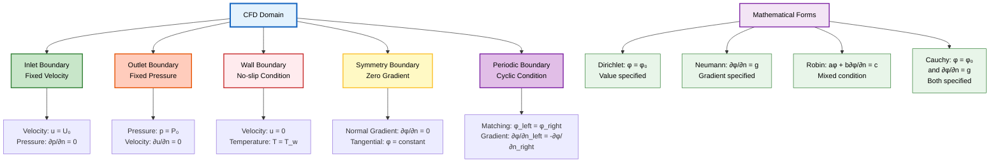
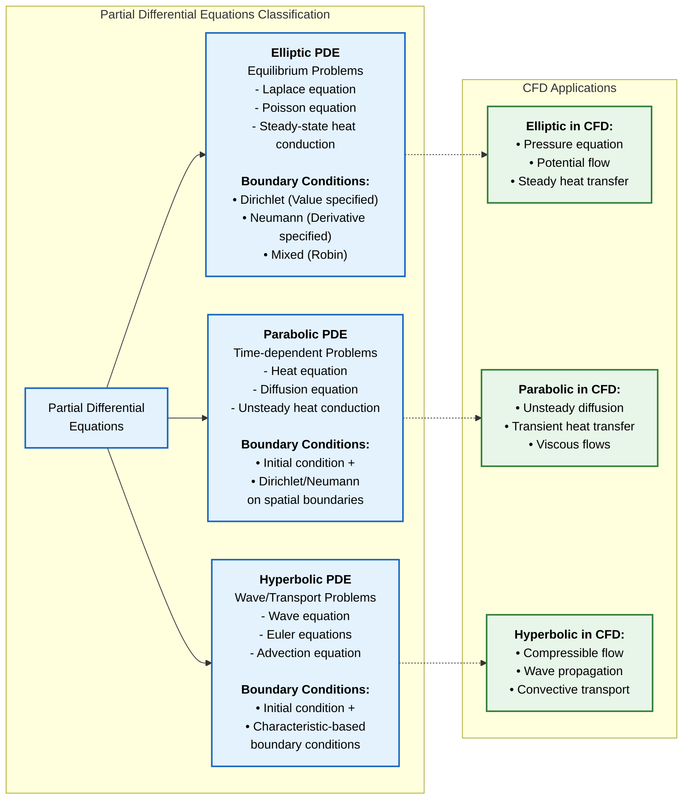
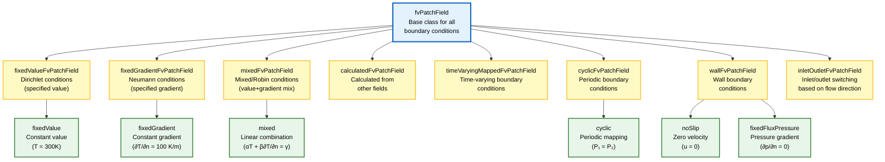

# บทนำ Boundary Condition ใน OpenFOAM

## ความสำคัญของ Boundary Condition

**Boundary Condition** มีความสำคัญอย่างยิ่งในการจำลอง CFD เนื่องจากเป็นตัวกำหนดว่าของไหลมีปฏิสัมพันธ์กับขอบเขตโดเมนอย่างไร

> [!INFO] **Boundary Condition คืออะไร?**
> Boundary Condition เป็นองค์ประกอบพื้นฐานในการจำลองพลศาสตร์ของไหลเชิงคำนวณ (Computational Fluid Dynamics หรือ CFD) ซึ่งกำหนดว่าคุณสมบัติของไหลมีพฤติกรรมอย่างไรที่ขอบเขตทางกายภาพของโดเมนการคำนวณ



### บทบาทหลักของ Boundary Condition

- **การบังคับใช้ข้อจำกัดทางกายภาพ**: เช่น เงื่อนไขไม่ลื่น (no-slip conditions) ที่ผนังแข็ง
- **การระบุแรงขับเคลื่อน**: เช่น การไล่ระดับความดัน (pressure gradients)
- **การรับรองการอนุรักษ์มวล**: ผ่านเงื่อนไขทางเข้า/ออก (inlet/outlet conditions)
- **การสร้างผลเฉลยเอกลักษณ์**: ให้แผนการแยกส่วนเชิงตัวเลขสร้างผลลัพธ์ที่มีความหมายทางกายภาพ

---

## พื้นฐานทางคณิตศาสตร์

ในพลศาสตร์ของไหลเชิงคำนวณ (computational fluid dynamics) **Boundary Condition** เป็นตัวแทนของส่วนต่อประสานทางคณิตศาสตร์ระหว่างโดเมนการคำนวณ (computational domain) กับสภาพแวดล้อมภายนอก

### ปัญหาที่กำหนดไม่ดี (Ill-posed Problems)

หากไม่มีการกำหนด Boundary Condition ที่เหมาะสม การกำหนดสูตรทางคณิตศาสตร์จะไม่สมบูรณ์ นำไปสู่ปัญหาที่กำหนดไม่ดี (ill-posed problems) ซึ่งไม่สามารถหาผลเฉลยที่เป็นเอกลักษณ์ได้

> [!WARNING] **ข้อควรระวัง**
> การกำหนด Boundary Condition มากเกินไป (over-specification) หรือน้อยเกินไป (under-specification) สามารถนำไปสู่ปัญหาความไม่เสถียรเชิงตัวเลข (numerical instability) หรือไม่สามารถหาคำตอบที่ถูกต้องได้

### การจำแนกประเภทสมการเชิงอนุพันธ์ย่อย

พื้นฐานทางคณิตศาสตร์ของ Boundary Condition มาจากการจำแนกประเภทของสมการเชิงอนุพันธ์ย่อย:



#### ระบบไฮเพอร์โบลิก (Hyperbolic Systems)

- **ตัวอย่าง**: สมการ Euler (Euler equations)
- **ทฤษฎีลักษณะเฉพาะ**: กำหนดว่า Boundary Condition ต้องถูกระบุที่ขอบเขตทางเข้า (inflow boundaries)
- **การแพร่กระจาย**: อนุญาตให้ข้อมูลแพร่กระจายออกไปที่ขอบเขตทางออก (outflow boundaries)

#### ระบบพาราโบลิก (Parabolic Systems)

- **ตัวอย่าง**: สมการ Navier-Stokes (Navier-Stokes equations)
- **ข้อกำหนด**: Boundary Condition ต้องถูกระบุบนขอบเขตทั้งหมดของโดเมนการคำนวณ
- **ผลกระทบ**: การเลือกและการนำ Boundary Condition ที่เหมาะสมไปใช้งานมีอิทธิพลพื้นฐานต่อความสมจริงทางกายภาพและความเสถียรเชิงตัวเลข

---

## ประเภทของ Boundary Conditions

### **Dirichlet (Fixed Value)**

**การนิยามทางคณิตศาสตร์:**
$$\phi = \phi_0 \quad \text{บน Boundary} \quad \Gamma_D$$

โดยที่:
- $\phi$ = Field Variable ที่ต้องการกำหนดค่า
- $\phi_0$ = ค่าคงที่หรือฟังก์ชันที่ทราบ
- $\Gamma_D$ = Boundary ที่ใช้ Dirichlet Condition

**ความหมายทางกายภาพ:**
- **เหมาะสำหรับ:** ค่า Field ที่วัดหรือควบคุมได้โดยตรงที่พื้นผิว Boundary
- **ตัวอย่าง:** Velocity Profile ที่ Inlet, อุณหภูมิคงที่บนพื้นผิวร้อน, ค่า Pressure ที่ Outlet

**การนำไปใช้ใน OpenFOAM:**
```cpp
// การใช้งาน Dirichlet Condition ใน OpenFOAM
fixedValue;           // กำหนดค่าคงที่
timeVaryingFixedValue; // ค่าที่ขึ้นกับเวลา
uniformFixedValue;    // นิพจน์ทางคณิตศาสตร์
```

---

### **Neumann (Fixed Gradient)**

**การนิยามทางคณิตศาสตร์:**
$$\frac{\partial \phi}{\partial n} = g_0 \quad \text{บน Boundary} \quad \Gamma_N$$

โดยที่:
- $n$ = ทิศทาง Normal ที่พุ่งออกจาก Boundary
- $g_0$ = ค่า Gradient ที่ระบุ
- $\Gamma_N$ = Boundary ที่ใช้ Neumann Condition

**ความหมายทางกายภาพ:**
- **เหมาะสำหรับ:** Flux ของปริมาณที่ข้าม Boundary เป็นที่ทราบ
- **ตัวอย่าง:** ผนัง Adiabatic ในปัญหา Heat Transfer, ระนาบ Symmetry

**กรณีพิเศษ - ผนัง Adiabatic:**
$$\frac{\partial T}{\partial n} = 0$$
บ่งชี้ว่าไม่มี Heat Flux ผ่าน Boundary

**การนำไปใช้ใน OpenFOAM:**
```cpp
fixedGradient;        // กำหนดค่า Gradient คงที่
zeroGradient;         // Gradient เป็นศูนย์ (กรณีพิเศษ)
```

---

### **Robin (Mixed)**

**การนิยามทางคณิตศาสตร์:**
$$a\phi + b\frac{\partial \phi}{\partial n} = c \quad \text{บน Boundary} \quad \Gamma_R$$

โดยที่:
- $a, b, c$ = ค่าคงที่หรือฟังก์ชันที่ระบุ
- $\Gamma_R$ = Boundary ที่ใช้ Robin Condition

**การประยุกต์ใช้สำคัญ - Newton's Cooling Law:**
$$-k\frac{\partial T}{\partial n} = h(T_s - T_\infty)$$

โดยที่:
- $k$ = Thermal Conductivity
- $h$ = Convective Heat Transfer Coefficient
- $T_s$ = Surface Temperature
- $T_\infty$ = Ambient Fluid Temperature

**การจัดรูปแบบใหม่:**
$$hT + k\frac{\partial T}{\partial n} = hT_\infty$$

**การนำไปใช้ใน OpenFOAM:**
```cpp
mixed;                         // การใช้งานทั่วไป
convectiveHeatTransfer;        // การถ่ายเทความร้อนโดย Convection
```

---

## สมการควบคุมที่เกี่ยวข้อง

Boundary Condition เหล่านี้กำหนดข้อจำกัดที่จำเป็นในการแก้ระบบสมการเชิงอนุพันธ์ย่อยที่ควบคุมการไหลของของไหล:

### สมการหลัก

**สมการความต่อเนื่อง (Continuity Equation):**
$$\nabla \cdot \mathbf{u} = 0$$

**สมการโมเมนตัม (Momentum Equation):**
$$\rho \frac{\partial \mathbf{u}}{\partial t} + \rho (\mathbf{u} \cdot \nabla) \mathbf{u} = -\nabla p + \mu \nabla^2 \mathbf{u} + \mathbf{f}$$

โดยที่:
- $\mathbf{u}$ = **Velocity Vector** (เวกเตอร์ความเร็ว)
- $p$ = **Pressure** (ความดัน)
- $\rho$ = **Density** (ความหนาแน่น)
- $\mu$ = **Dynamic Viscosity** (ความหนืดพลศาสตร์)
- $\mathbf{f}$ = **Body Forces** (แรงภายนอก)

### ความสอดคล้องทางคณิตศาสตร์

การทำงานร่วมกันระหว่าง Boundary Condition ประเภทต่างๆ ต้องได้รับการปรับสมดุลอย่างระมัดระวัง เพื่อรักษาความสอดคล้องทางคณิตศาสตร์ในขณะที่ยังคงแสดงถึงปรากฏการณ์ทางกายภาพที่กำลังศึกษา

---

## การนำไปใช้งานใน OpenFOAM

### ฟีเจอร์หลัก

- **ความยืดหยุ่น**: ช่วยให้สามารถระบุค่า Boundary ได้อย่างยืดหยุ่นผ่านเฟรมเวิร์กพีชคณิตฟิลด์ (field algebra framework)
- **สถาปัตยกรรมโมดูลาร์**: ช่วยให้ผู้ใช้สามารถรวม Boundary Condition ประเภทต่างๆ เข้าด้วยกัน
- **การขยายได้**: ขยายเฟรมเวิร์กที่มีอยู่ผ่านการนำไปใช้งานแบบกำหนดเอง (custom implementations)

### โครงสร้างคลาสใน OpenFOAM

ลำดับชั้นคลาส `fvPatchField` เป็นรากฐานสำหรับการนำ Boundary Condition ประเภทต่างๆ ไปใช้งาน:

```cpp
// โครงสร้างพื้นฐานของ boundary condition ใน OpenFOAM
class fvPatchField
{
    // ฐานคลาสสำหรับ boundary condition ทั้งหมด
};

// ประเภทต่างๆ ที่สืบทอดจาก fvPatchField
class fixedValueFvPatchField;      // Dirichlet conditions
class fixedGradientFvPatchField;   // Neumann conditions
class mixedFvPatchField;           // Mixed conditions
```



### ประเภทของ Boundary Condition ใน OpenFOAM

| ประเภท | คลาส | การใช้งาน | ตัวอย่าง |
|--------|-------|-------------|-----------|
| **Dirichlet** | `fixedValueFvPatchField` | กำหนดค่าคงที่ | อุณหภูมิผนัง, ความเร็วทางเข้า |
| **Neumann** | `fixedGradientFvPatchField` | กำหนดค่ากราดิเอนต์ | การถ่ายเทความร้อน, แรงเฉือน |
| **Mixed** | `mixedFvPatchField` | ผสมระหว่างค่าและกราดิเอนต์ | เงื่อนไขผนังขั้นสูง |
| **Wall Functions** | หลายคลาส | จำลองชั้นขอบเขต | ความปั่นป่วนใกล้ผนัง |

### การนำไปใช้งานจริง

#### ตัวอย่าง Velocity Inlet

```cpp
// 0/U file
dimensions      [0 1 -1 0 0 0 0];
internalField   uniform 0;

boundaryField
{
    inlet
    {
        type            fixedValue;
        value           uniform (10 0 0);  // Uniform inlet velocity of 10 m/s in x-direction
    }

    outlet
    {
        type            zeroGradient;
    }

    walls
    {
        type            noSlip;
    }
}
```

#### ตัวอย่าง Pressure Outlet

```cpp
// 0/p file
dimensions      [1 -1 -2 0 0 0 0];
internalField   uniform 0;

boundaryField
{
    inlet
    {
        type            zeroGradient;
    }

    outlet
    {
        type            fixedValue;
        value           uniform 0;  // Gauge pressure (relative to atmospheric)
    }

    walls
    {
        type            zeroGradient;
    }
}
```

---

## ข้อควรพิจารณาขั้นสูง

### Well-Posedness (Hadamard)

เพื่อให้มั่นใจว่าปัญหามีคำตอบที่ถูกต้อง จำเป็นต้องตรวจสอบ:

1. **มี Solution อยู่**
2. **Solution มีความเฉพาะเจาะจง (Unique)**
3. **Solution ขึ้นอยู่กับ Boundary Data อย่างต่อเนื่อง**

### การจำแนกตามประเภท PDE

| ประเภท PDE | ตัวอย่าง | ข้อกำหนด Boundary Conditions |
|-------------|------------|------------------------------|
| **Elliptic** | Steady-State Diffusion, Potential Flow | Dirichlet หรือ Neumann บน Boundary ทั้งหมด |
| **Parabolic** | Transient Diffusion, Boundary Layer | Initial Conditions + Boundary Conditions |
| **Hyperbolic** | Wave Propagation, Inviscid Flow | Characteristics-Based Boundary Conditions |

---

## บทสรุป

การเข้าใจและการนำ Boundary Conditions ไปใช้งานอย่างถูกต้องเป็นพื้นฐานสำคัญสำหรับการสร้าง CFD Simulations ที่แม่นยำและเชื่อถือได้ใน OpenFOAM

**หลักการสำคัญ:**

1. **การเลือก Boundary Condition ที่เหมาะสม** สำคัญต่อความแม่นยำและความเสถียรของ CFD Simulations

2. **การจำแนกเป็น Dirichlet, Neumann, และ Robin** เป็นกรอบทางคณิตศาสตร์ที่รับประกัน Well-Posed Problems

3. **การประยุกต์ใช้ใน OpenFOAM** ต้องคำนึงถึง Physical Meaning และ Numerical Stability

4. **Boundary Conditions ขั้นสูง** ช่วยแก้ไขปัญหาที่ซับซ้อนใน Multiphysics และ Special Applications

---

> [!TIP] **การเรียนรู้เพิ่มเติม**
> - ดูรายละเอียดเพิ่มเติมเกี่ยวกับ [[02_Fundamental_Classification]]
> - เรียนรู้วิธีการเลือก Boundary Condition ที่เหมาะสมใน [[03_Selection_Guide_Which_BC_to_Use]]
> - ศึกษา [[04_Mathematical_Formulation]] สำหรับความเข้าใจเชิงลึก
