# การจำแนกพื้นฐานของ Boundary Conditions

**Boundary Condition** เป็นองค์ประกอบพื้นฐานในการจำลองพลศาสตร์ของไหลเชิงคำนวณ (Computational Fluid Dynamics) ซึ่งกำหนดว่าคุณสมบัติของไหลมีพฤติกรรมอย่างไรที่ขอบเขตทางกายภาพของโดเมนการคำนวณ

ใน OpenFOAM, Boundary Condition ถูกนำมาใช้ผ่านคลาส Field เฉพาะทางที่สืบทอดมาจากคลาสพื้นฐาน `fvPatchField` ซึ่งเป็นโครงสร้างที่แข็งแกร่งสำหรับการจัดการสถานการณ์ทางกายภาพต่างๆ

---

## ภาพรวมของการจำแนก Boundary Conditions

```mermaid
graph TD
    A["Boundary Condition<br/>ใน OpenFOAM"] --> B["Dirichlet<br/>(Fixed Value)"]
    A --> C["Neumann<br/>(Fixed Gradient)"]
    A --> D["Robin/Mixed<br/>(Linear Combination)"]
    A --> E["Calculated<br/>(Computed)"]
    A --> F["Coupled<br/>(Multi-region)"]

    B --> B1["fixedValue<br/>φ = φ₀"]
    B --> B2["timeVaryingFixedValue<br/>φ = f(t)"]
    B --> B3["uniformFixedValue<br/>φ = constant"]

    C --> C1["fixedGradient<br/>∇φ⋅n = g₀"]
    C --> C2["zeroGradient<br/>∇φ⋅n = 0"]

    D --> D1["mixed<br/>aφ + b∂φ/∂n = c"]
    D --> D2["convectiveHeatTransfer<br/>Newton's Law of Cooling"]

    E --> E1["calculated<br/>Computed from other fields"]
    E --> E2["wallFunction<br/>Turbulence modeling"]

    F --> F1["cyclic<br/>Periodic boundaries"]
    F --> F2["regionCoupled<br/>Conjugate heat transfer"]
    F --> F3["processor<br/>MPI communication"]

    style A fill:#f5f5f5,stroke:#333,stroke-width:3px,color:#000
    style B fill:#e8f5e9,stroke:#2e7d32,stroke-width:2px,color:#000
    style C fill:#e3f2fd,stroke:#1565c0,stroke-width:2px,color:#000
    style D fill:#fff9c4,stroke:#fbc02d,stroke-width:2px,color:#000
    style E fill:#ffebee,stroke:#c62828,stroke-width:2px,color:#000
    style F fill:#f3e5f5,stroke:#7b1fa2,stroke-width:2px,color:#000
```
> **Figure 1:** ภาพรวมของการจำแนกประเภทเงื่อนไขขอบเขตใน OpenFOAM โดยแบ่งออกเป็นกลุ่มหลักตามลักษณะทางคณิตศาสตร์และกายภาพ เช่น Dirichlet, Neumann, Robin และกลุ่มเฉพาะทางสำหรับการคำนวณแบบหลายภูมิภาคและการสื่อสารแบบขนาน


### แนวคิดหลัก

**Dirichlet Boundary Condition** กำหนดค่าของตัวแปร Field โดยตรงที่พื้นผิวขอบเขต ซึ่งเป็นการระบุค่าที่แน่นอนของตัวแปร $\phi$ ที่ Boundary Surface $\partial \Omega$ ของโดเมนการคำนวณ

**วัตถุประสงค์หลัก:**
- ใช้เมื่อทราบพฤติกรรมทางกายภาพที่ขอบเขตล่วงหน้า
- เหมาะสำหรับการกำหนดค่าที่วัดได้จริงหรือข้อกำหนดทางวิศวกรรม
- เป็นเงื่อนไขที่ใช้บ่อยที่สุดใน CFD simulations

### สูตรทางคณิตศาสตร์

$$\phi|_{\partial \Omega} = \phi_0(\mathbf{x}, t)$$

**ตัวแปร:**
- $\phi$ = ตัวแปร Field ที่ต้องการกำหนดค่า
- $\partial \Omega$ = พื้นผิวขอบเขตของโดเมน
- $\phi_0$ = ฟังก์ชันค่าที่กำหนดไว้ล่วงหน้า
- $\mathbf{x}$ = ตำแหน่งในปริภูมิ
- $t$ = เวลา

### ความหมายทางกายภาพ

- **เหมาะสำหรับ:** ค่า Field ที่วัดหรือควบคุมได้โดยตรงที่พื้นผิว Boundary
- **ตัวอย่าง:** Velocity Profile ที่ Inlet, อุณหภูมิคงที่บนพื้นผิวร้อน, ค่า Pressure ที่ Outlet
- **การตีความ:** ขอบเขตทำหน้าที่เป็นแหล่งกำเนิดหรือแหล่งรับที่รักษาระดับตัวแปร Field ไว้ที่ค่าที่กำหนด

### การนำไปใช้ใน OpenFOAM

```cpp
// Usage of Dirichlet Condition in OpenFOAM
// fixedValue;           // Set constant value
// timeVaryingFixedValue; // Time-dependent value
// uniformFixedValue;    // Mathematical expression
```

> **📘 คำอธิบาย (Thai Explanation):**
> **แหล่งที่มา (Source):** Boundary Condition ใน OpenFOAM ถูกนำมาใช้ผ่านคลาส `fixedValueFvPatchField` ซึ่งเป็นส่วนประกอบหลักในการจัดการเงื่อนไขขอบเขตแบบกำหนดค่าตายตัว
> 
> **คำอธิบาย (Explanation):** โค้ดด้านบนแสดงรายการประเภท Boundary Condition แบบ Dirichlet ที่พบได้บ่อยใน OpenFOAM โดยมีการใช้ `//` เพื่อแสดงหมายเหตุว่าแต่ละประเภทมีหน้าที่อย่างไร ซึ่งช่วยให้ผู้ใช้เข้าใจการทำงานของแต่ละประเภท
> 
> **แนวคิดสำคัญ (Key Concepts):**
> - **fixedValue**: ใช้สำหรับกำหนดค่าคงที่ที่ขอบเขต เช่น ความเร็วคงที่ที่ inlet
> - **timeVaryingFixedValue**: ใช้สำหรับค่าที่เปลี่ยนแปลงตามเวลา เช่น โปรไฟล์ความเร็วที่แปรผันตามเวลา
> - **uniformFixedValue**: ใช้สำหรับนิพจน์ทางคณิตศาสตร์ที่ซับซ้อนกว่าการกำหนดค่าคงที่

**ตัวอย่างโค้ด:**

```cpp
// Example 1: Fixed velocity at inlet
boundaryField
{
    inlet
    {
        type            fixedValue;
        value           uniform (10 0 0);  // Constant velocity in x-direction (m/s)
    }
}

// Example 2: Time-varying velocity
boundaryField
{
    inlet
    {
        type            fixedValue;
        value           table
        (
            (0  (0 0 0))
            (1  (5 0 0))
            (5  (10 0 0))
            (10 (10 0 0))
        );
    }
}

// Example 3: Fixed temperature
boundaryField
{
    hotWall
    {
        type            fixedValue;
        value           uniform 373.15; // Temperature in Kelvin
    }
}
```

> **📘 คำอธิบาย (Thai Explanation):**
> **แหล่งที่มา (Source):** ตัวอย่างโค้ดนี้แสดงการใช้งาน `fixedValueFvPatchField` ในสถานการณ์ต่าง ๆ ที่พบได้ทั่วไปในการจำลอง CFD
> 
> **คำอธิบาย (Explanation):** 
> - **Example 1**: แสดงการกำหนดความเร็วคงที่ 10 m/s ในทิศทาง x ที่ขอบเขต inlet โดยใช้ `uniform (10 0 0)` ซึ่งแทนเวกเตอร์ความเร็วในสามมิติ
> - **Example 2**: แสดงการกำหนดความเร็วที่เปลี่ยนแปลงตามเวลาผ่านตาราง (table) โดยระบุค่าที่เวลาต่าง ๆ ซึ่ง OpenFOAM จะทำการ interpolation ระหว่างจุดข้อมูล
> - **Example 3**: แสดงการกำหนดอุณหภูมิคงที่ 373.15 K (100°C) ที่พื้นผิวผนังร้อน
> 
> **แนวคิดสำคัญ (Key Concepts):**
> - **uniform keyword**: ใช้สำหรับระบุค่าที่เหมือนกันทุกพื้นที่บน patch นั้น ๆ
> - **table format**: รองรับการกำหนดค่าที่เปลี่ยนแปลงตามเวลาผ่าน linear interpolation
> - **vector notation**: ใช้รูปแบบ `(x y z)` สำหรับค่าเวกเตอร์ และค่าเดียวสำหรับ scalar fields

### ตัวอย่างการประยุกต์ใช้

| กรณีศึกษา | สมการ | คำอธิบาย |
|-------------|---------|-----------|
| **Velocity Inlets** | $\mathbf{u} = \mathbf{u}_{\text{inlet}}(\mathbf{x}, t)$ | โปรไฟล์ความเร็วขาเข้าที่ทราบจากการทดลอง |
| **Temperature Boundaries** | $T = T_{\text{wall}}$ | อุณหภูมิผนังคงที่สำหรับพื้นผิว Isothermal |
| **Pressure Outlets** | $p = p_{\text{ambient}}$ | ความดันขาออกเท่ากับสภาวะแวดล้อม |

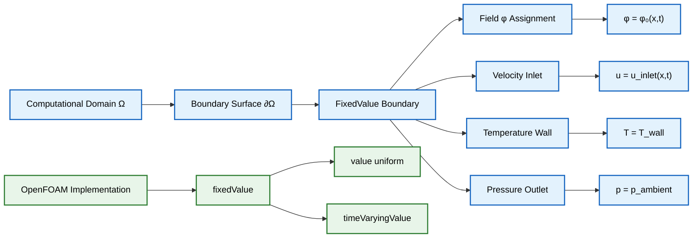
> **Figure 2:** การนำเงื่อนไขขอบเขตแบบกำหนดค่าตายตัว (Dirichlet) ไปใช้งานใน OpenFOAM โดยกำหนดค่าตัวแปรสนามที่ขอบเขตโดยตรง เพื่อจำลองสถานการณ์ที่มีค่าทางกายภาพที่ทราบแน่นอน เช่น ความเร็วขาเข้าหรืออุณหภูมิที่ผนัง


### แนวคิดหลัก

**Neumann Boundary Condition** กำหนด Normal Derivative ของตัวแปร Field ที่ขอบเขต ซึ่งเป็นการกำหนด Flux ของปริมาณที่ผ่านพื้นผิวขอบเขต

**ความสำคัญ:**
- เหมาะสำหรับปัญหาการถ่ายเทความร้อน การขนส่งมวล และการวิเคราะห์ความเค้น
- เงื่อนไข Flux มักถูกกำหนดได้ง่ายกว่าค่าตัวแปร
- ใช้เมื่อทราบอัตราการเปลี่ยนแปลงของปริมาณที่ข้ามขอบเขต

### สูตรทางคณิตศาสตร์

$$\frac{\partial \phi}{\partial n}\bigg|_{\partial \Omega} = \mathbf{n} \cdot \nabla \phi = g_0(\mathbf{x}, t)$$

**ตัวแปร:**
- $\mathbf{n}$ = เวกเตอร์ Normal หน่วยที่ชี้ออกด้านนอก
- $g_0$ = Normal Gradient ที่กำหนดไว้
- $\nabla \phi$ = เกรเดียนต์ของ Field
- $\frac{\partial}{\partial n}$ = อนุพันธ์ในทิศทาง Normal

### ความหมายทางกายภาพ

- **เหมาะสำหรับ:** Flux ของปริมาณที่ข้าม Boundary เป็นที่ทราบ
- **ตัวอย่าง:** ผนัง Adiabatic ในปัญหา Heat Transfer, ระนาบ Symmetry
- **การตีความ:** การควบคุมอัตราการเปลี่ยนแปลงของตัวแปร Field ในทิศทาง Normal ไปยังขอบเขต

### กรณีพิเศษ - ผนัง Adiabatic

$$\frac{\partial T}{\partial n} = 0$$

บ่งชี้ว่าไม่มี Heat Flux ผ่าน Boundary (เงื่อนไข Zero Gradient)

### การนำไปใช้ใน OpenFOAM

```cpp
// Usage of Neumann Condition in OpenFOAM
// fixedGradient;        // Set constant gradient value
// zeroGradient;         // Zero gradient (special case)
```

> **📘 คำอธิบาย (Thai Explanation):**
> **แหล่งที่มา (Source):** Neumann Boundary Condition ใน OpenFOAM ถูกนำมาใช้ผ่านคลาส `fixedGradientFvPatchField` และ `zeroGradientFvPatchField` ซึ่งเป็นคลาสหลักในการจัดการเงื่อนไขขอบเขตแบบกำหนด Gradient
> 
> **คำอธิบาย (Explanation):** โค้ดด้านบนแสดงประเภท Boundary Condition แบบ Neumann ที่ใช้บ่อยใน OpenFOAM โดย `fixedGradient` ใช้สำหรับกำหนดค่า Gradient ที่ไม่เป็นศูนย์ และ `zeroGradient` เป็นกรณีพิเศษที่ Gradient เป็นศูนย์ ซึ่งแสดงถึงการไม่มี Flux ผ่านขอบเขต
> 
> **แนวคิดสำคัญ (Key Concepts):**
> - **fixedGradient**: ใช้เมื่อทราบค่า Flux ที่ผ่านขอบเขต เช่น Heat Flux ที่ผนัง
> - **zeroGradient**: ใช้เมื่อไม่มี Flux ผ่านขอบเขต เช่น ผนัง Adiabatic หรือ Flow ที่พัฒนาเต็มที่
> - **Flux conservation**: Neumann condition รักษาความต่อเนื่องของ Flux ที่ขอบเขต

**ตัวอย่างโค้ด:**

```cpp
// Example 1: Zero gradient at outlet (fully developed flow)
boundaryField
{
    outlet
    {
        type            zeroGradient;
    }
}

// Example 2: Fixed heat flux
boundaryField
{
    heatedWall
    {
        type            fixedGradient;
        gradient        uniform -1000; // W/m² (negative for heat into domain)
    }
}

// Example 3: Adiabatic wall
boundaryField
{
    adiabaticWall
    {
        type            fixedGradient;
        gradient        uniform 0; // No heat flux
    }
}
```

> **📘 คำอธิบาย (Thai Explanation):**
> **แหล่งที่มา (Source):** ตัวอย่างโค้ดนี้แสดงการใช้งาน `fixedGradientFvPatchField` และ `zeroGradientFvPatchField` ในสถานการณ์จริงที่พบได้บ่อยในการจำลอง CFD และ Heat Transfer
> 
> **คำอธิบาย (Explanation):** 
> - **Example 1**: แสดงการใช้ `zeroGradient` ที่ outlet ซึ่งเป็นเงื่อนไขทั่วไปสำหรับ flow ที่พัฒนาเต็มที่ (fully developed flow) โดยไม่ต้องระบุค่าใด ๆ เพิ่มเติม
> - **Example 2**: แสดงการกำหนด Heat Flux คงที่ -1000 W/m² ที่ผนังที่ถ่ายความร้อน โดยค่าลบแสดงว่าความร้อนไหลเข้าสู่โดเมน
> - **Example 3**: แสดงการกำหนดผนัง Adiabatic (ฉนวนความร้อน) โดยกำหนด Gradient เป็น 0 ซึ่งหมายถึงไม่มี Heat Flux ผ่านผนัง
> 
> **แนวคิดสำคัญ (Key Concepts):**
> - **Gradient sign convention**: ค่าลบหมายถึง Flux ไหลเข้าสู่โดเมน ค่าบวกหมายถึง Flux ไหลออกจากโดเมน
> - **Zero gradient assumption**: สมมติฐานว่า field variable มีค่าคงที่ในทิศทาง normal ที่ขอบเขต
> - **Units consistency**: ต้องระวังหน่วยของ gradient ซึ่งขึ้นอยู่กับประเภทของ field (เช่น K/m สำหรับ temperature, m/s² สำหรับ velocity)

### ตัวอย่างการประยุกต์ใช้

| กรณีศึกษา | สมการ | คำอธิบาย |
|-------------|---------|-----------|
| **Adiabatic Walls** | $\frac{\partial T}{\partial n} = 0$ | ขอบเขตหุ้มฉนวน ไม่มี Heat Flux |
| **Symmetry Planes** | $\frac{\partial \phi}{\partial n} = 0$ | สมมาตรแบบกระจกใน Flow Field |
| **Specified Heat Flux** | $-k \frac{\partial T}{\partial n} = q''_{\text{wall}}$ | Heat Flux ที่ทราบค่า |
| **Free-slip Walls** | $\frac{\partial u_t}{\partial n} = 0$ | การไหลตามผนังโดยไม่มีแรงต้านความหนืด |
| **Fully Developed Flow** | $\frac{\partial \mathbf{u}}{\partial n} = 0$ | Flow พัฒนาเต็มที่ที่ Outlet |

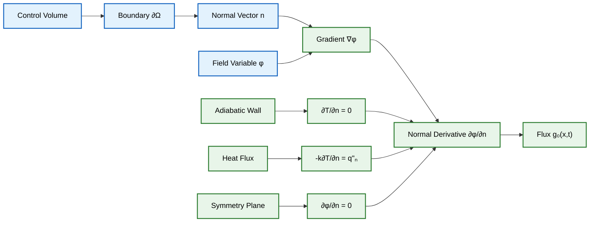
> **Figure 3:** การนำเงื่อนไขขอบเขตแบบกำหนดเกรเดียนต์ตายตัว (Neumann) ไปใช้งาน แสดงการควบคุมฟลักซ์ที่ผ่านขอบเขตโดยการกำหนดอัตราการเปลี่ยนแปลงของตัวแปรในทิศทางแนวฉาก เช่น ผนังที่เป็นฉนวนความร้อนหรือระนาบสมมาตร


### แนวคิดหลัก

**Mixed Boundary Conditions** หรือที่เรียกว่า **Robin Boundary Conditions** แสดงถึงการรวมกันของ Dirichlet และ Neumann conditions โดยเชื่อมโยงค่า Field กับ Normal Derivative

**ข้อดี:**
- ให้การแสดงปรากฏการณ์ Boundary ทางกายภาพที่สมจริงยิ่งขึ้น
- เหมาะสำหรับการถ่ายเทความร้อนแบบพาความร้อนและผลกระทบจากแรงเสียดทาน
- สามารถปรับสมดุลระหว่างค่าและ Gradient ได้

### สูตรทางคณิตศาสตร์

$$a \phi + b \frac{\partial \phi}{\partial n} = c$$

**ตัวแปร:**
- $a, b, c$ = ค่าคงที่หรือฟังก์ชันของตำแหน่งและเวลา
- $\phi$ = ตัวแปร Field
- $\frac{\partial \phi}{\partial n}$ = Normal Derivative

**ลักษณะพิเศษ:**
- เมื่อ $b = 0$ → Pure Dirichlet Condition
- เมื่อ $a = 0$ → Pure Neumann Condition
- เมื่อ $a, b \neq 0$ → Mixed Condition

### การประยุกต์ใช้สำคัญ - Newton's Cooling Law

$$-k\frac{\partial T}{\partial n} = h(T_s - T_\infty)$$

**ตัวแปร:**
- $k$ = Thermal Conductivity
- $h$ = Convective Heat Transfer Coefficient
- $T_s$ = Surface Temperature
- $T_\infty$ = Ambient Fluid Temperature

**การจัดรูปแบบใหม่:**
$$hT + k\frac{\partial T}{\partial n} = hT_\infty$$

ซึ่งอยู่ในรูปแบบ Robin: $a = h$, $b = k$, $c = hT_\infty$

### การนำไปใช้ใน OpenFOAM

```cpp
// Usage of Mixed Condition in OpenFOAM
// mixed;                         // General usage
// convectiveHeatTransfer;        // Convective heat transfer
```

> **📘 คำอธิบาย (Thai Explanation):**
> **แหล่งที่มา (Source):** Mixed (Robin) Boundary Condition ใน OpenFOAM ถูกนำมาใช้ผ่านคลาส `mixedFvPatchField` ซึ่งเป็นคลาสหลักในการจัดการเงื่อนไขขอบเขตแบบผสมระหว่าง Dirichlet และ Neumann
> 
> **คำอธิบาย (Explanation):** โค้ดด้านบนแสดงประเภท Boundary Condition แบบ Mixed ที่ใช้ใน OpenFOAM โดย `mixed` เป็นการใช้งานทั่วไปที่ต้องกำหนดค่าน้ำหนัก (weighting factor) ระหว่างค่าและ gradient และ `convectiveHeatTransfer` เป็นกรณีเฉพาะสำหรับการถ่ายเทความร้อนแบบพา
> 
> **แนวคิดสำคัญ (Key Concepts):**
> - **Linear combination**: Mixed condition เป็นการรวมกันเชิงเส้นของ Dirichlet และ Neumann conditions
> - **Weighting factor**: ค่า `valueFraction` ควบคุมน้ำหนักระหว่างค่าและ gradient (0 = pure Neumann, 1 = pure Dirichlet)
> - **Physical realism**: ให้การแสดงปรากฏการณ์ทางกายภาพที่สมจริงยิ่งขึ้น เช่น การถ่ายเทความร้อนแบบพา

**ตัวอย่างโค้ด:**

```cpp
// Example 1: General mixed condition
boundaryField
{
    convectiveWall
    {
        type            mixed;
        refGradient     uniform 0;
        refValue        uniform 300;
        valueFraction   uniform 0.5; // Weighting factor (0 = gradient, 1 = value)
    }
}

// Example 2: Convective heat transfer
boundaryField
{
    externalWall
    {
        type            externalWallHeatFlux;
        mode            coefficient;
        h               uniform 10.0;      // Convective heat transfer coefficient
        Ta              uniform 293.15;    // Ambient temperature
        kappa           none;              // Use solid thermal conductivity
    }
}

// Example 3: Mixed value (Robin condition)
boundaryField
{
    mixedBoundary
    {
        type            mixedValueFvPatchField<scalar>;
        value           uniform 300;     // Initial value
        refValue        uniform 293;    // Reference value
        refGradient     uniform 0;      // Reference gradient
        valueFraction   uniform 0.5;    // Weight between value and gradient
    }
}
```

> **📘 คำอธิบาย (Thai Explanation):**
> **แหล่งที่มา (Source):** ตัวอย่างโค้ดนี้แสดงการใช้งาน `mixedFvPatchField` และ `externalWallHeatFlux` ในสถานการณ์จริงของการถ่ายเทความร้อนแบบพาและเงื่อนไขแบบผสม
> 
> **คำอธิบาย (Explanation):** 
> - **Example 1**: แสดงการใช้ `mixed` condition ทั่วไป โดยกำหนด `valueFraction = 0.5` ซึ่งหมายถึงการถ่วงน้ำหนักเท่า ๆ กันระหว่างค่า (`refValue = 300`) และ gradient (`refGradient = 0`)
> - **Example 2**: แสดงการใช้ `externalWallHeatFlux` สำหรับการถ่ายเทความร้อนแบบพา โดยระบุค่าสัมประสิทธิ์การถ่ายเทความร้อน `h = 10.0 W/(m²·K)` และอุณหภูมิแวดล้อม `Ta = 293.15 K`
> - **Example 3**: แสดงการใช้ `mixedValueFvPatchField` ซึ่งเป็น template class สำหรับ scalar fields โดยกำหนดค่าเริ่มต้น ค่าอ้างอิง และ gradient อ้างอิง
> 
> **แนวคิดสำคัญ (Key Concepts):**
> - **valueFraction parameter**: ควบคุมน้ำหนักระหว่าง Dirichlet (1) และ Neumann (0) components
> - **refGradient**: Gradient อ้างอิงที่ใช้เมื่อ valueFraction < 1
> - **refValue**: ค่าอ้างอิงที่ใช้เมื่อ valueFraction > 0
> - **Convective heat transfer**: ใช้สมการ Newton's Law of Cooling: q = h(T_s - T_∞)

**พารามิเตอร์ `valueFraction` ควบคุมการถ่วงน้ำหนัก:**
- `valueFraction = 1`: Dirichlet Condition บริสุทธิ์
- `valueFraction = 0`: Neumann Condition บริสุทธิ์
- `0 < valueFraction < 1`: Mixed Condition

### ตัวอย่างการประยุกต์ใช้

| กรณีศึกษา | สมการ | คำอธิบาย |
|-------------|---------|-----------|
| **Convective Heat Transfer** | $h(T_{\text{wall}} - T_{\infty}) = -k \frac{\partial T}{\partial n}$ | $h$ = Convective Heat Transfer Coefficient |
| **Wall Function Formulations** | $u_\tau^2 = \nu_t \frac{\partial u}{\partial n}$ | Wall Shear Stress เกี่ยวข้องกับ Velocity Gradient |
| **Porosity and Permeability** | $\alpha \phi + \beta \frac{\partial \phi}{\partial n} = \gamma$ | การไหลผ่านตัวกลางที่มีรูพรุน |
| **Radiation Boundary** | $\frac{\partial T}{\partial n} + \sigma \epsilon (T^4 - T_{\infty}^4) = 0$ | รวมผลกระทบ Conduction และ Radiation |

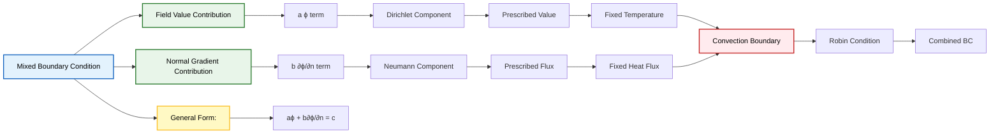
> **Figure 4:** ส่วนประกอบและการกำหนดรูปแบบของเงื่อนไขขอบเขตแบบผสม (Robin) ซึ่งรวมผลของทั้งค่าตัวแปรและเกรเดียนต์เข้าด้วยกัน เพื่อให้ได้การแสดงพฤติกรรมทางกายภาพที่สมจริงยิ่งขึ้น เช่น ในการถ่ายโอนความร้อนแบบพา


### แนวคิดหลัก

**Calculated Boundary Condition** คำนวณค่าโดยอิงจากผลลัพธ์ของ Field อื่นๆ หรือความสัมพันธ์ทางกายภาพ สิ่งเหล่านี้เป็นแบบไดนามิกและจะอัปเดตระหว่างการจำลองโดยอิงจากสถานะปัจจุบันของตัวแปรอื่นๆ

### Wall Functions for Turbulence

**Wall Function** เป็นตัวเชื่อมช่องว่างระหว่างทฤษฎี Turbulence ที่ถูกจำกัดด้วยผนังและข้อจำกัดของ Computational Mesh

**กฎ Logarithmic Law of the Wall:**

$$u^+ = \frac{1}{\kappa} \ln(y^+) + B$$

**ตัวแปร:**
- $u^+ = \frac{u}{u_\tau}$ = ความเร็วไร้มิติ
- $y^+ = \frac{y u_\tau}{\nu}$ = ระยะห่างจากผนังไร้มิติ
- $u_\tau = \sqrt{\frac{\tau_w}{\rho}}$ = ความเร็วเสียดทาน (friction velocity)
- $\kappa \approx 0.41$ = ค่าคงที่ von Kármán
- $B \approx 5.2$ = ค่าคงที่เชิงประจักษ์

**การนำไปใช้ใน OpenFOAM:**

```cpp
// k-epsilon model
boundaryField
{
    wall
    {
        type            kqRWallFunction; // For turbulent kinetic energy k
        value           uniform 0.1;
    }

    wall
    {
        type            epsilonWallFunction; // For turbulent dissipation epsilon
        value           uniform 0.01;
    }
}

// k-omega model
boundaryField
{
    wall
    {
        type            omegaWallFunction; // For specific dissipation rate omega
        value           uniform 1000;
    }
}

// Nut (turbulent viscosity)
boundaryField
{
    wall
    {
        type            nutkWallFunction;
        value           uniform 0;
        Cmu             0.09;
        kappa           0.41;
        E               9.8;
    }
}
```

> **📘 คำอธิบาย (Thai Explanation):**
> **แหล่งที่มา (Source):** Wall Functions ใน OpenFOAM ถูกนำมาใช้ผ่านคลาส `kqRWallFunction`, `epsilonWallFunction`, `omegaWallFunction` และ `nutkWallFunction` ซึ่งเป็นคลาสหลักในการจัดการเงื่อนไขขอบเขตสำหรับ Turbulence Modeling ใกล้ผนัง
> 
> **คำอธิบาย (Explanation):** โค้ดด้านบนแสดงการใช้ Wall Functions สำหรับ Turbulence Models ที่แตกต่างกัน:
> - **k-epsilon model**: ใช้ `kqRWallFunction` สำหรับ turbulent kinetic energy (k) และ `epsilonWallFunction` สำหรับ turbulent dissipation (ε)
> - **k-omega model**: ใช้ `omegaWallFunction` สำหรับ specific dissipation rate (ω)
> - **Turbulent viscosity**: ใช้ `nutkWallFunction` สำหรับ turbulent viscosity (ν_t) โดยระบุค่าคงที่ Cμ, κ, และ E
> 
> **แนวคิดสำคัญ (Key Concepts):**
> - **y+ requirement**: Wall functions ต้องการ y+ ระหว่าง 30-300 สำหรับ k-ε และ 11-300 สำหรับ k-ω
> - **Log-law region**: สมมติว่า cell แรกอยู่ใน log-law region ไม่ใช่ viscous sublayer
> - **Model constants**: ค่า Cμ = 0.09, κ = 0.41 (von Kármán), E = 9.8 คือค่ามาตรฐานสำหรับ equilibrium boundary layers

**Wall Function มาตรฐานสำหรับ Turbulent Kinetic Energy:**
$$k_w = \frac{u_\tau^2}{\sqrt{C_\mu}}$$

- $k_w$ = Turbulent kinetic energy at wall
- $u_\tau$ = Friction velocity
- $C_\mu$ = Model constant (typically 0.09)

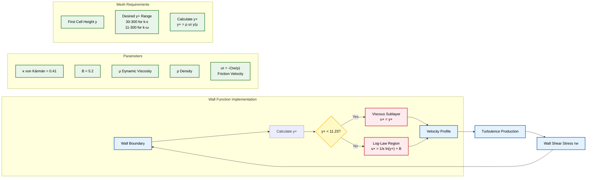
> **Figure 5:** การนำ Wall Function ไปใช้งานเพื่อจัดการความปั่นป่วนใกล้ผนัง โดยอธิบายความสัมพันธ์ระหว่างค่า $y^+$ และโครงสร้างของชั้นขอบเขต (Viscous sublayer และ Log-law region) เพื่อความแม่นยำในการคำนวณแรงเค้นเฉือนที่ผนัง


### ทฤษฎีพื้นฐานของ PDEs

สำหรับ PDE ทั่วไปในรูปแบบ:
$$\mathcal{L}(\phi) = f \quad \text{in} \quad \Omega$$

**ตัวแปร:**
- $\mathcal{L}$ = Differential Operator
- $\phi$ = Field Variable
- $f$ = Source Term
- $\Omega$ = Computational Domain

### เงื่อนไข Well-Posedness (Hadamard)

ปัญหาทางคณิตศาสตร์จะเป็น Well-Posed หาก:

1. **มี Solution อยู่** (Existence)
2. **Solution มีความเฉพาะเจาะจง** (Uniqueness)
3. **Solution ขึ้นอยู่กับ Boundary Data อย่างต่อเนื่อง** (Stability)

### การจำแนกตามประเภท PDE

| ประเภท PDE | ตัวอย่าง | ข้อกำหนด Boundary Conditions |
|-------------|------------|------------------------------|
| **Elliptic** | Steady-State Diffusion, Potential Flow, Laplace equation | Dirichlet หรือ Neumann บน Boundary ทั้งหมด |
| **Parabolic** | Transient Diffusion, Boundary Layer, Heat equation | Initial Conditions + Boundary Conditions |
| **Hyperbolic** | Wave Propagation, Inviscid Flow, Euler equations | Characteristics-Based Boundary Conditions |

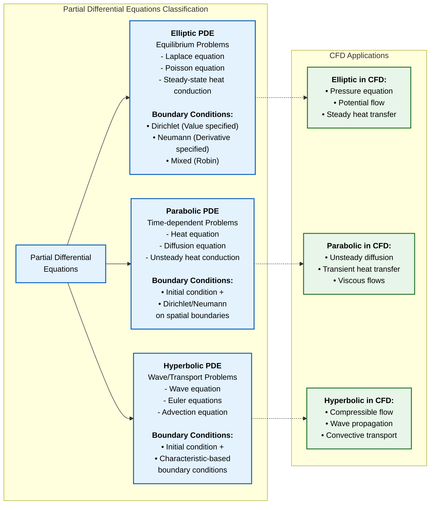
> **Figure 6:** การจำแนกประเภทของสมการเชิงอนุพันธ์ย่อย (PDE) และการประยุกต์ใช้ใน CFD โดยแบ่งตามลักษณะทางคณิตศาสตร์ (Elliptic, Parabolic, Hyperbolic) ซึ่งเป็นตัวกำหนดความต้องการเงื่อนไขขอบเขตที่แตกต่างกัน


ใน Finite Volume Framework ของ OpenFOAM, Boundary Conditions ถูกนำไปใช้ผ่าน Class Hierarchy `fvPatchField`:

#### ฟังก์ชันหลัก

1. **`updateCoeffs()`**: อัปเดต Boundary Condition Coefficients
2. **`evaluate()`**: กำหนดค่า Boundary Face โดยตรง
3. **`valueInternalCoeffs()`**: การมีส่วนร่วมของ Internal Coefficient
4. **`valueBoundaryCoeffs()`**: การมีส่วนร่วมของ Boundary Coefficient
5. **`snGrad()`**: คำนวณ Surface Normal Gradient

#### การแปลงสู่ Discretized System

```cpp
// Dirichlet Implementation
// Set Diagonal Coefficient to large value + Source Term
// a_P → ∞ (large value), S_U → φ_boundary × a_P

// Neumann Implementation
// Incorporate Gradient directly into Flux calculation
// Flux_b = -Γ × (∂φ/∂n)_b × A_b

// Robin Implementation
// Link between Value and Gradient
// a φ_b + b (∂φ/∂n)_b = c
```

> **📘 คำอธิบาย (Thai Explanation):**
> **แหล่งที่มา (Source):** การแปลง Boundary Conditions เป็น Discretized System ใน OpenFOAM ถูกจัดการผ่านคลาส `fvPatchField` ซึ่งเป็นคลาสพื้นฐานสำหรับ Finite Volume Method
> 
> **คำอธิบาย (Explanation):** โค้ดด้านบนแสดงหลักการแปลง Boundary Conditions แต่ละประเภทเป็นรูปแบบ Discretized:
> - **Dirichlet**: กำหนดค่าสัมประสิทธิ์ในเมตริกซ์ให้มีค่ามาก ๆ และเพิ่ม Source Term เพื่อบังคับค่าที่ขอบเขต
> - **Neumann**: รวม Gradient เข้าไปในการคำนวณ Flux โดยตรง โดยไม่ต้องแก้ไขเมตริกซ์
> - **Robin**: เชื่อมโยงระหว่างค่าและ Gradient ผ่านสมการเชิงเส้น
> 
> **แนวคิดสำคัญ (Key Concepts):**
> - **Matrix assembly**: Boundary conditions ถูกรวมเข้าในระบบสมการเชิงเส้น Ax = b
> - **Flux calculation**: สำหรับ Neumann conditions คำนวณ Flux โดยตรงจาก Gradient
> - **Large penalty method**: สำหรับ Dirichlet conditions ใช้ค่าสัมประสิทธิ์มาก ๆ เพื่อบังคับค่า

#### โครงสร้างคลาส

```cpp
template<class Type>
class fvPatchField
:
    public Field<Type>,
    public fvPatch
{
public:
    // Virtual functions for boundary condition evaluation
    virtual void updateCoeffs() = 0;
    virtual void evaluate(const Pstream::commsTypes commsType) = 0;
    virtual tmp<Field<Type>> snGrad() const = 0;
    virtual tmp<Field<Type>> valueInternalCoeffs(
        const tmp<scalarField>&) const = 0;
    virtual tmp<Field<Type>> valueBoundaryCoeffs(
        const tmp<scalarField>&) const = 0;
};
```

> **📘 คำอธิบาย (Thai Explanation):**
> **แหล่งที่มา (Source):** โครงสร้างคลาส `fvPatchField` ใน OpenFOAM ถูกนิยามในไฟล์ `fvPatchField.H` ซึ่งเป็นคลาสพื้นฐานสำหรับ Finite Volume Patch Fields
> 
> **คำอธิบาย (Explanation):** โค้ดด้านบนแสดงโครงสร้างของคลาส `fvPatchField` ซึ่งเป็น abstract base class สำหรับ boundary conditions ใน OpenFOAM:
> - **Inheritance**: สืบทอดจาก `Field<Type>` และ `fvPatch` เพื่อให้มีความสามารถทั้งในการจัดการ field data และ patch information
> - **Virtual functions**: ฟังก์ชันเสมือนทั้งหมดต้องถูก implement ใน derived classes
> - **updateCoeffs()**: อัปเดตสัมประสิทธิ์สำหรับ boundary condition
> - **evaluate()**: คำนวณค่าที่ boundary faces
> - **snGrad()**: คำนวณ surface normal gradient
> - **valueInternalCoeffs/valueBoundaryCoeffs**: คำนวณสัมประสิทธิ์สำหรับการประกอบเมตริกซ์
> 
> **แนวคิดสำคัญ (Key Concepts):**
> - **Template class**: รองรับทั้ง scalar, vector, และ tensor fields
> - **Pure virtual functions**: บังคับให้ทุก derived class ต้อง implement ฟังก์ชันเหล่านี้
> - **Polymorphism**: ช่วยให้สามารถใช้ boundary conditions ที่แตกต่างกันผ่าน interface เดียวกัน

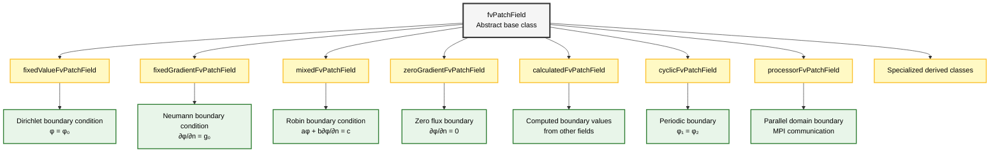
> **Figure 7:** ลำดับชั้นของคลาสสำหรับเงื่อนไขขอบเขตใน OpenFOAM แสดงการสืบทอดจากคลาสฐาน `fvPatchField` ไปยังคลาสเฉพาะทางประเภทต่าง ๆ ที่รองรับความต้องการทางคณิตศาสตร์และกายภาพที่หลากหลาย


OpenFOAM ใช้กลไกการเลือกขณะรันไทม์ที่ช่วยให้สามารถระบุ Boundary Condition ในไฟล์ Dictionary ได้โดยไม่ต้องคอมไพล์โค้ดใหม่:

```cpp
// Runtime selection table registration
addToRunTimeSelectionTable
(
    fvPatchScalarField,
    fixedValueFvPatchField,
    dictionary
);
```

> **📘 คำอธิบาย (Thai Explanation):**
> **แหล่งที่มา (Source):** กลไก Runtime Selection ใน OpenFOAM ถูกนำมาใช้ผ่าน macro `addToRunTimeSelectionTable` ซึ่งเป็นส่วนสำคัญของระบบ plugin ของ OpenFOAM
> 
> **คำอธิบาย (Explanation):** โค้ดด้านบนแสดงการลงทะเบียนคลาส `fixedValueFvPatchField` ใน Runtime Selection Table:
> - **Macro registration**: ใช้ macro `addToRunTimeSelectionTable` เพื่อลงทะเบียนคลาสในตารางการเลือกขณะรันไทม์
> - **Base class**: ระบุคลาสฐาน `fvPatchScalarField` ที่เป็นประเภทของ field
> - **Derived class**: ระบุคลาสที่จะลงทะเบียน `fixedValueFvPatchField`
> - **Constructor type**: ระบุประเภทของ constructor ที่รองรับ (ในที่นี้คือ `dictionary`)
> 
> **แนวคิดสำคัญ (Key Concepts):**
> - **Runtime selection**: ช่วยให้สามารถเลือก boundary condition ผ่านไฟล์ dictionary โดยไม่ต้องคอมไพล์ใหม่
> - **Factory pattern**: ใช้ design pattern แบบ Factory ในการสร้าง object
> - **Type safety**: รองรับทั้ง scalar, vector, และ tensor fields ผ่าน template classes

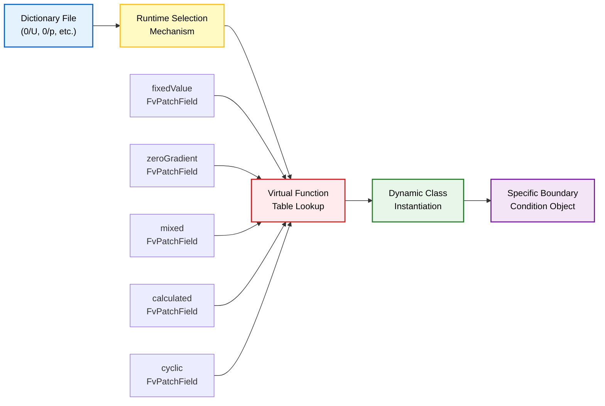
> **Figure 8:** กลไกการเลือกเงื่อนไขขอบเขตขณะรันไทม์ (Runtime Selection) ช่วยให้ผู้ใช้สามารถระบุประเภทของเงื่อนไขขอบเขตในไฟล์ Dictionary ได้อย่างยืดหยุ่นโดยไม่ต้องคอมไพล์โค้ดใหม่

- **การเลือกแบบไดนามิก (Dynamic selection)**: Boundary Condition สามารถเปลี่ยนแปลงได้ขณะรันไทม์
- **ความสามารถในการขยาย (Extensibility)**: สามารถเพิ่ม Boundary Condition ใหม่ได้โดยไม่ต้องแก้ไขโค้ดที่มีอยู่
- **ความยืดหยุ่นของผู้ใช้ (User flexibility)**: พารามิเตอร์การจำลองสามารถแก้ไขได้ผ่านไฟล์ข้อความ

---

## การประยุกต์ใช้และตัวอย่างในทางปฏิบัติ

### Velocity Boundary Conditions

| Type | OpenFOAM Implementation | การนิยาม | สถานการณ์การใช้งาน |
|------|------------------------|-------------|-------------------|
| **Inlet** | `fixedValue` | $\mathbf{u} = \mathbf{u}_{inlet}(y,z,t)$ | การระบุ Velocity Profile ที่ทางเข้า |
| **Outlet** | `zeroGradient` | $\frac{\partial \mathbf{u}}{\partial n} = 0$ | Flow พัฒนาเต็มที่ |
| **Wall** | `noSlip` | $\mathbf{u} = 0$ | ผนังไม่สลิป |
| **Symmetry** | `symmetryPlane` | $\mathbf{u} \cdot \mathbf{n} = 0$, $\frac{\partial \mathbf{u}_t}{\partial n} = 0$ | ระนาบสมมาตร |
| **Slip** | `slip` | $\mathbf{u} \cdot \mathbf{n} = 0$, $\frac{\partial \mathbf{u}_t}{\partial n} = 0$ | ผนังไม่มีแรงเสียดทาน |
| **Pressure Inlet/Outlet** | `pressureInletOutletVelocity` | Calculated from flux | Boundary ที่มี Flow Reversal |

### Pressure Boundary Conditions

| Type | OpenFOAM Implementation | การนิยาม | สถานการณ์การใช้งาน |
|------|------------------------|-------------|-------------------|
| **Fixed pressure** | `fixedValue` | $p = p_{ref}$ | ระบุค่า Pressure อ้างอิง |
| **Open boundary** | `zeroGradient` | $\frac{\partial p}{\partial n} = 0$ | ขอบเขตเปิด |
| **Wave boundary** | `waveTransmissive` | Non-Reflecting Condition | Acoustics, Wave Propagation |

### Thermal Boundary Conditions

| Type | OpenFOAM Implementation | การนิยาม | สถานการณ์การใช้งาน |
|------|------------------------|-------------|-------------------|
| **Fixed temperature** | `fixedValue` | $T = T_{wall}$ | ผนังที่มีอุณหภูมิคงที่ |
| **Adiabatic wall** | `fixedGradient` | $\frac{\partial T}{\partial n} = 0$ | ผนังฉนวนความร้อน |
| **Convective cooling** | `mixed`/`externalWallHeatFlux` | $-k\frac{\partial T}{\partial n} = h(T - T_{\infty})$ | การทำความเย็นโดย Convection |
| **Fixed heat flux** | `fixedGradient` | $-k\frac{\partial T}{\partial n} = q''_{wall}$ | Heat Flux ที่ทราบค่า |

---

## คุณสมบัติ Boundary Condition ขั้นสูง

### Time-Varying Boundary Conditions

| Type | ความสามารถ | ตัวอย่างการใช้งาน |
|------|-------------|-------------------|
| `timeVaryingUniformFixedValue` | การประมาณค่าในช่วงเวลาโดยใช้ตาราง | Velocity ที่เปลี่ยนแปลงตามเวลา |
| `uniformFixedValue` | การประเมินนิพจน์ทางคณิตศาสตร์ | Temperature ที่เป็นฟังก์ชันของตำแหน่ง |
| `codedFixedValue` | โค้ด C++ ที่ผู้ใช้กำหนด | พฤติกรรม Boundary ที่ซับซ้อน |

**โค้ดตัวอย่าง:**

```cpp
// Usage of Time-Varying Boundary Condition
boundaryField
{
    inlet
    {
        type            timeVaryingUniformFixedValue;
        outOfBounds     clamp;        // Handle values out of range
        fileName        "velocityProfile.txt";
        fieldTable      (<field>);
    }
}

// Tabular data input
boundaryField
{
    inlet
    {
        type            uniformFixedValue;
        uniformValue    table
        (
            (0     (1 0 0))    // Time = 0s, velocity = (1,0,0) m/s
            (10    (2 0 0))    // Time = 10s, velocity = (2,0,0) m/s
            (20    (1.5 0 0))  // Time = 20s, velocity = (1.5,0,0) m/s
        );
    }
}

// Mathematical function (coded)
boundaryField
{
    pulsatingInlet
    {
        type            codedFixedValue;
        value           uniform (0 0 0);
        code
        #{
            // Sinusoidal velocity variation
            scalar t = this->db().time().value();
            vectorField& field = *this;
            field = vector(1.0 + 0.5*sin(2*pi*0.1*t), 0, 0);
        #};
    }
}
```

> **📘 คำอธิบาย (Thai Explanation):**
> **แหล่งที่มา (Source):** Time-Varying Boundary Conditions ใน OpenFOAM ถูกนำมาใช้ผ่านคลาส `timeVaryingUniformFixedValueFvPatchField`, `uniformFixedValueFvPatchField` และ `codedFixedValueFvPatchField`
> 
> **คำอธิบาย (Explanation):** โค้ดด้านบนแสดงสามวิธีในการกำหนด Boundary Conditions ที่เปลี่ยนแปลงตามเวลา:
> - **Example 1**: ใช้ `timeVaryingUniformFixedValue` โดยอ่านค่าจากไฟล์ภายนอก `velocityProfile.txt` และใช้ `outOfBounds` เพื่อจัดการค่าที่อยู่นอกช่วง
> - **Example 2**: ใช้ `uniformFixedValue` กับตารางค่า (table) โดยระบุค่า velocity ที่เวลาต่าง ๆ ซึ่ง OpenFOAM จะทำ linear interpolation
> - **Example 3**: ใช้ `codedFixedValue` เพื่อเขียน C++ code โดยตรง ในที่นี้สร้าง sinusoidal velocity variation ด้วยสมการ: u = 1.0 + 0.5*sin(2π·0.1·t)
> 
> **แนวคิดสำคัญ (Key Concepts):**
> - **Interpolation**: OpenFOAM ใช้ linear interpolation ระหว่างจุดข้อมูลในตาราง
> - **Coded boundaries**: อนุญาตให้ผู้ใช้เขียน C++ code โดยตรงสำหรับความต้องการเฉพาะทาง
> - **outOfBounds handling**: รองรับ clamp, repeat, warn และ error modes

```mermaid
graph LR
    A["Inlet Velocity Profile"] --> B["Time: 0-2s"]
    B --> C["Linear Ramp Up<br/>0 to 5 m/s"]
    C --> D["Time: 2-8s"]
    D --> E["Steady State<br/>5 m/s constant"]
    E --> F["Time: 8-12s"]
    F --> G["Oscillating Profile<br/>Sinusoidal variation"]
    G --> H["Time: 12-15s"]
    H --> I["Linear Ramp Down<br/>5 to 0 m/s"]
    I --> J["Outlet Flow"]

    style A fill:#e1f5fe,stroke:#0277bd,stroke-width:2px,color:#000
    style J fill:#ffebee,stroke:#c62828,stroke-width:2px,color:#000

    classDef process fill:#e3f2fd,stroke:#1565c0,stroke-width:2px,color:#000;
    classDef transition fill:#f3e5f5,stroke:#7b1fa2,stroke-width:2px,color:#000;

    class B,C,D,E,F,G,H,I process
```
> **Figure 9:** วิวัฒนาการของโปรไฟล์ความเร็วขาเข้าที่เปลี่ยนแปลงตามเวลา แสดงลำดับขั้นตอนตั้งแต่การเพิ่มความเร็ว สภาวะคงตัว การแกว่งแบบไซน์ และการลดความเร็ว เพื่อจำลองพลวัตของการไหลที่ซับซ้อน


สำหรับปัญหา Multiphysics ที่ต้องการการเชื่อมโยงระหว่าง Region ต่างๆ:

| Type | ความสามารถ | การประยุกต์ใช้ |
|------|-------------|-----------------|
| `turbulentTemperatureCoupledBaffleMixed` | การเชื่อมโยงความร้อนระหว่าง Region | Conjugate Heat Transfer |
| `thermalBaffle1DHeatTransfer` | การนำความร้อน 1 มิติผ่านผนัง | ผนังบางที่มีการนำความร้อน |
| `regionCoupledAMIFVPatchField` | Interface Conditions สำหรับ Non-Conformal Meshes | การเชื่อมต่อ Mesh ที่ไม่ตรงกัน |

```cpp
// Conjugate heat transfer example
boundaryField
{
    Fluid_to_Solid_interface
    {
        type            compressible::turbulentTemperatureCoupledBaffleMixed;
        Tnbr            T;
        kappa           none;           // Use fluid thermal conductivity
        kappaNbr        none;           // Use solid thermal conductivity
    }
}

// Region-coupled AMI
boundaryField
{
    AMI1
    {
        type            regionCoupledAMIFVPatchField;
        neighbourPatch  AMI2;
    }
}
```

> **📘 คำอธิบาย (Thai Explanation):**
> **แหล่งที่มา (Source):** Region-Coupled Boundary Conditions ใน OpenFOAM ถูกนำมาใช้ผ่านคลาส `turbulentTemperatureCoupledBaffleMixedFvPatchScalarField` และ `regionCoupledAMIFVPatchField` ซึ่งเป็นคลาสหลักสำหรับการจำลอง Multiphysics
> 
> **คำอธิบาย (Explanation):** โค้ดด้านบนแสดงการใช้ Region-Coupled Boundary Conditions สำหรับปัญหา Conjugate Heat Transfer:
> - **Example 1**: ใช้ `turbulentTemperatureCoupledBaffleMixed` สำหรับ interface ระหว่าง fluid และ solid regions
>   - `Tnbr T`: ระบุชื่อ field ของ temperature ใน neighbour region
>   - `kappa none`: ใช้ thermal conductivity จาก field ที่คำนวณได้ใน region นั้น ๆ
>   - `kappaNbr none`: ใช้ thermal conductivity จาก neighbour region
> - **Example 2**: ใช้ `regionCoupledAMIFVPatchField` สำหรับ AMI (Arbitrary Mesh Interface) ที่เชื่อมต่อ meshes ที่ไม่ตรงกัน (non-conformal)
>   - `neighbourPatch AMI2`: ระบุชื่อ patch ที่เป็นคู่ใน neighbour region
> 
> **แนวคิดสำคัญ (Key Concepts):**
> - **Conjugate heat transfer**: การเชื่อมโยง energy conservation ระหว่าง fluid และ solid regions
> - **Thermal continuity**: อุณหภูมิและ heat flux ต้องต่อเนื่องกันที่ interface
> - **AMI interpolation**: ใช้ interpolation เพื่อเชื่อมต่อ meshes ที่มี resolution ต่างกัน

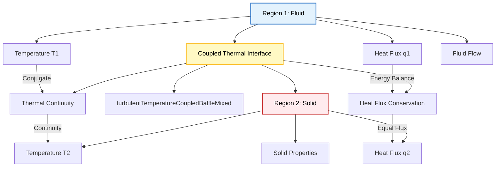
> **Figure 10:** รอยต่อความร้อนแบบเชื่อมโยงสำหรับการถ่ายโอนความร้อนแบบคอนจูเกต แสดงการสื่อสารข้อมูลอุณหภูมิและฟลักซ์ความร้อนระหว่างภูมิภาคของไหลและของแข็งเพื่อให้มั่นใจในความต่อเนื่องของพลังงาน


สำหรับเทคนิค Overset (Chimera) Mesh ที่ซับซ้อน:

| Type | ความสามารถ | การประยุกต์ใช้ |
|------|-------------|-----------------|
| `oversetFvPatchField` | การจัดการพิเศษสำหรับการประมาณค่าในช่วง Overset | Moving Meshes, Multiple Reference Frames |
| `implicitOversetPressure` | การจัดการแบบ Implicit สำหรับ Pressure-Velocity Coupling | การแก้สมการความดันใน Overset Regions |

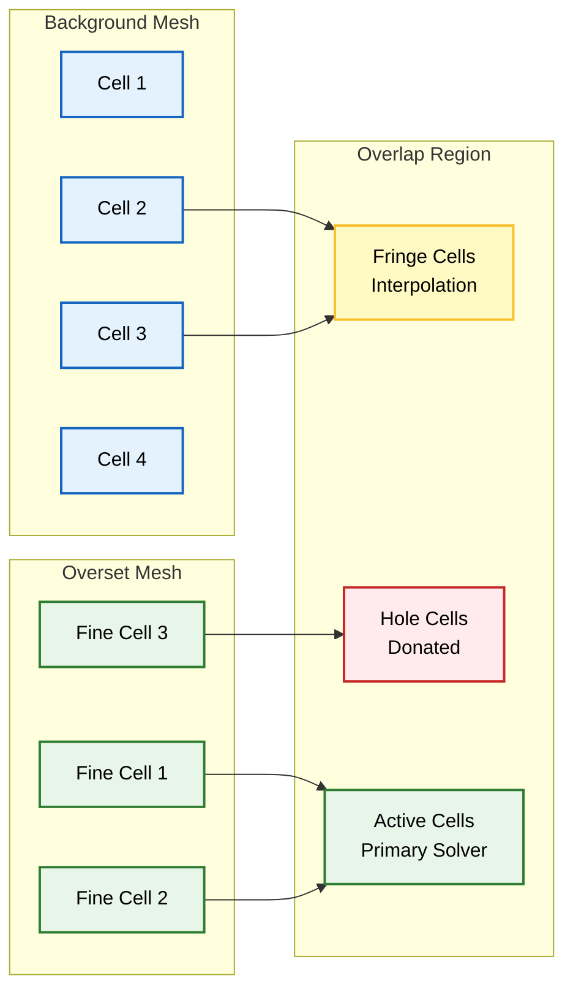
> **Figure 11:** การประมาณค่าในช่วงของ Overset Mesh และประเภทของเซลล์ แสดงการโต้ตอบระหว่าง Mesh พื้นหลังและ Mesh ซ้อนทับในบริเวณที่ทับซ้อนกัน รวมถึงการจัดการเซลล์แบบ Fringe, Hole และ Active


| Boundary Condition Type | Mathematical Form | Physical Meaning | Common Applications |
|------------------------|-------------------|------------------|-------------------|
| **fixedValue** | $\phi|_{\partial\Omega} = \phi_{\text{specified}}$ | Direct value specification | Inlet velocity, wall temperature, concentration |
| **fixedGradient** | $\frac{\partial \phi}{\partial n}\bigg|_{\partial\Omega} = g_{\text{specified}}$ | Flux specification | Outlet flow, heat flux, symmetry |
| **zeroGradient** | $\frac{\partial \phi}{\partial n}\bigg|_{\partial\Omega} = 0$ | Zero flux condition | Fully developed flow, adiabatic walls |
| **mixed** | $\alpha \phi + \beta \frac{\partial \phi}{\partial n} = \gamma$ | Weighted value-gradient combination | Conjugate heat transfer, partial slip |
| **cyclic** | $\phi_1 = \phi_2$ | Field continuity across patches | Rotational symmetry, periodic domains |
| **processor** | MPI communication | Parallel domain coupling | Distributed computing |

---

## ขั้นตอนการเลือก Boundary Condition

### ขั้นตอนที่ 1: วิเคราะห์ปัญหาทางกายภาพ
- ระบุชนิดของการไหล (Incompressible/Compressible)
- กำหนดขอบเขตทางกายภาพ (Inlet, Outlet, Wall, Symmetry)
- พิจารณาปรากฏการณ์ทางกายภาพ (Heat Transfer, Turbulence, Multiphase)

### ขั้นตอนที่ 2: ระบุ PDE Type
- ตรวจสอบว่าสมการเป็น Elliptic, Parabolic หรือ Hyperbolic
- เลือก Boundary Condition ที่เหมาะสมกับ PDE Type

### ขั้นตอนที่ 3: กำหนดค่าที่ Boundary
- เลือกประเภท Boundary Condition (Dirichlet, Neumann, Mixed)
- ระบุค่าพารามิเตอร์ที่จำเป็น

### ขั้นตอนที่ 4: ตรวจสอบ Well-Posedness
- ตรวจสอบว่าปัญหามี Solution ที่เป็นเอกลักษณ์
- ตรวจสอบความเสถียรเชิงตัวเลข

### ขั้นตอนที่ 5: ทดสอบและปรับเปลี่ยน
- ทดสอบการจำลอง
- ปรับเปลี่ยน Boundary Condition หากจำเป็น

---

## สรุปหลักการสำคัญ

1. **การเลือก Boundary Condition ที่เหมาะสม** สำคัญต่อความแม่นยำและความเสถียรของ CFD Simulations

2. **การจำแนกเป็น Dirichlet, Neumann, และ Robin** เป็นกรอบทางคณิตศาสตร์ที่รับประกัน Well-Posed Problems ตามหลักการของ Hadamard

3. **การประยุกต์ใช้ใน OpenFOAM** ต้องคำนึงถึง Physical Meaning และ Numerical Stability พร้อมกับการใช้ Class Hierarchy ที่เหมาะสม

4. **Boundary Conditions ขั้นสูง** ช่วยแก้ไขปัญหาที่ซับซ้อนใน Multiphysics และ Special Applications เช่น Conjugate Heat Transfer, Overset Mesh และ Time-Varying Conditions

5. **ความเข้าใจใน PDE Types** (Elliptic, Parabolic, Hyperbolic) เป็นพื้นฐานสำคัญในการเลือก Boundary Condition ที่เหมาะสมกับปัญหาทางกายภาพ

การเข้าใจและการนำ Boundary Conditions ไปใช้งานอย่างถูกต้องเป็นพื้นฐานสำคัญสำหรับการสร้าง CFD Simulations ที่แม่นยำและเชื่อถือได้ใน OpenFOAM

---

**📂 Source:** `.applications/solvers/multiphase/multiphaseEulerFoam/multiphaseCompressibleMomentumTransportModels/derivedFvPatchFields/copiedFixedValue/copiedFixedValueFvPatchScalarField.H`

**อ้างอิงจาก:** OpenFOAM Foundation Documentation (2015-2020)