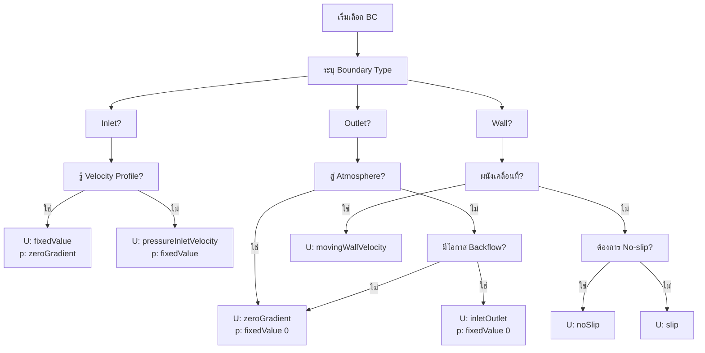

# คู่มือการเลือก Boundary Condition: แนวทางการเลือก BC ที่เหมาะสม

## Learning Objectives

หลังจากศึกษาบทนี้ คุณควรจะสามารถ:

1. **เลือก BC ที่เหมาะสม** สำหรับแต่ละสถานการณ์ CFD problem ได้อย่างถูกต้อง
2. **เข้าใจความสัมพันธ์** ระหว่าง velocity BC และ pressure BC (avoid over-constrained)
3. **ประยุกต์ใช้ decision tree** เพื่อวิเคราะห์และเลือก BC ได้อย่างเป็นระบบ
4. **จัดการกับกรณีพิเศษ** เช่น backflow, moving walls, heat transfer
5. **ตรวจสอบ BC** ว่าเข้ากันได้ (compatible) หรือยัง ก่อนรัน simulation

---

## สรุปภาพรวม (What)

> **Boundary Condition คืออะไร?**
> - เงื่อนไขขอบเขตที่กำหนดค่าของ variables (U, p, T, etc.) ที่ boundaries ของ computational domain
> - BC ที่ถูกต้องต้องสะท้อน **physics จริง** ของปัญหาที่จำลอง
> - BC ผิด = คำตอบผิด แม้ mesh ดีและ numerical settings ถูกต้อง

> **Quick Reference Card - 10 BC สำคัญที่ต้องรู้**
>
> | # | สถานการณ์ | Velocity (U) | Pressure (p) | ใช้เมื่อ |
> |---|-----------|-------------|--------------|-----------|
> | 1 | **Velocity inlet** | `fixedValue` | `zeroGradient` | รู้ velocity profile เข้า |
> | 2 | **Pressure inlet** | `pressureInletVelocity` | `fixedValue` | รู้ pressure เข้า, ไม่รู้ velocity |
> | 3 | **Outlet (standard)** | `zeroGradient` | `fixedValue 0` | ไหลออกสู่ atmosphere (p=0 gauge) |
> | 4 | **Outlet (backflow safe)** | `inletOutlet` | `fixedValue 0` | มีโอกาส reverse flow |
> | 5 | **Wall (no-slip)** | `noSlip` | `zeroGradient` | ผนังทั่วไป (viscous) |
> | 6 | **Wall (slip)** | `slip` | `zeroGradient` | ผนัง inviscid/symmetry |
> | 7 | **Moving wall** | `movingWallVelocity` | `zeroGradient` | แถบลำเลียง, ล้อหมุน |
> | 8 | **Symmetry plane** | `symmetry` | `symmetry` | ลด domain ครึ่ง |
> | 9 | **Freestream** | `freestreamVelocity` | `freestreamPressure` | External aerodynamics |
> | 10 | **Cyclic/Periodic** | `cyclic` | `cyclic` | Periodic pattern |

---

## ทำไมต้องเลือก BC ให้เหมาะสม (Why)

### ผลกระทบของ BC ที่ผิด

| ผลกระทบ | ตัวอย่าง | คำอธิบาย |
|---------|---------|-----------|
| **Simulation diverge** | High residuals ตั้งแต่ step แรก | BC ขัดแย้งกัน (เช่น U + p fixedValue ที่ inlet) |
| **คำตอบผิดทาง physics** | Velocity เกินจริง หรือ pressure drift | BC ไม่สะท้อนปัญหาจริง |
| **Numerical instability** | Oscillating solution | Backflow ที่ไม่ได้จัดการ |
| **Convergence ช้า** | รันนานกว่าปกติ | BC ไม่เสถียร, ไม่มี reference pressure |

### หลักการพื้นฐานของ BC

> **Principle 1: Physics First**
> - BC ต้องสอดคล้องกับสิ่งที่เกิดขึ้นจริงใน experiment/real world
> - ถ้าไม่มั่นใจ → เริ่มจาก BC ที่ simple ที่สุด
>
> **Principle 2: Avoid Over-constraint**
> - สำหรับ incompressible flow: **อย่ากำหนด U และ p พร้อมกันที่ boundary เดียว**
> - กำหนด U → ปล่อย p เป็น zeroGradient
> - กำหนด p → ปล่อย U เป็น pressureInletVelocity
>
> **Principle 3: Reference Pressure**
> - ต้องมีอย่างน้อย **1 จุด** ที่มี `fixedValue` สำหรับ pressure (ปกติ p=0 ที่ outlet)
> - ถ้าไม่มี → pressure จะ drift (ไม่มีค่า fixed reference)

---

## วิธีการเลือก BC ด้วย Decision Tree (How)

### Decision Tree ภาพรวม

```
┌─────────────────────────────────────────────────────────────────────┐
│                    BOUNDARY CONDITION SELECTION                     │
│                         DECISION TREE                               │
└─────────────────────────────────────────────────────────────────────┘

STEP 1: ระบุ Boundary Type
│
├─ INLET → ไปที่ Step 2
├─ OUTLET → ไปที่ Step 3
├─ WALL → ไปทับ Step 4
├─ SYMMETRY → symmetry (ทุก field)
├─ CYCLIC → cyclic (ทุก field)
└─ FREESTREAM → freestream (external aero)


STEP 2: Inlet - รู้อะไรสำหรับ flow เข้า?
│
├─ รู้ Velocity Profile
│  ├─ U: fixedValue
│  └─ p: zeroGradient
│     (กำหนด U → ปล่อย p คำนวณจาก momentum)
│
└─ รู้ Pressure (แต่ไม่รู้ velocity)
   ├─ U: pressureInletVelocity
   └─ p: fixedValue
      (กำหนด p → คำนวณ U จาก pressure gradient)


STEP 3: Outlet - ไหลออกไปที่ไหน?
│
├─ สู่ Atmosphere (standard)
│  ├─ U: zeroGradient
│  └─ p: fixedValue 0
│     (p = 0 gauge เป็น reference point)
│
└─ มีโอกาส Backflow (reverse flow)
   ├─ U: inletOutlet
   │  └─ inletValue: (0 0 0) หรือค่าที่เหมาะสม
   └─ p: fixedValue 0
      (inletOutlet = zeroGradient ตอนไหลออก + fixedValue ตอนไหลกลับ)


STEP 4: Wall - ผนังมีพฤติกรรมอย่างไร?
│
├─ เคลื่อนที่ (Moving wall)
│  └─ U: movingWallVelocity
│     (U ที่ผนัง = ความเร็วผนัง)
│
└─ นิ่ง (Stationary wall)
   ├─ Viscous flow (No-slip)
   │  └─ U: noSlip (U = 0)
   │
   └─ Inviscid/Euler (Slip)
      └─ U: slip
         (ไหลขนานผนัง ไม่ทะลุ)


SPECIAL CASES:
│
├─ HEAT TRANSFER
│  ├─ Fixed T wall → T: fixedValue
│  ├─ Adiabatic → T: zeroGradient
│  ├─ Heat flux → T: fixedGradient
│  └─ Convection → T: externalWallHeatFlux
│
└─ TURBULENCE (k, ε, ω, nut)
   ├─ Inlet → fixedValue
   ├─ Outlet → zeroGradient
   └─ Wall → wallFunction (kqRWall, epsilonWall, etc.)
```

### Flowchart ฉบับย่อ



---

## BC Selection ตามประเภท Field

### Velocity (U)

| Boundary | Standard BC | Alternative BC | เหตุผลใช้ Alternative |
|----------|-------------|----------------|------------------------|
| **Inlet** | `fixedValue` | `pressureInletVelocity` | รู้ pressure ไม่รู้ velocity |
| **Outlet** | `zeroGradient` | `inletOutlet` | มีโอกาส backflow → ป้องกัน divergence |
| **Wall** | `noSlip` | `slip`, `movingWallVelocity` | ผนัง inviscid หรือผนังเคลื่อนที่ |
| **Freestream** | `freestreamVelocity` | — | External aerodynamics (ไกลจาก object) |
| **Symmetry** | `symmetry` | — | ลด domain, ใช้ประโยชน์จาก symmetry |

> **Note:** `inletOutlet` = `zeroGradient` เมื่อ flow ออก แต่เปลี่ยนเป็น `inletValue` เมื่อ flow กลับ (backflow)

### Pressure (p)

| Boundary | Standard BC | Alternative BC | เหตุผลใช้ Alternative |
|----------|-------------|----------------|------------------------|
| **Inlet** | `zeroGradient` | `fixedValue`, `totalPressure` | Pressure-driven flow, รู้ stagnation pressure |
| **Outlet** | `fixedValue 0` | — | Reference point (p = 0 gauge pressure) |
| **Wall** | `zeroGradient` | `fixedFluxPressure` | มี body force (gravity, buoyancy) |
| **Freestream** | `freestreamPressure` | — | External aero (ใช้คู่กับ freestreamVelocity) |

> **Important:** สำหรับ incompressible flow ต้องมีอย่างน้อย **1 จุด** ที่มี `fixedValue` pressure — ปกติที่ outlet

### Temperature (T)

| Boundary | BC | เหตุผล |
|----------|-----|--------|
| **Inlet** | `fixedValue` | รู้อุณหภูมิ fluid เข้า |
| **Outlet** | `zeroGradient` | ปล่อยให้ T ไหลออกตาม flow |
| **Fixed T wall** | `fixedValue` | ผนังอุณหภูมิคงที่ (isothermal) |
| **Adiabatic wall** | `zeroGradient` | ไม่มี heat flux (ฉนวน) |
| **Heat flux wall** | `fixedGradient` | กำหนด heat flux q (W/m²) |
| **Convective wall** | `externalWallHeatFlux` | Newton's law of cooling: q = h(T_wall - T_ambient) |

### Turbulence (k, ε, ω, nut)

| Boundary | k | ε | ω | nut |
|----------|---|---|---|-----|
| **Inlet** | `fixedValue` | `fixedValue` | `fixedValue` | `calculated` |
| **Outlet** | `zeroGradient` | `zeroGradient` | `zeroGradient` | `calculated` |
| **Wall** | `kqRWallFunction` | `epsilonWallFunction` | `omegaWallFunction` | `nutkWallFunction` |

> **ทำไม Wall ใช้ Wall Function?**
> - หลีกเลี่ยงการสร้าง mesh ละเอียดมากใกล้ผนัง (y+ < 1)
> - ใช้ empirical correlations แทน → ลดจำนวน cell
> - **ข้อจำกัด:** ต้องมี y+ อยู่ในช่วงที่ถูกต้อง (30-300)

---

## Code Examples: BC สำหรับแต่ละสถานการณ์

### 1. Standard Pipe Flow (Velocity-driven)

> **สถานการณ์:** รู้ velocity เข้า ไม่รู้ pressure

```cpp
// 0/U file
inlet  
{ 
    type            fixedValue; 
    value           uniform (1 0 0);    // m/s, ทิศทาง x
}   

outlet 
{ 
    type            zeroGradient;       // ปล่อยให้ไหลออกเอง
}                       

walls  
{ 
    type            noSlip;             // ผนังไม่ลื่น (U = 0)
}                               

// 0/p file
inlet  
{ 
    type            zeroGradient;       // ปล่อยให้ p ปรับตัวตาม U
}                        

outlet 
{ 
    type            fixedValue; 
    value           uniform 0;          // p = 0 gauge (reference)
}         

walls  
{ 
    type            zeroGradient;       // ไม่มี pressure flux
}                       
```

### 2. Pressure-Driven Flow

> **สถานการณ์:** รู้ pressure difference (Δp) ไม่รู้ velocity

```cpp
// 0/U file
inlet  
{ 
    type            pressureInletVelocity; 
    value           uniform (0 0 0);    // Initial guess
} 

outlet { type zeroGradient; }
walls  { type noSlip; }

// 0/p file
inlet  
{ 
    type            fixedValue; 
    value           uniform 1000;       // Pa (ความดันสูง)
}   

outlet 
{ 
    type            fixedValue; 
    value           uniform 0;          // Pa (ความดันต่ำ = reference)
}         

walls  { type zeroGradient; }
```

### 3. Outlet ที่ปลอดภัยจาก Backflow

> **สถานการณ์:** มีโอกาสเกิด reverse flow ที่ outlet (เช่น flow separation)

```cpp
// 0/U file
outlet 
{ 
    type            inletOutlet; 
    inletValue      uniform (0 0 0);    // ค่าเมื่อมี backflow
    value           uniform (0 0 0);    // Initial value
} 

// 0/p file
outlet 
{ 
    type            fixedValue; 
    value           uniform 0; 
} 
```

### 4. External Aerodynamics (Freestream)

> **⚠️ สำคัญ:** Freestream BCs ต้องใช้คู่กันเสมอ: `freestreamVelocity` + `freestreamPressure`

```cpp
// 0/U file
freestream 
{ 
    type            freestreamVelocity; 
    freestreamValue uniform (50 0 0);   // m/s, ความเร็ว far-field
    value           uniform (50 0 0); 
} 

body       
{ 
    type            noSlip; 
} 

// 0/p file
freestream 
{ 
    type            freestreamPressure; 
    freestreamValue uniform 0;          // Pa gauge
    value           uniform 0; 
} 

body       
{ 
    type            zeroGradient; 
} 
```

> **ทำไมต้องคู่กัน?**
> - `freestreamVelocity` ปรับตัวตาม local flow direction (อาจไหลเข้าหรือออก ขึ้นกับ flow รอบข้าง)
> - `freestreamPressure` ทำงานร่วมกันเพื่อให้ pressure และ velocity consistent
> - ใช้เฉพาะกับ far-field boundary ที่ห่างจาก object พอ (flow ไม่ถูกรบกวน)

### 5. Heat Transfer BCs

```cpp
// 0/T file
inlet       
{ 
    type            fixedValue; 
    value           uniform 300;       // K, อุณหภูมิเข้า
}     

outlet      
{ 
    type            zeroGradient;      // ปล่อยไหลออก
}       

hotWall     
{ 
    type            fixedValue; 
    value           uniform 400;       // K, ผนังร้อน
}     

coldWall    
{ 
    type            fixedValue; 
    value           uniform 280;       // K, ผนังเย็น
}     

insulated   
{ 
    type            zeroGradient;      // Adiabatic (ฉนวน)
}       

// Convective wall (Newton's law of cooling)
// q = h(T_wall - T_ambient)
convWall
{
    type            externalWallHeatFlux;
    mode            coefficient;
    h               uniform 10;        // W/(m²·K), heat transfer coefficient
    Ta              uniform 293;       // K, ambient temperature
}
```

### 6. Moving Wall (ล้อหมุน, แถบลำเลียง)

```cpp
// 0/U file
movingWall
{
    type            movingWallVelocity;
    value           uniform (5 0 0);   // m/s, ความเร็วผนัง
}

// หรือล้อหมุน (ใช้กับ rotating wall)
rotatingWall
{
    type            rotatingWallVelocity;
    origin          uniform (0 0 0);   // จุดศูนย์กลางหมุน
    axis            uniform (0 0 1);   // แกนหมุน (z-axis)
    omega           uniform 100;       // rad/s, ความเร็วเชิงมุม
}
```

### 7. Turbulence Inlet BCs (k-ε Model)

```cpp
// 0/k file
inlet
{
    type            fixedValue;
    value           uniform 0.375;     // m²/s² = 1.5 * (U * I)²
                                        // I = turbulence intensity (0.05)
}

// 0/epsilon file
inlet
{
    type            fixedValue;
    value           uniform 8.75;      // m²/s³ = Cμ^0.75 * k^1.5 / l
                                        // l = length scale
}

// 0/nut file
inlet
{
    type            calculated;
    value           uniform 0;         // จะถูกคำนวณจาก k, epsilon
}

outlet
{
    type            zeroGradient;      // ทั้ง k, epsilon, nut
}

walls
{
    type            kqRWallFunction;   // สำหรับ k
    type            epsilonWallFunction; // สำหรับ epsilon
    type            nutkWallFunction;   // สำหรับ nut
}
```

---

## การแก้ปัญหา BC ที่พบบ่อย

| ปัญหา | อาการ | สาเหตุ | วิธีแก้ไข |
|-------|--------|--------|-----------|
| **Diverge ที่ inlet** | Residuals สูงตั้งแต่ step แรก | U + p fixedValue → over-constrained | เปลี่ยน p เป็น zeroGradient หรือเปลี่ยน U เป็น pressureInletVelocity |
| **Backflow instability** | Solution oscillate ที่ outlet | zeroGradient ไม่จัดการ reverse flow | ใช้ inletOutlet แทน zeroGradient |
| **High velocity ที่ wall** | U สูงผิดปกติติดผนัง | ไม่ได้ใช้ no-slip | ใช้ noSlip แทน slip/fixedValue |
| **Pressure drift** | ค่า p เพิ่ม/ลด เรื่อยๆ | ไม่มี reference pressure | ใส่ fixedValue p = 0 ที่ outlet |
| **Turbulence negative** | k, ε, ω กลายเป็นลบ | Wall function + y+ ผิด | ปรับ mesh ให้ y+ อยู่ในช่วง 30-300 หรือเปลี่ยนเป็น low-Re model |
| **Slow convergence** | รันนานมาก | BC ไม่เสถียร หรือไม่สอดคล้องกัน | ตรวจสอบ BC compatibility ทุก boundary |

> **Quick Check:** ก่อนรัน simulation ใหม่ ใช้ checkBC หรือตรวจสอบด้วยตาว่า:
> - มี reference pressure (fixedValue p) อย่างน้อย 1 จุด?
> - ไม่มี boundary ใดที่กำหนดทั้ง U และ p เป็น fixedValue?
> - inletOutlet มี inletValue ตั้งค่าหรือยัง?

---

## Cross-Reference Navigation

**ไฟล์ที่เกี่ยวข้องในโฟลเดอร์นี้:**

- **[01_Introduction.md](01_Introduction.md)** — แนะนำ BC พื้นฐาน (Dirichlet, Neumann, Robin)
- **[02_Fundamental_Classification.md](02_Fundamental_Classification.md)** — การจำแนกประเภท BC และรายละเอียดแต่ละชนิด
- **[04_Mathematical_Formulation.md](04_Mathematical_Formulation.md)** — สูตรทางคณิตศาสตามของ BC
- **[07_Troubleshooting_Boundary_Conditions.md](07_Troubleshooting_Boundary_Conditions.md)** — แนวทางการแก้ปัญหา BC ขั้นสูง

**ดูเพิ่มเติม:**
- ถ้าต้องการรายละเอียดเชิงลึกเกี่ยวกับแต่ละประเภท BC → ดู [02_Fundamental_Classification.md](02_Fundamental_Classification.md)
- ถ้า simulation diverge → ดู [07_Troubleshooting_Boundary_Conditions.md](07_Troubleshooting_Boundary_Conditions.md)
- ถ้าต้องการเข้าใจสมการทางคณิตศาสตาม → ดู [04_Mathematical_Formulation.md](04_Mathematical_Formulation.md)

---

## Concept Check: ทดสอบความเข้าใจ

<details>
<summary><b>1. ทำไม inlet ใช้ zeroGradient สำหรับ p เมื่อกำหนด fixedValue สำหรับ U?</b></summary>

**คำตอบ:**

เพื่อป้องกันการ over-constraint system

- เมื่อกำหนด U (fixedValue) แล้ว momentum equation จะคำนวณ p ที่จำเป็�เพื่อให้ได้ U นั้น
- ถ้ากำหนดทั้ง U และ p เป็น fixedValue → system มี constraints เกินไป (over-constrained) → ไม่มีคำตอบที่ตอบสนองทั้งสอง
- `zeroGradient` สำหรับ p = ปล่อยให้ p ปรับตัวตามธรรมชาติ (extrapolate จาก internal cells)

**ตรงข้าม:** สำหรับ pressure-driven flow จะกำหนด p (fixedValue) แต่ปล่อย U เป็น pressureInletVelocity
</details>

<details>
<summary><b>2. inletOutlet ต่างจาก zeroGradient อย่างไร? เมื่อไหร่ควรใช้?</b></summary>

**คำตอบ:**

| ลักษณะ | zeroGradient | inletOutlet |
|---------|--------------|-------------|
| **Flow ออก** (normal > 0) | ใช้ internal value | ใช้ internal value (เหมือนกัน) |
| **Flow เข้า** (backflow) | ยังใช้ internal value | ใช้ `inletValue` ที่กำหนด |

**เมื่อไหร่ใช้:** ใช้ inletOutlet เมื่อมีโอกาสเกิด reverse flow ที่ outlet

- เช่น flow after expansion, separation zones, หรือ transient flow ที่มี backflow
- ป้องกัน numerical instability จากการนำเข้าค่าที่ผิดจาก internal cells ตอน backflow
</details>

<details>
<summary><b>3. ต้องกำหนด reference pressure ที่ไหน? ทำไม?</b></summary>

**คำตอบ:**

**ที่ไหน:** อย่างน้อย **1 จุด** ใน domain ต้องมี `fixedValue` สำหรับ pressure — ปกติที่ outlet (p = 0 gauge)

**ทำไม:** สำหรับ incompressible flow, pressure equation เป็น Poisson equation:

$$\nabla^2 p = \frac{\rho}{\Delta t} \nabla \cdot \mathbf{U}^*$$

สมการนี้มีคำตอบ **infinite** (บวก constant ใดๆ ก็ได้) ถ้าไม่มี boundary condition → pressure สามารถ drift (เพิ่ม/ลด ไปเรื่อยๆ)

**การแก้:** ต้องมี reference point อย่างน้อย 1 จุดเพื่อกำหนด absolute level of pressure
</details>

<details>
<summary><b>4. fixedFluxPressure ใช้เมื่อไหร่? ทำไมไม่ใช้ zeroGradient?</b></summary>

**คำตอบ:**

**ใช้เมื่อ:** มี body force (เช่น gravity) หรือ source term ใน momentum equation

**ความแตกต่าง:**
- `zeroGradient`: ∂p/∂n = 0 (ไม่มี pressure flux ที่ผนัง)
- `fixedFluxPressure`: ∂p/∂n = ρ (g · n) + source terms (pressure gradient จาก body force)

**สถานการณ์ที่ใช้:**
- Buoyant flows (natural convection)
- Multiphase flows with gravity
- Flows ที่มี significant body forces

ถ้าใช้ zeroGradient ในกรณีเหล่านี้ → pressure field จะไม่ถูกต้อง
</details>

<details>
<summary><b>5. Freestream BC ต้องใช้คู่กันเสมอ ทำไม?</b></summary>

**คำตอบ:**

เพราะ `freestreamVelocity` และ `freestreamPressure` ถูกออกแบบมาทำงานร่วมกัน:

1. **freestreamVelocity**: ปรับค่า U ตาม local flow direction
   - ถ้า flow ไหลออก → ใช้ freestreamValue
   - ถ้า flow ไหลเข้า → extrapolate จาก internal

2. **freestreamPressure**: ทำงานร่วมกันเพื่อให้ pressure consistent กับ velocity

3. **ใช้คู่กันเท่านั้น:** ถ้าใช้คู่กับ BC อื่น (เช่น freestreamVelocity + fixedValue p) → pressure-velocity coupling จะไม่ถูกต้อง

**สถานการณ์ที่ใช้:** External aerodynamics (flow รอบบ้าน, รถ, เครื่องบิน) ที่ boundary อยู่ไกลจาก object มากๆ
</details>

---

## Key Takeaways

### BC Selection Heuristics (กฎเกณฑ์ย่อ)

> **Inlet Selection:**
> 1. รู้ velocity → U: `fixedValue`, p: `zeroGradient`
> 2. รู้ pressure → U: `pressureInletVelocity`, p: `fixedValue`
> 3. รู้ stagnation pressure → U: `pressureInletVelocity`, p: `totalPressure`
>
> **Outlet Selection:**
> 1. Standard (flow ออกเท่านั้น) → U: `zeroGradient`, p: `fixedValue 0`
> 2. มี backflow → U: `inletOutlet`, p: `fixedValue 0`
> 3. ไม่แน่ใจ → ใช้ `inletOutlet` (safe choice)
>
> **Wall Selection:**
> 1. Viscous flow (no-slip) → U: `noSlip` (= `fixedValue` (0 0 0))
> 2. Inviscid flow (slip) → U: `slip`
> 3. Moving wall → U: `movingWallVelocity`
> 4. Adiabatic → T: `zeroGradient`
> 5. Heat transfer → T: `fixedValue` / `fixedGradient` / `externalWallHeatFlux`
>
> **Special Boundaries:**
> 1. Symmetry → ทุก field: `symmetry`
> 2. Periodic → ทุก field: `cyclic`
> 3. External aero → U: `freestreamVelocity`, p: `freestreamPressure` (ใช้คู่กัน)
> 4. Turbulence walls → use wall functions (ตรวจสอบ y+)

### กฎทอง (Golden Rules)

| Rule | Description |
|------|-------------|
| **1. Physics First** | BC ต้องสะท้อนสิ่งที่เกิดขึ้นจริง ไม่ใช่ "ใส่แล้วรัน" |
| **2. Avoid Over-constraint** | อย่ากำหนดทั้ง U และ p เป็น fixedValue ที่ boundary เดียว |
| **3. Reference Pressure** | ต้องมี ≥ 1 จุดที่ p = fixedValue (ปกติ outlet = 0) |
| **4. Backflow Safety** | มี backflow? → ใช้ inletOutlet เสมอ |
| **5. y+ Check** | Wall functions → ตรวจสอบ y+ 30-300 ก่อนรัน |
| **6. Freestream Pair** | freestreamVelocity + freestreamPressure (ใช้คู่กันเท่านั้น) |
| **7. Start Simple** | ไม่แน่ใจ → เริ่มจาก BC ที่ simple ที่สุด แล้วปรับ |

### Quick Decision Table

| Question | Answer → BC |
|----------|-------------|
| รู้ velocity เข้า? | U: fixedValue, p: zeroGradient |
| รู้ pressure เข้า? | U: pressureInletVelocity, p: fixedValue |
| Outlet มี backflow? | U: inletOutlet |
| ผนังติด? | U: noSlip |
| ผนังลื่น? | U: slip |
| ผนังเคลื่อน? | U: movingWallVelocity |
| ลด domain? | symmetry |
| External aero? | freestream (คู่กัน) |
| Periodic? | cyclic |
| Heat flux fixed? | T: fixedGradient |
| Heat transfer? | T: externalWallHeatFlux |

---

## References & Further Reading

- **OpenFOAM User Guide:** Boundary Conditions
- **OpenFOAM Programmer's Guide:** fvPatchField types
- **CFD Online:** Forum discussions และ BC examples

---

**[← ก่อนหน้า: 02_Fundamental_Classification](02_Fundamental_Classification.md)** | **[04_Mathematical_Formulation.md →](04_Mathematical_Formulation.md)**