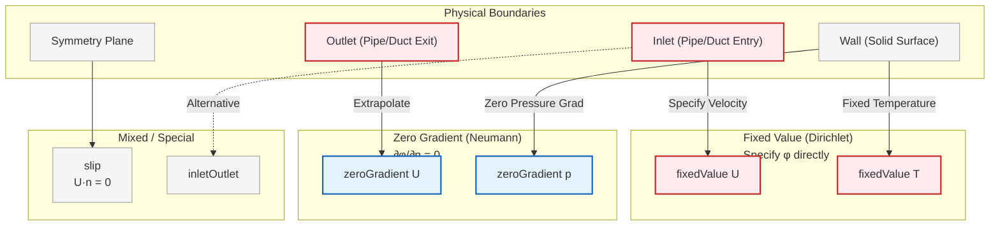
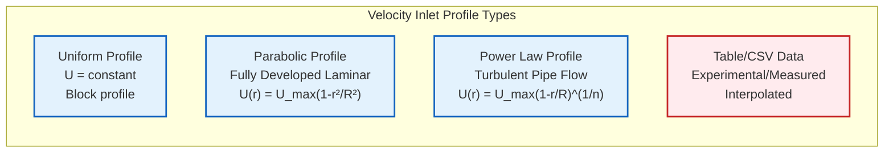
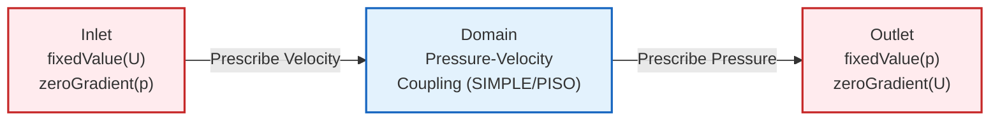
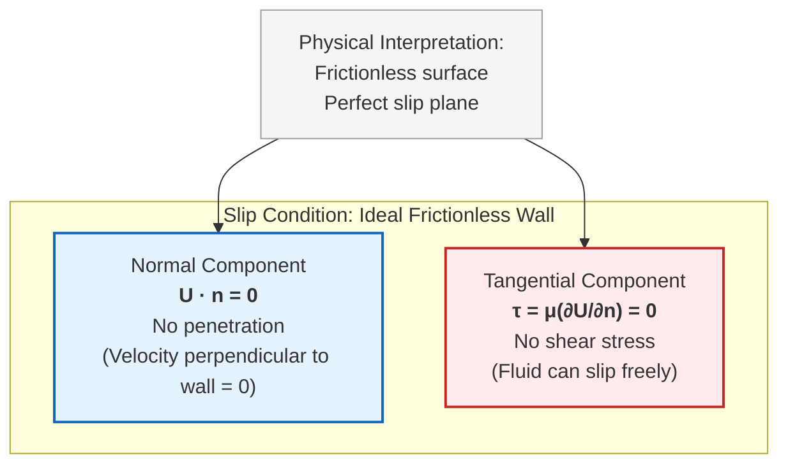
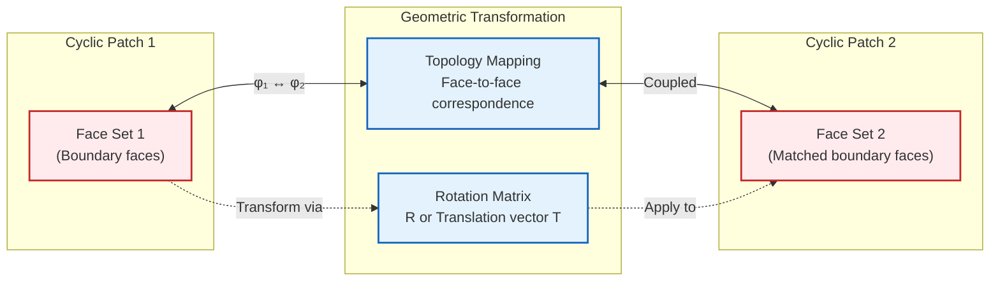
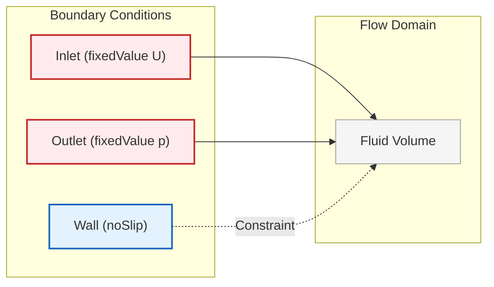

# คู่มือการเลือก: ควรใช้ Boundary Condition ใด?

เมื่อกำหนด **Boundary Condition** สำหรับการจำลองพลศาสตร์ของไหลเชิงคำนวณ (CFD) ใน OpenFOAM การเลือกคู่ Boundary Condition ของความเร็วและความดันที่เหมาะสมเป็นสิ่งสำคัญอย่างยิ่งต่อเสถียรภาพเชิงตัวเลขและความสมจริงทางกายภาพ

คู่มือต่อไปนี้จะสรุปการกำหนดค่า Boundary Condition ที่พบบ่อยที่สุดสำหรับสถานการณ์การไหลทั่วไป โดยให้ทั้งประเภท Boundary Condition ของ OpenFOAM ที่แนะนำและเหตุผลทางกายภาพเบื้องหลังการเลือก

---

## การจำแนกสถานการณ์การไหลและการเลือก BC

การเลือก Boundary Condition ที่เหมาะสมขึ้นอยู่กับลักษณะทางกายภาพของปัญหาการไหลและความสมบูรณ์ทางคณิตศาสตร์ของระบบที่ได้

ในการจำลอง **การไหลที่อัดตัวไม่ได้ (incompressible flow)** สมการ Navier-Stokes สำหรับการไหลที่อัดตัวไม่ได้ที่เชื่อมโยงกับสมการ Continuity Equation ต้องการความสมดุลที่เหมาะสมระหว่าง Boundary Condition ของความเร็วและความดันเพื่อให้มั่นใจถึงความสอดคล้องทางคณิตศาสตร์

### สมการควบคุมพื้นฐานสำหรับการไหลที่อัดตัวไม่ได้

**สมการ Continuity Equation:**
$$\nabla \cdot \mathbf{u} = 0$$

**สมการ Momentum Equation:**
$$\rho \frac{\partial \mathbf{u}}{\partial t} + \rho (\mathbf{u} \cdot \nabla) \mathbf{u} = -\nabla p + \mu \nabla^2 \mathbf{u} + \mathbf{f}$$

**ตัวแปร:**
- $\mathbf{u}$ = **Velocity Vector** (เวกเตอร์ความเร็ว)
- $p$ = **Pressure** (ความดัน)
- $\rho$ = **Density** (ความหนาแน่น)
- $\mu$ = **Dynamic Viscosity** (ความหนืดพลศาสตร์)
- $\mathbf{f}$ = **Body Forces** (แรงภายนอก)

---


> **Figure 1:** การแมปขอบเขตทางกายภาพเข้ากับข้อจำกัดทางคณิตศาสตร์ในโดเมน CFD แสดงการจับคู่สถานการณ์จริง (เช่น ทางเข้า ทางออก ผนัง) เข้ากับประเภทเงื่อนไขขอบเขตที่สอดคล้องกันเพื่อความสมบูรณ์ของแบบจำลอง


| Flow Situation | Velocity BC | Pressure BC | Physical Justification | Best Use Case |
| :--- | :--- | :--- | :--- | :--- |
| **ทางเข้า (ความเร็วที่ทราบ)** | `fixedValue` | `zeroGradient` | กำหนดโปรไฟล์ความเร็วขาเข้า, ความดันพัฒนาขึ้นเองตามธรรมชาติ | การไหลในท่อที่พัฒนาเต็มที่ |
| **ทางเข้า (ความดันที่ทราบ)** | `pressureInletVelocity` | `fixedValue` | การไหลที่ขับเคลื่อนด้วยความดัน, ความเร็วคำนวณจาก Pressure Gradient | การไหลแรงดัน, ระบบปั๊ม |
| **ทางออก (บรรยากาศ)** | `zeroGradient` | `fixedValue` | การระบายออกสู่สภาวะแวดล้อมอย่างอิสระ | ท่อนำออกสู่บรรยากาศ |
| **ผนัง (No-Slip)** | `noSlip` (หรือ `fixedValue` 0) | `zeroGradient` | เงื่อนไข No-Slip แบบหนืด, Pressure Gradient เกิดขึ้นเองตามธรรมชาติ | ผนังแข็งทุกประเภท |
| **ระนาบสมมาตร** | `symmetry` | `symmetry` | สมมาตรแบบสะท้อนรอบ Boundary | การจำลองครึ่งส่วนเพื่อประหยัดพื้นที่ |
| **ผนังเคลื่อนที่** | `movingWallVelocity` | `zeroGradient` | การเคลื่อนที่ของผนังที่กำหนดพร้อมผลกระทบจากความหนืด | แถบเคลื่อนที่, rotor |
| **การไหลอิสระ** | `freestreamVelocity` | `freestreamPressure` | Boundary Condition ระยะไกลสำหรับการไหลภายนอก | อากาศพลศาสตร์ภายนอก |
| **แบบ Cyclic/Periodic** | `cyclic` | `cyclic` | Boundary ของโดเมนแบบ Periodic สำหรับสมมาตร | ช่องทางซ้ำ, heat exchangers |

---

## แนวทางการใช้งานโดยละเอียด

### ทางเข้าที่มีความเร็วที่ทราบ

สำหรับกรณีที่โปรไฟล์ความเร็วขาเข้าถูกกำหนดไว้ (เช่น การไหลในท่อที่พัฒนาเต็มที่ หรือการไหลภายนอกที่มีความเร็ว Freestream ที่ทราบ) ควรใช้ Boundary Condition แบบ `fixedValue` กับ Velocity Field

**เงื่อนไขนี้จะระบุ Velocity Vector โดยตรงที่ทุก Boundary Face**


> **Figure 2:** ประเภทของโปรไฟล์ความเร็วที่ทางเข้า (Velocity Inlet) แสดงรูปแบบการกระจายความเร็วที่แตกต่างกัน เช่น โปรไฟล์แบบสม่ำเสมอ พาราโบลา หรือแบบปั่นป่วน ตามพารามิเตอร์ที่กำหนด

```cpp
// 0/U file - Velocity field boundary conditions
// Specifies velocity values at domain boundaries for incompressible flow
dimensions      [0 1 -1 0 0 0 0];           // Dimensions: [length/time]
internalField   uniform 0;                  // Initial velocity field set to zero

boundaryField
{
    inlet
    {
        // Fixed velocity inlet - Dirichlet boundary condition
        type            fixedValue;
        value           uniform (10 0 0);  // Uniform inlet velocity of 10 m/s in x-direction
    }

    outlet
    {
        // Zero gradient outlet - Neumann boundary condition
        // Allows velocity to develop naturally based on interior solution
        type            zeroGradient;
    }

    walls
    {
        // No-slip condition at solid walls
        // Fluid velocity matches wall velocity (zero for stationary walls)
        type            noSlip;
    }
}
```

<details>
<summary>📖 คำอธิบายเพิ่มเติม (Thai Explanation)</summary>

**แหล่งที่มา (Source):** .applications/utilities/parallelProcessing/reconstructPar/fvFieldReconstructorReconstructFields.C

**คำอธิบาย:**
โค้ดนี้แสดงการตั้งค่าเงื่อนไขขอบเขตสำหรับสนามความเร็ว (U) ในไฟล์ 0/U ของ OpenFOAM:
- **dimensions** กำหนดหน่วยวัดของความเร็วเป็น [length/time]
- **internalField** กำหนดค่าเริ่มต้นของสนามความเร็วภายในโดเมน
- **boundaryField** ระบุเงื่อนไขขอบเขตสำหรับแต่ละพื้นที่ผิว:
  - `inlet`: ใช้ `fixedValue` เพื่อกำหนดความเร็วคงที่ 10 m/s ในแนวแกน x
  - `outlet`: ใช้ `zeroGradient` เพื่อให้ความเร็วพัฒนาตามธรรมชาติ
  - `walls`: ใช้ `noSlip` เพื่อบังคับเงื่อนไขไม่มีการลื่นไถลที่ผนัง

**แนวคิดสำคัญ (Key Concepts):**
- **Dirichlet Boundary Condition:** การกำหนดค่าตายตัวที่ขอบเขต (fixedValue)
- **Neumann Boundary Condition:** การกำหนดความชันเป็นศูนย์ที่ขอบเขต (zeroGradient)
- **No-Slip Condition:** ความเร็วของของไหลเท่ากับความเร็วของผนังที่ขอบเขต
- **Boundary Condition Coupling:** ความสัมพันธ์ระหว่างเงื่อนไขขอบเขตของความเร็วและความดัน

</details>

Boundary ของความดันที่สอดคล้องกันจะต้องใช้ `zeroGradient` เพื่อให้ Pressure Field พัฒนาขึ้นเองตามธรรมชาติจากพลศาสตร์ของการไหล

**เงื่อนไขนี้บังคับให้ $\nabla p \cdot \mathbf{n} = 0$ ที่ทางเข้า** โดยที่ $\mathbf{n}$ คือ **Outward Normal Vector** ซึ่งทำให้มั่นใจว่า Pressure Gradient ที่ตั้งฉากกับ Boundary จะเป็นศูนย์

```cpp
// 0/p file - Pressure field boundary conditions
// Specifies pressure values at domain boundaries for incompressible flow
dimensions      [1 -1 -2 0 0 0 0];           // Dimensions: [mass/(length·time²)]
internalField   uniform 0;                  // Initial gauge pressure field set to zero

boundaryField
{
    inlet
    {
        // Zero gradient at inlet - pressure develops naturally
        // Ensures continuity equation is satisfied throughout domain
        type            zeroGradient;
    }

    outlet
    {
        // Fixed pressure outlet - Dirichlet boundary condition
        // Sets reference pressure (atmospheric pressure = 0 for gauge)
        type            fixedValue;
        value           uniform 0;          // Atmospheric reference pressure
    }

    walls
    {
        // Zero gradient at walls - pressure gradient normal to wall is zero
        // Allows pressure to adjust based on flow dynamics
        type            zeroGradient;
    }
}
```

<details>
<summary>📖 คำอธิบายเพิ่มเติม (Thai Explanation)</summary>

**แหล่งที่มา (Source):** .applications/utilities/parallelProcessing/reconstructPar/fvFieldReconstructorReconstructFields.C

**คำอธิบาย:**
โค้ดนี้แสดงการตั้งค่าเงื่อนไขขอบเขตสำหรับสนามความดัน (p) ที่สอดคล้องกับสนามความเร็ว:
- **dimensions** กำหนดหน่วยวัดของความดันเป็น [mass/(length·time²)]
- **internalField** กำหนดค่าเริ่มต้นของสนามความดันภายในโดเมน
- **boundaryField** ระบุเงื่อนไขขอบเขต:
  - `inlet`: ใช้ `zeroGradient` เพื่อให้ความดันปรับตัวตามสมการ Continuity
  - `outlet`: ใช้ `fixedValue` กำหนดความดันอ้างอิง (0 Pa สำหรับความดันเกจ)
  - `walls`: ใช้ `zeroGradient` เพื่อให้ความดันปรับตามพลศาสตร์การไหล

**แนวคิดสำคัญ (Key Concepts):**
- **Gauge Pressure:** ความดันเกจที่วัดสัมพัทธ์กับความดันบรรยากาศ
- **Reference Pressure:** ความดันอ้างอิงที่จุดหนึ่งของโดเมนเพื่อป้องกันปัญหาค่าลอยตัว
- **Pressure-Velocity Coupling:** ความสัมพันธ์ระหว่างสนามความดันและความเร็วในสมการ Navier-Stokes
- **Well-Posed Problem:** การเลือกเงื่อนไขขอบเขตที่เหมาะสมเพื่อให้มีคำตอบที่เป็นเอกลักษณ์

</details>

**เหตุผลทางกายภาพ:**
เงื่อนไข Zero-Gradient Pressure ที่ทางเข้าซึ่งระบุความเร็วไว้ จะช่วยให้ Pressure Field ปรับตัวเพื่อรักษา Continuity ตลอดทั้งโดเมน ในขณะที่ยังคงเคารพการกระจายความเร็วที่กำหนด


> **Figure 3:** การจับคู่เงื่อนไขขอบเขตทั่วไปสำหรับการไหลแบบคงที่ โดยใช้การกำหนดความเร็วที่ทางเข้าและการกำหนดความดันที่ทางออก เพื่อให้สนามความดันและความเร็วภายในโดเมนพัฒนาขึ้นอย่างสมดุล

### ทางเข้าที่มีความดันที่ทราบ

สำหรับกรณีที่ความดันขาเข้าถูกกำหนดไว้ (เช่น การไหลที่ขับเคลื่อนด้วยความดันจากปั๊ม หรือระบบที่มี Pressure Head ที่ทราบ) ควรใช้ `fixedValue` กับ Pressure Field และ `pressureInletVelocity` กับ Velocity Field

**เงื่อนไขนี้จะคำนวณ Velocity โดยอัตโนมัติจาก Pressure Gradient**

#### OpenFOAM Code Implementation

```cpp
// 0/p file - Pressure-driven flow boundary conditions
// Pressure specified at inlet, velocity calculated from pressure gradient
dimensions      [1 -1 -2 0 0 0 0];           // Dimensions: [mass/(length·time²)]
internalField   uniform 0;                  // Initial pressure field

boundaryField
{
    inlet
    {
        // Fixed pressure inlet - Dirichlet boundary condition
        // Driving pressure for flow (e.g., from pump or compressor)
        type            fixedValue;
        value           uniform 1000;       // Inlet pressure in Pascals (gauge)
    }

    outlet
    {
        // Fixed pressure outlet - sets reference pressure
        type            fixedValue;
        value           uniform 0;          // Reference pressure (atmospheric)
    }

    walls
    {
        // Zero gradient at walls - pressure adjusts naturally
        type            zeroGradient;
    }
}

// 0/U file - Velocity field for pressure-driven flow
// Velocity calculated automatically from pressure gradient
dimensions      [0 1 -1 0 0 0 0];           // Dimensions: [length/time]
internalField   uniform 0;                  // Initial velocity field

boundaryField
{
    inlet
    {
        // Pressure inlet velocity - velocity derived from pressure field
        // Automatically calculates velocity based on local pressure gradient
        type            pressureInletVelocity;
        value           uniform (0 0 0);    // Initial guess (will be overwritten)
    }

    outlet
    {
        // Zero gradient outlet - velocity develops naturally
        type            zeroGradient;
    }

    walls
    {
        // No-slip condition at solid walls
        type            noSlip;
    }
}
```

<details>
<summary>📖 คำอธิบายเพิ่มเติม (Thai Explanation)</summary>

**แหล่งที่มา (Source):** .applications/utilities/parallelProcessing/reconstructPar/fvFieldReconstructorReconstructFields.C

**คำอธิบาย:**
โค้ดนี้แสดงการตั้งค่าเงื่อนไขขอบเขตสำหรับการไหลที่ขับเคลื่อนด้วยความดัน:
- **Pressure Field (0/p):** กำหนดความดันคงที่ทั้งที่ทางเข้า (1000 Pa) และทางออก (0 Pa)
- **Velocity Field (0/U):** ใช้ `pressureInletVelocity` เพื่อคำนวณความเร็วโดยอัตโนมัติจาก Gradient ของสนามความดัน
- **Pressure Difference:** ความต่างความดันระหว่างทางเข้าและทางออก (1000 Pa) ทำหน้าที่เป็นแรงขับเคลื่อนการไหล

**แนวคิดสำคัญ (Key Concepts):**
- **Pressure-Driven Flow:** การไหลของของไหลที่เกิดจากความต่างความดัน
- **Derived Boundary Condition:** เงื่อนไขขอบเขตที่คำนวณค่าโดยอัตโนมัติจากสนามอื่น
- **Pressure Gradient:** การเปลี่ยนแปลงของความดันตามตำแหน่งในพื้นที่
- **Bernoulli's Principle:** หลักการที่เชื่อมโยงความดันและความเร็วของการไหล

</details>

**เหตุผลทางกายภาพ:**
เงื่อนไขนี้เหมาะสำหรับการไหลที่ขับเคลื่อนด้วยความดัน โดย Velocity จะพัฒนาขึ้นเพื่อสมดุลกับ Pressure Gradient ที่กำหนด

---

### ทางออกสู่บรรยากาศ

สำหรับกรณีที่ของไหลไหลออกสู่สภาวะแวดล้อม ควรใช้ `fixedValue` กับ Pressure Field (โดยทั่วไปตั้งค่าเป็น 0 สำหรับ Gauge Pressure) และ `zeroGradient` กับ Velocity Field

**เงื่อนไขนี้จะอนุญาตให้ของไหลไหลออกได้อย่างอิสระโดยไม่มีการกีดกัน**

#### OpenFOAM Code Implementation

```cpp
// 0/p file - Atmospheric outlet boundary condition
// Specifies atmospheric pressure at flow exit
dimensions      [1 -1 -2 0 0 0 0];           // Dimensions: [mass/(length·time²)]

boundaryField
{
    outlet
    {
        // Fixed pressure outlet - atmospheric boundary condition
        // Allows fluid to exit freely to ambient environment
        type            fixedValue;
        value           uniform 0;          // Atmospheric pressure (gauge = 0)
    }
}

// 0/U file - Outlet velocity boundary condition
// Allows velocity profile to develop naturally at exit
dimensions      [0 1 -1 0 0 0 0];           // Dimensions: [length/time]

boundaryField
{
    outlet
    {
        // Zero gradient outlet - Neumann boundary condition
        // Velocity gradient normal to boundary is zero
        // Allows convective outflow without reflections
        type            zeroGradient;
    }
}
```

<details>
<summary>📖 คำอธิบายเพิ่มเติม (Thai Explanation)</summary>

**แหล่งที่มา (Source):** .applications/utilities/parallelProcessing/reconstructPar/fvFieldReconstructorReconstructFields.C

**คำอธิบาย:**
โค้ดนี้แสดงการตั้งค่าเงื่อนไขขอบเขตสำหรับทางออกสู่บรรยากาศ:
- **Pressure Outlet:** กำหนดความดันคงที่เป็น 0 Pa (ความดันบรรยากาศสัมพัทธ์)
- **Velocity Outlet:** ใช้ `zeroGradient` เพื่อให้โปรไฟล์ความเร็วพัฒนาตามธรรมชาติ
- **Free Outflow:** ของไหลสามารถไหลออกได้อย่างอิสระโดยไม่มีการสะท้อนกลับ

**แนวคิดสำคัญ (Key Concepts):**
- **Atmospheric Boundary:** เงื่อนไขขอบเขตที่เชื่อมต่อกับสภาวะแวดล้อม
- **Convective Outflow:** การไหลออกแบบตัวพาโดยไม่มีการกีดกัน
- **Zero-Gradient Condition:** เงื่อนไขที่ Gradient ของตัวแปรเป็นศูนย์ตามทิศทางปกติของขอบเขต
- **Non-Reflecting Boundary:** เงื่อนไขขอบเขตที่ไม่สะท้อนคลื่นกลับเข้าสู่โดเมน

</details>

> [!WARNING] **ข้อควรระวัง**
> เงื่อนไข `zeroGradient` สำหรับ Velocity ที่ Outlet อาจทำให้เกิดปัญหาหากมีการไหลย้อนกลับ (Backflow) พิจารณาใช้ `inletOutlet` หรือ `pressureInletOutletVelocity` สำหรับกรณีนี้

---

### ผนัง No-Slip

เงื่อนไข **No-Slip** เป็นเงื่อนไขมาตรฐานสำหรับผนังแข็งในการไหลแบบหนืด (viscous flow) โดย Fluid Velocity จะตรงกับ Wall Velocity (โดยทั่วเป็นศูนย์สำหรับผนังที่หยุดนิ่ง)

**การแสดงทางคณิตศาสตร์:**
$$\mathbf{u} = \mathbf{u}_{\text{wall}}$$

สำหรับผนังที่หยุดนิ่ง: $\mathbf{u} = \mathbf{0}$

#### OpenFOAM Code Implementation

```cpp
// 0/U file - No-slip wall boundary condition
// Implements viscous no-slip condition at solid walls
dimensions      [0 1 -1 0 0 0 0];           // Dimensions: [length/time]

boundaryField
{
    walls
    {
        // No-slip condition - modern standard shorthand
        // Fluid velocity equals wall velocity (zero for stationary walls)
        // Simulates viscous adhesion at solid boundaries
        type            noSlip;
        
        // Equivalent explicit form:
        // type            fixedValue;
        // value           uniform (0 0 0);  // Zero velocity at stationary wall
    }
}

// 0/p file - Pressure boundary condition at walls
dimensions      [1 -1 -2 0 0 0 0];           // Dimensions: [mass/(length·time²)]

boundaryField
{
    walls
    {
        // Zero gradient at walls - pressure gradient normal to wall is zero
        // Allows pressure to adjust naturally based on flow dynamics
        type            zeroGradient;
    }
}
```

<details>
<summary>📖 คำอธิบายเพิ่มเติม (Thai Explanation)</summary>

**แหล่งที่มา (Source):** .applications/utilities/parallelProcessing/reconstructPar/fvFieldReconstructorReconstructFields.C

**คำอธิบาย:**
โค้ดนี้แสดงการตั้งค่าเงื่อนไขขอบเขตแบบ No-Slip ที่ผนัง:
- **No-Slip Condition:** ความเร็วของของไหลเท่ากับความเร็วของผนัง (ศูนย์สำหรับผนังนิ่ง)
- **Viscous Adhesion:** การยึดเกาะของของไหลที่ผิวที่เป็นผลจากความหนืด
- **Pressure Gradient:** ใช้ `zeroGradient` เพื่อให้ความดันปรับตามพลศาสตร์การไหล
- **Boundary Layer:** ชั้นขอบเขตที่เกิดขึ้นใกล้ผนังเนื่องจากเงื่อนไข No-Slip

**แนวคิดสำคัญ (Key Concepts):**
- **Viscous Flow:** การไหลแบบหนืดที่มีความหนืดสำคัญต่อพฤติกรรมการไหล
- **Boundary Layer Theory:** ทฤษฎีชั้นขอบเขตที่อธิบายการเปลี่ยนแปลงของความเร็วใกล้ผนัง
- **Wall Shear Stress:** แรงเฉือนที่ผนังเนื่องจาก Gradient ของความเร็ว
- **Velocity Profile:** โปรไฟล์ความเร็วที่เปลี่ยนจากศูนย์ที่ผนังไปยังค่าสูงสุดในกระแสหลัก

</details>

**เหตุผลทางกายภาพ:**
เงื่อนไข No-Slip จำลอง **การยึดเกาะของความหนืด** ที่ Solid Boundary ซึ่งเป็นลักษณะสำคัญของการไหลแบบหนืด (viscous flow)

---

### ผนัง Free-Slip

เงื่อนไข **Slip** จำลอง Boundary ที่ **ไม่มี Shear Stress** ทำให้ของไหลสามารถเลื่อนไปตามพื้นผิวได้อย่างอิสระ

**การใช้งาน:**
- Symmetry Plane
- Inviscid Wall
- Free Surface

**การแสดงทางคณิตศาสตร์:**
$$\mathbf{u} \cdot \mathbf{n} = 0 \quad \text{(no normal penetration)}$$
$$\frac{\partial \mathbf{u}_t}{\partial n} = 0 \quad \text{(zero tangential shear)}$$

#### OpenFOAM Code Implementation

```cpp
// 0/U file - Free-slip wall boundary condition
// Implements inviscid slip condition with zero shear stress
dimensions      [0 1 -1 0 0 0 0];           // Dimensions: [length/time]

boundaryField
{
    walls
    {
        // Slip condition - zero tangential stress at wall
        // Normal component: u·n = 0 (no penetration)
        // Tangential component: ∂u_t/∂n = 0 (zero shear)
        // Used for symmetry planes, inviscid walls, free surfaces
        type            slip;
    }
}
```


> **Figure 4:** หลักการทางกายภาพของเงื่อนไขขอบเขตแบบ Slip แสดงพฤติกรรมของของไหลที่ผิวในอุดมคติที่ไม่มีแรงเสียดทาน โดยมีความเร็วแนวฉากเป็นศูนย์แต่สามารถลื่นไถลในแนวสัมผัสได้โดยไม่มีความเค้นเฉือน

<details>
<summary>📖 คำอธิบายเพิ่มเติม (Thai Explanation)</summary>

**แหล่งที่มา (Source):** .applications/utilities/parallelProcessing/reconstructPar/fvFieldReconstructorReconstructFields.C

**คำอธิบาย:**
โค้ดนี้แสดงการตั้งค่าเงื่อนไขขอบเขตแบบ Free-Slip:
- **Slip Condition:** อนุญาตให้ของไหลลื่นไถลตามผิวโดยไม่มีแรงเสียดทาน
- **No Normal Penetration:** ส่วนประกอบความเร็วในแนวตั้งฉากกับผิวเป็นศูนย์ (u·n = 0)
- **Zero Shear Stress:** Gradient ของความเร็วในแนวสัมผัสเป็นศูนย์ (∂u_t/∂n = 0)
- **Inviscid Flow:** การไหลแบบไม่มีความหนืดที่ใช้เงื่อนไขนี้

**แนวคิดสำคัญ (Key Concepts):**
- **Shear Stress:** แรงเฉือนที่เกิดขึ้นที่ผิวจากความเร็วของของไหล
- **Normal Vector:** เวกเตอร์หน่วยที่ตั้งฉากกับผิว
- **Tangential Component:** ส่วนประกอบของความเร็วในแนวสัมผัสกับผิว
- **Inviscid Wall:** ผนังที่สมมติไม่มีความหนืดและไม่มีแรงเฉือน

</details>

---

### ระนาบสมมาตร (Symmetry Plane)

เงื่อนไข **Symmetry** บังคับใช้**สมมาตรทางเรขาคณิตและทางกายภาพ**ข้ามระนาบหรือขอบเขต

**เงื่อนไขทางคณิตศาสตร์:**

1. **ข้อจำกัดความเร็วแนวตั้งฉาก:**
   $$\mathbf{n} \cdot \mathbf{u} = 0 \quad \text{(ความเร็วแนวตั้งฉาก = 0)}$$

2. **การจัดการสนามสเกลาร์ (อุณหภูมิ, ความดัน):**
   $$\frac{\partial \phi}{\partial n} = 0 \quad \text{(Gradient แนวตั้งฉากเป็นศูนย์)}$$

#### OpenFOAM Code Implementation

```cpp
// 0/U file - Symmetry plane boundary condition
// Enforces geometric and physical symmetry across boundary
dimensions      [0 1 -1 0 0 0 0];           // Dimensions: [length/time]

boundaryField
{
    symmetryPlane
    {
        // Symmetry condition - reflects geometry and physics
        // Normal velocity: n·u = 0 (zero normal component)
        // Tangential velocity: zero gradient (free slip)
        // Used for symmetric geometries to reduce computational cost
        type            symmetry;
    }
}

// 0/p file - Symmetry plane for scalar fields
dimensions      [1 -1 -2 0 0 0 0];           // Dimensions: [mass/(length·time²)]

boundaryField
{
    symmetryPlane
    {
        // Symmetry condition for scalar fields
        // Zero gradient in normal direction: ∂φ/∂n = 0
        // Ensures continuity of scalar field across symmetry plane
        type            symmetry;
    }
}
```

<details>
<summary>📖 คำอธิบายเพิ่มเติม (Thai Explanation)</summary>

**แหล่งที่มา (Source):** .applications/utilities/parallelProcessing/reconstructPar/fvFieldReconstructorReconstructFields.C

**คำอธิบาย:**
โค้ดนี้แสดงการตั้งค่าเงื่อนไขขอบเขตแบบ Symmetry:
- **Symmetry Condition:** บังคับใช้สมมาตรทางเรขาคณิตและกายภาพข้ามระนาบ
- **Zero Normal Velocity:** ความเร็วในแนวตั้งฉากกับระนาบสมมาตรเป็นศูนย์
- **Zero Scalar Gradient:** Gradient ของสนามสเกลาร์ในแนวตั้งฉากเป็นศูนย์
- **Computational Efficiency:** ลดขนาดโดเมนการคำนวณโดยใช้คุณสมบัติสมมาตร

**แนวคิดสำคัญ (Key Concepts):**
- **Geometric Symmetry:** สมมาตรทางเรขาคณิตของรูปทรง
- **Physical Symmetry:** สมมาตรของสนามกายภาพ (ความเร็ว, ความดัน)
- **Reflection Condition:** เงื่อนไขที่สะท้อนค่าตัวแปรข้ามระนาบสมมาตร
- **Domain Reduction:** การลดขนาดโดเมนการคำนวณเพื่อประหยัดทรัพยากร

</details>

**สถานการณ์การประยุกต์ใช้:**
- จำลองเพียงครึ่งหนึ่งของรูปทรงเรขาคณิตที่มีสมมาตร (ท่อ, ช่อง, ปีกเครื่องบิน)
- การไหลแบบ **Axisymmetric** ที่จำลองภาพตัดขวาง 2D ของปัญหา 3D ที่มีสมมาตรการหมุน
- การไหลที่ฟิสิกส์และรูปทรงเรขาคณิตสะท้อนกันอย่างสมบูรณ์ข้ามระนาป

---

### ผนังเคลื่อนที่

สำหรับผนังที่เคลื่อนที่ (เช่น แถบลำเลียง หรือ rotor) ควรใช้ `movingWallVelocity` ซึ่งจะพิจารณาทั้งความเร็วของผนังและการเคลื่อนที่ของ Mesh

#### OpenFOAM Code Implementation

```cpp
// 0/U file - Moving wall boundary condition
// Implements velocity condition for moving solid walls
dimensions      [0 1 -1 0 0 0 0];           // Dimensions: [length/time]

boundaryField
{
    movingWall
    {
        // Moving wall velocity - accounts for wall and mesh motion
        // Fluid velocity equals wall velocity at boundary
        // Includes effects of mesh motion if present
        // Used for conveyor belts, rotating machinery, pistons
        type            movingWallVelocity;
        value           uniform (1 0 0);   // Wall velocity in m/s (x-direction)
    }
}

// 0/p file - Pressure at moving walls
dimensions      [1 -1 -2 0 0 0 0];           // Dimensions: [mass/(length·time²)]

boundaryField
{
    movingWall
    {
        // Zero gradient at moving walls
        // Pressure gradient normal to wall is zero
        // Allows pressure to adjust based on flow dynamics
        type            zeroGradient;
    }
}
```

<details>
<summary>📖 คำอธิบายเพิ่มเติม (Thai Explanation)</summary>

**แหล่งที่มา (Source):** .applications/utilities/parallelProcessing/reconstructPar/fvFieldReconstructorReconstructFields.C

**คำอธิบาย:**
โค้ดนี้แสดงการตั้งค่าเงื่อนไขขอบเขตสำหรับผนังเคลื่อนที่:
- **Moving Wall Velocity:** ความเร็วของของไหลเท่ากับความเร็วของผนังที่ขอบเขต
- **Mesh Motion:** คำนึงถึงการเคลื่อนที่ของเมชหากมีการเคลื่อนที่ของโดเมน
- **Boundary Layer:** ชั้นขอบเขตที่เกิดขึ้นใกล้ผนังเคลื่อนที่
- **Relative Velocity:** ความเร็วสัมพัทธ์ระหว่างของไหลและผนัง

**แนวคิดสำคัญ (Key Concepts):**
- **Moving Boundary:** ขอบเขตที่เคลื่อนที่ด้วยความเร็วที่กำหนด
- **No-Slip at Moving Wall:** เงื่อนไขไม่มีการลื่นไถลที่ผนังเคลื่อนที่
- **Dynamic Mesh:** เมชที่เปลี่ยนรูปร่างหรือตำแหน่งตามเวลา
- **Relative Motion:** การเคลื่อนที่สัมพัทธ์ระหว่างของไหลและขอบเขต

</details>

---

### การไหลอิสระ (Freestream)

สำหรับการไหลภายนอก (External Flow) เช่น อากาศพลศาสตร์ ควรใช้ `freestreamVelocity` และ `freestreamPressure` สำหรับ Boundary ระยะไกล

#### OpenFOAM Code Implementation

```cpp
// 0/U file - Freestream boundary condition for external flows
// Implements far-field condition for aerodynamic simulations
dimensions      [0 1 -1 0 0 0 0];           // Dimensions: [length/time]

boundaryField
{
    freestream
    {
        // Freestream velocity - far-field boundary condition
        // Switches between fixed value and zero gradient based on flow direction
        // Used for external aerodynamics, wind tunnel simulations
        type            freestreamVelocity;
        freestreamValue uniform (10 0 0);  // Freestream velocity in m/s (x-direction)
    }
}

// 0/p file - Freestream pressure boundary condition
dimensions      [1 -1 -2 0 0 0 0];           // Dimensions: [mass/(length·time²)]

boundaryField
{
    freestream
    {
        // Freestream pressure - far-field pressure condition
        // Sets reference pressure at distant boundaries
        // Used in conjunction with freestreamVelocity
        type            freestreamPressure;
        freestreamValue uniform 0;          // Reference pressure (Pascals)
    }
}
```

<details>
<summary>📖 คำอธิบายเพิ่มเติม (Thai Explanation)</summary>

**แหล่งที่มา (Source):** .applications/utilities/parallelProcessing/reconstructPar/fvFieldReconstructorReconstructFields.C

**คำอธิบาย:**
โค้ดนี้แสดงการตั้งค่าเงื่อนไขขอบเขตแบบ Freestream สำหรับการไหลภายนอก:
- **Freestream Velocity:** ความเร็วไหลเองที่ขอบเขตระยะไกล
- **Far-Field Condition:** เงื่อนไขขอบเขตสำหรับขอบเขตที่อยู่ไกลออกไป
- **External Aerodynamics:** อากาศพลศาสตร์ภายนอกสำหรับการจำลองรอบตัวถูกลม
- **Flow Direction Switching:** สลับเงื่อนไขตามทิศทางการไหล

**แนวคิดสำคัญ (Key Concepts):**
- **Far-Field Boundary:** ขอบเขตระยะไกลที่ไม่ได้รับอิทธิพลจากตัวถูกลม
- **Freestream Conditions:** เงื่อนไขการไหลที่ไม่มีการรบกวนจากวัตถุ
- **Inflow/Outflow:** การไหลเข้าและออกที่ขอบเขตเดียวกัน
- **Aerodynamic Simulation:** การจำลองทางอากาศพลศาสตร์

</details>

---

### Boundary Condition แบบ Cyclic/Periodic

**Cyclic Boundary** เชื่อมต่อ Patch ขอบเขตสองส่วนที่แตกต่างกัน โดยบังคับใช้ความต่อเนื่องของค่า Field

**สำหรับ Field $\phi$ ที่ใช้กับ Cyclic Boundary Conditions:**
$$\phi_{\text{patch A}}(\mathbf{x}) = \phi_{\text{patch B}}(\mathbf{T}(\mathbf{x}))$$

โดยที่:
- $\mathbf{T}$ = การแปลงทางเรขาคณิตที่แมปพิกัดจาก Patch A ไปยัง Patch B
- $\phi$ = Field ที่ถูกบังคับใช้เงื่อนไข

#### OpenFOAM Code Implementation

```cpp
// 0/U file - Cyclic boundary condition for velocity
// Enforces continuity of velocity field across periodic boundaries
dimensions      [0 1 -1 0 0 0 0];           // Dimensions: [length/time]

boundaryField
{
    left
    {
        // Cyclic boundary - connects two patches
        // Field values at patch A = transformed field values at patch B
        // Used for periodic geometries, repeating units
        type            cyclic;
    }

    right
    {
        // Corresponding cyclic patch
        // Must have matching mesh topology and face count
        type            cyclic;
    }
}

// 0/p file - Cyclic boundary condition for pressure
dimensions      [1 -1 -2 0 0 0 0];           // Dimensions: [mass/(length·time²)]

boundaryField
{
    left
    {
        // Cyclic condition for scalar fields
        // Ensures continuity across periodic boundaries
        type            cyclic;
    }

    right
    {
        // Matching cyclic patch for pressure field
        type            cyclic;
    }
}
```


> **Figure 5:** กรอบแนวคิดสำหรับเงื่อนไขขอบเขตแบบเป็นคาบ (Cyclic) แสดงความต่อเนื่องทางกายภาพและการส่งผ่านข้อมูลของสนามตัวแปรระหว่างขอบเขตคู่ที่ระบุ เพื่อจำลองรูปทรงเรขาคณิตที่ซ้ำกัน

<details>
<summary>📖 คำอธิบายเพิ่มเติม (Thai Explanation)</summary>

**แหล่งที่มา (Source):** .applications/utilities/parallelProcessing/reconstructPar/fvFieldReconstructorReconstructFields.C

**คำอธิบาย:**
โค้ดนี้แสดงการตั้งค่าเงื่อนไขขอบเขตแบบ Cyclic/Periodic:
- **Cyclic Boundary:** เชื่อมต่อ Patch สองส่วนเพื่อบังคับความต่อเนื่องของ Field
- **Periodic Geometry:** รูปทรงเรขาคณิตที่ซ้ำกันในพื้นที่
- **Field Continuity:** ความต่อเนื่องของสนามตัวแปรข้ามขอบเขต
- **Transformation Mapping:** การแมปพิกัดระหว่าง Patch คู่

**แนวคิดสำคัญ (Key Concepts):**
- **Periodic Boundary:** เงื่อนไขขอบเขตที่เชื่อมต่อระหว่างพื้นที่ซ้ำ
- **Cyclic Pair:** คู่ของ Patch ที่เชื่อมต่อกันด้วยเงื่อนไข Cyclic
- **Mesh Topology:** โครงสร้างของเมชที่ต้องสอดคล้องกัน
- **Transformation Matrix:** เมทริกซ์การแปลงพิกัดระหว่าง Patch

</details>

---

### ตารางสรุปปัญหา

| Symptom | Probable Cause | Solution |
| :--- | :--- | :--- |
| **Divergence ที่ Inlet** | U และ p ไม่สอดคล้องกัน | ตรวจสอบ: หาก U ถูกกำหนดค่าตายตัว (fixed), p ควรเป็น zeroGradient |
| **Inflow ที่ Outlet** | Vortices พุ่งชน Outlet | ใช้ `inletOutlet` หรือขยาย Domain ปลายน้ำ |
| **High Velocity ที่ Wall** | ประเภท BC ผิด | ตรวจสอบให้แน่ใจว่าใช้ `noSlip` หรือ `fixedValue (0 0 0)` |
| **Pressure Drifting** | Boundary Condition ประเภท Neumann ทั้งหมด | กำหนดค่าความดันที่จุดใดจุดหนึ่ง (Reference Pressure) |

---

### ปัญหาที่ 1: Divergence ที่ Inlet

**Problem Description:**
การจำลองเกิด **Divergence** หลังจากเริ่มต้นไม่นาน โดยค่า Residuals พุ่งสูงขึ้นอย่างรวดเร็วที่ Boundary ของ Inlet

**Root Cause:**
ปัญหาพื้นฐานเกิดจากการ **กำหนด Boundary Condition มากเกินไป (over-specification)**

เมื่อทั้ง Velocity และ Pressure ถูกกำหนดค่าตายตัวที่ Boundary เดียวกัน ระบบจะถูกจำกัดเงื่อนไขทางคณิตศาสตร์มากเกินไป

**Proper Implementation:**

```cpp
// Proper boundary condition setup for velocity inlet
// Ensures well-posed problem with correct BC coupling
U
{
    type            fixedValue;
    value           uniform (10 0 0);     // Fixed velocity at inlet (Dirichlet)
}

p
{
    type            zeroGradient;          // Natural outflow for pressure (Neumann)
}
```

<details>
<summary>📖 คำอธิบายเพิ่มเติม (Thai Explanation)</summary>

**แหล่งที่มา (Source):** .applications/utilities/parallelProcessing/reconstructPar/fvFieldReconstructorReconstructFields.C

**คำอธิบาย:**
โค้ดนี้แสดงการตั้งค่าเงื่อนไขขอบเขตที่ถูกต้องเพื่อป้องกันปัญหา Divergence:
- **Well-Posed Problem:** การเลือกเงื่อนไขขอบเขตที่เหมาะสมเพื่อให้มีคำตอบที่เป็นเอกลักษณ์และมีเสถียรภาพ
- **Dirichlet-Neumann Pair:** คู่ของเงื่อนไจ Dirichlet และ Neumann สำหรับความเร็วและความดัน
- **Over-Specification:** การกำหนดเงื่อนไขมากเกินไปที่ทำให้ระบบไม่มีคำตอบ
- **BC Coupling:** ความสัมพันธ์ระหว่างเงื่อนไขขอบเขตของความเร็วและความดัน

**แนวคิดสำคัญ (Key Concepts):**
- **Mathematical Well-Posedness:** คุณสมบัติทางคณิตศาสตร์ของปัญหาที่มีคำตอบที่เป็นเอกลักษณ์
- **Dirichlet Boundary:** เงื่อนไขขอบเขตที่กำหนดค่าตัวแปรโดยตรง
- **Neumann Boundary:** เงื่อนไขขอบเขตที่กำหนด Gradient ของตัวแปร
- **Pressure-Velocity Coupling:** ความสัมพันธ์ระหว่างสนามความดันและความเร็ว

</details>

---

### ปัญหาที่ 2: Inflow ที่ Outlet

**Problem Description:**
ของไหลไหล **เข้าสู่** Computational Domain ผ่าน Boundary ของ Outlet

**Solution 1: inletOutlet Boundary Condition**

```cpp
// Adaptive boundary condition for potential backflow
// Switches between zeroGradient and fixedValue based on flow direction
U
{
    type            inletOutlet;           // Adaptive BC for outflow/inflow
    inletValue      uniform (0 0 0);       // Velocity if backflow occurs
    value           uniform (0 0 0);       // Initial guess
}
```

<details>
<summary>📖 คำอธิบายเพิ่มเติม (Thai Explanation)</summary>

**แหล่งที่มา (Source):** .applications/utilities/parallelProcessing/reconstructPar/fvFieldReconstructorReconstructFields.C

**คำอธิบาย:**
โค้ดนี้แสดงการใช้เงื่อนไขขอบเขตแบบ inletOutlet เพื่อจัดการกับปัญหาการไหลย้อน:
- **Adaptive BC:** เงื่อนไขขอบเขตที่ปรับเปลี่ยนตามสถานการณ์การไหล
- **Backflow Prevention:** ป้องกันหรือจัดการกับการไหลย้อนกลับ
- **Flow Direction Detection:** การตรวจจับทิศทางการไหลเพื่อเลือกเงื่อนไขที่เหมาะสม
- **Conditional BC:** เงื่อนไขขอบเขตที่เปลี่ยนแปลงตามเงื่อนไขเฉพาะ

**แนวคิดสำคัญ (Key Concepts):**
- **Backflow:** การไหลย้อนกลับเข้าสู่โดเมนผ่านทางออก
- **Adaptive Boundary Condition:** เงื่อนไขขอบเขตที่ปรับตามสถานการณ์
- **Flow Reversal:** การเปลี่ยนทิศทางการไหล
- **Convective Flux:** ปริมาณการไหลแบบตัวพาผ่านขอบเขต

</details>

เงื่อนไข `inletOutlet` จะสลับระหว่าง `zeroGradient` และ `fixedValue` โดยอัตโนมัติตามทิศทางการไหล:
- `zeroGradient` เมื่อการไหลออก (normal flux > 0)
- `fixedValue` เมื่อการไหลเข้า (normal flux < 0)

**Solution 2: Domain Extension**

วิธีแก้ไขที่แข็งแกร่งที่สุดคือการทำให้ Outlet อยู่ไกลจากปลายน้ำมากพอ:

| การไหล | ระยะ Outlet ที่แนะนำ | เท่าของเส้นผ่านศูนย์กลางไฮดรอลิก |
| :--- | :--- | :--- |
| **Laminar** | 10-15 เท่า | 10-15 |
| **Turbulent** | 20-30 เท่า | 20-30 |
| **Separating flows** | 30-50 เท่า | 30-50 |

---

### ปัญหาที่ 3: Pressure Drifting

**Problem Description:**
ค่า **Absolute Pressure** เพิ่มขึ้นหรือลดลงอย่างต่อเนื่องตลอดการจำลอง

**Solutions:**

**Option 1: Reference Pressure Point**
```cpp
// Reference pressure specification in fvSolution file
// Fixes pressure at a specific cell location to prevent drift
PISO
{
    pRefPoint        (0.05 0.05 0);      // Location of reference cell
    pRefValue        0;                   // Reference pressure value (Pascals)
}
```

<details>
<summary>📖 คำอธิบายเพิ่มเติม (Thai Explanation)</summary>

**แหล่งที่มา (Source):** .applications/utilities/parallelProcessing/reconstructPar/fvFieldReconstructorReconstructFields.C

**คำอธิบาย:**
โค้ดนี้แสดงการตั้งค่าความดันอ้างอิงเพื่อป้องกันปัญหาค่าลอยตัว:
- **Reference Pressure:** ความดันอ้างอิงที่จุดหนึ่งในโดเมน
- **Pressure Drift:** การเปลี่ยนแปลงของความดันอย่างต่อเนื่องโดยไม่มีจุดอ้างอิง
- **Numerical Stability:** เสถียรภาพเชิงตัวเลขของการแก้สมการความดัน
- **Well-Posed Problem:** ปัญหาที่มีคำตอบเป็นเอกลักษณ์

**แนวคิดสำคัญ (Key Concepts):**
- **Pressure Reference Point:** จุดอ้างอิงสำหรับสนามความดัน
- **Gauge Pressure:** ความดันเกจที่วัดสัมพัทธ์กับค่าอ้างอิง
- **Neumann Problem:** ปัญหาที่มีเงื่อนไข Neumann ทั้งหมด
- **Uniqueness of Solution:** ความเป็นเอกลักษณ์ของคำตอบ

</details>

**Option 2: Pressure Reference Patch**
```cpp
// Fixed pressure at boundary to prevent drift
// Sets reference pressure at entire boundary patch
p
{
    type            fixedValue;            // Dirichlet BC for pressure
    value           uniform 0;             // Reference pressure (Pascals)
}
```

---

## แนวทางการเลือก BC สำหรับสถานการณ์เฉพาะ

### การไหลในท่อ (Pipe Flow)

```cpp
// Inlet boundary conditions for pipe flow
// Fixed velocity inlet for fully developed flow
U
{
    type            fixedValue;
    value           uniform (5 0 0);      // Inlet velocity 5 m/s
}

p
{
    type            zeroGradient;          // Natural pressure development
}

// Outlet boundary conditions for pipe flow
// Fixed pressure outlet for atmospheric exit
U
{
    type            zeroGradient;          // Developed velocity profile
}

p
{
    type            fixedValue;
    value           uniform 0;             // Atmospheric pressure
}

// Wall boundary conditions for pipe flow
// No-slip condition at pipe walls
U
{
    type            noSlip;                // Zero velocity at walls
}

p
{
    type            zeroGradient;          // Natural pressure gradient
}
```


> **Figure 6:** การตั้งค่าการไหลในท่อแบบพัฒนาเต็มที่ แสดงความสัมพันธ์ระหว่างเงื่อนไขขาเข้า ขาออก และเงื่อนไข No-Slip ที่ผนัง เพื่อสร้างรูปแบบการไหลที่สมดุลและสอดคล้องกับทฤษฎี

<details>
<summary>📖 คำอธิบายเพิ่มเติม (Thai Explanation)</summary>

**แหล่งที่มา (Source):** .applications/utilities/parallelProcessing/reconstructPar/fvFieldReconstructorReconstructFields.C

**คำอธิบาย:**
โค้ดนี้แสดงการตั้งค่าเงื่อนไขขอบเขตแบบสมบูรณ์สำหรับการไหลในท่อ:
- **Fully Developed Flow:** การไหลที่โปรไฟล์ความเร็วไม่เปลี่ยนแปลงตามแนวทางไหล
- **Boundary Layer:** ชั้นขอบเขตที่เกิดขึ้นใกล้ผนังท่อ
- **Pressure Drop:** การลดลงของความดันตามแนวท่อเนื่องจากแรงเสียดทาน
- **Velocity Profile:** รูปร่างของโปรไฟล์ความเร็วในหน้าตัดท่อ

**แนวคิดสำคัญ (Key Concepts):**
- **Hagen-Poiseuille Flow:** การไหลแบบ Laminar ในท่อที่มีทฤษฎีคำนวณ
- **Reynolds Number:** ค่า Re ที่กำหนดลักษณะการไหล (Laminar/Turbulent)
- **Entrance Length:** ระยะทางที่การไหลพัฒนาจนกลายเป็นการไหลแบบสมบูรณ์
- **Wall Friction:** แรงเสียดทานที่ผนังท่อ

</details>

---

### การไหลภายนอก (External Flow)

```cpp
// Inlet boundary conditions for external aerodynamics
// Freestream velocity for wind tunnel or atmospheric flow
U
{
    type            fixedValue;
    value           uniform (10 0 0);     // Freestream velocity 10 m/s
}

p
{
    type            zeroGradient;          // Natural pressure development
}

// Outlet boundary conditions for external flow
// Atmospheric exit with zero gradient
U
{
    type            zeroGradient;          // Developed flow condition
}

p
{
    type            fixedValue;
    value           uniform 0;             // Atmospheric pressure
}

// Freestream boundary conditions
// Far-field conditions for external aerodynamics
U
{
    type            freestreamVelocity;
    freestreamValue uniform (10 0 0);     // Freestream velocity magnitude
}

p
{
    type            freestreamPressure;
    freestreamValue uniform 0;             // Reference pressure
}
```

<details>
<summary>📖 คำอธิบายเพิ่มเติม (Thai Explanation)</summary>

**แหล่งที่มา (Source):** .applications/utilities/parallelProcessing/reconstructPar/fvFieldReconstructorReconstructFields.C

**คำอธิบาย:**
โค้ดนี้แสดงการตั้งค่าเงื่อนไขขอบเขตสำหรับการไหลภายนอก:
- **External Aerodynamics:** อากาศพลศาสตร์ภายนอกสำหรับการจำลองรอบตัวถูกลม
- **Far-Field Boundaries:** ขอบเขตระยะไกลที่ไม่ได้รับอิทธิพลจากวัตถุ
- **Freestream Conditions:** เงื่อนไขการไหลที่ไม่มีการรบกวน
- **Wake Region:** บริเวณตื่นตามหลังตัวถูกลม

**แนวคิดสำคัญ (Key Concepts):**
- **Boundary Layer:** ชั้นขอบเขตที่เกิดบนพื้นผิวตัวถูกลม
- **Wake:** บริเวณการไหลที่ถูกรบกวนหลังตัวถูกลม
- **Drag and Lift:** แรงต้านและแรงยกที่เกิดจากการไหล
- **Aerodynamic Coefficients:** สัมประสิทธิ์ทางอากาศพลศาสตร์

</details>

---

### การไหลแบบ Periodic (Periodic Flow)

```cpp
// Cyclic boundary conditions for periodic flow
// Enforces continuity across periodic boundaries
U
{
    type            cyclic;                // Periodic velocity condition
}

p
{
    type            cyclic;                // Periodic pressure condition
}
```

<details>
<summary>📖 คำอธิบายเพิ่มเติม (Thai Explanation)</summary>

**แหล่งที่มา (Source):** .applications/utilities/parallelProcessing/reconstructPar/fvFieldReconstructorReconstructFields.C

**คำอธิบาย:**
โค้ดนี้แสดงการตั้งค่าเงื่อนไขขอบเขตแบบ Periodic:
- **Periodic Flow:** การไหลที่ซ้ำกันในพื้นที่
- **Cyclic Boundary:** เงื่อนไขขอบเขตที่เชื่อมต่อพื้นที่ซ้ำ
- **Field Continuity:** ความต่อเนื่องของสนามตัวแปรข้ามขอบเขต
- **Computational Efficiency:** การลดขนาดโดเมนเพื่อประหยัดทรัพยากร

**แนวคิดสำคัญ (Key Concepts):**
- **Periodic Geometry:** รูปทรงเรขาคณิตที่ซ้ำกันในพื้นที่
- **Unit Cell:** เซลล์หน่วยที่เป็นพื้นฐานของรูปทรงเรียบ
- **Repeating Pattern:** รูปแบบที่ซ้ำกันในพื้นที่
- **Domain Reduction:** การลดขนาดโดเมนการคำนวณ

</details>

---

## บทสรุป

**การเลือกและการนำ Boundary Condition ไปใช้อย่างเหมาะสม** เป็นพื้นฐานสำคัญสำหรับการจำลอง CFD ที่แม่นยำ เนื่องจากมีอิทธิพลอย่างมากต่อ:

- **Flow Physics** - ลักษณะการไหลที่เป็นจริง
- **Solution Stability** - ความเสถียรของการคำนวณ
- **Convergence** - การลู่เข้าสู่คำตอบ
- **Physical Accuracy** - ความถูกต้องทางกายภาพ

การทำความเข้าใจหลักการของแต่ละ Boundary Condition จะช่วยให้สามารถเลือกใช้ได้อย่างเหมาะสมกับปัญหาที่ต้องการแก้ไข

---

## แหล่งอ้างอิงเพิ่มเติม

- [[01_Introduction]] - ภาพรวมของ Boundary Conditions
- [[02_Fundamental_Classification]] - การจำแนกประเภทพื้นฐาน
- [[04_Mathematical_Formulation]] - การกำหนดสูตรทางคณิตศาสตร์
- [[05_Common_Boundary_Conditions_in_OpenFOAM]] - Boundary Conditions ทั่วไปใน OpenFOAM
- [[07_Troubleshooting_Boundary_Conditions]] - การแก้ไขปัญหา Boundary Condition