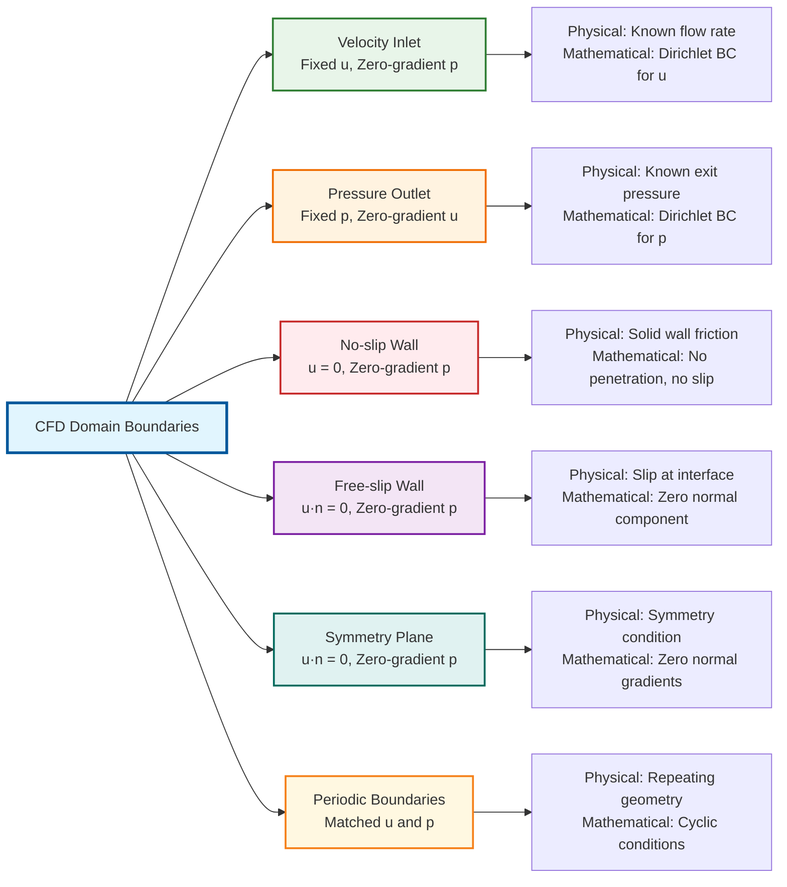
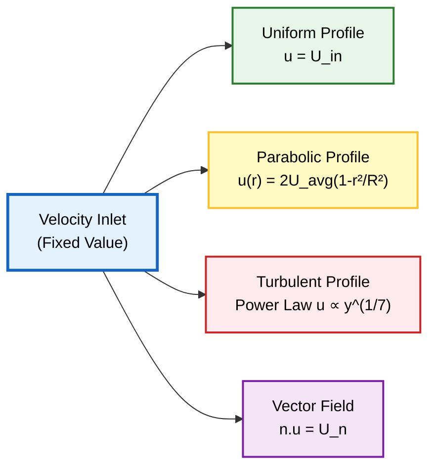
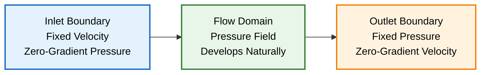
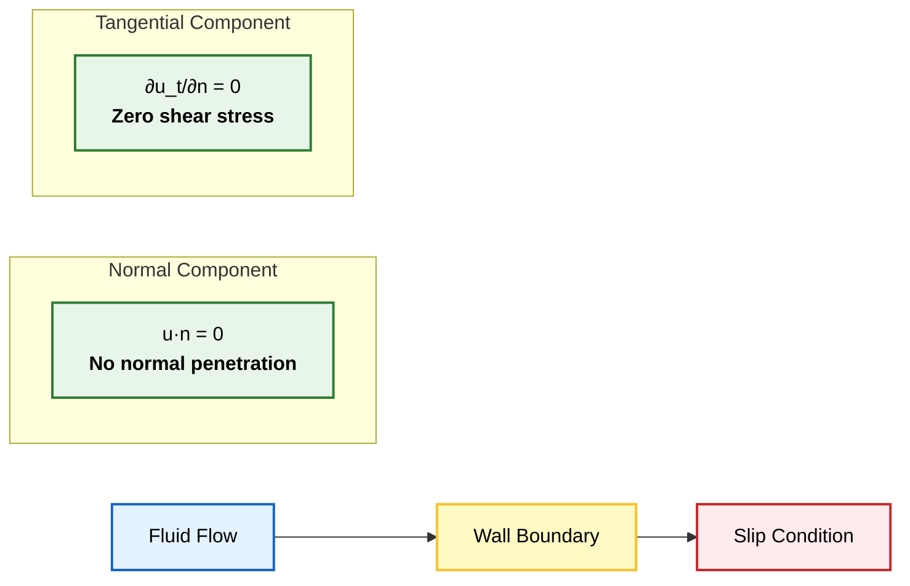
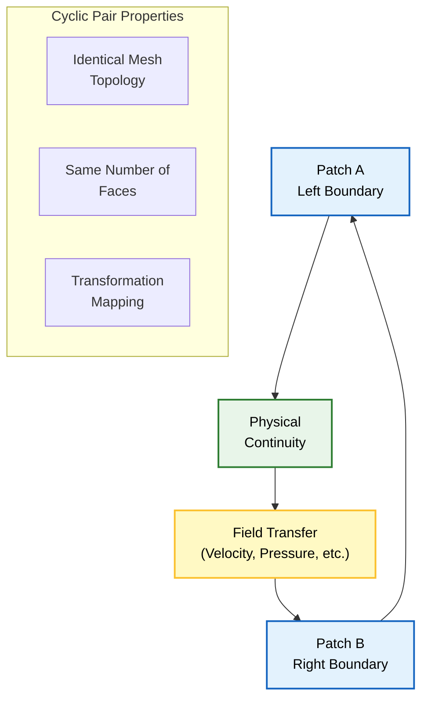
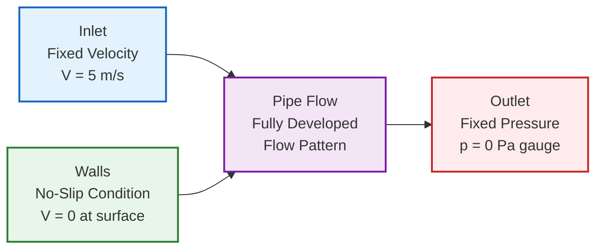

# คู่มือการเลือก: ควรใช้ Boundary Condition ใด?

เมื่อกำหนด **Boundary Condition** สำหรับการจำลองพลศาสตร์ของไหลเชิงคำนวณ (CFD) ใน OpenFOAM การเลือกคู่ Boundary Condition ของความเร็วและความดันที่เหมาะสมเป็นสิ่งสำคัญอย่างยิ่งต่อเสถียรภาพเชิงตัวเลขและความสมจริงทางกายภาพ

คู่มือต่อไปนี้จะสรุปการกำหนดค่า Boundary Condition ที่พบบ่อยที่สุดสำหรับสถานการณ์การไหลทั่วไป โดยให้ทั้งประเภท Boundary Condition ของ OpenFOAM ที่แนะนำและเหตุผลทางกายภาพเบื้องหลังการเลือก

---

## การจำแนกสถานการณ์การไหลและการเลือก BC

การเลือก Boundary Condition ที่เหมาะสมขึ้นอยู่กับลักษณะทางกายภาพของปัญหาการไหลและความสมบูรณ์ทางคณิตศาสตร์ของระบบที่ได้

ในการจำลอง **การไหลที่อัดตัวไม่ได้ (incompressible flow)** สมการ Navier-Stokes สำหรับการไหลที่อัดตัวไม่ได้ที่เชื่อมโยงกับสมการ Continuity Equation ต้องการความสมดุลที่เหมาะสมระหว่าง Boundary Condition ของความเร็วและความดันเพื่อให้มั่นใจถึงความสอดคล้องทางคณิตศาสตร์

### สมการควบคุมพื้นฐานสำหรับการไหลที่อัดตัวไม่ได้

**สมการ Continuity Equation:**
$$\nabla \cdot \mathbf{u} = 0$$

**สมการ Momentum Equation:**
$$\rho \frac{\partial \mathbf{u}}{\partial t} + \rho (\mathbf{u} \cdot \nabla) \mathbf{u} = -\nabla p + \mu \nabla^2 \mathbf{u} + \mathbf{f}$$

**ตัวแปร:**
- $\mathbf{u}$ = **Velocity Vector** (เวกเตอร์ความเร็ว)
- $p$ = **Pressure** (ความดัน)
- $\rho$ = **Density** (ความหนาแน่น)
- $\mu$ = **Dynamic Viscosity** (ความหนืดพลศาสตร์)
- $\mathbf{f}$ = **Body Forces** (แรงภายนอก)

---


> **Figure 1:** การแมปขอบเขตทางกายภาพเข้ากับข้อจำกัดทางคณิตศาสตร์ในโดเมน CFD แสดงการจับคู่สถานการณ์จริง (เช่น ทางเข้า ทางออก ผนัง) เข้ากับประเภทเงื่อนไขขอบเขตที่สอดคล้องกันเพื่อความสมบูรณ์ของแบบจำลอง


| Flow Situation | Velocity BC | Pressure BC | Physical Justification | Best Use Case |
| :--- | :--- | :--- | :--- | :--- |
| **ทางเข้า (ความเร็วที่ทราบ)** | `fixedValue` | `zeroGradient` | กำหนดโปรไฟล์ความเร็วขาเข้า, ความดันพัฒนาขึ้นเองตามธรรมชาติ | การไหลในท่อที่พัฒนาเต็มที่ |
| **ทางเข้า (ความดันที่ทราบ)** | `pressureInletVelocity` | `fixedValue` | การไหลที่ขับเคลื่อนด้วยความดัน, ความเร็วคำนวณจาก Pressure Gradient | การไหลแรงดัน, ระบบปั๊ม |
| **ทางออก (บรรยากาศ)** | `zeroGradient` | `fixedValue` | การระบายออกสู่สภาวะแวดล้อมอย่างอิสระ | ท่อนำออกสู่บรรยากาศ |
| **ผนัง (No-Slip)** | `noSlip` (หรือ `fixedValue` 0) | `zeroGradient` | เงื่อนไข No-Slip แบบหนืด, Pressure Gradient เกิดขึ้นเองตามธรรมชาติ | ผนังแข็งทุกประเภท |
| **ระนาบสมมาตร** | `symmetry` | `symmetry` | สมมาตรแบบสะท้อนรอบ Boundary | การจำลองครึ่งส่วนเพื่อประหยัดพื้นที่ |
| **ผนังเคลื่อนที่** | `movingWallVelocity` | `zeroGradient` | การเคลื่อนที่ของผนังที่กำหนดพร้อมผลกระทบจากความหนืด | แถบเคลื่อนที่, rotor |
| **การไหลอิสระ** | `freestreamVelocity` | `freestreamPressure` | Boundary Condition ระยะไกลสำหรับการไหลภายนอก | อากาศพลศาสตร์ภายนอก |
| **แบบ Cyclic/Periodic** | `cyclic` | `cyclic` | Boundary ของโดเมนแบบ Periodic สำหรับสมมาตร | ช่องทางซ้ำ, heat exchangers |

---

## แนวทางการใช้งานโดยละเอียด

### ทางเข้าที่มีความเร็วที่ทราบ

สำหรับกรณีที่โปรไฟล์ความเร็วขาเข้าถูกกำหนดไว้ (เช่น การไหลในท่อที่พัฒนาเต็มที่ หรือการไหลภายนอกที่มีความเร็ว Freestream ที่ทราบ) ควรใช้ Boundary Condition แบบ `fixedValue` กับ Velocity Field

**เงื่อนไขนี้จะระบุ Velocity Vector โดยตรงที่ทุก Boundary Face**


> **Figure 2:** ประเภทของโปรไฟล์ความเร็วที่ทางเข้า (Velocity Inlet) แสดงรูปแบบการกระจายความเร็วที่แตกต่างกัน เช่น โปรไฟล์แบบสม่ำเสมอ พาราโบลา หรือแบบปั่นป่วน ตามพารามิเตอร์ที่กำหนด


```cpp
// 0/U file
dimensions      [0 1 -1 0 0 0 0];
internalField   uniform 0;

boundaryField
{
    inlet
    {
        type            fixedValue;
        value           uniform (10 0 0);  // Uniform inlet velocity of 10 m/s in x-direction
    }

    outlet
    {
        type            zeroGradient;
    }

    walls
    {
        type            noSlip;
    }
}
```

Boundary ของความดันที่สอดคล้องกันจะต้องใช้ `zeroGradient` เพื่อให้ Pressure Field พัฒนาขึ้นเองตามธรรมชาติจากพลศาสตร์ของการไหล

**เงื่อนไขนี้บังคับให้ $\nabla p \cdot \mathbf{n} = 0$ ที่ทางเข้า** โดยที่ $\mathbf{n}$ คือ **Outward Normal Vector** ซึ่งทำให้มั่นใจว่า Pressure Gradient ที่ตั้งฉากกับ Boundary จะเป็นศูนย์

```cpp
// 0/p file
dimensions      [1 -1 -2 0 0 0 0];
internalField   uniform 0;

boundaryField
{
    inlet
    {
        type            zeroGradient;
    }

    outlet
    {
        type            fixedValue;
        value           uniform 0;
    }

    walls
    {
        type            zeroGradient;
    }
}
```

**เหตุผลทางกายภาพ:**
เงื่อนไข Zero-Gradient Pressure ที่ทางเข้าซึ่งระบุความเร็วไว้ จะช่วยให้ Pressure Field ปรับตัวเพื่อรักษา Continuity ตลอดทั้งโดเมน ในขณะที่ยังคงเคารพการกระจายความเร็วที่กำหนด


> **Figure 3:** การจับคู่เงื่อนไขขอบเขตทั่วไปสำหรับการไหลแบบคงที่ โดยใช้การกำหนดความเร็วที่ทางเข้าและการกำหนดความดันที่ทางออก เพื่อให้สนามความดันและความเร็วภายในโดเมนพัฒนาขึ้นอย่างสมดุล


สำหรับกรณีที่ความดันขาเข้าถูกกำหนดไว้ (เช่น การไหลที่ขับเคลื่อนด้วยความดันจากปั๊ม หรือระบบที่มี Pressure Head ที่ทราบ) ควรใช้ `fixedValue` กับ Pressure Field และ `pressureInletVelocity` กับ Velocity Field

**เงื่อนไขนี้จะคำนวณ Velocity โดยอัตโนมัติจาก Pressure Gradient**

#### OpenFOAM Code Implementation

```cpp
// 0/p file
dimensions      [1 -1 -2 0 0 0 0];
internalField   uniform 0;

boundaryField
{
    inlet
    {
        type            fixedValue;
        value           uniform 1000;  // Inlet pressure in Pa
    }

    outlet
    {
        type            fixedValue;
        value           uniform 0;     // Reference pressure
    }

    walls
    {
        type            zeroGradient;
    }
}

// 0/U file
dimensions      [0 1 -1 0 0 0 0];
internalField   uniform 0;

boundaryField
{
    inlet
    {
        type            pressureInletVelocity;
        value           uniform (0 0 0);  // Initial guess
    }

    outlet
    {
        type            zeroGradient;
    }

    walls
    {
        type            noSlip;
    }
}
```

**เหตุผลทางกายภาพ:**
เงื่อนไขนี้เหมาะสำหรับการไหลที่ขับเคลื่อนด้วยความดัน โดย Velocity จะพัฒนาขึ้นเพื่อสมดุลกับ Pressure Gradient ที่กำหนด

---

### ทางออกสู่บรรยากาศ

สำหรับกรณีที่ของไหลไหลออกสู่สภาวะแวดล้อม ควรใช้ `fixedValue` กับ Pressure Field (โดยทั่วไปตั้งค่าเป็น 0 สำหรับ Gauge Pressure) และ `zeroGradient` กับ Velocity Field

**เงื่อนไขนี้จะอนุญาตให้ของไหลไหลออกได้อย่างอิสระโดยไม่มีการกีดกัน**

#### OpenFOAM Code Implementation

```cpp
// 0/p file
outlet
{
    type            fixedValue;
    value           uniform 0;  // Atmospheric pressure (gauge)
}

// 0/U file
outlet
{
    type            zeroGradient;
}
```

> [!WARNING] **ข้อควรระวัง**
> เงื่อนไข `zeroGradient` สำหรับ Velocity ที่ Outlet อาจทำให้เกิดปัญหาหากมีการไหลย้อนกลับ (Backflow) พิจารณาใช้ `inletOutlet` หรือ `pressureInletOutletVelocity` สำหรับกรณีนี้

---

### ผนัง No-Slip

เงื่อนไข **No-Slip** เป็นเงื่อนไขมาตรฐานสำหรับผนังแข็งในการไหลแบบหนืด (viscous flow) โดย Fluid Velocity จะตรงกับ Wall Velocity (โดยทั่วเป็นศูนย์สำหรับผนังที่หยุดนิ่ง)

**การแสดงทางคณิตศาสตร์:**
$$\mathbf{u} = \mathbf{u}_{\text{wall}}$$

สำหรับผนังที่หยุดนิ่ง: $\mathbf{u} = \mathbf{0}$

#### OpenFOAM Code Implementation

```cpp
// 0/U file
walls
{
    type            noSlip;  // Modern standard shorthand
    // เทียบเท่ากับ:
    // type            fixedValue;
    // value           uniform (0 0 0);
}

// 0/p file
walls
{
    type            zeroGradient;
}
```

**เหตุผลทางกายภาพ:**
เงื่อนไข No-Slip จำลอง **การยึดเกาะของความหนืด** ที่ Solid Boundary ซึ่งเป็นลักษณะสำคัญของการไหลแบบหนืด (viscous flow)

---

### ผนัง Free-Slip

เงื่อนไข **Slip** จำลอง Boundary ที่ **ไม่มี Shear Stress** ทำให้ของไหลสามารถเลื่อนไปตามพื้นผิวได้อย่างอิสระ

**การใช้งาน:**
- Symmetry Plane
- Inviscid Wall
- Free Surface

**การแสดงทางคณิตศาสตร์:**
$$\mathbf{u} \cdot \mathbf{n} = 0 \quad \text{(no normal penetration)}$$
$$\frac{\partial \mathbf{u}_t}{\partial n} = 0 \quad \text{(zero tangential shear)}$$

#### OpenFOAM Code Implementation

```cpp
// 0/U file
walls
{
    type            slip;
}
```


> **Figure 4:** หลักการทางกายภาพของเงื่อนไขขอบเขตแบบ Slip แสดงพฤติกรรมของของไหลที่ผิวในอุดมคติที่ไม่มีแรงเสียดทาน โดยมีความเร็วแนวฉากเป็นศูนย์แต่สามารถลื่นไถลในแนวสัมผัสได้โดยไม่มีความเค้นเฉือน


เงื่อนไข **Symmetry** บังคับใช้**สมมาตรทางเรขาคณิตและทางกายภาพ**ข้ามระนาบหรือขอบเขต

**เงื่อนไขทางคณิตศาสตร์:**

1. **ข้อจำกัดความเร็วแนวตั้งฉาก:**
   $$\mathbf{n} \cdot \mathbf{u} = 0 \quad \text{(ความเร็วแนวตั้งฉาก = 0)}$$

2. **การจัดการสนามสเกลาร์ (อุณหภูมิ, ความดัน):**
   $$\frac{\partial \phi}{\partial n} = 0 \quad \text{(Gradient แนวตั้งฉากเป็นศูนย์)}$$

#### OpenFOAM Code Implementation

```cpp
// 0/U file
symmetryPlane
{
    type            symmetry;
}

// 0/p file
symmetryPlane
{
    type            symmetry;
}
```

**สถานการณ์การประยุกต์ใช้:**
- จำลองเพียงครึ่งหนึ่งของรูปทรงเรขาคณิตที่มีสมมาตร (ท่อ, ช่อง, ปีกเครื่องบิน)
- การไหลแบบ **Axisymmetric** ที่จำลองภาพตัดขวาง 2D ของปัญหา 3D ที่มีสมมาตรการหมุน
- การไหลที่ฟิสิกส์และรูปทรงเรขาคณิตสะท้อนกันอย่างสมบูรณ์ข้ามระนาป

---

### ผนังเคลื่อนที่

สำหรับผนังที่เคลื่อนที่ (เช่น แถบลำเลียง หรือ rotor) ควรใช้ `movingWallVelocity` ซึ่งจะพิจารณาทั้งความเร็วของผนังและการเคลื่อนที่ของ Mesh

#### OpenFOAM Code Implementation

```cpp
// 0/U file
movingWall
{
    type            movingWallVelocity;
    value           uniform (1 0 0);  // Wall velocity in m/s
}

// 0/p file
movingWall
{
    type            zeroGradient;
}
```

---

### การไหลอิสระ (Freestream)

สำหรับการไหลภายนอก (External Flow) เช่น อากาศพลศาสตร์ ควรใช้ `freestreamVelocity` และ `freestreamPressure` สำหรับ Boundary ระยะไกล

#### OpenFOAM Code Implementation

```cpp
// 0/U file
freestream
{
    type            freestreamVelocity;
    freestreamValue uniform (10 0 0);  // Freestream velocity
}

// 0/p file
freestream
{
    type            freestreamPressure;
    freestreamValue uniform 0;         // Reference pressure
}
```

---

### Boundary Condition แบบ Cyclic/Periodic

**Cyclic Boundary** เชื่อมต่อ Patch ขอบเขตสองส่วนที่แตกต่างกัน โดยบังคับใช้ความต่อเนื่องของค่า Field

**สำหรับ Field $\phi$ ที่ใช้กับ Cyclic Boundary Conditions:**
$$\phi_{\text{patch A}}(\mathbf{x}) = \phi_{\text{patch B}}(\mathbf{T}(\mathbf{x}))$$

โดยที่:
- $\mathbf{T}$ = การแปลงทางเรขาคณิตที่แมปพิกัดจาก Patch A ไปยัง Patch B
- $\phi$ = Field ที่ถูกบังคับใช้เงื่อนไข

#### OpenFOAM Code Implementation

```cpp
// 0/U file
left
{
    type            cyclic;
}

right
{
    type            cyclic;
}

// 0/p file
left
{
    type            cyclic;
}

right
{
    type            cyclic;
}
```


> **Figure 5:** กรอบแนวคิดสำหรับเงื่อนไขขอบเขตแบบเป็นคาบ (Cyclic) แสดงความต่อเนื่องทางกายภาพและการส่งผ่านข้อมูลของสนามตัวแปรระหว่างขอบเขตคู่ที่ระบุ เพื่อจำลองรูปทรงเรขาคณิตที่ซ้ำกัน


### ตารางสรุปปัญหา

| Symptom | Probable Cause | Solution |
| :--- | :--- | :--- |
| **Divergence ที่ Inlet** | U และ p ไม่สอดคล้องกัน | ตรวจสอบ: หาก U ถูกกำหนดค่าตายตัว (fixed), p ควรเป็น zeroGradient |
| **Inflow ที่ Outlet** | Vortices พุ่งชน Outlet | ใช้ `inletOutlet` หรือขยาย Domain ปลายน้ำ |
| **High Velocity ที่ Wall** | ประเภท BC ผิด | ตรวจสอบให้แน่ใจว่าใช้ `noSlip` หรือ `fixedValue (0 0 0)` |
| **Pressure Drifting** | Boundary Condition ประเภท Neumann ทั้งหมด | กำหนดค่าความดันที่จุดใดจุดหนึ่ง (Reference Pressure) |

---

### ปัญหาที่ 1: Divergence ที่ Inlet

**Problem Description:**
การจำลองเกิด **Divergence** หลังจากเริ่มต้นไม่นาน โดยค่า Residuals พุ่งสูงขึ้นอย่างรวดเร็วที่ Boundary ของ Inlet

**Root Cause:**
ปัญหาพื้นฐานเกิดจากการ **กำหนด Boundary Condition มากเกินไป (over-specification)**

เมื่อทั้ง Velocity และ Pressure ถูกกำหนดค่าตายตัวที่ Boundary เดียวกัน ระบบจะถูกจำกัดเงื่อนไขทางคณิตศาสตร์มากเกินไป

**Proper Implementation:**

```cpp
// สำหรับ Velocity Inlet (แนะนำ)
U
{
    type            fixedValue;
    value           uniform (10 0 0);  // กำหนดค่า Velocity ที่ Inlet
}

p
{
    type            zeroGradient;      // เงื่อนไขการไหลออกตามธรรมชาติ
}
```

---

### ปัญหาที่ 2: Inflow ที่ Outlet

**Problem Description:**
ของไหลไหล **เข้าสู่** Computational Domain ผ่าน Boundary ของ Outlet

**Solution 1: inletOutlet Boundary Condition**

```cpp
U
{
    type            inletOutlet;
    inletValue      uniform (0 0 0);      // Velocity หากมีการไหลย้อนกลับ
    value           uniform (0 0 0);      // ค่าเริ่มต้น
}
```

เงื่อนไข `inletOutlet` จะสลับระหว่าง `zeroGradient` และ `fixedValue` โดยอัตโนมัติตามทิศทางการไหล:
- `zeroGradient` เมื่อการไหลออก (normal flux > 0)
- `fixedValue` เมื่อการไหลเข้า (normal flux < 0)

**Solution 2: Domain Extension**

วิธีแก้ไขที่แข็งแกร่งที่สุดคือการทำให้ Outlet อยู่ไกลจากปลายน้ำมากพอ:

| การไหล | ระยะ Outlet ที่แนะนำ | เท่าของเส้นผ่านศูนย์กลางไฮดรอลิก |
| :--- | :--- | :--- |
| **Laminar** | 10-15 เท่า | 10-15 |
| **Turbulent** | 20-30 เท่า | 20-30 |
| **Separating flows** | 30-50 เท่า | 30-50 |

---

### ปัญหาที่ 3: Pressure Drifting

**Problem Description:**
ค่า **Absolute Pressure** เพิ่มขึ้นหรือลดลงอย่างต่อเนื่องตลอดการจำลอง

**Solutions:**

**Option 1: Reference Pressure Point**
```cpp
// ใน fvSolution
PISO
{
    pRefPoint        (0.05 0.05 0);    // ตำแหน่งเซลล์อ้างอิง
    pRefValue        0;                 // ค่า Pressure อ้างอิง
}
```

**Option 2: Pressure Reference Patch**
```cpp
// กำหนด Pressure ที่ Boundary หนึ่ง
p
{
    type            fixedValue;
    value           uniform 0;          // กำหนด Reference Pressure
}
```

---

## แนวทางการเลือก BC สำหรับสถานการณ์เฉพาะ

### การไหลในท่อ (Pipe Flow)

```cpp
// Inlet
U
{
    type            fixedValue;
    value           uniform (5 0 0);
}

p
{
    type            zeroGradient;
}

// Outlet
U
{
    type            zeroGradient;
}

p
{
    type            fixedValue;
    value           uniform 0;
}

// Walls
U
{
    type            noSlip;
}

p
{
    type            zeroGradient;
}
```


> **Figure 6:** การตั้งค่าการไหลในท่อแบบพัฒนาเต็มที่ แสดงความสัมพันธ์ระหว่างเงื่อนไขขาเข้า ขาออก และเงื่อนไข No-Slip ที่ผนัง เพื่อสร้างรูปแบบการไหลที่สมดุลและสอดคล้องกับทฤษฎี


```cpp
// Inlet
U
{
    type            fixedValue;
    value           uniform (10 0 0);
}

p
{
    type            zeroGradient;
}

// Outlet
U
{
    type            zeroGradient;
}

p
{
    type            fixedValue;
    value           uniform 0;
}

// Freestream
U
{
    type            freestreamVelocity;
    freestreamValue uniform (10 0 0);
}

p
{
    type            freestreamPressure;
    freestreamValue uniform 0;
}
```

---

### การไหลแบบ Periodic (Periodic Flow)

```cpp
// Cyclic boundaries
U
{
    type            cyclic;
}

p
{
    type            cyclic;
}
```

---

## บทสรุป

**การเลือกและการนำ Boundary Condition ไปใช้อย่างเหมาะสม** เป็นพื้นฐานสำคัญสำหรับการจำลอง CFD ที่แม่นยำ เนื่องจากมีอิทธิพลอย่างมากต่อ:

- **Flow Physics** - ลักษณะการไหลที่เป็นจริง
- **Solution Stability** - ความเสถียรของการคำนวณ
- **Convergence** - การลู่เข้าสู่คำตอบ
- **Physical Accuracy** - ความถูกต้องทางกายภาพ

การทำความเข้าใจหลักการของแต่ละ Boundary Condition จะช่วยให้สามารถเลือกใช้ได้อย่างเหมาะสมกับปัญหาที่ต้องการแก้ไข

---

## แหล่งอ้างอิงเพิ่มเติม

- [[01_Introduction]] - ภาพรวมของ Boundary Conditions
- [[02_Fundamental_Classification]] - การจำแนกประเภทพื้นฐาน
- [[04_Mathematical_Formulation]] - การกำหนดสูตรทางคณิตศาสตร์
- [[05_Common_Boundary_Conditions_in_OpenFOAM]] - Boundary Conditions ทั่วไปใน OpenFOAM
- [[07_Troubleshooting_Boundary_Conditions]] - การแก้ไขปัญหา Boundary Condition
