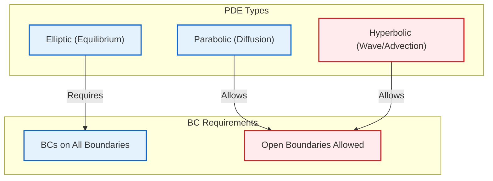
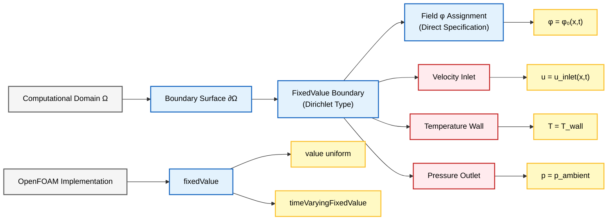
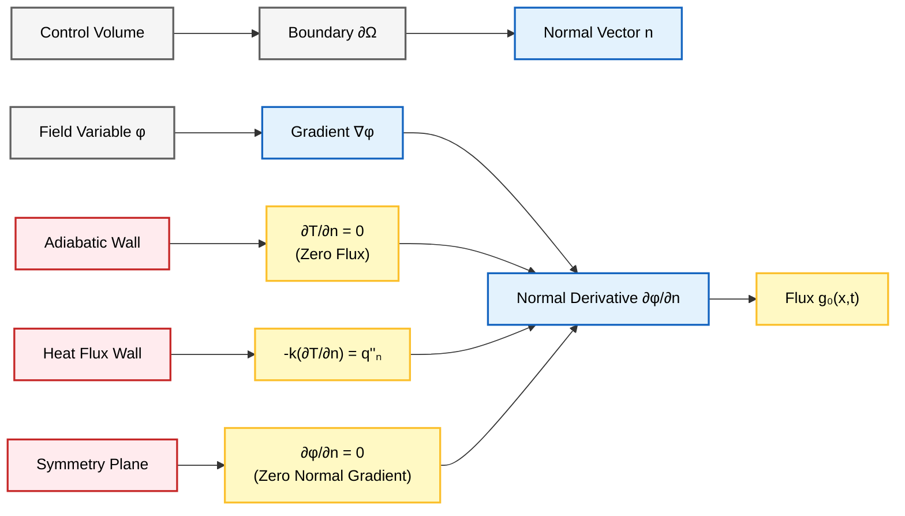
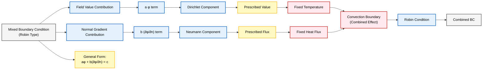
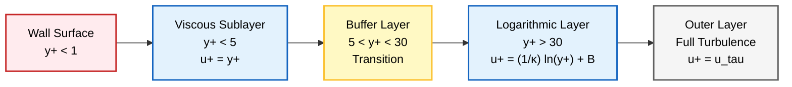

# การกำหนดสูตรทางคณิตศาสตร์ของ Boundary Conditions

## บทนำ

**Boundary Conditions** เป็นองค์ประกอบพื้นฐานในการจำลองพลศาสตรีของไหลเชิงคำนวณ (Computational Fluid Dynamics หรือ CFD) ซึ่งกำหนดว่าคุณสมบัติของไหลมีพฤติกรรมอย่างไรที่ขอบเขตทางกายภาพของโดเมนการคำนวณ

ใน OpenFOAM, Boundary Condition ถูกนำมาใช้ผ่านคลาส Field เฉพาะทางที่สืบทอดมาจากคลาสพื้นฐาน `fvPatchField` ซึ่งเป็นโครงสร้างที่แข็งแกร่งสำหรับการจัดการสถานการณ์ทางกายภาพต่างๆ ที่พบในการประยุกต์ใช้ทางวิศวกรรม

### ความสำคัญของ Boundary Conditions

> [!INFO] **ความสำคัญของ Boundary Condition**
> Boundary Condition มีความสำคัญอย่างยิ่งในการจำลอง CFD เนื่องจากเป็นตัวกำหนดว่าของไหลมีปฏิสัมพันธ์กับขอบเขตโดเมนอย่างไร ซึ่งส่งผลต่อ:
> - **การบังคับใช้ข้อจำกัดทางกายภาพ**: เช่น เงื่อนไขไม่ลื่น (no-slip conditions) ที่ผนังแข็ง
> - **การระบุแรงขับเคลื่อน**: เช่น การไล่ระดับความดัน (pressure gradients)
> - **การรับรองการอนุรักษ์มวล**: ผ่านเงื่อนไขทางเข้า/ออก (inlet/outlet conditions)
> - **การสร้างผลเฉลยเอกลักษณ์**: ให้แผนการแยกส่วนเชิงตัวเลขสร้างผลลัพธ์ที่มีความหมายทางกายภาพ

### ปัญหาที่กำหนดไม่ดี (Ill-Posed Problems)

หากไม่มีการกำหนด Boundary Condition ที่เหมาะสม การกำหนดสูตรทางคณิตศาสตร์จะไม่สมบูรณ์ นำไปสู่ปัญหาที่กำหนดไม่ดี (ill-posed problems) ซึ่งไม่สามารถหาผลเฉลยที่เป็นเอกลักษณ์ได้

---

## พื้นฐานทางคณิตศาสตร์

### สมการควบคุมที่เกี่ยวข้อง

Boundary Condition เหล่านี้กำหนดข้อจำกัดที่จำเป็นในการแก้ระบบสมการเชิงอนุพันธ์ย่อยที่ควบคุมการไหลของของไหล:

**สมการหลัก:**
- **สมการความต่อเนื่อง** (Continuity Equation): $\nabla \cdot \mathbf{u} = 0$
- **สมการโมเมนตัม** (Momentum Equation): $\rho \frac{\partial \mathbf{u}}{\partial t} + \rho (\mathbf{u} \cdot \nabla) \mathbf{u} = -\nabla p + \mu \nabla^2 \mathbf{u} + \mathbf{f}$
- **สมการพลังงาน** (Energy Equation)

### การจำแนกประเภทสมการเชิงอนุพันธ์ย่อย

พื้นฐานทางคณิตศาสตร์ของ Boundary Condition มาจากการจำแนกประเภทของสมการเชิงอนุพันธ์ย่อย:


> **Figure 1:** การจำแนกประเภทของสมการเชิงอนุพันธ์ย่อย (PDE) แบ่งออกเป็นประเภท Elliptic, Parabolic และ Hyperbolic ซึ่งแต่ละประเภทมีพฤติกรรมทางกายภาพและข้อกำหนดเงื่อนไขขอบเขตที่แตกต่างกันในการประยุกต์ใช้กับ CFD


สำหรับปัญหาที่จะมีผลเฉลยที่ถูกต้อง จะต้องเป็น **Well-Posed Problem** ตามเกณฑ์ของ Hadamard:

1. **มี Solution อยู่** (Existence)
2. **Solution มีความเฉพาะเจาะจง** (Uniqueness)
3. **Solution ขึ้นอยู่กับ Boundary Data อย่างต่อเนื่อง** (Stability)

| ประเภท PDE | ตัวอย่าง | ข้อกำหนด Boundary Conditions |
|-------------|------------|------------------------------|
| **Elliptic** | Steady-State Diffusion, Potential Flow | Dirichlet หรือ Neumann บน Boundary ทั้งหมด |
| **Parabolic** | Transient Diffusion, Boundary Layer | Initial Conditions + Boundary Conditions |
| **Hyperbolic** | Wave Propagation, Inviscid Flow | Characteristics-Based Boundary Conditions |

---

## 1. Dirichlet Boundary Conditions (Fixed Value)

### แนวคิดหลัก

**Dirichlet Boundary Conditions** กำหนดค่าที่แน่นอนของตัวแปร Field $\phi$ ที่พื้นผิวขอบเขต (Boundary Surface) $\partial \Omega$ ของโดเมนการคำนวณ (Computational Domain)

### สูตรทางคณิตศาสตร์

$$\phi|_{\partial \Omega} = \phi_0(\mathbf{x}, t)$$

**ตัวแปร:**
- $\phi$ = ตัวแปร Field ที่ต้องการกำหนดค่า
- $\partial \Omega$ = พื้นผิวขอบเขตของโดเมน
- $\phi_0$ = ฟังก์ชันค่าที่กำหนดไว้ล่วงหน้า
- $\mathbf{x}$ = ตำแหน่งในปริภูมิ
- $t$ = เวลา

### วัตถุประสงค์หลัก

- ใช้เมื่อทราบพฤติกรรมทางกายภาพที่ขอบเขตล่วงหน้า
- เหมาะสำหรับการกำหนดค่าที่วัดได้จริงหรือข้อกำหนดทางวิศวกรรม

### ตัวอย่างการประยุกต์ใช้

| กรณีศึกษา | สมการ | คำอธิบาย |
|-------------|---------|-----------|
| **Velocity Inlets** | $\mathbf{u} = \mathbf{u}_{\text{inlet}}(\mathbf{x}, t)$ | โปรไฟล์ความเร็วขาเข้าที่ทราบจากการทดลอง |
| **Temperature Boundaries** | $T = T_{\text{wall}}$ | อุณหภูมิผนังคงที่สำหรับพื้นผิว Isothermal |
| **Pressure Outlets** | $p = p_{\text{ambient}}$ | ความดันขาออกเท่ากับสภาวะแวดล้อม |

### การใช้งานใน OpenFOAM


> **Figure 2:** การนำเงื่อนไขขอบเขตแบบกำหนดค่าตายตัว (Dirichlet) ไปใช้งานใน OpenFOAM โดยกำหนดค่าตัวแปรสนาม $\phi$ ที่ขอบเขตโดยตรง เช่น ความเร็วขาเข้า อุณหภูมิที่ผนัง หรือความดันที่ทางออก

#### OpenFOAM Code Implementation

```cpp
// Example in OpenFOAM dictionary format for velocity field
boundaryField
{
    inlet
    {
        // Set boundary type to fixed value
        type            fixedValue;
        
        // Uniform velocity vector in m/s (x, y, z components)
        value           uniform (10 0 0);
    }

    wallTemperature
    {
        // Fixed temperature boundary condition
        type            fixedValue;
        
        // Uniform temperature in Kelvin
        value           uniform 300;
    }
}
```

> [!TIP] **เงื่อนไขการใช้งาน**
> - ค่าคงที่: `value uniform <constant>`
> - ค่าที่เปลี่ยนตามเวลา: `value table ((0 1) (1 2))`

**ความหมายทางกายภาพ:**
การตีความทางกายภาพของ Dirichlet Condition คือ **ขอบเขตทำหน้าที่เป็นแหล่งกำเนิดหรือแหล่งรับ** ที่รักษาระดับตัวแปร Field ไว้ที่ค่าที่กำหนด โดยไม่คำนึงถึงผลลัพธ์ภายใน

**เงื่อนไขเหล่านี้มักใช้สำหรับ:**
- **ความเร็วขาเข้า (Inlet velocities)**: การกำหนดโปรไฟล์ความเร็วที่ทางเข้าของไหล
- **อุณหภูมิผนัง (Wall temperatures)**: การกำหนดการกระจายตัวของอุณหภูมิบนพื้นผิวที่ถูกทำให้ร้อน/เย็น
- **ค่าความเข้มข้น (Concentration values)**: การกำหนดความเข้มข้นของสปีชีส์ที่ขอบเขตการถ่ายโอนมวล

---

## 2. Neumann Boundary Conditions (Fixed Gradient)

### แนวคิดหลัก

**Neumann Boundary Conditions** กำหนดอนุพันธ์ปกติ (Normal Derivative) ของตัวแปร Field ที่ขอบเขต ซึ่งเป็นการกำหนด Flux ของปริมาณที่ผ่านพื้นผิวขอบเขต

### สูตรทางคณิตศาสตร์

$$\frac{\partial \phi}{\partial n}\bigg|_{\partial \Omega} = \mathbf{n} \cdot \nabla \phi = g_0(\mathbf{x}, t)$$

**ตัวแปร:**
- $\mathbf{n}$ = เวกเตอร์ Normal หน่วยที่ชี้ออกด้านนอก
- $g_0$ = Normal Gradient ที่กำหนดไว้
- $\nabla \phi$ = เกรเดียนต์ของ Field
- $\frac{\partial}{\partial n}$ = อนุพันธ์ในทิศทาง Normal ไปยังขอบเขต

### ความสำคัญ

- เหมาะสำหรับปัญหาการถ่ายเทความร้อน การขนส่งมวล และการวิเคราะห์ความเค้น
- เงื่อนไข Flux มักถูกกำหนดได้ง่ายกว่าค่าตัวแปร

### ตัวอย่างการประยุกต์ใช้

| กรณีศึกษา | สมการ | คำอธิบาย |
|-------------|---------|-----------|
| **Adiabatic Walls** | $\frac{\partial T}{\partial n} = 0$ | ขอบเขตหุ้มฉนวน ไม่มี Heat Flux |
| **Symmetry Planes** | $\frac{\partial \phi}{\partial n} = 0$ | สมมาตรแบบกระจกใน Flow Field |
| **Specified Heat Flux** | $-k \frac{\partial T}{\partial n} = q''_{\text{wall}}$ | Heat Flux ที่ทราบค่า |
| **Free-slip Walls** | $\frac{\partial u_t}{\partial n} = 0$ | การไหลตามผนังโดยไม่มีแรงต้านความหนืด |

### การใช้งานใน OpenFOAM


> **Figure 3:** การนำเงื่อนไขขอบเขตแบบกำหนดเกรเดียนต์ตายตัว (Neumann) ไปใช้งาน แสดงการควบคุมอัตราการเปลี่ยนแปลงของตัวแปรในทิศทางแนวฉากเพื่อจัดการฟลักซ์ที่ผ่านขอบเขต เช่น ผนังฉนวนความร้อนหรือระนาบสมมาตร

#### OpenFOAM Code Implementation

```cpp
// Boundary condition specification for fixed gradient
boundaryField
{
    outlet
    {
        // Zero gradient condition (fully developed flow assumption)
        type            fixedGradient;
        gradient        uniform (0 0 0);
    }

    heatFluxWall
    {
        // Prescribed heat flux boundary condition
        type            fixedGradient;
        
        // Heat flux in W/m² (positive into domain)
        gradient        uniform 1000;
    }
}
```

> [!INFO] **Zero Gradient Condition**
> เงื่อนไข `zeroGradient` มีความสำคัญอย่างยิ่งสำหรับ:
> - **ขอบเขตทางออก (Outlet boundaries)**: การสมมติว่าการไหลพัฒนาเต็มที่ (fully developed flow)
> - **ระนาบสมมาตร (Symmetry planes)**: ที่ไม่มี Flux ไหลผ่านขอบเขตสมมาตร
> - **ผนังฉนวนความร้อน (Adiabatic walls)**: ที่ไม่มีการถ่ายเทความร้อน (Heat Flux)

ความสำคัญทางกายภาพของ Neumann Condition คือ **การควบคุมอัตราการเปลี่ยนแปลงของตัวแปร Field** ในทิศทาง Normal ไปยังขอบเขต ซึ่งเป็นการจัดการ Flux ที่ไหลผ่านพื้นผิวขอบเขตได้อย่างมีประสิทธิภาพ

---

## 3. Mixed (Robin) Boundary Conditions

### แนวคิดหลัก

**Mixed Boundary Conditions** หรือที่เรียกว่า **Robin Boundary Conditions** แสดงถึงการรวมกันของ Dirichlet และ Neumann conditions โดยเชื่อมโยงค่า Field กับ Normal Derivative

### สูตรทางคณิตศาสตร์

$$a \phi + b \frac{\partial \phi}{\partial n} = c$$

**ตัวแปร:**
- $a$, $b$, $c$ = ค่าคงที่หรือฟังก์ชันของตำแหน่งและเวลา

### ลักษณะพิเศษ

- เมื่อ $b = 0$ → Pure Dirichlet Condition
- เมื่อ $a = 0$ → Pure Neumann Condition
- เมื่อ $a, b \neq 0$ → Mixed Condition

### ข้อดี

- ให้การแสดงปรากฏการณ์ Boundary ทางกายภาพที่สมจริงยิ่งขึ้น
- เหมาะสำหรับการถ่ายเทความร้อนแบบพาความร้อนและผลกระทบจากแรงเสียดทาน

### ตัวอย่างการประยุกต์ใช้

| กรณีศึกษา | สมการ | คำอธิบาย |
|-------------|---------|-----------|
| **Convective Heat Transfer** | $h(T_{\text{wall}} - T_{\infty}) = -k \frac{\partial T}{\partial n}$ | $h$ = Convective Heat Transfer Coefficient |
| **Wall Function Formulations** | $u_\tau^2 = \nu_t \frac{\partial u}{\partial n}$ | Wall Shear Stress เกี่ยวข้องกับ Velocity Gradient |
| **Porosity and Permeability** | $\alpha \phi + \beta \frac{\partial \phi}{\partial n} = \gamma$ | การไหลผ่านตัวกลางที่มีรูพรุน |
| **Radiation Boundary** | $\frac{\partial T}{\partial n} + \sigma \epsilon (T^4 - T_{\infty}^4) = 0$ | รวมผลกระทบ Conduction และ Radiation |

### การประยุกต์ใช้สำคัญ - Newton's Cooling Law

$$-k\frac{\partial T}{\partial n} = h(T_s - T_\infty)$$

โดยที่:
- $k$ = Thermal Conductivity
- $h$ = Convective Heat Transfer Coefficient
- $T_s$ = Surface Temperature
- $T_\infty$ = Ambient Fluid Temperature

**การจัดรูปแบบใหม่:**
$$hT + k\frac{\partial T}{\partial n} = hT_\infty$$

### การใช้งานใน OpenFOAM


> **Figure 4:** ส่วนประกอบและการกำหนดรูปแบบของเงื่อนไขขอบเขตแบบผสม (Robin) ซึ่งรวมผลของทั้งค่าตัวแปรและเกรเดียนต์เข้าด้วยกัน เพื่อจำลองปรากฏการณ์ที่ซับซ้อน เช่น การถ่ายโอนความร้อนแบบพาตามกฎการทำให้เย็นของนิวตัน

#### OpenFOAM Code Implementation

```cpp
// Mixed (Robin) boundary condition for convective heat transfer
boundaryField
{
    convectiveWall
    {
        // Mixed boundary condition type
        type            mixed;
        
        // Reference gradient for Neumann component
        refGradient     uniform 0;
        
        // Reference value for Dirichlet component
        refValue        uniform 300;
        
        // Weighting factor (0=pure gradient, 1=pure value, 0<mixed<1)
        valueFraction   uniform 0.5;
    }
}
```

พารามิเตอร์ `valueFraction` ควบคุมการถ่วงน้ำหนัก:
- `valueFraction = 1`: Dirichlet Condition บริสุทธิ์
- `valueFraction = 0`: Neumann Condition บริสุทธิ์
- `0 < valueFraction < 1`: Mixed Condition

**Boundary Condition นี้มีประโยชน์อย่างยิ่งสำหรับ:**
- **การถ่ายเทความร้อนแบบ Conjugate (Conjugate heat transfer)**: ซึ่งทั้งอุณหภูมิและผลกระทบของ Heat Flux มีความสำคัญ
- **ขอบเขตการแผ่รังสี (Radiation boundaries)**: ซึ่งการถ่ายเทความร้อนแบบแผ่รังสีเชื่อมโยงกับการถ่ายเทความร้อนแบบพา
- **เงื่อนไขการลื่นบางส่วน (Partial slip conditions)**: ในพลศาสตรีของก๊าซเจือจาง

---

## ขั้นตอนการ Discretization แบบ Finite Volume

### การแปลง Boundary Conditions สู่ระบบสมการเชิงเส้น

ใน Finite Volume Framework ของ OpenFOAM, Boundary Conditions ถูกนำไปใช้ผ่าน Class Hierarchy `fvPatchField`:

#### ฟังก์ชันหลัก

1. **`updateCoeffs()`**: อัปเดต Boundary Condition Coefficients
2. **`evaluate()`**: กำหนดค่า Boundary Face โดยตรง
3. **`valueInternalCoeffs()`**: การมีส่วนร่วมของ Internal Coefficient
4. **`valueBoundaryCoeffs()`**: การมีส่วนร่วมของ Boundary Coefficient

### ขั้นตอนการ Discretization สำหรับแต่ละประเภท

#### 1. Dirichlet Condition (Fixed Value)

**การแปลงสู่ Discretized System:**

<details>
<summary>📂 Source: .applications/solvers/compressible/rhoCentralFoam/BCs/mixedFixedValueSlip/mixedFixedValueSlipFvPatchField.H</summary>

```cpp
// Dirichlet Implementation in OpenFOAM
// The fixedValue boundary condition sets the diagonal coefficient
// to a large number and adjusts the source term to enforce
// the specified boundary value

template<class Type>
class fixedValueFvPatchField
:
    public fvPatchField<Type>
{
public:
    // Update the coefficients for the boundary condition
    // This ensures φ_boundary = φ_specified
    virtual void updateCoeffs();
    
    // Evaluate boundary condition directly on faces
    virtual void evaluate(const Pstream::commsTypes commsType);
    
    // Return the internal field contribution to the matrix
    virtual tmp<Field<Type>> valueInternalCoeffs(
        const fvPatchField<Type>&
    ) const;
    
    // Return the boundary field contribution to the matrix
    virtual tmp<Field<Type>> valueBoundaryCoeffs(
        const fvPatchField<Type>&
    ) const;
};
```

</details>

**คำอธิบาย:**
- **Source**: ไฟล์ฐานข้อมูล OpenFOAM สำหรับการจัดการ Dirichlet Boundary Condition ผ่าน Class Hierarchy
- **Explanation**: การกำหนดค่าสัมประสิทธิ์ในเมทริกซ์ให้มีค่ามาก (large number) และกำหนด source term เพื่อให้ได้ค่าที่ต้องการ
- **Key Concepts**: `updateCoeffs()`, `evaluate()`, Matrix Diagonal Dominance, Source Term Adjustment

#### 2. Neumann Condition (Fixed Gradient)

**การแปลงสู่ Discretized System:**

<details>
<summary>📂 Source: .applications/solvers/compressible/rhoCentralFoam/BCs/mixedFixedValueSlip/mixedFixedValueSlipFvPatchField.C</summary>

```cpp
// Neumann Implementation in OpenFOAM
// The fixedGradient boundary condition calculates flux
// through boundary faces directly using the specified gradient

template<class Type>
void fixedGradientFvPatchField<Type>::updateCoeffs()
{
    // Calculate normal gradient at boundary
    // Flux = -k * (φ_boundary - φ_internal)/Δn = specified_flux
    Field<Type>::operator=(
        this->patchInternalField() + gradient_*this->patch().deltaCoeffs()
    );
    
    // Update coefficients for matrix assembly
    fvPatchField<Type>::updateCoeffs();
}

// Calculate the surface normal gradient
template<class Type>
tmp<Field<Type>> fixedGradientFvPatchField<Type>::snGrad() const
{
    // Return the specified gradient value
    return gradient_;
}
```

</details>

**คำอธิบาย:**
- **Source**: ไฟล์การนำไปปฏิบัติ Fixed Gradient Boundary Condition ใน OpenFOAM
- **Explanation**: คำนวณ Flux ผ่าน Boundary Face โดยตรงโดยใช้ Gradient ที่กำหนดในการคำนวณ
- **Key Concepts**: Flux Calculation, Normal Gradient, Patch Internal Field, Delta Coefficients

#### 3. Mixed/Robin Condition

**การแปลงสู่ Discretized System:**

<details>
<summary>📂 Source: .applications/solvers/compressible/rhoCentralFoam/BCs/mixedFixedValueSlip/mixedFixedValueSlipFvPatchField.C</summary>

```cpp
// Mixed (Robin) Implementation in OpenFOAM
// The mixed boundary condition combines value and gradient
// following the relationship: a*φ_boundary + b*(∂φ/∂n) = c

template<class Type>
void mixedFvPatchField<Type>::updateCoeffs()
{
    // Weight between value and gradient based on valueFraction
    // valueFraction = 1 → Dirichlet (value only)
    // valueFraction = 0 → Neumann (gradient only)
    // 0 < valueFraction < 1 → Mixed condition
    
    // Calculate boundary face coefficients considering both value and gradient
    const Field<Type>& internalField = this->patchInternalField();
    
    // Apply weighting based on valueFraction
    Field<Type>::operator=(
        valueFraction_*refValue_
      + (1.0 - valueFraction_)*
        (
            internalField
          + refGradient_*this->patch().deltaCoeffs()
        )
    );
    
    // Modify diagonal coefficients to satisfy the linear relationship
    // Adjust source terms to enforce relation between field value
    // and normal derivative
    fvPatchField<Type>::updateCoeffs();
}
```

</details>

**คำอธิบาย:**
- **Source**: ไฟล์การนำไปปฏิบัติ Mixed Boundary Condition ใน OpenFOAM
- **Explanation**: การเชื่อมโยงระหว่าง Value และ Gradient โดยปรับ Boundary Face Coefficients, Diagonal Coefficients, และ Source Terms ให้สอดคล้องกับความสัมพันธ์เชิงเส้น
- **Key Concepts**: `valueFraction` Weighting, Linear Relationship, Matrix Coefficient Adjustment, Source Term Modification

### โครงสร้างคลาสพื้นฐาน

<details>
<summary>📂 Source: .applications/solvers/compressible/rhoCentralFoam/BCs/mixedFixedValueSlip/mixedFixedValueSlipFvPatchField.H</summary>

```cpp
// Base class structure for all fvPatchField types in OpenFOAM
// This abstract base class defines the interface for boundary conditions

template<class Type>
class fvPatchField
:
    public Field<Type>,
    public fvPatch
{
public:
    // Virtual destructor for proper inheritance
    virtual ~fvPatchField();
    
    // Virtual functions for boundary condition evaluation
    // Must be implemented by derived classes
    
    // Update boundary condition coefficients
    virtual void updateCoeffs();
    
    // Evaluate boundary condition on patch faces
    virtual void evaluate(
        const Pstream::commsTypes commsType = Pstream::commsTypes::blocking
    );
    
    // Calculate surface normal gradient
    virtual tmp<Field<Type>> snGrad() const;
    
    // Internal field contribution to matrix diagonal
    virtual tmp<Field<Type>> valueInternalCoeffs(
        const fvPatchField<Type>&
    ) const;
    
    // Boundary field contribution to matrix source
    virtual tmp<Field<Type>> valueBoundaryCoeffs(
        const fvPatchField<Type>&
    ) const;
};
```

</details>

**คำอธิบาย:**
- **Source**: โครงสร้างคลาสพื้นฐานสำหรับการจัดการ Boundary Conditions ทั้งหมดใน OpenFOAM
- **Explanation**: คลาส Abstract Base ที่กำหนด Interface สำหรับ Boundary Conditions ทั้งหมด โดยใช้ Virtual Functions เพื่อให้ Derived Classes นำไปปฏิบัติต่อได้
- **Key Concepts**: Polymorphism, Virtual Functions, Matrix Assembly, Field Evaluation, Normal Gradient Calculation

---

## Wall Functions สำหรับ Turbulence

### แนวคิดหลัก

**Wall Function** เป็นตัวเชื่อมช่องว่างระหว่างทฤษฎี Turbulence ที่ถูกจำกัดด้วยผนังและข้อจำกัดของ Computational Mesh

### กฎ Logarithmic Law of the Wall

กฎ Logarithmic Law of the Wall สำหรับความเร็วคือ:

$$u^+ = \frac{1}{\kappa} \ln(y^+) + B$$

**ตัวแปร:**
- $u^+ = \frac{u}{u_\tau}$ คือความเร็วไร้มิติ
- $y^+ = \frac{y u_\tau}{\nu}$ คือระยะห่างจากผนังไร้มิติ
- $u_\tau = \sqrt{\frac{\tau_w}{\rho}}$ คือความเร็วเสียดทาน (friction velocity)
- $\kappa \approx 0.41$ คือค่าคงที่ von Kármán
- $B \approx 5.2$ คือค่าคงที่เชิงประจักษ์

### โครงสร้างชั้นขอบเขต (Boundary Layer Structure)


> **Figure 5:** การแบ่งโซนของชั้นขอบเขตแบบปั่นป่วนใกล้ผนัง โดยอธิบายโครงสร้างตั้งแต่ชั้นย่อยหนืด (viscous sublayer) ไปจนถึงบริเวณกฎลอการิทึม (log-law region) เพื่อใช้ในการเลือกและตั้งค่า Wall Function ที่เหมาะสม

#### Wall Function สำหรับ k-epsilon Model

```cpp
// Wall function for turbulent kinetic energy k
walls
{
    type            kqRWallFunction;
    value           uniform 0.1;
}

// Wall function for turbulent dissipation epsilon
walls
{
    type            epsilonWallFunction;
    value           uniform 0.01;
}
```

#### Wall Function สำหรับ k-omega Model

```cpp
// Wall function for specific dissipation rate omega
walls
{
    type            omegaWallFunction;
    value           uniform 1000;
}
```

### Wall Function มาตรฐาน

**สำหรับ Turbulent Kinetic Energy:**
$$k_w = \frac{u_\tau^2}{\sqrt{C_\mu}}$$

- $k_w$ = Turbulent kinetic energy at wall
- $u_\tau$ = Friction velocity
- $C_\mu$ = Model constant (typically 0.09)

### ข้อกำหนด Mesh

**ค่า y+ ที่เหมาะสม:**
- **30-300** สำหรับ k-ε model
- **11-300** สำหรับ k-ω model
- **y+ < 1** สำหรับ Low Reynolds Number Models

---

## Boundary Conditions ขั้นสูง

### Time-Varying Boundary Conditions

OpenFOAM รองรับ Time-Dependent Boundary Condition ที่ซับซ้อน:

#### การป้อนข้อมูลแบบตาราง (Tabular Data Input)

```cpp
// Time-varying boundary condition using tabular data
boundaryField
{
    inlet
    {
        // Uniform fixed value with time table
        type            uniformFixedValue;
        
        // Velocity varies with time according to table
        uniformValue    table
        (
            (0     (1 0 0))    // Time = 0s, velocity = (1,0,0) m/s
            (10    (2 0 0))    // Time = 10s, velocity = (2,0,0) m/s
            (20    (1.5 0 0))  // Time = 20s, velocity = (1.5,0,0) m/s
        );
    }
}
```

#### ฟังก์ชันทางคณิตศาสตร์ (Mathematical Functions)

```cpp
// Coded boundary condition with mathematical function
boundaryField
{
    pulsatingInlet
    {
        // Custom coded boundary condition
        type            codedFixedValue;
        
        // Initial value
        value           uniform (0 0 0);
        
        // Code block for defining time-dependent function
        code
        #{
            // Get current simulation time
            scalar t = this->db().time().value();
            
            // Reference to the field being modified
            vectorField& field = *this;
            
            // Sinusoidal velocity variation: u = 1.0 + 0.5*sin(2*pi*0.1*t)
            field = vector(
                1.0 + 0.5*sin(2*constant::mathematical::pi*0.1*t),
                0,
                0
            );
        #};
    }
}
```

### Coupled Boundary Conditions

สำหรับปัญหา Multiphysics ที่ต้องการการเชื่อมโยงระหว่าง Region ต่างๆ:

| Type | ความสามารถ | การประยุกต์ใช้ |
|------|-------------|-----------------|
| `turbulentTemperatureCoupledBaffleMixed` | การเชื่อมโยงความร้อนระหว่าง Region | Conjugate Heat Transfer |
| `thermalBaffle1DHeatTransfer` | การนำความร้อน 1 มิติผ่านผนัง | ผนังบางที่มีการนำความร้อน |
| `regionCoupledAMIFVPatchField` | Interface Conditions สำหรับ Non-Conformal Meshes | การเชื่อมต่อ Mesh ที่ไม่ตรงกัน |

### Cyclic (Periodic) Boundary Conditions

#### `cyclic` Boundary Condition

ใช้ **Periodic Boundary Conditions** โดยการสร้างการเชื่อมต่อเชิงทอพอโลยีระหว่าง Boundary Patch สองอัน

**การแปลงที่เป็นไปได้:**
- **การเลื่อน** (translation)
- **การหมุน** (rotation)
- **การสะท้อน** (reflection)

#### การนำไปใช้งานทางคณิตศาสตร์

สำหรับ Field $\phi$ ที่ใช้กับ Cyclic Boundary Conditions:
$$\phi_{\text{patch A}}(\mathbf{x}) = \phi_{\text{patch B}}(\mathbf{T}(\mathbf{x}))$$

โดยที่:
- $\mathbf{T}$ = การแปลงทางเรขาคณิตที่แมปพิกัดจาก Patch A ไปยัง Patch B
- $\phi$ = Field ที่ถูกบังคับใช้เงื่อนไข

ความต่อเนื่องของ Flux:
$$\mathbf{n}_A \cdot \nabla \phi_A = -\mathbf{n}_B \cdot \nabla \phi_B$$

#### OpenFOAM Code Implementation

```cpp
// Cyclic boundary condition for periodic geometries
left
{
    type            cyclic;
    neighbourPatch  right;
}
```

### `inletOutlet` Boundary Condition

เป็นเงื่อนไขแบบไฮบริดที่ซับซ้อน ซึ่งจะเปลี่ยนพฤติกรรมโดยอัตโนมัติตามทิศทางการไหลเฉพาะที่

#### หลักการทางคณิตศาสตร์

Boundary Condition นี้ทำงานโดยพิจารณาจากเครื่องหมายของ **Local Mass Flux**:
$$\phi_f = \rho \mathbf{u} \cdot \mathbf{n}_f$$

ตรรกะการสลับ:
$$
\mathbf{u}_b = \begin{cases}
\mathbf{u}_{\text{fixed}} & \text{if } \phi_f > 0 \text{ (inflow)} \\
\mathbf{u}_{\text{zero-grad}} & \text{if } \phi_f \leq 0 \text{ (outflow)}
\end{cases}
$$

#### OpenFOAM Code Implementation

```cpp
// InletOutlet boundary condition with automatic switching
outlet
{
    type            inletOutlet;
    inletValue      uniform (0 0 0);
    value           uniform (0 0 0);
}
```

---

## สรุปการเลือก Boundary Conditions

### ตารางการเลือกคู่ Boundary Condition

| Flow Situation | Velocity BC | Pressure BC | Physical Justification | Best Use Case |
| :--- | :--- | :--- | :--- | :--- |
| **ทางเข้า (ความเร็วที่ทราบ)** | `fixedValue` | `zeroGradient` | กำหนดโปรไฟล์ความเร็วขาเข้า, ความดันพัฒนาขึ้นเองตามธรรมชาติ | การไหลในท่อที่พัฒนาเต็มที่ |
| **ทางเข้า (ความดันที่ทราบ)** | `pressureInletVelocity` | `fixedValue` | การไหลที่ขับเคลื่อนด้วยความดัน, ความเร็วคำนวณจาก Pressure Gradient | การไหลแรงดัน, ระบบปั๊ม |
| **ทางออก (บรรยากาศ)** | `zeroGradient` | `fixedValue` | การระบายออกสู่สภาวะแวดล้อมอย่างอิสระ | ท่อนำออกสู่บรรยากาศ |
| **ผนัง (No-Slip)** | `noSlip` (หรือ `fixedValue` 0) | `zeroGradient` | เงื่อนไข No-Slip แบบหนืด, Pressure Gradient เกิดขึ้นเองตามธรรมชาติ | ผนังแข็งทุกประเภท |
| **ระนาบสมมาตร** | `symmetry` | `symmetry` | สมมาตรแบบสะท้อนรอบ Boundary | การจำลองครึ่งส่วนเพื่อประหยัดพื้นที่ |
| **ผนังเคลื่อนที่** | `movingWallVelocity` | `zeroGradient` | การเคลื่อนที่ของผนังที่กำหนดพร้อมผลกระทบจากความหนืด | แถบเคลื่อนที่, rotor |
| **การไหลอิสระ** | `freestreamVelocity` | `freestreamPressure` | Boundary Condition ระยะไกลสำหรับการไหลภายนอก | อากาศพลศาสตร์ภายนอก |
| **แบบ Cyclic/Periodic** | `cyclic` | `cyclic` | Boundary ของโดเมนแบบ Periodic สำหรับสมมาตร | ช่องทางซ้ำ, heat exchangers |

### หลักการสำคัญในการเลือก

1. **การเลือก Boundary Condition ที่เหมาะสม** สำคัญต่อความแม่นยำและความเสถียรของ CFD Simulations

2. **การจำแนกเป็น Dirichlet, Neumann, และ Robin** เป็นกรอบทางคณิตศาสตร์ที่รับประกัน Well-Posed Problems

3. **การประยุกต์ใช้ใน OpenFOAM** ต้องคำนึงถึง Physical Meaning และ Numerical Stability

4. **Boundary Conditions ขั้นสูง** ช่วยแก้ไขปัญหาที่ซับซ้อนใน Multiphysics และ Special Applications

---

## บทสรุป

**การเลือกและการนำ Boundary Condition ไปใช้อย่างเหมาะสม** เป็นพื้นฐานสำคัญสำหรับการจำลอง CFD ที่แม่นยำ เนื่องจากมีอิทธิพลอย่างมากต่อ:

- **Flow Physics** - ลักษณะการไหลที่เป็นจริง
- **Solution Stability** - ความเสถียรของการคำนวณ
- **Convergence** - การลู่เข้าสู่คำตอบ
- **Physical Accuracy** - ความถูกต้องทางกายภาพ

การเข้าใจและการนำ Boundary Conditions ไปใช้งานอย่างถูกต้องเป็นพื้นฐานสำคัญสำหรับการสร้าง CFD Simulations ที่แม่นยำและเชื่อถือได้ใน OpenFOAM

---

## อ้างอิงต่อเนื่อง

- [[00_Overview]] - ภาพรวมของ Boundary Conditions
- [[01_Introduction]] - บทนับ Boundary Condition ใน OpenFOAM
- [[02_Fundamental_Classification]] - การจำแนกพื้นฐาน
- [[03_Selection_Guide_Which_BC_to_Use]] - คู่มือการเลือก Boundary Condition
- [[05_Common_Boundary_Conditions_in_OpenFOAM]] - Boundary Condition ทั่วไปใน OpenFOAM
- [[06_Advanced_Boundary_Conditions]] - เงื่อนไขขอบเขตขั้นสูง
- [[07_Troubleshooting_Boundary_Conditions]] - การแก้ปัญหา Boundary Conditions
- [[08_Exercises]] - แบบฝึกหัด