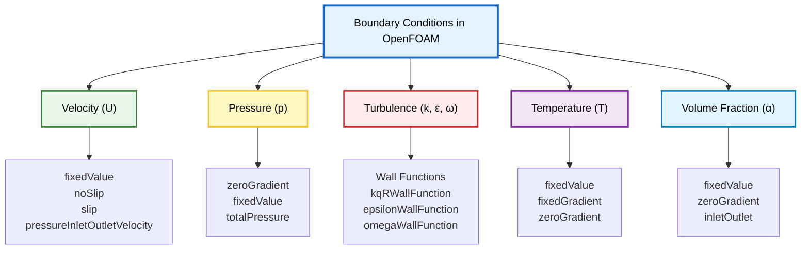
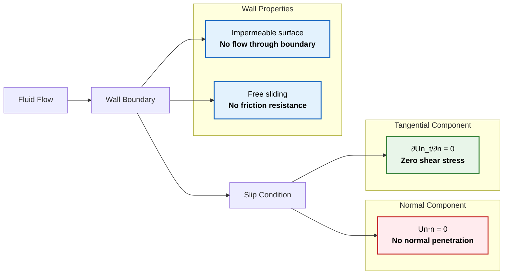
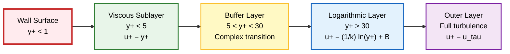

# Common Boundary Conditions in OpenFOAM

**Boundary conditions** are fundamental components in Computational Fluid Dynamics (CFD) simulations that define how fluid properties behave at the physical boundaries of the computational domain.

In OpenFOAM, boundary conditions are implemented through specialized Field classes that inherit from the base class `fvPatchField`, providing a robust framework for handling various physical situations encountered in engineering applications.

**Proper selection of boundary conditions** is critical for obtaining physically realistic and numerically stable results.


> **Figure 1:** Common boundary conditions in OpenFOAM organized by field variable types, such as velocity, pressure, turbulence, temperature, and volume fraction, to identify different physical behaviors in the computational domain


For a general field variable $\phi$, boundary conditions can be categorized into three main mathematical types:

### 1. Dirichlet Boundary Conditions (Fixed Value)

**Dirichlet Boundary Condition** specifies the value of the field variable directly at the boundary surface. Mathematically, this can be expressed as:

$$\phi|_{\partial\Omega} = \phi_{\text{specified}}$$

*   $\phi$ represents the field variable (e.g., velocity components, temperature, or pressure)
*   $\partial\Omega$ denotes the boundary of the computational domain $\Omega$

### 2. Neumann Boundary Conditions (Fixed Gradient)

**Neumann Boundary Condition** specifies the normal gradient of the field variable at the boundary, which is equivalent to specifying the flux through that boundary. The mathematical representation is:

$$\frac{\partial \phi}{\partial n}\bigg|_{\partial\Omega} = g_{\text{specified}}$$

*   $\frac{\partial}{\partial n}$ represents the derivative in the direction normal to the boundary
*   $g_{\text{specified}}$ is the specified gradient value

### 3. Mixed Boundary Conditions (Robin Conditions)

**Mixed Boundary Condition** combines both value and gradient specifications through weighting parameters:

$$\alpha \phi + \beta \frac{\partial \phi}{\partial n} = \gamma$$

*   $\alpha$, $\beta$, and $\gamma$ are coefficients that determine the relative importance of the value and gradient terms

---

## Boundary Conditions for Velocity (`U`)

### Fixed Value (Inlet)

The `fixedValue` condition specifies a **predetermined velocity vector** at the boundary, typically used for inlets with known flow characteristics.

**Properties:**
- Can be constant or time-varying
- Supports mathematical functions
- Suitable for inlets with well-defined velocity profiles

#### Uniform Constant Velocity

```cpp
inlet
{
    type            fixedValue;
    value           uniform (10 0 0); // Constant velocity in x-direction (m/s)
}
```

#### Time-Varying Inlet Condition

```cpp
inlet
{
    type            fixedValue;
    value           table
    (
        (0  (0 0 0))
        (1  (5 0 0))
        (5  (10 0 0))
        (10 (10 0 0))
    );
}
```

#### Parabolic Velocity Profile

```cpp
inlet
{
    type            fixedValue;
    value           #codeStream
    {
        codeInclude
        #{
            #include "fvCFD.H"
        #};
        code
        #{
            // Parabolic profile: u(y) = 4*U_max*y*(H-y)/H^2
            scalar U_max = 10.0;
            scalar H = 1.0;

            vectorField& field = *this;

            forAll(field, faceI)
            {
                scalar y = mesh.boundary()[patchi].Cf()[faceI].y();
                scalar u = 4.0 * U_max * y * (H - y) / (H * H);
                field[faceI] = vector(u, 0, 0);
            }
        #};
    };
}
```

> **📂 Source:** `src/fvOptions/derived/codedFixedValueFvPatchField`
> 
> **คำอธิบาย (Explanation):**
> โค้ดด้านบนใช้ `#codeStream` เพื่อสร้าง velocity profile แบบ parabolic ที่ inlet ซึ่งเป็นวิธีการระบุค่าที่ซับซ้อนโดยใช้ C++ code โดยตรงในไฟล์ boundary condition
> 
> **แนวคิดสำคัญ (Key Concepts):**
> - **Parabolic Profile**: รูปแบบความเร็วแบบ parabolic ให้ความเร็วสูงสุดที่กลางท่อและเป็นศูนย์ที่ผนัง (no-slip)
> - **#codeStream**: ช่วยให้สามารถเขียน C++ code โดยตรงเพื่อคำนวณค่า boundary condition ที่ซับซ้อน
> - **mesh.boundary()[patchi].Cf()**: ใช้ในการเข้าถึงตำแหน่ง face center ของแต่ละ face บน patch

---

### No-Slip (Wall)

The **No-Slip** condition models **viscous adhesion** at solid boundaries where the fluid velocity matches the wall velocity (typically zero for stationary walls).

**Properties:**
- Standard condition for viscous flows
- Applied at solid surfaces
- Fluid velocity equals wall velocity

```cpp
walls
{
    type            noSlip; // Modern standard shorthand
    // Equivalent to:
    // type            fixedValue;
    // value           uniform (0 0 0);
}
```

**Mathematical representation:**
$$\mathbf{u} = \mathbf{u}_{\text{wall}}$$

For stationary walls: $\mathbf{u} = \mathbf{0}$

- **$\mathbf{u}$** = Fluid velocity vector
- **$\mathbf{u}_{\text{wall}}$** = Wall velocity vector

> **📂 Source:** `src/fvPatchFields/derived/noSlip`
> 
> **คำอธิบาย (Explanation):**
> เงื่อนไข no-slip เป็นการบังคับให้ fluid velocity เท่ากับ wall velocity ซึ่งเป็นเงื่อนไขมาตรฐานสำหรับ viscous flow ที่ผนังแข็ง
> 
> **แนวคิดสำคัญ (Key Concepts):**
> - **No-Slip Condition**: ความเร็วของ fluid ที่ผนังจะเท่ากับความเร็วของผนังเสมอ (มักเป็นศูนย์)
> - **Viscous Flow**: การไหลของไหลที่มีความหนืด ซึ่งส่งผลให้เกิดการยึดเกาะที่ผนัง
> - **Boundary Layer**: ชั้นขอบเขตที่ความเร็วเปลี่ยนแปลงจากศูนย์ที่ผนังไปจนถึงค่า free stream

---

### Slip (Free Surface / Symmetry)

The **Slip** condition models a boundary with **no shear stress**, allowing the fluid to slide freely along the surface.

**Applications:**
- Symmetry planes
- Inviscid walls
- Free surfaces

```cpp
top
{
    type            slip;
}
```

**Mathematical enforcement:**
$$\mathbf{u} \cdot \mathbf{n} = 0 \quad \text{(no normal penetration)}$$
$$\frac{\partial \mathbf{u}_t}{\partial n} = 0 \quad \text{(zero tangential shear)}$$

- **$\mathbf{u}$** = Velocity vector
- **$\mathbf{n}$** = Normal vector to boundary
- **$\mathbf{u}_t$** = Tangential velocity component


> **Figure 2:** Physical components of slip boundary condition showing enforcement of zero normal velocity (no penetration) and zero tangential velocity gradient (no shear stress) to model frictionless walls or symmetry planes


This boundary condition **calculates velocity based on pressure gradient** to ensure mass conservation.

**Properties:**
- Useful at boundaries where flow direction may reverse
- Automatically calculated from flux
- Suitable for outlets with flow reversal

```cpp
outlet
{
    type            pressureInletOutletVelocity;
    value           uniform (0 0 0); // Initial guess value
}
```

**Velocity calculated from flux:**
$$\mathbf{u} = \frac{\dot{m}}{\rho A} \mathbf{n}$$

- **$\dot{m}$** = Mass flux
- **$\rho$** = Density
- **$A$** = Face area
- **$\mathbf{n}$** = Normal vector

> **📂 Source:** `src/fvPatchFields/derived/pressureInletOutletVelocity`
> 
> **คำอธิบาย (Explanation):**
> เงื่อนไขนี้ใช้สำหรับ outlet ที่อาจเกิด backflow โดยจะคำนวณ velocity จาก pressure gradient และ flux โดยอัตโนมัติ
> 
> **แนวคิดสำคัญ (Key Concepts):**
> - **Flow Reversal**: การไหลย้อนกลับที่อาจเกิดขึ้นที่ outlet เนื่องจาก recirculation
> - **Mass Conservation**: การอนุรักษ์มวลที่สำคัญในการคำนวณ CFD
> - **Flux-Based Calculation**: การคำนวณความเร็วโดยอิงจาก mass flux ที่ผ่านขอบเขต

---

### Moving Wall Velocity

For moving walls:

```cpp
movingWall
{
    type            fixedValue;
    value           uniform (5 0 0); // Wall moving at 5 m/s in x-direction
}
```

Or use `movingWallVelocity` for walls moving with angular velocity:

```cpp
rotor
{
    type            movingWallVelocity;
    value           uniform (0 0 0);
}
```

In `dynamicMeshDict`:
```cpp
movingMesh
{
    mover            rotatingWall;
    origin           (0 0 0);
    axis             (0 0 1);
    omega            100; // rad/s
}
```

> **📂 Source:** `src/fvPatchFields/derived/movingWallVelocity`
> 
> **คำอธิบาย (Explanation):**
> สำหรับผนังที่เคลื่อนที่ สามารถระบุความเร็วได้โดยตรงหรือใช้ความเร็วเชิงมุมสำหรับการหมุน
> 
> **แนวคิดสำคัญ (Key Concepts):**
> - **Moving Wall**: ผนังที่มีการเคลื่อนที่ซึ่งส่งผลต่อการไหลของ fluid
> - **Angular Velocity**: ความเร็วเชิงมุมที่ใช้สำหรับการหมุน (rad/s)
> - **Dynamic Mesh**: mesh ที่เปลี่ยนแปลงตามเวลาเนื่องจากการเคลื่อนที่ของผนัง

---

## Boundary Conditions for Pressure (`p`)

### Zero Gradient

The `zeroGradient` condition specifies that **pressure does not change in the normal direction** to the boundary.

**Applications:**
- Walls
- Velocity inlets where pressure develops naturally
- Cases where pressure is not precisely known

```cpp
walls
{
    type            zeroGradient;
}
```

**Mathematically:**
$$\frac{\partial p}{\partial n} = 0$$

- **$p$** = Pressure
- **$\frac{\partial p}{\partial n}$** = Pressure gradient in normal direction

---

### Fixed Value

This condition **specifies a predetermined pressure value** at the boundary, typically used for outlets with known pressure.

**Applications:**
- Outlet with known pressure (usually set as gauge pressure)
- Cases requiring pressure control at outlet

```cpp
outlet
{
    type            fixedValue;
    value           uniform 0; // Gauge pressure (relative to atmospheric)
}
```

**For physical applications (Absolute Pressure):**

```cpp
outlet
{
    type            fixedValue;
    value           uniform 101325; // Atmospheric pressure in Pascals
}
```

---

### Total Pressure

For compressible flows:

```cpp
inlet
{
    type            totalPressure;
    p0              uniform 101325; // Total pressure in Pa
    gamma           1.4;             // Heat capacity ratio
}
```

**Total pressure equation:**
$$p_0 = p \left(1 + \frac{\gamma-1}{2} M^2\right)^{\frac{\gamma}{\gamma-1}}$$

- **$p_0$** = Total pressure (stagnation pressure)
- **$p$** = Static pressure
- **$\gamma$** = Heat capacity ratio ($c_p/c_v$)
- **$M$** = Mach number

> **📂 Source:** `src/fvPatchFields/derived/totalPressure`
> 
> **คำอธิบาย (Explanation):**
> เงื่อนไข total pressure ใช้สำหรับ compressible flow โดยระบุค่า stagnation pressure ที่ inlet
> 
> **แนวคิดสำคัญ (Key Concepts):**
> - **Total Pressure**: ความดันรวมที่เกิดจาก static pressure และ dynamic pressure
> - **Stagnation Pressure**: ความดันที่วัดได้เมื่อ fluid ถูกนำมาหยุดนิ่งอย่างสมบูรณ์ (isentropic)
> - **Compressible Flow**: การไหลของไหลที่มีการเปลี่ยนแปลงของความหนาแน่นอย่างชัดเจน

---

### Fixed Flux Pressure

For cases requiring direct pressure gradient specification:

```cpp
wall
{
    type            fixedFluxPressure;
    gradient        uniform 0; // Zero pressure gradient
}
```

---

## Boundary Conditions for Turbulence (`k`, `epsilon`, `omega`)

### Wall Functions

**Wall Functions** are **specialized boundary conditions** that model turbulent boundary layers without requiring extremely fine mesh resolution near walls.

**Working Principle:**
- Bridge viscous sublayer and logarithmic layer
- Use empirical correlations
- Reduce need for very fine mesh near walls


> **Figure 3:** Structure and zonal division of turbulent boundary layer, from the wall to the outer layer, showing the importance of $y^+$ values in selecting appropriate wall functions for each region


```cpp
walls
{
    type            kqRWallFunction; // For turbulent kinetic energy k
    value           uniform 0.1;
}

walls
{
    type            epsilonWallFunction; // For turbulent dissipation epsilon
    value           uniform 0.01;
}
```

#### Wall Function for k-omega Model

```cpp
walls
{
    type            omegaWallFunction; // For specific dissipation rate omega
    value           uniform 1000;
}
```

**Standard Wall Function for Turbulent Kinetic Energy:**
$$k_w = \frac{u_\tau^2}{\sqrt{C_\mu}}$$

- **$k_w$** = Turbulent kinetic energy at wall
- **$u_\tau$** = Friction velocity ($u_\tau = \sqrt{\tau_w/\rho}$)
- **$C_\mu$** = Model constant (typically 0.09)

#### Logarithmic Law of the Wall

The logarithmic law of the wall for velocity is:

$$u^+ = \frac{1}{\kappa} \ln(y^+) + B$$

*   $u^+ = \frac{u}{u_\tau}$ is the dimensionless velocity
*   $y^+ = \frac{y u_\tau}{\nu}$ is the dimensionless distance from the wall
*   $u_\tau = \sqrt{\frac{\tau_w}{\rho}}$ is the friction velocity
*   $\kappa \approx 0.41$ is the von Kármán constant
*   $B \approx 5.2$ is an empirical constant

> **📂 Source:** `src/turbulenceModels/turbulenceModels/derivedFvPatchFields/wallFunctions/kqRWallFunction`
> 
> **คำอธิบาย (Explanation):**
> Wall function ใช้เพื่อลดความละเอียดของ mesh ที่จำเป็นต้องใช้ใกล้ผนัง โดยใช้สมการเชิงประจักษ์ในการจำลอง turbulent boundary layer
> 
> **แนวคิดสำคัญ (Key Concepts):**
> - **y+**: ค่าไร้มิติที่แสดงระยะห่างจากผนัง ซึ่งสำคัญในการเลือกวิธีการจำลอง turbulent flow
> - **Log-Law Layer**: ชั้นที่มีการกระจายความเร็วแบบ logarithmic ใน turbulent boundary layer
> - **Wall Function**: วิธีการที่ใช้สมการเชิงประจักษ์ในการหลีกเลี่ยงการใช้ mesh ที่ละเอียดมากใกล้ผนัง

---

### Turbulent Inlet Conditions

#### Fixed Value with Turbulence Intensity

```cpp
inlet
{
    type            fixedValue;
    value           uniform 0.1; // k = 0.1 m²/s²
}

inlet
{
    type            fixedValue;
    value           uniform 0.01; // epsilon = 0.01 m²/s³
}
```

**Calculating initial values from turbulence intensity:**

For inlet velocity $U_{inlet}$ and turbulence intensity $I$:

$$k = \frac{3}{2} (U_{inlet} I)^2$$

$$\varepsilon = C_\mu^{3/4} \frac{k^{3/2}}{l}$$

where:
- $l$ = Length scale (typically 7% of hydraulic diameter)
- $C_\mu = 0.09$

---

## Additional Important Boundary Conditions

### Boundary Conditions for Temperature (`T`)

#### Fixed Temperature
```cpp
hotWall
{
    type            fixedValue;
    value           uniform 373.15; // Temperature in Kelvin
}
```

#### Fixed Heat Flux
```cpp
heatedWall
{
    type            fixedGradient; // For heat flux specification
    gradient        uniform -1000; // W/m² (negative for heat into domain)
}
```

**According to Fourier's Law:**
$$q = -k \nabla T$$

When using `zeroGradient` for temperature:
$$\frac{\partial T}{\partial n} = 0 \implies q_n = -k \frac{\partial T}{\partial n} = 0$$

This means **no heat transfer across the boundary** → perfectly insulating wall

#### Convective Heat Transfer (Mixed BC)

```cpp
wall
{
    type            externalWallHeatFlux;
    mode            coefficient;
    h               uniform 10;      // Heat transfer coefficient [W/m²K]
    Ta              uniform 293;     // Ambient temperature [K]
    thickness       uniform 0.05;    // Wall thickness [m]
    kappa           uniform 0.7;     // Thermal conductivity [W/mK]
}
```

**Newton's Cooling Law equation:**
$$-k\frac{\partial T}{\partial n} = h(T_s - T_\infty)$$

- $k$ = Thermal Conductivity
- $h$ = Convective Heat Transfer Coefficient
- $T_s$ = Surface Temperature
- $T_\infty$ = Ambient Fluid Temperature

> **📂 Source:** `src/fvPatchFields/derived/externalWallHeatFlux`
> 
> **คำอธิบาย (Explanation):**
> เงื่อนไขนี้ใช้สำหรับจำลองการถ่ายเทความร้อนแบบ convection ระหว่างผนังและสิ่งแวดล้อม
> 
> **แนวคิดสำคัญ (Key Concepts):**
> - **Convection**: การถ่ายเทความร้อนระหว่างผนังและ fluid
> - **Heat Transfer Coefficient**: ค่าสัมประสิทธิ์การถ่ายเทความร้อน (h) ที่บ่งบอกถึงประสิทธิภาพการถ่ายเทความร้อน
> - **Adiabatic**: ผนังที่ไม่มีการถ่ายเทความร้อน (zero gradient)

---

### Boundary Conditions for Volume Fraction (`alpha`)

For multiphase flow:

#### Fixed Value Interface
```cpp
inlet
{
    type            fixedValue;
    value           uniform 1; // Pure phase
}
```

#### Zero Gradient Interface
```cpp
outlet
{
    type            zeroGradient;
    value           uniform 0; // Initial value
}
```

#### Inlet Outlet for Volume Fraction
```cpp
outlet
{
    type            inletOutlet;
    inletValue      uniform 0;
    value           uniform 0;
}
```

---

### Cyclic Boundary Condition

Use **periodic boundary conditions** for periodic domains:

```cpp
left
{
    type            cyclic;
    neighbourPatch  right;
}

right
{
    type            cyclic;
    neighbourPatch  left;
}
```

**Possible transformations:**
- **Translation** - shifting
- **Rotation** - turning
- **Reflection** - mirroring

> **📂 Source:** `src/fvPatchFields/cyclic/cyclicFvPatchField`
> 
> **คำอธิบาย (Explanation):**
> เงื่อนไข cyclic ใช้สำหรับโดเมนที่มีความเป็นคาบ (periodic) โดย field จะเหมือนกันระหว่าง patch คู่
> 
> **แนวคิดสำคัญ (Key Concepts):**
> - **Periodic Boundary**: ขอบเขตที่มีการวนซ้ำของ pattern
> - **Geometric Transformation**: การแปลงตำแหน่ง (translation, rotation, reflection) ระหว่าง cyclic patches
> - **Field Continuity**: ความต่อเนื่องของ field ข้าม periodic boundary

---

### Symmetry Boundary Condition

```cpp
symmetryPlane
{
    type            symmetryPlane;
}
```

**Mathematical conditions:**

1. **Normal velocity constraint:**
   $$\mathbf{n} \cdot \mathbf{u} = 0 \quad \text{(normal velocity = 0)}$$

2. **Scalar field handling (temperature, pressure):**
   $$\frac{\partial \phi}{\partial n} = 0 \quad \text{(zero normal gradient)}$$

3. **Tangential velocity behavior:**
   $$\frac{\partial \mathbf{u}_t}{\partial n} = 0 \quad \text{(zero tangential velocity gradient)}$$

> **📂 Source:** `src/fvPatchFields/derived/symmetryPlane`
> 
> **คำอธิบาย (Explanation):**
> เงื่อนไข symmetry plane ใช้สำหรับระนาบสมมาตรที่มีการไหลสมมาตร
> 
> **แนวคิดสำคัญ (Key Concepts):**
> - **Symmetry Plane**: ระนาบที่แบ่งโดเมนเป็นส่วนที่สมมาตรกัน
> - **Zero Normal Velocity**: ไม่มีการไหลผ่านระนาบสมมาตร
> - **Zero Tangential Gradient**: ไม่มีการเปลี่ยนแปลงของความเร็วในทิศทางสัมผัสกับระนาบ

---

## Boundary Condition Selection Guidelines

### Inlet Boundary

| Variable | Recommended BC | Remarks |
|----------|----------------|---------|
| **Velocity** | `fixedValue` | When inlet velocity profile is known |
| **Pressure** | `zeroGradient` | To allow pressure to develop naturally |
| **Turbulence** | `fixedValue` | Turbulence intensity 1-5% |
| **Temperature** | `fixedValue` | Inflow fluid temperature |

### Outlet Boundary

| Variable | Recommended BC | Remarks |
|----------|----------------|---------|
| **Velocity** | `pressureInletOutletVelocity` or `zeroGradient` | Depending on flow characteristics |
| **Pressure** | `fixedValue` | Typically 0 (gauge pressure) |
| **Turbulence** | `zeroGradient` | For developed flow |
| **Temperature** | `zeroGradient` | When flow is fully developed |

### Wall Boundary

| Variable | Recommended BC | Remarks |
|----------|----------------|---------|
| **Velocity** | `noSlip` (viscous) or `slip` (inviscid) | Depending on flow characteristics |
| **Pressure** | `zeroGradient` | For most cases |
| **Temperature** | `fixedValue` or `fixedGradient` | Depending on thermal conditions |
| **Turbulence** | Wall Function | To avoid excessive mesh refinement |

---

## Summary Table of Common Boundary Conditions

| Boundary Condition Type | Mathematical Form | Physical Meaning | Common Applications |
|------------------------|-------------------|------------------|-------------------|
| **fixedValue** | $\phi|_{\partial\Omega} = \phi_{\text{specified}}$ | Direct value specification | Inlet velocity, wall temperature, concentration |
| **fixedGradient** | $\frac{\partial \phi}{\partial n}\bigg|_{\partial\Omega} = g_{\text{specified}}$ | Flux specification | Outlet flow, heat flux, symmetry |
| **zeroGradient** | $\frac{\partial \phi}{\partial n}\bigg|_{\partial\Omega} = 0$ | Zero flux condition | Fully developed flow, adiabatic walls |
| **mixed** | $\alpha \phi + \beta \frac{\partial \phi}{\partial n} = \gamma$ | Weighted value-gradient combination | Conjugate heat transfer, partial slip |
| **cyclic** | $\phi_1 = \phi_2$ | Field continuity across patches | Rotational symmetry, periodic domains |
| **inletOutlet** | Conditional on flux direction | Automatic switching for backflow | Outlets with possible recirculation |

---

## Complete Setup Examples

### Example 1: Pipe Flow

```cpp
// 0/U file
dimensions      [0 1 -1 0 0 0 0];
internalField   uniform 0;

boundaryField
{
    inlet
    {
        type            fixedValue;
        value           uniform (5 0 0);  // 5 m/s in x-direction
    }

    outlet
    {
        type            zeroGradient;
    }

    walls
    {
        type            noSlip;
    }
}

// 0/p file
dimensions      [1 -1 -2 0 0 0 0];
internalField   uniform 0;

boundaryField
{
    inlet
    {
        type            zeroGradient;
    }

    outlet
    {
        type            fixedValue;
        value           uniform 0;  // 0 Pa gauge pressure
    }

    walls
    {
        type            zeroGradient;
    }
}
```

> **📂 Source:** Standard OpenFOAM boundary condition setup
> 
> **คำอธิบาย (Explanation):**
> ตัวอย่างการตั้งค่า boundary condition สำหรับการไหลในท่อ (pipe flow) โดยใช้ fixed value ที่ inlet และ fixed pressure ที่ outlet
> 
> **แนวคิดสำคัญ (Key Concepts):**
> - **Fully Developed Flow**: การไหลที่ไม่เปลี่ยนแปลงตามทิศทางการไหล (zero gradient ที่ outlet)
> - **No-Slip at Walls**: ความเร็วเป็นศูนย์ที่ผนัง
> - **Pressure-Driven Flow**: การไหลที่เกิดจากความแตกต่างของความดัน

---

### Example 2: Backward Facing Step Flow

```cpp
// 0/U file
boundaryField
{
    inlet
    {
        type            fixedValue;
        value           uniform (1 0 0);
    }

    outlet
    {
        type            inletOutlet;
        inletValue      uniform (0 0 0);
        value           uniform (0 0 0);
    }

    walls
    {
        type            noSlip;
    }
}

// 0/p file
boundaryField
{
    inlet
    {
        type            zeroGradient;
    }

    outlet
    {
        type            fixedValue;
        value           uniform 0;
    }

    walls
    {
        type            fixedFluxPressure;
        gradient        uniform 0;
    }
}
```

> **📂 Source:** Standard OpenFOAM boundary condition setup
> 
> **คำอธิบาย (Explanation):**
> ตัวอย่างการไหลแบบ backward facing step ซึ่งมี recirculation zone ที่ต้องการ inletOutlet condition ที่ outlet
> 
> **แนวคิดสำคัญ (Key Concepts):**
> - **Flow Separation**: การแยกตัวของการไหลที่เกิดจากการเปลี่ยนทิศทางของ geometry
> - **Recirculation Zone**: บริเวณที่มีการไหลย้อนกลับ
> - **Reattachment**: จุดที่การไหลกลับมาติดผนังอีกครั้ง

---

### Example 3: Heat Transfer Flow

```cpp
// 0/T file
dimensions      [0 0 0 1 0 0 0];
internalField   uniform 293;

boundaryField
{
    inlet
    {
        type            fixedValue;
        value           uniform 293;  // 293 K inlet temperature
    }

    outlet
    {
        type            zeroGradient;
    }

    hotWall
    {
        type            fixedValue;
        value           uniform 373;  // 373 K heated wall
    }

    coldWall
    {
        type            fixedGradient;
        gradient        uniform 0;  // Adiabatic (zero flux)
    }
}
```

> **📂 Source:** Standard OpenFOAM thermal boundary condition setup
> 
> **คำอธิบาย (Explanation):**
> ตัวอย่างการไหลที่มีการถ่ายเทความร้อน โดยมีผนังร้อนและผนังฉนวน
> 
> **แนวคิดสำคัญ (Key Concepts):**
> - **Conjugate Heat Transfer**: การถ่ายเทความร้อนระหว่าง solid และ fluid
> - **Adiabatic Wall**: ผนังที่ไม่มีการถ่ายเทความร้อน (zero gradient)
> - **Fixed Temperature**: ผนังที่มีอุณหภูมิคงที่

---

## Conclusion

**Proper selection and application of boundary conditions** is fundamental for accurate CFD simulations, as they significantly influence:

- **Flow Physics** - The actual flow characteristics
- **Solution Stability** - Computational stability
- **Convergence** - Solution convergence
- **Physical Accuracy** - Physical correctness

### Key Principles for Boundary Condition Selection:

1. **Mathematical Consistency**: Boundary conditions must create a well-posed problem
2. **Physical Accuracy**: Must correspond to actual physical phenomena
3. **Numerical Stability**: Avoid conditions that cause solution divergence
4. **Computational Efficiency**: Choose conditions that provide correct results in reasonable time

Understanding the principles of each boundary condition enables appropriate selection for the problem at hand, leading to efficient and reliable CFD simulations.