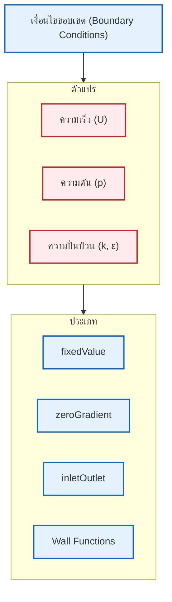
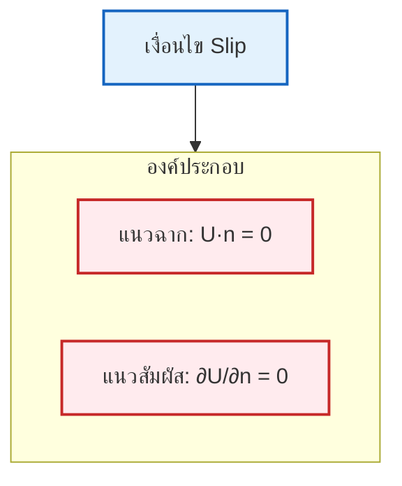
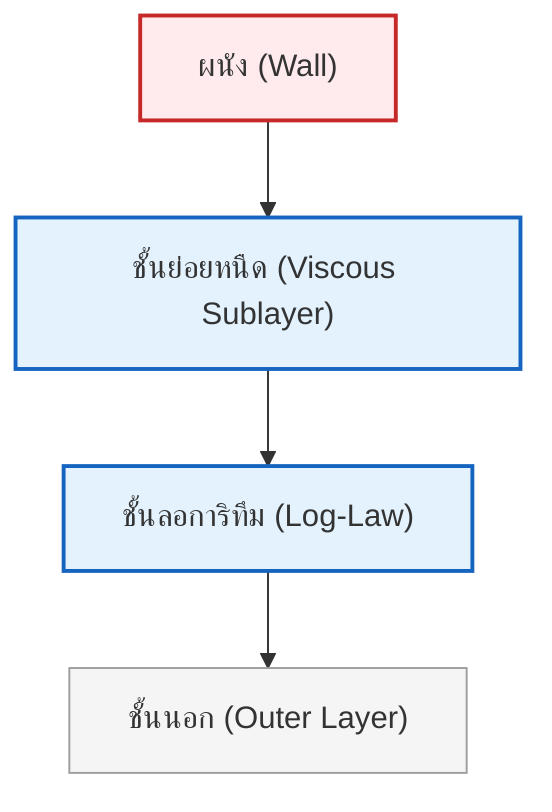

# เงื่อนไขขอบเขตทั่วไปใน OpenFOAM (Common Boundary Conditions in OpenFOAM)

**เงื่อนไขขอบเขต (Boundary conditions)** เป็นองค์ประกอบพื้นฐานในการจำลองพลศาสตร์ของไหลเชิงคำนวณ (CFD) ซึ่งกำหนดพฤติกรรมของคุณสมบัติของไหลที่ขอบเขตทางกายภาพของโดเมนการคำนวณ

ใน OpenFOAM เงื่อนไขขอบเขตถูกนำมาใช้ผ่านคลาสฟิลด์ (Field classes) เฉพาะทางที่สืบทอดมาจากคลาสฐาน `fvPatchField` ซึ่งเป็นโครงสร้างที่แข็งแกร่งสำหรับการจัดการสถานการณ์ทางกายภาพต่าง ๆ ที่พบในงานประยุกต์ทางวิศวกรรม

**การเลือกเงื่อนไขขอบเขตที่เหมาะสม** มีความสำคัญอย่างยิ่งต่อการได้รับผลลัพธ์ที่สมจริงทางกายภาพและมีความเสถียรเชิงตัวเลข


> **รูปที่ 1:** เงื่อนไขขอบเขตทั่วไปใน OpenFOAM จำแนกตามประเภทของตัวแปรสนาม เช่น ความเร็ว ความดัน ความปั่นป่วน อุณหภูมิ และสัดส่วนปริมาตร เพื่อระบุพฤติกรรมทางกายภาพที่แตกต่างกันในโดเมนการคำนวณ

สำหรับตัวแปรสนามทั่วไป $\phi$ เงื่อนไขขอบเขตสามารถแบ่งออกเป็นสามประเภทหลักทางคณิตศาสตร์ดังนี้:

### 1. เงื่อนไขขอบเขตแบบดิริชเลต์ (Dirichlet Boundary Conditions - Fixed Value)

**เงื่อนไขขอบเขตแบบดิริชเลต์** ระบุค่าของตัวแปรสนามโดยตรงที่พื้นผิวขอบเขต ในทางคณิตศาสตร์สามารถแสดงได้ดังนี้:

$$\phi|_{\partial\Omega} = \phi_{\text{specified}}$$

*   $\phi$ แทนตัวแปรสนาม (เช่น องค์ประกอบความเร็ว อุณหภูมิ หรือความดัน)
*   $\partial\Omega$ แทนขอบเขตของโดเมนการคำนวณ $\Omega$

### 2. เงื่อนไขขอบเขตแบบนอยมันน์ (Neumann Boundary Conditions - Fixed Gradient)

**เงื่อนไขขอบเขตแบบนอยมันน์** ระบุค่าเกรเดียนต์ในแนวฉาก (normal gradient) ของตัวแปรสนามที่ขอบเขต ซึ่งเทียบเท่ากับการระบุฟลักซ์ (flux) ที่ไหลผ่านขอบเขตนั้น รูปแบบทางคณิตศาสตร์คือ:

$$\frac{\partial \phi}{\partial n}\bigg|_{\partial\Omega} = g_{\text{specified}}$$

*   $rac{\partial}{\partial n}$ แทนอนุพันธ์ในทิศทางแนวฉากกับขอบเขต
*   $g_{\text{specified}}$ คือค่าเกรเดียนต์ที่กำหนด

### 3. เงื่อนไขขอบเขตแบบผสม (Mixed Boundary Conditions - Robin Conditions)

**เงื่อนไขขอบเขตแบบผสม** เป็นการรวมกันของการระบุทั้งค่าและเกรเดียนต์ผ่านพารามิเตอร์การถ่วงน้ำหนัก:

$$\alpha \phi + \beta \frac{\partial \phi}{\partial n} = \gamma$$

*   $\alpha$, $\beta$, และ $\gamma$ คือสัมประสิทธิ์ที่กำหนดความสำคัญสัมพัทธ์ของพจน์ค่าและพจน์เกรเดียนต์

---

## เงื่อนไขขอบเขตสำหรับความเร็ว (`U`)

### ค่าคงที่ (Fixed Value - Inlet)

เงื่อนไข `fixedValue` ใช้ระบุ **เวกเตอร์ความเร็วที่กำหนดไว้ล่วงหน้า** ที่ขอบเขต มักใช้สำหรับทางเข้า (inlets) ที่ทราบลักษณะการไหล

**คุณสมบัติ:**
- สามารถเป็นค่าคงที่หรือเปลี่ยนแปลงตามเวลาได้
- รองรับฟังก์ชันทางคณิตศาสตร์
- เหมาะสำหรับทางเข้าที่มีโปรไฟล์ความเร็วที่กำหนดไว้อย่างชัดเจน

#### ความเร็วสม่ำเสมอคงที่ (Uniform Constant Velocity)

```cpp
inlet
{
    type            fixedValue;
    value           uniform (10 0 0); // ความเร็วคงที่ 10 m/s ในทิศทาง x
}
```

#### เงื่อนไขทางเข้าที่เปลี่ยนแปลงตามเวลา (Time-Varying Inlet)

```cpp
inlet
{
    type            fixedValue;
    value           table
    (
        (0  (0 0 0))
        (1  (5 0 0))
        (5  (10 0 0))
        (10 (10 0 0))
    );
}
```

#### โปรไฟล์ความเร็วแบบพาราโบลา (Parabolic Velocity Profile)

```cpp
inlet
{
    type            fixedValue;
    value           #codeStream
    {
        codeInclude
        #{
            #include "fvCFD.H"
        #};
        code
        #{
            // Parabolic profile: u(y) = 4*U_max*y*(H-y)/H^2
            scalar U_max = 10.0;
            scalar H = 1.0;

            vectorField& field = *this;

            forAll(field, faceI)
            {
                scalar y = mesh.boundary()[patchi].Cf()[faceI].y();
                scalar u = 4.0 * U_max * y * (H - y) / (H * H);
                field[faceI] = vector(u, 0, 0);
            }
        #};
    };
}
```

> **📂 แหล่งที่มา:** `src/fvOptions/derived/codedFixedValueFvPatchField`
> 
> **คำอธิบาย:**
> โค้ดด้านบนใช้ `#codeStream` เพื่อสร้างโปรไฟล์ความเร็วแบบพาราโบลาที่ทางเข้า ซึ่งเป็นวิธีการระบุค่าที่ซับซ้อนโดยใช้โค้ด C++ โดยตรงในไฟล์เงื่อนไขขอบเขต
> 
> **แนวคิดสำคัญ:**
> - **Parabolic Profile**: รูปแบบความเร็วแบบพาราโบลาให้ความเร็วสูงสุดที่จุดศูนย์กลางท่อและเป็นศูนย์ที่ผนัง (no-slip)
> - **#codeStream**: ช่วยให้สามารถเขียนโค้ด C++ โดยตรงเพื่อคำนวณค่าเงื่อนไขขอบเขตที่ซับซ้อน
> - **mesh.boundary()[patchi].Cf()**: ใช้ในการเข้าถึงตำแหน่งจุดศูนย์กลางหน้า (face center) ของแต่ละหน้าบนแพตช์ (patch)

---

### เงื่อนไขไม่ลื่นไถล (No-Slip - Wall)

เงื่อนไข **No-Slip** จำลอง **การยึดเกาะเนื่องจากความหนืด (viscous adhesion)** ที่ขอบเขตของแข็ง โดยความเร็วของของไหลจะเท่ากับความเร็วของผนัง (มักเป็นศูนย์สำหรับผนังที่หยุดนิ่ง)

**คุณสมบัติ:**
- เป็นเงื่อนไขมาตรฐานสำหรับการไหลแบบมีความหนืด (viscous flows)
- ใช้กับพื้นผิวของแข็ง
- ความเร็วของของไหลเท่ากับความเร็วของผนัง

```cpp
walls
{
    type            noSlip; // รูปแบบย่อมาตรฐานในปัจจุบัน
    // เทียบเท่ากับ:
    // type            fixedValue;
    // value           uniform (0 0 0);
}
```

**รูปแบบทางคณิตศาสตร์:**
$$\mathbf{u} = \mathbf{u}_{\text{wall}}$$

สำหรับผนังที่หยุดนิ่ง: $\mathbf{u} = \mathbf{0}$

- **$\\mathbf{u}$** = เวกเตอร์ความเร็วของไหล
- **$\\mathbf{u}_{\text{wall}}$** = เวกเตอร์ความเร็วของผนัง

> **📂 แหล่งที่มา:** `src/fvPatchFields/derived/noSlip`
> 
> **คำอธิบาย:**
> เงื่อนไข no-slip เป็นการบังคับให้ความเร็วของของไหลเท่ากับความเร็วของผนัง ซึ่งเป็นเงื่อนไขมาตรฐานสำหรับการไหลแบบมีความหนืดที่ผนังแข็ง
> 
> **แนวคิดสำคัญ:**
> - **No-Slip Condition**: ความเร็วของของไหลที่ผนังจะเท่ากับความเร็วของผนังเสมอ (มักเป็นศูนย์)
> - **Viscous Flow**: การไหลของของไหลที่มีความหนืด ซึ่งส่งผลให้เกิดการยึดเกาะที่ผนัง
> - **Boundary Layer**: ชั้นขอบเขตที่ความเร็วเปลี่ยนแปลงจากศูนย์ที่ผนังไปจนถึงค่ากระแสอิสระ (free stream)

---

### เงื่อนไขลื่นไถล (Slip - Free Surface / Symmetry)

เงื่อนไข **Slip** จำลองขอบเขตที่ **ไม่มีความเค้นเฉือน (no shear stress)** ทำให้ของไหลสามารถเลื่อนไปตามพื้นผิวได้อย่างอิสระ

**การประยุกต์ใช้งาน:**
- ระนาบสมมาตร (Symmetry planes)
- ผนังที่ไม่มีความหนืด (Inviscid walls)
- พื้นผิวอิสระ (Free surfaces)

```cpp
top
{
    type            slip;
}
```

**การบังคับใช้ทางคณิตศาสตร์:**
$$\mathbf{u} \cdot \mathbf{n} = 0 \quad \text{(ไม่มีการทะลุผ่านในแนวฉาก)}$$
$$\frac{\partial \mathbf{u}_t}{\partial n} = 0 \quad \text{(ความเค้นเฉือนในแนวสัมผัสเป็นศูนย์)}$$

- **$\\mathbf{u}$** = เวกเตอร์ความเร็ว
- **$\\mathbf{n}$** = เวกเตอร์แนวฉากกับขอบเขต
- **$\\mathbf{u}_t$** = ส่วนประกอบความเร็วในแนวสัมผัส


> **รูปที่ 2:** ส่วนประกอบทางกายภาพของเงื่อนไขขอบเขตแบบลื่นไถล (slip) แสดงการบังคับให้ความเร็วในแนวฉากเป็นศูนย์ (ไม่มีการทะลุผ่าน) และเกรเดียนต์ความเร็วในแนวสัมผัสเป็นศูนย์ (ไม่มีความเค้นเฉือน) เพื่อจำลองผนังที่ไม่มีแรงเสียดทานหรือระนาบสมมาตร

---

### ความเร็วทางเข้า/ออกตามความดัน (Pressure Inlet Outlet Velocity)

เงื่อนไขขอบเขตนี้จะ **คำนวณความเร็วโดยอิงจากเกรเดียนต์ความดัน** เพื่อให้มั่นใจถึงการอนุรักษ์มวล

**คุณสมบัติ:**
- มีประโยชน์ที่ขอบเขตซึ่งทิศทางการไหลอาจเกิดการย้อนกลับได้
- คำนวณโดยอัตโนมัติจากฟลักซ์ (flux)
- เหมาะสำหรับทางออกที่มีการไหลย้อนกลับ (flow reversal)

```cpp
outlet
{
    type            pressureInletOutletVelocity;
    value           uniform (0 0 0); // ค่าเริ่มต้นสำหรับการประมาณ
}
```

**ความเร็วที่คำนวณจากฟลักซ์:**
$$\mathbf{u} = \frac{\dot{m}}{\rho A} \mathbf{n}$$

- **$\\dot{m}$** = ฟลักซ์มวล (Mass flux)
- **$\\rho$** = ความหนาแน่น
- **$A$** = พื้นที่หน้าเซลล์
- **$\\mathbf{n}$** = เวกเตอร์แนวฉาก

> **📂 แหล่งที่มา:** `src/fvPatchFields/derived/pressureInletOutletVelocity`
> 
> **คำอธิบาย:**
> เงื่อนไขนี้ใช้สำหรับทางออกที่อาจเกิดการไหลย้อนกลับ (backflow) โดยจะคำนวณความเร็วจากเกรเดียนต์ความดันและฟลักซ์โดยอัตโนมัติ
> 
> **แนวคิดสำคัญ:**
> - **Flow Reversal**: การไหลย้อนกลับที่อาจเกิดขึ้นที่ทางออกเนื่องจากการไหลวน (recirculation)
> - **Mass Conservation**: การอนุรักษ์มวลซึ่งมีความสำคัญอย่างยิ่งในการคำนวณ CFD
> - **Flux-Based Calculation**: การคำนวณความเร็วโดยอิงจากฟลักซ์มวลที่ผ่านขอบเขต

---

### ความเร็วผนังเคลื่อนที่ (Moving Wall Velocity)

สำหรับผนังที่เคลื่อนที่:

```cpp
movingWall
{
    type            fixedValue;
    value           uniform (5 0 0); // ผนังเคลื่อนที่ด้วยความเร็ว 5 m/s ในทิศทาง x
}
```

หรือใช้ `movingWallVelocity` สำหรับผนังที่เคลื่อนที่ด้วยความเร็วเชิงมุม:

```cpp
rotor
{
    type            movingWallVelocity;
    value           uniform (0 0 0);
}
```

ในไฟล์ `dynamicMeshDict`:
```cpp
movingMesh
{
    mover            rotatingWall;
    origin           (0 0 0);
    axis             (0 0 1);
    omega            100; // rad/s
}
```

> **📂 แหล่งที่มา:** `src/fvPatchFields/derived/movingWallVelocity`
> 
> **คำอธิบาย:**
> สำหรับผนังที่เคลื่อนที่ สามารถระบุความเร็วได้โดยตรงหรือใช้ความเร็วเชิงมุมสำหรับการหมุน
> 
> **แนวคิดสำคัญ:**
> - **Moving Wall**: ผนังที่มีการเคลื่อนที่ซึ่งส่งผลต่อการไหลของของไหล
> - **Angular Velocity**: ความเร็วเชิงมุมที่ใช้สำหรับการหมุน (rad/s)
> - **Dynamic Mesh**: เมชที่เปลี่ยนแปลงตามเวลาเนื่องจากการเคลื่อนที่ของผนัง

---

## เงื่อนไขขอบเขตสำหรับความดัน (`p`)

### เกรเดียนต์เป็นศูนย์ (Zero Gradient)

เงื่อนไข `zeroGradient` ระบุว่า **ความดันไม่มีการเปลี่ยนแปลงในทิศทางแนวฉาก** กับขอบเขต

**การประยุกต์ใช้งาน:**
- ผนัง (Walls)
- ทางเข้าความเร็วที่ความดันพัฒนาขึ้นเองตามธรรมชาติ
- กรณีที่ไม่ทราบค่าความดันที่แน่นอน

```cpp
walls
{
    type            zeroGradient;
}
```

**ในทางคณิตศาสตร์:**
$$\frac{\partial p}{\partial n} = 0$$

- **$p$** = ความดัน
- **$\\frac{\partial p}{\partial n}$** = เกรเดียนต์ความดันในทิศทางแนวฉาก

---

### ค่าคงที่ (Fixed Value)

เงื่อนไขนี้ **ระบุค่าความดันที่กำหนดไว้ล่วงหน้า** ที่ขอบเขต มักใช้สำหรับทางออกที่ทราบค่าความดัน

**การประยุกต์ใช้งาน:**
- ทางออกที่ทราบความดัน (มักตั้งค่าเป็นความดันเกจ)
- กรณีที่ต้องการควบคุมความดันที่ทางออก

```cpp
outlet
{
    type            fixedValue;
    value           uniform 0; // ความดันเกจ (เทียบกับความดันบรรยากาศ)
}
```

**สำหรับงานประยุกต์ทางกายภาพ (ความดันสัมบูรณ์ - Absolute Pressure):**

```cpp
outlet
{
    type            fixedValue;
    value           uniform 101325; // ความดันบรรยากาศในหน่วยพาสคัล
}
```

---

### ความดันรวม (Total Pressure)

สำหรับการไหลแบบอัดตัวได้ (compressible flows):

```cpp
inlet
{
    type            totalPressure;
    p0              uniform 101325; // ความดันรวมในหน่วย Pa
    gamma           1.4;             // อัตราส่วนความจุความร้อน
}
```

**สมการความดันรวม:**
$$p_0 = p \left(1 + \frac{\gamma-1}{2} M^2\right)^{\frac{\gamma}{\gamma-1}}$$

- **$p_0$** = ความดันรวม (stagnation pressure)
- **$p$** = ความดันสถิต (static pressure)
- **$\\gamma$** = อัตราส่วนความจุความร้อน ($c_p/c_v$)
- **$M$** = เลขมัค (Mach number)

> **📂 แหล่งที่มา:** `src/fvPatchFields/derived/totalPressure`
> 
> **คำอธิบาย:**
> เงื่อนไขความดันรวมใช้สำหรับการไหลแบบอัดตัวได้ โดยระบุค่าความดันหยุดนิ่ง (stagnation pressure) ที่ทางเข้า
> 
> **แนวคิดสำคัญ:**
> - **Total Pressure**: ความดันรวมที่เกิดจากความดันสถิตและความดันพลวัต
> - **Stagnation Pressure**: ความดันที่วัดได้เมื่อของไหลถูกทำให้หยุดนิ่งอย่างสมบูรณ์แบบไอเซนโทรปิก (isentropic)
> - **Compressible Flow**: การไหลของของไหลที่มีการเปลี่ยนแปลงของความหนาแน่นอย่างมีนัยสำคัญ

---

### ความดันฟลักซ์คงที่ (Fixed Flux Pressure)

สำหรับกรณีที่ต้องการระบุเกรเดียนต์ความดันโดยตรง:

```cpp
wall
{
    type            fixedFluxPressure;
    gradient        uniform 0; // เกรเดียนต์ความดันเป็นศูนย์
}
```

---

## เงื่อนไขขอบเขตสำหรับความปั่นป่วน (`k`, `epsilon`, `omega`)

### วอลล์ฟังก์ชัน (Wall Functions)

**วอลล์ฟังก์ชัน** เป็น **เงื่อนไขขอบเขตเฉพาะทาง** ที่ใช้จำลองชั้นขอบเขตแบบปั่นป่วน (turbulent boundary layers) โดยไม่จำเป็นต้องใช้เมชที่มีความละเอียดสูงมากบริเวณใกล้ผนัง

**หลักการทำงาน:**
- เชื่อมต่อระหว่างชั้นย่อยหนืด (viscous sublayer) และชั้นลอการิทึม (logarithmic layer)
- ใช้ความสัมพันธ์เชิงประจักษ์ (empirical correlations)
- ลดความจำเป็นในการใช้เมชที่ละเอียดมากใกล้ผนัง


> **รูปที่ 3:** โครงสร้างและการแบ่งโซนของชั้นขอบเขตแบบปั่นป่วน จากผนังไปยังชั้นนอก แสดงความสำคัญของค่า $y^+$ ในการเลือกวอลล์ฟังก์ชันที่เหมาะสมสำหรับแต่ละภูมิภาค

```cpp
walls
{
    type            kqRWallFunction; // สำหรับพลังงานจลน์ความปั่นป่วน k
    value           uniform 0.1;
}

walls
{
    type            epsilonWallFunction; // สำหรับอัตราการสลายตัวของความปั่นป่วน epsilon
    value           uniform 0.01;
}
```

#### วอลล์ฟังก์ชันสำหรับโมเดล k-omega

```cpp
walls
{
    type            omegaWallFunction; // สำหรับอัตราการสลายตัวเฉพาะเจาะจง omega
    value           uniform 1000;
}
```

**วอลล์ฟังก์ชันมาตรฐานสำหรับพลังงานจลน์ความปั่นป่วน:**
$$k_w = \frac{u_\tau^2}{\sqrt{C_\mu}}$$

- **$k_w$** = พลังงานจลน์ความปั่นป่วนที่ผนัง
- **$u_\tau$** = ความเร็วเสียดทาน ($u_\tau = \sqrt{\tau_w/\rho}$)
- **$C_\mu$** = ค่าคงที่ของโมเดล (โดยปกติคือ 0.09)

#### กฎลอการิทึมของผนัง (Logarithmic Law of the Wall)

กฎลอการิทึมของผนังสำหรับความเร็วคือ:

$$u^+ = \frac{1}{\kappa} \ln(y^+) + B$$

*   $u^+ = \frac{u}{u_\tau}$ คือความเร็วไร้มิติ
*   $y^+ = \frac{y u_\tau}{\nu}$ คือระยะห่างจากผนังไร้มิติ
*   $u_\tau = \sqrt{\frac{\tau_w}{\rho}}$ คือความเร็วเสียดทาน
*   $\\kappa \approx 0.41$ คือค่าคงที่ von Kármán
*   $B \approx 5.2$ คือค่าคงที่เชิงประจักษ์

> **📂 แหล่งที่มา:** `src/turbulenceModels/turbulenceModels/derivedFvPatchFields/wallFunctions/kqRWallFunction`
> 
> **คำอธิบาย:**
> วอลล์ฟังก์ชันใช้เพื่อลดความละเอียดของเมชที่จำเป็นต้องใช้ใกล้ผนัง โดยใช้สมการเชิงประจักษ์ในการจำลองชั้นขอบเขตแบบปั่นป่วน
> 
> **แนวคิดสำคัญ:**
> - **y+**: ค่าไร้มิติที่แสดงระยะห่างจากผนัง ซึ่งสำคัญในการเลือกวิธีการจำลองการไหลแบบปั่นป่วน
> - **Log-Law Layer**: ชั้นที่มีการกระจายความเร็วแบบลอการิทึมในชั้นขอบเขตแบบปั่นป่วน
> - **Wall Function**: วิธีการที่ใช้สมการเชิงประจักษ์เพื่อหลีกเลี่ยงการใช้เมชที่ละเอียดมากใกล้ผนัง

---

### เงื่อนไขทางเข้าแบบปั่นป่วน (Turbulent Inlet Conditions)

#### ค่าคงที่พร้อมความเข้มข้นความปั่นป่วน (Fixed Value with Turbulence Intensity)

```cpp
inlet
{
    type            fixedValue;
    value           uniform 0.1; // k = 0.1 m²/s²
}

inlet
{
    type            fixedValue;
    value           uniform 0.01; // epsilon = 0.01 m²/s³
}
```

**การคำนวณค่าเริ่มต้นจากความเข้มข้นความปั่นป่วน:**

สำหรับความเร็วทางเข้า $U_{inlet}$ และความเข้มข้นความปั่นป่วน $I$:

$$k = \frac{3}{2} (U_{inlet} I)^2$$

$$\varepsilon = C_\mu^{3/4} \frac{k^{3/2}}{l}$$

โดยที่:
- $l$ = มาตราส่วนความยาว (โดยปกติคือ 7% ของเส้นผ่านศูนย์กลางไฮดรอลิก)
- $C_\mu = 0.09$

---

## เงื่อนไขขอบเขตที่สำคัญเพิ่มเติม

### เงื่อนไขขอบเขตสำหรับอุณหภูมิ (`T`)

#### อุณหภูมิคงที่ (Fixed Temperature)
```cpp
hotWall
{
    type            fixedValue;
    value           uniform 373.15; // อุณหภูมิในหน่วยเคลวิน
}
```

#### ฟลักซ์ความร้อนคงที่ (Fixed Heat Flux)
```cpp
heatedWall
{
    type            fixedGradient; // สำหรับการระบุฟลักซ์ความร้อน
    gradient        uniform -1000; // W/m² (ค่าลบหมายถึงความร้อนไหลเข้าสู่โดเมน)
}
```

**ตามกฎของฟูเรียร์ (Fourier's Law):**
$$q = -k \nabla T$$

เมื่อใช้ `zeroGradient` สำหรับอุณหภูมิ:
$$\frac{\partial T}{\partial n} = 0 \implies q_n = -k \frac{\partial T}{\partial n} = 0$$

ซึ่งหมายถึง **ไม่มีการถ่ายเทความร้อนข้ามขอบเขต** → ผนังเป็นฉนวนที่สมบูรณ์แบบ (adiabatic)

#### การถ่ายเทความร้อนแบบพา (Convective Heat Transfer - Mixed BC)

```cpp
wall
{
    type            externalWallHeatFlux;
    mode            coefficient;
    h               uniform 10;      // สัมประสิทธิ์การถ่ายเทความร้อน [W/m²K]
    Ta              uniform 293;     // อุณหภูมิแวดล้อม [K]
    thickness       uniform 0.05;    // ความหนาของผนัง [m]
    kappa           uniform 0.7;     // สภาพนำความร้อน [W/mK]
}
```

**สมการกฎการทำให้เย็นของนิวตัน (Newton's Cooling Law):**
$$-k\frac{\partial T}{\partial n} = h(T_s - T_\infty)$$

- $k$ = สภาพนำความร้อน (Thermal Conductivity)
- $h$ = สัมประสิทธิ์การถ่ายเทความร้อนแบบพา (Convective Heat Transfer Coefficient)
- $T_s$ = อุณหภูมิพื้นผิว
- $T_\infty$ = อุณหภูมิของไหลแวดล้อม

> **📂 แหล่งที่มา:** `src/fvPatchFields/derived/externalWallHeatFlux`
> 
> **คำอธิบาย:**
> เงื่อนไขนี้ใช้สำหรับจำลองการถ่ายเทความร้อนแบบพาความร้อนระหว่างผนังและสิ่งแวดล้อม
> 
> **แนวคิดสำคัญ:**
> - **Convection**: การถ่ายเทความร้อนระหว่างผนังและของไหล
> - **Heat Transfer Coefficient**: ค่าสัมประสิทธิ์การถ่ายเทความร้อน (h) ที่บ่งบอกถึงประสิทธิภาพการถ่ายเทความร้อน
> - **Adiabatic**: ผนังที่ไม่มีการถ่ายเทความร้อน (เกรเดียนต์เป็นศูนย์)

---

### เงื่อนไขขอบเขตสำหรับสัดส่วนปริมาตร (`alpha`)

สำหรับการไหลแบบหลายเฟส (multiphase flow):

#### อินเทอร์เฟซค่าคงที่ (Fixed Value Interface)
```cpp
inlet
{
    type            fixedValue;
    value           uniform 1; // เฟสบริสุทธิ์
}
```

#### อินเทอร์เฟซเกรเดียนต์เป็นศูนย์ (Zero Gradient Interface)
```cpp
outlet
{
    type            zeroGradient;
    value           uniform 0; // ค่าเริ่มต้น
}
```

#### ทางเข้าทางออกสำหรับสัดส่วนปริมาตร (Inlet Outlet for Volume Fraction)
```cpp
outlet
{
    type            inletOutlet;
    inletValue      uniform 0;
    value           uniform 0;
}
```

---

### เงื่อนไขขอบเขตแบบไซคลิก (Cyclic Boundary Condition)

ใช้ **เงื่อนไขขอบเขตแบบเป็นคาบ (periodic boundary conditions)** สำหรับโดเมนที่มีการทำซ้ำ:

```cpp
left
{
    type            cyclic;
    neighbourPatch  right;
}

right
{
    type            cyclic;
    neighbourPatch  left;
}
```

**การแปลงที่เป็นไปได้ (Possible transformations):**
- **Translation** - การเลื่อนตำแหน่ง
- **Rotation** - การหมุน
- **Reflection** - การสะท้อน

> **📂 แหล่งที่มา:** `src/fvPatchFields/cyclic/cyclicFvPatchField`
> 
> **คำอธิบาย:**
> เงื่อนไข cyclic ใช้สำหรับโดเมนที่มีความเป็นคาบ โดยค่าในสนามจะเหมือนกันระหว่างแพตช์คู่
> 
> **แนวคิดสำคัญ:**
> - **Periodic Boundary**: ขอบเขตที่มีการวนซ้ำของรูปแบบ
> - **Geometric Transformation**: การแปลงตำแหน่ง (การเลื่อน การหมุน การสะท้อน) ระหว่างแพตช์ไซคลิก
> - **Field Continuity**: ความต่อเนื่องของสนามข้ามขอบเขตแบบเป็นคาบ

---

### เงื่อนไขขอบเขตแบบสมมาตร (Symmetry Boundary Condition)

```cpp
symmetryPlane
{
    type            symmetryPlane;
}
```

**เงื่อนไขทางคณิตศาสตร์:**

1. **ข้อจำกัดความเร็วในแนวฉาก:**
   $$\mathbf{n} \cdot \mathbf{u} = 0 \quad \text{(ความเร็วแนวฉากเป็นศูนย์)}$$

2. **การจัดการสนามสเกลาร์ (อุณหภูมิ, ความดัน):**
   $$\frac{\partial \phi}{\partial n} = 0 \quad \text{(เกรเดียนต์แนวฉากเป็นศูนย์)}$$

3. **พฤติกรรมความเร็วในแนวสัมผัส:**
   $$\frac{\partial \mathbf{u}_t}{\partial n} = 0 \quad \text{(เกรเดียนต์ความเร็วแนวสัมผัสเป็นศูนย์)}$$

> **📂 แหล่งที่มา:** `src/fvPatchFields/derived/symmetryPlane`
> 
> **คำอธิบาย:**
> เงื่อนไข symmetry plane ใช้สำหรับระนาบสมมาตรที่มีการไหลแบบสมมาตร
> 
> **แนวคิดสำคัญ:**
> - **Symmetry Plane**: ระนาบที่แบ่งโดเมนเป็นส่วนที่สมมาตรกัน
> - **Zero Normal Velocity**: ไม่มีการไหลผ่านระนาบสมมาตร
> - **Zero Tangential Gradient**: ไม่มีการเปลี่ยนแปลงของความเร็วในทิศทางสัมผัสกับระนาบ

---

## แนวทางการเลือกเงื่อนไขขอบเขต

### ทางเข้า (Inlet Boundary)

| ตัวแปร | เงื่อนไขขอบเขตที่แนะนำ | หมายเหตุ |
|----------|----------------|---------|
| **ความเร็ว** | `fixedValue` | เมื่อทราบโปรไฟล์ความเร็วที่ทางเข้า |
| **ความดัน** | `zeroGradient` | เพื่อให้ความดันพัฒนาขึ้นเองตามธรรมชาติ |
| **ความปั่นป่วน** | `fixedValue` | ความเข้มข้นความปั่นป่วน 1-5% |
| **อุณหภูมิ** | `fixedValue` | อุณหภูมิของของไหลที่ไหลเข้า |

### ทางออก (Outlet Boundary)

| ตัวแปร | เงื่อนไขขอบเขตที่แนะนำ | หมายเหตุ |
|----------|----------------|---------|
| **ความเร็ว** | `pressureInletOutletVelocity` หรือ `zeroGradient` | ขึ้นอยู่กับลักษณะการไหล |
| **ความดัน** | `fixedValue` | โดยปกติคือ 0 (ความดันเกจ) |
| **ความปั่นป่วน** | `zeroGradient` | สำหรับการไหลที่พัฒนาเต็มที่ |
| **อุณหภูมิ** | `zeroGradient` | เมื่อการไหลพัฒนาเต็มที่ |

### ผนัง (Wall Boundary)

| ตัวแปร | เงื่อนไขขอบเขตที่แนะนำ | หมายเหตุ |
|----------|----------------|---------|
| **ความเร็ว** | `noSlip` (แบบมีความหนืด) หรือ `slip` (แบบไม่มีความหนืด) | ขึ้นอยู่กับลักษณะการไหล |
| **ความดัน** | `zeroGradient` | สำหรับกรณีส่วนใหญ่ |
| **อุณหภูมิ** | `fixedValue` หรือ `fixedGradient` | ขึ้นอยู่กับเงื่อนไขทางความร้อน |
| **ความปั่นป่วน** | วอลล์ฟังก์ชัน (Wall Function) | เพื่อหลีกเลี่ยงการปรับเมชที่ละเอียดเกินไป |

---

## ตารางสรุปเงื่อนไขขอบเขตที่พบบ่อย

| ประเภทเงื่อนไขขอบเขต | รูปแบบทางคณิตศาสตร์ | ความหมายทางกายภาพ | การประยุกต์ใช้งานทั่วไป |
|------------------------|-------------------|------------------|-------------------|
| **fixedValue** | $\phi|_{\partial\Omega} = \phi_{\text{specified}}$ | การระบุค่าโดยตรง | ความเร็วทางเข้า อุณหภูมิผนัง ความเข้มข้น |
| **fixedGradient** | $\frac{\partial \phi}{\partial n}\bigg|_{\partial\Omega} = g_{\text{specified}}$ | การระบุฟลักซ์ | การไหลทางออก ฟลักซ์ความร้อน สมมาตร |
| **zeroGradient** | $\frac{\partial \phi}{\partial n}\bigg|_{\partial\Omega} = 0$ | เงื่อนไขฟลักซ์เป็นศูนย์ | การไหลพัฒนาเต็มที่ ผนังฉนวน |
| **mixed** | $\alpha \phi + \beta \frac{\partial \phi}{\partial n} = \gamma$ | การผสมผสานค่าและเกรเดียนต์ | การถ่ายเทความร้อนแบบคอนจูเกต การลื่นไถลบางส่วน |
| **cyclic** | $\phi_1 = \phi_2$ | ความต่อเนื่องของสนามข้ามแพตช์ | สมมาตรการหมุน โดเมนที่เป็นคาบ |
| **inletOutlet** | ขึ้นอยู่กับทิศทางฟลักซ์ | การสลับอัตโนมัติสำหรับการไหลย้อนกลับ | ทางออกที่อาจมีการไหลวน |

---

## ตัวอย่างการตั้งค่าที่สมบูรณ์

### ตัวอย่างที่ 1: การไหลในท่อ (Pipe Flow)

```cpp
// ไฟล์ 0/U
dimensions      [0 1 -1 0 0 0 0];
internalField   uniform 0;

boundaryField
{
    inlet
    {
        type            fixedValue;
        value           uniform (5 0 0);  // 5 m/s ในทิศทาง x
    }

    outlet
    {
        type            zeroGradient;
    }

    walls
    {
        type            noSlip;
    }
}

// ไฟล์ 0/p
dimensions      [1 -1 -2 0 0 0 0];
internalField   uniform 0;

boundaryField
{
    inlet
    {
        type            zeroGradient;
    }

    outlet
    {
        type            fixedValue;
        value           uniform 0;  // ความดันเกจ 0 Pa
    }

    walls
    {
        type            zeroGradient;
    }
}
```

> **📂 แหล่งที่มา:** การตั้งค่าเงื่อนไขขอบเขตมาตรฐานของ OpenFOAM
> 
> **คำอธิบาย:**
> ตัวอย่างการตั้งค่าเงื่อนไขขอบเขตสำหรับการไหลในท่อ (pipe flow) โดยใช้ค่าคงที่ที่ทางเข้าและความดันคงที่ที่ทางออก
> 
> **แนวคิดสำคัญ:**
> - **Fully Developed Flow**: การไหลที่ไม่เปลี่ยนแปลงตามทิศทางการไหล (เกรเดียนต์เป็นศูนย์ที่ทางออก)
> - **No-Slip at Walls**: ความเร็วเป็นศูนย์ที่ผนัง
> - **Pressure-Driven Flow**: การไหลที่เกิดจากความต่างของความดัน

---


### ตัวอย่างที่ 2: การไหลข้ามขั้นตอนที่หันหลัง (Backward Facing Step Flow)

```cpp
// ไฟล์ 0/U
boundaryField
{
    inlet
    {
        type            fixedValue;
        value           uniform (1 0 0);
    }

    outlet
    {
        type            inletOutlet;
        inletValue      uniform (0 0 0);
        value           uniform (0 0 0);
    }

    walls
    {
        type            noSlip;
    }
}

// ไฟล์ 0/p
boundaryField
{
    inlet
    {
        type            zeroGradient;
    }

    outlet
    {
        type            fixedValue;
        value           uniform 0;
    }

    walls
    {
        type            fixedFluxPressure;
        gradient        uniform 0;
    }
}
```

> **📂 แหล่งที่มา:** การตั้งค่าเงื่อนไขขอบเขตมาตรฐานของ OpenFOAM
> 
> **คำอธิบาย:**
> ตัวอย่างการไหลแบบ backward facing step ซึ่งมีบริเวณการไหลวน (recirculation zone) ที่ต้องการเงื่อนไข inletOutlet ที่ทางออก
> 
> **แนวคิดสำคัญ:**
> - **Flow Separation**: การแยกตัวของการไหลที่เกิดจากการเปลี่ยนแปลงรูปร่างของเรขาคณิต
> - **Recirculation Zone**: บริเวณที่มีการไหลย้อนกลับ
> - **Reattachment**: จุดที่การไหลกลับมาติดผนังอีกครั้ง

---


### ตัวอย่างที่ 3: การไหลที่มีการถ่ายเทความร้อน (Heat Transfer Flow)

```cpp
// ไฟล์ 0/T
dimensions      [0 0 0 1 0 0 0];
internalField   uniform 293;

boundaryField
{
    inlet
    {
        type            fixedValue;
        value           uniform 293;  // อุณหภูมิทางเข้า 293 K
    }

    outlet
    {
        type            zeroGradient;
    }

    hotWall
    {
        type            fixedValue;
        value           uniform 373;  // ผนังร้อน 373 K
    }

    coldWall
    {
        type            fixedGradient;
        gradient        uniform 0;  // ผนังฉนวน (ฟลักซ์เป็นศูนย์)
    }
}
```

> **📂 แหล่งที่มา:** การตั้งค่าเงื่อนไขขอบเขตความร้อนมาตรฐานของ OpenFOAM
> 
> **คำอธิบาย:**
> ตัวอย่างการไหลที่มีการถ่ายเทความร้อน โดยมีผนังร้อนและผนังฉนวน
> 
> **แนวคิดสำคัญ:**
> - **Conjugate Heat Transfer**: การถ่ายเทความร้อนระหว่างของแข็งและของไหล
> - **Adiabatic Wall**: ผนังที่ไม่มีการถ่ายเทความร้อน (เกรเดียนต์เป็นศูนย์)
> - **Fixed Temperature**: ผนังที่มีอุณหภูมิคงที่

---

## บทสรุป

**การเลือกและการนำเงื่อนไขขอบเขตไปใช้อย่างเหมาะสม** เป็นพื้นฐานสำคัญสำหรับการจำลอง CFD ที่แม่นยำ เนื่องจากมีอิทธิพลอย่างมากต่อ:

- **Flow Physics (ฟิสิกส์การไหล)** - ลักษณะการไหลจริง
- **Solution Stability (เสถียรภาพของคำตอบ)** - เสถียรภาพของการคำนวณ
- **Convergence (การลู่เข้า)** - การลู่เข้าของคำตอบ
- **Physical Accuracy (ความถูกต้องทางกายภาพ)** - ความถูกต้องแม่นยำทางกายภาพ

### หลักการสำคัญในการเลือกเงื่อนไขขอบเขต:

1. **ความสอดคล้องทางคณิตศาสตร์**: เงื่อนไขขอบเขตต้องสร้างปัญหาที่มีการกำหนดขอบเขตที่ดี (well-posed problem)
2. **ความถูกต้องทางกายภาพ**: ต้องสอดคล้องกับปรากฏการณ์ทางกายภาพจริง
3. **เสถียรภาพเชิงตัวเลข**: หลีกเลี่ยงเงื่อนไขที่ทำให้คำตอบเกิดการลู่ออก (divergence)
4. **ประสิทธิภาพการคำนวณ**: เลือกเงื่อนไขที่ให้ผลลัพธ์ถูกต้องในเวลาที่เหมาะสม

การเข้าใจหลักการของแต่ละเงื่อนไขขอบเขตจะช่วยให้เลือกใช้ได้อย่างเหมาะสมกับปัญหาที่ต้องการแก้ นำไปสู่การจำลอง CFD ที่มีประสิทธิภาพและเชื่อถือได้
