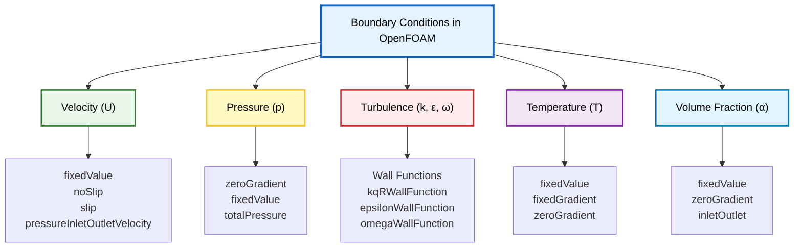
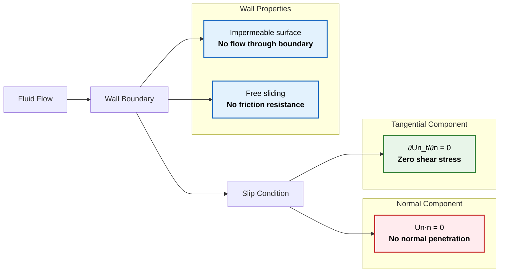
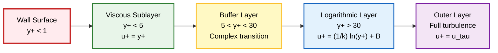

# Boundary Condition ทั่วไปใน OpenFOAM

**Boundary condition** เป็นองค์ประกอบพื้นฐานในการจำลองพลศาสตร์ของไหลเชิงคำนวณ (Computational Fluid Dynamics หรือ CFD) ซึ่งกำหนดว่าคุณสมบัติของไหลมีพฤติกรรมอย่างไรที่ขอบเขตทางกายภาพของโดเมนการคำนวณ

ใน OpenFOAM, Boundary Condition ถูกนำมาใช้ผ่านคลาส Field เฉพาะทางที่สืบทอดมาจากคลาสพื้นฐาน `fvPatchField` ซึ่งเป็นโครงสร้างที่แข็งแกร่งสำหรับการจัดการสถานการณ์ทางกายภาพต่างๆ ที่พบในการประยุกต์ใช้ทางวิศวกรรม

**การเลือก Boundary Condition ที่เหมาะสม** มีความสำคัญอย่างยิ่งต่อการได้มาซึ่งผลลัพธ์ที่สมจริงทางกายภาพและมีเสถียรภาพเชิงตัวเลข



---

## พื้นฐานทางคณิตศาสตร์ของ Boundary Condition

สำหรับตัวแปร Field ทั่วไป $\phi$, Boundary Condition สามารถแบ่งออกได้เป็นสามประเภททางคณิตศาสตร์หลักๆ

### 1. Dirichlet Boundary Conditions (Fixed Value)

**Dirichlet Boundary Condition** กำหนดค่าของตัวแปร Field โดยตรงที่พื้นผิวขอบเขต ในทางคณิตศาสตร์ สามารถแสดงได้ดังนี้:

$$\phi|_{\partial\Omega} = \phi_{\text{specified}}$$

*   $\phi$ แทนตัวแปร Field (เช่น องค์ประกอบความเร็ว, อุณหภูมิ หรือความดัน)
*   $\partial\Omega$ แสดงถึงขอบเขตของโดเมนการคำนวณ $\Omega$

### 2. Neumann Boundary Conditions (Fixed Gradient)

**Neumann Boundary Condition** กำหนด Normal Gradient ของตัวแปร Field ที่ขอบเขต ซึ่งเทียบเท่ากับการกำหนด Flux ที่ไหลผ่านขอบเขตนั้น การแสดงทางคณิตศาสตร์คือ:

$$\frac{\partial \phi}{\partial n}\bigg|_{\partial\Omega} = g_{\text{specified}}$$

*   $\frac{\partial}{\partial n}$ แทนอนุพันธ์ในทิศทาง Normal ไปยังขอบเขต
*   $g_{\text{specified}}$ คือค่า Gradient ที่กำหนด

### 3. Mixed Boundary Conditions (Robin Conditions)

**Mixed Boundary Condition** รวมการกำหนดทั้งค่าและ Gradient ผ่านพารามิเตอร์การถ่วงน้ำหนัก:

$$\alpha \phi + \beta \frac{\partial \phi}{\partial n} = \gamma$$

*   $\alpha$, $\beta$ และ $\gamma$ เป็นสัมประสิทธิ์ที่กำหนดความสำคัญสัมพัทธ์ของพจน์ค่าและพจน์ Gradient

---

## Boundary Condition สำหรับ Velocity (`U`)

### Fixed Value (Inlet)

เงื่อนไข `fixedValue` ระบุ **Vector ของ Velocity ที่กำหนดไว้ล่วงหน้า** ณ Boundary ซึ่งโดยทั่วไปใช้สำหรับ Inlet ที่ทราบลักษณะการไหล

**คุณสมบัติ:**
- สามารถเป็นค่าคงที่หรือเปลี่ยนแปลงตามเวลา
- ใช้ฟังก์ชันทางคณิตศาสตร์ได้
- เหมาะสำหรับ Inlet ที่ทราบ Velocity Profile อย่างชัดเจน

#### Uniform Constant Velocity

```cpp
inlet
{
    type            fixedValue;
    value           uniform (10 0 0); // Constant velocity in x-direction (m/s)
}
```

#### สำหรับ Inlet Condition ที่เปลี่ยนแปลงตามเวลา:

```cpp
inlet
{
    type            fixedValue;
    value           table
    (
        (0  (0 0 0))
        (1  (5 0 0))
        (5  (10 0 0))
        (10 (10 0 0))
    );
}
```

#### สำหรับ Parabolic Velocity Profile

```cpp
inlet
{
    type            fixedValue;
    value           #codeStream
    {
        codeInclude
        #{
            #include "fvCFD.H"
        #};
        code
        #{
            // Parabolic profile: u(y) = 4*U_max*y*(H-y)/H^2
            scalar U_max = 10.0;
            scalar H = 1.0;

            vectorField& field = *this;

            forAll(field, faceI)
            {
                scalar y = mesh.boundary()[patchi].Cf()[faceI].y();
                scalar u = 4.0 * U_max * y * (H - y) / (H * H);
                field[faceI] = vector(u, 0, 0);
            }
        #};
    };
}
```

---

### No-Slip (Wall)

เงื่อนไข **No-Slip** จำลอง **การยึดเกาะของความหนืด** ที่ Solid Boundary โดยที่ Fluid Velocity จะตรงกับ Wall Velocity (โดยทั่วไปเป็นศูนย์สำหรับผนังที่หยุดนิ่ง)

**คุณสมบัติ:**
- เป็นเงื่อนไขมาตรฐานสำหรับการไหลแบบ Viscous
- เหนือพื้นผิวของแข็ง
- Fluid Velocity ตรงกับ Wall Velocity

```cpp
walls
{
    type            noSlip; // Modern standard shorthand
    // Equivalent to:
    // type            fixedValue;
    // value           uniform (0 0 0);
}
```

**การแสดงทางคณิตศาสตร์:**
$$\mathbf{u} = \mathbf{u}_{\text{wall}}$$

สำหรับผนังที่หยุดนิ่ง: $\mathbf{u} = \mathbf{0}$

- **$\mathbf{u}$** = Fluid velocity vector
- **$\mathbf{u}_{\text{wall}}$** = Wall velocity vector

---

### Slip (Free Surface / Symmetry)

เงื่อนไข **Slip** จำลอง Boundary ที่ **ไม่มี Shear Stress** ทำให้ของไหลสามารถเลื่อนไปตามพื้นผิวได้อย่างอิสระ

**การใช้งาน:**
- Symmetry Plane
- Inviscid Wall
- Free Surface

```cpp
top
{
    type            slip;
}
```

**ในทางคณิตศาสตร์บังคับใช้:**
$$\mathbf{u} \cdot \mathbf{n} = 0 \quad \text{(no normal penetration)}$$
$$\frac{\partial \mathbf{u}_t}{\partial n} = 0 \quad \text{(zero tangential shear)}$$

- **$\mathbf{u}$** = Velocity vector
- **$\mathbf{n}$** = Normal vector to boundary
- **$\mathbf{u}_t$** = Tangential velocity component



---

### Pressure Inlet/Outlet Velocity

Boundary Condition นี้จะ **คำนวณ Velocity โดยอิงตาม Pressure Gradient** เพื่อให้มั่นใจถึงการอนุรักษ์มวล

**คุณสมบัติ:**
- มีประโยชน์อย่างยิ่งที่ Boundary ที่ทิศทางการไหลอาจกลับทิศทาง
- คำนวณจาก Flux โดยอัตโนมัติ
- เหมาะสำหรับ Outlet ที่มี Flow Reversal

```cpp
outlet
{
    type            pressureInletOutletVelocity;
    value           uniform (0 0 0); // Initial guess value
}
```

**Velocity คำนวณจาก Flux:**
$$\mathbf{u} = \frac{\dot{m}}{\rho A} \mathbf{n}$$

- **$\dot{m}$** = Mass flux
- **$\rho$** = Density
- **$A$** = Face area
- **$\mathbf{n}$** = Normal vector

---

### Moving Wall Velocity

สำหรับผนังที่เคลื่อนที่:

```cpp
movingWall
{
    type            fixedValue;
    value           uniform (5 0 0); // Wall moving at 5 m/s in x-direction
}
```

หรือใช้ `movingWallVelocity` สำหรับผนังที่เคลื่อนที่ด้วยความเร็วเชิงมุม:

```cpp
rotor
{
    type            movingWallVelocity;
    value           uniform (0 0 0);
}
```

ใน `dynamicMeshDict`:
```cpp
movingMesh
{
    mover            rotatingWall;
    origin           (0 0 0);
    axis             (0 0 1);
    omega            100; // rad/s
}
```

---

## Boundary Condition สำหรับ Pressure (`p`)

### Zero Gradient

เงื่อนไข `zeroGradient` ระบุว่า **Pressure ไม่เปลี่ยนแปลงในทิศทาง Normal** ไปยัง Boundary

**การใช้งาน:**
- Wall
- Velocity Inlet ที่ Pressure พัฒนาขึ้นตามธรรมชาติ
- กรณีที่ Pressure ไม่ทราบค่าแน่นอน

```cpp
walls
{
    type            zeroGradient;
}
```

**ในทางคณิตศาสตร์:**
$$\frac{\partial p}{\partial n} = 0$$

- **$p$** = Pressure
- **$\frac{\partial p}{\partial n}$** = Pressure gradient in normal direction

---

### Fixed Value

เงื่อนไขนี้ **กำหนดค่า Pressure ที่กำหนดไว้ล่วงหน้า** ณ Boundary ซึ่งโดยทั่วไปใช้สำหรับ Outlet ที่ทราบ Pressure

**การใช้งาน:**
- Outlet ที่ทราบ Pressure (มักจะตั้งค่าเป็น Gauge Pressure)
- กรณีที่ต้องการควบคุม Pressure ที่ Outlet

```cpp
outlet
{
    type            fixedValue;
    value           uniform 0; // Gauge pressure (relative to atmospheric)
}
```

**สำหรับการใช้งานทางกายภาพ (Absolute Pressure):**

```cpp
outlet
{
    type            fixedValue;
    value           uniform 101325; // Atmospheric pressure in Pascals
}
```

---

### Total Pressure

สำหรับการไหลที่อัดตัวได้ (compressible flows):

```cpp
inlet
{
    type            totalPressure;
    p0              uniform 101325; // Total pressure in Pa
    gamma           1.4;             // Heat capacity ratio
}
```

**สมการ Total Pressure:**
$$p_0 = p \left(1 + \frac{\gamma-1}{2} M^2\right)^{\frac{\gamma}{\gamma-1}}$$

- **$p_0$** = Total pressure (stagnation pressure)
- **$p$** = Static pressure
- **$\gamma$** = Heat capacity ratio ($c_p/c_v$)
- **$M$** = Mach number

---

### Fixed Flux Pressure

สำหรับกรณีที่ต้องการกำหนด Pressure Gradient โดยตรง:

```cpp
wall
{
    type            fixedFluxPressure;
    gradient        uniform 0; // Zero pressure gradient
}
```

---

## Boundary Condition สำหรับ Turbulence (`k`, `epsilon`, `omega`)

### Wall Functions

**Wall Function** เป็น **Boundary Condition เฉพาะทาง** ที่จำลอง Turbulent Boundary Layer โดยไม่จำเป็นต้องใช้ Mesh Resolution ที่ละเอียดมากใกล้ Wall

**หลักการทำงาน:**
- เชื่อมต่อ Viscous Sublayer และ Logarithmic Layer
- ใช้ Empirical Correlation
- ลดความจำเป็นในการใช้ Mesh ที่ละเอียดมากใกล้ผนัง



#### Wall Function สำหรับ k-epsilon Model

```cpp
walls
{
    type            kqRWallFunction; // For turbulent kinetic energy k
    value           uniform 0.1;
}

walls
{
    type            epsilonWallFunction; // For turbulent dissipation epsilon
    value           uniform 0.01;
}
```

#### Wall Function สำหรับ k-omega Model

```cpp
walls
{
    type            omegaWallFunction; // For specific dissipation rate omega
    value           uniform 1000;
}
```

**Wall Function มาตรฐานสำหรับ Turbulent Kinetic Energy:**
$$k_w = \frac{u_\tau^2}{\sqrt{C_\mu}}$$

- **$k_w$** = Turbulent kinetic energy at wall
- **$u_\tau$** = Friction velocity ($u_\tau = \sqrt{\tau_w/\rho}$)
- **$C_\mu$** = Model constant (typically 0.09)

#### Logarithmic Law of the Wall

กฎ Logarithmic Law of the Wall สำหรับความเร็วคือ:

$$u^+ = \frac{1}{\kappa} \ln(y^+) + B$$

*   $u^+ = \frac{u}{u_\tau}$ คือความเร็วไร้มิติ
*   $y^+ = \frac{y u_\tau}{\nu}$ คือระยะห่างจากผนังไร้มิติ
*   $u_\tau = \sqrt{\frac{\tau_w}{\rho}}$ คือความเร็วเสียดทาน (friction velocity)
*   $\kappa \approx 0.41$ คือค่าคงที่ von Kármán
*   $B \approx 5.2$ คือค่าคงที่เชิงประจักษ์

---

### Turbulent Inlet Conditions

#### Fixed Value with Turbulence Intensity

```cpp
inlet
{
    type            fixedValue;
    value           uniform 0.1; // k = 0.1 m²/s²
}

inlet
{
    type            fixedValue;
    value           uniform 0.01; // epsilon = 0.01 m²/s³
}
```

**การคำนวณค่าเริ่มต้นจาก Turbulence Intensity:**

สำหรับความเร็วเข้า $U_{inlet}$ และ Turbulence Intensity $I$:

$$k = \frac{3}{2} (U_{inlet} I)^2$$

$$\varepsilon = C_\mu^{3/4} \frac{k^{3/2}}{l}$$

โดยที่:
- $l$ = Length scale (มักใช้ 7% ของ hydraulic diameter)
- $C_\mu = 0.09$

---

## Boundary Condition ที่สำคัญเพิ่มเติม

### Boundary Condition สำหรับ Temperature (`T`)

#### Fixed Temperature
```cpp
hotWall
{
    type            fixedValue;
    value           uniform 373.15; // Temperature in Kelvin
}
```

#### Fixed Heat Flux
```cpp
heatedWall
{
    type            fixedGradient; // For heat flux specification
    gradient        uniform -1000; // W/m² (negative for heat into domain)
}
```

**ตามกฎของฟูเรียร์ (Fourier's Law):**
$$q = -k \nabla T$$

เมื่อใช้ `zeroGradient` สำหรับอุณหภูมิ:
$$\frac{\partial T}{\partial n} = 0 \implies q_n = -k \frac{\partial T}{\partial n} = 0$$

หมายถึง **ไม่มีการถ่ายเทความร้อนข้ามขอบเขต** → ผนังเป็นฉนวนอย่างสมบูรณ์

#### Convective Heat Transfer (Mixed BC)

```cpp
wall
{
    type            externalWallHeatFlux;
    mode            coefficient;
    h               uniform 10;      // Heat transfer coefficient [W/m²K]
    Ta              uniform 293;     // Ambient temperature [K]
    thickness       uniform 0.05;    // Wall thickness [m]
    kappa           uniform 0.7;     // Thermal conductivity [W/mK]
}
```

**สมการ Newton's Cooling Law:**
$$-k\frac{\partial T}{\partial n} = h(T_s - T_\infty)$$

- $k$ = Thermal Conductivity
- $h$ = Convective Heat Transfer Coefficient
- $T_s$ = Surface Temperature
- $T_\infty$ = Ambient Fluid Temperature

---

### Boundary Condition สำหรับ Volume Fraction (`alpha`)

สำหรับ Multiphase Flow:

#### Fixed Value Interface
```cpp
inlet
{
    type            fixedValue;
    value           uniform 1; // Pure phase
}
```

#### Zero Gradient Interface
```cpp
outlet
{
    type            zeroGradient;
    value           uniform 0; // Initial value
}
```

#### Inlet Outlet for Volume Fraction
```cpp
outlet
{
    type            inletOutlet;
    inletValue      uniform 0;
    value           uniform 0;
}
```

---

### Cyclic Boundary Condition

ใช้ **Periodic Boundary Conditions** สำหรับโดเมนที่เป็นคาบ:

```cpp
left
{
    type            cyclic;
    neighbourPatch  right;
}

right
{
    type            cyclic;
    neighbourPatch  left;
}
```

**การแปลงที่เป็นไปได้:**
- **การเลื่อน** (translation)
- **การหมุน** (rotation)
- **การสะท้อน** (reflection)

---

### Symmetry Boundary Condition

```cpp
symmetryPlane
{
    type            symmetryPlane;
}
```

**เงื่อนไขทางคณิตศาสตม์:**

1. **ข้อจำกัดความเร็วแนวตั้งฉาก:**
   $$\mathbf{n} \cdot \mathbf{u} = 0 \quad \text{(ความเร็วแนวตั้งฉาก = 0)}$$

2. **การจัดการสนามสเกลาร์ (อุณหภูมิ, ความดัน):**
   $$\frac{\partial \phi}{\partial n} = 0 \quad \text{(Gradient แนวตั้งฉากเป็นศูนย์)}$$

3. **พฤติกรรมความเร็วแนวสัมผัส:**
   $$\frac{\partial \mathbf{u}_t}{\partial n} = 0 \quad \text{(Gradient ของความเร็วแนวสัมผัสเป็นศูนย์)}$$

---

## แนวทางการเลือก Boundary Condition

### Inlet Boundary

| Variable | Recommended BC | หมายเหตุ |
|----------|----------------|-----------|
| **Velocity** | `fixedValue` | เมื่อทราบ Velocity Profile ของ Inlet |
| **Pressure** | `zeroGradient` | เพื่อให้ Pressure พัฒนาขึ้นตามธรรมชาติ |
| **Turbulence** | `fixedValue` | Turbulence Intensity 1-5% |
| **Temperature** | `fixedValue` | อุณหภูมิของไหลที่เข้ามา |

### Outlet Boundary

| Variable | Recommended BC | หมายเหตุ |
|----------|----------------|-----------|
| **Velocity** | `pressureInletOutletVelocity` หรือ `zeroGradient` | ขึ้นอยู่กับลักษณะการไหล |
| **Pressure** | `fixedValue` | โดยทั่วไป 0 (Gauge pressure) |
| **Turbulence** | `zeroGradient` | สำหรับ Developed Flow |
| **Temperature** | `zeroGradient` | เมื่อการไหลพัฒนาเต็มที่ |

### Wall Boundary

| Variable | Recommended BC | หมายเหตุ |
|----------|----------------|-----------|
| **Velocity** | `noSlip` (viscous) หรือ `slip` (inviscid) | ขึ้นอยู่กับลักษณะการไหล |
| **Pressure** | `zeroGradient` | สำหรับกรณีส่วนใหญ่ |
| **Temperature** | `fixedValue` หรือ `fixedGradient` | ขึ้นอยู่กับเงื่อนไขความร้อน |
| **Turbulence** | Wall Function | เพื่อหลีกเลี่ยงการปรับ Mesh ที่มากเกินไป |

---

## ตารางสรุป Boundary Condition ทั่วไป

| Boundary Condition Type | Mathematical Form | Physical Meaning | Common Applications |
|------------------------|-------------------|------------------|-------------------|
| **fixedValue** | $\phi|_{\partial\Omega} = \phi_{\text{specified}}$ | Direct value specification | Inlet velocity, wall temperature, concentration |
| **fixedGradient** | $\frac{\partial \phi}{\partial n}\bigg|_{\partial\Omega} = g_{\text{specified}}$ | Flux specification | Outlet flow, heat flux, symmetry |
| **zeroGradient** | $\frac{\partial \phi}{\partial n}\bigg|_{\partial\Omega} = 0$ | Zero flux condition | Fully developed flow, adiabatic walls |
| **mixed** | $\alpha \phi + \beta \frac{\partial \phi}{\partial n} = \gamma$ | Weighted value-gradient combination | Conjugate heat transfer, partial slip |
| **cyclic** | $\phi_1 = \phi_2$ | Field continuity across patches | Rotational symmetry, periodic domains |
| **inletOutlet** | Conditional on flux direction | Automatic switching for backflow | Outlets with possible recirculation |

---

## ตัวอย่างการตั้งค่าสมบูรณ์

### ตัวอย่าง 1: การไหลในท่อ (Pipe Flow)

```cpp
// 0/U file
dimensions      [0 1 -1 0 0 0 0];
internalField   uniform 0;

boundaryField
{
    inlet
    {
        type            fixedValue;
        value           uniform (5 0 0);  // 5 m/s in x-direction
    }

    outlet
    {
        type            zeroGradient;
    }

    walls
    {
        type            noSlip;
    }
}

// 0/p file
dimensions      [1 -1 -2 0 0 0 0];
internalField   uniform 0;

boundaryField
{
    inlet
    {
        type            zeroGradient;
    }

    outlet
    {
        type            fixedValue;
        value           uniform 0;  // 0 Pa gauge pressure
    }

    walls
    {
        type            zeroGradient;
    }
}
```

### ตัวอย่าง 2: การไหลแบบ Backward Facing Step

```cpp
// 0/U file
boundaryField
{
    inlet
    {
        type            fixedValue;
        value           uniform (1 0 0);
    }

    outlet
    {
        type            inletOutlet;
        inletValue      uniform (0 0 0);
        value           uniform (0 0 0);
    }

    walls
    {
        type            noSlip;
    }
}

// 0/p file
boundaryField
{
    inlet
    {
        type            zeroGradient;
    }

    outlet
    {
        type            fixedValue;
        value           uniform 0;
    }

    walls
    {
        type            fixedFluxPressure;
        gradient        uniform 0;
    }
}
```

### ตัวอย่าง 3: การไหลที่มีการถ่ายเทความร้อน

```cpp
// 0/T file
dimensions      [0 0 0 1 0 0 0];
internalField   uniform 293;

boundaryField
{
    inlet
    {
        type            fixedValue;
        value           uniform 293;  // 293 K inlet temperature
    }

    outlet
    {
        type            zeroGradient;
    }

    hotWall
    {
        type            fixedValue;
        value           uniform 373;  // 373 K heated wall
    }

    coldWall
    {
        type            fixedGradient;
        gradient        uniform 0;  // Adiabatic (zero flux)
    }
}
```

---

## บทสรุป

**การเลือกและการนำ Boundary Condition ไปใช้อย่างเหมาะสม** เป็นพื้นฐานสำคัญสำหรับการจำลอง CFD ที่แม่นยำ เนื่องจากมีอิทธิพลอย่างมากต่อ:

- **Flow Physics** - ลักษณะการไหลที่เป็นจริง
- **Solution Stability** - ความเสถียรของการคำนวณ
- **Convergence** - การลู่เข้าสู่คำตอบ
- **Physical Accuracy** - ความถูกต้องทางกายภาพ

### หลักการสำคัญในการเลือก Boundary Condition:

1. **ความสอดคล้องทางคณิตศาสตร์**: Boundary Condition ต้องสร้าง Well-Posed Problem
2. **ความถูกต้องทางกายภาพ**: ต้องสอดคล้องกับปรากฏการณ์ทางฟิสิกส์ที่เกิดขึ้นจริง
3. **ความเสถียรเชิงตัวเลข**: หลีกเลี่ยงเงื่อนไขที่ทำให้เกิดการลู่ออกของการคำนวณ
4. **ประสิทธิภาพการคำนวณ**: เลือกเงื่อนไขที่ให้ผลลัพธ์ถูกต้องในเวลาที่เหมาะสม

การทำความเข้าใจหลักการของแต่ละ Boundary Condition จะช่วยให้สามารถเลือกใช้ได้อย่างเหมาะสมกับปัญหาที่ต้องการแก้ไข และนำไปสู่การจำลอง CFD ที่มีประสิทธิภาพและเชื่อถือได้
