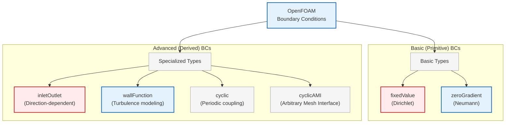
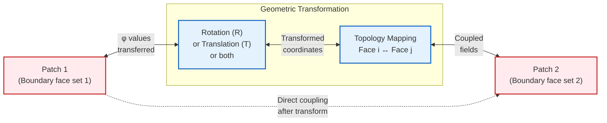
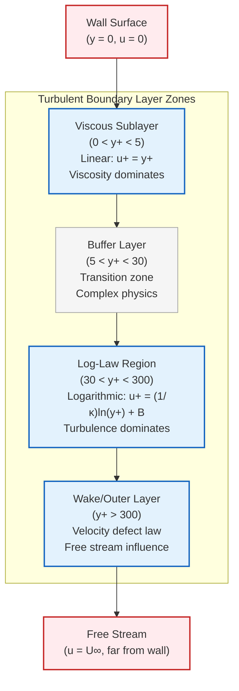
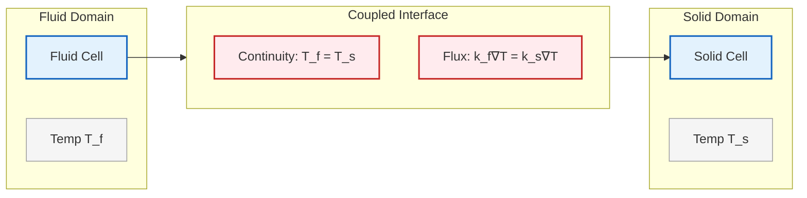
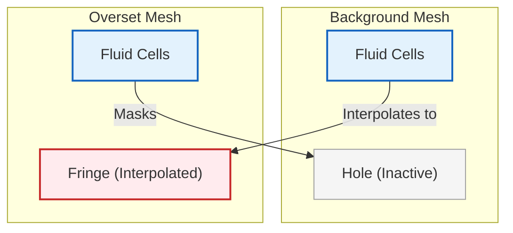
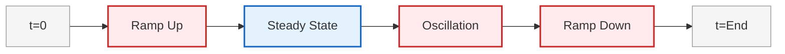

# เงื่อนไขขอบเขตขั้นสูง (Advanced Boundary Conditions)

## Introduction

เงื่อนไขขอบเขตขั้นสูง (Advanced Boundary Conditions) เป็นเครื่องมือเฉพาะทางใน OpenFOAM ที่ออกแบบมาเพื่อจัดการกับสถานการณ์ทางกายภาพที่ซับซ้อน ซึ่งเงื่อนไขขอบเขตพื้นฐานอย่าง Dirichlet และ Neumann อาจไม่เพียงพอ บทนี้จะกล่าวถึง Boundary Condition ที่มีความซับซ้อนสูงและมีความสามารถพิเศษในการจำลองปรากฏการณ์ทางกายภาพที่หลากหลาย



> **Figure 1:** หมวดหมู่ของเงื่อนไขขอบเขตขั้นสูงใน OpenFOAM ครอบคลุมตั้งแต่การจัดการทิศทางการไหล (Inlet/Outlet) ความสมมาตรแบบเป็นคาบ (Cyclic) การจำลองผนัง (Wall Functions) ไปจนถึงการเชื่อมโยงหลายภูมิภาคและเงื่อนไขที่เปลี่ยนแปลงตามเวลา


### `inletOutlet` Boundary Condition

เป็นเงื่อนไขแบบไฮบริดที่ซับซ้อน ซึ่งจะเปลี่ยนพฤติกรรมโดยอัตโนมัติตามทิศทางการไหลเฉพาะที่ (local flow direction) ณ แต่ละหน้าของ Boundary Patch

**คุณค่าหลัก**:
- ใช้ได้ดีที่ท้าย Bluff Body
- เหมาะสำหรับโซนการไหลย้อนกลับ (recirculation zones)
- เหมาะสำหรับทางออกที่มีการหลุดของกระแสวน (vortex shedding) อย่างรุนแรง
- ป้องกันปัญหาการไหลย้อนกลับ (backflow) ที่อาจทำให้เกิดการลู่ออก (divergence)


```mermaid
graph TD
%% inletOutlet Logic Flow
subgraph Logic ["inletOutlet Automatic Switching"]
Calc["Calculate Local Mass Flux<br/>φ = ρ(U·n)"]:::context
Check{"Direction Check<br/>φ > 0 ?<br/>(Positive = Outflow)"}:::explicit
Zero["Apply zeroGradient<br/>(Extrapolate from interior)<br/>Outlet behavior"]:::implicit
Fixed["Apply fixedValue<br/>(Use specified inletValue)<br/>Inlet behavior"]:::explicit
end

Calc --> Check
Check -->|Yes (Outflow)| Zero
Check -->|No (Inflow)| Fixed

%% Classes
classDef implicit fill:#e3f2fd,stroke:#1565c0,stroke-width:2px;
classDef explicit fill:#ffebee,stroke:#c62828,stroke-width:2px;
classDef context fill:#f5f5f5,stroke:#9e9e9e,stroke-width:1px;
```
> **Figure 2:** ตรรกะการสลับพฤติกรรมอัตโนมัติของเงื่อนไข `inletOutlet` โดยพิจารณาจากเครื่องหมายของฟลักซ์มวลเฉพาะที่ เพื่อเลือกระหว่างเงื่อนไขกำหนดค่าตายตัว (เมื่อไหลเข้า) และเงื่อนไขเกรเดียนต์เป็นศูนย์ (เมื่อไหลออก)


Boundary Condition นี้ทำงานโดยพิจารณาจากเครื่องหมายของ **Local Mass Flux**:
$$\phi_f = \rho \mathbf{u} \cdot \mathbf{n}_f$$

โดยที่:
- $\phi_f$ = Local mass flux
- $\rho$ = ความหนาแน่นของไหล
- $\mathbf{u}$ = เวกเตอร์ความเร็ว
- $\mathbf{n}_f$ = เวกเตอร์แนวฉากที่ชี้ออกด้านนอกที่หน้า $f$

ตรรกะการสลับ:
$$
\mathbf{u}_b = \begin{cases}
\mathbf{u}_{\text{fixed}} & \text{if } \phi_f > 0 \text{ (inflow)} \\
\mathbf{u}_{\text{zero-grad}} & \text{if } \phi_f \leq 0 \text{ (outflow)}
\end{cases}
$$

#### OpenFOAM Code Implementation

```cpp
outlet
{
    // Type of boundary condition: switches between fixed value and zero gradient
    type            inletOutlet;
    // Fixed value to use when flow enters the domain (inflow condition)
    inletValue      uniform (0 0 0);
    // Initial field value (used for initialization and as fallback)
    value           uniform (0 0 0);
}
```

**Source:** `.applications/utilities/parallelProcessing/reconstructPar/fvFieldReconstructorReconstructFields.C`

**คำอธิบาย:**
- **type**: ระบุประเภทของเงื่อนไขขอบเขตเป็น `inletOutlet` ซึ่งเป็น boundary condition แบบไฮบริดที่สลับระหว่าง fixed value และ zero gradient โดยอัตโนมัติ
- **inletValue**: ค่าคงที่ที่จะใช้เมื่อการไหลไหลเข้าสู่โดเมน (inflow condition) โดยปกติจะตั้งเป็นศูนย์หรือค่าที่เหมาะสมกับปัญหา
- **value**: ค่าเริ่มต้นของฟิลด์ที่ใช้สำหรับการเริ่มต้นคำนวณและเป็นค่าสำรองเมื่อไม่สามารถกำหนดค่าได้

**แนวคิดสำคัญ:**
1. **Runtime Switching**: การสลับพฤติกรรมของ boundary condition เกิดขึ้นระหว่างการคำนวณ (runtime) โดยไม่ต้องรีสตาร์ทเคส
2. **Face-by-Face Evaluation**: การตรวจสอบทิศทางการไหลทำงานที่ละหน้า (face) บน boundary patch ทำให้สามารถรองรับการไหลแบบไม่สม่ำเสมอ
3. **Numerical Stability**: ป้องกันปัญหาการแพร่กระจายของความผิดพลาด (divergence) ที่อาจเกิดจากการไหลย้อนกลับที่ outlet

**ข้อดีหลัก**: **ความเสถียรเชิงตัวเลข** (numerical stability) โดยการป้องกันการไหลย้อนกลับที่ไม่เป็นไปตามหลักฟิสิกส์ซึ่งอาจทำให้เกิดการลู่ออก (divergence)

> [!TIP] **Tip:** เมื่อใช้ `inletOutlet` ควรตรวจสอบ Mass Balance โดยใช้ `postProcess -func "flowRatePatch(name=outlet)"` เพื่อยืนยันว่าไม่มี Backflow ที่เกิดขึ้นอย่างต่อเนื่อง

---

### `pressureInletOutletVelocity`

เป็นอีกหนึ่งรูปแบบของ Boundary Condition ที่คำนวณ Velocity โดยอิงตาม Pressure Gradient เพื่อให้มั่นใจถึงการอนุรักษ์มวล

**คุณสมบัติ:**
- มีประโยชน์อย่างยิ่งที่ Boundary ที่ทิศทางการไหลอาจกลับทิศทาง
- คำนวณจาก Flux โดยอัตโนมัติ
- เหมาะสำหรับ Outlet ที่มี Flow Reversal

#### OpenFOAM Code Implementation

```cpp
outlet
{
    // Velocity boundary condition that switches based on flux direction
    type            pressureInletOutletVelocity;
    // Initial guess value for velocity field
    value           uniform (0 0 0);
}
```

**Source:** `.applications/utilities/parallelProcessing/reconstructPar/fvFieldReconstructorReconstructFields.C`

**คำอธิบาย:**
- **type**: ระบุประเภทของเงื่อนไขขอบเขตเป็น `pressureInletOutletVelocity` ซึ่งคำนวณความเร็วจากฟลักซ์ความดันและสลับโหมดตามทิศทางการไหล
- **value**: ค่าเริ่มต้นของฟิลด์ความเร็วที่ใช้สำหรับการเริ่มต้นคำนวณและเป็นค่าเดาเบื้องต้น

**แนวคิดสำคัญ:**
1. **Flux-Based Calculation**: ความเร็วถูกคำนวณจากฟลักซ์มวลที่ผ่านหน้า (face) แต่ละหน้า โดยคำนึงถึงทิศทางการไหล
2. **Pressure-Velocity Coupling**: เงื่อนไขขอบเขตนี้ทำงานร่วมกับ solver ที่ใช้ pressure-velocity coupling เช่น SIMPLE, PISO เพื่อให้แน่ใจว่าการอนุรักษ์มวลได้รับการรักษา
3. **Automatic Direction Switching**: สลับระหว่าง inlet condition (fixed value) และ outlet condition (zero gradient) โดยอัตโนมัติตามเครื่องหมายของฟลักซ์

**Velocity คำนวณจาก Flux:**
$$\mathbf{u} = \frac{\dot{m}}{\rho A} \mathbf{n}$$

- **$\dot{m}$** = Mass flux
- **$\rho$** = Density
- **$A$** = Face area
- **$\mathbf{n}$** = Normal vector

---

## Cyclic (เป็นคาบ)

### `cyclic` Boundary Condition

ใช้ **Periodic Boundary Conditions** โดยการสร้างการเชื่อมต่อเชิงทอพอโลยี (topological connection) ระหว่าง Boundary Patch สองอัน



> **Figure 3:** กรอบแนวคิดของเงื่อนไขขอบเขตแบบเป็นคาบ (Cyclic) แสดงการเชื่อมต่อเชิงทอพอโลยีเพื่อให้เกิดความต่อเนื่องทางกายภาพของฟิลด์และฟลักซ์ระหว่างขอบเขตคู่ที่ระบุ โดยใช้การแมปและการแปลงทางเรขาคณิต

- ถือว่า Patch ที่ระบุมีความต่อเนื่องทางกายภาพ
- ทำให้ของไหล, โมเมนตัม, และปริมาณอื่นๆ ที่ถูกขนส่งสามารถไหลผ่านได้อย่างราบรื่น
- บังคับใช้ความเท่าเทียมกันของ Field และความต่อเนื่องของ Flux
- สร้างโครงสร้างโดเมนแบบอนันต์หรือแบบซ้ำกันอย่างมีประสิทธิภาพ

#### กรอบแนวคิดเชิงทอพอโลยี

เมื่อ Patch สองอันถูกกำหนดให้เป็น Cyclic, OpenFOAM จะทำการ:

1. **จับคู่ทางเรขาคณิต** (geometric matching) เพื่อความสอดคล้องกันแบบ Face-by-Face
2. **ปรับเปลี่ยน Mesh Topology** ให้:
   - จุดศูนย์กลางของ Face สอดคล้องกัน
   - พื้นที่ของ Face เท่ากัน
   - เวกเตอร์แนวฉากจัดเรียงตามการแปลงที่ระบุ

**การแปลงที่เป็นไปได้**:
- **การเลื่อน** (translation)
- **การหมุน** (rotation)
- **การสะท้อน** (reflection)

#### การนำไปใช้งานทางคณิตศาสตร์

สำหรับ Field $\phi$ ที่ใช้กับ Cyclic Boundary Conditions:
$$\phi_{\text{patch A}}(\mathbf{x}) = \phi_{\text{patch B}}(\mathbf{T}(\mathbf{x}))}$$

โดยที่:
- $\mathbf{T}$ = การแปลงทางเรขาคณิตที่แมปพิกัดจาก Patch A ไปยัง Patch B
- $\phi$ = Field ที่ถูกบังคับใช้เงื่อนไข

ความต่อเนื่องของ Flux:
$$\mathbf{n}_A \cdot \nabla \phi_A = -\mathbf{n}_B \cdot \nabla \phi_B$$

เพื่อให้มั่นใจในการอนุรักษ์ปริมาณที่ถูกขนส่งข้ามรอยต่อที่เป็นคาบ

#### OpenFOAM Code Implementation

```cpp
left
{
    // Type of boundary condition: connects two patches topologically
    type            cyclic;
    // Name of the neighbouring patch that forms the cyclic pair
    neighbourPatch  right;
}
```

**Source:** `.applications/utilities/parallelProcessing/reconstructPar/fvFieldReconstructorReconstructFields.C`

**คำอธิบาย:**
- **type**: ระบุประเภทของเงื่อนไขขอบเขตเป็น `cyclic` ซึ่งสร้างการเชื่อมต่อเชิงทอพอโลยีระหว่าง patch คู่หนึ่ง
- **neighbourPatch**: ชื่อของ patch ที่เป็นคู่กับ patch นี้ในการเชื่อมต่อแบบ cyclic ซึ่งต้องมี topology ที่สอดคล้องกัน

**แนวคิดสำคัญ:**
1. **Topological Connection**: การเชื่อมต่อระหว่าง patch สองอันเป็นการเชื่อมต่อเชิงทอพอโลยี ไม่ใช่เพียงการเชื่อมต่อทางกายภาพเท่านั้น
2. **Face Matching**: ต้องมีการจับคู่ face ระหว่าง patch ทั้งสองอย่างถูกต้อง โดยต้องมีจำนวน face เท่ากันและตำแหน่งเรขาคณิตที่สอดคล้องกัน
3. **Geometric Transformation**: สามารถมีการแปลงทางเรขาคณิต (เช่น การหมุน การเลื่อน) ระหว่าง patch คู่ cyclic ได้

**การนำไปใช้งานในระบบ**:
- ใช้คลาส `cyclicPolyPatch` ภายใน Mesh Topology
- ระหว่างการสร้าง Mesh: สร้างการสอดคล้องกันของ Face และเมทริกซ์การแปลงทางเรขาคณิต
- สำหรับการคำนวณแบบขนาน: จัดการการสื่อสารระหว่างโปรเซสเซอร์เพื่อรักษาความเป็นคาบ

#### การประยุกต์ใช้งานและรูปแบบต่างๆ

| การประยุกต์ใช้งาน | คำอธิบาย |
|------------------|------------|
| **โดเมนที่เป็นคาบ** | Turbomachinery Cascades, Heat Exchangers |
| **การประมาณค่ากระบอก/ทรงกลมอนันต์** | ใช้รูปทรงลิ่ม (wedge geometries) |
| **เครื่องจักรหมุน** | กรอบอ้างอิงแบบหมุน (rotating reference frames) |
| **การจำลองการไหลในช่อง** | การวิจัย Turbulence (Channel Flow) |

**รูปแบบเฉพาะทางใน OpenFOAM**:
- `cyclicAMI`: สำหรับการเชื่อมต่อ Arbitrary Mesh Interface
- `turbulentDFSEMInlet`: สำหรับการสร้าง Synthetic Turbulent Inflow โดยใช้วิธี Digital Filter

> [!WARNING] **Important:** เมื่อใช้ `cyclic` BC จำเป็นต้องตรวจสอบให้แน่ใจว่า Mesh Topology ของทั้งสอง Patch มีความสอดคล้องกันอย่างสมบูรณ์ มิฉะนั้นจะเกิดปัญหาในการแมปค่าระหว่าง Patch

---

## Wall Functions

### แนวคิดพื้นฐานของ Wall Functions

**Wall Function** เป็น **Boundary Condition เฉพาะทาง** ที่จำลอง Turbulent Boundary Layer โดยไม่จำเป็นต้องใช้ Mesh Resolution ที่ละเอียดมากใกล้ Wall

**หลักการทำงาน**:
- เชื่อมต่อ Viscous Sublayer และ Logarithmic Layer
- ใช้ Empirical Correlation
- ลดความจำเป็นในการใช้ Mesh ที่ละเอียดมากใกล้ผนัง



> **Figure 4:** โครงสร้างของชั้นขอบเขตแบบปั่นป่วนและการสร้างแบบจำลองที่ผนัง แสดงลำดับชั้นตั้งแต่ผนัง (Wall) ไปจนถึงชั้นนอก (Outer layer) เพื่ออธิบายการทำงานของ Wall Function ในการเชื่อมโยงบริเวณต่าง ๆ เข้าด้วยกัน


```cpp
walls
{
    // Wall function for turbulent kinetic energy (k)
    type            kqRWallFunction;
    // Initial value for turbulent kinetic energy at the wall
    value           uniform 0.1;
}

walls
{
    // Wall function for turbulent dissipation rate (epsilon)
    type            epsilonWallFunction;
    // Initial value for turbulent dissipation at the wall
    value           uniform 0.01;
}
```

**Source:** `.applications/utilities/parallelProcessing/reconstructPar/fvFieldReconstructorReconstructFields.C`

**คำอธิบาย:**
- **type**: ระบุประเภทของเงื่อนไขขอบเขตเป็น `kqRWallFunction` สำหรับ turbulent kinetic energy (k) หรือ `epsilonWallFunction` สำหรับ turbulent dissipation rate (epsilon)
- **value**: ค่าเริ่มต้นของฟิลด์ที่ใช้สำหรับการเริ่มต้นคำนวณ

**แนวคิดสำคัญ:**
1. **Wall Modeling**: ใช้ empirical correlation เพื่อจำลอง turbulent boundary layer โดยไม่ต้องใช้ mesh ที่ละเอียดมากใกล้ผนัง
2. **y+ Consideration**: ค่า y+ ควรอยู่ในช่วงที่เหมาะสม (30-300 สำหรับ k-ε model) เพื่อให้ wall function ทำงานได้อย่างถูกต้อง
3. **Computational Efficiency**: ลดจำนวนเซลล์ที่ต้องการใกล้ผนัง ทำให้ประหยัดเวลาและทรัพยากรในการคำนวณ

#### Wall Function สำหรับ k-omega Model

```cpp
walls
{
    // Wall function for specific dissipation rate (omega)
    type            omegaWallFunction;
    // Initial value for omega at the wall
    value           uniform 1000;
}
```

**Source:** `.applications/utilities/parallelProcessing/reconstructPar/fvFieldReconstructorReconstructFields.C`

**คำอธิบาย:**
- **type**: ระบุประเภทของเงื่อนไขขอบเขตเป็น `omegaWallFunction` สำหรับ specific dissipation rate (omega) ใน k-ω turbulence model
- **value**: ค่าเริ่มต้นของฟิลด์ omega ที่ใช้สำหรับการเริ่มต้นคำนวณ

**แนวคิดสำคัญ:**
1. **k-ω Model Compatibility**: wall function นี้ออกแบบมาเพื่อทำงานร่วมกับ k-ω turbulence model ซึ่งมีคุณสมบัติแตกต่างจาก k-ε model
2. **Near-Wall Treatment**: ให้การจัดการพิเศษสำหรับบริเวณใกล้ผนังโดยคำนึงถึงคุณสมบัติของ k-ω model
3. **Low-Reynolds Correction**: สามารถใช้งานได้ทั้งในโหมด high-Reynolds (กับ wall function) และ low-Reynolds (โดยไม่มี wall function)

**Wall Function มาตรฐานสำหรับ Turbulent Kinetic Energy:**
$$k_w = \frac{u_\tau^2}{\sqrt{C_\mu}}$$

- **$k_w$** = Turbulent kinetic energy at wall
- **$u_\tau$** = Friction velocity
- **$C_\mu$** = Model constant (typically 0.09)

---

## Coupled Boundary Conditions

### Region-Coupled Boundary Conditions

สำหรับปัญหา Multiphysics ที่ต้องการการเชื่อมโยงระหว่าง Region ต่างๆ:



> **Figure 5:** รอยต่อความร้อนแบบเชื่อมโยงสำหรับการจำลองแบบหลายภูมิภาค แสดงการบังคับใช้ความต่อเนื่องของอุณหภูมิและความสมดุลของฟลักซ์ความร้อนที่รอยต่อระหว่างของไหลและของแข็ง


| Type | ความสามารถ | การประยุกต์ใช้ |
|------|-------------|-----------------|
| `turbulentTemperatureCoupledBaffleMixed` | การเชื่อมโยงความร้อนระหว่าง Region | Conjugate Heat Transfer |
| `thermalBaffle1DHeatTransfer` | การนำความร้อน 1 มิติผ่านผนัง | ผนังบางที่มีการนำความร้อน |
| `regionCoupledAMIFVPatchField` | Interface Conditions สำหรับ Non-Conformal Meshes | การเชื่อมต่อ Mesh ที่ไม่ตรงกัน |

---

## Overset Mesh Boundary Conditions

### `oversetFvPatchField`

สำหรับเทคนิค Overset (Chimera) Mesh ที่ซับซ้อน:



> **Figure 6:** การประมาณค่าในช่วงของ Overset Mesh และการแบ่งโซนเซลล์ แสดงการโต้ตอบระหว่าง Mesh พื้นหลังและ Mesh ซ้อนทับ รวมถึงบทบาทของเซลล์ประเภท Fringe, Hole และ Active ในการหาผลเฉลย


| Type | ความสามารถ | การประยุกต์ใช้ |
|------|-------------|-----------------|
| `oversetFvPatchField` | การจัดการพิเศษสำหรับการประมาณค่าในช่วง Overset | Moving Meshes, Multiple Reference Frames |
| `implicitOversetPressure` | การจัดการแบบ Implicit สำหรับ Pressure-Velocity Coupling | การแก้สมการความดันใน Overset Regions |

---

## Time-Varying Boundary Conditions

### `timeVaryingUniformFixedValue`

OpenFOAM รองรับ Time-Dependent Boundary Condition ที่ซับซ้อน:

#### การป้อนข้อมูลแบบตาราง (Tabular Data Input)

```cpp
boundaryField
{
    inlet
    {
        // Fixed value boundary condition with time-varying data from a table
        type            uniformFixedValue;
        // Table of (time value) pairs for temporal variation
        uniformValue    table
        (
            (0     (1 0 0))    // Time = 0s, velocity = (1,0,0) m/s
            (10    (2 0 0))    // Time = 10s, velocity = (2,0,0) m/s
            (20    (1.5 0 0))  // Time = 20s, velocity = (1.5,0,0) m/s
        );
    }
}
```

**Source:** `.applications/utilities/parallelProcessing/reconstructPar/fvFieldReconstructorReconstructFields.C`

**คำอธิบาย:**
- **type**: ระบุประเภทของเงื่อนไขขอบเขตเป็น `uniformFixedValue` ซึ่งใช้ค่าที่กำหนดและสามารถเปลี่ยนแปลงตามเวลา
- **uniformValue**: ค่าที่ใช้สำหรับ boundary condition ซึ่งสามารถเป็นค่าคงที่หรือค่าที่เปลี่ยนแปลงตามเวลาจากตาราง

**แนวคิดสำคัญ:**
1. **Temporal Interpolation**: OpenFOAM จะทำการ interpolate ค่าระหว่างจุดเวลาที่ระบุในตารางโดยอัตโนมัติ
2. **Extrapolation**: สำหรับเวลาที่อยู่นอกช่วงที่ระบุในตาราง OpenFOAM จะใช้ค่าที่จุดปลายสุด
3. **Time Accuracy**: ความแม่นยำของการแทนค่าขึ้นอยู่กับความละเอียดของเวลาในตาราง



> **Figure 7:** วิวัฒนาการของโปรไฟล์ความเร็วขาเข้าที่เปลี่ยนแปลงตามเวลา แสดงขั้นตอนตั้งแต่การเพิ่มความเร็ว สภาวะคงตัว การแกว่งแบบไซน์ ไปจนถึงการลดความเร็วและการไหลออกเพื่อจำลองพลวัตที่ซับซ้อน


#### ฟังก์ชันทางคณิตศาสตร์ (Mathematical Functions)

```cpp
boundaryField
{
    pulsatingInlet
    {
        // User-coded boundary condition for complex time-varying behavior
        type            codedFixedValue;
        // Initial field value
        value           uniform (0 0 0);
        // Code block to calculate boundary value dynamically
        code
        #{
            // Get current simulation time
            scalar t = this->db().time().value();
            // Get reference to the boundary field
            vectorField& field = *this;
            // Apply sinusoidal velocity variation in x-direction
            field = vector(1.0 + 0.5*sin(2*pi*0.1*t), 0, 0);
        #};
    }
}
```

**Source:** `.applications/utilities/parallelProcessing/reconstructPar/fvFieldReconstructorReconstructFields.C`

**คำอธิบาย:**
- **type**: ระบุประเภทของเงื่อนไขขอบเขตเป็น `codedFixedValue` ซึ่งอนุญาตให้ผู้ใช้เขียนโค้ด C++ เพื่อกำหนดค่า boundary condition แบบไดนามิก
- **value**: ค่าเริ่มต้นของฟิลด์ที่ใช้สำหรับการเริ่มต้นคำนวณ
- **code**: บล็อกโค้ด C++ ที่ใช้คำนวณค่า boundary condition แบบไดนามิกตามเวลาหรือเงื่อนไขอื่นๆ

**แนวคิดสำคัญ:**
1. **Runtime Compilation**: โค้ดที่เขียนในส่วน `code` จะถูกคอมไพล์ขณะ runtime ทำให้มีความยืดหยุ่นสูงในการกำหนด boundary condition
2. **Field Access**: สามารถเข้าถึงฟิลด์อื่นๆ, เวลา, และข้อมูลของ mesh ได้โดยตรงภายในบล็อกโค้ด
3. **Mathematical Functions**: สามารถใช้ฟังก์ชันทางคณิตศาสตร์ที่ซับซ้อน (เช่น sinusoidal, exponential) เพื่อสร้าง boundary condition ที่เปลี่ยนแปลงตามเวลา

---

## Custom Boundary Condition Development

การสร้าง Custom Boundary Condition เกี่ยวข้องกับการสืบทอดจากคลาสพื้นฐาน `fvPatchField`:

```cpp
template<class Type>
class customBoundaryCondition
:
    public fvPatchField<Type>
{
private:
    // Private member variables for custom parameters
    scalar coefficient_;
    word coupledFieldName_;

public:
    // Runtime type information for dynamic object creation
    TypeName("customBoundaryCondition");

    // Constructors for object initialization
    customBoundaryCondition
    (
        const fvPatch&,
        const DimensionedField<Type, volMesh>&,
        const dictionary&
    );

    // Virtual function overrides for boundary condition behavior
    virtual void updateCoeffs();
    virtual tmp<Field<Type>> snGrad() const;
    virtual void evaluate(const Pstream::commsTypes commsType);
};
```

**Source:** `.applications/utilities/parallelProcessing/reconstructPar/fvFieldReconstructorReconstructFields.C`

**คำอธิบาย:**
- **template<class Type>**: ใช้ template เพื่อให้ boundary condition สามารถทำงานกับ type ต่างๆ ของ field (scalar, vector, tensor)
- **fvPatchField<Type>**: คลาสฐานสำหรับ finite volume boundary condition ซึ่งมีฟังก์ชันพื้นฐานสำหรับการจัดการ boundary
- **TypeName**: แมโครสำหรับลงทะเบียนประเภทของคลาสเพื่อให้สามารถสร้าง object ได้แบบ dynamic ตาม runtime
- **updateCoeffs()**: ฟังก์ชันสำหรับอัปเดตค่าสัมประสิทธิ์ของ boundary condition
- **snGrad()**: ฟังก์ชันสำหรับคำนวณ surface normal gradient
- **evaluate()**: ฟังก์ชันสำหรับประเมินค่าของ boundary field

**แนวคิดสำคัญ:**
1. **Object-Oriented Design**: ใช้หลักการของ OOP ผ่านการสืบทอด (inheritance) และ virtual functions เพื่อสร้าง boundary condition ที่ยืดหยุ่น
2. **Runtime Selection**: ระบบ type ของ OpenFOAM อนุญาตให้สร้างและใช้งาน boundary condition แบบ dynamic ตามข้อมูลใน dictionary
3. **Polymorphic Behavior**: ฟังก์ชัน virtual ทำให้สามารถกำหนดพฤติกรรมเฉพาะสำหรับ boundary condition ที่กำหนดเองได้

---

## Summary Table: Advanced Boundary Conditions

| Boundary Condition | Type | Mathematical Form | Common Applications |
|-------------------|------|-------------------|-------------------|
| **inletOutlet** | Hybrid | $\mathbf{u}_b = \begin{cases} \mathbf{u}_{\text{fixed}} & \phi_f > 0 \\ \mathbf{u}_{\text{zero-grad}} & \phi_f \leq 0 \end{cases}$ | Outlet with possible backflow |
| **cyclic** | Periodic | $\phi_{\text{patch A}}(\mathbf{x}) = \phi_{\text{patch B}}(\mathbf{T}(\mathbf{x}))}$ | Periodic domains, rotating machinery |
| **wallFunction** | Calculated | $u^+ = \frac{1}{\kappa} \ln(y^+) + B$ | Turbulent boundary layers |
| **regionCoupled** | Coupled | $T_1 = T_2, q_1 = -q_2$ | Conjugate heat transfer |
| **codedFixedValue** | User-defined | $\phi = f(\mathbf{x}, t, \text{other fields})$ | Complex transient BCs |

---

## Best Practices

### การเลือกใช้ Advanced Boundary Conditions

> [!INFO] **Guidelines:**
> 1. **inletOutlet**: ใช้เมื่อมีความเป็นไปได้ของการไหลย้อนกลับที่ Outlet
> 2. **cyclic**: ใช้เมื่อมีความสมมาตรแบบเป็นคาบหรือโดเมนที่ซ้ำกัน
> 3. **wallFunction**: ใช้เพื่อลดจำนวนเซลล์ใกล้ผนังสำหรับ Turbulent Flow
> 4. **coupled**: ใช้สำหรับปัญหา Multiphysics ที่ต้องการการแลกเปลี่ยนข้อมูลระหว่าง Region

### การตรวจสอบและการแก้ไขปัญหา

> [!WARNING] **Common Issues:**
> - **Inflow at Outlet**: ใช้ `inletOutlet` หรือขยาย Domain ปลายน้ำ
> - **Mass Balance Issues**: ตรวจสอบ Flux ผ่านทุก Boundary Patch
> - **Cyclic Mesh Mismatch**: ตรวจสอบให้แน่ใจว่า Face Topology สอดคล้องกัน
> - **Wall Function y+**: ตรวจสอบ y+ values อยู่ในช่วงที่เหมาะสม (30-300 สำหรับ k-ε)

---

## Internal Links

- [[00_Overview]] - ภาพรวมของ Boundary Conditions ใน OpenFOAM
- [[02_Fundamental_Classification]] - การจำแนกประเภทพื้นฐาน
- [[05_Common_Boundary_Conditions_in_OpenFOAM]] - Boundary Conditions ทั่วไป
- [[07_Troubleshooting_Boundary_Conditions]] - การแก้ไขปัญหา

---

**References:**
1. OpenFOAM User Guide - Boundary Conditions
2. OpenFOAM Programmer's Guide - fvPatchField Class Hierarchy
3. H.K. Versteeg and W. Malalasekera, "An Introduction to Computational Fluid Dynamics"
4. Ferziger and Peric, "Computational Methods for Fluid Dynamics"