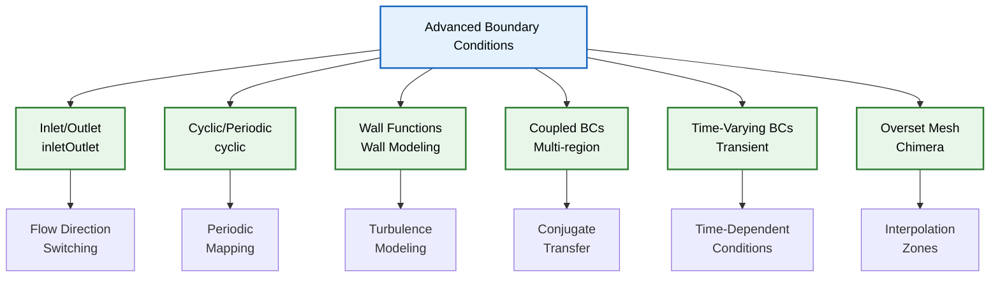
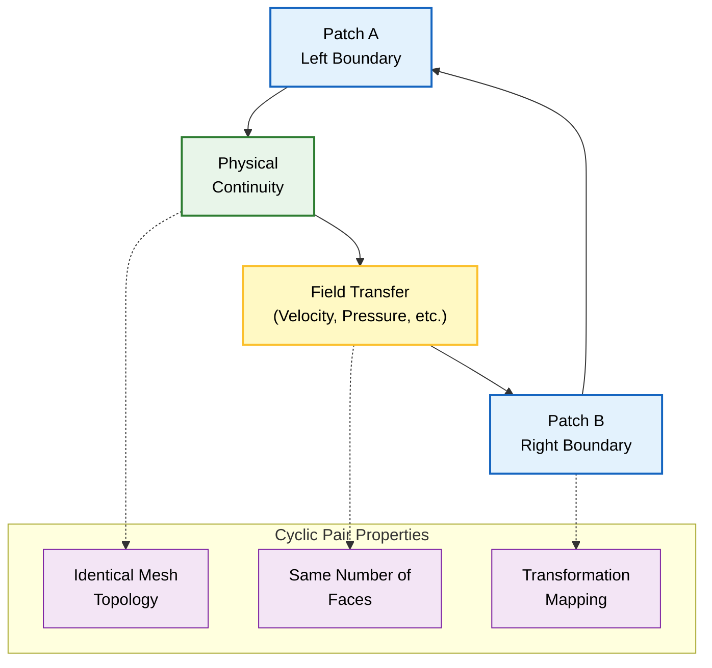
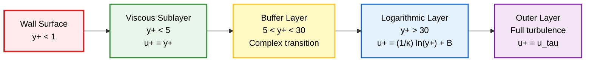
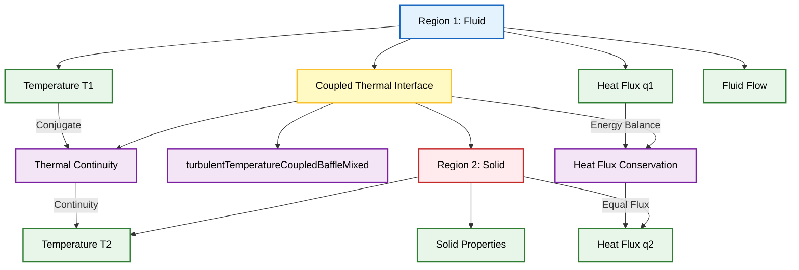
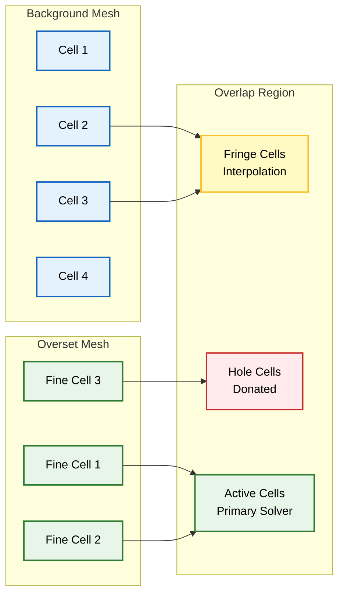

# เงื่อนไขขอบเขตขั้นสูง (Advanced Boundary Conditions)

## Introduction

เงื่อนไขขอบเขตขั้นสูง (Advanced Boundary Conditions) เป็นเครื่องมือเฉพาะทางใน OpenFOAM ที่ออกแบบมาเพื่อจัดการกับสถานการณ์ทางกายภาพที่ซับซ้อน ซึ่งเงื่อนไขขอบเขตพื้นฐานอย่าง Dirichlet และ Neumann อาจไม่เพียงพอ บทนี้จะกล่าวถึง Boundary Condition ที่มีความซับซ้อนสูงและมีความสามารถพิเศษในการจำลองปรากฏการณ์ทางกายภาพที่หลากหลาย





---

## Inlet/Outlet

### `inletOutlet` Boundary Condition

เป็นเงื่อนไขแบบไฮบริดที่ซับซ้อน ซึ่งจะเปลี่ยนพฤติกรรมโดยอัตโนมัติตามทิศทางการไหลเฉพาะที่ (local flow direction) ณ แต่ละหน้าของ Boundary Patch

**คุณค่าหลัก**:
- ใช้ได้ดีที่ท้าย Bluff Body
- เหมาะสำหรับโซนการไหลย้อนกลับ (recirculation zones)
- เหมาะสำหรับทางออกที่มีการหลุดของกระแสวน (vortex shedding) อย่างรุนแรง
- ป้องกันปัญหาการไหลย้อนกลับ (backflow) ที่อาจทำให้เกิดการลู่ออก (divergence)


```mermaid
graph LR
    A["Local Mass Flux<br/>φf = ρ u ⋅ n"] --> B{"φf > 0 ?"}
    B -->|Yes (Inflow)| C["Fixed Value<br/>Inlet Condition"]
    B -->|No (Outflow)| D["Zero Gradient<br/>Outlet Condition"]

    E["Boundary Patch"] --> F["Calculate Local<br/>Mass Flux"]
    F --> A

    C --> G["u = u_fixed"]
    D --> H["∂u/∂n = 0"]

    G --> I["Flow Entering<br/>Domain"]
    H --> J["Flow Leaving<br/>Domain"]

    K["Recirculation<br/>Zone"] --> L["Mixed Behavior<br/>on Same Patch"]
    L --> M["Automatic<br/>Switching"]
    M --> B

    classDef process fill:#e3f2fd,stroke:#1565c0,stroke-width:2px,color:#000;
    classDef decision fill:#fff9c4,stroke:#fbc02d,stroke-width:2px,color:#000;
    classDef terminator fill:#ffebee,stroke:#c62828,stroke-width:2px,color:#000;
    classDef storage fill:#e8f5e9,stroke:#2e7d32,stroke-width:2px,color:#000;

    class A,E,F,I,J process;
    class B,L,M decision;
    class C,D,G,H terminator;
    class K storage;
```


#### หลักการทางคณิตศาสตร์

Boundary Condition นี้ทำงานโดยพิจารณาจากเครื่องหมายของ **Local Mass Flux**:
$$\phi_f = \rho \mathbf{u} \cdot \mathbf{n}_f$$

โดยที่:
- $\phi_f$ = Local mass flux
- $\rho$ = ความหนาแน่นของไหล
- $\mathbf{u}$ = เวกเตอร์ความเร็ว
- $\mathbf{n}_f$ = เวกเตอร์แนวฉากที่ชี้ออกด้านนอกที่หน้า $f$

ตรรกะการสลับ:
$$
\mathbf{u}_b = \begin{cases}
\mathbf{u}_{\text{fixed}} & \text{if } \phi_f > 0 \text{ (inflow)} \\
\mathbf{u}_{\text{zero-grad}} & \text{if } \phi_f \leq 0 \text{ (outflow)}
\end{cases}
$$

#### OpenFOAM Code Implementation

```cpp
outlet
{
    type            inletOutlet;
    inletValue      uniform (0 0 0);
    value           uniform (0 0 0);
}
```

**รายละเอียดการนำไปใช้งาน**:
- ใช้ **Template Metaprogramming** พร้อมการสลับการทำงานขณะรันไทม์ (runtime switching)
- ประเมิน **Face Flux** สำหรับแต่ละ Boundary Face
- ใช้การจัดการแบบ **Face-by-Face**
- `inletValue` ระบุค่าคงที่ที่ใช้ในสภาวะ Inflow
- Outflow จะมีการบังคับใช้ **Zero Gradient Condition**

#### การประยุกต์ใช้งานจริง

| สถานการณ์ | ประโยชน์ของ inletOutlet |
|------------|-------------------------|
| **การไหลรอบ Bluff Body** | จัดการกับ vortex shedding ที่ทางออก |
| **การไหลแบบหลายเฟส** | รองรับการแกว่งของรอยต่อใกล้ Boundary |
| **การไหลแบบหมุนเวียน** | ป้องกันการไหลย้อนกลับ (Backflow Prevention) |
| **การจำลองแบบชั่วคราว** | รองรับการกลับทิศทางการไหลเป็นคาบ |

**ข้อได้เปรียบหลัก**: **ความเสถียรเชิงตัวเลข** (numerical stability) โดยการป้องกันการไหลย้อนกลับที่ไม่เป็นไปตามหลักฟิสิกส์ซึ่งอาจทำให้เกิดการลู่ออก (divergence)

> [!TIP] **Tip:** เมื่อใช้ `inletOutlet` ควรตรวจสอบ Mass Balance โดยใช้ `postProcess -func "flowRatePatch(name=outlet)"` เพื่อยืนยันว่าไม่มี Backflow ที่เกิดขึ้นอย่างต่อเนื่อง

---

### `pressureInletOutletVelocity`

เป็นอีกหนึ่งรูปแบบของ Boundary Condition ที่คำนวณ Velocity โดยอิงตาม Pressure Gradient เพื่อให้มั่นใจถึงการอนุรักษ์มวล

**คุณสมบัติ:**
- มีประโยชน์อย่างยิ่งที่ Boundary ที่ทิศทางการไหลอาจกลับทิศทาง
- คำนวณจาก Flux โดยอัตโนมัติ
- เหมาะสำหรับ Outlet ที่มี Flow Reversal

#### OpenFOAM Code Implementation

```cpp
outlet
{
    type            pressureInletOutletVelocity;
    value           uniform (0 0 0); // Initial guess value
}
```

**Velocity คำนวณจาก Flux:**
$$\mathbf{u} = \frac{\dot{m}}{\rho A} \mathbf{n}$$

- **$\dot{m}$** = Mass flux
- **$\rho$** = Density
- **$A$** = Face area
- **$\mathbf{n}$** = Normal vector

---

## Cyclic (เป็นคาบ)

### `cyclic` Boundary Condition

ใช้ **Periodic Boundary Conditions** โดยการสร้างการเชื่อมต่อเชิงทอพอโลยี (topological connection) ระหว่าง Boundary Patch สองอัน





**หลักการทำงาน**:
- ถือว่า Patch ที่ระบุมีความต่อเนื่องทางกายภาพ
- ทำให้ของไหล, โมเมนตัม, และปริมาณอื่นๆ ที่ถูกขนส่งสามารถไหลผ่านได้อย่างราบรื่น
- บังคับใช้ความเท่าเทียมกันของ Field และความต่อเนื่องของ Flux
- สร้างโครงสร้างโดเมนแบบอนันต์หรือแบบซ้ำกันอย่างมีประสิทธิภาพ

#### กรอบแนวคิดเชิงทอพอโลยี

เมื่อ Patch สองอันถูกกำหนดให้เป็น Cyclic, OpenFOAM จะทำการ:

1. **จับคู่ทางเรขาคณิต** (geometric matching) เพื่อความสอดคล้องกันแบบ Face-by-Face
2. **ปรับเปลี่ยน Mesh Topology** ให้:
   - จุดศูนย์กลางของ Face สอดคล้องกัน
   - พื้นที่ของ Face เท่ากัน
   - เวกเตอร์แนวฉากจัดเรียงตามการแปลงที่ระบุ

**การแปลงที่เป็นไปได้**:
- **การเลื่อน** (translation)
- **การหมุน** (rotation)
- **การสะท้อน** (reflection)

#### การนำไปใช้งานทางคณิตศาสตร์

สำหรับ Field $\phi$ ที่ใช้กับ Cyclic Boundary Conditions:
$$\phi_{\text{patch A}}(\mathbf{x}) = \phi_{\text{patch B}}(\mathbf{T}(\mathbf{x}))$$

โดยที่:
- $\mathbf{T}$ = การแปลงทางเรขาคณิตที่แมปพิกัดจาก Patch A ไปยัง Patch B
- $\phi$ = Field ที่ถูกบังคับใช้เงื่อนไข

ความต่อเนื่องของ Flux:
$$\mathbf{n}_A \cdot \nabla \phi_A = -\mathbf{n}_B \cdot \nabla \phi_B$$

เพื่อให้มั่นใจในการอนุรักษ์ปริมาณที่ถูกขนส่งข้ามรอยต่อที่เป็นคาบ

#### OpenFOAM Code Implementation

```cpp
left
{
    type            cyclic;
    neighbourPatch  right;
}
```

**การนำไปใช้งานในระบบ**:
- ใช้คลาส `cyclicPolyPatch` ภายใน Mesh Topology
- ระหว่างการสร้าง Mesh: สร้างการสอดคล้องกันของ Face และเมทริกซ์การแปลงทางเรขาคณิต
- สำหรับการคำนวณแบบขนาน: จัดการการสื่อสารระหว่างโปรเซสเซอร์เพื่อรักษาความเป็นคาบ

#### การประยุกต์ใช้งานและรูปแบบต่างๆ

| การประยุกต์ใช้งาน | คำอธิบาย |
|------------------|------------|
| **โดเมนที่เป็นคาบ** | Turbomachinery Cascades, Heat Exchangers |
| **การประมาณค่ากระบอก/ทรงกลมอนันต์** | ใช้รูปทรงลิ่ม (wedge geometries) |
| **เครื่องจักรหมุน** | กรอบอ้างอิงแบบหมุน (rotating reference frames) |
| **การจำลองการไหลในช่อง** | การวิจัย Turbulence (Channel Flow) |

**รูปแบบเฉพาะทางใน OpenFOAM**:
- `cyclicAMI`: สำหรับการเชื่อมต่อ Arbitrary Mesh Interface
- `turbulentDFSEMInlet`: สำหรับการสร้าง Synthetic Turbulent Inflow โดยใช้วิธี Digital Filter

> [!WARNING] **Important:** เมื่อใช้ `cyclic` BC จำเป็นต้องตรวจสอบให้แน่ใจว่า Mesh Topology ของทั้งสอง Patch มีความสอดคล้องกันอย่างสมบูรณ์ มิฉะนั้นจะเกิดปัญหาในการแมปค่าระหว่าง Patch

---

## Wall Functions

### แนวคิดพื้นฐานของ Wall Functions

**Wall Function** เป็น **Boundary Condition เฉพาะทาง** ที่จำลอง Turbulent Boundary Layer โดยไม่จำเป็นต้องใช้ Mesh Resolution ที่ละเอียดมากใกล้ Wall

**หลักการทำงาน**:
- เชื่อมต่อ Viscous Sublayer และ Logarithmic Layer
- ใช้ Empirical Correlation
- ลดความจำเป็นในการใช้ Mesh ที่ละเอียดมากใกล้ผนัง





#### Wall Function สำหรับ k-epsilon Model

```cpp
walls
{
    type            kqRWallFunction; // For turbulent kinetic energy k
    value           uniform 0.1;
}

walls
{
    type            epsilonWallFunction; // For turbulent dissipation epsilon
    value           uniform 0.01;
}
```

#### Wall Function สำหรับ k-omega Model

```cpp
walls
{
    type            omegaWallFunction; // For specific dissipation rate omega
    value           uniform 1000;
}
```

**Wall Function มาตรฐานสำหรับ Turbulent Kinetic Energy:**
$$k_w = \frac{u_\tau^2}{\sqrt{C_\mu}}$$

- **$k_w$** = Turbulent kinetic energy at wall
- **$u_\tau$** = Friction velocity
- **$C_\mu$** = Model constant (typically 0.09)

---

## Coupled Boundary Conditions

### Region-Coupled Boundary Conditions

สำหรับปัญหา Multiphysics ที่ต้องการการเชื่อมโยงระหว่าง Region ต่างๆ:





| Type | ความสามารถ | การประยุกต์ใช้ |
|------|-------------|-----------------|
| `turbulentTemperatureCoupledBaffleMixed` | การเชื่อมโยงความร้อนระหว่าง Region | Conjugate Heat Transfer |
| `thermalBaffle1DHeatTransfer` | การนำความร้อน 1 มิติผ่านผนัง | ผนังบางที่มีการนำความร้อน |
| `regionCoupledAMIFVPatchField` | Interface Conditions สำหรับ Non-Conformal Meshes | การเชื่อมต่อ Mesh ที่ไม่ตรงกัน |

---

## Overset Mesh Boundary Conditions

### `oversetFvPatchField`

สำหรับเทคนิค Overset (Chimera) Mesh ที่ซับซ้อน:





| Type | ความสามารถ | การประยุกต์ใช้ |
|------|-------------|-----------------|
| `oversetFvPatchField` | การจัดการพิเศษสำหรับการประมาณค่าในช่วง Overset | Moving Meshes, Multiple Reference Frames |
| `implicitOversetPressure` | การจัดการแบบ Implicit สำหรับ Pressure-Velocity Coupling | การแก้สมการความดันใน Overset Regions |

---

## Time-Varying Boundary Conditions

### `timeVaryingUniformFixedValue`

OpenFOAM รองรับ Time-Dependent Boundary Condition ที่ซับซ้อน:

#### การป้อนข้อมูลแบบตาราง (Tabular Data Input)

```cpp
boundaryField
{
    inlet
    {
        type            uniformFixedValue;
        uniformValue    table
        (
            (0     (1 0 0))    // Time = 0s, velocity = (1,0,0) m/s
            (10    (2 0 0))    // Time = 10s, velocity = (2,0,0) m/s
            (20    (1.5 0 0))  // Time = 20s, velocity = (1.5,0,0) m/s
        );
    }
}
```





```mermaid
graph LR
    A["Inlet Velocity Profile"] --> B["Time: 0-2s"]
    B --> C["Linear Ramp Up<br/>0 to 5 m/s"]
    C --> D["Time: 2-8s"]
    D --> E["Steady State<br/>5 m/s constant"]
    E --> F["Time: 8-12s"]
    F --> G["Oscillating Profile<br/>Sinusoidal variation"]
    G --> H["Time: 12-15s"]
    H --> I["Linear Ramp Down<br/>5 to 0 m/s"]
    I --> J["Outlet Flow"]

    style A fill:#e1f5fe,stroke:#0277bd,stroke-width:2px,color:#000
    style J fill:#ffebee,stroke:#c62828,stroke-width:2px,color:#000

    classDef process fill:#e3f2fd,stroke:#1565c0,stroke-width:2px,color:#000;
    classDef decision fill:#fff9c4,stroke:#fbc02d,stroke-width:2px,color:#000;
    classDef terminator fill:#ffebee,stroke:#c62828,stroke-width:2px,color:#000;
    classDef storage fill:#e8f5e9,stroke:#2e7d32,stroke-width:2px,color:#000;
    classDef transition fill:#f3e5f5,stroke:#7b1fa2,stroke-width:2px,color:#000;

    class B,C,D,E,F,G,H,I process
```

#### ฟังก์ชันทางคณิตศาสตร์ (Mathematical Functions)

```cpp
boundaryField
{
    pulsatingInlet
    {
        type            codedFixedValue;
        value           uniform (0 0 0);
        code
        #{
            // Sinusoidal velocity variation
            scalar t = this->db().time().value();
            vectorField& field = *this;
            field = vector(1.0 + 0.5*sin(2*pi*0.1*t), 0, 0);
        #};
    }
}
```

---

## Custom Boundary Condition Development

การสร้าง Custom Boundary Condition เกี่ยวข้องกับการสืบทอดจากคลาสพื้นฐาน `fvPatchField`:

```cpp
template<class Type>
class customBoundaryCondition
:
    public fvPatchField<Type>
{
private:
    // Private member variables
    scalar coefficient_;
    word coupledFieldName_;

public:
    // Runtime type information
    TypeName("customBoundaryCondition");

    // Constructors
    customBoundaryCondition
    (
        const fvPatch&,
        const DimensionedField<Type, volMesh>&,
        const dictionary&
    );

    // Virtual function overrides
    virtual void updateCoeffs();
    virtual tmp<Field<Type>> snGrad() const;
    virtual void evaluate(const Pstream::commsTypes commsType);
};
```

---

## Summary Table: Advanced Boundary Conditions

| Boundary Condition | Type | Mathematical Form | Common Applications |
|-------------------|------|-------------------|-------------------|
| **inletOutlet** | Hybrid | $\mathbf{u}_b = \begin{cases} \mathbf{u}_{\text{fixed}} & \phi_f > 0 \\ \mathbf{u}_{\text{zero-grad}} & \phi_f \leq 0 \end{cases}$ | Outlet with possible backflow |
| **cyclic** | Periodic | $\phi_{\text{patch A}}(\mathbf{x}) = \phi_{\text{patch B}}(\mathbf{T}(\mathbf{x}))$ | Periodic domains, rotating machinery |
| **wallFunction** | Calculated | $u^+ = \frac{1}{\kappa} \ln(y^+) + B$ | Turbulent boundary layers |
| **regionCoupled** | Coupled | $T_1 = T_2, q_1 = -q_2$ | Conjugate heat transfer |
| **codedFixedValue** | User-defined | $\phi = f(\mathbf{x}, t, \text{other fields})$ | Complex transient BCs |

---

## Best Practices

### การเลือกใช้ Advanced Boundary Conditions

> [!INFO] **Guidelines:**
> 1. **inletOutlet**: ใช้เมื่อมีความเป็นไปได้ของการไหลย้อนกลับที่ Outlet
> 2. **cyclic**: ใช้เมื่อมีความสมมาตรแบบเป็นคาบหรือโดเมนที่ซ้ำกัน
> 3. **wallFunction**: ใช้เพื่อลดจำนวนเซลล์ใกล้ผนังสำหรับ Turbulent Flow
> 4. **coupled**: ใช้สำหรับปัญหา Multiphysics ที่ต้องการการแลกเปลี่ยนข้อมูลระหว่าง Region

### การตรวจสอบและการแก้ไขปัญหา

> [!WARNING] **Common Issues:**
> - **Inflow at Outlet**: ใช้ `inletOutlet` หรือขยาย Domain ปลายน้ำ
> - **Mass Balance Issues**: ตรวจสอบ Flux ผ่านทุก Boundary Patch
> - **Cyclic Mesh Mismatch**: ตรวจสอบให้แน่ใจว่า Face Topology สอดคล้องกัน
> - **Wall Function y+**: ตรวจสอบ y+ values อยู่ในช่วงที่เหมาะสม (30-300 สำหรับ k-ε)

---

## Internal Links

- [[00_Overview]] - ภาพรวมของ Boundary Conditions ใน OpenFOAM
- [[02_Fundamental_Classification]] - การจำแนกประเภทพื้นฐาน
- [[05_Common_Boundary_Conditions_in_OpenFOAM]] - Boundary Conditions ทั่วไป
- [[07_Troubleshooting_Boundary_Conditions]] - การแก้ไขปัญหา

---

**References:**
1. OpenFOAM User Guide - Boundary Conditions
2. OpenFOAM Programmer's Guide - fvPatchField Class Hierarchy
3. H.K. Versteeg and W. Malalasekera, "An Introduction to Computational Fluid Dynamics"
4. Ferziger and Peric, "Computational Methods for Fluid Dynamics"
