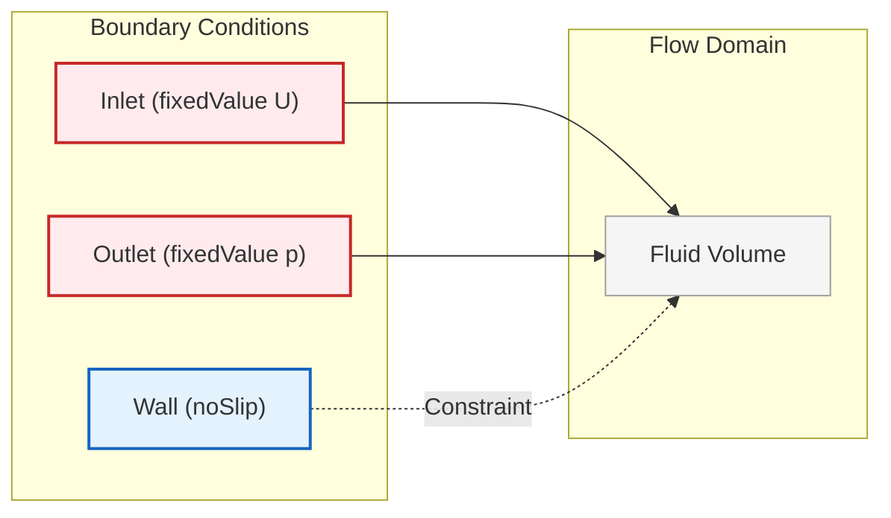
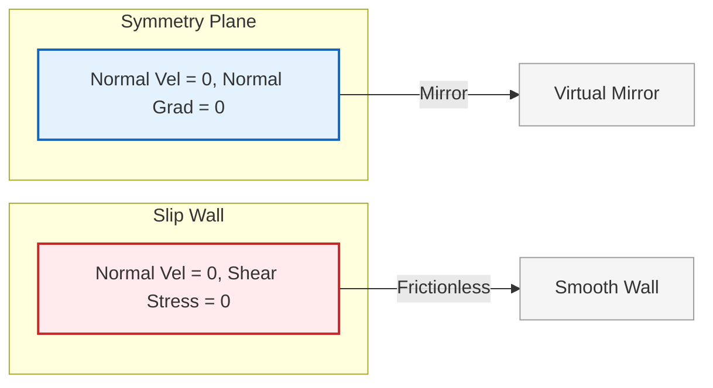
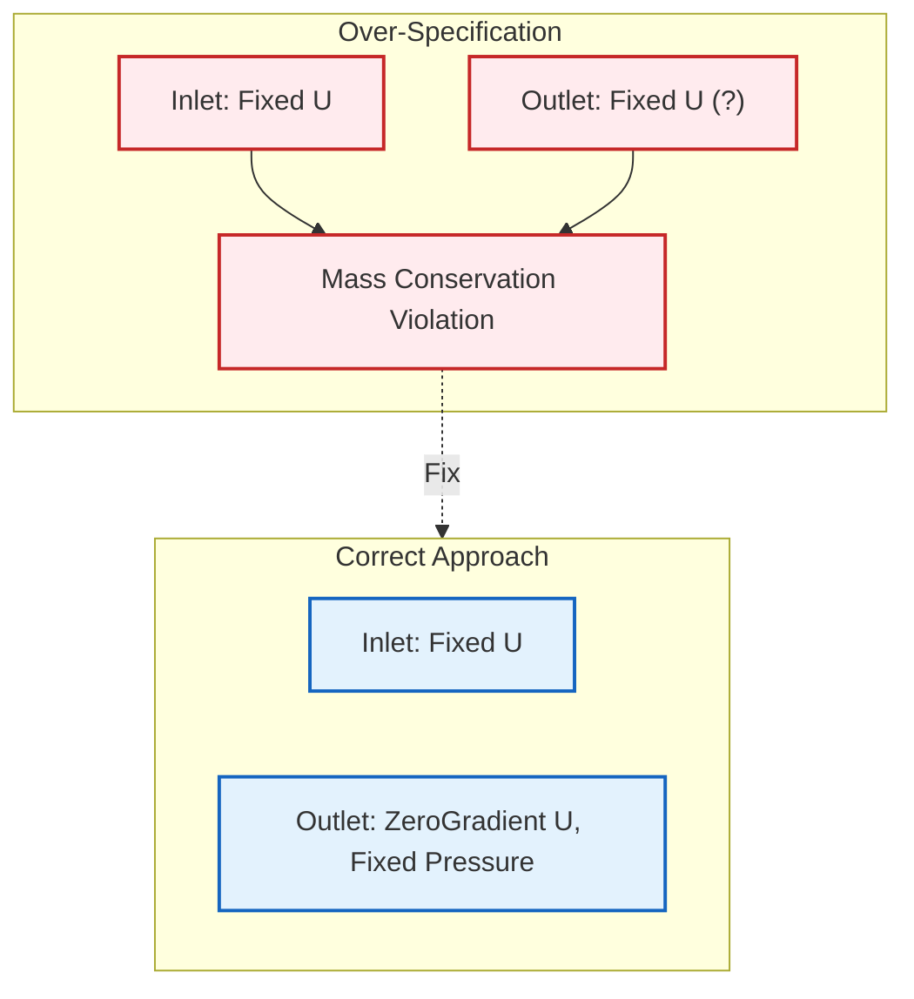
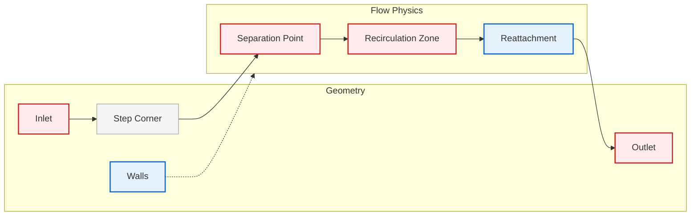
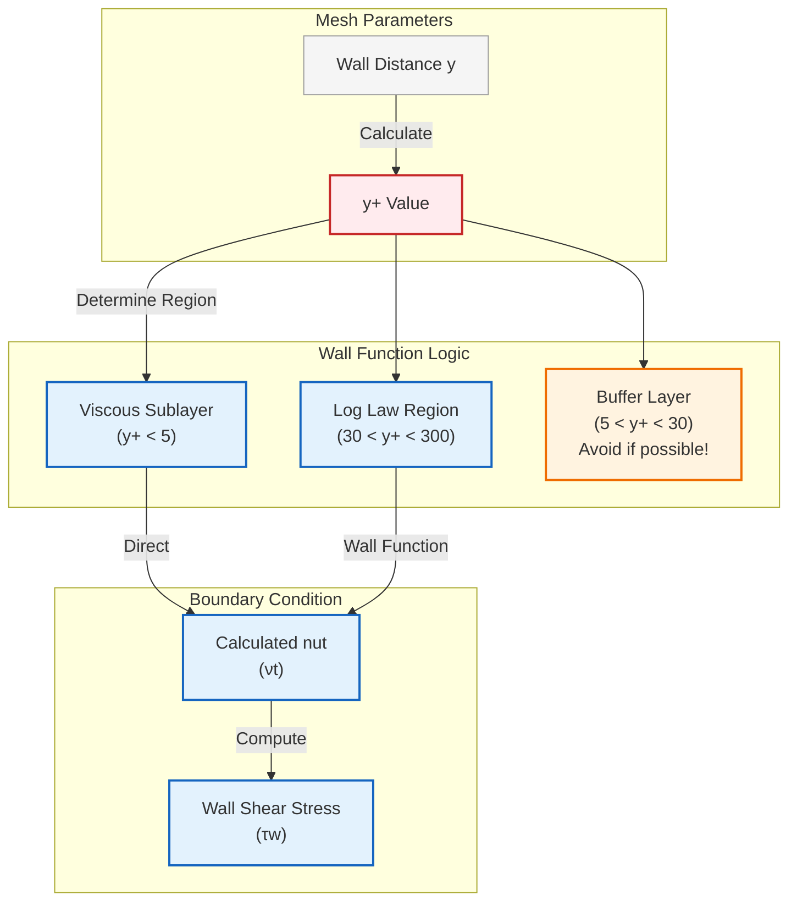

# แบบฝึกหัด

แบบฝึกหัดเหล่านี้ออกแบบมาเพื่อ **สร้างทักษะทางปฏิบัติ** ในการเลือกและตั้งค่า Boundary Condition ที่เหมาะสมสำหรับปัญหา CFD ที่หลากหลาย โดยเน้นการประยุกต์ใช้ความรู้ทางทฤษฎีให้เข้ากับสถานการณ์จริง

---

## แบบฝึกหัดที่ 1: การตั้งค่า Boundary Condition สำหรับการไหลในท่อ

### รายละเอียดโจทย์

จำลองการไหลในท่อ (pipe flow) แบบ **Fully Developed Laminar Flow** โดยมีเงื่อนไขดังนี้:

- **ความเร็วเฉลี่ย:** $U_{avg} = 5$ m/s
- **เส้นผ่านศูนย์กลางท่อ:** $D = 0.1$ m
- **ความหนืดของไหล:** $\nu = 1.5 \times 10^{-5}$ m²/s (อากาศที่อุณหภูมิห้อง)
- **Reynolds Number:** $Re = \frac{U D}{\nu} \approx 3333$ (Transition Flow)

### การกำหนดค่าพื้นฐาน

สำหรับแบบฝึกหัดนี้ คุณต้องกำหนดค่า Boundary Condition สำหรับการจำลองการไหลในท่ออย่างง่าย โดยการตั้งค่าทั้งสนามความเร็วและสนามความดัน

### สนามความเร็ว (`0/U`)

```cpp
dimensions      [0 1 -1 0 0 0 0];
internalField   uniform 0;

boundaryField
{
    inlet
    {
        type            fixedValue;
        value           uniform (5 0 0);  // 5 m/s in x-direction
    }
    outlet
    {
        type            zeroGradient;
    }
    walls
    {
        type            noSlip;
    }
}
```

> **📂 Source:** `.applications/solvers/multiphase/multiphaseEulerFoam/multiphaseCompressibleMomentumTransportModels/derivedFvPatchFields/alphatWallBoilingWallFunction/alphatWallBoilingWallFunctionFvPatchScalarField.C`
> 
> **คำอธิบาย:** 
> - **Boundary Condition Types**: การกำหนดประเภทเงื่อนไขขอบเขตที่แตกต่างกันสำหรับแต่ละพื้นที่ชั้นข้อมูล (patch) ใน OpenFOAM
> - **Fixed Value**: กำหนดค่าคงที่สำหรับ velocity ที่ inlet
> - **Zero Gradient**: ไม่กำหนดค่าคงที่ ให้ค่าณ ขอบเขตมีการพัฒนาแบบอนุพันธ์ศูนย์
> - **No-Slip**: เงื่อนไขไม่มีการลื่นไถลที่ผนัง
> 
> **แนวคิดสำคัญ:**
> - Dirichlet boundary condition (fixedValue) สำหรับ velocity inlet
> - Neumann boundary condition (zeroGradient) สำหรับ velocity outlet
> - No-slip condition สำหรับ solid walls
> - Pressure-velocity coupling ในระบบสมการ Navier-Stokes

### สนามความดัน (`0/p`)

```cpp
dimensions      [1 -1 -2 0 0 0 0];
internalField   uniform 0;

boundaryField
{
    inlet
    {
        type            zeroGradient;
    }
    outlet
    {
        type            fixedValue;
        value           uniform 0;  // 0 Pa gauge pressure
    }
    walls
    {
        type            zeroGradient;
    }
}
```

> **📂 Source:** `.applications/utilities/parallelProcessing/reconstructPar/fvFieldReconstructorReconstructFields.C`
> 
> **คำอธิบาย:** 
> - **Pressure Boundary Conditions**: การกำหนดเงื่อนไขขอบเขตความดันที่สอดคล้องกับเงื่อนไขความเร็ว
> - **Zero Gradient at Inlet**: ความดันมีการพัฒนาแบบอนุพันธ์ศูนย์เมื่อเข้าสู่โดเมน
> - **Fixed Value at Outlet**: กำหนดความดันอ้างอิง (gauge pressure = 0) ที่ outlet
> - **Zero Gradient at Walls**: ไม่มี gradient ความดันในแนวตั้งฉากผนัง
> 
> **แนวคิดสำคัญ:**
> - ความสัมพันธ์ระหว่าง velocity และ pressure boundary conditions
> - การกำหนด reference pressure ที่ outlet
> - การหลีกเลี่ยง over-specification ของระบบสมการ

### การตีความทางกายภาพ

การตั้งค่านี้สร้าง **การไหลในท่อที่พัฒนาเต็มที่** (fully developed pipe flow)

#### บทบาทของแต่ละขอบเขต:

| ขอบเขต | ประเภท | ค่าที่กำหนด | บทบาททางกายภาพ |
|---------|--------|-------------|----------------|
| **Inlet** | `fixedValue` | `(5 0 0)` m/s | ขับเคลื่อนการไหลด้วยความเร็วสม่ำเสมอในทิศทาง x |
| **Outlet** | `fixedValue` | `0` Pa | กำหนดความดันอ้างอิง ทำให้การไหลออกไปได้ตามธรรมชาติ |
| **Walls** | `noSlip` | - | บังคับเงื่อนไขไม่มีการลื่นไถล เลียนแบบผลจากความหนืด |

#### กลไกการเชื่อมโยงความดัน-ความเร็ว

- **Pressure-velocity coupling** จะพัฒนา **Gradient ความดัน** ที่จำเป็นตามธรรมชาติ
- รักษา **อัตราการไหล** ที่กำหนดผ่านท่อให้คงที่
- เกิด **การไหลแบบ fully developed** เมื่อถึงสมดุล


> **Figure 1:** การตั้งค่าการไหลในท่อแบบพัฒนาเต็มที่ แสดงความเชื่อมโยงระหว่างเงื่อนไขขาเข้าแบบความเร็วคงที่ ขาออกที่ความดันคงที่ และเงื่อนไข No-Slip ที่ผนังเพื่อสร้างรูปแบบการไหลที่สมบูรณ์

### โจทย์เสริม

$$u(r) = 2U_{avg}\left(1 - \frac{r^2}{R^2}\right)$$

โดยที่:
- $R = D/2$ = รัศมีท่อ
- $r$ = ระยะห่างจากจุดศูนย์กลางท่อ

2. **ตรวจสอบ** ว่า Pressure Drop ตามทฤษฎีสำหรับ Laminar Pipe Flow ตรงกับผลการจำลองหรือไม่:

$$\Delta p = \frac{32 \mu L U_{avg}}{D^2}$$

---

## แบบฝึกหัดที่ 2: ความหมายทางกายภาพของ Zero Gradient สำหรับอุณหภูมิ

### รายละเอียดโจทย์

พิจารณาปัญหา **Heat Transfer** ในท่อที่มีการไหลของไหลร้อน โดยผนังท่อมี **ฉนวนความร้อน** (adiabatic wall) ที่มีคุณสมบัติ:

- **อุณหภูมิของไหลที่ Inlet:** $T_{inlet} = 350$ K
- **อุณหภูมิผนังท่อ:** เป็นฉนวน (ไม่มีการถ่ายเทความร้อน)
- **ความหนาแน่น:** $\rho = 1.2$ kg/m³
- **ความจุความร้อนจำเพาะ:** $c_p = 1005$ J/(kg·K)

### พื้นฐานทางคณิตศาสตร์

Boundary Condition แบบ `zeroGradient` สำหรับอุณหภูมิที่ผนังมีนัยยะทางกายภาพสำคัญ ตาม **กฎการนำความร้อนของฟูเรียร์**:

$$q = -k \nabla T$$

**ตัวแปร:**
- $q$ = เวกเตอร์ฟลักซ์ความร้อน (W/m²)
- $k$ = สภาพนำความร้อน (W/m·K)
- $\nabla T$ = Gradient อุณหภูมิ

### ขอบเขตฉนวนความร้อน

เมื่อใช้ `zeroGradient` ที่ผนัง:

$$\frac{\partial T}{\partial n} = 0$$

**โดยที่:** $\frac{\partial T}{\partial n}$ = อนุพันธ์เชิงตั้งฉากของอุณหภูมิที่พื้นผิวผนัง

#### ผลทางคณิตศาสตร์

เงื่อนไขนี้หมายความโดยตรงว่า **ฟลักซ์ความร้อนที่ผ่านขอบเขตเป็นศูนย์**:

$$q_n = -k \frac{\partial T}{\partial n} = 0$$

### การตีความทางกายภาพ

**ไม่มีการถ่ายเทความร้อนข้ามขอบเขตผนัง** → ผนังเป็นฉนวนอย่างสมบูรณ์

#### ลักษณะสำคัญ:
- ผนังทำหน้าที่เป็น **กำแพงความร้อน** ป้องกันการไหลของความร้อนแบบนำ (conductive heat flow)
- อุณหภูมิสามารถเปลี่ยนแปลง **ตามพื้นผิวผนัง** ได้
- **ไม่มี Gradient อุณหภูมิในแนวตั้งฉาก** กับผนัง

### การประยุกต์ใช้ในทางปฏิบัติ

| สถานการณ์ | คำอธิบาย | เหตุผลที่ใช้ |
|-------------|------------|----------------|
| **ท่อที่เป็นฉนวน** | ท่อที่มีฉนวนหนา | ผลกระทบจากความร้อนภายนอกมีค่าน้อยมาก |
| **ระนาบสมมาตร** | ที่รูปทรงสะท้อนอีกด้านหนึ่ง | การไหลมีความสมมาตรแบบกระจกเงา |
| **โดเมนการคำนวณสั้น** | ไม่มีชั้นขอบเขตความร้อน | การพัฒนาชั้นขอบเขตไม่มีนัยสำคัญ |
| **แบบจำลองในอุดมคติ** | ละเลยการสูญเสียความร้อน | ศึกษาพฤติกรรมพื้นฐาน |

### การตั้งค่า OpenFOAM

```cpp
// 0/T file
dimensions      [0 0 0 1 0 0 0];
internalField   uniform 300;

boundaryField
{
    inlet
    {
        type            fixedValue;
        value           uniform 350;  // K
    }
    outlet
    {
        type            zeroGradient;
    }
    walls
    {
        type            zeroGradient;  // Adiabatic wall
    }
}
```

> **📂 Source:** `.applications/solvers/multiphase/multiphaseEulerFoam/multiphaseCompressibleMomentumTransportModels/derivedFvPatchFields/alphatPhaseJayatillekeWallFunction/alphatPhaseJayatillekeWallFunctionFvPatchScalarField.C`
> 
> **คำอธิบาย:** 
> - **Adiabatic Wall Condition**: เงื่อนไขขอบเขตสำหรับผนังฉนวนที่ไม่มีการถ่ายเทความร้อน
> - **Zero Gradient for Temperature**: ไม่มี gradient ของอุณหภูมิในแนวตั้งฉากผนัง
> - **Thermal Boundary Layer**: การไม่มีชั้นขอบเขตความร้อนเนื่องจากไม่มีการถ่ายเทความร้อน
> 
> **แนวคิดสำคัญ:**
> - กฎการนำความร้อนของฟูเรียร์ (Fourier's Law)
> - ความสัมพันธ์ระหว่าง gradient อุณหภูมิและฟลักซ์ความร้อน
> - เงื่อนไข Neumann สำหรับปัญหาถ่ายเทความร้อน
> - การอนุรักษ์พลังงานในระบบที่ไม่มีการสูญเสียความร้อน

### โจทย์เสริม

1. **คำนวณ** อุณหภูมิเฉลี่ยที่ Outlet โดยใช้หลักการอนุรักษ์พลังงาน:

$$\dot{m} c_p T_{inlet} = \dot{m} c_p T_{outlet}$$

ดังนั้น $T_{outlet} = T_{inlet}$ สำหรับผนังแบบ adiabatic

2. **เปรียบเทียบ** กรณีที่ผนังมี Heat Flux คงที่ $q'' = 1000$ W/m² โดยใช้ `fixedGradient`:

$$\frac{\partial T}{\partial n} = -\frac{q''}{k}$$

---

## แบบฝึกหัดที่ 3: Boundary Condition แบบ Symmetry เทียบกับ Slip

### รายละเอียดโจทย์

พิจารณาการจำลอง **Airflow over a Symmetric Airfoil** ที่มีความสมมาตรทางเรขาคณิต:

- **ความเร็วฟรีสตรีม:** $U_\infty = 50$ m/s
- **มุมปะทะ (Angle of Attack):** $\alpha = 0°$ (การไหลสมมาตร)
- **ความหนืด:** $\nu = 1.5 \times 10^{-5}$ m²/s

### ข้อแตกต่างหลัก

| ลักษณะ | Symmetry | Slip |
|--------|----------|------|
| **ความหมายทางกายภาพ** | สมมาตรทางเรขาคณิต/การไหลที่แท้จริง | ผนังในอุดมคติที่ไม่มีแรงเสียดทาน |
| **การจัดการทางคณิตศาสตร์** | ตัวแปรทั้งหมดสะท้อนข้ามระนาบ | บังคับใช้เฉพาะการไหลแนวตั้งฉากเป็นศูนย์ |
| **Shear Stress** | อาจมี Gradient ในแนวสัมผัส | **Shear Stress เป็นศูนย์** |
| **การประยุกต์ใช้** | ต้องมีสมมาตรทางกายภาพที่แท้จริง | สามารถใช้กับผนังใดๆ ที่ผลกระทบจากความหนืดมีค่าน้อยมาก |

### Boundary Condition แบบ Symmetry

เงื่อนไข `symmetry` บังคับใช้**สมมาตรทางเรขาคณิตและทางกายภาพ**ข้ามระนาบหรือขอบเขต

#### เงื่อนไขทางคณิตศาสตร์:

1. **ข้อจำกัดความเร็วแนวตั้งฉาก:**
   $$\mathbf{n} \cdot \mathbf{u} = 0 \quad \text{(ความเร็วแนวตั้งฉาก = 0)}$$

2. **การจัดการสนามสเกลาร์ (อุณหภูมิ, ความดัน):**
   $$\frac{\partial \phi}{\partial n} = 0 \quad \text{(Gradient แนวตั้งฉากเป็นศูนย์)}$$

3. **พฤติกรรมความเร็วแนวสัมผัส:**
   $$\frac{\partial \mathbf{u}_t}{\partial n} = 0 \quad \text{(Gradient ของความเร็วแนวสัมผัสเป็นศูนย์)}$$

#### สถานการณ์การประยุกต์ใช้:
- จำลองเพียงครึ่งหนึ่งของรูปทรงเรขาคณิตที่มีสมมาตร (ท่อ, ช่อง, ปีกเครื่องบิน)
- การไหลแบบ **Axisymmetric** ที่จำลองภาพตัดขวาง 2D ของปัญหา 3D ที่มีสมมาตรการหมุน
- การไหลที่ฟิสิกส์และรูปทรงเรขาคณิตสะท้อนกันอย่างสมบูรณ์ข้ามระนาบ

### Boundary Condition แบบ Slip

เงื่อนไข `slip` หรือ **free-slip** แสดงถึงขอบเขตในอุดมคติที่ของไหลสามารถเคลื่อนที่ในแนวสัมผัสได้ แต่ไม่สามารถทะลุผ่านขอบเขตได้

#### เงื่อนไขทางคณิตศาสตร์:

1. **ข้อจำกัดความเร็วแนวตั้งฉาก:**
   $$\mathbf{n} \cdot \mathbf{u} = 0 \quad \text{(ความเร็วแนวตั้งฉาก = 0)}$$

2. **เงื่อนไข Shear Stress:**
   $$\mathbf{n} \times (\boldsymbol{\tau} \cdot \mathbf{n}) = 0$$

#### การตีความทางกายภาพ:
- สมมติให้เป็น **พื้นผิวในอุดมคติ** ที่ผลกระทบจากความหนืดมีค่าน้อยมาก
- **การไหลตามขอบเขตเป็นไปอย่างไม่มีแรงเสียดทาน**
- ใช้สำหรับประมาณค่าการไหลแบบไม่หนืด (inviscid flow approximations)

### คำแนะนำในการเลือกใช้

#### ✅ ใช้ Symmetry เมื่อ:
- รูปทรงเรขาคณิตมี **สมมาตรทางกายภาพที่แท้จริง**
- จำลองส่วนย่อยของโดเมนสมมาตรขนาดใหญ่เพื่อลดต้นทุนการคำนวณ
- สนามการไหลคาดว่าจะเป็นแบบสมมาตรแบบกระจกเงา
- ทั้งสนามความเร็วและสนามสเกลาร์ควรมีสมมาตรข้ามขอบเขต

#### ✅ ใช้ Slip เมื่อ:
- จำลอง **พื้นผิวที่ขัดมันสูง** หรือหล่อลื่นซึ่งแรงต้านจากความหนืดมีน้อยมาก
- จำลองขอบเขตในอุดมคติที่ผลกระทบจากผนังถูกละเลยโดยเจตนา
- ศึกษาการประมาณค่า **การไหลแบบไม่หนืด** ที่ชั้นขอบเขตความหนืดถูกละเลย
- ต้องการให้มีการไหลแนวสัมผัสอย่างอิสระโดยไม่มีแรงเสียดทาน

### การตั้งค่า OpenFOAM

```cpp
// 0/U file - Symmetry Plane
symmetryPlane
{
    type            symmetry;
}

// 0/U file - Slip Wall
slipWall
{
    type            slip;
}

// 0/p file - ทั้ง Symmetry และ Slip
symmetryPlane
{
    type            symmetry;
}

slipWall
{
    type            zeroGradient;
}
```

> **📂 Source:** `.applications/utilities/parallelProcessing/reconstructPar/fvFieldReconstructorReconstructFields.C`
> 
> **คำอธิบาย:** 
> - **Symmetry Condition**: สำหรับระนาบที่มีสมมาตรทางเรขาคณิตและฟิสิกส์
> - **Slip Condition**: สำหรับผนังในอุดมคติที่ไม่มีแรงเสียดทาน
> - **Zero Gradient for Pressure**: ความดันไม่มี gradient ในแนวตั้งฉากผนัง
> 
> **แนวคิดสำคัญ:**
> - สมมาตรทางเรขาคณิตเปรียบเทียบกับการไหลแบบไม่มีแรงเสียดทาน
> - การเลือกใช้ boundary condition ที่เหมาะสมกับปัญหา
> - การลดขนาดโดเมนการคำนวณโดยใช้คุณสมบัติสมมาตร


> **Figure 2:** ความแตกต่างระหว่างเงื่อนไขระนาบสมมาตร (Symmetry Plane) และผนังลื่น (Slip Wall) โดยแสดงการเปรียบเทียบระหว่างการสะท้อนทางกายภาพแบบกระจกเงากับพื้นผิวในอุดมคติที่ไม่มีแรงเสียดทาน


- **ระนาบ Symmetry**: มีข้อจำกัดมากกว่า ควรใช้เฉพาะเมื่อมีสมมาตรที่แท้จริงในปัญหาทางกายภาพ
- **เงื่อนไข Slip**: มีความทั่วไปมากกว่า สามารถใช้เป็นแบบจำลองผนังในอุดมคติหรือศึกษาสถานการณ์การไหลที่เรียบง่าย

---

## แบบฝึกหัดที่ 4: การแก้ไขปัญหา Boundary Condition ที่พบบ่อย

### รายละเอียดโจทย์

จำลอง **Backward Facing Step Flow** ซึ่งเป็นปัญหาคลาสสิกใน CFD ที่มี **Recirculation Zone** และ **Flow Reattachment**

- **ความเร็วเข้า:** $U_{inlet} = 1$ m/s
- **ขนาดช่องทาง:** Height = $H$, Step Height = $h$
- **Expansion Ratio:** 2:1
- **Reynolds Number:** $Re_H = \frac{U H}{\nu} \approx 1000$ (Laminar)

### ตารางปัญหา Boundary Condition ที่พบบ่อย

| Symptom | Probable Cause | Solution |
| :--- | :--- | :--- |
| **Divergence ที่ Inlet** | U และ p ไม่สอดคล้องกัน | ตรวจสอบ: หาก U ถูกกำหนดค่าตายตัว (fixed), p ควรเป็น zeroGradient (โดยปกติ) |
| **Inflow ที่ Outlet** | Vortices พุ่งชน Outlet | ใช้ `inletOutlet` หรือขยาย Domain ปลายน้ำ |
| **High Velocity ที่ Wall** | ประเภท BC ผิด | ตรวจสอบให้แน่ใจว่าใช้ `noSlip` หรือ `fixedValue (0 0 0)` |
| **Pressure Drifting** | Boundary Condition ประเภท Neumann ทั้งหมด | กำหนดค่าความดันที่จุดใดจุดหนึ่ง (Reference Pressure) หรือที่ Patch ใด Patch หนึ่ง |

### การวิเคราะห์และแนวทางแก้ไขโดยละเอียด

#### Divergence ที่ Inlet

**Problem Description**:
การจำลองเกิด **Divergence** หลังจากเริ่มต้นไม่นาน โดยค่า Residuals พุ่งสูงขึ้นอย่างรวดเร็วที่ Boundary ของ Inlet

**Root Cause**:
ปัญหาพื้นฐานเกิดจากการ **กำหนด Boundary Condition มากเกินไป (over-specification)**

เมื่อทั้ง Velocity และ Pressure ถูกกำหนดค่าตายตัวที่ Boundary เดียวกัน ระบบจะถูกจำกัดเงื่อนไขทางคณิตศาสตร์มากเกินไป


> **Figure 3:** ความขัดแย้งทางคณิตศาสตร์ในระบบที่ถูกจำกัดเงื่อนไขมากเกินไป (Over-specification) แสดงให้เห็นว่าการกำหนดทั้งความเร็วและความดันตายตัวที่ทางเข้าเดียวกันนำไปสู่ระบบที่ไม่มีผลเฉลยและเกิดความไม่เสถียร


```cpp
// สำหรับ Velocity Inlet (แนะนำ)
U
{
    type            fixedValue;
    value           uniform (10 0 0);  // กำหนดค่า Velocity ที่ Inlet
}

p
{
    type            zeroGradient;      // เงื่อนไขการไหลออกตามธรรมชาติ
}
```

> **📂 Source:** `.applications/utilities/parallelProcessing/reconstructPar/fvFieldReconstructorReconstructFields.C`
> 
> **คำอธิบาย:** 
> - **Velocity Inlet Condition**: การกำหนดความเร็วคงที่ที่ inlet
> - **Pressure Outlet Condition**: เงื่อนไข zero gradient สำหรับความดัน
> - **Boundary Condition Consistency**: ความสอดคล้องระหว่าง velocity และ pressure BCs
> 
> **แนวคิดสำคัญ:**
> - การหลีกเลี่ยง over-specification ของ boundary conditions
> - Pressure-velocity coupling ในระบบสมการ
> - การเลือกชนิด boundary condition ที่เหมาะสม

หรืออีกทางเลือกหนึ่ง:

```cpp
// สำหรับ Pressure Inlet
p
{
    type            fixedValue;
    value           uniform 101325;    // กำหนดค่า Pressure ที่ Inlet
}

U
{
    type            pressureInletVelocity;
    value           uniform (0 0 0);   // ค่าเริ่มต้น
}
```

> **📂 Source:** `.applications/solvers/multiphase/multiphaseEulerFoam/multiphaseCompressibleMomentumTransportModels/derivedFvPatchFields/alphatWallBoilingWallFunction/alphatWallBoilingWallFunctionFvPatchScalarField.C`
> 
> **คำอธิบาย:** 
> - **Pressure Inlet Velocity**: การกำหนดความดันคงที่และปล่อยให้ความเร็วพัฒนาตามธรรมชาติ
> - **Alternative Approach**: ทางเลือกอื่นในการกำหนด boundary conditions
> 
> **แนวคิดสำคัญ:**
> - การเลือกใช้ pressure inlet เมื่อต้องการควบคุมความดัน
> - ความยืดหยุ่นในการกำหนด boundary conditions

#### Inflow ที่ Outlet

**Problem Description**:
ของไหลไหล **เข้าสู่** Computational Domain ผ่าน Boundary ของ Outlet ซึ่งขัดแย้งกับความคาดหวังทางกายภาพที่ควรจะเป็นเงื่อนไขการไหลออกเท่านั้น

**Root Cause**:
โดยทั่วไปปัญหานี้เกิดขึ้นเมื่อ:
1. **Domain สั้นเกินไป**: การไหลยังไม่พัฒนาเต็มที่ก่อนถึง Outlet
2. **Pressure Gradient ไม่ถูกต้อง**: Back Pressure ไม่ได้ถูกกำหนดอย่างเหมาะสม
3. **Vortices หรือ Recirculation**: โครงสร้างการไหลแบบปั่นป่วน (Turbulent structures) ไปถึง Boundary ของ Outlet

**Solution 1: inletOutlet Boundary Condition**

เงื่อนไข `inletOutlet` จะสลับระหว่าง `zeroGradient` และ `fixedValue` โดยอัตโนมัติตามทิศทางการไหล:

```cpp
U
{
    type            inletOutlet;
    inletValue      uniform (0 0 0);      // Velocity หากมีการไหลย้อนกลับ
    value           uniform (0 0 0);      // ค่าเริ่มต้น
}
```

> **📂 Source:** `.applications/utilities/parallelProcessing/reconstructPar/fvFieldReconstructorReconstructFields.C`
> 
> **คำอธิบาย:** 
> - **InletOutlet Condition**: เงื่อนไขขอบเขตแบบไดนามิกที่เปลี่ยนตามทิศทางการไหล
> - **Backflow Prevention**: ป้องกันปัญหาการไหลย้อนกลับ
> 
> **แนวคิดสำคัญ:**
> - การจัดการปัญหา backflow ที่ outlet
> - การปรับเปลี่ยน boundary condition แบบ dynamic

สิ่งนี้จะดำเนินการ:
- `zeroGradient` เมื่อการไหลออก (normal flux > 0)
- `fixedValue` เมื่อการไหลเข้า (normal flux < 0)

**Solution 2: Domain Extension**

วิธีแก้ไขที่แข็งแกร่งที่สุดคือการทำให้ Outlet อยู่ไกลจากปลายน้ำมากพอ:

| การไหล | ระยะ Outlet ที่แนะนำ | เท่าของเส้นผ่านศูนย์กลางไฮดรอลิก |
| :--- | :--- | :--- |
| **Laminar** | 10-15 เท่า | 10-15 |
| **Turbulent** | 20-30 เท่า | 20-30 |
| **Separating flows** | 30-50 เท่า | 30-50 |


> **Figure 4:** กลยุทธ์การขยายโดเมนการคำนวณเพื่อป้องกันปัญหาการไหลย้อนกลับ โดยเพิ่มระยะปลายน้ำให้เพียงพอสำหรับการพัฒนาการไหลแบบสมบูรณ์ ช่วยให้ได้ผลลัพธ์ที่ถูกต้องทางกายภาพที่ทางออก


```cpp
// 0/U file
dimensions      [0 1 -1 0 0 0 0];
internalField   uniform 0;

boundaryField
{
    inlet
    {
        type            fixedValue;
        value           uniform (1 0 0);
    }

    outlet
    {
        type            inletOutlet;
        inletValue      uniform (0 0 0);
        value           uniform (0 0 0);
    }

    walls
    {
        type            noSlip;
    }
}

// 0/p file
dimensions      [1 -1 -2 0 0 0 0];
internalField   uniform 0;

boundaryField
{
    inlet
    {
        type            zeroGradient;
    }

    outlet
    {
        type            fixedValue;
        value           uniform 0;
    }

    walls
    {
        type            zeroGradient;
    }
}
```

> **📂 Source:** `.applications/utilities/parallelProcessing/reconstructPar/fvFieldReconstructorReconstructFields.C`
> 
> **คำอธิบาย:** 
> - **Backward Facing Step Setup**: การตั้งค่า boundary condition สำหรับปัญหา backward facing step
> - **InletOutlet for Velocity**: การใช้ inletOutlet เพื่อป้องกัน backflow
> - **Fixed Pressure at Outlet**: การกำหนดความดันคงที่ที่ outlet
> 
> **แนวคิดสำคัญ:**
> - การจัดการกับ recirculation zones
> - การเลือก boundary conditions ที่เหมาะสมสำหรับ flow separation


> **Figure 5:** เรขาคณิตของ Backward Facing Step และลักษณะการไหล แสดงจุดแยกตัวและการก่อตัวของกระแสวนในบริเวณ Recirculation Zone พร้อมเงื่อนไขขอบเขตที่เหมาะสมสำหรับส่วนประกอบต่าง ๆ

### โจทย์เสริม

1. **คำนวณ** Reattachment Length ($L_r$) ที่คาดว่าสำหรับกรณีนี้โดยใช้สหสัมพันธ์เชิงประจักษ์:

$$\frac{L_r}{h} \approx f(Re_h)$$

2. **วิเคราะห์** ผลกระทบของความยาว Domain ที่มีต่อ:
   - ความเสถียรของการคำนวณ
   - ความถูกต้องของผลลัพธ์
   - เวลาในการคำนวณ

---

## แบบฝึกหัดที่ 5: Wall Functions สำหรับ Turbulent Flow

### รายละเอียดโจทย์

จำลอง **Turbulent Flow** ผ่านท่อโดยมีเงื่อนไข:

- **ความเร็วเฉลี่ย:** $U_{avg} = 10$ m/s
- **เส้นผ่านศูนย์กลาง:** $D = 0.1$ m
- **Reynolds Number:** $Re_D = \frac{U D}{\nu} \approx 66,667$ (Turbulent)
- **Turbulence Model:** k-epsilon

### Wall Functions สำหรับ k-epsilon Model

**Wall Function** เป็นตัวเชื่อมช่องว่างระหว่างทฤษฎี Turbulence ที่ถูกจำกัดด้วยผนังและข้อจำกัดของ Computational Mesh

กฎ Logarithmic Law of the Wall สำหรับความเร็วคือ:

$$u^+ = \frac{1}{\kappa} \ln(y^+) + B$$

*   $u^+ = \frac{u}{u_\tau}$ คือความเร็วไร้มิติ
*   $y^+ = \frac{y u_\tau}{\nu}$ คือระยะห่างจากผนังไร้มิติ
*   $u_\tau = \sqrt{\frac{\tau_w}{\rho}}$ คือความเร็วเสียดทาน (friction velocity)
*   $\kappa \approx 0.41$ คือค่าคงที่ von Kármán
*   $B \approx 5.2$ คือค่าคงที่เชิงประจักษ์

### การตั้งค่า OpenFOAM

```cpp
// 0/U file
walls
{
    type            noSlip;
}

// 0/k file
walls
{
    type            kqRWallFunction;
    value           uniform 0.1;
}

// 0/epsilon file
walls
{
    type            epsilonWallFunction;
    value           uniform 0.01;
}

// 0/nut file (Turbulent Viscosity)
walls
{
    type            nutkWallFunction;
    value           uniform 0;
    Cmu             0.09;
    kappa           0.41;
    E               9.8;
}
```

> **📂 Source:** `.applications/solvers/multiphase/multiphaseEulerFoam/multiphaseCompressibleMomentumTransportModels/derivedFvPatchFields/alphatWallBoilingWallFunction/alphatWallBoilingWallFunctionFvPatchScalarField.C`
> 
> **คำอธิบาย:** 
> - **Wall Functions**: ฟังก์ชันผนังสำหรับการจำลอง turbulent flow ใกล้ผนัง
> - **kqRWallFunction**: ฟังก์ชันผนังสำหรับ turbulent kinetic energy
> - **epsilonWallFunction**: ฟังก์ชันผนังสำหรับ dissipation rate
> - **nutkWallFunction**: ฟังก์ชันผนังสำหรับ turbulent viscosity
> 
> **แนวคิดสำคัญ:**
> - Logarithmic law of the wall
> - y+ values และผลกระทบต่อความแม่นยำ
> - Wall functions สำหรับ k-epsilon turbulence model
> - การคำนวณ first cell height


> **Figure 6:** ขั้นตอนการทำงานของการนำ Wall Function ไปใช้งาน โดยตรวจสอบค่า $y^+$ เพื่อเลือกระหว่างการใช้แบบจำลองชั้นย่อยหนืดหรือบริเวณกฎลอการิทึม ให้สอดคล้องกับพารามิเตอร์ของไหลและความละเอียดของ Mesh


### การคำนวณ First Cell Height

สำหรับการใช้งาน Wall Function ที่เหมาะสม ต้องคำนวณความสูงของเซลล์แรก ($y$) จากผนัง:

$$y = \frac{y^+ \mu}{\rho u_\tau}$$

ขั้นตอนการคำนวณ:
1. ประมาณค่า Friction Velocity: $u_\tau \approx 0.05 U_{avg}$
2. เลือกช่วง $y^+$ ที่ต้องการ (30-300 สำหรับ k-epsilon)
3. คำนวณความสูงของเซลล์แรก

### โจทย์เสริม

1. **คำนวณ** First Cell Height ที่เหมาะสมสำหรับ $y^+ = 50$

2. **เปรียบเทียบ** ผลลัพธ์ระหว่างการใช้ Wall Function กับการใช้ **Low Reynolds Number Model** (ที่ต้องการ Mesh ละเอียดมากใกล้ผนัง)

3. **วิเคราะห์** ผลกระทบของค่า $y^+$ ที่ต่ำเกินไป ($y^+ < 30$) หรือสูงเกินไป ($y^+ > 300$) ต่อความถูกต้องของผลลัพธ์

---

## สรุปแนวทางการแก้ปัญหา

### Troubleshooting Workflow

1. **Initial Check**: รัน `checkMesh` เพื่อตรวจสอบคุณภาพของ Mesh
2. **BC Consistency**: ตรวจสอบว่า Boundary Condition เข้ากันได้ทางคณิตศาสตร์
3. **Mass Balance**: ตรวจสอบ `postProcess -func "flowRatePatch(name=all)"`
4. **Flux Monitoring**: ใช้ `probes` หรือ `surfaceFieldValue` เพื่อตรวจสอบ Flux
5. **Residual Analysis**: ติดตามค่า Residuals สำหรับแต่ละ Boundary Condition

### Common Error Messages and Solutions

| Error Message | Cause | Solution |
| :--- | :--- | :--- |
| **"FOAM exiting"** | Boundary Condition ไม่สอดคล้องกันอย่างรุนแรง | ตรวจสอบ Boundary Condition ทั้งหมดอย่างเป็นระบบ |
| **"Negative densities found"** | ปัญหาการเชื่อมต่อ Pressure-Velocity ที่ Boundary | ตรวจสอบความเข้ากันได้ของ Inlet/Outlet Condition |
| **"Courant number greater than 1"** | Time Step ไม่เพียงพอ อาจเกิดจากความไม่เสถียรที่เกิดจาก Boundary | ลด Time Step และตรวจสอบ Boundary Condition อีกครั้ง |

---

## แหล่งอ้างอิงและการเรียนรู้เพิ่มเติม

### เอกสารอ้างอิงใน Module นี้

- [[00_Overview]] - ภาพรวม Boundary Conditions ใน OpenFOAM
- [[01_Introduction]] - บทนำและความสำคัญของ Boundary Conditions
- [[02_Fundamental_Classification]] - การจำแนกประเภท Dirichlet, Neumann, และ Robin
- [[03_Selection_Guide_Which_BC_to_Use]] - คู่มือการเลือก Boundary Condition ที่เหมาะสม
- [[04_Mathematical_Formulation]] - การกำหนดสูตรทางคณิตศาสตร์
- [[05_Common_Boundary_Conditions_in_OpenFOAM]] - Boundary Conditions ทั่วไปใน OpenFOAM
- [[06_Advanced_Boundary_Conditions]] - เงื่อนไขขอบเขตขั้นสูง
- [[07_Troubleshooting_Boundary_Conditions]] - การแก้ไขปัญหา Boundary Condition

### แหล่งเรียนรู้เพิ่มเติม

1. **OpenFOAM User Guide** - ส่วน Boundary Conditions
2. **OpenFOAM Wiki** - บทความเกี่ยวกับ Boundary Conditions
3. **CFD Online** - ฟอรัมสนทนาเกี่ยวกับปัญหา Boundary Conditions
4. **Versteeg and Malalasekera** - "An Introduction to Computational Fluid Dynamics" - บทที่เกี่ยวข้องกับ Boundary Conditions