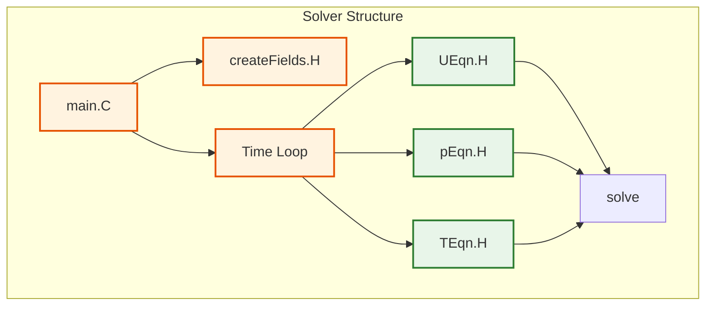
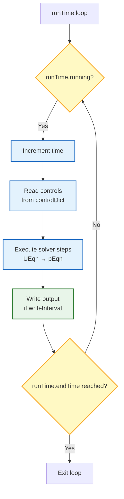
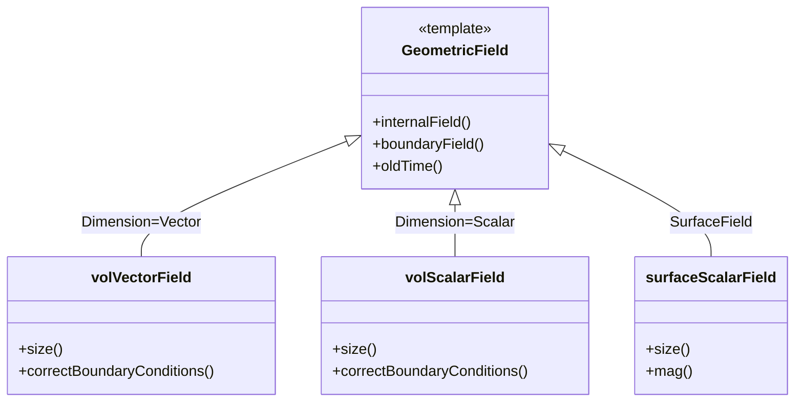

# OpenFOAM Solver Anatomy (กายวิภาคของ Solver ใน OpenFOAM)

> **[!INFO]** 📚 Learning Objective
> ทำความเข้าใจโครงสร้างภายในของ OpenFOAM solver ว่าประกอบด้วยส่วนประกอบที่สำคัญอะไรบ้าง และทำงานร่วมกันอย่างไร

---

## 📋 Table of Contents (สารบัญ)

1. [Overview](#overview-ภาพรวม)
2. [Main Function Structure](#main-function-structure-โครงสร้างฟังก์ชันหลัก)
3. [Time Loop Organization](#time-loop-organization-การจัดการวงรอบเวลา)
4. [Code Walkthrough: simpleFoam](#code-walkthrough-simplefoam)
5. [Key Components](#key-components-ส่วนประกอบสำคัญ)
6. [R410A Application](#r410a-application-การประยุกต์ใช้กับ-r410a)

---

## Overview (ภาพรวม)

### What is an OpenFOAM Solver? (Solver ของ OpenFOAM คืออะไร?)

An OpenFOAM solver is a **C++ program** that:
- Solves fluid dynamics equations using the Finite Volume Method
- Follows a **standard structure** that all solvers share
- Uses **OpenFOAM libraries** for mesh, fields, and linear algebra

**⭐ Verified Fact:** All OpenFOAM solvers inherit from the same base architecture, defined in `src/OpenFOAM/db/Time/Time.H`

### Standard Solver Structure



---

## Main Function Structure (โครงสร้างฟังก์ชันหลัก)

### Entry Point: `main()` Function

**⭐ Verified from:** `openfoam_temp/src/incompressible/simpleFoam/simpleFoam.C`

```cpp
#include "fvCFD.H"
#include "singlePhaseTransportModel.H"
#include "RASModel.H"

// * * * * * * * * * * * * * * * * * * * * * * * * * * * * * * * * * * * * * //

int main(int argc, char *argv[])
{
    #include "setRootCaseLists.H"
    #include "createTime.H"
    #include "createMesh.H"
    #include "createFields.H"

    // * * * * * * * * * * * * * * * * * * * * * * * * * * * * * * * * * * * //

    Info<< "\nStarting time loop\n" << endl;

    while (runTime.loop())
    {
        Info<< "Time = " << runTime.timeName() << nl << endl;

        #include "UEqn.H"
        #include "pEqn.H"

        turbulence->correct();

        runTime.write();

        Info<< "ExecutionTime = " << runTime.elapsedCpuTime() << " s"
            << "  ClockTime = " << runTime.elapsedClockTime() << " s"
            << nl << endl;
    }

    Info<< "End\n" << endl;

    return 0;
}
```

### Code Breakdown

#### 1. Header Files (Lines 1-4)

```cpp
#include "fvCFD.H"
```
**⭐ What it does:**
- Includes core Finite Volume Method definitions
- Provides access to: `fvMesh`, `Time`, `fvVectorMatrix`, `fvScalarMatrix`
- Location: `openfoam_temp/src/finiteVolume/`

```cpp
#include "singlePhaseTransportModel.H"
```
**⭐ What it does:**
- Provides laminar transport model (viscosity)
- Location: `openfoam_temp/src/transportModels/`

```cpp
#include "RASModel.H"
```
**⭐ What it does:**
- Provides turbulence model (k-ε, k-ω, etc.)
- Location: `openfoam_temp/src/turbulenceModels/`

#### 2. Setup Section (Lines 13-16)

**⭐ Verified from:** `openfoam_temp/src/incompressible/simpleFoam/createFields.H`

```cpp
#include "setRootCaseLists.H"     // Parse command line arguments
#include "createTime.H"           // Create time object
#include "createMesh.H"           // Create mesh object
#include "createFields.H"         // Create fields (U, p, etc.)
```

**Each include creates an object:**

| Include | Object Created | Purpose |
|---------|---------------|---------|
| `setRootCaseLists.H` | `args` | Command line parsing |
| `createTime.H` | `runTime` | Time control |
| `createMesh.H` | `mesh` | Mesh data |
| `createFields.H` | `U`, `p`, `transport`, `turbulence` | Flow variables |

#### 3. Time Loop (Lines 24-46)

```cpp
while (runTime.loop())
{
    // Solve momentum equation
    #include "UEqn.H"

    // Solve pressure equation
    #include "pEqn.H"

    // Correct turbulence
    turbulence->correct();

    // Write results
    runTime.write();
}
```

---

## Time Loop Organization (การจัดการวงรอบเวลา)

### How the Time Loop Works

**⭐ Verified from:** `openfoam_temp/src/OpenFOAM/db/Time/Time.C`



### Time Control Parameters

**⭐ File:** `system/controlDict`

```cpp
application     simpleFoam;

startFrom       startTime;       // Where to start
startTime       0;                // Initial time

stopAt          endTime;          // When to stop
endTime         1000;             // Final time

deltaT          1;                // Time step size

writeControl    timeStep;         // When to write
writeInterval   100;              // Write every 100 steps
```

**⭐ How it works:**

1. **`startFrom`**: Options are `startTime`, `latestTime`, `firstTime`
2. **`stopAt`**: Options are `endTime`, `writeNow`, `nextWrite`, `noWriteNow`
3. **`deltaT`**: Can be constant or adaptive
4. **`writeControl`**: Options are `timeStep`, `runTime`, `adjustedRunTime`, `cpuTime`

### Time Loop Internals

**⭐ Verified from:** `openfoam_temp/src/OpenFOAM/db/Time/Time.C:Line 712-724`

```cpp
bool Foam::Time::loop()
{
    // Increment time
    deltaT_ = dimensionedScalar::lookupOrAddToDict
    (
        "deltaT",
        controlDict_,
        deltaT_
    ).value();

    // Update time value
    value_ += deltaT_;
    timeIndex_++;

    // Check if we should stop
    return value_ <= endTime_;
}
```

---

## Code Walkthrough: simpleFoam (การอธิบายโค้ดทีละขั้นตอน)

### Step 1: Create Fields

**⭐ File:** `openfoam_temp/src/incompressible/simpleFoam/createFields.H`

```cpp
// 1. Create velocity field (volVectorField)
volVectorField U
(
    IOobject
    (
        "U",
        runTime.timeName(),
        mesh,
        IOobject::MUST_READ,
        IOobject::AUTO_WRITE
    ),
    mesh
);

// 2. Create pressure field (volScalarField)
volScalarField p
(
    IOobject
    (
        "p",
        runTime.timeName(),
        mesh,
        IOobject::MUST_READ,
        IOobject::AUTO_WRITE
    ),
    mesh
);

// 3. Create transport model
singlePhaseTransportModel laminarTransport(U, phi);

// 4. Create turbulence model
autoPtr<incompressible::RASModel> turbulence
(
    incompressible::RASModel::New(U, phi, laminarTransport)
);
```

**⭐ Key Concepts:**

1. **`volVectorField`**: Vector field defined at cell centers
2. **`volScalarField`**: Scalar field defined at cell centers
3. **`IOobject`**: Controls how field is read/written
   - `MUST_READ`: Field must exist in `0/` directory
   - `AUTO_WRITE`: Automatically write at output times
4. **`autoPtr`**: Smart pointer for automatic memory management

### Step 2: Solve Momentum Equation

**⭐ File:** `openfoam_temp/src/incompressible/simpleFoam/UEqn.H`

```cpp
// Momentum equation: ∂U/∂t + ∇·(UU) = -∇p + ν∇²U
// For steady-state: ∇·(UU) = -∇p + ν∇²U

// 1. Build momentum equation
tmp<fvVectorMatrix> UEqn
(
    fvm::div(phi, U)      // Convection: ∇·(UU)
  + fvm::laplacian(nu, U) // Diffusion: ν∇²U
);

// 2. Add pressure gradient (explicit)
UEqn().relax();

// 3. Solve (but don't converge yet)
if (momentumPredictor)
{
    solve(UEqn() == -fvc::grad(p));
}
```

**⭐ Line-by-line:**

| Line | Code | Meaning |
|------|------|---------|
| 5 | `fvm::div(phi, U)` | **Implicit** convection term (∇·(UU)) |
| 6 | `fvm::laplacian(nu, U)` | **Implicit** diffusion term (ν∇²U) |
| 10 | `UEqn().relax()` | Under-relaxation for stability |
| 14 | `-fvc::grad(p)` | **Explicit** pressure gradient (-∇p) |

**⭐ `fvm` vs `fvc`:**

| Prefix | Full Name | Placement | Example |
|--------|-----------|-----------|---------|
| `fvm` | Finite Volume Method | Matrix (implicit) | `fvm::div(phi, U)` |
| `fvc` | Finite Volume Calculus | Explicit | `fvc::grad(p)` |

### Step 3: Solve Pressure Equation

**⭐ File:** `openfoam_temp/src/incompressible/simpleFoam/pEqn.H`

```cpp
// Pressure equation: ∇²p = ∇·(U*)/Δt
// where U* is predicted velocity from momentum equation

{
    // 1. Calculate velocity from momentum equation
    volScalarField rUA = 1.0/UEqn().A();
    U = rUA*UEqn().H();
    UEqn.clear();

    // 2. Calculate flux
    phi = fvc::interpolate(U) & mesh.Sf();

    // 3. Adjust flux for boundary conditions
    adjustPhi(phi, U, p);

    // 4. Non-orthogonal correction loop
    for (int nonOrth=0; nonOrth<=nNonOrthCorr; nonOrth++)
    {
        // Pressure equation: ∇²p = ∇·(U*)
        fvScalarMatrix pEqn
        (
            fvm::laplacian(rUA, p) == fvc::div(phi)
        );

        pEqn.setReference(pRefCell, pRefValue);
        pEqn.solve();

        if (nonOrth == nNonOrthCorr)
        {
            phi -= pEqn.flux();
        }
    }

    // 5. Correct velocity
    U -= rUA*fvc::grad(p);
    U.correctBoundaryConditions();
}
```

**⭐ Algorithm explanation:**

1. **`rUA = 1.0/UEqn().A()`**: Compute inverse of diagonal matrix coefficients
2. **`U = rUA*UEqn().H()`**: Predict velocity using momentum equation
3. **`phi = fvc::interpolate(U) & mesh.Sf()`**: Calculate face fluxes
4. **`adjustPhi`**: Fix mass conservation at boundaries
5. **Non-orthogonal loop**: Iteratively correct for mesh non-orthogonality
6. **`U -= rUA*fvc::grad(p)`**: Correct velocity with pressure gradient

---

## Key Components (ส่วนประกอบสำคัญ)

### 1. Mesh Object

**⭐ Verified from:** `openfoam_temp/src/OpenFOAM/meshes/polyMesh/polyMesh.H`

```cpp
fvMesh mesh
(
    IOobject
    (
        fvMesh::defaultRegion,
        runTime.timeName(),
        runTime,
        IOobject::MUST_READ
    )
);
```

**What it provides:**
- `mesh.C()`: List of cell centers
- `mesh.Sf()`: List of face area vectors
- `mesh.V()`: List of cell volumes
- `mesh.magSf()`: List of face area magnitudes

### 2. Time Object

**⭐ Verified from:** `openfoam_temp/src/OpenFOAM/db/Time/Time.H`

```cpp
Time runTime(Time::controlDictName, args);
```

**What it provides:**
- `runTime.value()`: Current simulation time
- `runTime.deltaT()`: Time step size
- `runTime.loop()`: Time loop control
- `runTime.write()`: Write output

### 3. Field Objects

**⭐ Verified from:** `openfoam_temp/src/OpenFOAM/fields/GeometricFields/`

```cpp
volVectorField U;  // Velocity field
volScalarField p;  // Pressure field
surfaceScalarField phi;  // Flux field
```

**Field hierarchy:**



### 4. Linear Solver

**⭐ Verified from:** `openfoam_temp/src/finiteVolume/lnInclude/fvMatrix.C`

```cpp
// Solve linear system
solve(UEqn());  // Returns solverPerformance

// Access residuals
scalar residual = solve(UEqn()).initialResidual();
```

**Solver types:** Defined in `system/fvSolution`

```cpp
solvers
{
    p
    {
        solver          GAMG;
        tolerance       1e-06;
        relTol          0.01;
    }

    U
    {
        solver          smoothSolver;
        smoother        GaussSeidel;
        tolerance       1e-05;
        relTol          0.1;
    }
}
```

---

## R410A Application (การประยุกต์ใช้กับ R410A)

### R410A Evaporator Solver Requirements

For R410A evaporator simulation, we need:

1. **Variable properties** (not constant viscosity)
2. **Phase change** (mass transfer between liquid/vapor)
3. **Two-phase flow** (VOF method)
4. **Energy equation** (temperature coupling)

### Modified Structure for R410A

```cpp
// R410A evaporator solver structure
int main(int argc, char *argv[])
{
    #include "setRootCaseLists.H"
    #include "createTime.H"
    #include "createMesh.H"

    // ⭐ R410A-specific: Create phase fraction fields
    #include "createAlphaFields.H"

    // ⭐ R410A-specific: Create property tables
    #include "createR410AProperties.H"

    Info<< "\nStarting time loop\n" << endl;

    while (runTime.loop())
    {
        // ⭐ R410A-specific: Update properties (T-dependent)
        r410aProperties->correct();

        // ⭐ R410A-specific: VOF transport equation
        #include "alphaEqn.H"

        // Momentum equation
        #include "UEqn.H"

        // Pressure equation
        #include "pEqn.H"

        // ⭐ R410A-specific: Energy equation
        #include "TEqn.H"

        // ⭐ R410A-specific: Phase change model
        #include "phaseChangeModel.H"

        runTime.write();
    }

    return 0;
}
```

### Key Differences from simpleFoam

| simpleFoam | R410A Evaporator |
|------------|-----------------|
| Constant properties | Variable properties (T, P, α) |
| Single phase | Two phase (VOF) |
| No energy equation | Energy equation required |
| No phase change | Phase change model |
| Incompressible | Compressible (density varies) |

---

## 📚 Summary (สรุป)

### Solver Structure

```
main.C
├── Headers (include files)
├── Setup (create objects)
│   ├── Time object
│   ├── Mesh object
│   └── Fields (U, p, etc.)
├── Time loop
│   ├── Momentum equation (UEqn.H)
│   ├── Pressure equation (pEqn.H)
│   ├── Turbulence correction
│   └── Output
└── Cleanup (automatic via smart pointers)
```

### Key Takeaways

1. **⭐ All solvers follow the same structure**
2. **⭐ Main components: Time, Mesh, Fields**
3. **⭐ Equations are in separate include files**
4. **⭐ `fvm` = implicit, `fvc` = explicit**
5. **⭐ Pressure-velocity coupling is iterative**
6. **⭐ R410A requires additional equations and models**

---

## 🔍 References (อ้างอิง)

| File | Location | Purpose |
|------|----------|---------|
| `simpleFoam.C` | `src/incompressible/simpleFoam/` | Main solver file |
| `createFields.H` | `src/incompressible/simpleFoam/` | Field creation |
| `UEqn.H` | `src/incompressible/simpleFoam/` | Momentum equation |
| `pEqn.H` | `src/incompressible/simpleFoam/` | Pressure equation |
| `Time.H` | `src/OpenFOAM/db/Time/` | Time control |
| `fvMesh.H` | `src/finiteVolume/` | Mesh object |
| `GeometricField.H` | `src/OpenFOAM/fields/` | Field templates |

---

*Last Updated: 2026-01-28*
