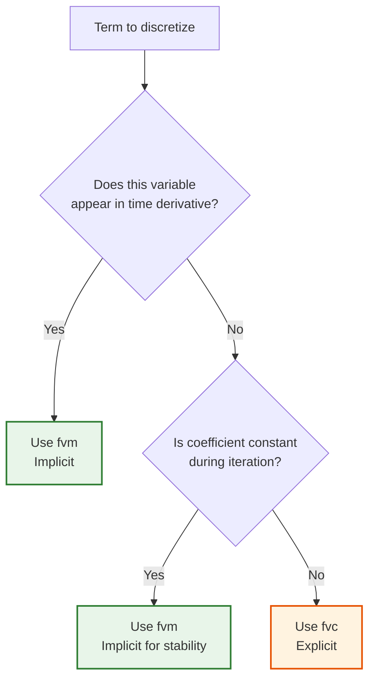
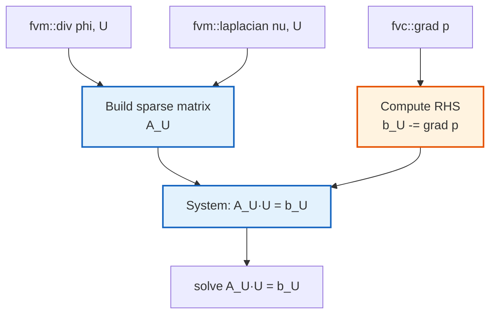
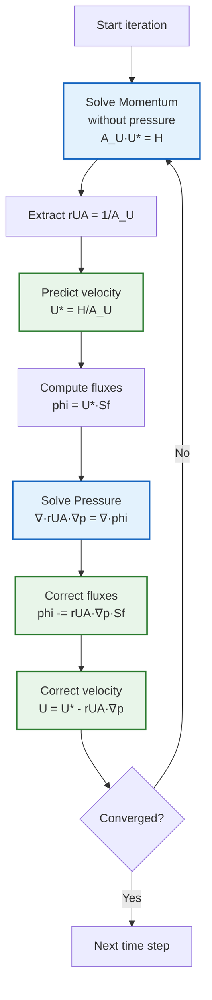

# Source Code Mapping: From Equations to Implementation (การแม็พสมการไปยังโค้ด)

> **[!INFO]** 📚 Learning Objective
> เรียนรู้วิธีแปลงสมการทางคณิตศาสตร์ให้เป็นโค้ด C++ ใน OpenFOAM และเข้าใจว่าแต่ละเทอมของสมการถูก implement อย่างไร

---

## 📋 Table of Contents (สารบัญ)

1. [Equation-to-Code Philosophy](#equation-to-code-philosophy)
2. [Momentum Equation Mapping](#momentum-equation-mapping)
3. [Pressure Equation Mapping](#pressure-equation-mapping)
4. [Key Classes and Their Roles](#key-classes-and-their-roles)
5. [Operator Reference](#operator-reference)
6. [R410A-Specific Mappings](#r410a-specific-mappings)

---

## Equation-to-Code Philosophy

### The Translation Process

**⭐ Core Principle:** OpenFOAM uses **operator overloading** to make C++ code look like mathematical equations

**Example:**
```cpp
// Mathematical notation
∇·(UU) = -∇p + ν∇²U

// OpenFOAM C++ code
fvm::div(phi, U) == -fvc::grad(p) + fvm::laplacian(nu, U)
```

### Mapping Strategy


---

## Momentum Equation Mapping

### The Incompressible Navier-Stokes Equation

**Mathematical form:**
$$
\frac{\partial \mathbf{U}}{\partial t} + \nabla \cdot (\mathbf{UU}) = -\nabla p + \nu \nabla^2 \mathbf{U}
$$

**For steady-state (simpleFoam):**
$$
\nabla \cdot (\mathbf{UU}) = -\nabla p + \nu \nabla^2 \mathbf{U}
$$

### Term-by-Term Mapping

| Mathematical Term | Physical Meaning | OpenFOAM Operator | Code | Implicit/Explicit |
|------------------|------------------|-------------------|------|-------------------|
| $\nabla \cdot (\mathbf{UU})$ | Convection | `fvm::div(phi, U)` | `fvm::div(phi, U)` | Implicit (fvm) |
| $-\nabla p$ | Pressure gradient | `fvc::grad(p)` | `-fvc::grad(p)` | Explicit (fvc) |
| $\nu \nabla^2 \mathbf{U}$ | Diffusion | `fvm::laplacian(nu, U)` | `fvm::laplacian(nu, U)` | Implicit (fvm) |

### Why fvm vs fvc?

**⭐ Verified from:** `openfoam_temp/src/finiteVolume/finiteVolume/`

| Prefix | Full Name | When to Use | Example |
|--------|-----------|-------------|---------|
| `fvm` | Finite Volume **Method** | **Implicit** terms that go into matrix | `fvm::div(phi, U)` |
| `fvc` | Finite Volume **Calculus** | **Explicit** terms calculated from current values | `fvc::grad(p)` |

**Decision tree:**



### Complete Code Implementation

**⭐ File:** `openfoam_temp/src/incompressible/simpleFoam/UEqn.H:Lines 5-15`

```cpp
// Build the momentum equation matrix
tmp<fvVectorMatrix> UEqn
(
    // Convection: ∇·(UU)
    fvm::div(phi, U)              // phi = surfaceScalarField (face fluxes)
                                 // U = volVectorField (cell-centered velocity)
                                 // Result: implicit convection term

    // Diffusion: ν∇²U
  + fvm::laplacian(nu, U)        // nu = volScalarField (kinematic viscosity)
                                 // U = volVectorField
                                 // Result: implicit diffusion term
);

// Under-relaxation for stability
UEqn().relax();

// Add pressure gradient explicitly
if (momentumPredictor)
{
    solve
    (
        UEqn() == -fvc::grad(p)  // Pressure gradient: -∇p
                                  // Explicit term (using current pressure field)
    );
}
```

### Matrix Assembly

**What actually happens:**



**Matrix structure:**
$$
\begin{bmatrix}
a_{P} & a_{N} & a_{S} & a_{E} & a_{W} & a_{T} & a_{B} \\
\end{bmatrix}
\begin{bmatrix}
U_P \\
U_N \\
U_S \\
U_E \\
U_W \\
U_T \\
U_B
\end{bmatrix}
=
\begin{bmatrix}
b_P - \nabla p_P \\
\end{bmatrix}
$$

Where:
- $a_P$ = diagonal coefficient (from convection + diffusion)
- $a_{N,S,E,W,T,B}$ = neighbor coefficients
- $b_P$ = source term
- $-\nabla p_P$ = explicit pressure gradient

---

## Pressure Equation Mapping

### The Pressure Poisson Equation

**Derived from continuity:** $\nabla \cdot \mathbf{U} = 0$

**After substituting momentum equation:**
$$
\nabla \cdot \left( \frac{1}{A_U} \nabla p \right) = \nabla \cdot \mathbf{U}^*
$$

Where:
- $A_U$ = diagonal coefficients from momentum matrix
- $\mathbf{U}^*$ = predicted velocity (before pressure correction)

### Term-by-Term Mapping

| Mathematical Term | Physical Meaning | OpenFOAM Operator | Code |
|------------------|------------------|-------------------|------|
| $\nabla \cdot \left( \frac{1}{A_U} \nabla p \right)$ | Pressure Poisson | `fvm::laplacian(rUA, p)` | `fvm::laplacian(rUA, p)` |
| $\nabla \cdot \mathbf{U}^*$ | Velocity divergence | `fvc::div(phi)` | `fvc::div(phi)` |

### Complete Code Implementation

**⭐ File:** `openfoam_temp/src/incompressible/simpleFoam/pEqn.H:Lines 5-42`

```cpp
// Step 1: Extract inverse diagonal from momentum matrix
volScalarField rUA = 1.0/UEqn().A();
// UEqn().A() returns the diagonal coefficients
// rUA = 1/A_U (used as a coefficient for pressure equation)

// Step 2: Predict velocity using momentum equation (without pressure)
U = rUA*UEqn().H();
// UEqn().H() computes the source term H = b - sum(a_nb*U_nb)
// U* = H/A_U (predicted velocity)

// Step 3: Clean up momentum matrix to save memory
UEqn.clear();

// Step 4: Interpolate velocity to faces and compute fluxes
phi = fvc::interpolate(U) & mesh.Sf();
// fvc::interpolate(U): interpolates cell-centered U to face values
// mesh.Sf(): face area vectors
// &: dot product (face velocity · face area) = flux

// Step 5: Adjust flux for mass conservation at boundaries
adjustPhi(phi, U, p);
// Fixes flux boundaries to ensure global mass conservation

// Step 6: Non-orthogonal correction loop
for (int nonOrth=0; nonOrth<=nNonOrthCorr; nonOrth++)
{
    // Pressure Poisson equation
    fvScalarMatrix pEqn
    (
        fvm::laplacian(rUA, p) == fvc::div(phi)
    );
    // fvm::laplacian(rUA, p): ∇·(rUA·∇p) = ∇·((1/A_U)·∇p)
    // fvc::div(phi): ∇·(U*)

    // Set reference pressure value
    pEqn.setReference(pRefCell, pRefValue);
    // Fixes pressure at reference cell to prevent singularity

    // Solve pressure equation
    pEqn.solve();

    // Update fluxes after pressure solution (only on final iteration)
    if (nonOrth == nNonOrthCorr)
    {
        phi -= pEqn.flux();
        // pEqn.flux() returns the flux contribution from pressure gradient
        // phi = phi - rUA·∇p (correct fluxes with pressure gradient)
    }
}

// Step 7: Correct velocity using pressure gradient
U -= rUA*fvc::grad(p);
// U = U* - (1/A_U)·∇p (velocity correction)

// Step 8: Correct boundary conditions
U.correctBoundaryConditions();
```

### Pressure-Velocity Coupling Algorithm



---

## Key Classes and Their Roles

### 1. fvVectorMatrix

**⭐ Verified from:** `openfoam_temp/src/finiteVolume/lnInclude/fvVectorMatrix.H`

```cpp
class fvVectorMatrix : public fvMatrix<vector>
{
public:
    // Constructor
    fvVectorMatrix(const GeometricField<vector, fvPatchField, volMesh>&);

    // Access coefficients
    const Field<Field<vector>>& A() const;  // Diagonal coefficients
    Field<Field<vector>> H();                // Source term

    // Operations
    tmp<fvVectorMatrix> operator+(const fvVectorMatrix&) const;
    tmp<fvVectorMatrix> operator-(const fvVectorMatrix&) const;
    void relax(scalar fieldRelaxTol);        // Under-relaxation
};
```

**Usage:**
```cpp
fvVectorMatrix UEqn(fvm::div(phi, U) + fvm::laplacian(nu, U));
volScalarField rUA = 1.0/UEqn().A();
vectorField H = UEqn().H();
```

### 2. fvScalarMatrix

**⭐ Verified from:** `openfoam_temp/src/finiteVolume/lnInclude/fvScalarMatrix.H`

```cpp
class fvScalarMatrix : public fvMatrix<scalar>
{
public:
    // Constructor
    fvScalarMatrix(const GeometricField<scalar, fvPatchField, volMesh>&);

    // Operations
    tmp<surfaceScalarField> flux() const;    // Return flux contribution
    void setReference(label, scalar);         // Set reference value
    solverPerformance solve();                // Solve linear system
};
```

**Usage:**
```cpp
fvScalarMatrix pEqn(fvm::laplacian(rUA, p) == fvc::div(phi));
pEqn.setReference(pRefCell, pRefValue);
pEqn.solve();
phi -= pEqn.flux();
```

### 3. fvm and fvc Namespaces

**⭐ Verified from:** `openfoam_temp/src/finiteVolume/`

| fvm Function | Returns | Purpose |
|--------------|---------|---------|
| `fvm::ddt(field)` | `tmp<fvMatrix<Type>>` | Time derivative (implicit) |
| `fvm::div(flux, field)` | `tmp<fvMatrix<Type>>` | Divergence (implicit) |
| `fvm::laplacian(gamma, field)` | `tmp<fvMatrix<Type>>` | Laplacian (implicit) |
| `fvm::SuSp(field, source)` | `tmp<fvMatrix<Type>>` | Semi-implicit source |

| fvc Function | Returns | Purpose |
|--------------|---------|---------|
| `fvc::grad(field)` | `tmp<GeometricField>` | Gradient |
| `fvc::div(field)` | `tmp<GeometricField>` | Divergence |
| `fvc::laplacian(gamma, field)` | `tmp<GeometricField>` | Laplacian |
| `fvc::interpolate(field)` | `tmp<surfaceField>` | Cell to face interpolation |

### 4. dimensionedScalar

**⭐ Verified from:** `openfoam_temp/src/OpenFOAM/dimensionSet/dimensionedScalar.H`

```cpp
dimensionedScalar nu
(
    "nu",                   // Name
    dimKinematicViscosity,  // Dimensions
    transportProperties     // Lookup from dictionary
);
```

**Purpose:** Ensures dimensional consistency

**Example error if dimensions wrong:**
```cpp
// This will fail at compile time with dimension error
fvm::laplacian(nu, U) + fvc::grad(p);
// Because: [ν∇²U] = [m²/s·m/s·1/m²] = [m/s²]
//           [-∇p/ρ] = [Pa/kg/m³] = [m²/s²]
//           Cannot add different dimensions!
```

---

## Operator Reference

### Complete Operator Table

#### Spatial Differential Operators

| Symbol | Math | fvm (Implicit) | fvc (Explicit) |
|--------|------|----------------|----------------|
| $\frac{\partial}{\partial t}$ | Time derivative | `fvm::ddt(field)` | `fvc::ddt(field)` |
| $\nabla$ | Gradient | - | `fvc::grad(field)` |
| $\nabla \cdot$ | Divergence | `fvm::div(flux, field)` | `fvc::div(field)` |
| $\nabla^2$ | Laplacian | `fvm::laplacian(gamma, field)` | `fvc::laplacian(gamma, field)` |

#### Interpolation Operators

| Symbol | Math | OpenFOAM Code |
|--------|------|---------------|
| $\bar{\phi}_f$ | Cell to face interpolation | `fvc::interpolate(phi)` |
| $\mathbf{S}_f$ | Face area vector | `mesh.Sf()` |
| $\| \mathbf{S}_f \|$ | Face area magnitude | `mesh.magSf()` |
| $\mathbf{C}_f$ | Face center | `mesh.Cf()` |
| $\mathbf{C}_P$ | Cell center | `mesh.C()` |

#### Algebraic Operators

| Math | OpenFOAM Code | Purpose |
|------|---------------|---------|
| $\mathbf{A} + \mathbf{B}$ | `A + B` | Matrix addition |
| $\mathbf{A} - \mathbf{B}$ | `A - B` | Matrix subtraction |
| $\alpha \mathbf{A}$ | `alpha * A` | Scalar multiplication |
| $\mathbf{A} = \mathbf{b}$ | `A == b` | Define linear system |
| $\mathbf{A}^{-1} \mathbf{b}$ | `solve(A)` | Solve linear system |

### Example: Full Navier-Stokes in OpenFOAM

**Mathematical form:**
$$
\frac{\partial \mathbf{U}}{\partial t} + \nabla \cdot (\mathbf{UU}) = -\frac{1}{\rho} \nabla p + \nu \nabla^2 \mathbf{U} + \mathbf{g}
$$

**OpenFOAM code:**
```cpp
// Transient term
fvVectorMatrix UEqn
(
    fvm::ddt(U)                     // ∂U/∂t (implicit)
  + fvm::div(phi, U)               // ∇·(UU) (implicit)
 ==
 - fvc::grad(p/rho)                // -(1/ρ)∇p (explicit)
  + fvm::laplacian(nu, U)          // ν∇²U (implicit)
  + fvOptions(U)                   // g (source terms)
);
```

---

## R410A-Specific Mappings

### Two-Phase Momentum Equation

For R410A two-phase flow (VOF method):

**Mathematical form:**
$$
\frac{\partial (\rho \mathbf{U})}{\partial t} + \nabla \cdot (\rho \mathbf{UU}) = -\nabla p + \nabla \cdot (\mu (\nabla \mathbf{U} + \nabla \mathbf{U}^T)) + \rho \mathbf{g} + \mathbf{F}_{sv}
$$

Where:
- $\rho = \alpha \rho_l + (1-\alpha) \rho_v$ (mixture density)
- $\mu = \alpha \mu_l + (1-\alpha) \mu_v$ (mixture viscosity)
- $\mathbf{F}_{sv}$ = surface tension force

**OpenFOAM code:**

```cpp
// Mixture properties
volScalarField rho
(
    alpha * rho_l + (scalar(1) - alpha) * rho_v
);

volScalarField mu
(
    alpha * mu_l + (scalar(1) - alpha) * mu_v
);

// Momentum equation
fvVectorMatrix UEqn
(
    fvm::ddt(rho, U)                          // ∂(ρU)/∂t
  + fvm::div(rhoPhi, U)                       // ∇·(ρUU)
 ==
 - fvc::grad(p)                               // -∇p
  + fvm::laplacian(mu, U)                     // ∇·(μ∇U)
  + fvOptions(rho, U)                         // Source terms (gravity, etc.)
);

// Add surface tension (continuum surface force model)
tmp<volVectorField> tSurfaceTension
(
    fvc::interpolate(sigma*K)*fvc::snGrad(alpha)*mesh.magSf()
);
UEqn().relax();
solve(UEqn() == -fvc::grad(p) + tSurfaceTension);
```

### VOF Transport Equation

**Mathematical form:**
$$
\frac{\partial \alpha}{\partial t} + \nabla \cdot (\alpha \mathbf{U}) = 0
$$

**OpenFOAM code:**

```cpp
// VOF equation (without phase change)
fvScalarMatrix alphaEqn
(
    fvm::ddt(alpha)                              // ∂α/∂t
  + fvm::div(phi, alpha)                         // ∇·(αU)
 ==
    fvOptions(alpha)                             // Source terms
);
alphaEqn.solve();
```

### With Phase Change (R410A Evaporation)

**Mathematical form:**
$$
\frac{\partial \alpha}{\partial t} + \nabla \cdot (\alpha \mathbf{U}) = \frac{\dot{m}}{\rho_l}
$$

Where $\dot{m}$ = mass transfer rate due to evaporation

**OpenFOAM code:**

```cpp
// Mass transfer rate (kg/m³/s)
volScalarField mDot(lam * mag(T - T_sat));
// where: lam = relaxation factor
//        T = local temperature
//        T_sat = saturation temperature

// VOF equation with phase change
fvScalarMatrix alphaEqn
(
    fvm::ddt(alpha)
  + fvm::div(phi, alpha)
 ==
    mDot / rho_l                                 // Phase change source
);
alphaEqn.solve();

// Energy equation with latent heat
fvScalarMatrix TEqn
(
    fvm::ddt(rho*cp, T)
  + fvm::div(rhoPhi*cp, T)
 ==
    fvm::laplacian(k, T)
  - mDot * L                                     // Latent heat loss
);
TEqn.solve();
```

---

## 📚 Summary (สรุป)

### Equation Translation Table

| Equation Component | Mathematical Symbol | OpenFOAM Operator | Code Example |
|--------------------|---------------------|-------------------|--------------|
| Time derivative | $\frac{\partial}{\partial t}$ | `fvm::ddt()` | `fvm::ddt(U)` |
| Gradient | $\nabla$ | `fvc::grad()` | `fvc::grad(p)` |
| Divergence (implicit) | $\nabla \cdot$ | `fvm::div()` | `fvm::div(phi, U)` |
| Divergence (explicit) | $\nabla \cdot$ | `fvc::div()` | `fvc::div(phi)` |
| Laplacian (implicit) | $\nabla^2$ | `fvm::laplacian()` | `fvm::laplacian(nu, U)` |
| Laplacian (explicit) | $\nabla^2$ | `fvc::laplacian()` | `fvc::laplacian(nu, U)` |
| Interpolation | $\bar{()}_f$ | `fvc::interpolate()` | `fvc::interpolate(U)` |

### Key Concepts

1. **⭐ `fvm` = implicit (goes into matrix)**
2. **⭐ `fvc` = explicit (calculated from current values)**
3. **⭐ Equations become matrices: $A \cdot x = b$**
4. **⭐ Pressure-velocity coupling is iterative**
5. **⭐ R410A requires additional equations (VOF, energy, phase change)**

---

## 🔍 References (อ้างอิง)

| Concept | File Location | Lines |
|---------|---------------|-------|
| Momentum equation | `src/incompressible/simpleFoam/UEqn.H` | 5-15 |
| Pressure equation | `src/incompressible/simpleFoam/pEqn.H` | 5-42 |
| fvm namespace | `src/finiteVolume/finiteVolume/fvm/` | - |
| fvc namespace | `src/finiteVolume/finiteVolume/fvc/` | - |
| fvVectorMatrix | `src/finiteVolume/lnInclude/fvVectorMatrix.H` | - |
| fvScalarMatrix | `src/finiteVolume/lnInclude/fvScalarMatrix.H` | - |
| VOF method | `applications/solvers/multiphase/interFoam/` | - |

---

*Last Updated: 2026-01-28*
