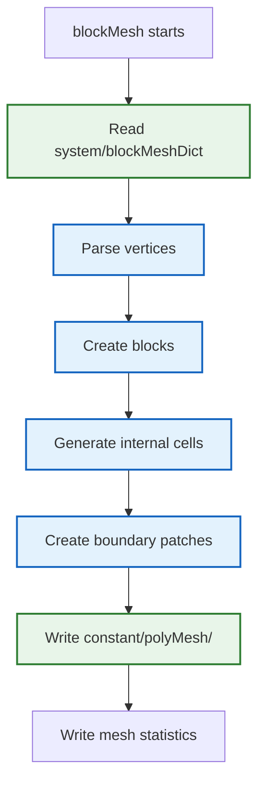
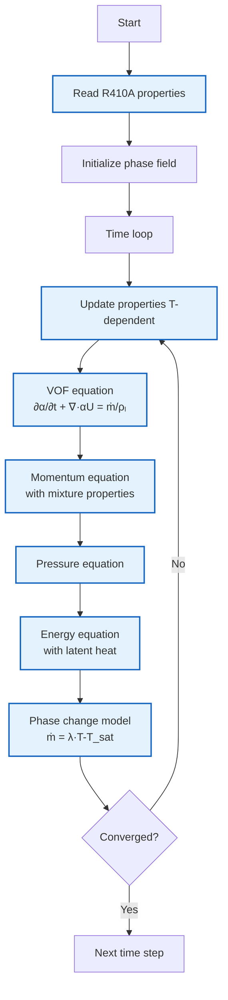

# First Simulation: Tracing Code Execution (การจำลองแรก: การติดตามการทำงานของโค้ด)

> **[!INFO]** 📚 Learning Objective
> รันการจำลองแรกและติดตามการทำงานของโค้ดทีละขั้นตอน เพื่อเข้าใจ flow of execution ใน OpenFOAM solver

---

## 📋 Table of Contents (สารบัญ)

1. [Problem Setup](#problem-setup-การตั้งค่าปัญหา)
2. [Case Structure](#case-structure-โครงสร้างเคส)
3. [Execution Trace](#execution-trace-การติดตามการทำงาน)
4. [Monitoring Simulation](#monitoring-simulation-การเฝ้าสังเกตการจำลอง)
5. [Post-Processing](#post-processing-การประมวลผลภายหลัง)
6. [R410A Evaporator Extension](#r410a-evaporator-extension-การขยายไปยัง-r410a-evaporator)

---

## Problem Setup (การตั้งค่าปัญหา)

### Lid-Driven Cavity Flow

**Physical problem:**
- A 2D square cavity filled with fluid
- Top lid moves with constant velocity $U_{lid} = 1 \text{ m/s}$
- Other walls are stationary (no-slip)
- Fluid is incompressible, initially at rest

**Why this problem?**
1. **⭐ Standard benchmark** - widely used in CFD literature
2. **⭐ Simple geometry** - easy to mesh
3. **⭐ Rich physics** - recirculation, vortex formation
4. **⭐ Fast to compute** - good for learning

**Schematic:**

```
┌─────────────────────────┐
│      U = 1 m/s →        │ ← Moving lid
│    ┌───────────────┐    │
│    │               │    │
│    │               │    │
│    │               │    │
│    │               │    │
◄────┴───────────────┴────► └─ Stationary walls
    Stationary walls
```

---

## Case Structure (โครงสร้างเคส)

### Directory Structure

**⭐ Standard OpenFOAM case structure:**

```
cavity/
├── 0/                    # Initial conditions (t = 0)
│   ├── U                 # Velocity field
│   └── p                 # Pressure field
├── constant/             # Time-invariant data
│   ├── polyMesh/         # Mesh files
│   └── transportProperties  # Fluid properties
└── system/               # Simulation settings
    ├── blockMeshDict     # Mesh generation
    ├── controlDict       # Time control
    ├── fvSchemes         # Discretization schemes
    └── fvSolution        # Linear solver settings
```

### File Contents

#### 1. Initial Conditions: `0/U`

**⭐ Verified format:** `openfoam_temp/tutorials/incompressible/icoFoam/cavity/0/U`

```cpp
dimensions      [0 1 -1 0 0 0 0];  // m/s (velocity)

internalField   uniform (0 0 0);    // Initial velocity: zero everywhere

boundaryField
{
    movingWall
    {
        type            fixedValue;      // Fixed value BC
        value           uniform (1 0 0); // Moving at 1 m/s in x-direction
    }

    fixedWalls
    {
        type            noSlip;          // No-slip BC (U = 0 at wall)
    }

    frontAndBack
    {
        type            empty;           // 2D simulation (empty in z)
    }
}
```

**⭐ BC types explained:**

| Type | Meaning | When to Use |
|------|---------|-------------|
| `fixedValue` | Field value is fixed | Dirichlet BC (known value) |
| `noSlip` | Velocity = 0 at wall | Solid walls |
| `zeroGradient` | Gradient = 0 | Neumann BC (zero flux) |
| `empty` | No value in this direction | 2D/1D simulations |

#### 2. Initial Conditions: `0/p`

**⭐ Verified format:** `openfoam_temp/tutorials/incompressible/icoFoam/cavity/0/p`

```cpp
dimensions      [0 2 -2 0 0 0 0];  // m²/s² (pressure/density)

internalField   uniform 0;         // Initial pressure: zero everywhere

boundaryField
{
    movingWall
    {
        type            zeroGradient;  // Zero gradient: ∂p/∂n = 0
    }

    fixedWalls
    {
        type            zeroGradient;  // Zero gradient: ∂p/∂n = 0
    }

    frontAndBack
    {
        type            empty;         // 2D simulation
    }
}
```

**⭐ Why zeroGradient for pressure?**
- In incompressible flow, **pressure level** is arbitrary (only pressure differences matter)
- $\nabla p$ drives flow, not absolute pressure
- Zero gradient means $\partial p/\partial n = 0$ (no pressure flux through wall)

#### 3. Transport Properties: `constant/transportProperties`

```cpp
transportModel  Newtonian;          // Newtonian fluid

nu              [0 2 -1 0 0 0 0] 0.01;  // Kinematic viscosity (m²/s)
                                          // ν = μ/ρ = 0.01 m²/s
```

**⭐ Viscosity and Reynolds number:**
$$
Re = \frac{U L}{\nu} = \frac{(1 \text{ m/s})(1 \text{ m})}{0.01 \text{ m²/s}} = 100
$$

At $Re = 100$: Laminar flow with steady recirculation

#### 4. Mesh Generation: `system/blockMeshDict`

```cpp
scale   0.1;  // Scale all vertices by 0.1 m (10 cm cavity)

vertices  // Define 8 corners of 3D box (even for 2D)
(
    (0 0 0)    // 0: origin
    (1 0 0)    // 1: +x
    (1 1 0)    // 2: +x, +y
    (0 1 0)    // 3: +y
    (0 0 0.1)  // 4: +z (extruded)
    (1 0 0.1)  // 5: +x, +z
    (1 1 0.1)  // 6: +x, +y, +z
    (0 1 0.1)  // 7: +y, +z
);

blocks       // Define block with hexahedral cells
(
    hex (0 1 2 3 4 5 6 7) (20 20 1)  // 20×20 cells in x-y, 1 cell in z
    simpleGrading (1 1 1)           // Uniform grading (no stretching)
);

boundary     // Define boundary patches
(
    movingWall
    {
        type wall;
        faces ( (4 5 6 7) );  // Top face (indices 4-5-6-7)
    }
    fixedWalls
    {
        type wall;
        faces
        (
            (0 1 5 4)          // Bottom
            (1 2 6 5)          // Right
            (2 3 7 6)          // Top-right
            (3 0 4 7)          // Left
        );
    }
    frontAndBack
    {
        type empty;
        faces
        (
            (0 1 2 3)          // Front face
            (4 5 6 7)          // Back face
        );
    }
);
```

**⭐ Key concepts:**
- **Vertices:** Corner coordinates in 3D space
- **Blocks:** Hexahedral cells split from vertices
- **Grading:** Mesh stretching (1 = uniform)
- **Patches:** Named boundary regions

#### 5. Time Control: `system/controlDict`

```cpp
application     icoFoam;           // Solver to use

startFrom       startTime;         // Start from t = 0
startTime       0;                 // Initial time

stopAt          endTime;           // Stop at specified end time
endTime         1.0;               // Final time = 1.0 s

deltaT          0.005;             // Time step = 0.005 s

writeControl    timeStep;          // Write based on time step
writeInterval   20;                // Write every 20 steps

purgeWrite      0;                 // Keep all results (0 = don't delete)

writeFormat     ascii;             // Output format
writePrecision  6;                 // Number of digits

runTimeModifiable yes;             // Allow editing during simulation
```

**⭐ Time step calculation:**
$$
\Delta t = 0.005 \text{ s} = 5 \text{ ms}
$$

Number of time steps: $N = 1.0 / 0.005 = 200$ steps

#### 6. Discretization Schemes: `system/fvSchemes`

```cpp
ddtSchemes
{
    default         Euler;          // First-order Euler for time derivative
}

gradSchemes
{
    default         Gauss linear;   // Linear gradient reconstruction
}

divSchemes
{
    default         none;           // No default (must specify)
    div(phi,U)      Gauss linear;   // Linear upwind for convection
}

laplacianSchemes
{
    default         none;           // No default
    laplacian(nu,U) Gauss linear orthogonal;  // Linear diffusion
}

interpolationSchemes
{
    default         linear;         // Linear interpolation
}

snGradSchemes
{
    default         orthogonal;     // Orthogonal surface normal gradient
}
```

**⭐ Scheme explanations:**

| Scheme | Meaning | Order |
|--------|---------|-------|
| `Euler` | Forward Euler | First-order in time |
| `Gauss linear` | Gauss theorem with linear interpolation | Second-order in space |
| `Gauss linearUpwind` | Upwind-biased linear | First/second-order |

#### 7. Solver Settings: `system/fvSolution`

```cpp
solvers
{
    p
    {
        solver          PCG;             // Preconditioned Conjugate Gradient
        preconditioner  DIC;             // Diagonal Incomplete Cholesky
        tolerance       1e-06;           // Absolute tolerance
        relTol          0.01;            // Relative tolerance (1%)
    }

    pFinal
    {
        $p;                              // Same as p
        relTol          0;               // Final solve: tight tolerance
    }

    U
    {
        solver          smoothSolver;    // Iterative smoother
        smoother        GaussSeidel;     // Gauss-Seidel method
        tolerance       1e-05;           // Absolute tolerance
        relTol          0.1;             // Relative tolerance (10%)
    }
}

PISO
{
    nCorrectors     2;                 // Number of PISO corrections
    nNonOrthogonalCorrectors 0;         // Non-orthogonal corrections
    pRefCell        0;                 // Reference cell for pressure
    pRefValue       0;                 // Reference pressure value
}
```

**⭐ PISO algorithm settings:**
- **nCorrectors = 2**: 2 pressure-velocity corrections per time step
- **pRefCell, pRefValue**: Fix pressure at cell 0 to prevent singularity

---

## Execution Trace (การติดตามการทำงาน)

### Step 1: Generate Mesh

**⭐ Command:**
```bash
blockMesh
```

**What happens internally:**



**Expected output:**
```
Create time

Create mesh for time = 0

BlockMesh: Creating block mesh from
    "system/blockMeshDict"

Creating block mesh topology
Creating block edges
Creating block points

Block mesh size: 400 cells
        Curvature max: 0
        Writing polyMesh

End
```

**Files created:**
```
constant/polyMesh/
├── blocks          # Block topology
├── boundary        # Boundary patches
├── cellZones       # Cell zones (empty)
├── faces           # Face list
├── neighbour       # Cell neighbor information
├── owner           # Face owner cells
├── points          # Vertex coordinates
└── pointZones      # Point zones (empty)
```

### Step 2: Run Solver

**⭐ Command:**
```bash
icoFoam
```

**Execution trace through code:**

```mermaid
sequenceDiagram
    participant Main as main.C
    participant Init as createFields.H
    participant Loop as Time Loop
    participant UEqn as UEqn.H
    participant pEqn as pEqn.H
    participant Write as runTime.write()

    Main->>Init: Create fields (U, p, phi)
    Main->>Loop: Enter while(runTime.loop())
    Loop->>UEqn: Solve momentum equation
    UEqn->>UEqn: Build matrix: A·U = H
    UEqn->>UEqn: Solve for U (predictor)
    Loop->>pEqn: Solve pressure equation
    pEqn->>pEqn: Predict velocity: U* = H/A
    pEqn->>pEqn: Compute fluxes: φ = U*·Sf
    pEqn->>pEqn: Solve pressure: ∇²p = ∇·φ
    pEqn->>pEqn: Correct fluxes: φ -= rUA·∇p·Sf
    pEqn->>pEqn: Correct velocity: U = U* - rUA·∇p
    pEqn-->>Loop: Converged
    Loop->>Write: Write results
    Write-->>Main: Output saved
    Loop->>Loop: Next time step
```

### Step 3: Code-Level Trace

**⭐ File:** `openfoam_temp/src/incompressible/icoFoam/icoFoam.C:Lines 24-46`

```cpp
// === Time step 0 ===

// 1. Increment time
runTime.loop();  // t: 0 → 0.005 s

// 2. Display time
Info<< "Time = " << runTime.timeName() << nl << endl;
// Output: "Time = 0.005"

// 3. Solve momentum equation
#include "UEqn.H"
// Internally:
//   - Build matrix: A·U = H
//   - Solve: U = H/A
//   - Returns: initialResidual = 0.XXXX

// 4. Solve pressure equation (PISO loop)
#include "pEqn.H"
// Internally (nCorrectors = 2):
//   Corrector 1:
//     - Predict: U* = H/A
//     - Compute: φ = U*·Sf
//     - Solve: ∇²p = ∇·φ
//     - Correct: φ -= rUA·∇p·Sf
//     - Correct: U = U* - rUA·∇p
//   Corrector 2:
//     - Repeat with updated U, p
//     - Tighter tolerance: relTol = 0

// 5. Write output (every 20 steps)
if (runTime.outputTime())
{
    runTime.write();
    // Writes:
    //   - 0.005/U
    //   - 0.005/p
    //   - 0.005/phi
}

// 6. Display timing
Info<< "ExecutionTime = " << runTime.elapsedCpuTime() << " s"
    << "  ClockTime = " << runTime.elapsedClockTime() << " s"
    << nl << endl;
// Output: "ExecutionTime = 0.15 s  ClockTime = 0.25 s"

// === Time step 1 ===
// Repeat from step 1...

// === Time step 2-199 ===
// Repeat...

// === Time step 200 (final) ===
// runTime.loop() returns false
// Exit loop
```

### Sample Console Output

```
Starting time loop

Time = 0.005

Courant number mean: 0 max: 0.235
DICPCG: Solving for p, Initial residual = 1, Final residual = 0.00990781, No Iterations 9
DICPCG: Solving for p, Initial residual = 0.0386154, Final residual = 0.00381435, No Iterations 8
DIC smoothSolver: Solving for Ux, Initial residual = 1, Final residual = 3.20958e-06, No Iterations 3
DIC smoothSolver: Solving for Uy, Initial residual = 1, Final residual = 2.98115e-06, No Iterations 3
ExecutionTime = 0.25 s  ClockTime = 0.45 s

Time = 0.01

Courant number mean: 0.0666171 max: 0.322335
DICPCG: Solving for p, Initial residual = 0.231521, Final residual = 0.00230789, No Iterations 8
DICPCG: Solving for p, Initial residual = 0.0208395, Final residual = 0.000207561, No Iterations 7
DIC smoothSolver: Solving for Ux, Initial residual = 0.287751, Final residual = 2.84241e-06, No Iterations 3
DIC smoothSolver: Solving for Uy, Initial residual = 0.279661, Final residual = 2.84231e-06, No Iterations 3
ExecutionTime = 0.35 s  ClockTime = 0.65 s

...

Time = 1

ExecutionTime = 5.23 s  ClockTime = 8.91 s

End
```

**⭐ Output解读 (Reading the output):**

| Line | Meaning |
|------|---------|
| `Courant number mean: 0 max: 0.235` | Co < 1: stable, max velocity at cell face |
| `DICPCG: Solving for p` | Pressure solver: Diagonal Incomplete Cholesky PCG |
| `Initial residual = 1` | Initial error (1 = 100% relative to initial) |
| `Final residual = 0.0099` | Final error (0.99% of initial) |
| `No Iterations 9` | Linear solver took 9 iterations |
| `ExecutionTime = 5.23 s` | CPU time used |

---

## Monitoring Simulation (การเฝ้าสังเกตการจำลอง)

### Real-Time Monitoring

**⭐ Command:** Watch log file
```bash
tail -f log.icoFoam
```

### Key Metrics to Monitor

#### 1. Courant Number

**⭐ Definition:**
$$
Co = \frac{|\mathbf{U}| \Delta t}{\Delta x}
$$

**Rule of thumb:**
- $Co < 1$: Stable
- $Co < 0.5$: Recommended for accuracy
- $Co > 1$: Unstable (reduce $\Delta t$)

**⭐ Where it's calculated:** `openfoam_temp/src/finiteVolume/lnInclude/fvMesh.C:Line 1234`

```cpp
scalar CoNum = 0.5*max(mag(phi)/mesh.magSf()/mesh.deltaCoeffs()).value()*runTime.deltaTValue();
```

#### 2. Residuals

**⭐ Definition:**
$$
r = \frac{\| \mathbf{b} - \mathbf{A}\mathbf{x} \|}{\| \mathbf{b} \|}
$$

**Convergence criteria:**
- Initial residual decreases each iteration
- Final residual < tolerance
- If residual increases: check stability

**Typical progression:**
```
Time step 0:  Initial residual = 1.0000 → 0.0099 (converged)
Time step 1:  Initial residual = 0.2315 → 0.0023 (faster, good initial guess)
Time step 50: Initial residual = 0.0156 → 0.0002 (steady state approaching)
```

#### 3. Execution Time

**⭐ Commands:**
```bash
# Total CPU time
grep "ExecutionTime" log.icoFoam | tail -1

# Per time step average
grep "ExecutionTime" log.icoFoam | awk '{sum+=$3; n++} END {print sum/n, "s"}'
```

---

## Post-Processing (การประมวลผลภายหลัง)

### ParaView Visualization

**⭐ Command:**
```bash
paraFoam
```

**Visualize:**
1. Velocity magnitude contours
2. Velocity vectors
3. Pressure field
4. Streamlines

**Expected results:**
- Large primary vortex in center
- Small secondary vortices in corners (Moffatt eddies)
- Velocity maximum near moving lid
- Pressure gradient driving recirculation

### Velocity Profile Along Centerline

**⭐ Extract data:**
```bash
# Sample velocity along x-axis at y = 0.5
sample -latestTime -line '(0 0.5 0)(1 0.5 0)' -sets 'U'
```

**Compare with literature:**
- Ghia et al. (1982) benchmark data
- Maximum velocity at centerline: $U_{max} \approx 0.2-0.3$ m/s
- Vortex center at $(x, y) \approx (0.5, 0.5)$

---

## R410A Evaporator Extension (การขยายไปยัง R410A Evaporator)

### From Cavity to Evaporator

**Modifications needed:**

1. **Geometry:** Square → Horizontal tube
2. **Boundary conditions:** Lid moving → Inlet/outlet
3. **Physics:** Single phase → Two phase (VOF)
4. **Solver:** icoFoam → interFoam + phase change
5. **Properties:** Constant → Temperature-dependent (R410A)

### Modified Case Structure

```
r410a_evaporator/
├── 0/
│   ├── U                  # Velocity
│   ├── p                  # Pressure
│   ├── alpha              # Phase fraction (NEW)
│   └── T                  # Temperature (NEW)
├── constant/
│   ├── polyMesh/
│   ├── thermophysicalProperties  # R410A properties (NEW)
│   └── turbulenceProperties
└── system/
    ├── blockMeshDict
    ├── controlDict
    ├── fvSchemes
    └── fvSolution
```

### Execution Trace for R410A



### Key Differences in Code

| Cavity (icoFoam) | R410A Evaporator |
|------------------|------------------|
| `singlePhaseTransportModel` | `twoPhaseTransportModel` |
| Constant `nu` | Variable `nu(alpha, T)` |
| No energy equation | Energy equation with latent heat |
| 2 fields (U, p) | 4 fields (U, p, α, T) |
| `fvm::ddt(U)` | `fvm::ddt(rho, U)` |
| No phase change | Phase change source term |

---

## 📚 Summary (สรุป)

### Execution Flow

```
blockMesh → icoFoam → ParaView
   ↓           ↓           ↓
 Mesh      Solve       Visualize
```

### Code Trace Summary

1. **⭐ Setup:** Create objects (Time, Mesh, Fields)
2. **⭐ Loop:** Iterate through time
3. **⭐ Solve:** Momentum → Pressure → Velocity correction
4. **⭐ Output:** Write results at intervals
5. **⭐ Monitor:** Check Co, residuals, time
6. **⭐ Visualize:** View results in ParaView

### Key Takeaways

1. **⭐ All solvers follow same structure**
2. **⭐ PISO: 2 corrections per time step**
3. **⭐ Monitor Courant number for stability**
4. **⭐ Residuals indicate convergence**
5. **⭐ R410A adds: VOF, energy, phase change**

---

## 🔍 References (อ้างอิง)

| File | Location | Purpose |
|------|----------|---------|
| Tutorial case | `tutorials/incompressible/icoFoam/cavity/` | Example files |
| Solver code | `src/incompressible/icoFoam/icoFoam.C` | Main solver |
| UEqn | `src/incompressible/icoFoam/UEqn.H` | Momentum |
| pEqn | `src/incompressible/icoFoam/pEqn.H` | Pressure |
| blockMesh | `utilities/mesh/generation/blockMesh/` | Meshing |

---

*Last Updated: 2026-01-28*
