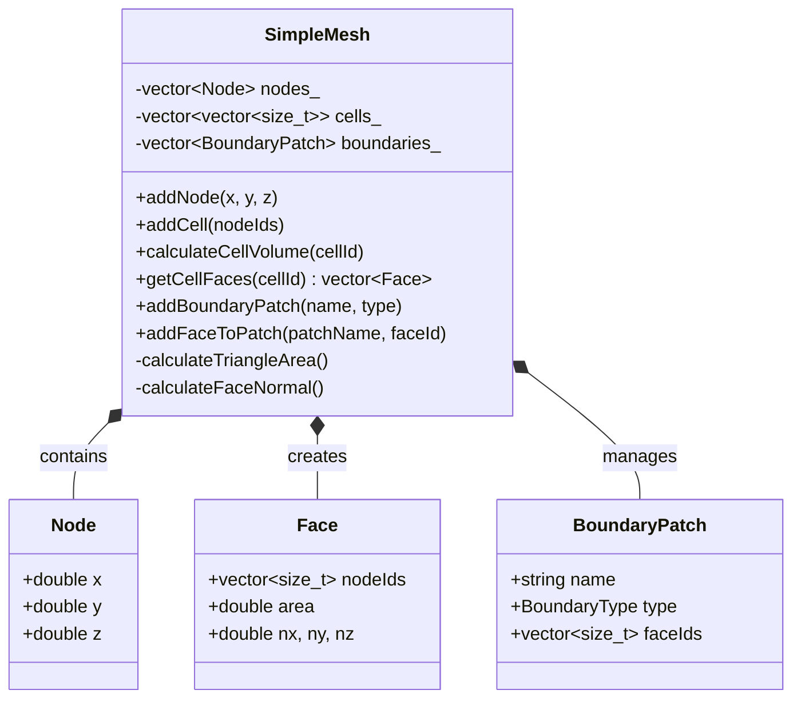
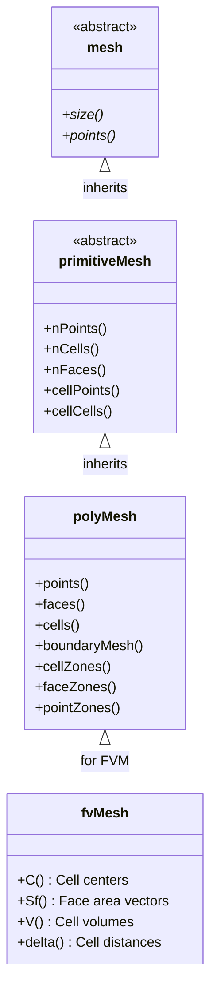
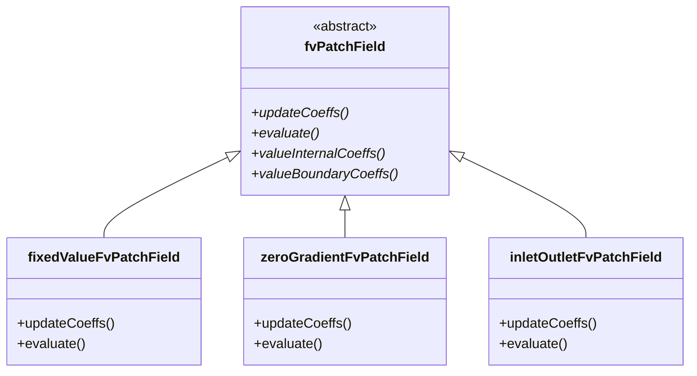
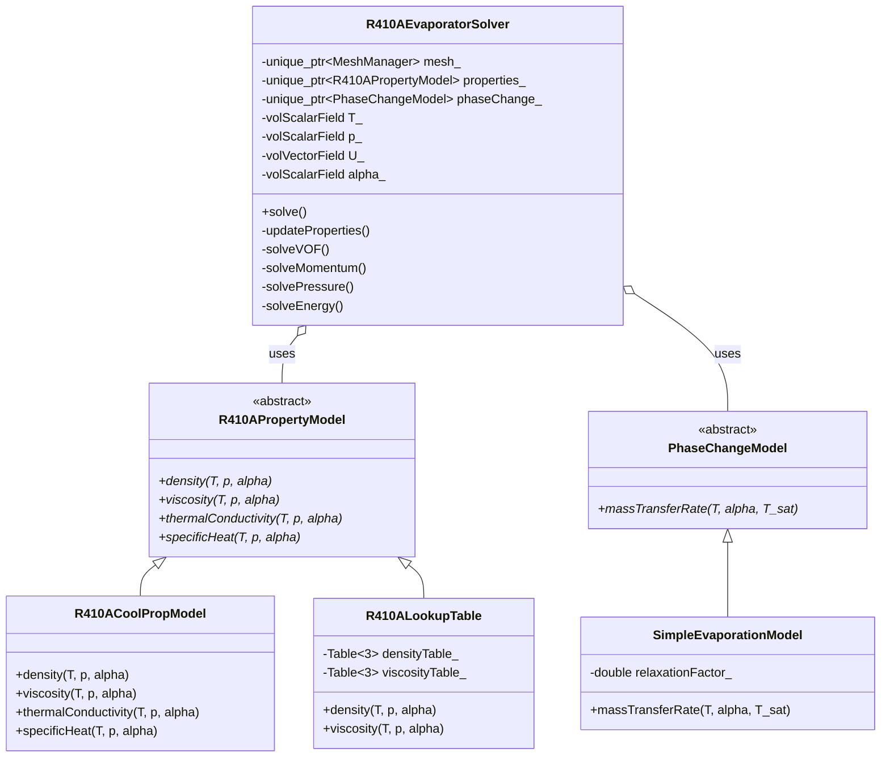

# Class Design Basics for CFD (พื้นฐานการออกแบบคลาสสำหรับ CFD)

> **[!INFO]** 📚 Learning Objective
> เข้าใจหลักการออกแบบคลาสสำหรับโปรแกรม CFD โดยเฉพาะการประยุกต์ใช้กับ OpenFOAM และการออกแบบ custom solver สำหรับ R410A

---

## 📋 Table of Contents (สารบัญ)

1. [Encapsulation in CFD](#encapsulation-in-cfd)
2. [Single Responsibility Principle](#single-responsibility-principle)
3. [Simple Mesh Class Design](#simple-mesh-class-design)
4. [OpenFOAM Class Examples](#openfoam-class-examples)
5. [R410A Evaporator Class Design](#r410a-evaporator-class-design)

---

## Encapsulation in CFD

### What is Encapsulation?

**⭐ Definition:** Bundling data (member variables) and methods (member functions) that operate on that data into a single unit (class)

**⭐ Why it's important for CFD:**
1. **Data protection:** Prevent accidental modification
2. **Interface clarity:** Clear API for users
3. **Implementation hiding:** Change internals without affecting users
4. **Modularity:** Reusable components

### Encapsulation in C++

```cpp
// ❌ BAD: No encapsulation
struct BadMesh {
    std::vector<double> x;      // Public: anyone can modify
    std::vector<double> y;
    std::vector<int> connectivity;
};

// ✅ GOOD: Proper encapsulation
class GoodMesh {
private:
    std::vector<double> x_;      // Private: protected data
    std::vector<double> y_;
    std::vector<int> connectivity_;

public:
    // Public interface
    const std::vector<double>& getX() const { return x_; }
    const std::vector<double>& getY() const { return y_; }
    size_t numNodes() const { return x_.size(); }
    size_t numCells() const { return connectivity_.size() / 4; }

private:
    // Private implementation
    void validateConnectivity();
};
```

### Access Specifiers

| Specifier | Accessible From | Use in CFD |
|-----------|-----------------|------------|
| `public` | Anyone | API for users |
| `protected` | Derived classes | Base class internals |
| `private` | Only this class | Implementation details |

**⭐ OpenFOAM example:** `openfoam_temp/src/OpenFOAM/fields/GeometricFields/GeometricField.H`

```cpp
template<class Type, class PatchField, class GeoMesh>
class GeometricField
{
private:
    // Internal data (protected)
    Field<Type> internalField_;
    PtrList<PatchField<Type>> boundaryField_;

    // Internal time data
    Field<Type> prevTimeField_;
    Field<Type> prevPrevTimeField_;

public:
    // Public interface
    const Field<Type>& internalField() const
    {
        return internalField_;
    }

    const PtrList<PatchField<Type>>& boundaryField() const
    {
        return boundaryField_;
    }

    // ... more public methods
};
```

---

## Single Responsibility Principle

### What is SRP?

**⭐ Definition:** A class should have only one reason to change (one responsibility)

**⭐ Why it's important for CFD:**
1. **Maintainability:** Easier to understand and modify
2. **Testability:** Easier to test individual components
3. **Reusability:** Can reuse classes in different contexts

### SRP Violations in CFD

**❌ BAD: Class with multiple responsibilities**

```cpp
class BadCFDSolver {
public:
    // Responsibility 1: Mesh management
    void readMesh(const std::string& filename);
    void generateMesh();

    // Responsibility 2: Field management
    void createVelocityField();
    void createPressureField();

    // Responsibility 3: Solver
    void solve();
    void solveMomentum();
    void solvePressure();

    // Responsibility 4: I/O
    void writeResults();
    void readInitialConditions();

    // Responsibility 5: Visualization
    void plotResults();
};
```

**Problems:**
- Too many reasons to change
- Hard to test mesh generation independently
- Can't reuse I/O code in other solver
- Visualization logic coupled to solver

**✅ GOOD: Separated responsibilities**

```cpp
// Responsibility 1: Mesh management
class MeshManager {
public:
    virtual void read(const std::string& filename) = 0;
    virtual void generate() = 0;
    virtual size_t numCells() const = 0;
};

// Responsibility 2: Field management
class FieldManager {
public:
    virtual void createVelocity() = 0;
    virtual void createPressure() = 0;
};

// Responsibility 3: Solver
class Solver {
public:
    virtual void solve() = 0;
    virtual void solveMomentum() = 0;
    virtual void solvePressure() = 0;
};

// Responsibility 4: I/O
class ResultWriter {
public:
    virtual void write(const FieldManager&) = 0;
};

// Responsibility 5: Orchestration
class CFDSimulation {
private:
    std::unique_ptr<MeshManager> mesh_;
    std::unique_ptr<FieldManager> fields_;
    std::unique_ptr<Solver> solver_;
    std::unique_ptr<ResultWriter> writer_;

public:
    void run() {
        mesh_->generate();
        fields_->createVelocity();
        fields_->createPressure();
        solver_->solve();
        writer_->write(*fields_);
    }
};
```

---

## Simple Mesh Class Design

### Requirements for a CFD Mesh Class

**⭐ Essential operations:**
1. Store node coordinates
2. Store cell connectivity
3. Provide access to geometric data
4. Calculate derived quantities (volumes, areas)
5. Support boundary identification

### Design Iteration 1: Basic Structure

```cpp
class SimpleMesh {
public:
    // Constructors
    SimpleMesh() = default;

    // Node management
    void addNode(double x, double y, double z);
    size_t numNodes() const;

    // Cell management
    void addCell(const std::vector<size_t>& nodeIds);
    size_t numCells() const;

    // Accessors
    double getNodeX(size_t nodeId) const;
    double getNodeY(size_t nodeId) const;
    double getNodeZ(size_t nodeId) const;
    const std::vector<size_t>& getCell(size_t cellId) const;

private:
    struct Node {
        double x, y, z;
    };

    std::vector<Node> nodes_;
    std::vector<std::vector<size_t>> cells_;
};
```

### Design Iteration 2: Adding Geometric Calculations

```cpp
class SimpleMesh {
public:
    // ... previous methods ...

    // Geometric calculations
    double calculateCellVolume(size_t cellId) const;
    double calculateCellCenter(size_t cellId, double& cx, double& cy, double& cz) const;
    std::vector<size_t> getBoundaryCells() const;

    // Face operations (for FVM)
    struct Face {
        std::vector<size_t> nodeIds;
        double area;
        double nx, ny, nz;  // Normal vector
    };

    std::vector<Face> getCellFaces(size_t cellId) const;

private:
    // Helper methods
    double calculateTriangleArea(
        double x1, double y1, double z1,
        double x2, double y2, double z2,
        double x3, double y3, double z3
    ) const;

    void calculateFaceNormal(Face& face) const;
};
```

### Design Iteration 3: Adding Boundary Information

```cpp
class SimpleMesh {
public:
    // ... previous methods ...

    // Boundary management
    enum BoundaryType {
        WALL,
        INLET,
        OUTLET,
        SYMMETRY
    };

    void addBoundaryPatch(const std::string& name, BoundaryType type);
    void addFaceToPatch(const std::string& patchName, size_t faceId);

    struct BoundaryPatch {
        std::string name;
        BoundaryType type;
        std::vector<size_t> faceIds;
    };

    const std::vector<BoundaryPatch>& getBoundaries() const;
    BoundaryType getFaceBoundaryType(size_t faceId) const;

private:
    std::vector<BoundaryPatch> boundaries_;
    std::map<size_t, size_t> faceToPatchMap_;  // faceId -> patchId
};
```

### Class Diagram



---

## OpenFOAM Class Examples

### OpenFOAM Mesh Class Hierarchy

**⭐ Verified from:** `openfoam_temp/src/OpenFOAM/meshes/polyMesh/polyMesh.H`



### Key Design Principles in OpenFOAM

#### 1. Template-Based Design

**⭐ Example:** `GeometricField<Type, PatchField, GeoMesh>`

```cpp
// Template allows any field type
GeometricField<scalar, ...>  p;      // Pressure field
GeometricField<vector, ...>  U;      // Velocity field
GeometricField<symmTensor, ...> tau; // Stress tensor field

// Same code works for all types
template<class Type>
void printField(const GeometricField<Type, ...>& field) {
    Info << field.name() << ": " << field.average() << endl;
}
```

#### 2. Smart Pointer Management

**⭐ Verified from:** `openfoam_temp/src/OpenFOAM/memory/autoPtr.H`

```cpp
// Automatic memory management
autoPtr<incompressible::RASModel> turbulence
(
    incompressible::RASModel::New(U, phi, laminarTransport)
);

// Use like pointer
turbulence->correct();

// Automatic cleanup when out of scope
// No need to call delete!
```

#### 3. Runtime Selection

**⭐ Verified from:** `openfoam_temp/src/OpenFOAM/db/runTimeSelection/runTimeSelectionTables.H`

```cpp
// Base class declares runtime table
class RASModel {
    declareRunTimeSelectionTable
    (
        autoPtr,
        RASModel,
        dictionary,
        (
            const volVectorField& U,
            const surfaceScalarField& phi,
            const transportModel& transport
        ),
        (U, phi, transport)
    );
};

// Derived class adds itself to table
class kEpsilon : public RASModel {
    TypeName("kEpsilon");  // Register name

    // Constructor registered to runtime table
    kEpsilon(const volVectorField& U, ...);
};

// User selects in dictionary
// RASModel kEpsilon;  // Creates kEpsilon instance
```

#### 4. Boundary Condition Polymorphism

**⭐ Verified from:** `openfoam_temp/src/finiteVolume/fields/fvPatchFields/`



---

## R410A Evaporator Class Design

### Requirements for R410A Simulation

**⭐ Specific needs:**
1. Temperature-dependent properties
2. Two-phase flow (VOF)
3. Phase change model
4. Property lookup tables
5. CoolProp integration

### Class Design

```cpp
// === Property Model ===

class R410APropertyModel {
public:
    virtual ~R410APropertyModel() = default;

    // Pure virtual: must be implemented by derived classes
    virtual double density(double T, double p, double alpha) const = 0;
    virtual double viscosity(double T, double p, double alpha) const = 0;
    virtual double thermalConductivity(double T, double p, double alpha) const = 0;
    virtual double specificHeat(double T, double p, double alpha) const = 0;
};

// CoolProp-based implementation
class R410ACoolPropModel : public R410APropertyModel {
public:
    double density(double T, double p, double alpha) const override {
        double rho_l = CoolProp::PropsSI("D", "T", T, "P", p, "R410A");
        double rho_v = ...;  // Vapor density
        return alpha * rho_l + (1.0 - alpha) * rho_v;
    }

    // ... other properties
};

// Lookup table implementation (faster)
class R410ALookupTable : public R410APropertyModel {
private:
    Table<3> densityTable_;     // T, p, alpha → density
    Table<3> viscosityTable_;
    Table<3> conductivityTable_;
    Table<3> specificHeatTable_;

public:
    double density(double T, double p, double alpha) const override {
        return densityTable_.lookup(T, p, alpha);
    }
};

// === Phase Change Model ===

class PhaseChangeModel {
public:
    virtual ~PhaseChangeModel() = default;

    // Mass transfer rate (kg/m³/s)
    virtual double massTransferRate(
        const volScalarField& T,
        const volScalarField& alpha,
        double T_sat
    ) const = 0;
};

class SimpleEvaporationModel : public PhaseChangeModel {
private:
    double relaxationFactor_;  // λ

public:
    SimpleEvaporationModel(double lambda) : relaxationFactor_(lambda) {}

    double massTransferRate(
        const volScalarField& T,
        const volScalarField& alpha,
        double T_sat
    ) const override {
        // Simple model: ṁ = λ·max(T - T_sat, 0)·α
        return relaxationFactor_ * max(T - T_sat, 0.0) * alpha;
    }
};

// === R410A Evaporator Solver ===

class R410AEvaporatorSolver {
private:
    // Core components
    std::unique_ptr<MeshManager> mesh_;
    std::unique_ptr<R410APropertyModel> properties_;
    std::unique_ptr<PhaseChangeModel> phaseChange_;

    // Fields
    volScalarField T_;
    volScalarField p_;
    volVectorField U_;
    volScalarField alpha_;  // Liquid volume fraction

public:
    // Constructor with dependency injection
    R410AEvaporatorSolver(
        std::unique_ptr<MeshManager> mesh,
        std::unique_ptr<R410APropertyModel> props,
        std::unique_ptr<PhaseChangeModel> pc
    ) : mesh_(std::move(mesh)),
        properties_(std::move(props)),
        phaseChange_(std::move(pc)) {}

    // Main solve loop
    void solve() {
        // Update properties (T-dependent)
        updateProperties();

        // VOF equation with phase change
        solveVOF();

        // Momentum equation
        solveMomentum();

        // Pressure equation
        solvePressure();

        // Energy equation with latent heat
        solveEnergy();
    }

private:
    void updateProperties() {
        // Update all fields with new T, p, alpha
        // ...
    }

    void solveVOF() {
        // ∂α/∂t + ∇·(αU) = ṁ/ρₗ
        // ...
    }

    void solveMomentum() {
        // ρ(∂U/∂t + ∇·(UU)) = -∇p + ∇·(μ(∇U + ∇Uᵀ)) + ρg
        // ...
    }

    void solvePressure() {
        // Pressure Poisson equation
        // ...
    }

    void solveEnergy() {
        // ρcₚ(∂T/∂t + ∇·(UT)) = ∇·(k∇T) - ṁ·L
        // ...
    }
};
```

### Class Diagram for R410A Solver



---

## 📚 Summary (สรุป)

### Design Principles

1. **⭐ Encapsulation:** Hide implementation, expose interface
2. **⭐ Single Responsibility:** One class, one reason to change
3. **⭐ Open/Closed:** Open for extension, closed for modification
4. **⭐ Dependency Injection:** Pass dependencies, don't create internally
5. **⭐ Polymorphism:** Use base classes and virtual functions

### CFD-Specific Considerations

1. **⭐ Mesh classes:** Separate topology and geometry
2. **⭐ Field classes:** Template-based for type flexibility
3. **⭐ Solver classes:** Compose from mesh, fields, and models
4. **⭐ Property models:** Abstract interface, multiple implementations
5. **⭐ Boundary conditions:** Polymorphic hierarchy

### R410A Design

1. **⭐ Property model:** Abstract interface → CoolProp or lookup tables
2. **⭐ Phase change model:** Pluggable evaporation/condensation models
3. **⭐ Solver composition:** Inject dependencies for flexibility
4. **⭐ Two-phase fields:** Add α (phase fraction) to standard fields

---

## 🔍 References (อ้างอิง)

| Concept | File Location | Lines |
|---------|---------------|-------|
| GeometricField | `src/OpenFOAM/fields/GeometricFields/GeometricField.H` | 50-200 |
| polyMesh | `src/OpenFOAM/meshes/polyMesh/polyMesh.H` | 100-300 |
| fvPatchField | `src/finiteVolume/fields/fvPatchFields/fvPatchField.H` | 50-150 |
| autoPtr | `src/OpenFOAM/memory/autoPtr.H` | 40-120 |
| Runtime selection | `src/OpenFOAM/db/runTimeSelection/` | - |

---

*Last Updated: 2026-01-28*
