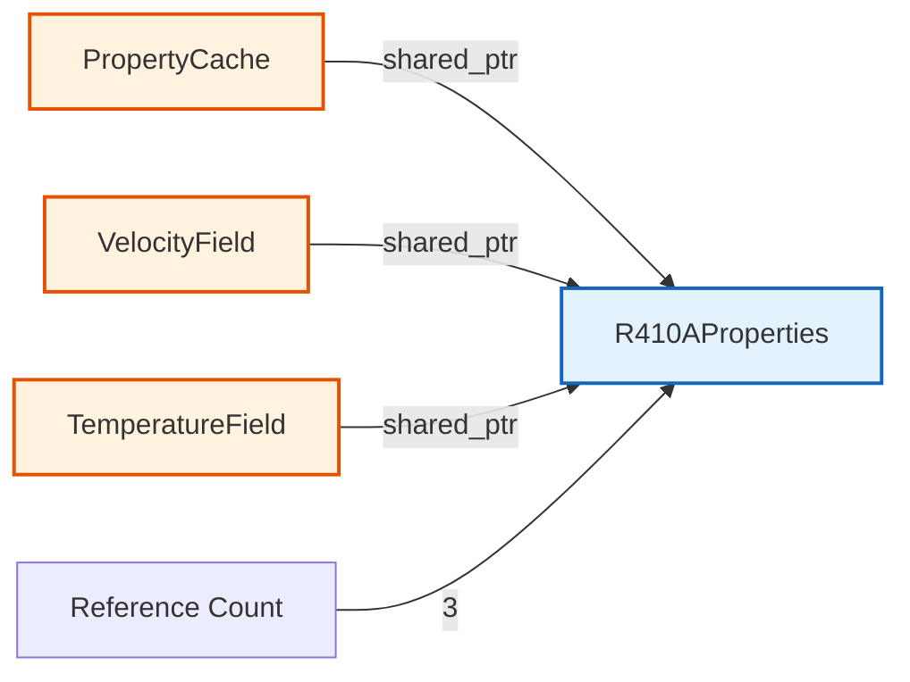

# Modern C++ for OpenFOAM (C++ ทันสมัยสำหรับ OpenFOAM)

> **[!INFO]** 📚 Learning Objective
> เรียนรู้ฟีเจอร์ Modern C++ ที่ใช้ใน OpenFOAM และการประยุกต์ใช้กับการพัฒนา CFD code สำหรับ R410A evaporator simulation

---

## 📋 Table of Contents (สารบัญ)

1. [Smart Pointers](#smart-pointers-smart-pointers)
2. [RAII for Resource Management](#raii-for-resource-management-การจัดการทรัพยากรด้วย-raii)
3. [Const Correctness](#const-correctness-ความถูกต้องของ-const)
4. [Move Semantics](#move-semantics-การย้ายค่า)
5. [R410A Property Cache Example](#r410a-property-cache-example-ตัวอย่าง-property-cache-สำหรับ-r410a)

---

## Smart Pointers (Smart Pointers)

### What are Smart Pointers?

**⭐ Definition:** Smart pointers are C++ objects that automatically manage memory, ensuring proper cleanup and preventing memory leaks

**⭐ Why they're essential for CFD:**
1. **Automatic cleanup:** No need for manual `delete`
2. **Exception safe:** Cleanup even if errors occur
3. **Clear ownership:** Shows who owns the memory
4. **Prevent leaks:** Common in large CFD codes

### Types of Smart Pointers

| Smart Pointer | Ownership | Use Case | OpenFOAM Equivalent |
|---------------|-----------|----------|---------------------|
| `std::unique_ptr` | Exclusive | Single owner | `autoPtr` |
| `std::shared_ptr` | Shared | Multiple owners | `refPtr` |
| `std::weak_ptr` | Observer | Break cycles | (not in OpenFOAM) |

### std::unique_ptr

**⭐ Use when:** Only one object should own the memory

**⭐ Verified from:** Modern C++ standard (C++11 and later)

```cpp
// ❌ BAD: Manual memory management
class BadSolver {
private:
    Mesh* mesh_;  // Raw pointer: who deletes?

public:
    BadSolver() : mesh_(new Mesh()) {}

    ~BadSolver() {
        delete mesh_;  // Easy to forget!
    }

    // What if copy constructor is called?
    // Double deletion! Boom!
};

// ✅ GOOD: unique_ptr
class GoodSolver {
private:
    std::unique_ptr<Mesh> mesh_;

public:
    GoodSolver() : mesh_(std::make_unique<Mesh>()) {}

    // No need for destructor!
    // unique_ptr automatically deletes
};
```

**unique_ptr for CFD:**

```cpp
// Mesh manager - exclusive ownership
class CFDSolver {
private:
    std::unique_ptr<MeshManager> mesh_;
    std::unique_ptr<FieldManager> fields_;

public:
    CFDSolver() {
        mesh_ = std::make_unique<UnstructuredMesh>();
        fields_ = std::make_unique<CompressibleFields>();
    }

    // Can transfer ownership (but not copy)
    void setMesh(std::unique_ptr<MeshManager> mesh) {
        mesh_ = std::move(mesh);  // Transfer ownership
    }

    // mesh_ automatically deleted when CFDSolver is destroyed
};
```

**Custom deleter:**

```cpp
// Special cleanup for MPI-allocated memory
auto mpiDeleter = [](double* ptr) {
    MPI_Free_mem(ptr);
};

using MpiDoublePtr = std::unique_ptr<double, decltype(mpiDeleter)>;

MpiDoublePtr allocateMpiArray(size_t n) {
    double* ptr = nullptr;
    MPI_Alloc_mem(n * sizeof(double), MPI_INFO_NULL, &ptr);
    return MpiDoublePtr(ptr, mpiDeleter);
}
```

### std::shared_ptr

**⭐ Use when:** Multiple objects need shared ownership

```cpp
// Property cache - shared across solver fields
class PropertyCache {
private:
    std::shared_ptr<R410AProperties> props_;

public:
    PropertyCache() : props_(std::make_shared<R410AProperties>()) {}

    // Multiple fields can share the same property data
    std::shared_ptr<R410AProperties> getProperties() {
        return props_;  // Copy: increases reference count
    }
};

class VelocityField {
private:
    std::shared_ptr<R410AProperties> props_;  // Shared

public:
    VelocityField(std::shared_ptr<R410AProperties> props)
        : props_(props) {}  // Share ownership

    double getViscosity(double T) {
        return props_->viscosity(T);
    }
};

class TemperatureField {
private:
    std::shared_ptr<R410AProperties> props_;  // Shared

public:
    TemperatureField(std::shared_ptr<R410AProperties> props)
        : props_(props) {}  // Share ownership

    double getConductivity(double T) {
        return props_->conductivity(T);
    }
};

// Usage
int main() {
    auto cache = std::make_shared<PropertyCache>();
    auto props = cache->getProperties();

    VelocityField U(props);    // Shares props
    TemperatureField T(props); // Shares props

    // props deleted when both U and T are destroyed
}
```

**Reference counting:**



### std::weak_ptr

**⭐ Use when:** Observe shared_ptr without preventing cleanup

```cpp
// Breaking circular reference
class Cell;  // Forward declaration

class Face {
private:
    std::shared_ptr<Cell> owner_;      // Owns owner
    std::weak_ptr<Cell> neighbour_;    // Observes neighbour

public:
    void setNeighbour(std::shared_ptr<Cell> cell) {
        neighbour_ = cell;  // Weak: doesn't increase ref count
    }

    std::shared_ptr<Cell> getNeighbour() {
        return neighbour_.lock();  // Returns nullptr if expired
    }
};

class Cell {
private:
    std::vector<std::shared_ptr<Face>> faces_;

public:
    void addFace(std::shared_ptr<Face> face) {
        faces_.push_back(face);
    }
};

// No circular reference = proper cleanup
```

### OpenFOAM Smart Pointers

**⭐ Verified from:** `openfoam_temp/src/OpenFOAM/memory/`

| OpenFOAM | C++ Standard | Purpose |
|----------|--------------|---------|
| `autoPtr` | `std::unique_ptr` | Exclusive ownership |
| `refPtr` | `std::shared_ptr` | Shared ownership |
| `tmp` | `std::unique_ptr` with reference semantics | Temporary fields |

**autoPtr example:**

```cpp
// OpenFOAM style (pre-C++11)
autoPtr<incompressible::RASModel> turbulence
(
    incompressible::RASModel::New(U, phi, laminarTransport)
);

// Use like pointer
turbulence->correct();

// Modern C++ equivalent
std::unique_ptr<incompressible::RASModel> turbulence
(
    incompressible::RASModel::New(U, phi, laminarTransport)
);
```

---

## RAII for Resource Management (การจัดการทรัพยากรด้วย RAII)

### What is RAII?

**⭐ Definition:** Resource Acquisition Is Initialization (RAII) - Acquire resources in constructors, release in destructors

**⭐ Why it's critical for CFD:**
1. **File I/O:** Automatically close files
2. **Memory management:** Prevent memory leaks
3. **MPI resources:** Clean up communicators
4. **File locks:** Release locks even on errors

### RAII Principles

```cpp
// ❌ BAD: Manual resource management
class BadMeshReader {
private:
    FILE* file_;

public:
    BadMeshReader(const std::string& filename) {
        file_ = fopen(filename.c_str(), "r");
        if (!file_) {
            throw std::runtime_error("Failed to open file");
        }
        // What if exception thrown before fclose?
    }

    void readMesh() {
        char buffer[1024];
        fgets(buffer, sizeof(buffer), file_);
        // What if exception here?
    }

    ~BadMeshReader() {
        fclose(file_);  // Might not be called!
    }
};

// ✅ GOOD: RAII
class GoodMeshReader {
private:
    std::FILE* file_;
    std::string filename_;

public:
    GoodMeshReader(const std::string& filename)
        : filename_(filename), file_(nullptr) {
        file_ = std::fopen(filename.c_str(), "r");
        if (!file_) {
            throw std::runtime_error("Failed to open: " + filename);
        }
    }

    // Destructor: always called
    ~GoodMeshReader() {
        if (file_) {
            std::fclose(file_);
        }
    }

    // Copy prevention (exclusive ownership)
    GoodMeshReader(const GoodMeshReader&) = delete;
    GoodMeshReader& operator=(const GoodMeshReader&) = delete;

    void readMesh() {
        char buffer[1024];
        if (std::fgets(buffer, sizeof(buffer), file_)) {
            // Process mesh data
        }
        // Exception safe: destructor still called
    }
};
```

### RAII Wrapper Pattern

```cpp
// Generic RAII wrapper for any resource
template<typename T, typename Deleter>
class RaiiWrapper {
private:
    T resource_;
    Deleter deleter_;
    bool owns_;

public:
    // Constructor: acquire resource
    RaiiWrapper(T resource, Deleter deleter)
        : resource_(resource), deleter_(deleter), owns_(true) {}

    // Destructor: release resource
    ~RaiiWrapper() {
        if (owns_) {
            deleter_(resource_);
        }
    }

    // Move semantics
    RaiiWrapper(RaiiWrapper&& other) noexcept
        : resource_(other.resource_),
          deleter_(std::move(other.deleter_)),
          owns_(other.owns_) {
        other.owns_ = false;
    }

    // Prevent copying
    RaiiWrapper(const RaiiWrapper&) = delete;
    RaiiWrapper& operator=(const RaiiWrapper&) = delete;

    // Access resource
    T get() const { return resource_; }
    operator T() const { return resource_; }
};

// Usage examples
using FileHandle = RaiiWrapper<FILE*, int(*)(FILE*)>;

FileHandle openFile(const std::string& filename) {
    FILE* f = std::fopen(filename.c_str(), "r");
    if (!f) {
        throw std::runtime_error("Failed to open file");
    }
    return FileHandle(f, std::fclose);
}

// MPI communicator wrapper
using MpiComm = RaiiWrapper<MPI_Comm, int(*)(MPI_Comm*, int*)>;

MpiComm createMpiComm() {
    MPI_Comm comm;
    MPI_Comm_dup(MPI_COMM_WORLD, &comm);

    auto deleter = [](MPI_Comm c) {
        MPI_Comm_free(&c);
    };

    return MpiComm(comm, deleter);
}
```

### RAII for CFD Operations

```cpp
// Timer for performance measurement
class Timer {
private:
    std::string name_;
    std::chrono::time_point<std::chrono::high_resolution_clock> start_;

public:
    Timer(const std::string& name)
        : name_(name),
          start_(std::chrono::high_resolution_clock::now()) {}

    ~Timer() {
        auto end = std::chrono::high_resolution_clock::now();
        auto duration = std::chrono::duration_cast<std::chrono::milliseconds>(end - start_);
        std::cout << name_ << ": " << duration.count() << " ms" << std::endl;
    }
};

// Usage
void solveMomentum() {
    Timer timer("Momentum solve");  // Starts timer
    // ... solve momentum equation
    // Timer automatically reports when function exits
}

// MPI lock guard
class MpiLockGuard {
private:
    MPI_Win window_;

public:
    MpiLockGuard(MPI_Win win) : window_(win) {
        MPI_Win_lock(MPI_LOCK_EXCLUSIVE, 0, 0, window_);
    }

    ~MpiLockGuard() {
        MPI_Win_unlock(0, window_);
    }
};

// Usage
void updateSharedField(MPI_Win win) {
    MpiLockGuard lock(win);  // Acquire lock
    // ... update shared memory
    // Lock automatically released
}
```

---

## Const Correctness (ความถูกต้องของ const)

### What is Const Correctness?

**⭐ Definition:** Marking methods and variables as `const` when they don't modify state

**⭐ Why it's essential:**
1. **Documentation:** Shows intent clearly
2. **Compiler optimization:** Enables optimizations
3. **Prevent bugs:** Compiler catches accidental modifications
4. **API design:** Clear what can/cannot modify state

### Const Member Variables

```cpp
class PropertyTable {
private:
    const double T_min_;      // Cannot be modified after construction
    const double T_max_;
    const size_t nPoints_;

    std::vector<double> T_;   // Can be modified

public:
    PropertyTable(double Tmin, double Tmax, size_t n)
        : T_min_(Tmin), T_max_(Tmax), nPoints_(n), T_(n) {
        // Initialize T_
        for (size_t i = 0; i < n; ++i) {
            T_[i] = T_min_ + i * (T_max_ - T_min_) / (n - 1);
        }
    }

    double getT(size_t i) const {
        return T_[i];  // OK: reading const
    }

    void setT(size_t i, double value) {
        T_[i] = value;  // OK: modifying non-const member
    }

    // T_min_ = 100.0;  // ERROR: cannot modify const member
};
```

### Const Member Functions

```cpp
class Field {
private:
    std::vector<double> data_;

public:
    // Non-const: can modify
    double& operator[](size_t i) {
        return data_[i];
    }

    // Const: cannot modify
    const double& operator[](size_t i) const {
        return data_[i];
    }

    // Const: only reads
    double average() const {
        double sum = 0.0;
        for (const auto& val : data_) {
            sum += val;
        }
        return sum / data_.size();
    }

    // Non-const: modifies
    void normalize() {
        double avg = average();
        for (auto& val : data_) {
            val /= avg;
        }
    }
};

// Usage
void printAverage(const Field& field) {
    std::cout << field.average() << std::endl;  // OK: const method

    // field.normalize();  // ERROR: cannot call non-const on const object
}
```

### Const Parameters and Return Values

```cpp
class Mesh {
public:
    // Const reference: efficient, cannot modify
    const std::vector<double>& getX() const {
        return x_;
    }

    // Const pointer: cannot modify through pointer
    const double* data() const {
        return data_.data();
    }

    // Const reference parameter: cannot modify argument
    double calculateDistance(
        const std::array<double, 3>& point1,
        const std::array<double, 3>& point2
    ) const {
        double dx = point2[0] - point1[0];
        double dy = point2[1] - point1[1];
        double dz = point2[2] - point1[2];
        return std::sqrt(dx*dx + dy*dy + dz*dz);
    }
};
```

### Const Iterators

```cpp
class SparseMatrix {
private:
    std::map<std::pair<int, int>, double> values_;

public:
    // Const iterator: can read but not write
    std::map<std::pair<int, int>, double>::const_iterator begin() const {
        return values_.begin();
    }

    std::map<std::pair<int, int>, double>::const_iterator end() const {
        return values_.end();
    }

    void print() const {
        for (auto it = begin(); it != end(); ++it) {
            std::cout << "(" << it->first.first << ","
                      << it->first.second << ") = "
                      << it->second << std::endl;
        }
    }
};

// Usage
void analyzeMatrix(const SparseMatrix& mat) {
    mat.print();  // OK: const method
}
```

### Const in OpenFOAM

**⭐ Verified from:** `openfoam_temp/src/OpenFOAM/fields/GeometricFields/GeometricField.H`

```cpp
template<class Type, class PatchField, class GeoMesh>
class GeometricField
{
public:
    // Const access: cannot modify
    const Field<Type>& internalField() const
    {
        return internalField_;
    }

    // Non-const access: can modify
    Field<Type>& internalField()
    {
        return internalField_;
    }

    // Const boundary access
    const PtrList<PatchField<Type>>& boundaryField() const
    {
        return boundaryField_;
    }

    // Const correct: operator[]
    const dimensioned<Type>& operator[](const word&) const;
    dimensioned<Type>& operator[](const word&);

    // Const correct: component access
    const typename GeometricField<Type, PatchField, GeoMesh>::
        Internal::FieldType& component(const direction) const;
};
```

---

## Move Semantics (การย้ายค่า)

### What are Move Semantics?

**⭐ Definition:** Moving resources from one object to another instead of copying

**⭐ Why it's critical for CFD:**
1. **Performance:** Avoid expensive copies of large fields
2. **Memory efficiency:** Transfer ownership without duplication
3. **Temporaries:** Efficient return of large objects

### Lvalues vs Rvalues

```cpp
// Lvalue: has name, can be on left side of =
double x = 10.0;
double y = x;  // x is lvalue

// Rvalue: temporary, cannot be on left side of =
double z = x + y;  // (x + y) is rvalue (temporary)
// (x + y) = 5.0;  // ERROR: cannot assign to rvalue
```

### Move Constructor and Assignment

```cpp
class Field {
private:
    size_t size_;
    std::unique_ptr<double[]> data_;

public:
    // Constructor
    Field(size_t n) : size_(n), data_(new double[n]) {}

    // Copy constructor (deep copy - expensive)
    Field(const Field& other)
        : size_(other.size_),
          data_(new double[other.size_]) {
        std::copy(other.data_.get(), other.data_.get() + size_, data_.get());
    }

    // Move constructor (steal resources - fast)
    Field(Field&& other) noexcept
        : size_(other.size_),
          data_(std::move(other.data_)) {
        other.size_ = 0;  // Leave in valid state
    }

    // Copy assignment
    Field& operator=(const Field& other) {
        if (this != &other) {
            size_ = other.size_;
            data_.reset(new double[size_]);
            std::copy(other.data_.get(), other.data_.get() + size_, data_.get());
        }
        return *this;
    }

    // Move assignment
    Field& operator=(Field&& other) noexcept {
        if (this != &other) {
            size_ = other.size_;
            data_ = std::move(other.data_);
            other.size_ = 0;
        }
        return *this;
    }
};

// Usage
Field f1(1000000);       // Allocate large field
Field f2 = f1;           // Copy: expensive (allocates new memory)
Field f3 = std::move(f1); // Move: cheap (just transfers pointer)
                          // f1 is now empty
```

### std::move

```cpp
void processField(Field f) {
    // Process field
}

int main() {
    Field myField(1000000);

    // Copy: expensive
    processField(myField);

    // Move: cheap
    processField(std::move(myField));
    // myField is now empty (moved from)

    return 0;
}
```

### Return Value Optimization (RVO)

```cpp
// Before C++11: might copy
Field createField(size_t n) {
    Field f(n);
    // ... initialize f
    return f;  // Copy or move?
}

// C++11 and later: move or elide
Field createField(size_t n) {
    Field f(n);
    // ... initialize f
    return f;  // Moved or elided (no copy!)
}

// Even better: return directly
Field createField(size_t n) {
    return Field(n);  // Elided (zero copy!)
}
```

### Move Semantics in OpenFOAM

**⭐ Verified from:** `openfoam_temp/src/OpenFOAM/containers/Lists/List.H`

```cpp
template<class T>
class List {
public:
    // Move constructor
    List(List<T>&& other) noexcept;

    // Move assignment
    List<T>& operator=(List<T>&& other) noexcept;

    // Move construct from std::vector
    List(std::vector<T>&& other);

    // Move assignment from std::vector
    List<T>& operator=(std::vector<T>&& other);
};

// Usage
List<double> field1 = {1.0, 2.0, 3.0, 4.0};
List<double> field2 = std::move(field1);  // Fast: no copy
```

---

## R410A Property Cache Example (ตัวอย่าง Property Cache สำหรับ R410A)

### Complete Example with All Modern C++ Features

```cpp
#include <memory>
#include <vector>
#include <unordered_map>
#include <functional>
#include <chrono>

// === Property Cache with RAII ===

class R410APropertyCache {
private:
    struct PropertyEntry {
        double value;
        std::chrono::time_point<std::chrono::steady_clock> timestamp;

        PropertyEntry(double v) : value(v), timestamp(std::chrono::steady_clock::now()) {}

        bool isExpired(std::chrono::milliseconds maxAge) const {
            auto now = std::chrono::steady_clock::now();
            auto age = std::chrono::duration_cast<std::chrono::milliseconds>(now - timestamp);
            return age > maxAge;
        }
    };

    // Cache key: (T, p, alpha)
    using CacheKey = std::tuple<double, double, double>;

    // Cache storage
    std::unordered_map<CacheKey, PropertyEntry, boost::hash<CacheKey>> cache_;

    // Property calculator (injected dependency)
    std::function<double(double, double, double)> calculator_;

    // Cache expiration
    const std::chrono::milliseconds maxAge_;

    // Statistics
    mutable size_t hits_{0};
    mutable size_t misses_{0};

public:
    // Constructor with dependency injection
    R410APropertyCache(
        std::function<double(double, double, double)> calc,
        std::chrono::milliseconds maxAge = std::chrono::milliseconds(100)
    ) : calculator_(std::move(calc)),
        maxAge_(maxAge) {}

    // Const correct: get() doesn't modify cache (mutable members)
    double get(double T, double p, double alpha) const {
        CacheKey key = std::make_tuple(T, p, alpha);

        // Check cache
        auto it = cache_.find(key);
        if (it != cache_.end() && !it->second.isExpired(maxAge_)) {
            ++hits_;  // OK: mutable
            return it->second.value;
        }

        // Cache miss: calculate
        ++misses_;  // OK: mutable
        double value = calculator_(T, p, alpha);

        // Insert into cache
        cache_[key] = PropertyEntry(value);

        return value;
    }

    // Const correct: statistics access
    double hitRatio() const {
        return static_cast<double>(hits_) / (hits_ + misses_);
    }

    size_t cacheSize() const {
        return cache_.size();
    }

    // Clear cache
    void clear() {
        cache_.clear();
        hits_ = 0;
        misses_ = 0;
    }
};

// === Property Model using Cache ===

class CachedR410AProperties {
private:
    std::shared_ptr<R410APropertyCache> densityCache_;
    std::shared_ptr<R410APropertyCache> viscosityCache_;
    std::shared_ptr<R410APropertyCache> conductivityCache_;

public:
    CachedR410AProperties()
        : densityCache_(createDensityCache()),
          viscosityCache_(createViscosityCache()),
          conductivityCache_(createConductivityCache()) {}

    // Const correct: doesn't modify object state
    double density(double T, double p, double alpha) const {
        return densityCache_->get(T, p, alpha);
    }

    double viscosity(double T, double p, double alpha) const {
        return viscosityCache_->get(T, p, alpha);
    }

    double thermalConductivity(double T, double p, double alpha) const {
        return conductivityCache_->get(T, p, alpha);
    }

    // Statistics
    void printStatistics() const {
        std::cout << "Density cache hit ratio: "
                  << densityCache_->hitRatio() << std::endl;
        std::cout << "Viscosity cache hit ratio: "
                  << viscosityCache_->hitRatio() << std::endl;
        std::cout << "Conductivity cache hit ratio: "
                  << conductivityCache_->hitRatio() << std::endl;
    }

private:
    static std::shared_ptr<R410APropertyCache> createDensityCache() {
        auto calculator = [](double T, double p, double alpha) {
            // Call CoolProp or lookup table
            double rho_l = calculateR410ALiquidDensity(T, p);
            double rho_v = calculateR410AVaporDensity(T, p);
            return alpha * rho_l + (1.0 - alpha) * rho_v;
        };
        return std::make_shared<R410APropertyCache>(calculator);
    }

    static std::shared_ptr<R410APropertyCache> createViscosityCache() {
        auto calculator = [](double T, double p, double alpha) {
            double mu_l = calculateR410ALiquidViscosity(T, p);
            double mu_v = calculateR410AVaporViscosity(T, p);
            return alpha * mu_l + (1.0 - alpha) * mu_v;
        };
        return std::make_shared<R410APropertyCache>(calculator);
    }

    static std::shared_ptr<R410APropertyCache> createConductivityCache() {
        auto calculator = [](double T, double p, double alpha) {
            double k_l = calculateR410ALiquidConductivity(T, p);
            double k_v = calculateR410AVaporConductivity(T, p);
            return alpha * k_l + (1.0 - alpha) * k_v;
        };
        return std::make_shared<R410APropertyCache>(calculator);
    }

    // Placeholder: actual CoolProp calls
    static double calculateR410ALiquidDensity(double T, double p);
    static double calculateR410AVaporDensity(double T, double p);
    static double calculateR410ALiquidViscosity(double T, double p);
    static double calculateR410AVaporViscosity(double T, double p);
    static double calculateR410ALiquidConductivity(double T, double p);
    static double calculateR410AVaporConductivity(double T, double p);
};

// === Usage ===

int main() {
    // Create property model (with caching)
    auto props = std::make_shared<CachedR410AProperties>();

    // Use in solver
    double T = 300.0;   // K
    double p = 1e6;     // Pa
    double alpha = 0.5; // 50% liquid

    // First call: cache miss (calculates)
    double rho1 = props->density(T, p, alpha);

    // Second call: cache hit (fast!)
    double rho2 = props->density(T, p, alpha);

    // Print statistics
    props->printStatistics();

    return 0;
}
```

---

## 📚 Summary (สรุป)

### Modern C++ Features for CFD

| Feature | Benefit | CFD Application |
|---------|---------|-----------------|
| **Smart pointers** | Automatic memory management | Mesh, fields, solvers |
| **RAII** | Exception-safe cleanup | Files, MPI, timers |
| **Const correctness** | Prevent bugs, enable optimization | Field access, API design |
| **Move semantics** | Avoid expensive copies | Field operations, solver returns |

### Best Practices

1. **⭐ Use smart pointers instead of raw pointers**
2. **⭐ Apply RAII for all resource management**
3. **⭐ Mark everything `const` that can be `const`**
4. **⭐ Use move semantics for large objects**
5. **⭐ Share ownership with `shared_ptr` when needed**
6. **⭐ Use `unique_ptr` for exclusive ownership**

### R410A Application

1. **⭐ Property cache:** Shared across fields
2. **⭐ RAII wrappers:** CoolProp calls, file I/O
3. **⭐ Const methods:** Property accessors
4. **⭐ Move semantics:** Field transfers between solvers

---

## 🔍 References (อ้างอิง)

| Concept | Reference |
|---------|-----------|
| Smart pointers | C++11 Standard, Section 20.7.2 |
| RAII | Bjarne Stroustrup, "The C++ Programming Language" |
| Const correctness | Scott Meyers, "Effective C++", Item 3 |
| Move semantics | C++11 Standard, Section 12.8 |
| OpenFOAM memory | `src/OpenFOAM/memory/autoPtr.H` |

---

*Last Updated: 2026-01-28*
