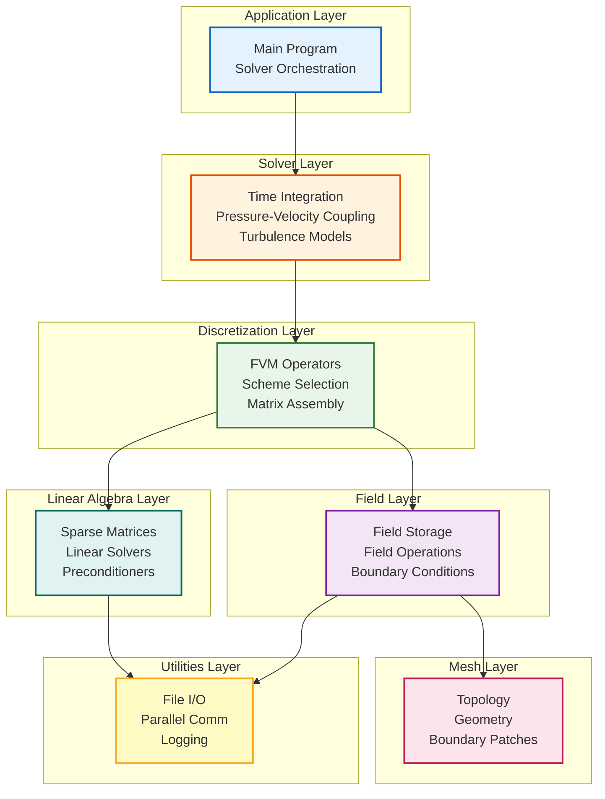
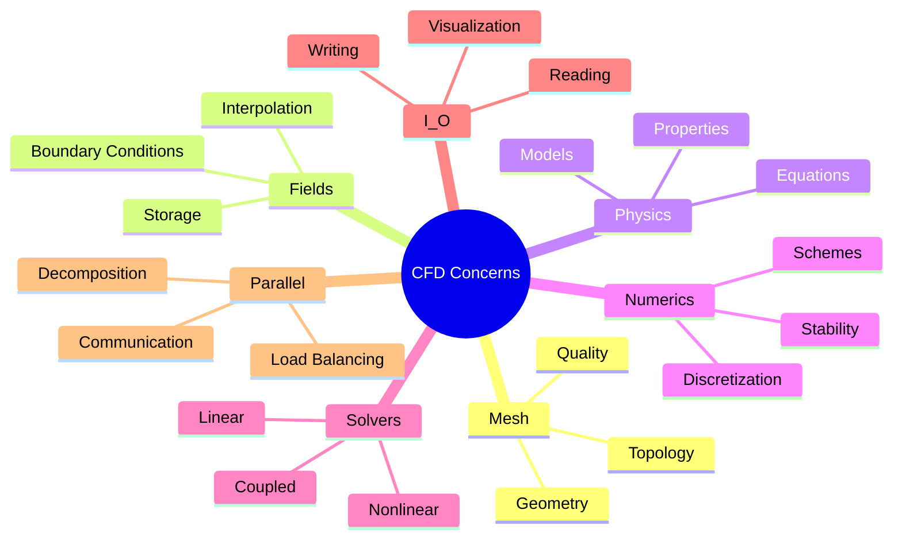
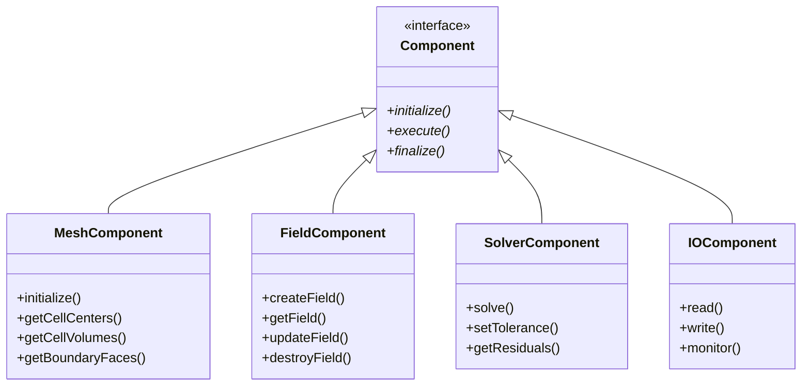
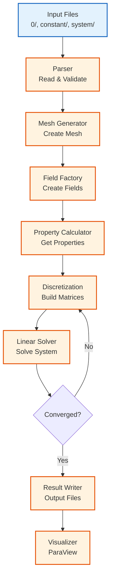
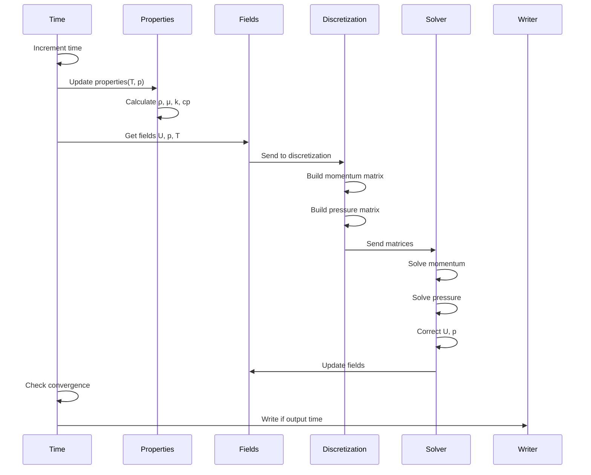
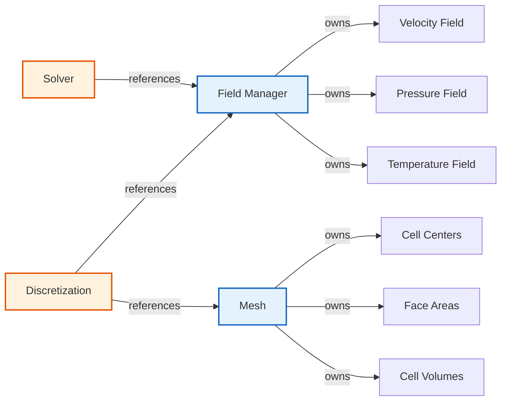
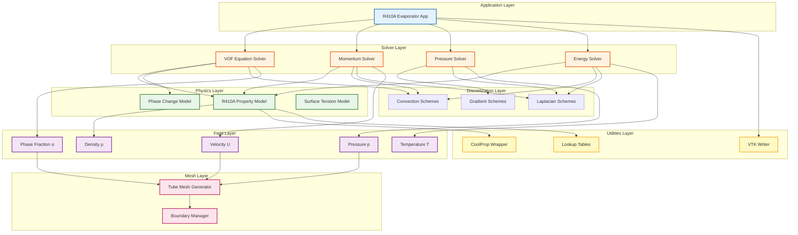
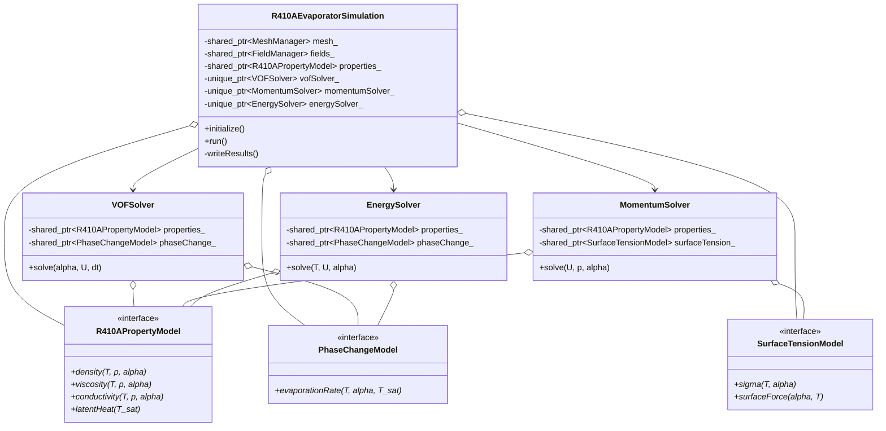

# CFD Code Architecture Overview (ภาพรวมสถาปัตยกรรมโค้ด CFD)

> **[!INFO]** 📚 Learning Objective
> เข้าใจสถาปัตยกรรมแบบเป็นชั้นๆ (layered architecture) สำหรับโปรแกรม CFD และการออกแบบระบบที่แยกส่วนกักบัน (separation of concerns) สำหรับ R410A evaporator simulation

---

## 📋 Table of Contents (สารบัญ)

1. [Layered Architecture for CFD](#layered-architecture-for-cfd)
2. [Separation of Concerns](#separation-of-concerns)
3. [Component Design](#component-design)
4. [Data Flow Architecture](#data-flow-architecture)
5. [R410A Evaporator Architecture](#r410a-evaporator-architecture)

---

## Layered Architecture for CFD

### What is Layered Architecture?

**⭐ Definition:** Organizing code into layers where each layer only depends on layers below it

**⭐ Why it's essential for CFD:**
1. **Modularity:** Each layer has single responsibility
2. **Testability:** Test layers independently
3. **Maintainability:** Change implementation without affecting other layers
4. **Reusability:** Reuse layers in different applications

### Standard CFD Architecture Layers



### Layer Responsibilities

| Layer | Responsibility | Examples | Dependencies |
|-------|---------------|----------|--------------|
| **Application** | Orchestration, I/O, user interface | `main()`, `controlDict` | All layers |
| **Solver** | Solution algorithms | SIMPLE, PISO, PIMPLE | Discretization, Field, Linear Algebra |
| **Discretization** | Approximate derivatives | `fvm::div()`, `fvc::grad()` | Field, Linear Algebra |
| **Field** | Store and manipulate data | `volVectorField`, `volScalarField` | Mesh, Utilities |
| **Mesh** | Geometry and topology | `polyMesh`, `fvMesh` | Utilities |
| **Linear Algebra** | Solve linear systems | `fvMatrix`, `GAMG`, `PCG` | Utilities |
| **Utilities** | Low-level services | File I/O, MPI, memory | None |

### OpenFOAM Layer Mapping

**⭐ Verified from:** OpenFOAM source code structure

| OpenFOAM Component | Layer | Directory |
|---------------------|-------|-----------|
| `icoFoam.C`, `simpleFoam.C` | Application | `applications/solvers/` |
| `pimpleFoam/pimpleLoop()` | Solver | `applications/solvers/incompressible/` |
| `fvm::div()`, `fvc::grad()` | Discretization | `src/finiteVolume/` |
| `GeometricField` | Field | `src/OpenFOAM/fields/` |
| `fvMesh`, `polyMesh` | Mesh | `src/finiteVolume/`, `src/OpenFOAM/meshes/` |
| `lduMatrix`, `GAMG` | Linear Algebra | `src/OpenFOAM/matrices/` |
| `OFstream`, `MPI` | Utilities | `src/OpenFOAM/db/IOstreams/`, `Pstream/` |

---

## Separation of Concerns

### What is Separation of Concerns?

**⭐ Definition:** Dividing a program into distinct sections, each addressing a separate concern

**⭐ Benefits for CFD:**
1. **Focus:** Each component does one thing well
2. **Clarity:** Easy to understand what each part does
3. **Flexibility:** Change one concern without affecting others
4. **Testing:** Test each concern independently

### Concerns in CFD



### Example: Proper Separation

**❌ BAD: Everything mixed together**

```cpp
class BadSolver {
public:
    void solve() {
        // 1. Mesh concern: read mesh
        std::ifstream meshFile("mesh.obj");
        // ... parse mesh

        // 2. Field concern: create fields
        std::vector<double> U;
        // ... initialize U

        // 3. Physics concern: define properties
        double nu = 0.01;
        double rho = 1.0;

        // 4. Numerics concern: discretize
        for (size_t i = 0; i < U.size(); ++i) {
            // FVM discretization
        }

        // 5. Solver concern: solve linear system
        // ... matrix solve

        // 6. I/O concern: write results
        std::ofstream out("results.vtk");
        // ... write VTK

        // 7. Parallel concern: MPI communication
        MPI_Send(...);
    }
};
```

**✅ GOOD: Separated concerns**

```cpp
// Mesh concern
class MeshReader {
public:
    virtual std::unique_ptr<Mesh> read(const std::string& filename) = 0;
};

// Field concern
class FieldFactory {
public:
    virtual std::unique_ptr<Field> createVelocityField(const Mesh& mesh) = 0;
};

// Physics concern
class PropertyModel {
public:
    virtual double viscosity(double T) const = 0;
    virtual double density(double T, double p) const = 0;
};

// Numerics concern
class DiscretizationScheme {
public:
    virtual fvMatrix discretize(const Field& field, const Mesh& mesh) = 0;
};

// Solver concern
class LinearSolver {
public:
    virtual Field solve(const fvMatrix& matrix) = 0;
};

// I/O concern
class ResultWriter {
public:
    virtual void write(const std::string& filename, const Field& field) = 0;
};

// Parallel concern
class ParallelCommunicator {
public:
    virtual void syncFields(Field& field) = 0;
};

// Orchestrator (application layer)
class SolverOrchestrator {
private:
    std::unique_ptr<MeshReader> meshReader_;
    std::unique_ptr<FieldFactory> fieldFactory_;
    std::unique_ptr<PropertyModel> properties_;
    std::unique_ptr<DiscretizationScheme> scheme_;
    std::unique_ptr<LinearSolver> solver_;
    std::unique_ptr<ResultWriter> writer_;
    std::unique_ptr<ParallelCommunicator> comm_;

public:
    void solve() {
        // 1. Read mesh
        auto mesh = meshReader_->read("mesh.obj");

        // 2. Create fields
        auto U = fieldFactory_->createVelocityField(*mesh);

        // 3. Get properties
        double nu = properties_->viscosity(300.0);

        // 4. Discretize
        auto matrix = scheme_->discretize(*U, *mesh);

        // 5. Solve
        *U = solver_->solve(matrix);

        // 6. Sync
        comm_->syncFields(*U);

        // 7. Write
        writer_->write("results.vtk", *U);
    }
};
```

### Interface Segregation

**⭐ Principle:** Clients shouldn't depend on interfaces they don't use

```cpp
// ❌ BAD: Fat interface
class FatMeshInterface {
public:
    // Geometry operations
    virtual Point getCellCenter(size_t cellId) = 0;
    virtual double getCellVolume(size_t cellId) = 0;

    // Topology operations
    virtual std::vector<size_t> getCellNodes(size_t cellId) = 0;
    virtual std::vector<size_t> getCellFaces(size_t cellId) = 0;

    // Mesh generation
    virtual void generateMesh() = 0;
    virtual void refineMesh() = 0;

    // Mesh quality
    virtual double checkQuality() = 0;
    virtual void improveQuality() = 0;

    // Parallel operations
    virtual void decompose(int nProcs) = 0;
    virtual void sync() = 0;
};

// ✅ GOOD: Segregated interfaces
class GeometryMesh {
public:
    virtual Point getCellCenter(size_t cellId) = 0;
    virtual double getCellVolume(size_t cellId) = 0;
};

class TopologyMesh {
public:
    virtual std::vector<size_t> getCellNodes(size_t cellId) = 0;
    virtual std::vector<size_t> getCellFaces(size_t cellId) = 0;
};

class MeshGenerator {
public:
    virtual void generateMesh() = 0;
    virtual void refineMesh() = 0;
};

class MeshQualityChecker {
public:
    virtual double checkQuality() = 0;
    virtual void improveQuality() = 0;
};

class ParallelMesh {
public:
    virtual void decompose(int nProcs) = 0;
    virtual void sync() = 0;
};

// Combine multiple interfaces through inheritance
class CompleteMesh :
    public GeometryMesh,
    public TopologyMesh,
    public MeshGenerator,
    public MeshQualityChecker,
    public ParallelMesh
{
    // Implement all interfaces
};

// User only depends on what they need
void calculateVolumes(GeometryMesh& mesh) {
    // Only geometry operations available
}
```

---

## Component Design

### Component Definition

**⭐ Component:** A cohesive, reusable unit with well-defined interface

**⭐ Characteristics:**
1. **High cohesion:** Related functionality grouped together
2. **Low coupling:** Minimal dependencies on other components
3. **Clear interface:** Well-defined API
4. **Replaceable:** Can swap implementations

### Core CFD Components



### Component Example: Property Calculator

```cpp
// Abstract component interface
class PropertyCalculator {
public:
    virtual ~PropertyCalculator() = default;

    // Pure virtual interface
    virtual double calculateDensity(double T, double p) = 0;
    virtual double calculateViscosity(double T, double p) = 0;
    virtual double calculateConductivity(double T, double p) = 0;

    // Lifecycle
    virtual void initialize() {}
    virtual void finalize() {}
};

// CoolProp implementation
class CoolPropCalculator : public PropertyCalculator {
private:
    std::string fluidName_;

public:
    CoolPropCalculator(const std::string& fluid) : fluidName_(fluid) {
        initialize();
    }

    void initialize() override {
        // Initialize CoolProp
    }

    double calculateDensity(double T, double p) override {
        return CoolProp::PropsSI("D", "T", T, "P", p, fluidName_);
    }

    double calculateViscosity(double T, double p) override {
        return CoolProp::PropsSI("V", "T", T, "P", p, fluidName_);
    }

    double calculateConductivity(double T, double p) override {
        return CoolProp::PropsSI("L", "T", T, "P", p, fluidName_);
    }
};

// Lookup table implementation
class LookupTableCalculator : public PropertyCalculator {
private:
    InterpolationTable densityTable_;
    InterpolationTable viscosityTable_;
    InterpolationTable conductivityTable_;

public:
    LookupTableCalculator(const std::string& tableDir) {
        initialize();
        densityTable_.load(tableDir + "/density.dat");
        viscosityTable_.load(tableDir + "/viscosity.dat");
        conductivityTable_.load(tableDir + "/conductivity.dat");
    }

    double calculateDensity(double T, double p) override {
        return densityTable_.interpolate(T, p);
    }

    double calculateViscosity(double T, double p) override {
        return viscosityTable_.interpolate(T, p);
    }

    double calculateConductivity(double T, double p) override {
        return conductivityTable_.interpolate(T, p);
    }
};

// Polynomial approximation implementation
class PolynomialCalculator : public PropertyCalculator {
private:
    std::vector<double> densityCoeffs_;
    std::vector<double> viscosityCoeffs_;

public:
    PolynomialCalculator(const std::vector<double>& rhoCoeffs,
                         const std::vector<double>& muCoeffs)
        : densityCoeffs_(rhoCoeffs),
          viscosityCoeffs_(muCoeffs) {}

    double calculateDensity(double T, double p) override {
        double rho = 0.0;
        double Tn = 1.0;
        for (size_t i = 0; i < densityCoeffs_.size(); ++i) {
            rho += densityCoeffs_[i] * Tn;
            Tn *= T;
        }
        return rho;
    }

    double calculateViscosity(double T, double p) override {
        double mu = 0.0;
        double Tn = 1.0;
        for (size_t i = 0; i < viscosityCoeffs_.size(); ++i) {
            mu += viscosityCoeffs_[i] * Tn;
            Tn *= T;
        }
        return mu;
    }
};

// Factory for component creation
class PropertyCalculatorFactory {
public:
    enum class Type {
        COOLPROP,
        LOOKUP_TABLE,
        POLYNOMIAL
    };

    static std::unique_ptr<PropertyCalculator> create(
        Type type,
        const std::string& param
    ) {
        switch (type) {
            case Type::COOLPROP:
                return std::make_unique<CoolPropCalculator>(param);
            case Type::LOOKUP_TABLE:
                return std::make_unique<LookupTableCalculator>(param);
            case Type::POLYNOMIAL:
                // Parse coefficients from param
                return std::make_unique<PolynomialCalculator>(/* ... */);
        }
    }
};
```

### Component Wiring

```cpp
// Application component
class R410ASolverApp {
private:
    std::unique_ptr<PropertyCalculator> properties_;
    std::unique_ptr<MeshComponent> mesh_;
    std::unique_ptr<FieldComponent> fields_;
    std::unique_ptr<SolverComponent> solver_;
    std::unique_ptr<IOComponent> io_;

public:
    // Constructor: wire components together
    R410ASolverApp(const std::string& config) {
        // Read configuration
        auto cfg = loadConfig(config);

        // Create components based on config
        properties_ = PropertyCalculatorFactory::create(
            cfg.getPropertyType(),
            cfg.getPropertyParameter()
        );

        mesh_ = createMeshComponent(cfg.getMeshType());
        fields_ = createFieldComponent(cfg.getFieldType());
        solver_ = createSolverComponent(cfg.getSolverType());
        io_ = createIOComponent(cfg.getIOType());

        // Initialize all components
        properties_->initialize();
        mesh_->initialize();
        fields_->initialize();
        solver_->initialize();
        io_->initialize();
    }

    void run() {
        // Use components
        auto rho = properties_->calculateDensity(300.0, 1e6);
        auto meshData = mesh_->getCellCenters();
        auto U = fields_->createField("U");
        solver_->solve();
        io_->write("results.vtk");
    }
};
```

---

## Data Flow Architecture

### Data Flow in CFD Simulation



### Time Step Data Flow



### Data Ownership



---

## R410A Evaporator Architecture

### System Architecture



### Component Architecture for R410A

```cpp
// === Physics Layer ===

class R410APropertyModel {
public:
    virtual double density(double T, double p, double alpha) const = 0;
    virtual double viscosity(double T, double p, double alpha) const = 0;
    virtual double conductivity(double T, double p, double alpha) const = 0;
    virtual double latentHeat(double T_sat) const = 0;
};

class PhaseChangeModel {
public:
    virtual double evaporationRate(
        const Field& T,
        const Field& alpha,
        double T_sat
    ) const = 0;
};

class SurfaceTensionModel {
public:
    virtual double sigma(double T, double alpha) const = 0;
    virtual vector surfaceForce(
        const Field& alpha,
        const Field& T
    ) const = 0;
};

// === Solver Layer ===

class VOFSolver {
private:
    std::shared_ptr<R410APropertyModel> properties_;
    std::shared_ptr<PhaseChangeModel> phaseChange_;

public:
    void solve(Field& alpha, const Field& U, double dt) {
        // ∂α/∂t + ∇·(αU) = ṁ/ρₗ
        auto mDot = phaseChange_->evaporationRate(T_, alpha_, T_sat_);
        auto rho_l = properties_->density(T_, p_, 1.0);

        fvScalarMatrix alphaEqn(
            fvm::ddt(alpha) + fvm::div(phi, alpha) == mDot / rho_l
        );
        alphaEqn.solve();
    }
};

class MomentumSolver {
private:
    std::shared_ptr<R410APropertyModel> properties_;
    std::shared_ptr<SurfaceTensionModel> surfaceTension_;

public:
    void solve(Field& U, const Field& p, const Field& alpha) {
        // Calculate mixture properties
        auto rho = properties_->density(T_, p_, alpha);
        auto mu = properties_->viscosity(T_, p_, alpha);

        // Build momentum equation
        fvVectorMatrix UEqn(
            fvm::ddt(rho, U) + fvm::div(rhoPhi, U)
            == -fvc::grad(p) + fvm::laplacian(mu, U)
            + surfaceTension_->surfaceForce(alpha, T_)
        );
        UEqn.solve();
    }
};

class EnergySolver {
private:
    std::shared_ptr<R410APropertyModel> properties_;
    std::shared_ptr<PhaseChangeModel> phaseChange_;

public:
    void solve(Field& T, const Field& U, const Field& alpha) {
        auto rho = properties_->density(T_, p_, alpha);
        auto cp = properties_->specificHeat(T_, p_, alpha);
        auto k = properties_->conductivity(T_, p_, alpha);
        auto L = properties_->latentHeat(T_sat);
        auto mDot = phaseChange_->evaporationRate(T_, alpha, T_sat);

        fvScalarMatrix TEqn(
            fvm::ddt(rho*cp, T) + fvm::div(rhoPhi*cp, T)
            == fvm::laplacian(k, T) - mDot * L
        );
        TEqn.solve();
    }
};

// === Application Layer ===

class R410AEvaporatorSimulation {
private:
    // Components
    std::shared_ptr<MeshManager> mesh_;
    std::shared_ptr<FieldManager> fields_;
    std::shared_ptr<R410APropertyModel> properties_;
    std::shared_ptr<PhaseChangeModel> phaseChange_;
    std::shared_ptr<SurfaceTensionModel> surfaceTension_;

    // Solvers
    std::unique_ptr<VOFSolver> vofSolver_;
    std::unique_ptr<MomentumSolver> momentumSolver_;
    std::unique_ptr<PressureSolver> pressureSolver_;
    std::unique_ptr<EnergySolver> energySolver_;

    // Fields
    Field* alpha_;
    Field* U_;
    Field* p_;
    Field* T_;

public:
    void initialize() {
        // Create mesh
        mesh_ = std::make_shared<TubeMeshGenerator>();
        mesh_->generate();

        // Create property model
        properties_ = std::make_shared<CoolPropR410A>();

        // Create physics models
        phaseChange_ = std::make_shared<SimpleEvaporationModel>(lambda);
        surfaceTension_ = std::make_shared<CSFModel>();

        // Create solvers
        vofSolver_ = std::make_unique<VOFSolver>(properties_, phaseChange_);
        momentumSolver_ = std::make_unique<MomentumSolver>(properties_, surfaceTension_);
        pressureSolver_ = std::make_unique<PressureSolver>();
        energySolver_ = std::make_unique<EnergySolver>(properties_, phaseChange_);

        // Create fields
        fields_ = std::make_shared<FieldManager>(mesh_);
        alpha_ = &fields_->createAlphaField();
        U_ = &fields_->createVelocityField();
        p_ = &fields_->createPressureField();
        T_ = &fields_->createTemperatureField();
    }

    void run() {
        while (time_.loop()) {
            // Update properties
            properties_->update(*T_, *p_, *alpha_);

            // Solve VOF equation
            vofSolver_->solve(*alpha_, *U_, time_.deltaT());

            // Solve momentum equation
            momentumSolver_->solve(*U_, *p_, *alpha_);

            // Solve pressure equation
            pressureSolver_->solve(*p_, *U_, *alpha_);

            // Solve energy equation
            energySolver_->solve(*T_, *U_, *alpha_);

            // Write output
            if (time_.outputTime()) {
                writeResults();
            }
        }
    }

private:
    void writeResults() {
        VTKWriter writer;
        writer.write("output_" + time_.timeName() + ".vtk", *mesh_, *fields_);
    }
};
```

### Architecture Diagram for R410A



---

## 📚 Summary (สรุป)

### Architecture Principles

1. **⭐ Layered architecture:** Each layer depends only on layers below
2. **⭐ Separation of concerns:** Each component has single responsibility
3. **⭐ High cohesion, low coupling:** Related functionality together, minimal dependencies
4. **⭐ Interface segregation:** Small, focused interfaces
5. **⭐ Dependency injection:** Pass dependencies, don't create internally

### Layer Responsibilities

| Layer | Responsibility | Example |
|-------|---------------|---------|
| Application | Orchestration | `main()`, time loop |
| Physics | Physical models | Properties, phase change |
| Solver | Solution algorithms | VOF, momentum, pressure |
| Discretization | Numerical schemes | `fvm::div()`, `fvc::grad()` |
| Field | Data storage | `volScalarField`, `volVectorField` |
| Mesh | Geometry | `polyMesh`, boundary patches |
| Utilities | Low-level services | File I/O, MPI |

### R410A Architecture

1. **⭐ Property model:** Abstract interface → CoolProp or lookup tables
2. **⭐ Phase change model:** Pluggable evaporation models
3. **⭐ Solver composition:** VOF + momentum + pressure + energy
4. **⭐ Component wiring:** Dependency injection for flexibility

---

## 🔍 References (อ้างอิง)

| Concept | Reference |
|---------|-----------|
| Layered architecture | OpenFOAM source code organization |
| Separation of concerns | "Clean Architecture" by Robert C. Martin |
| Interface segregation | SOLID principles |
| Component design | "Patterns of Enterprise Application Architecture" |
| OpenFOAM architecture | `src/` directory structure |

---

*Last Updated: 2026-01-28*
