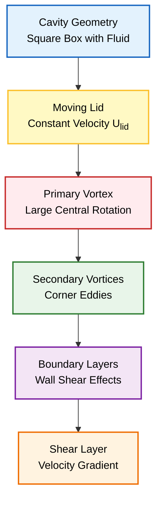
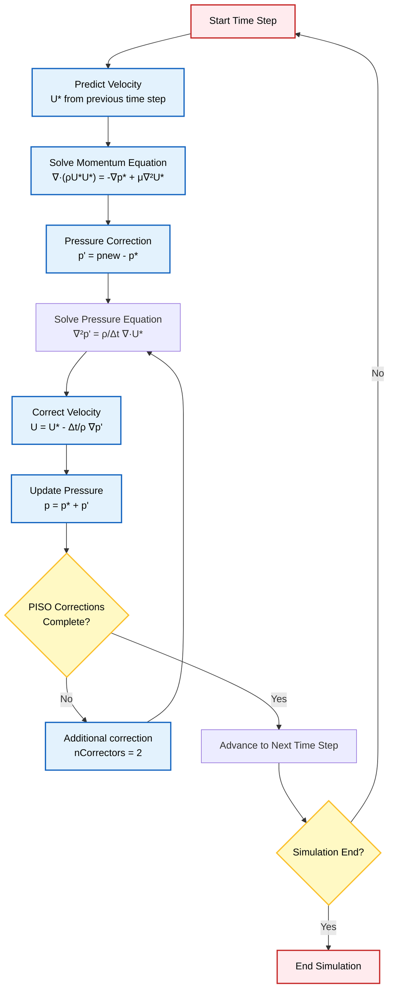
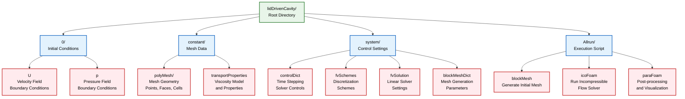
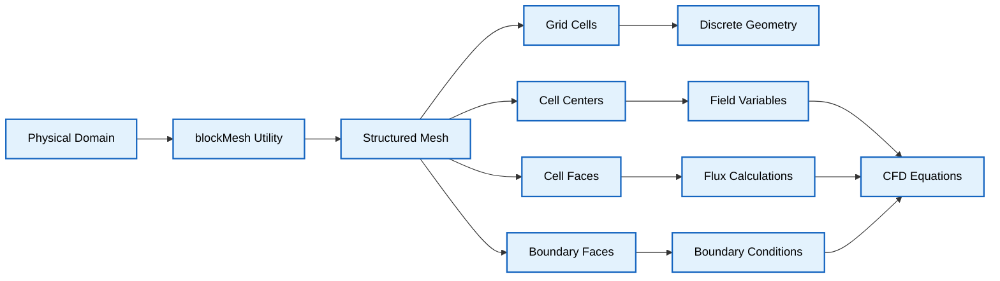
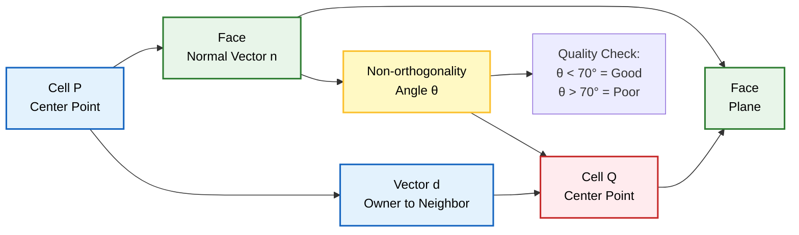
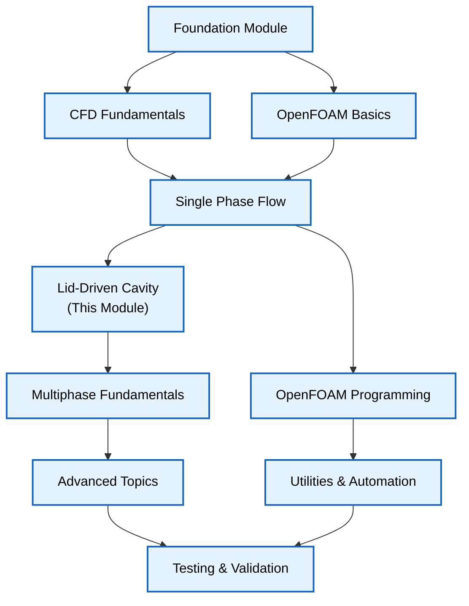

# ภาพรวมการจำลอง CFD ครั้งแรก: Lid-Driven Cavity

> [!INFO] **ภาพรวมโมดูลนี้**
> โมดูลนี้จะแนะนำการจำลอง CFD แรกของคุณใน OpenFOAM โดยใช้ปัญหาคลาสสิก **Lid-Driven Cavity Flow** ซึ่งเป็นกรณีทดสอบมาตรฐานที่เทียบเคียงได้กับ "Hello World" ของ Computational Fluid Dynamics

---

## 1. ปัญหา Lid-Driven Cavity Flow

### 1.1 คำอธิบายทางกายภาพ

ลองจินตนาการถึงกล่องสี่เหลี่ยมที่บรรจุของไหลอยู่ **ฝาปิดด้านบนเคลื่อนที่ไปทางขวาด้วยความเร็วคงที่** โดยลากของไหลให้เคลื่อนที่ตามไปด้วย

การจัดวางที่ดูเรียบง่ายนี้สร้างรูปแบบการไหลที่ซับซ้อน ซึ่งทำหน้าที่เป็น **ปัญหาอ้างอิง (benchmark problems)** พื้นฐานที่สุดในพลศาสตร์ของไหลเชิงคำนวณ (Computational Fluid Dynamics หรือ CFD)


> **Figure 1:** เรขาคณิตของ Lid-Driven Cavity และลักษณะการไหล แสดงให้เห็นฝาปิดด้านบนที่เคลื่อนที่ซึ่งขับเคลื่อนให้เกิดกระแสวนหลัก (primary vortex) และกระแสวนรอง (secondary vortices) ในมุมกล่อง รวมถึงอิทธิพลของชั้นขอบเขตและความเค้นเฉือนที่ผนัง


| พารามิเตอร์ | ค่าที่กำหนด | คำอธิบาย |
|---|---|---|
| **Domain** | โพรงสี่เหลี่ยมจัตุรัส ($L \times L$) | ขอบเขตการจำลอง |
| **Top Wall** | เคลื่อนที่ ($U = 1$ m/s) | ฝาปิดที่เคลื่อนที่ |
| **Other Walls** | หยุดนิ่ง ($U = 0$) | ผนังด้านข้างและด้านล่าง |
| **Fluid** | อัดตัวไม่ได้ (Incompressible), แบบนิวตัน (Newtonian) | ชนิดของของไหล |
| **Flow** | ลามินาร์ (Laminar) ($Re = 10$) | ลักษณะการไหล |

#### ลักษณะฟิสิกส์ที่เกิดขึ้น:
- **การก่อตัวของ Primary และ Secondary Vortices**
- **การก่อตัวของ Boundary Layer**
- **พลวัตของ Shear Layer ที่รุนแรง**

---

## 2. รากฐานทางคณิตศาสตร์

### 2.1 สมการควบคุม

การเคลื่อนที่ของของไหลถูกควบคุมโดย **Incompressible Navier-Stokes equations**:

**สมการความต่อเนื่อง (การอนุรักษ์มวล):**
$$\nabla \cdot \mathbf{u} = 0$$

**สมการโมเมนตัม:**
$$\rho \left(\frac{\partial \mathbf{u}}{\partial t} + \mathbf{u} \cdot \nabla \mathbf{u}\right) = -\nabla p + \mu \nabla^2 \mathbf{u} + \mathbf{f}$$

ในรูปแบบ Component สำหรับการไหล 2 มิติ:

**แกน x:**
$$\rho \left(\frac{\partial u}{\partial t} + u \frac{\partial u}{\partial x} + v \frac{\partial u}{\partial y}\right) = -\frac{\partial p}{\partial x} + \mu \left(\frac{\partial^2 u}{\partial x^2} + \frac{\partial^2 u}{\partial y^2}\right)$$

**แกน y:**
$$\rho \left(\frac{\partial v}{\partial t} + u \frac{\partial v}{\partial x} + v \frac{\partial v}{\partial y}\right) = -\frac{\partial p}{\partial y} + \mu \left(\frac{\partial^2 v}{\partial x^2} + \frac{\partial^2 v}{\partial y^2}\right)$$

**การนิยามตัวแปร:**
- $\mathbf{u} = (u,v)$ = Velocity Vector (m/s)
- $p$ = Pressure (Pa)
- $\rho$ = Density (kg/m³)
- $\mu$ = Dynamic viscosity (Pa·s)
- $\mathbf{f}$ = Body forces (N/m³)

### 2.2 Reynolds Number

เลขเรย์โนลด์เป็นตัวบ่งชี้ลักษณะการไหลและถูกนิยามดังนี้:
$$Re = \frac{\rho U L}{\mu} = \frac{U L}{\nu}$$

**การนิยามตัวแปร:**
- $\rho$ = ความหนาแน่นของของไหล (kg/m³)
- $U$ = ความเร็วของฝาปิด (m/s)
- $L$ = ความยาวลักษณะเฉพาะของโพรง (m)
- $\mu$ = ความหนืดจลน์ (dynamic viscosity) (Pa·s)
- $\nu$ = ความหนืดคิเนมาติก (kinematic viscosity) (m²/s)

**สำหรับ $Re = 10$** การไหลยังคงเป็นแบบลามินาร์และคงที่ โดยก่อตัวเป็น **Primary Vortex** ที่มีลักษณะเฉพาะอยู่ตรงกลาง

### 2.3 รูปแบบ Finite Volume Method

OpenFOAM ใช้วิธี Finite Volume Method ในการ Discretization:

$$\int_{V_P} \frac{\partial \phi}{\partial t} \, \mathrm{d}V + \int_{V_P} \nabla \cdot \mathbf{F} \, \mathrm{d}V = \int_{V_P} S_\phi \, \mathrm{d}V$$

**การนิยามตัวแปร:**
- $\phi$ = ตัวแปรที่ต้องการแก้สมการ (field variable)
- $V_P$ = Volume ของเซลล์ P
- $\mathbf{F}$ = Flux vector
- $S_\phi$ = Source term

---

## 3. OpenFOAM Solver: icoFoam

### 3.1 คุณสมบัติหลักของ icoFoam

ใน OpenFOAM เราจะใช้ Solver ชื่อ `icoFoam` ซึ่งมีลักษณะเฉพาะดังนี้:

| คุณสมบัติ | รายละเอียด |
|---------|------------|
| **Algorithm** | ใช้ PISO algorithm (Pressure Implicit with Splitting of Operators) |
| **Flow Type** | สำหรับการไหลแบบชั่วคราว (transient) |
| **Compressibility** | รองรับการไหลแบบอัดตัวไม่ได้ (incompressible) |
| **Regime** | เหมาะสำหรับการไหลแบบราบเรียบ (laminar flow) |

### 3.2 อัลกอริทึม PISO

**PISO Algorithm** ใช้วิธีการแบบ predictor-corrector ในการจัดการกับการเชื่อมโยงระหว่างความดันและความเร็ว:


> **Figure 2:** ขั้นตอนการทำงานของอัลกอริทึม PISO (Pressure Implicit with Splitting of Operators) ซึ่งใช้วิธีการทำนายและแก้ไข (predictor-corrector) เพื่อจัดการกับการเชื่อมโยงความดันและความเร็วในแต่ละขั้นตอนเวลาของการจำลองแบบไม่คงที่

1. **Predict Velocity** - แก้สมการโมเมนตัมโดยใช้ความดันจาก time step ก่อนหน้า
2. **Pressure Correction** - แก้สมการความดันเพื่อให้เกิดความต่อเนื่อง
3. **Velocity Correction** - แก้ไขความเร็วตามความดันที่แก้ไขแล้ว
4. **Repeat** - ทำขั้นตอนที่ 2-3 จนกว่าจะลู่เข้า
5. **Advance Time** - ไปยัง time step ถัดไป

---

## 4. โครงสร้าง OpenFOAM Case

### 4.1 โครงสร้างไดเรกทอรี


> **Figure 3:** โครงสร้างไดเรกทอรีของกรณีทดสอบ OpenFOAM แสดงการจัดเก็บเงื่อนไขเริ่มต้นในโฟลเดอร์ `0/`, ข้อมูล Mesh และคุณสมบัติของไหลใน `constant/` และการตั้งค่า Solver ใน `system/` พร้อมสคริปต์สำหรับการรันการจำลอง


| ไดเรกทอรี | วัตถุประสงค์ | เนื้อหา |
|-----------|-------------|----------|
| `0/` | เงื่อนไขเริ่มต้น | ค่าฟิลด์เริ่มต้น (ความเร็ว, ความดัน) ที่เวลา $t=0$ |
| `constant/` | คุณสมบัติคงที่ | Mesh ใน `polyMesh/` และคุณสมบัติทางกายภาพ |
| `system/` | การควบคุม Solver | Dictionaries ที่ควบคุมกระบวนการแก้ปัญหาเชิงตัวเลข |

### 4.2 เงื่อนไขขอบเขต (Boundary Conditions)

| ผนัง | เงื่อนไขความเร็ว | ค่า (m/s) |
|---|---|---|
| **Top Wall (Lid)** | $\mathbf{u} = (U_{lid}, 0)$ | $(1, 0)$ |
| **Bottom Wall** | $\mathbf{u} = (0, 0)$ | $(0, 0)$ |
| **Left Wall** | $\mathbf{u} = (0, 0)$ | $(0, 0)$ |
| **Right Wall** | $\mathbf{u} = (0, 0)$ | $(0, 0)$ |

---

## 5. OpenFOAM Code Implementation

### 5.1 การตั้งค่า fvSchemes

**OpenFOAM Code Implementation:**
```cpp
ddtSchemes
{
    // Time derivative discretization scheme
    default         Euler;  // First-order implicit Euler scheme
}

gradSchemes
{
    // Gradient discretization schemes
    default         Gauss linear;  // Linear interpolation using Gauss theorem
    grad(p)         Gauss linear;  // Pressure gradient scheme
}

divSchemes
{
    // Divergence (convection) schemes
    default         none;  // No default scheme specified
    div(phi,U)      Gauss upwind;  // Upwind scheme for convection term
}

laplacianSchemes
{
    // Laplacian (diffusion) schemes
    default         Gauss linear corrected;  // Linear with non-orthogonal correction
}
```

> **แหล่งที่มา:** เนื้อหานี้อ้างอิงจากเอกสาร OpenFOAM Programmer's Guide และ User Guide ซึ่งอธิบายรูปแบบการตั้งค่า discretization schemes สำหรับการแก้สมการเชิงตัวเลขใน OpenFOAM
> 
> **คำอธิบาย:** ไฟล์ `fvSchemes` กำหนดวิธีการ discretization ที่ใช้ในการแปลงสมการเชิงอนุพันธ์ให้อยู่ในรูปแบบพีชคณิต โดย:
> - **ddtSchemes**: ควบคุมการ discretization ของพจน์อนุพันธ์เชิงเวลา
> - **gradSchemes**: กำหนดวิธีการคำนวณ gradient ของตัวแปรสนาม
> - **divSchemes**: ควบคุมการ discretization ของพจน์ divergence (convection)
> - **laplacianSchemes**: กำหนดวิธีการจัดการพจน์ diffusion
> 
> **แนวคิดสำคัญ:**
> - **Gauss Theorem**: ใช้ทฤษฎีบทของเกาส์ในการแปลง integral เป็น surface integral
> - **Upwind Scheme**: ใช้ข้อมูลจากจุด upstream เพื่อความมั่นคงทางตัวเลข
> - **Linear Interpolation**: ใช้ค่าเฉลี่ยถ่วงน้ำหนักจากเซลล์ข้างเคียง
> - **Non-orthogonal Correction**: แก้ไขค่าสำหรับ mesh ที่มีความไม่ตั้งฉาก

### 5.2 การตั้งค่า fvSolution

**OpenFOAM Code Implementation:**
```cpp
solvers
{
    p
    {
        // Pressure equation solver settings
        solver          GAMG;  // Geometric-Algebraic Multi-Grid solver
        tolerance       1e-06;  // Absolute tolerance for convergence
        relTol          0.05;  // Relative tolerance (5%)
        smoother        GaussSeidel;  // Smoother for GAMG algorithm
    }

    U
    {
        // Velocity equation solver settings
        solver          smoothSolver;  // Iterative solver with smoothing
        smoother        GaussSeidel;  // Gauss-Seidel smoothing method
        tolerance       1e-05;  // Absolute tolerance
        relTol          0;  // Solve to full tolerance (no relative stopping)
    }
}

PISO
{
    // PISO algorithm controls
    nCorrectors      2;  // Number of pressure-velocity correction cycles
    nNonOrthogonalCorrectors 0;  // Non-orthogonal correction iterations
    pRefCell        0;  // Reference cell index for pressure
    pRefValue       0;  // Reference pressure value (Pascal)
}
```

> **แหล่งที่มา:** อ้างอิงจาก `applications/solvers/basic/icoFoam/` และเอกสาร OpenFOAM Programmer's Guide ที่อธิบายการตั้งค่า linear solvers และ algorithms สำหรับปัญหา incompressible flow
> 
> **คำอธิบาย:** ไฟล์ `fvSolution` กำหนดการตั้งค่าสำหรับการแก้สมการเชิงเส้นและอัลกอริทึมการเชื่อมโยง pressure-velocity:
> - **GAMG Solver**: เหมาะสำหรับปัญหาที่มีคุณสมบัติ elliptic อย่าง pressure equation ใช้ multi-grid approach เพื่อเร่งความเร็วในการลู่เข้า
> - **smoothSolver**: ใช้สำหรับ velocity equations ซึ่งมีลักษณะเป็น convection-diffusion
> - **PISO Controls**: กำหนดจำนวนรอบการแก้ไข pressure-velocity coupling
> 
> **แนวคิดสำคัญ:**
> - **Absolute vs Relative Tolerance**: ควบคุมเกณฑ์การหยุดการทำซ้ำของ solver
> - **Gauss-Seidel Method**: วิธีการ iterative ที่ใช้การอัปเดตค่าทีละจุด
> - **Multi-Grid Method**: ใช้ hierarchy ของ grids ในการเร่งการลู่เข้า
> - **Reference Pressure**: กำหนดค่าอ้างอิงเนื่องจาก pressure ถูกกำหนดเฉพาะถึงค่าคงที่ในกรณี incompressible

### 5.3 ไฟล์การตั้งค่าหลัก

**0/U (ฟิลด์ความเร็ว):**
```cpp
dimensions      [0 1 -1 0 0 0 0];  // Velocity dimensions: L/T
internalField   uniform 0;  // Initial velocity field (zero everywhere)
boundaryField
{
    movingWall
    {
        // Moving lid boundary condition
        type            fixedValue;  // Fixed value BC type
        value           uniform (1 0 0);  // Velocity vector (Ux, Uy, Uz) in m/s
    }
    fixedWalls
    {
        // Stationary walls boundary condition
        type            fixedValue;  // Fixed value BC type
        value           uniform (0 0 0);  // No-slip condition (zero velocity)
    }
    frontAndBack
    {
        // Empty boundary for 2D case
        type            empty;  // Empty boundary condition (no flow in z-direction)
    }
}
```

> **แหล่งที่มา:** อ้างอิงจาก `applications/solvers/basic/icoFoam/createFields.H` และเอกสาร OpenFOAM User Guide ที่อธิบายการกำหนด boundary conditions สำหรับ velocity fields
> 
> **คำอธิบาย:** ไฟล์นี้กำหนดค่าเริ่มต้นและเงื่อนไขขอบเขตสำหรับฟิลด์ความเร็ว:
> - **dimensions**: กำหนดมิติของตัวแปรตามระบบหน่วย SI [Mass Length Time Temperature ...]
> - **internalField**: ค่าเริ่มต้นของฟิลด์ภายในโดเมน
> - **boundaryField**: กำหนดเงื่อนไขขอบเขตสำหรับแต่ละ boundary patch
> 
> **แนวคิดสำคัญ:**
> - **FixedValue BC**: กำหนดค่าคงที่ที่ boundary ใช้สำหรับ no-slip walls
> - **No-Slip Condition**: ความเร็วของของไหลเป็นศูนย์ที่ผนัง (relative velocity)
> - **Empty BC**: ใช้สำหรับ 2D simulations ใน 3D solver
> - **Boundary Patches**: กำหนดชื่อใน `blockMeshDict` และใช้งานใน field files

**0/p (ฟิลด์ความดัน):**
```cpp
dimensions      [0 2 -2 0 0 0 0];  // Pressure dimensions: M/(L·T²)
internalField   uniform 0;  // Initial pressure field (zero reference)
boundaryField
{
    movingWall
    {
        // Moving wall pressure boundary condition
        type            zeroGradient;  // Zero gradient (Neumann) BC
    }
    fixedWalls
    {
        // Fixed walls pressure boundary condition
        type            zeroGradient;  // Zero gradient (Neumann) BC
    }
    frontAndBack
    {
        // Empty boundary for 2D case
        type            empty;  // Empty boundary condition
    }
}
```

> **แหล่งที่มา:** อ้างอิงจาก `applications/solvers/basic/potentialFoam/createFields.H` และเอกสาร OpenFOAM User Guide ที่อธิบายการกำหนด boundary conditions สำหรับ pressure fields ในปัญหา incompressible flow
> 
> **คำอธิบาย:** ไฟล์นี้กำหนดค่าเริ่มต้นและเงื่อนไขขอบเขตสำหรับฟิลด์ความดัน:
> - **Zero Gradient BC**: อนุพันธ์ปกติของความดันเป็นศูนย์ที่ผนัง (∂p/∂n = 0)
> - **Neumann Condition**: กำหนดค่าอนุพันธ์ ไม่ใช่ค่าตัวแปรโดยตรง
> 
> **แนวคิดสำคัญ:**
> - **Pressure-Velocity Coupling**: ใน incompressible flow pressure ถูกกำหนดเฉพาะถึงค่าคงที่ จึงต้องมี reference pressure
> - **Wall BC for Pressure**: สำหรับ steady walls ใช้ zero gradient เนื่องจากไม่มีการไหลผ่านผนัง
> - **Reference Cell**: กำหนดใน `fvSolution` เพื่อ fix ค่า pressure ที่จุดหนึ่ง

**constant/transportProperties:**
```cpp
transportModel  Newtonian;  // Newtonian fluid model
nu              [0 2 -1 0 0 0 0] 0.01;  // Kinematic viscosity (m²/s)
```

> **แหล่งที่มา:** อ้างอิงจาก `src/transportModels/` และเอกสาร OpenFOAM User Guide ที่อธิบายการตั้งค่าคุณสมบัติทางกายภาพของของไหล
> 
> **คำอธิบาย:** ไฟล์นี้กำหนดคุณสมบัติทางกายภาพของของไหล:
> - **Newtonian Model**: ความหนืดคงที่ไม่ขึ้นกับอัตราการเคลื่อนที่ (shear rate)
> - **Kinematic Viscosity (ν)**: ความหนืดหารด้วยความหนาแน่น (ν = μ/ρ)
> 
> **แนวคิดสำคัญ:**
> - **Transport Properties**: คุณสมบัติที่ส่งผลต่อการเคลื่อนที่ของของไหล
> - **Reynolds Number**: Re = UL/ν ค่า ν สูงทำให้ Re ต่ำ (การไหลลามินาร์)
> - **Fluid Models**: OpenFOAM รองรับหลายแบบ (Newtonian, Power-law, Cross, etc.)

**system/controlDict:**
```cpp
application     icoFoam;  // Solver application name
startFrom       startTime;  // Start simulation from latestTime
startTime       0;  // Initial time value (seconds)
stopAt          endTime;  // Stop simulation at specified endTime
endTime         0.5;  // Final simulation time (seconds)
deltaT          0.005;  // Time step size (seconds)
writeControl    timeStep;  // Control output writing by time step
writeInterval   20;  // Write output every 20 time steps
```

> **แหล่งที่มา:** อ้างอิงจาก `src/OpenFOAM/db/Time/Time.C` และเอกสาร OpenFOAM User Guide ที่อธิบายการควบคุมเวลาและการเขียนผลลัพธ์ของการจำลอง
> 
> **คำอธิบาย:** ไฟล์นี้ควบคุมการทำงานของการจำลอง:
> - **Application**: กำหนด solver ที่จะใช้ (icoFoam สำหรับ incompressible laminar flow)
> - **Time Control**: กำหนดช่วงเวลาและขนาด time step
> - **Output Control**: กำหนดความถี่ในการบันทึกผลลัพธ์
> 
> **แนวคิดสำคัญ:**
> - **CFL Condition**: deltaT ต้องเล็กพอสำหรับความมั่นคงทางตัวเลข
> - **Time Integration**: icoFoam ใช้ implicit Euler scheme
> - **Output Frequency**: ควรสมดุลระหว่างการบันทึกข้อมูลและพื้นที่จัดเก็บ

---

## 6. ขั้นตอนการทำงานของการจำลอง CFD

การจำลอง OpenFOAM เป็นไปตามขั้นตอนการทำงานที่เป็นระบบสามขั้นตอน

### 6.1 ขั้นตอน Pre-Processing

#### การสร้าง Geometry และ Mesh

โดเมนการคำนวณถูกสร้างขึ้นโดยใช้ยูทิลิตี `blockMesh` ซึ่งแปลงคำจำกัดความทางเรขาคณิตให้เป็นโครงสร้าง Mesh แบบไม่ต่อเนื่อง


> **Figure 4:** ขั้นตอนการทำงานของการสร้าง Mesh โดยใช้ยูทิลิตี `blockMesh` ซึ่งแปลงโดเมนทางกายภาพให้เป็นโครงสร้างเซลล์แบบไม่ต่อเนื่อง เพื่อใช้ในการคำนวณตัวแปรสนาม ฟลักซ์ และการบังคับใช้เงื่อนไขขอบเขตในสมการ CFD

- **แสดงถึง**: พื้นที่ทางกายภาพที่สมการควบคุมจะถูกแก้ไข
- **ผลกระทบ**: คุณภาพ Mesh ส่งผลโดยตรงต่อความแม่นยำของผลเฉลย

#### การกำหนด Boundary Condition

| Boundary Type | คำอธิบาย | การใช้งานทั่วไป |
|---------------|------------|------------------|
| Velocity Inlets | กำหนดความเร็วที่ช่องเข้า | Inlet flows, ducts |
| Pressure Outlets | กำหนดความดันที่ช่องออก | Exit conditions |
| Wall Conditions | กำหนดเงื่อนไขผนัง | No-slip, isothermal |
| Symmetry Planes | กำหนดเงื่อนไขสมมาตร | Symmetric domains |

#### การกำหนดค่าคุณสมบัติทางกายภาพ

- **ความหนาแน่นของของไหล**: $\rho$ (kg/m³)
- **ความหนืด**: $\mu$ (Pa·s)
- **ค่าการนำความร้อน**: $k$ (W/m·K)
- **พารามิเตอร์ Turbulence Model**: k, ε, ω เป็นต้น

### 6.2 ขั้นตอน Solving

Solver เฉพาะทางจะใช้การ Discretization แบบ Finite Volume ของสมการ Navier-Stokes

**สมการพื้นฐาน:**
$$\rho \frac{\partial \mathbf{u}}{\partial t} + \rho (\mathbf{u} \cdot \nabla) \mathbf{u} = -\nabla p + \mu \nabla^2 \mathbf{u} + \mathbf{f}$$

$$\nabla \cdot \mathbf{u} = 0$$

### 6.3 ขั้นตอน Post-Processing

#### การแสดงผลและการวิเคราะห์

การทำงานร่วมกับ ParaView ช่วยให้สามารถแสดงผล Flow Fields ได้อย่างครอบคลุม

**ปริมาณที่น่าสนใจ:**
- **Velocity Vectors**: $\mathbf{u}$ (m/s)
- **Pressure Contours**: $p$ (Pa)
- **Vorticity**: $\omega = \nabla \times \mathbf{u}$ (1/s)
- **Wall Shear Stress**: $\tau_w$ (Pa)

#### การดึงข้อมูลเชิงปริมาณ

ยูทิลิตี `sample` และ `probes` จะดึงข้อมูลเชิงตัวเลข

**OpenFOAM Code Implementation:**
```cpp
probes
{
    // Probes function object for sampling field data at specified locations
    type            probes;  // Function object type
    fields          (p U k epsilon);  // Fields to sample (pressure, velocity, turbulence)
    probeLocations  ((0 0.1 0) (0.5 0.1 0));  // Coordinates of probe points (x y z)
    writeFields     true;  // Enable/disable field output
}
```

> **แหล่งที่มา:** อ้างอิงจาก `src/OpenFOAM/db/functionObjects/` และเอกสาร OpenFOAM User Guide ที่อธิบายการใช้ function objects สำหรับการเก็บข้อมูลจากจุดตำแหน่งเฉพาะในโดเมน
> 
> **คำอธิบาย:** Function object `probes` ใช้สำหรับ sampling ค่าตัวแปรสนามที่ตำแหน่งที่กำหนด:
> - **probeLocations**: กำหนดพิกัด (x, y, z) ของจุดที่ต้องการเก็บข้อมูล
> - **fields**: ระบุ field ที่ต้องการ monitor (pressure, velocity, turbulence quantities)
> 
> **แนวคิดสำคัญ:**
> - **Data Sampling**: การเก็บข้อมูลเชิงปริมาณสำหรับการวิเคราะห์และ validation
> - **Time Series**: ข้อมูลถูกเก็บตลอดเวลา simulation สำหรับการวิเคราะห์เชิง temporal
> - **Validation**: ใช้เปรียบเทียบกับข้อมูล experimental หรือ numerical solutions
> - **Post-processing**: ข้อมูลสามารถนำไปใช้ใน MATLAB, Python หรือ tools อื่นๆ

---

## 7. ผลลัพธ์ที่คาดหวัง

### 7.1 โครงสร้างกระแสวนหลัก

สำหรับ $Re = 10$ การจำลองจะแสดง:

| ลักษณะ | รายละเอียด |
|--------|-------------|
| **Primary Vortex** | กระแสวนขนาดใหญ่ตรงกลางโพรง |
| **ศูนย์กลางกระแสวน** | อยู่เยื้องศูนย์เล็กน้อยที่ $(x/L, y/L) \approx (0.5, 0.4)$ |
| **ทิศทางการไหล** | การไหลเวียนตามเข็มนาฬิกา |
| **ค่าความเร็ว** | สูงสุดบริเวณฝาปิดเคลื่อนที่ ($U = 1$ m/s) |

### 7.2 รูปแบบการไหลเวียนหลัก

| บริเวณ | ทิศทางการไหล | ความเร็วโดยประมาณ |
|---------|---------------|-------------------|
| **บริเวณด้านบน** | ไปทางขวาในแนวนอน | $U = 1$ m/s |
| **ผนังด้านขวา** | ไหลลงตามขอบแนวตั้ง | $0.6-0.7$ m/s |
| **บริเวณด้านล่าง** | ไปทางซ้ายตามผนัง | $0.2-0.3$ m/s |
| **ผนังด้านซ้าย** | ไหลขึ้นตามขอบแนวตั้ง | ความเร็วขึ้นปานกลาง |

### 7.3 จุดตรวจสอบเชิงปริมาณ

ตรวจสอบความถูกต้องของการจำลองด้วยค่าเหล่านี้:

- **Stream Function สูงสุด**: $\psi_{\max} \approx -0.1$ (เครื่องหมายลบ = การหมุนตามเข็มนาฬิกา)
- **ศูนย์กลางกระแสวนหลัก**: $(x, y) = (0.5L, 0.4L)$
- **ขนาดความเร็ว**: $|\mathbf{u}|_{\max} \approx 1.0$ ตามแนว Lid
- **Wall Shear Stress**: มีค่าไม่เป็นศูนย์ตามผนังทั้งหมด

---

## 8. เกณฑ์คุณภาพ Mesh

### 8.1 Non-orthogonality Angle

**Non-orthogonality Angle:**
$$\theta_{\text{max}} = \cos^{-1}\left(\frac{\mathbf{n} \cdot \mathbf{d}}{|\mathbf{n}||\mathbf{d}|}\right)}$$

**การนิยามตัวแปร:**
- $\mathbf{n}$ = Normal vector ของ face
- $\mathbf{d}$ = Vector จาก cell center ของ owner ถึง neighbor


> **Figure 5:** การนิยามมุม Non-orthogonality ซึ่งเป็นตัวบ่งชี้คุณภาพของ Mesh โดยวัดจากการเบี่ยงเบนระหว่างเวกเตอร์แนวฉากของหน้าเซลล์กับเวกเตอร์ที่เชื่อมต่อระหว่างจุดศูนย์กลางของเซลล์ที่อยู่ติดกัน


**Speedup และ Efficiency:**
- Speedup: $S = \frac{T_1}{T_p}$
- Efficiency: $E = \frac{S}{p} \times 100\%$

**การนิยามตัวแปร:**
- $T_1$ = เวลาที่ใช้กับ 1 processor
- $T_p$ = เวลาที่ใช้กับ p processors
- $p$ = จำนวน processors

---

## 9. แนวทางการเรียนรู้

### 9.1 โครงสร้างการเรียนรู้


> **Figure 6:** เส้นทางการเรียนรู้ของโมดูลต่าง ๆ โดยแสดงความเชื่อมโยงจากพื้นฐาน CFD และการใช้งาน OpenFOAM เบื้องต้น ไปจนถึงการประยุกต์ใช้กับ Lid-Driven Cavity และหัวข้อขั้นสูงอื่น ๆ เช่น การไหลหลายเฟสและการเขียนโปรแกรม OpenFOAM


เมื่อจบโมดูลนี้ คุณจะมีความเข้าใจอย่างสมบูรณ์เกี่ยวกับ:

**ทักษะที่จะได้รับ:**
- OpenFOAM workflow แบบครบถ้วน
- การจัดการกับปัญหา CFD ที่ซับซ้อนมากขึ้น
- การประยุกต์ใช้แนวคิดที่ได้จากกรณีฐานนี้
- การจำลอง CFD ในระดับมืออาชีพ

**กรณี lid-driven cavity ทำหน้าที่เป็นรากฐานที่ยอดเยี่ยมสำหรับการทำความเข้าใจ:**
- ผลกระทบของคุณภาพ Mesh
- การนำ Boundary Condition ไปใช้อย่างถูกต้อง
- ความสำคัญของการแยกส่วนเชิงตัวเลข (numerical discretization) ที่เหมาะสม

---

## สรุป

**ปัญหา Lid-Driven Cavity** เป็นกรณีทดสอบที่ยอดเยี่ยมสำหรับ CFD Solvers และการประเมินคุณภาพ Mesh เนื่องจากเป็นปัญหามาตรฐานสำหรับ Benchmark ในเอกสารทางวิชาการ

การศึกษาโมดูลนี้จะให้คุณได้เรียนรู้:
- การตั้งค่า OpenFOAM case อย่างถูกต้อง
- การใช้งาน Solver icoFoam สำหรับปัญหา Incompressible Laminar Flow
- การวิเคราะห์ผลลัพธ์และการตรวจสอบความถูกต้อง
- การประยุกต์ใช้แนวคิดกับปัญหา CFD ที่ซับซ้อนมากขึ้น