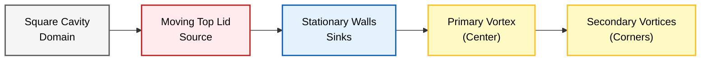
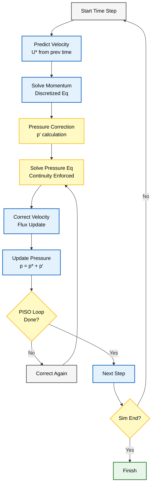
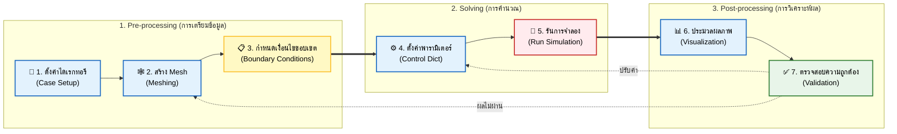

# บทนำสู่การจำลอง CFD แรก

**เอกสารฉบับนี้จะแนะนำคุณอย่างละเอียดทีละขั้นตอนสำหรับการตั้งค่าและรันการจำลอง CFD ครั้งแรกของคุณใน OpenFOAM**

เราจะใช้ตัวอย่างคลาสสิกของ **การไหลในโพรงที่มีฝาเลื่อน (lid-driven cavity flow)** ซึ่งเปรียบเสมือน "Hello World" ของ CFD


> **Figure 1:** การกำหนดรูปแบบของ Lid-Driven Cavity แสดงโพรงสี่เหลี่ยมที่มีฝาปิดด้านบนเคลื่อนที่และผนังด้านอื่น ๆ หยุดนิ่ง ซึ่งนำไปสู่การก่อตัวของกระแสวนหลักตรงกลางและกระแสวนรองที่บริเวณมุม


**ปัญหานี้เป็นกรณีทดสอบพื้นฐานในพลศาสตร์ของไหลเชิงคำนวณ (computational fluid dynamics)** ที่แสดงถึงปฏิสัมพันธ์ระหว่าง:
- **แรงหนืด (viscous forces)**
- **การไหลที่ขับเคลื่อนด้วยความดัน (pressure-driven flow)**

### ลักษณะเฉพาะของปัญหา

| คุณสมบัติ | คำอธิบาย |
|----------|----------|
| **รูปทรงเรขาคณิต** | โพรงสี่เหลี่ยมจัตุรัส ($L \times L$) |
| **ฝาด้านบน** | เคลื่อนที่ด้วยความเร็วคงที่ $U_{\text{lid}}$ |
| **ผนังอื่นๆ** | ยังคงหยุดนิ่ง (no-slip) |
| **ชนิดของของไหล** | อัดตัวไม่ได้ (Incompressible), แบบนิวตัน (Newtonian) |
| **ลักษณะการไหล** | ลามินาร์ (Laminar) ที่ $Re = 10$ |

### ผลลัพธ์ที่เกิดขึ้น

- **กระแสวนหลัก (primary vortex)** ที่กึ่งกลางโพรง
- **กระแสวนรอง (secondary vortices)** ที่มุม (สำหรับ Reynolds number ที่สูงขึ้น)

> [!INFO] **ความสำคัญของปัญหานี้**
> ทำให้เป็น **กรณีทดสอบที่ยอดเยี่ยมสำหรับ:**
> - การตรวจสอบความถูกต้องของ Numerical Solver
> - การประเมินคุณภาพของ Mesh
> - การเรียนรู้ OpenFOAM workflow แบบครบถ้วน

---

## มูลฐานทางคณิตศาสตร์

จากมุมมองทางคณิตศาสตร์ ปัญหานี้แก้สมการ Navier-Stokes แบบอัดตัวไม่ได้ (incompressible Navier-Stokes equations) ในสองมิติ:

### สมการควบคุม (Governing Equations)

**สมการความต่อเนื่อง (การอนุรักษ์มวล):**
$$\frac{\partial \rho}{\partial t} + \nabla \cdot (\rho \mathbf{u}) = 0$$

สำหรับการไหลแบบ Incompressible สมการนี้จะลดรูปเป็น:
$$\nabla \cdot \mathbf{u} = 0 \tag{1}$$

**สมการโมเมนตัม:**
$$\rho \left( \frac{\partial \mathbf{u}}{\partial t} + \mathbf{u} \cdot \nabla \mathbf{u} \right) = -\nabla p + \mu \nabla^2 \mathbf{u} + \mathbf{f} \tag{2}$$

ในรูปแบบ Component สำหรับการไหล 2 มิติ ที่ $\mathbf{u} = (u, v)$:

**แกน x:**
$$\rho \left(\frac{\partial u}{\partial t} + u \frac{\partial u}{\partial x} + v \frac{\partial u}{\partial y}\right) = -\frac{\partial p}{\partial x} + \mu \left(\frac{\partial^2 u}{\partial x^2} + \frac{\partial^2 u}{\partial y^2}\right)$$

**แกน y:**
$$\rho \left(\frac{\partial v}{\partial t} + u \frac{\partial v}{\partial x} + v \frac{\partial v}{\partial y}\right) = -\frac{\partial p}{\partial y} + \mu \left(\frac{\partial^2 v}{\partial x^2} + \frac{\partial^2 v}{\partial y^2}\right)$$

### นิยามตัวแปร

| ตัวแปร | สัญลักษณ์ | หน่วย | คำอธิบาย |
|---------|----------|--------|----------|
| เวกเตอร์ความเร็ว | $\mathbf{u} = (u, v)$ | m/s | ความเร็วของของไหลในแต่ละทิศทาง |
| ความดัน | $p$ | Pa | ความดันของของไหล |
| ความหนาแน่น | $\rho$ | kg/m³ | ความหนาแน่นของของไหล |
| ความหนืดพลวัต | $\mu$ | Pa·s | ความหนืดจลน์ของของไหล |
| แรงกระทำต่อปริมาตร | $\mathbf{f}$ | N/m³ | แรงภายนอก เช่น แรงโน้มถ่วง |

---

## สมดุลเชิงมิติ (Dimensional Analysis)

### เลขเรย์โนลด์ (Reynolds Number)

เลขเรย์โนลด์เป็นตัวบ่งชี้ลักษณะการไหลและถูกนิยามดังนี้:

$$Re = \frac{\rho U L}{\mu} = \frac{U L}{\nu} \tag{3}$$

**การนิยามตัวแปร:**
- $\rho$ = ความหนาแน่นของของไหล (kg/m³)
- $U$ = ความเร็วของฝาปิด (m/s)
- $L$ = ความยาวลักษณะเฉพาะของโพรง (m)
- $\mu$ = ความหนืดจลน์ (dynamic viscosity) (Pa·s)
- $\nu$ = ความหนืดคิเนมาติก (kinematic viscosity) (m²/s)

> [!TIP] **ความหมายทางกายภาพของ Reynolds Number**
> $$Re = \frac{\text{Inertial Forces}}{\text{Viscous Forces}} = \frac{\rho \mathbf{u} \cdot \nabla \mathbf{u}}{\mu \nabla^2 \mathbf{u}}$$
>
> - **$Re \ll 1$**: แรงหนืดเด่นชัด (Creeping flow)
> - **$Re \approx 10-1000$**: การไหลแบบลามินาร์ (Laminar flow)
> - **$Re \gg 4000$**: การไหลแบบที่รบกวน (Turbulent flow)

สำหรับการจำลองนี้ เราจะใช้ค่าที่กำหนดดังนี้:
- ความเร็วฝา: $U_{\text{lid}} = 1$ m/s
- ความยาวลักษณะเฉพาะ: $L = 0.1$ m
- ความหนืดคิเนมาติก: $\nu = 0.01$ m²/s

ดังนั้น:
$$Re = \frac{1 \times 0.1}{0.01} = 10$$

**สำหรับ $Re = 10$ การไหลยังคงเป็นแบบลามินาร์อย่างชัดเจน** โดยก่อตัวเป็น **Primary Vortex** ที่มีลักษณะเฉพาะอยู่ตรงกลาง

---

## เงื่อนไขขอบเขต (Boundary Conditions)

### เงื่อนไข No-slip บนผนังทุกด้าน

| ผนัง | เงื่อนไข | ค่าความเร็ว (m/s) | คำอธิบาย |
|------|----------|-------------------|----------|
| **ผนังด้านบน (Lid)** | Moving wall | $\mathbf{u} = (U_{\text{lid}}, 0) = (1, 0)$ | ฝาเลื่อนด้วยความเร็วคงที่ |
| **ผนังด้านล่าง** | No-slip | $\mathbf{u} = (0, 0)$ | ของไหลหยุดนิ่งที่ผนัง |
| **ผนังด้านข้าง** | No-slip | $\mathbf{u} = (0, 0)$ | ของไหลหยุดนิ่งที่ผนัง |

โดยที่ $U_{\text{lid}}$ คือความเร็วของฝา (lid velocity)

### เงื่อนไขขอบเขตสำหรับ Pressure

**Boundary Conditions สำหรับ Pressure** มักจะถูกกำหนดโดยใช้ Reference Pressure หรือ Zero-gradient Conditions ขึ้นอยู่กับ Numerical Scheme:

$$\frac{\partial p}{\partial n} = 0 \quad \text{(ที่ผนัง)}$$

เงื่อนไขนี้เหมาะสมทางกายภาพสำหรับการไหลแบบ Incompressible flow ที่ความดันจะปรับตัวเพื่อให้เป็นไปตามหลักความต่อเนื่อง (continuity)

---

## OpenFOAM Solver: icoFoam

ใน OpenFOAM เราจะใช้ Solver ชื่อ `icoFoam` ซึ่งเป็น Solver สำหรับการไหลแบบ Incompressible, Laminar, และ Transient

### คุณสมบัติหลักของ icoFoam

| คุณสมบัติ | คำอธิบาย |
|----------|----------|
| **Algorithm** | PISO (Pressure Implicit with Splitting of Operators) |
| **ชนิดการไหล** | Transient (ขึ้นกับเวลา) |
| **Compressibility** | Incompressible (อัดตัวไม่ได้) |
| **Flow regime** | Laminar (ลามินาร์) |
| **Equations** | Incompressible Navier-Stokes |

### อัลกอริทึม PISO

**PISO Algorithm:**
- ใช้วิธีการแบบ **predictor-corrector**
- จัดการกับการเชื่อมโยงระหว่างความดันและความเร็ว (pressure-velocity coupling)
- เหมาะอย่างยิ่งสำหรับปัญหาแบบชั่วคราว (transient problems)


> **Figure 2:** ขั้นตอนการทำงานของอัลกอริทึม PISO ซึ่งใช้วิธีการทำนายและแก้ไขความดันและความเร็วในแต่ละขั้นตอนเวลา เพื่อให้มั่นใจว่าผลเฉลยเป็นไปตามสมการความต่อเนื่องสำหรับการไหลแบบอัดตัวไม่ได้


```
1. Predictor Step:
   - แก้สมการโมเมนตัมโดยใช้ความดันจาก time step ก่อนหน้า
   - ได้เวกเตอร์ความเร็วกลาง (intermediate velocity)

2. Corrector Step (ทำซ้ำ 2-3 ครั้ง):
   - แก้สมการความดัน (pressure correction equation)
   - แก้ไขเวกเตอร์ความเร็วด้วยความดันใหม่
   - ตรวจสอบการลู่เข้าของความดัน

3. Time Advancement:
   - อัพเดทค่าทั้งหมดไปยัง time step ถัดไป
```

### การนำไปใช้งานใน OpenFOAM

**ตัวอย่างการ Discretization ใน OpenFOAM:**

```cpp
// Momentum equation discretization in OpenFOAM
// สมการโมเมนตัมใน OpenFOAM
fvVectorMatrix UEqn
(
    // Transient term: ∂(ρU)/∂t
    // เทอมชั่วคราว: อนุพันธ์เวกเตอร์ความเร็วเทียบกับเวลา
    fvm::ddt(rho, U)
    
    // Convection term: ∇·(ρUU)
    // เทอมเคลื่อนที่: การพาความเร็วของของไหล
  + fvm::div(rhoPhi, U)
    
    // Divergence correction term
    // เทอมแก้ไขการเบี่ยงเบน
  + fvm::SuSp(-fvc::div(rhoPhi), U)
    
    // Equality operator
 ==
    // Pressure gradient term: -∇p
    // เทอมการไหลของความดัน
    - fvc::grad(p)
    
    // Diffusion term: μ∇²U
    // เทอมการแพร่กระจาย (viscous forces)
  + fvc::laplacian(mu, U)
    
    // Source terms (e.g., porous media, body forces)
    // เทอมต้นกำเนิด (เช่น ตัวกลางพรุทึบ แรงภายนอก)
  + fvOptions(rho, U)
);
```

> **📂 Source:** .applications/solvers/multiphase/multiphaseInterFoam/multiphaseMixture/multiphaseMixture.c
>
> **คำอธิบาย:**
> โค้ด C++ ข้างต้นแสดงให้เห็นวิธีการจัดรูปแบบสมการโมเมนตัมใน OpenFOAM โดยใช้ Finite Volume Method (FVM) โครงสร้าง `fvVectorMatrix` ใช้สำหรับรวบรวมเทรมต่าง ๆ ของสมการเชิงเวกเตอร์ ซึ่งประกอบด้วย:
> - `fvm::` (Finite Volume Method) สำหรับ implicit terms ที่ถูกจัดวางในเมทริกซ์
> - `fvc::` (Finite Volume Calculus) สำหรับ explicit terms ที่ถูกคำนวณโดยตรง
>
> **แนวคิดหลัก:**
> - **Implicit vs Explicit:** Implicit terms ใช้สำหรับเทอมที่ต้องการความเสถียรในการคำนวณ (เช่น ddt, div) ส่วน explicit terms ใช้สำหรับเทอมที่คำนวณได้โดยตรง (เช่น grad, laplacian)
> - **Linear System:** เมื่อรวบรวมเทรมทั้งหมดแล้ว จะได้ระบบสมการเชิงเส้น $A\mathbf{x} = \mathbf{b}$ ที่สามารถแก้ไขได้ด้วย linear solver
> - **Operator Splitting:** แต่ละเทอมถูกแยกออกและจัดการแยกกันตามคุณสมบัติทางกายภาพและเชิงตัวเลข

---

## ขั้นตอนการทำงานของการจำลอง CFD ใน OpenFOAM

การจำลอง OpenFOAM เป็นไปตามขั้นตอนการทำงานที่เป็นระบบ **3 ขั้นตอนหลัก**:


> **Figure 3:** ขั้นตอนหลักของกระบวนการจำลอง CFD ใน OpenFOAM ซึ่งประกอบด้วยการเตรียมการ (Pre-processing), การหาผลเฉลย (Solving) และการประมวลผลขั้นหลัง (Post-processing) เพื่อวิเคราะห์และตรวจสอบความถูกต้องของข้อมูล


#### การสร้าง Geometry และ Mesh

โดเมนการคำนวณถูกสร้างขึ้นโดยใช้ยูทิลิตี `blockMesh` ซึ่งแปลงคำจำกัดความทางเรขาคณิตให้เป็นโครงสร้าง Mesh แบบไม่ต่อเนื่อง

**ความสำคัญของ Mesh:**
- **แสดงถึง**: พื้นที่ทางกายภาพที่สมการควบคุมจะถูกแก้ไข
- **ผลกระทบ**: คุณภาพ Mesh ส่งผลโดยตรงต่อความแม่นยำของผลเฉลยและลักษณะการลู่เข้า

#### การกำหนด Boundary Condition

ไฟล์ Boundary Condition ในไดเรกทอรี `0/` จะกำหนดข้อจำกัดทางกายภาพที่ขอบเขตของโดเมน:

| Boundary Type | คำอธิบาย | การใช้งานทั่วไป |
|---------------|------------|------------------|
| Velocity Inlets | กำหนดความเร็วที่ช่องเข้า | Inlet flows, ducts |
| Pressure Outlets | กำหนดความดันที่ช่องออก | Exit conditions |
| Wall Conditions | กำหนดเงื่อนไขผนัง | No-slip, isothermal |
| Symmetry Planes | กำหนดเงื่อนไขสมมาตร | Symmetric domains |

#### การกำหนดค่าคุณสมบัติทางกายภาพ

ไดเรกทอรี `constant/` ประกอบด้วยคุณสมบัติของวัสดุและคำจำกัดความของ Physical Model:

- **ความหนาแน่นของของไหล**: $\rho$ (kg/m³)
- **ความหนืด**: $\mu$ (Pa·s)
- **ค่าการนำความร้อน**: $k$ (W/m·K)
- **พารามิเตอร์ Turbulence Model**: k, ε, ω เป็นต้น

#### พารามิเตอร์ควบคุม Solver

ไดเรกทอรี `system/` เป็นที่เก็บไฟล์การกำหนดค่า Solver ที่ควบคุมด้านตัวเลข:

| พารามิเตอร์ | สัญลักษณ์ | หน่วย | ผลกระทบ |
|--------------|------------|--------|-----------|
| Time Step | $\Delta t$ | s | เสถียรภาพและความแม่นยำ |
| เกณฑ์การลู่เข้า | - | - | ความเร็วในการคำนวณ |
| Discretization Schemes | - | - | ความแม่นยำเชิงตัวเลข |
| Linear Solver Tolerance | - | - | ความแม่นยำของผลเฉลย |

### 2. ขั้นตอน Solving

#### การดำเนินการแก้ไขเชิงตัวเลข

Solver เฉพาะทางจะใช้การ Discretization แบบ Finite Volume ของสมการ Navier-Stokes

#### การตรวจสอบการลู่เข้า

ความคืบหน้าของผลเฉลยจะถูกติดตามผ่านการตรวจสอบ Residual

**Algorithm: การตรวจสอบการลู่เข้า**
```
เริ่มต้น Time Step
    สำหรับแต่ละสมการ:
        แก้สมการเชิงตัวเลข
        คำนวณ Residual
        ถ้า Residual < tolerance:
            การแก้ลู่เข้าแล้ว
        อื่น ๆ:
            ทำซ้ำ iteration
    จบการแก้สมการ
ตรวจสอบความเสถียรระดับโลการิทึม
```

### 3. ขั้นตอน Post-Processing

#### การแสดงผลและการวิเคราะห์

การทำงานร่วมกับ ParaView ช่วยให้สามารถแสดงผล Flow Fields ได้อย่างครอบคลุม

**ปริมาณที่น่าสนใจ:**
- **Velocity Vectors**: $\mathbf{u}$ (m/s)
- **Pressure Contours**: $p$ (Pa)
- **Vorticity**: $\omega = \nabla \times \mathbf{u}$ (1/s)
- **Wall Shear Stress**: $\tau_w$ (Pa)

#### การดึงข้อมูลเชิงปริมาณ

ยูทิลิตี `sample` และ `probes` จะดึงข้อมูลเชิงตัวเลข

#### การตรวจสอบความถูกต้องและการยืนยัน

Post-Processing รวมถึงการเปรียบเทียบกับข้อมูลอ้างอิง

**Validation Framework:**
- **Analytical Solutions**: กรณีที่มีผลเฉลยที่ทราบแน่นอน
- **Experimental Data**: ข้อมูลจากการทดลองในห้องปฏิบัติการ
- **Benchmark Cases**: กรณีมาตรฐานที่ได้รับการยอมรับ

---

## โครงสร้างของบทช่วยสอน

บทช่วยสอนนี้จะแนะนำคุณตลอด **7 ขั้นตอนหลัก:**


> **Figure 4:** เจ็ดขั้นตอนหลักของบทช่วยสอนนี้ ซึ่งนำทางผู้ใช้ตั้งแต่การตั้งค่าไดเรกทอรี การสร้าง Mesh ไปจนถึงการรันการจำลองและการตรวจสอบความถูกต้องของผลลัพธ์สุดท้าย


| ขั้นตอน | หัวข้อ | เครื่องมือหลัก | เป้าหมาย |
|---------|--------|-----------------|-----------|
| **1** | การตั้งค่าโครงสร้างไดเรกทอรีเคส | `mkdir`, Directory structure | สร้างโครงสร้าง OpenFOAM case มาตรฐาน |
| **2** | การสร้าง Mesh เชิงคำนวณ | `blockMesh`, `blockMeshDict` | สร้าง structured hexahedral mesh |
| **3** | การกำหนด Boundary Condition และฟิลด์เริ่มต้น | `0/U`, `0/p` | กำหนดเงื่อนไขขอบเขตและค่าเริ่มต้น |
| **4** | การตั้งค่าพารามิเตอร์ควบคุม Solver | `controlDict`, `fvSchemes`, `fvSolution` | กำหนดค่า discretization และ linear solver |
| **5** | การรันการจำลองและตรวจสอบการลู่เข้า | `icoFoam`, Log analysis | แก้สมการ Navier-Stokes และตรวจสอบความลู่เข้า |
| **6** | การประมวลผลภายหลังผลลัพธ์ | `paraFoam`, `sample` | แสดงผลและวิเคราะห์ผลลัพธ์ |
| **7** | การตรวจสอบความถูกต้องของผลลัพธ์ | Benchmark comparison | ทำการ validate กับข้อมูลอ้างอิง |

---

## ผลลัพธ์ที่คาดหวัง

เมื่อจบบทช่วยสอนนี้ คุณจะมีความเข้าใจอย่างสมบูรณ์เกี่ยวกับ:

### ทักษะที่จะได้รับ

| หมวดหมู่ | ทักษะที่ได้รับ |
|----------|-----------------|
| **OpenFOAM** | OpenFOAM workflow แบบครบถ้วน, การจัดการกับ case structure |
| **CFD** | การจัดการกับปัญหา CFD ที่ซับซ้อนมากขึ้น, การประยุกต์ใช้แนวคิด |
| **Numerical Methods** | ความเข้าใจเกี่ยวกับ discretization, linear solvers, และ convergence |
| **Validation** | การตรวจสอบความถูกต้อง, grid independence studies |

### ความเข้าใจเชิงลึก

**กรณี lid-driven cavity ทำหน้าที่เป็นรากฐานที่ยอดเยี่ยมสำหรับการทำความเข้าใจ:**
- ==ผลกระทบของคุณภาพ Mesh== ต่อความแม่นยำของผลเฉลย
- ==การนำ Boundary Condition ไปใช้อย่างถูกต้อง== สำหรับปัญหาต่างๆ
- ==ความสำคัญของการแยกส่วนเชิงตัวเลข== (numerical discretization) ที่เหมาะสม
- ==การตรวจสอบความถูกต้อง== ของการจำลอง CFD ในระดับมืออาชีพ

> [!SUCCESS] **เป้าหมายสูงสุด**
> เมื่อคุณสำเร็จในบทช่วยสอนนี้ คุณจะพร้อมที่จะ:
> - จัดการกับปัญหา CFD ที่ซับซ้อนมากขึ้น
> - ปรับแต่งและปรับปรุง Mesh และ Boundary Conditions
> - วิเคราะห์และตีความผลลัพธ์ CFD อย่างมั่นใจ
> - ดำเนินการ validation และ verification studies