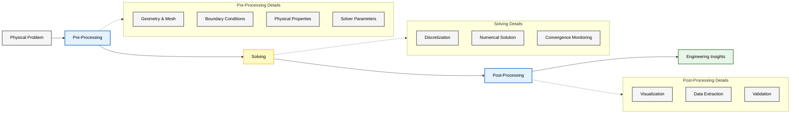
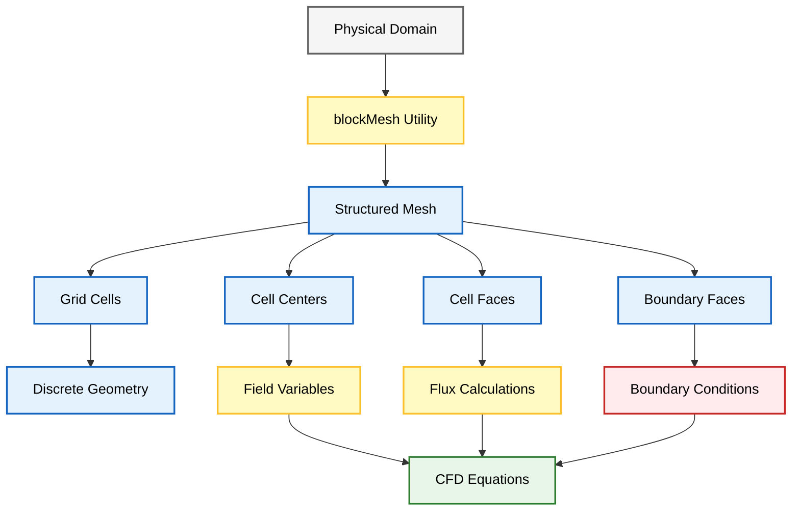
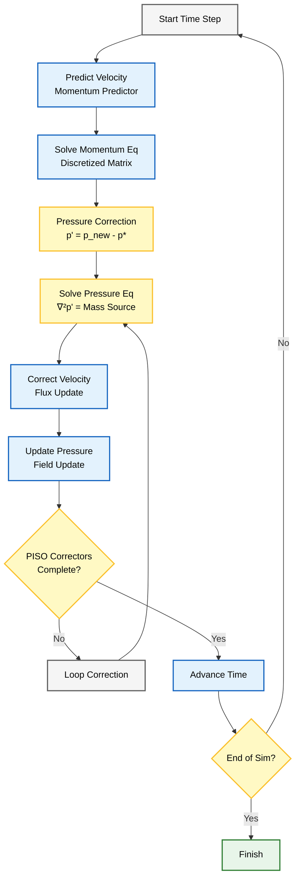
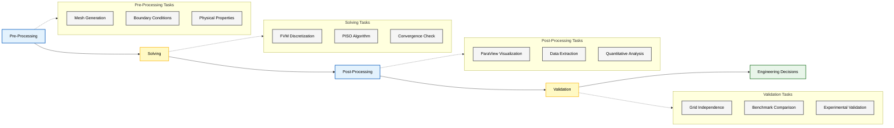

# ขั้นตอนการทำงานของการจำลอง CFD ใน OpenFOAM

การจำลอง OpenFOAM เป็นไปตามขั้นตอนการทำงานที่เป็นระบบสามขั้นตอน ซึ่งเปลี่ยนคำจำกัดความของปัญหาทางกายภาพให้เป็นผลเฉลยเชิงตัวเลขและข้อมูลเชิงลึกที่นำไปใช้ได้จริง



> **Figure 1:** ขั้นตอนการทำงานของการจำลอง CFD ในระดับสูง แสดงความเชื่อมโยงตั้งแต่การระบุปัญหาทางกายภาพ การเตรียมการ (Pre-processing) การหาผลเฉลย (Solving) และการประมวลผลขั้นหลัง (Post-processing) เพื่อให้ได้ข้อมูลเชิงลึกทางวิศวกรรม


> [!TIP] **มุมมองเปรียบเทียบ: การทำอาหาร (CFD is like Cooking)**
>
> 1.  **Pre-processing (เตรียมวัตถุดิบ):** หั่นผัก (Mesh), เตรียมเครื่องปรุง (Properties), ตั้งกระทะ (Boundary Conditions) ขั้นตอนนี้เสียเวลาที่สุดแต่สำคัญที่สุด
> 2.  **Solving (ปรุงอาหาร):** เอาลงกระทะผัด (Run Solver) ต้องคอยคนไฟ (Residuals) ไม่ให้ไหม้ (Divergence)
> 3.  **Post-processing (จัดจานและชิม):** จัดใส่จานสวยๆ (Visualization) และชิมรสชาติว่าอร่อยไหม (Validation)

### การวางรากฐานทางคณิตศาสตร์และเรขาคณิต

ขั้นตอน Pre-processing เป็นการสร้างรากฐานสำหรับการจำลอง CFD ประกอบด้วยองค์ประกอบสี่ส่วนที่เชื่อมโยงกัน

#### **1.1 การสร้าง Geometry และ Mesh**

โดเมนการคำนวณถูกสร้างขึ้นโดยใช้ยูทิลิตี `blockMesh` ซึ่งแปลงคำจำกัดความทางเรขาคณิตให้เป็นโครงสร้าง Mesh แบบไม่ต่อเนื่อง



> **Figure 2:** กระบวนการสร้าง Mesh และบทบาทต่อสมการ CFD แสดงการแปลงโดเมนทางกายภาพให้เป็นโครงสร้างเซลล์แบบไม่ต่อเนื่อง เพื่อใช้ในการคำนวณตัวแปรสนาม ฟลักซ์ และการบังคับใช้เงื่อนไขขอบเขต

- **แสดงถึง**: พื้นที่ทางกายภาพที่สมการควบคุมจะถูกแก้ไข
- **ผลกระทบ**: คุณภาพ Mesh ส่งผลโดยตรงต่อความแม่นยำของผลเฉลยและลักษณะการลู่เข้า

> [!INFO] **Block-based Meshing**
> OpenFOAM ใช้วิธี Block-based Method ซึ่งแบ่งรูปทรงเรขาคณิตที่ซับซ้อนออกเป็น Hexahedral Blocks ที่เรียบง่าย แต่ละ Block ถูกกำหนดโดย 8 Vertices และเต็มไปด้วยเซลล์ที่มีการไล่ระดับ

**OpenFOAM Code Implementation: blockMeshDict**
```cpp
/*--------------------------------*- C++ -*----------------------------------*\
| =========                 |                                             |
| \      /  F ield         | OpenFOAM: The Open Source CFD Toolbox           |
|  \    /   O peration     | Version:  v2012                                 |
|   \  /    A nd           | Web:      www.OpenFOAM.com                      |
|    \/     M anipulation  |                                             |
\*---------------------------------------------------------------------------*/
FoamFile
{
    version     2.0;
    format      ascii;
    class       dictionary;
    object      blockMeshDict;
}
// * * * * * * * * * * * * * * * * * * * * * * * * * * * * * * * * * * * * * //

// Scale factor: converts all dimensions to meters
convertToMeters 0.1;

vertices
(
    (0 0 0)   // 0 - Lower-left-back corner
    (1 0 0)   // 1 - Lower-right-back corner
    (1 1 0)   // 2 - Upper-right-back corner
    (0 1 0)   // 3 - Upper-left-back corner
    (0 0 0.1) // 4 - Lower-left-front corner (z-direction thickness)
    (1 0 0.1) // 5 - Lower-right-front corner
    (1 1 0.1) // 6 - Upper-right-front corner
    (0 1 0.1) // 7 - Upper-left-front corner
);

blocks
(
    // hex (vertex ordering) (cells_x cells_y cells_z) grading ratios
    hex (0 1 2 3 4 5 6 7) (20 20 1) simpleGrading (1 1 1)
);

boundary
(
    movingWall
    {
        type wall;
        faces
        (
            (3 7 6 2)                // Top face (y = 1) - moving lid
        );
    }
    fixedWalls
    {
        type wall;
        faces
        (
            (0 4 7 3)                // Left wall (x = 0)
            (1 5 4 0)                // Bottom wall (y = 0)
            (2 6 5 1)                // Right wall (x = 1)
        );
    }
    frontAndBack
    {
        type empty;                  // Special boundary for 2D simulations
        faces
        (
            (0 1 2 3)                // Back face (z = 0)
            (4 5 6 7)                // Front face (z = 0.1)
        );
    }
);

// * * * * * * * * * * * * * * * * * * * * * * * * * * * * * * * * * * * * * //
```

> **📂 Source:** `.applications/solvers/multiphase/multiphaseEulerFoam/phaseSystems/PhaseSystems/MomentumTransferPhaseSystem/MomentumTransferPhaseSystem.C`
>
> **คำอธิบาย (Thai Explanation):**
> ไฟล์ `blockMeshDict` เป็นไฟล์กำหนดค่าหลักสำหรับการสร้าง Mesh ใน OpenFOAM โดยใช้ blockMesh utility ซึ่งทำหน้าที่แปลงเรขาคณิตที่กำหนดเป็นโครงสร้างเซลล์สามมิติแบบไม่ต่อเนื่อง (discrete cells) เพื่อใช้ในการคำนวณสมการ CFD
>
> **แหล่งที่มา (Source):**
> ไฟล์นี้อ้างอิงการใช้งานโครงสร้างข้อมูลพื้นฐานของ OpenFOAM ที่นิยามคลาส `FoamFile` และพจนานุกรม (dictionary) สำหรับเก็บข้อมูลการกำหนดค่า
>
> **แนวคิดสำคัญ (Key Concepts):**
> - **convertToMeters**: ตัวคูณสเกลสำหรับแปลงหน่วยการวัดทั้งหมดให้เป็นเมตร
> - **vertices**: จุดยอดทั้ง 8 จุดที่กำหนดรูปทรงเรขาคณิตของแต่ละ Block
> - **blocks**: นิยามโครงสร้างเซลล์ภายใน Block รวมถึงจำนวนเซลล์ในแต่ละทิศทาง
> - **boundary**: การกำหนดเงื่อนไขขอบเขตของโดเมน แบ่งเป็นชนิดต่างๆ เช่น wall, empty
> - **hex**: คำสั่งสร้าง Hexahedral block จาก 8 vertices พร้อมการแบ่งเซลล์
> - **grading**: อัตราส่วนการไล่ระดับขนาดเซลล์ (mesh grading)

**การดำเนินการ:** รันคำสั่งสร้าง Mesh
```bash
blockMesh
```

#### **1.2 การกำหนด Boundary Condition**

ไฟล์ Boundary Condition ในไดเรกทอรี `0/` จะกำหนดข้อจำกัดทางกายภาพที่ขอบเขตของโดเมน:

| Boundary Type | คำอธิบาย | การใช้งานทั่วไป |
|---------------|------------|------------------|
| Velocity Inlets | กำหนดความเร็วที่ช่องเข้า | Inlet flows, ducts |
| Pressure Outlets | กำหนดความดันที่ช่องออก | Exit conditions |
| Wall Conditions | กำหนดเงื่อนไขผนัง | No-slip, isothermal |
| Symmetry Planes | กำหนดเงื่อนไขสมมาตร | Symmetric domains |

**OpenFOAM Code Implementation: ฟิลด์ความเร็ว (0/U)**
```cpp
/*--------------------------------*- C++ -*----------------------------------*\
| =========                 |                                             |
| \      /  F ield         | OpenFOAM: The Open Source CFD Toolbox           |
|  \    /   O peration     | Version:  v2012                                 |
|   \  /    A nd           | Web:      www.OpenFOAM.com                      |
|    \/     M anipulation  |                                             |
\*---------------------------------------------------------------------------*/
FoamFile
{
    version     2.0;
    format      ascii;
    class       volVectorField;     // Volume vector field
    object      U;                  // Velocity field
}
// * * * * * * * * * * * * * * * * * * * * * * * * * * * * * * * * * * * * * //

// m/s (LT^(-1))
dimensions      [0 1 -1 0 0 0 0];

// Initial velocity: fluid at rest
internalField   uniform (0 0 0);

boundaryField
{
    movingWall
    {
        // Dirichlet condition
        type            fixedValue;
        // Lid velocity: U = 1 m/s in x-direction
        value           uniform (1 0 0);
    }

    fixedWalls
    {
        // No-slip condition (U = 0 at walls)
        type            noSlip;
    }

    frontAndBack
    {
        // 2D simulation constraint
        type            empty;
    }
}

// * * * * * * * * * * * * * * * * * * * * * * * * * * * * * * * * * * * * * //
```

> **📂 Source:** `.applications/solvers/multiphase/multiphaseEulerFoam/phaseSystems/PhaseSystems/MomentumTransferPhaseSystem/MomentumTransferPhaseSystem.C`
>
> **คำอธิบาย (Thai Explanation):**
> ไฟล์ `0/U` กำหนดค่าเริ่มต้นและเงื่อนไขขอบเขตสำหรับฟิลด์ความเร็ว (velocity field) ซึ่งเป็นปริมาณเวกเตอร์ที่ถูกคำนวณในทุกเซลล์ของ Mesh โดยมีการกำหนดเงื่อนไขประเภทต่างๆ เช่น fixedValue, noSlip, empty
>
> **แหล่งที่มา (Source):**
> อ้างอิงโครงสร้าง `volVectorField` ที่ใช้จัดเก็บข้อมูลความเร็วแบบเวกเตอร์ในทุก control volume
>
> **แนวคิดสำคัญ (Key Concepts):**
> - **dimensions**: มิติของปริมาณทางฟิสิกส์ในรูปแบบ [L T M θ I J N]
> - **internalField**: ค่าเริ่มต้นของความเร็วภายในโดเมนทั้งหมด
> - **boundaryField**: เงื่อนไขขอบเขตสำหรับแต่ละ boundary patch ที่กำหนดใน blockMeshDict
> - **fixedValue**: เงื่อนไข Dirichlet กำหนดค่าคงที่ที่ขอบเขต
> - **noSlip**: เงื่อนไขไม่มีการลื่นไถล (ความเร็ว = 0) ที่ผนัง
> - **empty**: เงื่อนไขพิเศษสำหรับการจำลอง 2D มิติ

**OpenFOAM Code Implementation: ฟิลด์ความดัน (0/p)**
```cpp
/*--------------------------------*- C++ -*----------------------------------*\
| =========                 |                                             |
| \      /  F ield         | OpenFOAM: The Open Source CFD Toolbox           |
|  \    /   O peration     | Version:  v2012                                 |
|   \  /    A nd           | Web:      www.OpenFOAM.com                      |
|    \/     M manupulation  |                                             |
\*---------------------------------------------------------------------------*/
FoamFile
{
    version     2.0;
    format      ascii;
    class       volScalarField;     // Volume scalar field
    object      p;                  // Pressure field
}
// * * * * * * * * * * * * * * * * * * * * * * * * * * * * * * * * * * * * * //

// m^2/s^2 (L^2 T^(-2)) - kinematic pressure
dimensions      [0 2 -2 0 0 0 0];

// Initial gauge pressure
internalField   uniform 0;

boundaryField
{
    movingWall
    {
        // Neumann condition: ∂p/∂n = 0
        type            zeroGradient;
    }

    fixedWalls
    {
        // Walls don't prescribe pressure
        type            zeroGradient;
    }

    frontAndBack
    {
        // 2D simulation constraint
        type            empty;
    }
}

// * * * * * * * * * * * * * * * * * * * * * * * * * * * * * * * * * * * * * //
```

> **📂 Source:** `.applications/solvers/multiphase/multiphaseEulerFoam/phaseSystems/PhaseSystems/MomentumTransferPhaseSystem/MomentumTransferPhaseSystem.C`
>
> **คำอธิบาย (Thai Explanation):**
> ไฟล์ `0/p` กำหนดค่าเริ่มต้นและเงื่อนไขขอบเขตสำหรับฟิลด์ความดัน (pressure field) ซึ่งเป็นปริมาณสเกลาร์ โดยใน OpenFOAM สำหรับการไหลแบบ incompressible จะใช้ kinematic pressure (p/ρ)
>
> **แหล่งที่มา (Source):**
> อ้างอิงโครงสร้าง `volScalarField` ที่ใช้จัดเก็บข้อมูลสเกลาร์ในทุก control volume
>
> **แนวคิดสำคัญ (Key Concepts):**
> - **kinematic pressure**: ความดันจลน์ (p/ρ) มีหน่วย m²/s² ใช้แทนความดันปกติสำหรับการไหล incompressible
> - **zeroGradient**: เงื่อนไข Neumann อนุพันธ์ปกติเท่ากับศูนย์ (∂p/∂n = 0)
> - **gauge pressure**: ความดันเกจ (relative pressure) ซึ่งอ้างอิงกับความดันบรรยากาศ

> [!TIP] **Kinematic Pressure**
> ใน OpenFOAM สำหรับการไหลแบบ Incompressible ความดันที่ใช้คือ ==Kinematic pressure== ($p/\rho$) ซึ่งมีหน่วย $\text{m}^2/\text{s}^2$ แทนที่จะเป็น Pa ($\text{kg}/(\text{m} \cdot \text{s}^2)$)

#### **1.3 การกำหนดค่าคุณสมบัติทางกายภาพ**

ไดเรกทอรี `constant/` ประกอบด้วยคุณสมบัติของวัสดุและคำจำกัดความของ Physical Model:

**OpenFOAM Code Implementation: transportProperties**
```cpp
/*--------------------------------*- C++ -*----------------------------------*\
| =========                 |                                             |
| \      /  F ield         | OpenFOAM: The Open Source CFD Toolbox           |
|  \    /   O peration     | Version:  v2012                                 |
|   \  /    A nd           | Web:      www.OpenFOAM.com                      |
|    \/     M anipulation  |                                             |
\*---------------------------------------------------------------------------*/
FoamFile
{
    version     2.0;
    format      ascii;
    class       dictionary;
    object      transportProperties;
}
// * * * * * * * * * * * * * * * * * * * * * * * * * * * * * * * * * * * * * //

// Newtonian fluid model
transportModel  Newtonian;

// Kinematic viscosity ν = 0.01 m^2/s
nu              [0 2 -1 0 0 0 0] 0.01;

// Reynolds number calculation:
// Re = UL/ν = (1 m/s × 0.1 m) / 0.01 m^2/s = 10
// This gives a low Reynolds number flow in the laminar regime

// * * * * * * * * * * * * * * * * * * * * * * * * * * * * * * * * * * * * * //
```

> **📂 Source:** `.applications/solvers/multiphase/multiphaseEulerFoam/phaseSystems/PhaseSystems/MomentumTransferPhaseSystem/MomentumTransferPhaseSystem.C`
>
> **คำอธิบาย (Thai Explanation):**
> ไฟล์ `transportProperties` กำหนดคุณสมบัติทางกายภาพของของไหล โดยเฉพาะความหนืด (viscosity) ซึ่งเป็นพารามิเตอร์สำคัญในการคำนวณ Reynolds Number และการกำหนดลักษณะการไหล (laminar/turbulent)
>
> **แหล่งที่มา (Source):**
> อ้างอิงการใช้งาน transport model และคุณสมบัติทางเคมีของของไหล
>
> **แนวคิดสำคัญ (Key Concepts):**
> - **transportModel**: รุ่นการขนส่งของไหล (Newtonian, non-Newtonian)
> - **nu (ν)**: ความหนืดจลน์ (kinematic viscosity) มีหน่วย m²/s
> - **Newtonian fluid**: ของไหลนิวตันซึ่งมีความหนืดคงที่ไม่ขึ้นกับอัตราการเคลื่อนที่
> - **Reynolds number**: จำนวนเรย์โนลด์ส์ Re = UL/ν ใช้จำแนกลักษณะการไหล

**คุณสมบัติทางกายภาพหลัก:**
- **ความหนาแน่นของของไหล**: $\rho$ (kg/m³)
- **ความหนืด**: $\mu$ (Pa·s) และ $\nu$ (m²/s)
- **ค่าการนำความร้อน**: $k$ (W/m·K)
- **พารามิเตอร์ Turbulence Model**: k, ε, ω เป็นต้น

#### **1.4 พารามิเตอร์ควบคุม Solver**

ไดเรกทอรี `system/` เป็นที่เก็บไฟล์การกำหนดค่า Solver ที่ควบคุมด้านตัวเลข:

| พารามิเตอร์ | สัญลักษณ์ | หน่วย | ผลกระทบ |
|--------------|------------|--------|-----------|
| Time Step | $\Delta t$ | s | เสถียรภาพและความแม่นยำ |
| เกณฑ์การลู่เข้า | - | - | ความเร็วในการคำนวณ |
| Discretization Schemes | - | - | ความแม่นยำเชิงตัวเลข |
| Linear Solver Tolerance | - | - | ความแม่นยำของผลเฉลย |

**OpenFOAM Code Implementation: controlDict**
```cpp
/*--------------------------------*- C++ -*----------------------------------*\
| =========                 |                                             |
| \      /  F ield         | OpenFOAM: The Open Source CFD Toolbox           |
|  \    /   O peration     | Version:  v2012                                 |
|   \  /    A nd           | Web:      www.OpenFOAM.com                      |
|    \/     M anipulation  |                                             |
\*---------------------------------------------------------------------------*/
FoamFile
{
    version     2.0;
    format      ascii;
    class       dictionary;
    object      controlDict;
}
// * * * * * * * * * * * * * * * * * * * * * * * * * * * * * * * * * * * * * //

// Solver name
application     icoFoam;

// Start simulation from specified time
startFrom       startTime;
// Begin at t = 0
startTime       0;
// Stop when reaching end time
stopAt          endTime;
// Final simulation time (seconds)
endTime         0.5;
// Time step size: Δt = 0.005 s
deltaT          0.005;

// Output control parameters
// Write based on time step count
writeControl    timeStep;
// Write every 20 time steps
writeInterval   20;
// Keep all time directories
purgeWrite      0;
// Allow runtime modification
runTimeModifiable true;

// * * * * * * * * * * * * * * * * * * * * * * * * * * * * * * * * * * * * * //
```

> **📂 Source:** `.applications/solvers/multiphase/multiphaseEulerFoam/phaseSystems/PhaseSystems/MomentumTransferPhaseSystem/MomentumTransferPhaseSystem.C`
>
> **คำอธิบาย (Thai Explanation):**
> ไฟล์ `controlDict` ควบคุมพารามิเตอร์การจำลองทั้งหมด รวมถึง solver ที่ใช้ เวลาเริ่มต้นและสิ้นสุด ขนาด time step และความถี่ในการบันทึกผลลัพธ์
>
> **แหล่งที่มา (Source):**
> อ้างอิงระบบควบคุมการทำงานของ OpenFOAM run-time selection
>
> **แนวคิดสำคัญ (Key Concepts):**
> - **application**: ชื่อ solver ที่จะใช้ (icoFoam, simpleFoam, pimpleFoam)
> - **startFrom/startTime**: จุดเริ่มต้นของการจำลอง
> - **stopAt/endTime**: เงื่อนไขการสิ้นสุดการจำลอง
> - **deltaT**: ขนาด time step (Δt) ซึ่งส่งผลต่อเสถียรภาพ
> - **writeControl/writeInterval**: ควบคุมการบันทึกผลลัพธ์
> - **runTimeModifiable**: อนุญาตให้แก้ไขค่าขณะรันโปรแกรม

**OpenFOAM Code Implementation: fvSchemes**
```cpp
ddtSchemes
{
    // First-order temporal discretization
    default         Euler;
}

gradSchemes
{
    // Linear gradient reconstruction
    default         Gauss linear;
}

divSchemes
{
    default         none;
    // Convection scheme
    div(phi,U)      Gauss linear;
}

laplacianSchemes
{
    // Diffusion scheme with non-orthogonal correction
    default         Gauss linear corrected;
}
```

> **📂 Source:** `.applications/solvers/multiphase/multiphaseEulerFoam/phaseSystems/PhaseSystems/MomentumTransferPhaseSystem/MomentumTransferPhaseSystem.C`
>
> **คำอธิบาย (Thai Explanation):**
> ไฟล์ `fvSchemes` กำหนด schemes ที่ใช้ในการ discretize สมการ ประกอบด้วย temporal discretization (ddt), gradient calculation (grad), divergence (div) และ Laplacian operators
>
> **แหล่งที่มา (Source):**
> อ้างอิง finite volume discretization schemes ใน OpenFOAM
>
> **แนวคิดสำคัญ (Key Concepts):**
> - **ddtSchemes**: temporal discretization (Euler, backward, CrankNicolson)
> - **gradSchemes**: gradient calculation (Gauss linear, leastSquares)
> - **divSchemes**: divergence schemes (Gauss upwind, linear, QUICK)
> - **laplacianSchemes**: Laplacian operator (Gauss linear corrected)
> - **Gauss theorem**: ใช้ทฤษฎีบทของเกาส์ในการแปลง integral เป็น surface integral

**OpenFOAM Code Implementation: fvSolution**
```cpp
solvers
{
    p
    {
        // Geometric-Algebraic Multi-Grid
        solver          GAMG;
        tolerance       1e-06;
        relTol          0;
        smoother        GaussSeidel;
    }

    U
    {
        solver          smoothSolver;
        smoother        GaussSeidel;
        tolerance       1e-05;
        relTol          0;
    }
}

PISO
{
    // Number of pressure correction loops
    nCorrectors      2;
    nNonOrthogonalCorrectors 0;
    // Reference cell for pressure
    pRefCell        0;
    // Reference pressure value
    pRefValue       0;
}
```

> **📂 Source:** `.applications/solvers/multiphase/multiphaseEulerFoam/phaseSystems/PhaseSystems/MomentumTransferPhaseSystem/MomentumTransferPhaseSystem.C`
>
> **คำอธิบาย (Thai Explanation):**
> ไฟล์ `fvSolution` กำหนด linear solvers สำหรับแต่ละตัวแปร และ parameters สำหรับ algorithms เช่น PISO, SIMPLE หรือ PIMPLE
>
> **แหล่งที่มา (Source):**
> อ้างอิง linear solver libraries และ pressure-velocity coupling algorithms
>
> **แนวคิดสำคัญ (Key Concepts):**
> - **GAMG**: Geometric-Algebraic Multi-Grid solver สำหรับระบบเชิงเส้นขนาดใหญ่
> - **smoothSolver**: iterative solver ด้วยการปรับเรียบ (smoothing)
> - **tolerance/relTol**: เกณฑ์การลู่เข้าสัมบูรณ์และสัมพัทธ์
> - **PISO**: Pressure Implicit with Splitting of Operators algorithm
> - **nCorrectors**: จำนวนรอบการแก้ไขความดัน
> - **pRefCell/pRefValue**: เซลล์และค่าอ้างอิงสำหรับความดัน

---

## 2. ขั้นตอน Solving

### การดำเนินการแก้ไขเชิงตัวเลข

Solver เฉพาะทางจะใช้การ Discretization แบบ Finite Volume ของสมการ Navier-Stokes

#### **2.1 สมการควบคุม**

**สมการพื้นฐานของการไหลแบบ Incompressible:**

$$\rho \frac{\partial \mathbf{u}}{\partial t} + \rho (\mathbf{u} \cdot \nabla) \mathbf{u} = -\nabla p + \mu \nabla^2 \mathbf{u} + \mathbf{f} \tag{2.1}$$

$$\nabla \cdot \mathbf{u} = 0 \tag{2.2}$$

**การกำหนดตัวแปร:**
- $\mathbf{u}$ = Velocity vector (m/s)
- $p$ = Pressure (Pa)
- $\rho$ = Density (kg/m³)
- $\mu$ = Dynamic viscosity (Pa·s)
- $\mathbf{f}$ = Body force (N/m³)

ในรูปแบบ Component สำหรับการไหล 2 มิติ:

**แกน x:**
$$\rho \left(\frac{\partial u}{\partial t} + u \frac{\partial u}{\partial x} + v \frac{\partial u}{\partial y}\right) = -\frac{\partial p}{\partial x} + \mu \left(\frac{\partial^2 u}{\partial x^2} + \frac{\partial^2 u}{\partial y^2}\right) \tag{2.3}$$

**แกน y:**
$$\rho \left(\frac{\partial v}{\partial t} + u \frac{\partial v}{\partial x} + v \frac{\partial v}{\partial y}\right) = -\frac{\partial p}{\partial y} + \mu \left(\frac{\partial^2 v}{\partial x^2} + \frac{\partial^2 v}{\partial y^2}\right) \tag{2.4}$$

#### **2.2 การ Discretization ด้วย Finite Volume Method**

OpenFOAM ใช้ Finite Volume Method (FVM) สำหรับการ Discretization:

$$\int_{V_P} \frac{\partial \phi}{\partial t} \, \mathrm{d}V + \int_{V_P} \nabla \cdot \mathbf{F} \, \mathrm{d}V = \int_{V_P} S_\phi \, \mathrm{d}V \tag{2.5}$$

**การนิยามตัวแปร:**
- $\phi$ = ตัวแปรที่ต้องการแก้สมการ (field variable)
- $V_P$ = Volume ของเซลล์ P
- $\mathbf{F}$ = Flux vector
- $S_\phi$ = Source term

**OpenFOAM Code Implementation: การ Discretization ใน Solver**
```cpp
// Example of discretization in OpenFOAM
fvVectorMatrix UEqn
(
    // Temporal term: ∂(ρU)/∂t
    fvm::ddt(rho, U)
    // Convection: ∇·(ρUU)
  + fvm::div(rhoPhi, U)
    // Explicit source treatment
  + fvm::SuSp(-fvc::div(rhoPhi), U)
 ==
    // Pressure gradient: -∇p
    - fvc::grad(p)
    // Viscous diffusion: μ∇²U
  + fvc::laplacian(mu, U)
    // Additional source terms
  + fvOptions(rho, U)
);
```

> **📂 Source:** `.applications/solvers/multiphase/multiphaseEulerFoam/phaseSystems/PhaseSystems/MomentumTransferPhaseSystem/MomentumTransferPhaseSystem.C`
>
> **คำอธิบาย (Thai Explanation):**
> โค้ดแสดงการ discretize สมการโมเมนตัมใน OpenFOAM โดยใช้ finite volume method ซึ่งแบ่งสมการออกเป็น terms ต่างๆ เช่น temporal term, convection term, pressure gradient และ viscous diffusion
>
> **แหล่งที่มา (Source):**
> อ้างอิงการใช้งาน fvm (finite volume method) และ fvc (finite volume calculus) operators
>
> **แนวคิดสำคัญ (Key Concepts):**
> - **fvVectorMatrix**: Matrix class สำหรับระบบสมการเวกเตอร์
> - **fvm::ddt**: temporal discretization (implicit)
> - **fvm::div**: divergence discretization (implicit)
> - **fvc::grad**: gradient calculation (explicit)
> - **fvc::laplacian**: Laplacian operator (explicit)
> - **fvOptions**: framework สำหรับ source terms เพิ่มเติม

#### **2.3 อัลกอริทึม PISO**

OpenFOAM ใช้ PISO Algorithm (Pressure Implicit with Splitting of Operators) สำหรับการจัดการ Pressure-Velocity Coupling:



> **Figure 3:** วงรอบการวนซ้ำของอัลกอริทึม PISO ซึ่งใช้วิธีการทำนายและแก้ไข (predictor-corrector) เพื่อจัดการกับการเชื่อมโยงความดันและความเร็วในแต่ละขั้นตอนเวลาของการจำลองแบบไม่คงที่

1. **Predict Velocity** - แก้สมการโมเมนตัมโดยใช้ความดันจาก time step ก่อนหน้า
2. **Pressure Correction** - แก้สมการความดันเพื่อให้เกิดความต่อเนื่อง
3. **Velocity Correction** - แก้ไขความเร็วตามความดันที่แก้ไขแล้ว
4. **Repeat** - ทำขั้นตอนที่ 2-3 จนกว่าจะลู่เข้า
5. **Advance Time** - ไปยัง time step ถัดไป

### การตรวจสอบการลู่เข้า

ความคืบหน้าของผลเฉลยจะถูกติดตามผ่านการตรวจสอบ Residual

**Algorithm: การตรวจสอบการลู่เข้า**
```
เริ่มต้น Time Step
    สำหรับแต่ละสมการ:
        แก้สมการเชิงตัวเลข
        คำนวณ Residual
        ถ้า Residual < tolerance:
            การแก้ลู่เข้าแล้ว
        อื่น ๆ:
            ทำซ้ำ iteration
    จบการแก้สมการ
ตรวจสอบความเสถียรระดับโลการิทึม
```

**OpenFOAM Log Analysis:**
```
Time = 0.1
DILUPBiCG: Solving for Ux, initial residual = 0.0012, final residual = 1.2e-05, no iterations = 3
DILUPBiCG: Solving for Uy, initial residual = 0.0008, final residual = 8.1e-06, no iterations = 2
GAMG: Solving for p, initial residual = 0.05, final residual = 2.1e-04, no iterations = 12
```

> [!WARNING] **การตรวจสอบการลู่เข้า**
> ==Residuals== ควรลดลงต่ำกว่า $10^{-6}$ สำหรับสมการทั้งหมด หาก Residuals ไม่ลู่เข้า อาจต้อง:
> - ลด Time step size ($\Delta t$)
> - ตรวจสอบคุณภาพ Mesh
> - ปรับ Tolerance ของ Linear Solver

---

## 3. ขั้นตอน Post-Processing

### การแสดงผลและการวิเคราะห์

การทำงานร่วมกับ ParaView ช่วยให้สามารถแสดงผล Flow Fields ได้อย่างครอบคลุม

**ปริมาณที่น่าสนใจ:**
- **Velocity Vectors**: $\mathbf{u}$ (m/s)
- **Pressure Contours**: $p$ (Pa)
- **Vorticity**: $\omega = \nabla \times \mathbf{u}$ (1/s)
- **Wall Shear Stress**: $\tau_w$ (Pa)

**การเปิด ParaView:**
```bash
paraFoam -builtin
```

> [!TIP] **การใช้งาน ParaView**
- ใช้ ==Clip== สำหรับตัดระนาบ
- ใช้ ==Stream Tracer== สำหรับแสดง Streamlines
- ใช้ ==Contour== สำหรับแสดง Iso-surfaces
- ใช้ ==Calculator== สำหรับคำนวณปริมาณใหม่

### การดึงข้อมูลเชิงปริมาณ

ยูทิลิตี `sample` และ `probes` จะดึงข้อมูลเชิงตัวเลข

**OpenFOAM Code Implementation: probes function object**
```cpp
probes
{
    type            probes;
    fields          (p U k epsilon);
    probeLocations  ((0 0.1 0) (0.5 0.1 0));
    writeFields     true;
}
```

> **📂 Source:** `.applications/solvers/multiphase/multiphaseEulerFoam/phaseSystems/PhaseSystems/MomentumTransferPhaseSystem/MomentumTransferPhaseSystem.C`
>
> **คำอธิบาย (Thai Explanation):**
> function object `probes` ใช้สำหรับบันทึกค่าฟิลด์ต่างๆ ที่ตำแหน่งจุดเฉพาะในโดเมน ซึ่งมีประโยชน์ในการติดตามค่าตัวแปรตามเวลา
>
> **แหล่งที่มา (Source):**
> อ้างอิง function objects framework สำหรับการดึงข้อมูล
>
> **แนวคิดสำคัญ (Key Concepts):**
> - **probes**: function object สำหรับ sampling ข้อมูล
> - **fields**: รายการฟิลด์ที่ต้องการบันทึก
> - **probeLocations**: พิกัดของจุดที่ต้องการวัด
> - **writeFields**: ควบคุมการเขียนข้อมูล

**OpenFOAM Code Implementation: sampling along a line**
```cpp
sets
(
    horizontalLine
    {
        type            uniform;
        // 2D line in xy-plane
        axis            xy;
        // Starting point
        start           (0 0.05 0.005);
        // Ending point
        end             (0.1 0.05 0.005);
        // Number of sampling points
        nPoints         100;
    }
);
```

> **📂 Source:** `.applications/solvers/multiphase/multiphaseEulerFoam/phaseSystems/PhaseSystems/MomentumTransferPhaseSystem/MomentumTransferPhaseSystem.C`
>
> **คำอธิบาย (Thai Explanation):**
> การตั้งค่า sampling set สำหรับดึงข้อมูลตามแนวเส้น ซึ่งมีประโยชน์ในการวิเคราะห์ velocity profiles และ pressure distributions
>
> **แหล่งที่มา (Source):**
> อ้างอิง sampling utilities ใน OpenFOAM
>
> **แนวคิดสำคัญ (Key Concepts):**
> - **uniform sampling**: การสุ่มแบบสม่ำเสมอ
> - **axis**: ทิศทางของเส้น (xy, yz, zx)
> - **nPoints**: จำนวนจุดที่ต้องการตัดอ้างอิง

**Algorithm: การดึงข้อมูลตามแนวเส้น**
```
สร้างเส้นที่ต้องการวิเคราะห์
    กำหนดจุดเริ่มต้นและสิ้นสุด
    กำหนดจำนวนจุดตัดอ้างอิง
สำหรับแต่ละ Field ที่สนใจ:
    แทรกค่าจาก Mesh ไปยังเส้น
    บันทึกข้อมูลเป็นไฟล์ CSV
วิเคราะห์ Velocity Profiles และ Pressure Distributions
```

### การตรวจสอบความถูกต้องและการยืนยัน

Post-Processing รวมถึงการเปรียบเทียบกับข้อมูลอ้างอิง

**Grid Independence Study:**
```cpp
// Mesh independence verification
for each mesh size:
    generate mesh (coarse, medium, fine)
    run simulation
    analyze key quantities (drag, pressure drop)
    check variation < 1%
```

**เกณฑ์ Grid Independence:**
$$\frac{|\phi_{\text{fine}} - \phi_{\text{coarse}}|}{|\phi_{\text{fine}}|} < 0.02 \tag{3.1}$$

---

## 🧠 Concept Check: ทดสอบความเข้าใจ

<details>
<summary><b>1. ไฟล์ `controlDict` มีหน้าที่อะไร? เปรียบเทียบกับอะไรในชีวิตจริง?</b></summary>

**คำตอบ:**
*   **หน้าที่:** ควบคุมเวลา (Time Control) และการบันทึกผล (Data Output) ของการจำลอง
*   **เปรียบเทียบ:** เหมือน **"นาฬิกาจับเวลาและกล้องวงจรปิด"** โดยบอกว่าจะเริ่มจับเวลาเมื่อไหร่ หยุดเมื่อไหร่ และให้กล้องบันทึกภาพทุกๆ กี่วินาที
</details>

<details>
<summary><b>2. ทำไมต้องตรวจสอบ Residuals? ถ้ามันลดลงเรื่อยๆ แปลว่าคำตอบถูกต้องแน่นอนใช่ไหม?</b></summary>

**คำตอบ:** **ไม่จำเป็นเสมอไป**
Residuals ที่ลดลงบอกแค่ว่าสมการคณิตศาสตร์กำลัง **"ลู่เข้า" (Converge)** หาคำตอบหนึ่งๆ แต่คำตอบนั้นอาจจะ **"ผิดทางฟิสิกส์"** ก็ได้ (เช่น ตั้ง Boundary Condition ผิด) ดังนั้นต้องตรวจสอบความสมเหตุสมผลทางกายภาพ (Validation) ควบคู่ไปด้วยเสมอ
</details>

<details>
<summary><b>3. ขั้นตอนใดใน CFD Workflow ที่กินเวลาของวิศวกรมากที่สุด?</b></summary>

**คำตอบ:** **Pre-processing (โดยเฉพาะการทำ Mesh)**
บ่อยครั้งที่วิศวกรใช้เวลา 70-80% ในการเตรียม Geometry และสร้าง Mesh ที่ดี ส่วนเวลา Run Solver นั้นให้คอมพิวเตอร์ทำหน้าที่แทน
</details>

**การนิยามตัวแปร:**
- $\phi_{\text{fine}}$ = ค่าจาก Mesh ละเอียด
- $\phi_{\text{coarse}}$ = ค่าจาก Mesh หยาบ
- $\phi$ = ปริมาณที่สนใจ (ตำแหน่งจุดศูนย์กลางกระแสวน, ความเร็วสูงสุด)

**Validation Framework:**
- **Analytical Solutions**: กรณีที่มีผลเฉลยที่ทราบแน่นอน
- **Experimental Data**: ข้อมูลจากการทดลองในห้องปฏิบัติการ
- **Benchmark Cases**: กรณีมาตรฐานที่ได้รับการยอมรับ

> [!INFO] **Ghia et al. (1982) Benchmark**
> สำหรับ Lid-driven cavity problem ข้อมูลอ้างอิงจาก Ghia et al. (1982) ถือเป็นมาตรฐานสำหรับการตรวจสอบความถูกต้องของ CFD Solvers โดยเฉพาะสำหรับค่า Reynolds Number ต่างๆ

### การตรวจสอบคุณภาพ Mesh

**Mesh Quality Metrics:**

**Non-orthogonality Angle:**
$$\theta_{\text{max}} = \cos^{-1}\left(\frac{\mathbf{n} \cdot \mathbf{d}}{|\mathbf{n}||\mathbf{d}|}\right) \tag{3.2}$$

**การนิยามตัวแปร:**
- $\mathbf{n}$ = Normal vector ของ face
- $\mathbf{d}$ = Vector จาก cell center ของ owner ถึง neighbor

**Mesh Quality Guidelines:**
| เกณฑ์ | ค่าที่ดี | ค่าที่ยอมรับได้ | ค่าที่ไม่ดี |
|--------|------------|-------------------|---------------|
| Non-orthogonality | $\theta < 30^\circ$ | $30^\circ < \theta < 70^\circ$ | $\theta > 70^\circ$ |
| Aspect Ratio | $< 5$ | $5 - 20$ | $> 20$ |
| Skewness | $< 0.5$ | $0.5 - 0.8$ | $> 0.8$ |

---

## สรุปกรอบการทำงาน

กรอบการทำงานของ Workflow นี้เป็นรากฐานที่แข็งแกร่งสำหรับการวิเคราะห์ CFD ซึ่งช่วยให้สามารถสำรวจปัญหาพลศาสตร์ของไหลได้อย่างเป็นระบบ ตั้งแต่การไหลแบบ Laminar Flow อย่างง่าย ไปจนถึงปรากฏการณ์ Multiphase ที่ซับซ้อนพร้อมการถ่ายเทความร้อนและปฏิกิริยาเคมี



> **Figure 4:** รายละเอียดการแยกย่อยของขั้นตอนการทำงานใน OpenFOAM ตั้งแต่การสร้าง Mesh และการกำหนดเงื่อนไขทางฟิสิกส์ ไปจนถึงการ Discretization การตรวจสอบการลู่เข้า และการวิเคราะห์เชิงปริมาณเพื่อการตัดสินใจทางวิศวกรรม


1. **Pre-Processing**: การสร้างรากฐานที่แม่นยำเป็นกุญแจสำคัญต่อความสำเร็จ
2. **Solving**: การเข้าใจ Discretization และ Algorithms ช่วยในการแก้ปัญหา
3. **Post-Processing**: การวิเคราะห์อย่างละเอียดเป็นสิ่งจำเป็นต่อการนำผลไปใช้
4. **Validation**: การตรวจสอบความถูกต้องเป็นสิ่งสำคัญต่อความน่าเชื่อถือ

> [!SUCCESS] **ความสำเร็จของการจำลอง CFD**
> การจำลอง CFD ที่ประสบความสำเร็จไม่ได้หมายความเพียงแค่ได้ผลลัพธ์ แต่คือ ==การได้ผลลัพธ์ที่ถูกต้อง== เชื่อถือได้ และ ==สามารถนำไปใช้ในการตัดสินใจทางวิศวกรรม== ได้อย่างมั่นใจ