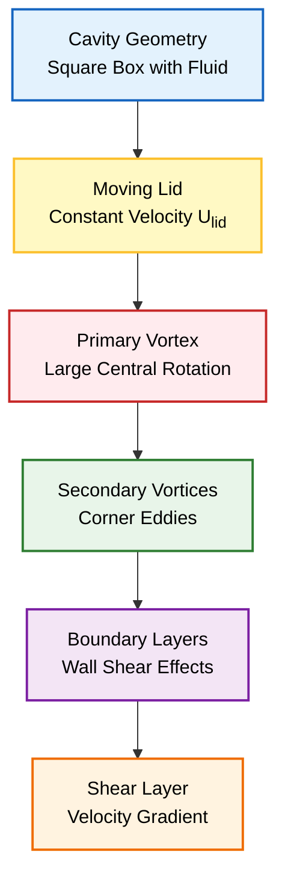
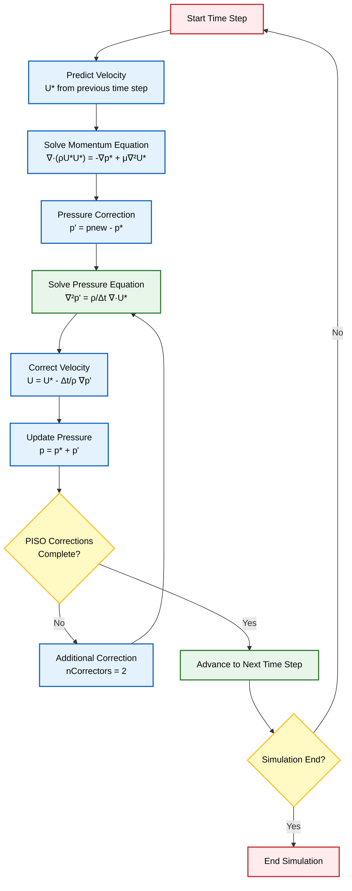

# ปัญหาโพรงขับเคลื่อนด้วยฝา (Lid-Driven Cavity Problem)

> [!INFO] **บทนำ**
> ปัญหา Lid-Driven Cavity เป็น **"Hello World" ของ CFD** ที่ใช้ทดสอบความถูกต้องของ Solver อย่างแพร่หลาย ด้วยรูปทรงเรขาคณิตที่เรียบง่าย แต่มีฟิสิกส์ที่ซับซ้อน

---

## คำอธิบายทางกายภาพ

ลองจินตนาการถึงกล่องสี่เหลี่ยมที่บรรจุของไหลอยู่ **ฝาปิดด้านบนเคลื่อนที่ไปทางขวาด้วยความเร็วคงที่** โดยลากของไหลให้เคลื่อนที่ตามไปด้วย



การจัดวางที่ดูเรียบง่ายนี้สร้างรูปแบบการไหลที่ซับซ้อน ซึ่งทำหน้าที่เป็น **ปัญหาอ้างอิง (benchmark problems)** พื้นฐานที่สุดในพลศาสตร์ของไหลเชิงคำนวณ (Computational Fluid Dynamics หรือ CFD)

**ปัญหา Lid-Driven Cavity ถูกนำมาใช้อย่างแพร่หลายสำหรับการตรวจสอบความถูกต้องของ Numerical Solver** เนื่องจากมีรูปทรงเรขาคณิตที่เรียบง่าย แต่มีฟิสิกส์ที่หลากหลาย

### ลักษณะฟิสิกส์ที่เกิดขึ้น

- **การก่อตัวของ Primary และ Secondary Vortices**
- **การก่อตัวของ Boundary Layer**
- **พลวัตของ Shear Layer ที่รุนแรง**

---

## รูปทรงเรขาคณิตและฟิสิกส์

### พารามิเตอร์ของปัญหา

| พารามิเตอร์ | ค่าที่กำหนด | คำอธิบาย |
|---|---|---|
| **Domain** | โพรงสี่เหลี่ยมจัตุรัส ($L \times L$) | ขอบเขตการจำลอง |
| **Top Wall** | เคลื่อนที่ ($U = 1$ m/s) | ฝาปิดที่เคลื่อนที่ |
| **Other Walls** | หยุดนิ่ง ($U = 0$) | ผนังด้านข้างและด้านล่าง |
| **Fluid** | อัดตัวไม่ได้ (Incompressible), แบบนิวตัน (Newtonian) | ชนิดของของไหล |
| **Flow** | ลามินาร์ (Laminar) ($Re = 100$) | ลักษณะการไหล |

### เลขเรย์โนลด์ (Reynolds Number)

เลขเรย์โนลด์เป็นตัวบ่งชี้ลักษณะการไหลและถูกนิยามดังนี้:

$$Re = \frac{\rho U L}{\mu} = \frac{U L}{\nu} \tag{1}$$

โดยที่:
- $\rho$ คือความหนาแน่นของของไหล (kg/m³)
- $U$ คือความเร็วของฝาปิด (m/s)
- $L$ คือความยาวลักษณะเฉพาะของโพรง (m)
- $\mu$ คือความหนืดจลน์ (dynamic viscosity) (Pa·s)
- $\nu$ คือความหนืดคิเนมาติก (kinematic viscosity) (m²/s)

> [!TIP] **ความสำคัญของ Reynolds Number**
>
> **สำหรับ $Re = 100$ การไหลยังคงเป็นแบบลามินาร์และคงที่** โดยก่อตัวเป็น **Primary Vortex** ที่มีลักษณะเฉพาะอยู่ตรงกลาง และมี **Secondary Corner Vortices** อยู่ที่มุม
>
> Reynolds Number แสดงถึงอัตราส่วนของแรงเฉื่อยต่อแรงหนืด:
>
> $$Re = \frac{\text{Inertial Forces}}{\text{Viscous Forces}} = \frac{\rho \mathbf{u} \cdot \nabla \mathbf{u}}{\mu \nabla^2 \mathbf{u}}$$
>
> ค่า $Re$ ที่สูงขึ้นหมายถึงแรงเฉื่อยมีอิทธิพลเหนือกว่า ทำให้โมเมนตัมของไหลพากระแสวนไปได้ไกลขึ้น

---

## การกำหนดสูตรทางคณิตศาสตร์

### สมการควบคุม

การเคลื่อนที่ของของไหลถูกควบคุมโดย **Incompressible Navier-Stokes equations**

#### สมการความต่อเนื่อง (การอนุรักษ์มวล)

$$\frac{\partial \rho}{\partial t} + \nabla \cdot (\rho \mathbf{u}) = 0 \tag{2}$$

สำหรับการไหลแบบ Incompressible สมการนี้จะลดรูปเป็น:

$$\nabla \cdot \mathbf{u} = 0 \tag{3}$$

#### สมการโมเมนตัม

$$\rho \left(\frac{\partial \mathbf{u}}{\partial t} + \mathbf{u} \cdot \nabla \mathbf{u}\right) = -\nabla p + \mu \nabla^2 \mathbf{u} + \mathbf{f} \tag{4}$$

ในรูปแบบ Component สำหรับการไหล 2 มิติ:

**แกน x:**
$$\rho \left(\frac{\partial u}{\partial t} + u \frac{\partial u}{\partial x} + v \frac{\partial u}{\partial y}\right) = -\frac{\partial p}{\partial x} + \mu \left(\frac{\partial^2 u}{\partial x^2} + \frac{\partial^2 u}{\partial y^2}\right) \tag{5}$$

**แกน y:**
$$\rho \left(\frac{\partial v}{\partial t} + u \frac{\partial v}{\partial x} + v \frac{\partial v}{\partial y}\right) = -\frac{\partial p}{\partial y} + \mu \left(\frac{\partial^2 v}{\partial x^2} + \frac{\partial^2 v}{\partial y^2}\right) \tag{6}$$

โดยที่:
- $\mathbf{u} = (u,v)$ คือ Velocity Vector (m/s)
- $p$ คือ Pressure (Pa)
- $\mathbf{f}$ แทน Body Forces (N/m³)

---

## เงื่อนไขขอบเขต (Boundary Conditions)

### เงื่อนไขขอบเขตแบบ No-slip บนผนังทุกด้าน

| ผนัง | เงื่อนไขความเร็ว | ค่า (m/s) |
|---|---|---|
| **Top Wall (Lid)** | $\mathbf{u} = (U_{lid}, 0)$ | $(1, 0)$ |
| **Bottom Wall** | $\mathbf{u} = (0, 0)$ | $(0, 0)$ |
| **Left Wall** | $\mathbf{u} = (0, 0)$ | $(0, 0)$ |
| **Right Wall** | $\mathbf{u} = (0, 0)$ | $(0, 0)$ |

> [!WARNING] **ข้อควรระวัง**
> **Boundary Conditions สำหรับ Pressure** มักจะถูกกำหนดโดยใช้ Reference Pressure หรือ Zero-gradient Conditions ขึ้นอยู่กับ Numerical Scheme สำหรับการไหลแบบ Incompressible flow ความดันจะปรับตัวเพื่อให้เป็นไปตามหลักความต่อเนื่อง (continuity)

---

## การนำไปใช้งานใน OpenFOAM

### โครงสร้าง Case

```mermaid
flowchart TD
    A["lidDrivenCavity/<br/>Root Directory"] --> B["0/<br/>Initial Conditions"]
    A --> C["constant/<br/>Mesh Data"]
    A --> D["system/<br/>Control Settings"]
    A --> E["Allrun/<br/>Execution Script"]

    B --> B1["U<br/>Velocity Field<br/>Boundary Conditions"]
    B --> B2["p<br/>Pressure Field<br/>Boundary Conditions"]
    B --> B3["k<br/>Turbulence Kinetic<br/>Energy (if needed)"]
    B --> B4["ω/ε<br/>Turbulence Dissipation<br/>Rate (if needed)"]

    C --> C1["polyMesh/<br/>Mesh Geometry<br/>Points, Faces, Cells"]
    C --> C2["transportProperties<br/>Viscosity Model<br/>and Properties"]
    C --> C3["turbulenceProperties<br/>Turbulence Model<br/>Settings"]

    D --> D1["controlDict<br/>Time Stepping<br/>Solver Controls"]
    D --> D2["fvSchemes<br/>Discretization<br/>Schemes"]
    D --> D3["fvSolution<br/>Linear Solver<br/>Settings"]
    D --> D4["blockMeshDict<br/>Mesh Generation<br/>Parameters"]

    E --> E1["blockMesh<br/>Generate Initial Mesh"]
    E --> E2["icoFoam<br/>Run Incompressible<br/>Flow Solver"]
    E --> E3["paraFoam<br/>Post-processing<br/>and Visualization"]

    classDef storage fill:#e8f5e9,stroke:#2e7d32,stroke-width:2px,color:#000;
    classDef process fill:#e3f2fd,stroke:#1565c0,stroke-width:2px,color:#000;
    classDef decision fill:#fff9c4,stroke:#fbc02d,stroke-width:2px,color:#000;
    classDef terminator fill:#ffebee,stroke:#c62828,stroke-width:2px,color:#000;

    class A storage;
    class B,C,D,E process;
    class B1,B2,B3,B4,C1,C2,C3,D1,D2,D3,D4,E1,E2,E3 terminator;
```



```
lidDrivenCavity/
├── 0/                    # เงื่อนไขเริ่มต้น (Initial conditions)
│   ├── U                # ฟิลด์ความเร็ว (Velocity field)
│   └── p                # ฟิลด์ความดัน (Pressure field)
├── constant/
│   ├── transportProperties    # คุณสมบัติของของไหล (Fluid properties)
│   └── polyMesh/              # ไฟล์ Mesh
└── system/
    ├── controlDict     # การควบคุมการจำลอง (Simulation control)
    ├── fvSchemes       # ระเบียบวิธี Discretization (Discretization schemes)
    └── fvSolution      # การตั้งค่า Linear Solver (Linear solver settings)
```

---

## ไฟล์การตั้งค่าหลัก

### ฟิลด์ความเร็ว (`0/U`)

```cpp
/*--------------------------------*- C++ -*----------------------------------*\
| =========                 |                                             |
| \      /  F ield         | OpenFOAM: The Open Source CFD Toolbox           |
|  \    /   O peration     | Version:  v2012                                 |
|   \  /    A nd           | Web:      www.OpenFOAM.com                      |
|    \/     M anipulation  |                                             |
\*---------------------------------------------------------------------------*/
FoamFile
{
    version     2.0;
    format      ascii;
    class       volVectorField;
    object      U;
}
// * * * * * * * * * * * * * * * * * * * * * * * * * * * * * * * * * * * * * //

dimensions      [0 1 -1 0 0 0 0];  // m/s (LT^(-1))
internalField   uniform (0 0 0);    // Initial velocity: fluid at rest

boundaryField
{
    movingWall
    {
        type            fixedValue;          // Dirichlet condition
        value           uniform (1 0 0);    // Lid velocity: U = 1 m/s in x-direction
    }

    fixedWalls
    {
        type            noSlip;             // No-slip condition (U = 0 at walls)
    }

    frontAndBack
    {
        type            empty;              // 2D simulation constraint
    }
}

// * * * * * * * * * * * * * * * * * * * * * * * * * * * * * * * * * * * * * //
```

**คำอธิบาย:**
- `dimensions [0 1 -1 0 0 0 0]` สอดคล้องกับการวิเคราะห์มิติสำหรับความเร็ว: $[L^1 T^{-1}]$
- `boundaryCondition` ของ Lid-driven cavity: กำหนดให้ผนังด้านบน (`movingWall`) เคลื่อนที่ด้วยความเร็ว $\mathbf{U} = (1, 0, 0)$ m/s

---

### ฟิลด์ความดัน (`0/p`)

```cpp
/*--------------------------------*- C++ -*----------------------------------*\
| =========                 |                                             |
| \      /  F ield         | OpenFOAM: The Open Source CFD Toolbox           |
|  \    /   O peration     | Version:  v2012                                 |
|   \  /    A nd           | Web:      www.OpenFOAM.com                      |
|    \/     M anipulation  |                                             |
\*---------------------------------------------------------------------------*/
FoamFile
{
    version     2.0;
    format      ascii;
    class       volScalarField;
    object      p;
}
// * * * * * * * * * * * * * * * * * * * * * * * * * * * * * * * * * * * * * //

dimensions      [0 2 -2 0 0 0 0];  // m^2/s^2 (L^2 T^(-2)) - kinematic pressure
internalField   uniform 0;          // Initial gauge pressure

boundaryField
{
    movingWall
    {
        type            zeroGradient;       // Neumann condition: ∂p/∂n = 0
    }

    fixedWalls
    {
        type            zeroGradient;       // Walls don't prescribe pressure
    }

    frontAndBack
    {
        type            empty;              // 2D simulation constraint
    }
}

// * * * * * * * * * * * * * * * * * * * * * * * * * * * * * * * * * * * * * //
```

**คำอธิบาย:**
- ฟิลด์ความดันใช้ **Kinematic pressure**: $p/\rho$ ที่มีมิติ `[0 2 -2 0 0 0 0]` ซึ่งสอดคล้องกับ $[L^2 T^{-2}]$
- **Boundary Condition แบบ zeroGradient**: ใช้ $\frac{\partial p}{\partial n} = 0$ ที่ผนังแข็ง ซึ่งเหมาะสมทางกายภาพสำหรับการไหลแบบ Incompressible flow

---

### คุณสมบัติการขนส่ง (`constant/transportProperties`)

```cpp
/*--------------------------------*- C++ -*----------------------------------*\
| =========                 |                                             |
| \      /  F ield         | OpenFOAM: The Open Source CFD Toolbox           |
|  \    /   O peration     | Version:  v2012                                 |
|   \  /    A nd           | Web:      www.OpenFOAM.com                      |
|    \/     M anipulation  |                                             |
\*---------------------------------------------------------------------------*/
FoamFile
{
    version     2.0;
    format      ascii;
    class       dictionary;
    object      transportProperties;
}
// * * * * * * * * * * * * * * * * * * * * * * * * * * * * * * * * * * * * * //

transportModel  Newtonian;          // Newtonian fluid model
nu              [0 2 -1 0 0 0 0] 0.01;  // Kinematic viscosity ν = 0.01 m^2/s

// Reynolds number calculation:
// Re = UL/ν = (1 m/s × 0.1 m) / 0.01 m^2/s = 10
// This gives a low Reynolds number flow in the laminar regime

// * * * * * * * * * * * * * * * * * * * * * * * * * * * * * * * * * * * * * //
```

**คำอธิบาย:**
- **Kinematic viscosity:** $\nu = 0.01$ m²/s
- **Reynolds number:** $Re = \frac{UL}{\nu} = \frac{1 \times 0.1}{0.01} = 10$
- **Reynolds number ที่ต่ำ (Re=10):** จัดว่าเป็นการไหลแบบ Laminar regime อย่างชัดเจน ช่วยให้มั่นใจได้ถึงรูปแบบการไหลที่คงที่และสมมาตร

---

### การควบคุม Solver (`system/controlDict`)

```cpp
/*--------------------------------*- C++ -*----------------------------------*\
| =========                 |                                             |
| \      /  F ield         | OpenFOAM: The Open Source CFD Toolbox           |
|  \    /   O peration     | Version:  v2012                                 |
|   \  /    A nd           | Web:      www.OpenFOAM.com                      |
|    \/     M anipulation  |                                             |
\*---------------------------------------------------------------------------*/
FoamFile
{
    version     2.0;
    format      ascii;
    class       dictionary;
    object      controlDict;
}
// * * * * * * * * * * * * * * * * * * * * * * * * * * * * * * * * * * * * * //

application     icoFoam;            // Solver name

startFrom       startTime;          // Start simulation from specified time
startTime       0;                  // Begin at t = 0
stopAt          endTime;            // Stop when reaching end time
endTime         100;                // Final simulation time (seconds)
deltaT          0.005;              // Time step size: Δt = 0.005 s

// Output control parameters
writeControl    timeStep;           // Write based on time step count
writeInterval   20;                 // Write every 20 time steps
purgeWrite      0;                  // Keep all time directories
runTimeModifiable true;             // Allow runtime modification

functions
{
    #includeFunc wallShearStress
}

// * * * * * * * * * * * * * * * * * * * * * * * * * * * * * * * * * * * * * //
```

**พารามิเตอร์การควบคุม:**
- **Time step size:** $\Delta t = 0.005$ วินาที
- **Simulation time:** 0 ถึง 100 วินาที
- **Output frequency:** ทุก 20 time steps

---

### ระเบียบวิธี Discretization (`system/fvSchemes`)

```cpp
ddtSchemes
{
    default         Euler;              // First-order implicit time integration
}

gradSchemes
{
    default         Gauss linear;       // Central differencing for gradients
}

divSchemes
{
    default         none;
    div(phi,U)      Gauss linear;      // Central differencing for convection
}

laplacianSchemes
{
    default         Gauss linear corrected;  // Corrected for non-orthogonality
}

interpolationSchemes
{
    default         linear;
}

snGradSchemes
{
    default         corrected;
}
```

---

### การตั้งค่า Linear Solver (`system/fvSolution`)

```cpp
solvers
{
    p
    {
        solver          GAMG;              // Geometric-Algebraic Multigrid
        tolerance       1e-06;
        relTol          0;
        smoother        GaussSeidel;
    }

    U
    {
        solver          smoothSolver;
        smoother        GaussSeidel;
        tolerance       1e-05;
        relTol          0;
    }
}

PISO
{
    nCorrectors      2;                  // Number of pressure corrections
    nNonOrthogonalCorrectors 0;
    pRefCell        0;                   // Reference cell for pressure
    pRefValue       0;                   // Reference pressure value
}
```

---

## การทำงานของ Solver (icoFoam)

### อัลกอริทึม PISO

OpenFOAM Solver `icoFoam` ใช้ **PISO Algorithm** (Pressure Implicit with Splitting of Operators) สำหรับการแก้สมการ Incompressible Navier-Stokes



### ขั้นตอนการทำงานของ PISO Algorithm

1. **Predict Velocity** - แก้สมการโมเมนตัมโดยใช้ความดันจาก time step ก่อนหน้า:
   $$\rho \left(\frac{\partial \mathbf{u}^*}{\partial t} + \mathbf{u}^* \cdot \nabla \mathbf{u}^*\right) = -\nabla p^* + \mu \nabla^2 \mathbf{u}^*$$

2. **Pressure Correction** - แก้สมการความดันเพื่อให้เกิดความต่อเนื่อง:
   $$\nabla^2 p' = \frac{\rho}{\Delta t} \nabla \cdot \mathbf{u}^*$$

3. **Velocity Correction** - แก้ไขความเร็วตามความดันที่แก้ไขแล้ว:
   $$\mathbf{u} = \mathbf{u}^* - \frac{\Delta t}{\rho} \nabla p'$$

4. **Repeat** - ทำขั้นตอนที่ 2-3 จนกว่าจะลู่เข้า

5. **Advance Time** - ไปยัง time step ถัดไป

---

## ผลลัพธ์ที่คาดหวัง

### โครงสร้างกระแสวนหลัก

**สำหรับ $Re = 100$ การจำลองจะแสดง:**

- **Primary Vortex** ขนาดใหญ่ตรงกลางโพรง
- **Secondary Vortices** ขนาดเล็กที่มุมโพรง
- **แนวโน้มการไหล** สมมาตรในแนวแกน
- **ค่าความเร็ว** สูงสุดบริเวณฝาปิดเคลื่อนที่

### จุดตรวจสอบเชิงปริมาณ

| ปริมาณ | ค่าที่คาดหวัง | หน่วย |
|---------|----------------|--------|
| **Stream Function สูงสุด** | $\psi_{\max} \approx -0.1$ | - |
| **ศูนย์กลางกระแสวนหลัก** | $(x, y) = (0.5L, 0.4L)$ | m |
| **ขนาดความเร็วสูงสุด** | $|\mathbf{u}|_{\max} \approx 1.0$ | m/s |
| **Wall Shear Stress** | ไม่เป็นศูนย์ตามผนัง | Pa |

### ตัวบ่งชี้การลู่เข้า

สำหรับผลเฉลยที่ลู่เข้าอย่างเหมาะสม:

1. **Residuals**: ต่ำกว่า $10^{-6}$ สำหรับสมการทั้งหมด
2. **Steady State**: สนามการไหลถึงสภาวะคงที่ ไม่มีพฤติกรรมขึ้นกับเวลา
3. **Mass Conservation**: $\int_V \nabla \cdot \mathbf{u} \, \mathrm{d}V \approx 0$

---

## การตรวจสอบความถูกต้อง

> [!INFO] **ความสำคัญของการตรวจสอบ**
>
> การไหลแบบ Lid-driven Cavity เป็น **กรณีการตรวจสอบที่ยอดเยี่ยมสำหรับ CFD Solvers** และการประเมินคุณภาพ Mesh เนื่องจากเป็นปัญหามาตรฐานสำหรับ Benchmark ในเอกสารทางวิชาการ

### การเปรียบเทียบกับข้อมูลอ้างอิง

- **Ghia et al. (1982)** - ข้อมูลมาตรฐานสำหรับ Lid-driven cavity
- **Benchmark Solutions** - ตำแหน่งจุดศูนย์กลางกระแสวนและความเร็วสูงสุด

### การตรวจสอบความสมบูรณ์

1. **Mass Conservation:** $\nabla \cdot \mathbf{u} = 0$
2. **Momentum Balance:** การสมดุลของแรงที่ผนัง
3. **Grid Independence:** การลู่เข้าของคำตอบเมื่อละเอียด Mesh

---

## สรุป

ปัญหา Lid-Driven Cavity เป็นจุดเริ่มต้นที่เหมาะสมที่สุดสำหรับการเรียนรู้ OpenFOAM เพราะ:

1. **รูปทรงเรขาคณิตเรียบง่าย** - ง่ายต่อการสร้าง Mesh
2. **ฟิสิกส์ที่ชัดเจน** - การไหลแบบ Laminar ที่เข้าใจง่าย
3. **ผลลัพธ์ที่ทราบแน่นอน** - สามารถตรวจสอบความถูกต้องได้
4. **การขยายเป็นปัญหาที่ซับซ้อน** - สามารถเพิ่ม Reynolds number หรือเปลี่ยนรูปทรงได้

---

## อ้างอิงเพิ่มเติม

- [[04_Step-by-Step_Tutorial]] - บทช่วยสอนแบบทีละขั้นตอน
- [[05_Expected_Results]] - ผลลัพธ์ที่คาดหวังอย่างละเอียด
- [[06_Exercises]] - แบบฝึกหัดเสริมทักษะ
- [[02_The_Workflow]] - ขั้นตอนการทำงานของการจำลอง CFD
