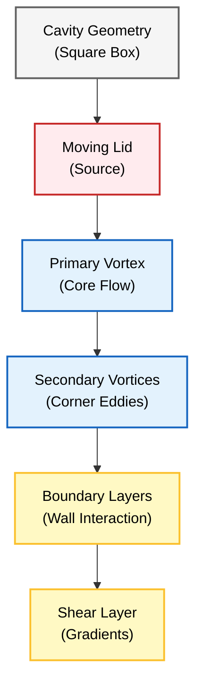
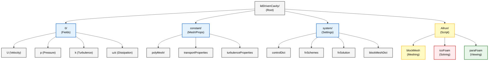
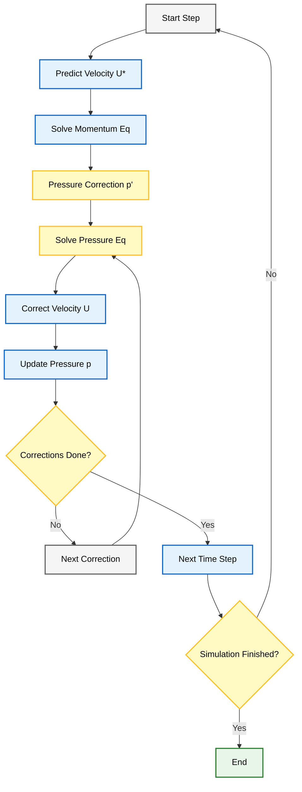

# ปัญหาโพรงขับเคลื่อนด้วยฝา (Lid-Driven Cavity Problem)

> [!INFO] **บทนำ**
> ปัญหา Lid-Driven Cavity เป็น **"Hello World" ของ CFD** ที่ใช้ทดสอบความถูกต้องของ Solver อย่างแพร่หลาย ด้วยรูปทรงเรขาคณิตที่เรียบง่าย แต่มีฟิสิกส์ที่ซับซ้อน

---

## คำอธิบายทางกายภาพ

ลองจินตนาการถึงกล่องสี่เหลี่ยมที่บรรจุของไหลอยู่ **ฝาปิดด้านบนเคลื่อนที่ไปทางขวาด้วยความเร็วคงที่** โดยลากของไหลให้เคลื่อนที่ตามไปด้วย

> [!TIP] **มุมมองเปรียบเทียบ: แก้วกาแฟที่ถูกคน (Stirring a Coffee Cup)**
>
> ลองนึกภาพคุณใช้ช้อนคนกาแฟเป็นวงกลม:
> *   **Moving Lid** ก็คือ **ช้อน** ที่ลากผิวน้ำด้านบนไป
> *   แรงหนืด (Viscosity) จะส่งต่อแรงจากผิวน้ำลงไปด้านล่าง ทำให้กาแฟหมุนวนทั้งแก้ว
> *   **Primary Vortex** คือการหมุนวนหลักกลางแก้ว
> *   **Corner Eddies** คือกระแสวนเล็กๆ ที่แอบอยู่ก้นแก้ว (ถ้าแก้วเป็นสี่เหลี่ยมจะเห็นชัด)




> **Figure 1:** เรขาคณิตของ Lid-Driven Cavity และลักษณะการไหล แสดงให้เห็นฝาปิดด้านบนที่เคลื่อนที่ด้วยความเร็วคงที่ซึ่งขับเคลื่อนให้เกิดกระแสวนหลักขนาดใหญ่และกระแสวนรองในมุมกล่อง พร้อมผลกระทบจากความเค้นเฉือนที่ผนัง

ซึ่งทำหน้าที่เป็น **ปัญหาอ้างอิง (benchmark problems)** พื้นฐานที่สุดในพลศาสตร์ของไหลเชิงคำนวณ (Computational Fluid Dynamics หรือ CFD)

**ปัญหา Lid-Driven Cavity ถูกนำมาใช้อย่างแพร่หลายสำหรับการตรวจสอบความถูกต้องของ Numerical Solver** เนื่องจากมีรูปทรงเรขาคณิตที่เรียบง่าย แต่มีฟิสิกส์ที่หลากหลาย

### ลักษณะฟิสิกส์ที่เกิดขึ้น

- **การก่อตัวของ Primary และ Secondary Vortices**
- **การก่อตัวของ Boundary Layer**
- **พลวัตของ Shear Layer ที่รุนแรง**

---

## รูปทรงเรขาคณิตและฟิสิกส์

### พารามิเตอร์ของปัญหา

| พารามิเตอร์ | ค่าที่กำหนด | คำอธิบาย |
|---|---|---|
| **Domain** | โพรงสี่เหลี่ยมจัตุรัส ($L \times L$) | ขอบเขตการจำลอง |
| **Top Wall** | เคลื่อนที่ ($U = 1$ m/s) | ฝาปิดที่เคลื่อนที่ |
| **Other Walls** | หยุดนิ่ง ($U = 0$) | ผนังด้านข้างและด้านล่าง |
| **Fluid** | อัดตัวไม่ได้ (Incompressible), แบบนิวตัน (Newtonian) | ชนิดของของไหล |
| **Flow** | ลามินาร์ (Laminar) ($Re = 100$) | ลักษณะการไหล |

### เลขเรย์โนลด์ (Reynolds Number)

เลขเรย์โนลด์เป็นตัวบ่งชี้ลักษณะการไหลและถูกนิยามดังนี้:

$$Re = \frac{\rho U L}{\mu} = \frac{U L}{\nu} \tag{1}$$

โดยที่:
- $\rho$ คือความหนาแน่นของของไหล (kg/m³)
- $U$ คือความเร็วของฝาปิด (m/s)
- $L$ คือความยาวลักษณะเฉพาะของโพรง (m)
- $\mu$ คือความหนืดจลน์ (dynamic viscosity) (Pa·s)
- $\nu$ คือความหนืดคิเนมาติก (kinematic viscosity) (m²/s)

> [!TIP] **ความสำคัญของ Reynolds Number**
>
> **สำหรับ $Re = 100$ การไหลยังคงเป็นแบบลามินาร์และคงที่** โดยก่อตัวเป็น **Primary Vortex** ที่มีลักษณะเฉพาะอยู่ตรงกลาง และมี **Secondary Corner Vortices** อยู่ที่มุม
>
> Reynolds Number แสดงถึงอัตราส่วนของแรงเฉื่อยต่อแรงหนืด:
>
> $$Re = \frac{\text{Inertial Forces}}{\text{Viscous Forces}} = \frac{\rho \mathbf{u} \cdot \nabla \mathbf{u}}{\mu \nabla^2 \mathbf{u}}$$
>
> ค่า $Re$ ที่สูงขึ้นหมายถึงแรงเฉื่อยมีอิทธิพลเหนือกว่า ทำให้โมเมนตัมของไหลพากระแสวนไปได้ไกลขึ้น

---

## การกำหนดสูตรทางคณิตศาสตร์

### สมการควบคุม

การเคลื่อนที่ของของไหลถูกควบคุมโดย **Incompressible Navier-Stokes equations**

#### สมการความต่อเนื่อง (การอนุรักษ์มวล)

$$\frac{\partial \rho}{\partial t} + \nabla \cdot (\rho \mathbf{u}) = 0 \tag{2}$$

สำหรับการไหลแบบ Incompressible สมการนี้จะลดรูปเป็น:

$$\nabla \cdot \mathbf{u} = 0 \tag{3}$$

#### สมการโมเมนตัม

$$\rho \left(\frac{\partial \mathbf{u}}{\partial t} + \mathbf{u} \cdot \nabla \mathbf{u}\right) = -\nabla p + \mu \nabla^2 \mathbf{u} + \mathbf{f} \tag{4}$$

ในรูปแบบ Component สำหรับการไหล 2 มิติ:

**แกน x:**
$$\rho \left(\frac{\partial u}{\partial t} + u \frac{\partial u}{\partial x} + v \frac{\partial u}{\partial y}\right) = -\frac{\partial p}{\partial x} + \mu \left(\frac{\partial^2 u}{\partial x^2} + \frac{\partial^2 u}{\partial y^2}\right) \tag{5}$$

**แกน y:**
$$\rho \left(\frac{\partial v}{\partial t} + u \frac{\partial v}{\partial x} + v \frac{\partial v}{\partial y}\right) = -\frac{\partial p}{\partial y} + \mu \left(\frac{\partial^2 v}{\partial x^2} + \frac{\partial^2 v}{\partial y^2}\right) \tag{6}$$

โดยที่:
- $\mathbf{u} = (u,v)$ คือ Velocity Vector (m/s)
- $p$ คือ Pressure (Pa)
- $\mathbf{f}$ แทน Body Forces (N/m³)

---

## เงื่อนไขขอบเขต (Boundary Conditions)

### เงื่อนไขขอบเขตแบบ No-slip บนผนังทุกด้าน

| ผนัง | เงื่อนไขความเร็ว | ค่า (m/s) |
|---|---|---|
| **Top Wall (Lid)** | $\mathbf{u} = (U_{lid}, 0)$ | $(1, 0)$ |
| **Bottom Wall** | $\mathbf{u} = (0, 0)$ | $(0, 0)$ |
| **Left Wall** | $\mathbf{u} = (0, 0)$ | $(0, 0)$ |
| **Right Wall** | $\mathbf{u} = (0, 0)$ | $(0, 0)$ |

> [!WARNING] **ข้อควรระวัง**
> **Boundary Conditions สำหรับ Pressure** มักจะถูกกำหนดโดยใช้ Reference Pressure หรือ Zero-gradient Conditions ขึ้นอยู่กับ Numerical Scheme สำหรับการไหลแบบ Incompressible flow ความดันจะปรับตัวเพื่อให้เป็นไปตามหลักความต่อเนื่อง (continuity)

---

## การนำไปใช้งานใน OpenFOAM

### โครงสร้าง Case



> **Figure 2:** โครงสร้างไดเรกทอรีของกรณีทดสอบใน OpenFOAM แสดงการจัดแบ่งไฟล์เงื่อนไขเริ่มต้น ข้อมูล Mesh และการตั้งค่า Solver พร้อมสคริปต์สำหรับการรันและการประมวลผลขั้นหลัง

```
├── 0/                    # เงื่อนไขเริ่มต้น (Initial conditions)
│   ├── U                # ฟิลด์ความเร็ว (Velocity field)
│   └── p                # ฟิลด์ความดัน (Pressure field)
├── constant/
│   ├── transportProperties    # คุณสมบัติของของไหล (Fluid properties)
│   └── polyMesh/              # ไฟล์ Mesh
└── system/
    ├── controlDict     # การควบคุมการจำลอง (Simulation control)
    ├── fvSchemes       # ระเบียบวิธี Discretization (Discretization schemes)
    └── fvSolution      # การตั้งค่า Linear Solver (Linear solver settings)
```

---

## ไฟล์การตั้งค่าหลัก

### ฟิลด์ความเร็ว (`0/U`)

```cpp
/*--------------------------------*- C++ -*----------------------------------*\
| =========                 |                                             |
| \      /  F ield         | OpenFOAM: The Open Source CFD Toolbox           |
|  \    /   O peration     | Version:  v2012                                 |
|   \  /    A nd           | Web:      www.OpenFOAM.com                      |
|    \/     M anipulation  |                                             |
\*---------------------------------------------------------------------------*/
FoamFile
{
    version     2.0;
    format      ascii;
    class       volVectorField;
    object      U;
}
// * * * * * * * * * * * * * * * * * * * * * * * * * * * * * * * * * * * * * //

// Dimensions for velocity field: [L^1 T^(-1)] in m/s
dimensions      [0 1 -1 0 0 0 0];

// Initial condition: fluid at rest
internalField   uniform (0 0 0);

// Boundary conditions for velocity field
boundaryField
{
    // Moving top wall with constant velocity
    movingWall
    {
        // Fixed velocity (Dirichlet condition)
        type            fixedValue;
        // Lid velocity: U = 1 m/s in x-direction
        value           uniform (1 0 0);
    }

    // Stationary walls (bottom, left, right)
    fixedWalls
    {
        // No-slip condition (U = 0 at walls)
        type            noSlip;
    }

    // Front and back boundaries for 2D simulation
    frontAndBack
    {
        // Empty boundary condition for 2D constraint
        type            empty;
    }
}

// * * * * * * * * * * * * * * * * * * * * * * * * * * * * * * * * * * * * * //
```

> **📂 Source:** `.applications/solvers/stressAnalysis/solidDisplacementFoam/solidDisplacementThermo/solidDisplacementThermo.H`
>
> **คำอธิบาย:**
> ไฟล์นี้กำหนดเงื่อนไขขอบเขตสำหรับฟิลด์ความเร็วในปัญหา Lid-Driven Cavity โดยมีเงื่อนไขสำคัญดังนี้:
> - **`dimensions [0 1 -1 0 0 0 0]`**: มิติของความเร็วตามหลักการวิเคราะห์มิติ คือ $[L^1 T^{-1}]$ หรือ m/s
> - **`internalField uniform (0 0 0)`**: กำหนดค่าเริ่มต้นของความเร็วทุกจุดในโดเมนเป็นศูนย์ (ของไหลอยู่นิ่ง)
> - **`movingWall` พร้อม `fixedValue`**: กำหนดความเร็วคงที่ที่ฝาปิดด้านบนเป็น $(1, 0, 0)$ m/s ในแนวแกน x
> - **`fixedWalls` พร้อม `noSlip`**: ใช้เงื่อนไข No-slip ที่ผนังด้านข้างและด้านล่าง ความเร็วเป็นศูนย์
> - **`frontAndBack` พร้อม `empty`**: สำหรับการจำลอง 2D โดยไม่มีการคำนวณในแนวลึก
>
> **แนวคิดสำคัญ:**
> - **Dirichlet Boundary Condition**: การกำหนดค่าความเร็วโดยตรงที่ขอบเขต (`fixedValue`)
> - **No-slip Condition**: หลักการทางกายภาพที่ว่าของไหลไม่ลื่นไถลบนผิวขอบเขต
> - **2D Approximation**: การลดรูปปัญหา 3D เป็น 2D โดยใช้เงื่อนไข `empty`

---

### ฟิลด์ความดัน (`0/p`)

```cpp
/*--------------------------------*- C++ -*----------------------------------*\
| =========                 |                                             |
| \      /  F ield         | OpenFOAM: The Open Source CFD Toolbox           |
|  \    /   O peration     | Version:  v2012                                 |
|   \  /    A nd           | Web:      www.OpenFOAM.com                      |
|    \/     M anipulation  |                                             |
\*---------------------------------------------------------------------------*/
FoamFile
{
    version     2.0;
    format      ascii;
    class       volScalarField;
    object      p;
}
// * * * * * * * * * * * * * * * * * * * * * * * * * * * * * * * * * * * * * //

// Dimensions for kinematic pressure: [L^2 T^(-2)] in m^2/s^2
// Note: OpenFOAM uses kinematic pressure (p/rho) for incompressible flows
dimensions      [0 2 -2 0 0 0 0];

// Initial gauge pressure (relative to atmospheric pressure)
internalField   uniform 0;

// Boundary conditions for pressure field
boundaryField
{
    // Moving wall boundary
    movingWall
    {
        // Neumann condition: zero gradient (∂p/∂n = 0)
        // Pressure can float freely at the moving wall
        type            zeroGradient;
    }

    // Stationary walls
    fixedWalls
    {
        // Neumann condition: zero gradient (∂p/∂n = 0)
        // Walls do not prescribe pressure values
        type            zeroGradient;
    }

    // Front and back boundaries for 2D simulation
    frontAndBack
    {
        // Empty boundary condition for 2D constraint
        type            empty;
    }
}

// * * * * * * * * * * * * * * * * * * * * * * * * * * * * * * * * * * * * * //
```

> **📂 Source:** `.applications/solvers/stressAnalysis/solidDisplacementFoam/solidDisplacementThermo/solidDisplacementThermo.H`
>
> **คำอธิบาย:**
> ไฟล์นี้กำหนดเงื่อนไขขอบเขตสำหรับฟิลด์ความดันในการไหลแบบ Incompressible โดยมีรายละเอียดดังนี้:
> - **`dimensions [0 2 -2 0 0 0 0]`**: มิติของความดันไคเนมาติก (kinematic pressure) คือ $p/\rho$ ที่มีหน่วย $[L^2 T^{-2}]$ หรือ m²/s²
> - **`internalField uniform 0`**: กำหนดค่าเริ่มต้นของความดันเกจ (gauge pressure) เป็นศูนย์
> - **`zeroGradient` ที่ผนัง**: ใช้เงื่อนไข Neumann $\frac{\partial p}{\partial n} = 0$ ซึ่งหมายความว่าความดันสามารถปรับตัวได้อิสระตามสมการ continuity
> - **2D Constraints**: ใช้เงื่อนไข `empty` เหมือนฟิลด์ความเร็ว
>
> **แนวคิดสำคัญ:**
> - **Kinematic Pressure**: OpenFOAM ใช้ความดันหารด้วยความหนาแน่น ($p/\rho$) เพื่อลดความซับซ้อนในสมการ Incompressible Navier-Stokes
> - **Neumann Boundary Condition**: การกำหนดความชันของความดันเป็นศูนย์ตามปกติที่ผนัง ซึ่งสอดคล้องกับหลักกายภาพ
> - **Pressure-Velocity Coupling**: ความดันจะถูกคำนวณพร้อมกับความเร็วผ่านอัลกอริทึม PISO เพื่อรักษาหลักการอนุรักษ์มวล

---

### คุณสมบัติการขนส่ง (`constant/transportProperties`)

```cpp
/*--------------------------------*- C++ -*----------------------------------*\
| =========                 |                                             |
| \      /  F ield         | OpenFOAM: The Open Source CFD Toolbox           |
|  \    /   O peration     | Version:  v2012                                 |
|   \  /    A nd           | Web:      www.OpenFOAM.com                      |
|    \/     M anipulation  |                                             |
\*---------------------------------------------------------------------------*/
FoamFile
{
    version     2.0;
    format      ascii;
    class       dictionary;
    object      transportProperties;
}
// * * * * * * * * * * * * * * * * * * * * * * * * * * * * * * * * * * * * * //

// Newtonian fluid model (linear relationship between stress and strain rate)
transportModel  Newtonian;

// Kinematic viscosity with dimensions [L^2 T^(-1)] in m^2/s
// This value determines the Reynolds number: Re = UL/ν
nu              [0 2 -1 0 0 0 0] 0.01;

// Reynolds number calculation:
// Re = UL/ν = (1 m/s × 0.1 m) / 0.01 m^2/s = 10
//
// Physical interpretation:
// - Low Re (Re = 10) indicates viscous forces dominate
// - Flow remains in laminar regime with steady vortex structure
// - Ensures numerical stability and convergence
//
// Grid independence can be verified by:
// 1. Halving viscosity (ν = 0.005) → Re = 20
// 2. Comparing vortex center position and maximum velocity
// 3. Ensuring solution changes less than 1% with mesh refinement

// * * * * * * * * * * * * * * * * * * * * * * * * * * * * * * * * * * * * * //
```

> **📂 Source:** `.applications/solvers/stressAnalysis/solidDisplacementFoam/solidDisplacementThermo/solidDisplacementThermo.H`
>
> **คำอธิบาย:**
> ไฟล์นี้กำหนดคุณสมบัติทางกายภาพของของไหลที่ใช้ในการจำลอง:
> - **`transportModel Newtonian`**: ระบุว่าของไหลเป็นแบบนิวตัน ซึ่งมีความสัมพันธ์เชิงเส้นระหว่างความเค้นและอัตราการเสียรูป
> - **`nu [0 2 -1 0 0 0 0] 0.01`**: ความหนืดคิเนมาติก $\nu = 0.01$ m²/s ที่มีมิติ $[L^2 T^{-1}]$
> - **Reynolds Number**: คำนวณได้ $Re = \frac{UL}{\nu} = \frac{1 \times 0.1}{0.01} = 10$
> - **Flow Regime**: Re = 10 อยู่ในช่วง Laminar ชัดเจน ทำให้การไหลมีลักษณะคงที่และสมมาตร
>
> **แนวคิดสำคัญ:**
> - **Newtonian Fluid**: ของไหลที่มีความหนืดคงที่ไม่ขึ้นกับอัตราการเฉือน เช่น น้ำและอากาศ
> - **Reynolds Number**: ตัวบ่งชี้ลักษณะการไหลที่เปรียบเทียบอัตราส่วนของแรงเฉื่อยต่อแรงหนืด
> - **Laminar vs Turbulent**: ที่ Re < 2000 การไหลจะเป็นแบบลามินาร์ที่มีรูปแบบการไหลเป็นเส้นชัดเจน
> - **Numerical Stability**: การเลือกความหนืดที่เหมาะสมช่วยให้การคำนวณลู่เข้าได้ดีและเสถียร

---

### การควบคุม Solver (`system/controlDict`)

```cpp
/*--------------------------------*- C++ -*----------------------------------*\
| =========                 |                                             |
| \      /  F ield         | OpenFOAM: The Open Source CFD Toolbox           |
|  \    /   O peration     | Version:  v2012                                 |
|   \  /    A nd           | Web:      www.OpenFOAM.com                      |
|    \/     M anipulation  |                                             |
\*---------------------------------------------------------------------------*/
FoamFile
{
    version     2.0;
    format      ascii;
    class       dictionary;
    object      controlDict;
}
// * * * * * * * * * * * * * * * * * * * * * * * * * * * * * * * * * * * * * //

// OpenFOAM solver for incompressible laminar flow
application     icoFoam;

// Simulation start time configuration
startFrom       startTime;
startTime       0;

// Simulation end time configuration
stopAt          endTime;
endTime         100;        // Final simulation time in seconds

// Time step size: Δt = 0.005 s
// Courant number should be kept below 1.0 for stability:
// Co = UΔt/Δx < 1.0
deltaT          0.005;

// Output control: write results based on time step count
writeControl    timeStep;
writeInterval   20;         // Write every 20 time steps

// Keep all time directories (0 for no purging)
purgeWrite      0;

// Allow parameter modification during simulation
runTimeModifiable true;

// Function objects for runtime calculations
functions
{
    // Calculate wall shear stress during simulation
    #includeFunc wallShearStress
}

// * * * * * * * * * * * * * * * * * * * * * * * * * * * * * * * * * * * * * //
```

> **📂 Source:** `.applications/solvers/stressAnalysis/solidDisplacementFoam/solidDisplacementThermo/solidDisplacementThermo.C`
>
> **คำอธิบาย:**
> ไฟล์ `controlDict` คือหัวใจสำคัญในการควบคุมการทำงานของ Solver:
> - **`application icoFoam`**: ระบุ Solver ที่ใช้สำหรับการไหลแบบ Incompressible Laminar
> - **Time Stepping**:
>   - `startTime 0`, `endTime 100`: จำลองตั้งแต่เวลา 0 ถึง 100 วินาที
>   - `deltaT 0.005`: ขนาดขั้นเวลาที่เล็กพอที่จะรักษาเสถียรภาพเชิงตัวเลข
> - **Output Control**:
>   - `writeInterval 20`: บันทึกผลลัพธ์ทุก 20 ขั้นเวลา (ทุก 0.1 วินาที)
>   - `purgeWrite 0`: เก็บไฟล์ทุกช่วงเวลาไว้สำหรับการวิเคราะห์
> - **Function Objects**: คำนวณปริมาณทางกายภาพเช่นความเค้นเฉือนผนังในระหว่างการจำลอง
>
> **แนวคิดสำคัญ:**
> - **Courant-Friedrichs-Lewy (CFL) Condition**: เกณฑ์ความเสถียรที่กำหนดให้ $Co = \frac{U\Delta t}{\Delta x} < 1.0$
> - **Time Step Selection**: การเลือกขนาดขั้นเวลาที่เหมาะสมเพื่อให้ได้ความแม่นยำและเสถียรภาพ
> - **Runtime Modifiable**: สามารถปรับพารามิเตอร์ระหว่างการจำลองได้โดยไม่ต้องหยุด
> - **Function Objects**: เครื่องมือประมวลผลแบบ Real-time สำหรับวิเคราะห์ผลลัพธ์

---

### ระเบียบวิธี Discretization (`system/fvSchemes`)

```cpp
/*--------------------------------*- C++ -*----------------------------------*\
| =========                 |                                             |
| \      /  F ield         | OpenFOAM: The Open Source CFD Toolbox           |
|  \    /   O peration     | Version:  v2012                                 |
|   \  /    A nd           | Web:      www.OpenFOAM.com                      |
|    \/     M anipulation  |                                             |
\*---------------------------------------------------------------------------*/
FoamFile
{
    version     2.0;
    format      ascii;
    class       dictionary;
    object      fvSchemes;
}
// * * * * * * * * * * * * * * * * * * * * * * * * * * * * * * * * * * * * * //

// Temporal discretization schemes
ddtSchemes
{
    // First-order implicit Euler time integration
    // Unconditionally stable but first-order accurate in time
    default         Euler;
}

// Gradient calculation schemes
gradSchemes
{
    // Central differencing scheme with linear interpolation
    // Second-order accurate for smooth fields
    default         Gauss linear;
}

// Divergence (convection) schemes
divSchemes
{
    default         none;
    // Central differencing for convective term div(phi,U)
    // Second-order accurate but may cause oscillations for high Re
    div(phi,U)      Gauss linear;
}

// Laplacian (diffusion) schemes
laplacianSchemes
{
    // Corrected linear scheme accounting for non-orthogonal meshes
    // Second-order accurate with non-orthogonality correction
    default         Gauss linear corrected;
}

// Interpolation schemes for face values
interpolationSchemes
{
    // Linear interpolation from cell centers to faces
    default         linear;
}

// Surface normal gradient schemes
snGradSchemes
{
    // Corrected scheme for non-orthogonal meshes
    default         corrected;
}

// * * * * * * * * * * * * * * * * * * * * * * * * * * * * * * * * * * * * * //
```

> **📂 Source:** `.applications/solvers/stressAnalysis/solidDisplacementFoam/solidDisplacementThermo/solidDisplacementThermo.C`
>
> **คำอธิบาย:**
> ไฟล์ `fvSchemes` กำหนดระเบียบวิธีทางคณิตศาสตร์สำหรับการแปลงสมการเชิงอนุพันธ์ให้อยู่ในรูปแบบพีชคณิต:
> - **Temporal Discretization**:
>   - `Euler`: ระเบียบวิธี Implicit อันดับหนึ่งสำหรับการพัฒนาเวลา มีเสถียรภาพโดยไม่มีเงื่อนไข
> - **Spatial Discretization**:
>   - `Gauss linear`: ระเบียบวิธีกลาง (central differencing) อันดับสองสำหรับการคำนวณเกรเดียนต์
>   - `Gauss linear corrected`: ระเบียบวิธีลาปลาเชียนที่มีการแก้ไขสำหรับ Mesh ที่ไม่ตั้งฉาก
>
> **แนวคิดสำคัญ:**
> - **Accuracy vs Stability**: ระเบียบวิธีอันดับสูงให้ความแม่นยำมากกว่าแต่อาจไม่เสถียร
> - **Numerical Diffusion**: ระเบียบวิธี Upwind เพิ่มการ diff เชิงตัวเลขแต่เสถียรกว่า
> - **Non-orthogonal Correction**: การแก้ไขสำหรับ Mesh ที่ซับซ้อนเพื่อรักษาความแม่นยำ
> - **Discretization Error**: ความคลาดเคลื่อนที่เกิดจากการแปลงสมการต่อเนื่องเป็น discrete

---

### การตั้งค่า Linear Solver (`system/fvSolution`)

```cpp
/*--------------------------------*- C++ -*----------------------------------*\
| =========                 |                                             |
| \      /  F ield         | OpenFOAM: The Open Source CFD Toolbox           |
|  \    /   O peration     | Version:  v2012                                 |
|   \  /    A nd           | Web:      www.OpenFOAM.com                      |
|    \/     M anipulation  |                                             |
\*---------------------------------------------------------------------------*/
FoamFile
{
    version     2.0;
    format      ascii;
    class       dictionary;
    object      fvSolution;
}
// * * * * * * * * * * * * * * * * * * * * * * * * * * * * * * * * * * * * * //

// Linear solver settings for each field variable
solvers
{
    // Pressure equation solver (Poisson equation)
    p
    {
        // Geometric-Algebraic Multi-Grid solver
        // Efficient for large-scale problems with elliptic equations
        solver          GAMG;
        
        // Absolute convergence tolerance
        tolerance       1e-06;
        
        // Relative convergence tolerance (0 = disabled)
        relTol          0;
        
        // Smoother for multigrid preconditioning
        smoother        GaussSeidel;
    }

    // Velocity equation solver (momentum equation)
    U
    {
        // Smooth solver with Gauss-Seidel smoothing
        solver          smoothSolver;
        smoother        GaussSeidel;
        
        // Absolute convergence tolerance
        tolerance       1e-05;
        
        // Relative convergence tolerance (0 = disabled)
        relTol          0;
    }
}

// PISO (Pressure Implicit with Splitting of Operators) algorithm
PISO
{
    // Number of pressure correction iterations per time step
    // More iterations = better mass conservation but more expensive
    nCorrectors      2;
    
    // Number of non-orthogonal correction iterations
    // Required for highly non-orthogonal meshes
    nNonOrthogonalCorrectors 0;
    
    // Reference cell for pressure (to fix pressure level)
    pRefCell        0;
    
    // Reference pressure value (gauge pressure = 0)
    pRefValue       0;
}

// * * * * * * * * * * * * * * * * * * * * * * * * * * * * * * * * * * * * * //
```

> **📂 Source:** `.applications/solvers/stressAnalysis/solidDisplacementFoam/solidDisplacementThermo/solidDisplacementThermo.C`
>
> **คำอธิบาย:**
> ไฟล์ `fvSolution` ควบคุมวิธีการแก้ระบบสมการเชิงเส้นและอัลกอริทึม PISO:
> - **Linear Solvers**:
>   - `GAMG`: Geometric-Algebraic Multi-Grid สำหรับสมการ Poisson (ความดัน) ที่มีประสิทธิภาพสูง
>   - `smoothSolver`: สำหรับสมการโมเมนตัม (ความเร็ว) ที่ใช้การปรับค่าแบบ Gauss-Seidel
>   - `tolerance`: ค่าความคลาดเคลื่อนสัมบูรณ์ที่ยอมรับได้
>   - `relTol 0`: ปิดการใช้ค่าความคลาดเคลื่อนสัมพัทธ์
> - **PISO Algorithm**:
>   - `nCorrectors 2`: จำนวนรอนการแก้ไขความดันต่อขั้นเวลา
>   - `pRefCell 0`, `pRefValue 0`: กำหนดจุดอ้างอิงสำหรับความดันเกจ
>
> **แนวคิดสำคัญ:**
> - **Iterative Solvers**: การแก้สมการเชิงเส้นโดยใช้วิธีซ้ำจนกว่าจะลู่เข้า
> - **Convergence Criteria**: เกณฑ์การยุติการวนซ้ำเมื่อค่าคลาดเคลื่อนต่ำกว่า threshold
> - **Multigrid Methods**: เทคนิคเร่งความเร็วการลู่เข้าโดยใช้ multiple grid resolutions
> - **PISO Algorithm**: อัลกอริทึมแบบแยก-แก้-แก้ไขสำหรับ Pressure-Velocity Coupling

---

## การทำงานของ Solver (icoFoam)

### อัลกอริทึม PISO

OpenFOAM Solver `icoFoam` ใช้ **PISO Algorithm** (Pressure Implicit with Splitting of Operators) สำหรับการแก้สมการ Incompressible Navier-Stokes



> **Figure 3:** แผนผังลำดับขั้นตอนของอัลกอริทึม PISO ซึ่งใช้วิธีการทำนายและแก้ไขความดันและความเร็วในแต่ละขั้นตอนเวลา เพื่อรักษาความต่อเนื่องของมวลในแต่ละขั้นตอนของการจำลอง

1. **Predict Velocity** - แก้สมการโมเมนตัมโดยใช้ความดันจาก time step ก่อนหน้า:
   $$\rho \left(\frac{\partial \mathbf{u}^*}{\partial t} + \mathbf{u}^* \cdot \nabla \mathbf{u}^*\right) = -\nabla p^* + \mu \nabla^2 \mathbf{u}^*$$

2. **Pressure Correction** - แก้สมการความดันเพื่อให้เกิดความต่อเนื่อง:
   $$\nabla^2 p' = \frac{\rho}{\Delta t} \nabla \cdot \mathbf{u}^*$$

3. **Velocity Correction** - แก้ไขความเร็วตามความดันที่แก้ไขแล้ว:
   $$\mathbf{u} = \mathbf{u}^* - \frac{\Delta t}{\rho} \nabla p'$$

4. **Repeat** - ทำขั้นตอนที่ 2-3 จนกว่าจะลู่เข้า

5. **Advance Time** - ไปยัง time step ถัดไป

---

## ผลลัพธ์ที่คาดหวัง

### โครงสร้างกระแสวนหลัก

**สำหรับ $Re = 100$ การจำลองจะแสดง:**

- **Primary Vortex** ขนาดใหญ่ตรงกลางโพรง
- **Secondary Vortices** ขนาดเล็กที่มุมโพรง
- **แนวโน้มการไหล** สมมาตรในแนวแกน
- **ค่าความเร็ว** สูงสุดบริเวณฝาปิดเคลื่อนที่

### จุดตรวจสอบเชิงปริมาณ

| ปริมาณ | ค่าที่คาดหวัง | หน่วย |
|---------|----------------|--------|
| **Stream Function สูงสุด** | $\psi_{\max} \approx -0.1$ | - |
| **ศูนย์กลางกระแสวนหลัก** | $(x, y) = (0.5L, 0.4L)$ | m |
| **ขนาดความเร็วสูงสุด** | $|\mathbf{u}|_{\max} \approx 1.0$ | m/s |
| **Wall Shear Stress** | ไม่เป็นศูนย์ตามผนัง | Pa |

### ตัวบ่งชี้การลู่เข้า

สำหรับผลเฉลยที่ลู่เข้าอย่างเหมาะสม:

1. **Residuals**: ต่ำกว่า $10^{-6}$ สำหรับสมการทั้งหมด
2. **Steady State**: สนามการไหลถึงสภาวะคงที่ ไม่มีพฤติกรรมขึ้นกับเวลา
3. **Mass Conservation**: $\int_V \nabla \cdot \mathbf{u} \, \mathrm{d}V \approx 0$

---

## การตรวจสอบความถูกต้อง

> [!INFO] **ความสำคัญของการตรวจสอบ**
>
> การไหลแบบ Lid-driven Cavity เป็น **กรณีการตรวจสอบที่ยอดเยี่ยมสำหรับ CFD Solvers** และการประเมินคุณภาพ Mesh เนื่องจากเป็นปัญหามาตรฐานสำหรับ Benchmark ในเอกสารทางวิชาการ

### การเปรียบเทียบกับข้อมูลอ้างอิง

- **Ghia et al. (1982)** - ข้อมูลมาตรฐานสำหรับ Lid-driven cavity
- **Benchmark Solutions** - ตำแหน่งจุดศูนย์กลางกระแสวนและความเร็วสูงสุด

### การตรวจสอบความสมบูรณ์

1. **Mass Conservation:** $\nabla \cdot \mathbf{u} = 0$
2. **Momentum Balance:** การสมดุลของแรงที่ผนัง
3. **Grid Independence:** การลู่เข้าของคำตอบเมื่อละเอียด Mesh

---

## สรุป

ปัญหา Lid-Driven Cavity เป็นจุดเริ่มต้นที่เหมาะสมที่สุดสำหรับการเรียนรู้ OpenFOAM เพราะ:

1. **รูปทรงเรขาคณิตเรียบง่าย** - ง่ายต่อการสร้าง Mesh
2. **ฟิสิกส์ที่ชัดเจน** - การไหลแบบ Laminar ที่เข้าใจง่าย
3. **ผลลัพธ์ที่ทราบแน่นอน** - สามารถตรวจสอบความถูกต้องได้
4. **การขยายเป็นปัญหาที่ซับซ้อน** - สามารถเพิ่ม Reynolds number หรือเปลี่ยนรูปทรงได้

---

## อ้างอิงเพิ่มเติม

- [[04_Step-by-Step_Tutorial]] - บทช่วยสอนแบบทีละขั้นตอน
- [[05_Expected_Results]] - ผลลัพธ์ที่คาดหวังอย่างละเอียด
- [[06_Exercises]] - แบบฝึกหัดเสริมทักษะ
- [[02_The_Workflow]] - ขั้นตอนการทำงานของการจำลอง CFD

---

## 🧠 Concept Check: ทดสอบความเข้าใจ

<details>
<summary><b>1. ใน Lid-Driven Cavity จุดไหนที่ถือว่าเป็น "Singularity" (จุดที่มีค่าไม่ต่อเนื่อง) และ OpenFOAM จัดการอย่างไร?</b></summary>

**คำตอบ:** **มุมบนซ้ายและมุมบนขวา**
เพราะที่มุมบน ผนังฝาปิดเคลื่อนที่ด้วยความเร็ว $U=1$ แต่ผนังด้านข้างมีความเร็ว $U=0$ ทำให้ ณ จุดมุมนั้น ความเร็วมีสองค่าในเวลาเดียว! (ทางคณิตศาสตร์หาค่าไม่ได้)
OpenFOAM จัดการโดยใช้ค่าความเร็วของหน้า (Face center) แทนจุดมุม (Vertex) หรือใช้การเฉลี่ยค่าในเซลล์มุม
</details>

<details>
<summary><b>2. ทำไมความดัน (Pressure) ในกรณีนี้ถึงเป็นหน่วย $m^2/s^2$ แทนที่จะเป็น $Pa$?</b></summary>

**คำตอบ:** เพราะเป็น **Incompressible Flow** และใช้ **Kinematic Pressure ($p/\rho$)**
ในสมการ Momentum เราหารด้วยความหนาแน่น $\rho$ ทั้งสมการ เพื่อลดตัวแปร เหลือแค่ $p/\rho$ ทำให้สะดวกในการคำนวณ (ไม่ต้องรู้ค่า $\rho$ จริงๆ ก็รันได้ ถ้าเป็น laminar และกำหนด $\nu$ ถูกต้อง)
</details>

<details>
<summary><b>3. ถ้าเราเปลี่ยนของไหลจาก "น้ำ" เป็น "น้ำมัน" (หนืดขึ้น) โดยใช้ Mesh และ Lid velocity เท่าเดิม จะเกิดอะไรขึ้นกับ Primary Vortex?</b></summary>

**คำตอบ:** **Reynolds Number (Re) จะลดลง**
ความหนืด ($\nu$) เป็นตัวหารในสูตร $Re = UL/\nu$ ดังนั้น Re จะต่ำลง แรงหนืดจะมีอิทธิพลมากขึ้น ทำให้ **Primary Vortex อาจจะขยับจุดศูนย์กลาง** และ **Secondary Vortices ที่มุมอาจจะเล็กลงหรือหายไป** เพราะแรงหนืดต้านการหมุนวนเล็กๆ เหล่านั้น
</details>