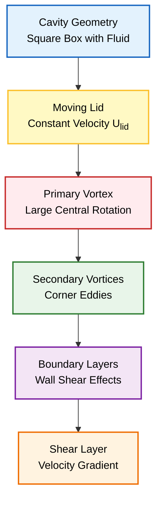
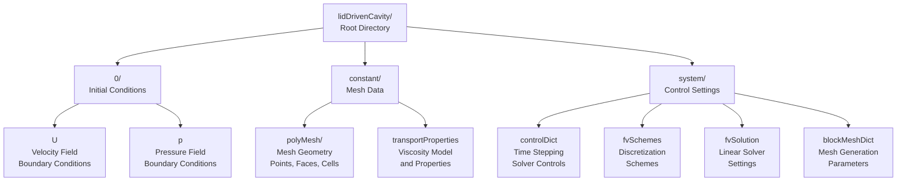
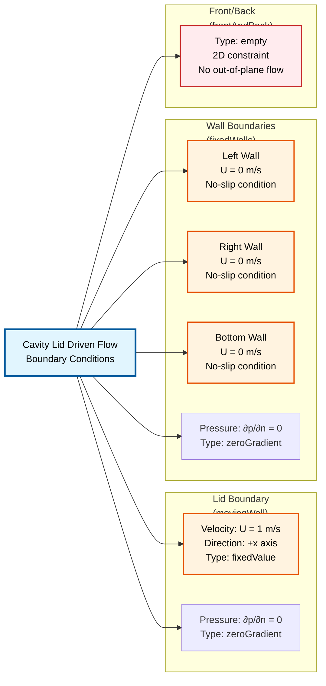
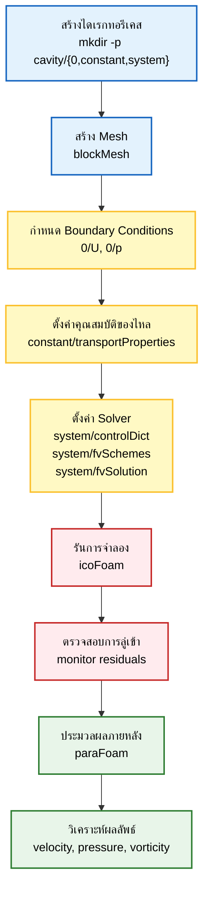

# บทช่วยสอนทีละขั้นตอน (Step-by-Step Tutorial)

> [!INFO] ภาพรวมบทช่วยสอน
> บทช่วยสอนนี้จะแนะนำทีละขั้นตอนสำหรับการตั้งค่าและรันการจำลอง CFD ครั้งแรกของคุณใน OpenFOAM โดยใช้ปัญหา **Lid-Driven Cavity Flow** ซึ่งเปรียบเสมือน "Hello World" ของ CFD

---

## ภาพรวมปัญหา Lid-Driven Cavity

### คำอธิบายทางกายภาพ

ลองจินตนาการถึงกล่องสี่เหลี่ยมที่บรรจุของไหลอยู่ **ฝาปิดด้านบนเคลื่อนที่ไปทางขวาด้วยความเร็วคงที่** โดยลากของไหลให้เคลื่อนที่ตามไปด้วย


> **Figure 1:** เรขาคณิตของ Lid-Driven Cavity และลักษณะการไหล แสดงให้เห็นฝาปิดด้านบนที่เคลื่อนที่ซึ่งขับเคลื่อนให้เกิดกระแสวนหลักขนาดใหญ่ตรงกลางและกระแสวนรองในมุมกล่อง พร้อมอิทธิพลของชั้นขอบเขตและความเค้นเฉือนที่ผนัง


| พารามิเตอร์ | ค่าที่กำหนด | คำอธิบาย |
|---|---|---|
| **Domain** | โพรงสี่เหลี่ยมจัตุรัส ($L \times L$) | ขอบเขตการจำลอง |
| **Top Wall** | เคลื่อนที่ ($U = 1$ m/s) | ฝาปิดที่เคลื่อนที่ |
| **Other Walls** | หยุดนิ่ง ($U = 0$) | ผนังด้านข้างและด้านล่าง |
| **Fluid** | อัดตัวไม่ได้ (Incompressible), แบบนิวตัน (Newtonian) | ชนิดของของไหล |
| **Flow** | ลามินาร์ (Laminar) ($Re = 10$) | ลักษณะการไหล |

### มูลฐานทางคณิตศาสตร์

การเคลื่อนที่ของของไหลถูกควบคุมโดย **Incompressible Navier-Stokes equations**:

**สมการความต่อเนื่อง (การอนุรักษ์มวล):**
$$\nabla \cdot \mathbf{u} = 0$$

**สมการโมเมนตัม:**
$$\rho \left(\frac{\partial \mathbf{u}}{\partial t} + \mathbf{u} \cdot \nabla \mathbf{u}\right) = -\nabla p + \mu \nabla^2 \mathbf{u} + \mathbf{f}$$

โดยที่:
- $\mathbf{u} = (u,v)$ = เวกเตอร์ความเร็ว (velocity vector)
- $p$ = ความดัน (pressure)
- $\rho$ = ความหนาแน่น (density)
- $\mu$ = ความหนืดพลวัต (dynamic viscosity)
- $\mathbf{f}$ = แรงกระทำต่อปริมาตร (body forces)

### เลขเรย์โนลด์ (Reynolds Number)

เลขเรย์โนลด์เป็นตัวบ่งชี้ลักษณะการไหล:
$$Re = \frac{\rho U L}{\mu} = \frac{U L}{\nu}$$

สำหรับการจำลองนี้:
$$Re = \frac{1 \times 0.1}{0.01} = 10$$

**การตีความ:** ค่า $Re = 10$ จัดอยู่ใน Laminar regime อย่างชัดเจน การไหลจะมีลักษณะคงที่และสมมาตร

---

## ขั้นตอนที่ 1: การตั้งค่าเคส (Case Setup)

**เริ่มต้นด้วยการสร้างโครงสร้างไดเรกทอรีมาตรฐาน** สำหรับเคส OpenFOAM การจำลอง CFD ทุกครั้งใน OpenFOAM จะมีโครงสร้างที่เป็นระเบียบสอดคล้องกัน

### โครงสร้างไดเรกทอรี OpenFOAM Case


> **Figure 2:** โครงสร้างไดเรกทอรีของกรณีทดสอบใน OpenFOAM แสดงการจัดเก็บเงื่อนไขเริ่มต้นในโฟลเดอร์ `0/`, ข้อมูล Mesh และคุณสมบัติของไหลใน `constant/` และการตั้งค่า Solver ใน `system/`


| ไดเรกทอรี | วัตถุประสงค์ | คำอธิบาย |
|-----------|-------------|----------|
| `0/` | เงื่อนไขเริ่มต้น | เก็บค่าฟิลด์เริ่มต้น (ความเร็ว, ความดัน, อุณหภูมิ) ที่เวลา $t=0$ |
| `constant/` | คุณสมบัติคงที่ | ข้อมูลที่ไม่เปลี่ยนแปลงตามเวลา เช่น Mesh ใน `polyMesh/` และคุณสมบัติทางกายภาพ |
| `system/` | การควบคุม Solver | Dictionaries ที่ควบคุมกระบวนการแก้ปัญหาเชิงตัวเลข |

### คำสั่งการสร้างไดเรกทอรี

```bash
mkdir -p cavity/{0,constant,system}
cd cavity
```

---

## ขั้นตอนที่ 2: การสร้าง Mesh (`system/blockMeshDict`)

**Dictionary `blockMeshDict`** ใช้สำหรับกำหนดรูปทรงเรขาคณิตเชิงคำนวณ (computational geometry) และสร้าง Mesh แบบ hexahedral ที่มีโครงสร้างโดยใช้ยูทิลิตี `blockMesh`

### หลักการ Block-based Method

- รูปทรงเรขาคณิตที่ซับซ้อนจะถูกแบ่งย่อยออกเป็น Block แบบ hexahedral ที่เรียบง่าย
- **Vertices**: จุดมุม 8 จุดของแต่ละ Block 3 มิติ (แม้สำหรับปัญหา 2 มิติ OpenFOAM ทำงานในพื้นที่ 3 มิติ)
- **Blocks**: กำหนดวิธีการเติมปริมาตรด้วยเซลล์แบบ hexahedral โดยใช้การเชื่อมต่อของ Vertex และการไล่ระดับเซลล์
- **Boundary**: จัดกลุ่ม Mesh faces เป็น Patches เชิงตรรกะสำหรับการประยุกต์ใช้ Boundary Condition

### การกำหนด Mesh

จะกำหนดโดเมนสี่เหลี่ยมจัตุรัสหนึ่งหน่วยที่มีพิกัด $(x,y) \in [0,1] \times [0,1]$ และมีความหนาในทิศทาง z เท่ากับ 0.1 หน่วย

**คำสั่ง `convertToMeters 0.1`** จะปรับขนาดมิติทั้งหมด ทำให้ได้ Cavity ทางกายภาพขนาด:
$$0.1 \text{ m} \times 0.1 \text{ m} \times 0.01 \text{ m}$$

**Mesh ประกอบด้วยเซลล์แบบ hexahedral จำนวน:**
$$20 \times 20 \times 1 = 400 \text{ เซลล์}$$

### OpenFOAM Code: `system/blockMeshDict`

```cpp
/*--------------------------------*- C++ -*----------------------------------*\
| =========                 |                                             |
| \      /  F ield         | OpenFOAM: The Open Source CFD Toolbox           |
|  \    /   O peration     | Version:  v2012                                 |
|   \  /    A nd           | Web:      www.OpenFOAM.com                      |
|    \/     M anipulation  |                                             |
\*---------------------------------------------------------------------------*/
FoamFile
{
    version     2.0;
    format      ascii;
    class       dictionary;
    object      blockMeshDict;
}
// * * * * * * * * * * * * * * * * * * * * * * * * * * * * * * * * * * * * * //

convertToMeters 0.1; // Scale factor: converts all dimensions to meters

vertices
(
    (0 0 0)   // 0 - Lower-left-back corner
    (1 0 0)   // 1 - Lower-right-back corner
    (1 1 0)   // 2 - Upper-right-back corner
    (0 1 0)   // 3 - Upper-left-back corner
    (0 0 0.1) // 4 - Lower-left-front corner (z-direction thickness)
    (1 0 0.1) // 5 - Lower-right-front corner
    (1 1 0.1) // 6 - Upper-right-front corner
    (0 1 0.1) // 7 - Upper-left-front corner
);

blocks
(
    // hex (vertex ordering) (cells_x cells_y cells_z) grading ratios
    hex (0 1 2 3 4 5 6 7) (20 20 1) simpleGrading (1 1 1)
);

edges
(
    // Optional curved edges - none needed for this simple geometry
);

boundary
(
    movingWall
    {
        type wall;                    // Wall boundary condition type
        faces
        (
            (3 7 6 2)                // Top face (y = 1) - will be the moving lid
        );
    }
    fixedWalls
    {
        type wall;
        faces
        (
            (0 4 7 3)                // Left wall (x = 0)
            (1 5 4 0)                // Bottom wall (y = 0)
            (2 6 5 1)                // Right wall (x = 1)
        );
    }
    frontAndBack
    {
        type empty;                  // Special boundary for 2D simulations
        faces                       // Reduces computational domain to 2D
        (
            (0 1 2 3)                // Back face (z = 0)
            (4 5 6 7)                // Front face (z = 0.1)
        );
    }
);

mergePatchPairs
(
    // Optional patch merging operations - none needed here
);

// * * * * * * * * * * * * * * * * * * * * * * * * * * * * * * * * * * * * * //
```

### การดำเนินการสร้าง Mesh

```bash
blockMesh
```

> [!TIP] การตรวจสอบ Mesh
> หลังจากรัน `blockMesh` สามารถตรวจสอบคุณภาพ Mesh ด้วยคำสั่ง:
> ```bash
> checkMesh
> ```

---

## ขั้นตอนที่ 3: Boundary Conditions (`0/`)

**ไดเรกทอรี `0/`** ประกอบด้วยค่าฟิลด์เริ่มต้นที่เวลา $t=0$ สำหรับ Incompressible laminar flow Solver `icoFoam` เราจำเป็นต้องระบุฟิลด์ความเร็ว ($\mathbf{U}$) และ Kinematic pressure ($p$)

### ฟิลด์ความเร็ว (`0/U`)

**มิติของฟิลด์ความเร็ว:** `[0 1 -1 0 0 0 0]` สอดคล้องกับการวิเคราะห์มิติสำหรับความเร็ว: $[L^1 T^{-1}]$

**Boundary Condition ของ Lid-driven cavity:** กำหนดให้ผนังด้านบน (`movingWall`) เคลื่อนที่ด้วยความเร็ว $\mathbf{U} = (1, 0, 0)$ m/s

### OpenFOAM Code: `0/U`

```cpp
/*--------------------------------*- C++ -*----------------------------------*\
| =========                 |                                             |
| \      /  F ield         | OpenFOAM: The Open Source CFD Toolbox           |
|  \    /   O peration     | Version:  v2012                                 |
|   \  /    A nd           | Web:      www.OpenFOAM.com                      |
|    \/     M anipulation  |                                             |
\*---------------------------------------------------------------------------*/
FoamFile
{
    version     2.0;
    format      ascii;
    class       volVectorField;     // Volume vector field
    object      U;                  // Velocity field
}
// * * * * * * * * * * * * * * * * * * * * * * * * * * * * * * * * * * * * * //

dimensions      [0 1 -1 0 0 0 0];  // m/s (LT^(-1))

internalField   uniform (0 0 0);    // Initial velocity: fluid at rest

boundaryField
{
    movingWall
    {
        type            fixedValue;          // Dirichlet condition
        value           uniform (1 0 0);    // Lid velocity: U = 1 m/s in x-direction
    }

    fixedWalls
    {
        type            noSlip;             // No-slip condition (U = 0 at walls)
    }

    frontAndBack
    {
        type            empty;              // 2D simulation constraint
    }
}

// * * * * * * * * * * * * * * * * * * * * * * * * * * * * * * * * * * * * * //
```

### ฟิลด์ความดัน (`0/p`)

**ฟิลด์ความดันใช้ Kinematic pressure:** $p/\rho$ ที่มีมิติ `[0 2 -2 0 0 0 0]` ซึ่งสอดคล้องกับ $[L^2 T^{-2}]$

**Boundary Condition แบบ zeroGradient:** ใช้ $\frac{\partial p}{\partial n} = 0$ ที่ผนังแข็ง ซึ่งเหมาะสมทางกายภาพสำหรับการไหลแบบ Incompressible flow

### OpenFOAM Code: `0/p`

```cpp
/*--------------------------------*- C++ -*----------------------------------*\
| =========                 |                                             |
| \      /  F ield         | OpenFOAM: The Open Source CFD Toolbox           |
|  \    /   O peration     | Version:  v2012                                 |
|   \  /    A nd           | Web:      www.OpenFOAM.com                      |
|    \/     M manupulation  |                                             |
\*---------------------------------------------------------------------------*/
FoamFile
{
    version     2.0;
    format      ascii;
    class       volScalarField;     // Volume scalar field
    object      p;                  // Pressure field
}
// * * * * * * * * * * * * * * * * * * * * * * * * * * * * * * * * * * * * * //

dimensions      [0 2 -2 0 0 0 0];  // m^2/s^2 (L^2 T^(-2)) - kinematic pressure

internalField   uniform 0;          // Initial gauge pressure

boundaryField
{
    movingWall
    {
        type            zeroGradient;       // Neumann condition: ∂p/∂n = 0
    }

    fixedWalls
    {
        type            zeroGradient;       // Walls don't prescribe pressure
    }

    frontAndBack
    {
        type            empty;              // 2D simulation constraint
    }
}

// * * * * * * * * * * * * * * * * * * * * * * * * * * * * * * * * * * * * * //
```

### ภาพรวม Boundary Conditions


> **Figure 3:** ภาพรวมของเงื่อนไขขอบเขตสำหรับปัญหาการไหลในโพรง แสดงการกำหนดความเร็วคงที่ที่ฝาปิดบน (movingWall), เงื่อนไข no-slip ที่ผนังด้านอื่น ๆ (fixedWalls) และเงื่อนไข empty สำหรับการจำลองแบบ 2 มิติ


**Dictionary `constant/transportProperties`** กำหนดคุณสมบัติของของไหลที่ Solver ต้องการ สำหรับ `icoFoam` ซึ่งแก้สมการ Incompressible Navier-Stokes สำหรับของไหลแบบ Newtonian เราจำเป็นต้องระบุเพียง Kinematic viscosity เท่านั้น

### ค่าที่กำหนด

**ค่าคุณสมบัติ:**
- **Kinematic viscosity:** $\nu = 0.01$ m²/s
- **Reynolds number:** $Re = \frac{UL}{\nu} = \frac{1 \times 0.1}{0.01} = 10$

**Reynolds number ที่ต่ำ (Re=10):** จัดว่าเป็นการไหลแบบ Laminar regime อย่างชัดเจน ช่วยให้มั่นใจได้ถึงรูปแบบการไหลที่คงที่และสมมาตร

### OpenFOAM Code: `constant/transportProperties`

```cpp
/*--------------------------------*- C++ -*----------------------------------*\
| =========                 |                                             |
| \      /  F ield         | OpenFOAM: The Open Source CFD Toolbox           |
|  \    /   O peration     | Version:  v2012                                 |
|   \  /    A nd           | Web:      www.OpenFOAM.com                      |
|    \/     M anipulation  |                                             |
\*---------------------------------------------------------------------------*/
FoamFile
{
    version     2.0;
    format      ascii;
    class       dictionary;
    object      transportProperties;
}
// * * * * * * * * * * * * * * * * * * * * * * * * * * * * * * * * * * * * * //

transportModel  Newtonian;          // Newtonian fluid model

nu              [0 2 -1 0 0 0 0] 0.01;  // Kinematic viscosity ν = 0.01 m^2/s

// Reynolds number calculation:
// Re = UL/ν = (1 m/s × 0.1 m) / 0.01 m^2/s = 10
// This gives a low Reynolds number flow in the laminar regime

// * * * * * * * * * * * * * * * * * * * * * * * * * * * * * * * * * * * * * //
```

---

## ขั้นตอนที่ 5: การควบคุม Solver (`system/`)

**ไดเรกทอรี `system/`** ประกอบด้วย Dictionaries ที่สำคัญสามชุดซึ่งควบคุมกระบวนการแก้ปัญหาเชิงตัวเลข:

| Dictionary | หน้าที่ | พารามิเตอร์หลัก |
|-----------|----------|-----------------|
| `controlDict` | การเลื่อนเวลา | เวลาเริ่มต้น/สิ้นสุด, ขนาด Time step |
| `fvSchemes` | Spatial discretization | ความละเอียดของพจน์ต่างๆ |
| `fvSolution` | Linear Solver | การตั้งค่าตัวแก้สมการเชิงเส้น |

### `system/controlDict` - การควบคุมเวลา

**Dictionary นี้จัดการด้านเวลา** ของการจำลอง รวมถึงเวลาเริ่มต้น/สิ้นสุด ขนาด Time step และความถี่ในการส่งออกข้อมูล

### OpenFOAM Code: `system/controlDict`

```cpp
/*--------------------------------*- C++ -*----------------------------------*\
| =========                 |                                             |
| \      /  F ield         | OpenFOAM: The Open Source CFD Toolbox           |
|  \    /   O peration     | Version:  v2012                                 |
|   \  /    A nd           | Web:      www.OpenFOAM.com                      |
|    \/     M anipulation  |                                             |
\*---------------------------------------------------------------------------*/
FoamFile
{
    version     2.0;
    format      ascii;
    class       dictionary;
    object      controlDict;
}
// * * * * * * * * * * * * * * * * * * * * * * * * * * * * * * * * * * * * * //

application     icoFoam;            // Solver name

startFrom       startTime;          // Start simulation from specified time
startTime       0;                  // Begin at t = 0
stopAt          endTime;            // Stop when reaching end time
endTime         0.5;                // Final simulation time (seconds)
deltaT          0.005;              // Time step size: Δt = 0.005 s

// Output control parameters
writeControl    timeStep;           // Write based on time step count
writeInterval   20;                 // Write every 20 time steps
purgeWrite      0;                  // Keep all time directories
runTimeModifiable true;             // Allow runtime modification

// * * * * * * * * * * * * * * * * * * * * * * * * * * * * * * * * * * * * * //
```

### พารามิเตอร์การควบคุมเวลา

- **Time step size:** $\Delta t = 0.005$ วินาที
- **Simulation time:** 0 ถึง 0.5 วินาที (ทำให้ได้ 100 time steps)
- **Output frequency:** ทุก 20 time steps (ทำให้ได้ 5 ชุดผลลัพธ์)

### ไทม์ไลน์การจำลอง

```mermaid
graph LR
    A["Simulation Start<br/>t = 0.0 s"] --> B["Time Step 1<br/>Δt = 0.005 s"]
    B --> C["Time Step 2<br/>t = 0.010 s"]
    C --> D["... Time Steps 3-19"]
    D --> E["Output 1<br/>t = 0.100 s<br/>(After 20 steps)"]
    E --> F["Time Steps 21-39"]
    F --> G["Output 2<br/>t = 0.200 s<br/>(After 40 steps)"]
    G --> H["Time Steps 41-59"]
    H --> I["Output 3<br/>t = 0.300 s<br/>(After 60 steps)"]
    I --> J["Time Steps 61-79"]
    J --> K["Output 4<br/>t = 0.400 s<br/>(After 80 steps)"]
    K --> L["Time Steps 81-99"]
    L --> M["Output 5<br/>t = 0.500 s<br/>(Final time)"]

    style A fill:#e8f5e9,stroke:#2e7d32,stroke-width:2px,color:#000
    style M fill:#ffebee,stroke:#c62828,stroke-width:2px,color:#000
    style E fill:#fff9c4,stroke:#fbc02d,stroke-width:2px,color:#000
    style G fill:#fff9c4,stroke:#fbc02d,stroke-width:2px,color:#000
    style I fill:#fff9c4,stroke:#fbc02d,stroke-width:2px,color:#000
    style K fill:#fff9c4,stroke:#fbc02d,stroke-width:2px,color:#000
```


> **Figure 4:** ไทม์ไลน์การจำลองและความถี่ในการส่งออกข้อมูล แสดงขนาดขั้นตอนเวลา ($\Delta t$) และช่วงเวลาที่จะมีการบันทึกผลลัพธ์ลงในไดเรกทอรีเวลาตั้งแต่เริ่มต้นจนสิ้นสุดการจำลอง


**Dictionary นี้กำหนดระเบียบวิธี Discretization** สำหรับพจน์ต่างๆ ในสมการควบคุม

### OpenFOAM Code: `system/fvSchemes`

```cpp
/*--------------------------------*- C++ -*----------------------------------*\
| =========                 |                                             |
| \      /  F ield         | OpenFOAM: The Open Source CFD Toolbox           |
|  \    /   O peration     | Version:  v2012                                 |
|   \  /    A nd           | Web:      www.OpenFOAM.com                      |
|    \/     M anipulation  |                                             |
\*---------------------------------------------------------------------------*/
FoamFile
{
    version     2.0;
    format      ascii;
    class       dictionary;
    object      fvSchemes;
}
// * * * * * * * * * * * * * * * * * * * * * * * * * * * * * * * * * * * * * //

ddtSchemes
{
    default         Euler;              // First-order implicit time integration
}

gradSchemes
{
    default         Gauss linear;       // Central difference for gradients
}

divSchemes
{
    default         none;
    div(phi,U)      Gauss linear;       // Central difference for convection
}

laplacianSchemes
{
    default         Gauss linear corrected;  // Corrected for non-orthogonality
}

interpolationSchemes
{
    default         linear;
}

snGradSchemes
{
    default         corrected;
}

// * * * * * * * * * * * * * * * * * * * * * * * * * * * * * * * * * * * * * //
```

### `system/fvSolution` - Linear Solver Settings

**Dictionary นี้กำหนดการตั้งค่า Linear Solver** และพารามิเตอร์ PISO algorithm

### OpenFOAM Code: `system/fvSolution`

```cpp
/*--------------------------------*- C++ -*----------------------------------*\
| =========                 |                                             |
| \      /  F ield         | OpenFOAM: The Open Source CFD Toolbox           |
|  \    /   O peration     | Version:  v2012                                 |
|   \  /    A nd           | Web:      www.OpenFOAM.com                      |
|    \/     M anipulation  |                                             |
\*---------------------------------------------------------------------------*/
FoamFile
{
    version     2.0;
    format      ascii;
    class       dictionary;
    object      fvSolution;
}
// * * * * * * * * * * * * * * * * * * * * * * * * * * * * * * * * * * * * * //

solvers
{
    p
    {
        solver          GAMG;              // Geometric-Algebraic Multi-Grid
        tolerance       1e-06;             // Absolute convergence tolerance
        relTol          0.1;               // Relative tolerance (10%)
        smoother        GaussSeidel;       // Smoother for multigrid
    }

    U
    {
        solver          smoothSolver;      // Iterative solver with smoothing
        smoother        GaussSeidel;
        tolerance       1e-05;             // Absolute tolerance for velocity
        relTol          0;                 // No relative tolerance
    }
}

PISO
{
    nCorrectors      2;                   // Number of pressure correctors
    nNonOrthogonalCorrectors 0;           // Non-orthogonality corrections
    pRefCell        0;                    // Reference cell for pressure
    pRefValue       0;                    // Reference pressure value
}

// * * * * * * * * * * * * * * * * * * * * * * * * * * * * * * * * * * * * * //
```

> [!INFO] อัลกอริทึม PISO
> **PISO (Pressure Implicit with Splitting of Operators)** เป็นอัลกอริทึมสำหรับการจัดการ pressure-velocity coupling ในปัญหา transient:
>
> 1. **Predictor Step** - แก้สมการโมเมนตัมโดยใช้ความดันจาก time step ก่อนหน้า
> 2. **Corrector Step** (ทำซ้ำ nCorrectors ครั้ง) - แก้สมการความดันและแก้ไขความเร็ว
> 3. **Time Advancement** - อัพเดทค่าทั้งหมดไปยัง time step ถัดไป

---

## ขั้นตอนที่ 6: การรัน Solver

เมื่อตั้งค่าทุกอย่างเรียบร้อยแล้ว สามารถรันการจำลองได้

### การรัน icoFoam

```bash
icoFoam
```

### การตรวจสอบการลู่เข้า (Convergence Monitoring)

ระหว่างการรัน Solver จะแสดงข้อมูล Residual สำหรับแต่ละ time step:

```
Time = 0.005

smoothSolver: Solving for Ux, initial residual = 1, final residual = 1.23456e-07, no iterations = 2
smoothSolver: Solving for Uy, initial residual = 0, final residual = 2.34567e-08, no iterations = 1
GAMG: Solving for p, initial residual = 1, final residual = 8.76235e-06, no iterations = 12
time step continuity errors : sum local = 1.23456e-08, global = 2.34567e-09, cumulative = 2.34567e-09
ExecutionTime = 0.15 s  ClockTime = 0 s

Time = 0.01
...
```

### การตีความ Residual

- **Initial residual:** ค่าเริ่มต้นของความคลาดเคลื่อนก่อนการแก้
- **Final residual:** ค่าสุดท้ายหลังการแก้
- **No iterations:** จำนวน iteration ที่ใช้
- **Continuity errors:** ตรวจสอบการอนุรักษ์มวล

> [!TIP] เกณฑ์การลู่เข้า
> - Residuals ควรลดลงต่ำกว่า $10^{-5}$ ถึง $10^{-6}$
> - Continuity errors ควรอยู่ในช่วง $10^{-8}$ ถึง $10^{-9}$
> - หาก Residuals ไม่ลู่เข้า อาจต้องลดขนาด Time step หรือปรับ Solver settings

---

## ขั้นตอนที่ 7: การประมวลผลภายหลัง (Post-Processing)

เมื่อการจำลองเสร็จสมบูรณ์ สามารถวิเคราะห์ผลลัพธ์ได้โดยใช้ ParaView

### การเปิดผลลัพธ์ใน ParaView

```bash
paraFoam
```

หรือสร้าง case สำหรับ ParaView:

```bash
paraFoam -builtin
```

### ปริมาณที่น่าสนใจสำหรับการวิเคราะห์

| ปริมาณ | สัญลักษณ์ | หน่วย | คำอธิบาย |
|--------|-----------|--------|----------|
| Velocity | $\mathbf{U}$ | m/s | เวกเตอร์ความเร็ว |
| Pressure | $p$ | m²/s² | ความดันจลน์ (kinematic pressure) |
| Vorticity | $\boldsymbol{\omega} = \nabla \times \mathbf{U}$ | 1/s | การหมุนของของไหล |
| Stream Function | $\psi$ | m² | ฟังก์ชันกระแส |
| Wall Shear Stress | $\tau_w$ | Pa | ความเค้นเฉือนที่ผนัง |

### เทคนิคการแสดงผลที่เป็นประโยชน์

1. **Velocity Magnitude Contours** - แสดงการกระจายของความเร็ว
2. **Velocity Vectors** - แสดงทิศทางการไหล
3. **Streamlines** - แสดงเส้นทางการไหล
4. **Pressure Contours** - แสดงการกระจายความดัน
5. **Vorticity Contours** - แสดงบริเวณที่มีการหมุน

---

## ผลลัพธ์ที่คาดหวังสำหรับ Re = 10

### โครงสร้างกระแสวนหลัก

ลักษณะเด่นที่สุดคือกระแสวนหลักขนาดใหญ่และต่อเนื่องที่ครอบงำบริเวณกลาง Cavity

| คุณลักษณะ | ค่าที่คาดหวัง |
|-----------|----------------|
| **ตำแหน่งศูนย์กลางกระแสวน** | $(x/L, y/L) \approx (0.5, 0.4)$ |
| **ทิศทางการหมุน** | ตามเข็มนาฬิกา (clockwise) |
| **Stream Function สูงสุด** | $\psi_{\max} \approx -0.1$ |
| **ความเร็วสูงสุดภายใน** | $|\mathbf{u}|_{\max} \approx 0.7$ m/s |

### รูปแบบการไหลเวียนหลัก

| บริเวณ | ทิศทางการไหล | ความเร็วโดยประมาณ |
|---------|---------------|-------------------|
| **บริเวณด้านบน** | ไปทางขวาในแนวนอน | $U = 1.0$ m/s |
| **ผนังด้านขวา** | ไหลลงตามขอบแนวตั้ง | $0.6-0.7$ m/s |
| **บริเวณด้านล่าง** | ไปทางซ้ายตามผนัง | $0.2-0.3$ m/s |
| **ผนังด้านซ้าย** | ไหลขึ้นตามขอบแนวตั้ง | ความเร็วขึ้นปานกลาง |

### ลักษณะการไหลรอง

สำหรับ $Re=10$ การไหลยังคงค่อนข้างเรียบง่าย:

- **ผลกระทบที่มุม** - โซนการไหลเวียนซ้ำเริ่มก่อตัวที่มุมด้านล่าง
- **Boundary Layers** - ก่อตัวขึ้นตามผนังทั้งหมด ความหนา $\delta \sim L/\sqrt{Re} \approx 0.32L$
- **Velocity Gradients** - เกิดขึ้นใกล้ Lid และมุม

---

## สรุปขั้นตอนการทำงาน


> **Figure 5:** สรุปขั้นตอนการทำงานของ OpenFOAM อย่างครบถ้วน ตั้งแต่การสร้างไดเรกทอรีและ Mesh การกำหนดเงื่อนไขขอบเขตและคุณสมบัติของไหล การตั้งค่า Solver ไปจนถึงการรันการจำลองและประมวลผลขั้นหลัง


### เอกสารที่เกี่ยวข้อง

- [[01_Introduction]] - บทนำสู่ OpenFOAM
- [[02_The_Workflow]] - ขั้นตอนการทำงานของการจำลอง CFD
- [[03_The_Lid-Driven_Cavity_Problem]] - รายละเอียดปัญหา Lid-Driven Cavity
- [[05_Expected_Results]] - ผลลัพธ์ที่คาดหวัง
- [[06_Exercises]] - แบบฝึกหัดเสริมทักษะ

### ข้อมูลอ้างอิงทางวิชาการ

- Ghia, U., Ghia, K. N., & Shin, C. T. (1982). High-Re solutions for incompressible flow using the Navier-Stokes equations and a multigrid method. *Journal of Computational Physics*, 48(3), 387-411.

> [!SUCCESS] ยินดีด้วย!
> คุณได้เรียนรู้ขั้นตอนการตั้งค่าและรันการจำลอง CFD แรกของคุณใน OpenFOAM สำหรับปัญหา Lid-Driven Cavity Flow บทช่วยสอนนี้ครอบคลุมตั้งแต่การสร้าง Mesh ไปจนถึงการวิเคราะห์ผลลัพธ์ ซึ่งเป็นพื้นฐานที่แข็งแกร่งสำหรับการแก้ปัญหา CFD ที่ซับซ้อนมากขึ้น
