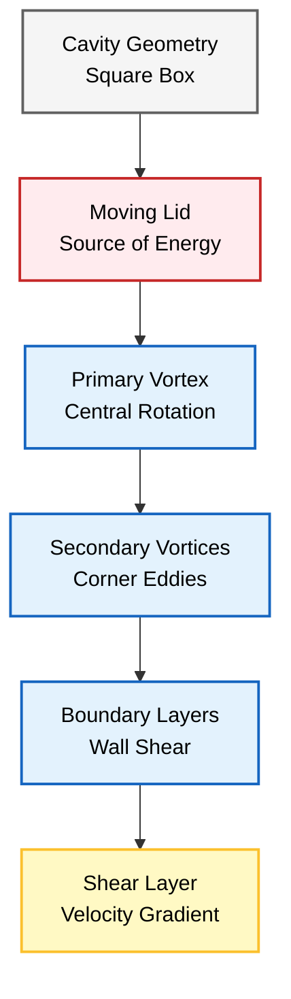
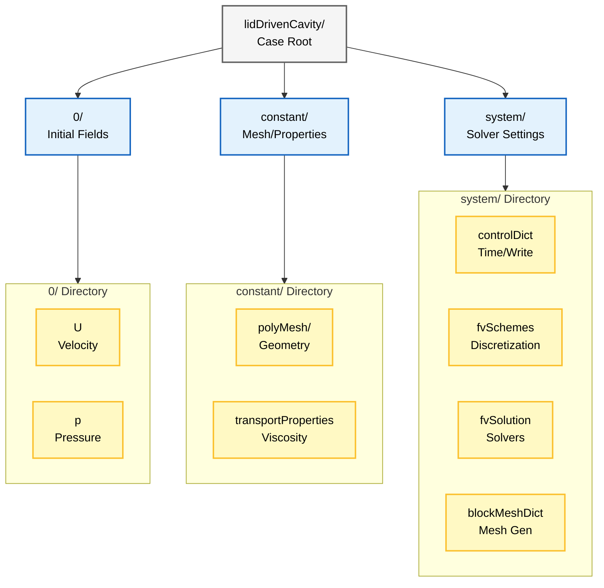
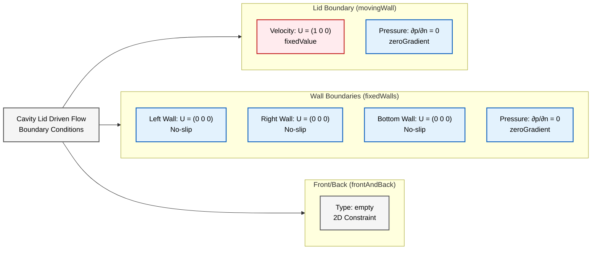
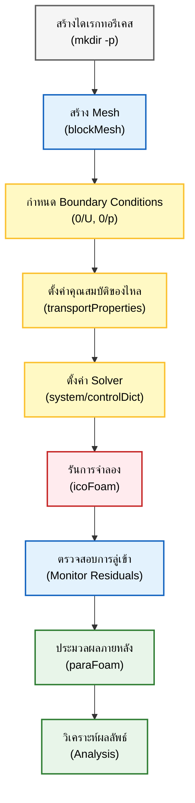

# บทช่วยสอนทีละขั้นตอน (Step-by-Step Tutorial)

> [!INFO] ภาพรวมบทช่วยสอน
> บทช่วยสอนนี้จะแนะนำทีละขั้นตอนสำหรับการตั้งค่าและรันการจำลอง CFD ครั้งแรกของคุณใน OpenFOAM โดยใช้ปัญหา **Lid-Driven Cavity Flow** ซึ่งเปรียบเสมือน "Hello World" ของ CFD

---

## ภาพรวมปัญหา Lid-Driven Cavity

### คำอธิบายทางกายภาพ

ลองจินตนาการถึงกล่องสี่เหลี่ยมที่บรรจุของไหลอยู่ **ฝาปิดด้านบนเคลื่อนที่ไปทางขวาด้วยความเร็วคงที่** โดยลากของไหลให้เคลื่อนที่ตามไปด้วย


> **Figure 1:** เรขาคณิตของ Lid-Driven Cavity และลักษณะการไหล แสดงให้เห็นฝาปิดด้านบนที่เคลื่อนที่ซึ่งขับเคลื่อนให้เกิดกระแสวนหลักขนาดใหญ่ตรงกลางและกระแสวนรองในมุมกล่อง พร้อมอิทธิพลของชั้นขอบเขตและความเค้นเฉือนที่ผนัง


| พารามิเตอร์ | ค่าที่กำหนด | คำอธิบาย |
|---|---|---|
| **Domain** | โพรงสี่เหลี่ยมจัตุรัส ($L \times L$) | ขอบเขตการจำลอง |
| **Top Wall** | เคลื่อนที่ ($U = 1$ m/s) | ฝาปิดที่เคลื่อนที่ |
| **Other Walls** | หยุดนิ่ง ($U = 0$) | ผนังด้านข้างและด้านล่าง |
| **Fluid** | อัดตัวไม่ได้ (Incompressible), แบบนิวตัน (Newtonian) | ชนิดของของไหล |
| **Flow** | ลามินาร์ (Laminar) ($Re = 10$) | ลักษณะการไหล |

### มูลฐานทางคณิตศาสตร์

การเคลื่อนที่ของของไหลถูกควบคุมโดย **Incompressible Navier-Stokes equations**:

**สมการความต่อเนื่อง (การอนุรักษ์มวล):**
$$\nabla \cdot \mathbf{u} = 0$$

**สมการโมเมนตัม:**
$$\rho \left(\frac{\partial \mathbf{u}}{\partial t} + \mathbf{u} \cdot \nabla \mathbf{u}\right) = -\nabla p + \mu \nabla^2 \mathbf{u} + \mathbf{f}$$

โดยที่:
- $\mathbf{u} = (u,v)$ = เวกเตอร์ความเร็ว (velocity vector)
- $p$ = ความดัน (pressure)
- $\rho$ = ความหนาแน่น (density)
- $\mu$ = ความหนืดพลวัต (dynamic viscosity)
- $\mathbf{f}$ = แรงกระทำต่อปริมาตร (body forces)

### เลขเรย์โนลด์ (Reynolds Number)

เลขเรย์โนลด์เป็นตัวบ่งชี้ลักษณะการไหล:
$$Re = \frac{\rho U L}{\mu} = \frac{U L}{\nu}$$

สำหรับการจำลองนี้:
$$Re = \frac{1 \times 0.1}{0.01} = 10$$

**การตีความ:** ค่า $Re = 10$ จัดอยู่ใน Laminar regime อย่างชัดเจน การไหลจะมีลักษณะคงที่และสมมาตร

---

## ขั้นตอนที่ 1: การตั้งค่าเคส (Case Setup)

**เริ่มต้นด้วยการสร้างโครงสร้างไดเรกทอรีมาตรฐาน** สำหรับเคส OpenFOAM การจำลอง CFD ทุกครั้งใน OpenFOAM จะมีโครงสร้างที่เป็นระเบียบสอดคล้องกัน

### โครงสร้างไดเรกทอรี OpenFOAM Case


> **Figure 2:** โครงสร้างไดเรกทอรีของกรณีทดสอบใน OpenFOAM แสดงการจัดเก็บเงื่อนไขเริ่มต้นในโฟลเดอร์ `0/`, ข้อมูล Mesh และคุณสมบัติของไหลใน `constant/` และการตั้งค่า Solver ใน `system/`


| ไดเรกทอรี | วัตถุประสงค์ | คำอธิบาย |
|-----------|-------------|----------|
| `0/` | เงื่อนไขเริ่มต้น | เก็บค่าฟิลด์เริ่มต้น (ความเร็ว, ความดัน, อุณหภูมิ) ที่เวลา $t=0$ |
| `constant/` | คุณสมบัติคงที่ | ข้อมูลที่ไม่เปลี่ยนแปลงตามเวลา เช่น Mesh ใน `polyMesh/` และคุณสมบัติทางกายภาพ |
| `system/` | การควบคุม Solver | Dictionaries ที่ควบคุมกระบวนการแก้ปัญหาเชิงตัวเลข |

### คำสั่งการสร้างไดเรกทอรี

```bash
mkdir -p cavity/{0,constant,system}
cd cavity
```

---

## ขั้นตอนที่ 2: การสร้าง Mesh (`system/blockMeshDict`)

**Dictionary `blockMeshDict`** ใช้สำหรับกำหนดรูปทรงเรขาคณิตเชิงคำนวณ (computational geometry) และสร้าง Mesh แบบ hexahedral ที่มีโครงสร้างโดยใช้ยูทิลิตี `blockMesh`

### หลักการ Block-based Method

- รูปทรงเรขาคณิตที่ซับซ้อนจะถูกแบ่งย่อยออกเป็น Block แบบ hexahedral ที่เรียบง่าย
- **Vertices**: จุดมุม 8 จุดของแต่ละ Block 3 มิติ (แม้สำหรับปัญหา 2 มิติ OpenFOAM ทำงานในพื้นที่ 3 มิติ)
- **Blocks**: กำหนดวิธีการเติมปริมาตรด้วยเซลล์แบบ hexahedral โดยใช้การเชื่อมต่อของ Vertex และการไล่ระดับเซลล์
- **Boundary**: จัดกลุ่ม Mesh faces เป็น Patches เชิงตรรกะสำหรับการประยุกต์ใช้ Boundary Condition

### การกำหนด Mesh

จะกำหนดโดเมนสี่เหลี่ยมจัตุรัสหนึ่งหน่วยที่มีพิกัด $(x,y) \in [0,1] \times [0,1]$ และมีความหนาในทิศทาง z เท่ากับ 0.1 หน่วย

**คำสั่ง `convertToMeters 0.1`** จะปรับขนาดมิติทั้งหมด ทำให้ได้ Cavity ทางกายภาพขนาด:
$$0.1 \text{ m} \times 0.1 \text{ m} \times 0.01 \text{ m}$$

**Mesh ประกอบด้วยเซลล์แบบ hexahedral จำนวน:**
$$20 \times 20 \times 1 = 400 \text{ เซลล์}$$

### OpenFOAM Code: `system/blockMeshDict`

```cpp
/*--------------------------------*- C++ -*----------------------------------*\
| =========                 |                                             |
| \      /  F ield         | OpenFOAM: The Open Source CFD Toolbox           |
|  \    /   O peration     | Version:  v2012                                 |
|   \  /    A nd           | Web:      www.OpenFOAM.com                      |
|    \/     M anipulation  |                                             |
\*---------------------------------------------------------------------------*/
FoamFile
{
    version     2.0;
    format      ascii;
    class       dictionary;
    object      blockMeshDict;
}
// * * * * * * * * * * * * * * * * * * * * * * * * * * * * * * * * * * * * * //

// Scale factor to convert all dimensions to meters
convertToMeters 0.1;

// Define the 8 vertices of the hexahedral block
vertices
(
    (0 0 0)   // 0 - Lower-left-back corner
    (1 0 0)   // 1 - Lower-right-back corner
    (1 1 0)   // 2 - Upper-right-back corner
    (0 1 0)   // 3 - Upper-left-back corner
    (0 0 0.1) // 4 - Lower-left-front corner (z-direction thickness)
    (1 0 0.1) // 5 - Lower-right-front corner
    (1 1 0.1) // 6 - Upper-right-front corner
    (0 1 0.1) // 7 - Upper-left-front corner
);

// Define the block with cell counts and grading
blocks
(
    // hex (vertex ordering) (cells_x cells_y cells_z) grading ratios
    hex (0 1 2 3 4 5 6 7) (20 20 1) simpleGrading (1 1 1)
);

// Optional curved edges - none needed for this simple geometry
edges
(
);

// Define boundary patches
boundary
(
    movingWall
    {
        type wall;                    // Wall boundary condition type
        faces
        (
            (3 7 6 2)                // Top face (y = 1) - will be the moving lid
        );
    }
    fixedWalls
    {
        type wall;
        faces
        (
            (0 4 7 3)                // Left wall (x = 0)
            (1 5 4 0)                // Bottom wall (y = 0)
            (2 6 5 1)                // Right wall (x = 1)
        );
    }
    frontAndBack
    {
        type empty;                  // Special boundary for 2D simulations
        faces                       // Reduces computational domain to 2D
        (
            (0 1 2 3)                // Back face (z = 0)
            (4 5 6 7)                // Front face (z = 0.1)
        );
    }
);

// Optional patch merging operations - none needed here
mergePatchPairs
(
);

// * * * * * * * * * * * * * * * * * * * * * * * * * * * * * * * * * * * * * //
```

> 📂 **Source:** `blockMeshDict` เป็นส่วนประกอบมาตรฐานของ OpenFOAM ที่ใช้สร้าง computational mesh สำหรับการจำลอง CFD
>
> **Explanation:** blockMeshDict คือ dictionary file ที่กำหนดรูปทรงเรขาคณิตและคุณสมบัติของ mesh โดยใช้ block-based approach ซึ่งแบ่งโดเมนเป็น hexahedral blocks ที่เชื่อมต่อกัน
>
> **Key Concepts:**
> - **Vertices**: จุดมุม 8 จุดที่กำหนดรูปทรงเรขาคณิตของ block
> - **Blocks**: กำหนดจำนวนเซลล์ในแต่ละทิศทาง (20x20x1) และ grading ratios
> - **Boundary patches**: กำหนด boundary conditions ที่ผนังต่าง ๆ (movingWall, fixedWalls, frontAndBack)
> - **empty type**: ใช้สำหรับการจำลอง 2D โดยลดขนาดโดเมนในทิศทาง z

### การดำเนินการสร้าง Mesh

```bash
blockMesh
```

> [!TIP] การตรวจสอบ Mesh
> หลังจากรัน `blockMesh` สามารถตรวจสอบคุณภาพ Mesh ด้วยคำสั่ง:
> ```bash
> checkMesh
> ```

---

## ขั้นตอนที่ 3: Boundary Conditions (`0/`)

**ไดเรกทอรี `0/`** ประกอบด้วยค่าฟิลด์เริ่มต้นที่เวลา $t=0$ สำหรับ Incompressible laminar flow Solver `icoFoam` เราจำเป็นต้องระบุฟิลด์ความเร็ว ($\mathbf{U}$) และ Kinematic pressure ($p$)

### ฟิลด์ความเร็ว (`0/U`)

**มิติของฟิลด์ความเร็ว:** `[0 1 -1 0 0 0 0]` สอดคล้องกับการวิเคราะห์มิติสำหรับความเร็ว: $[L^1 T^{-1}]$

**Boundary Condition ของ Lid-driven cavity:** กำหนดให้ผนังด้านบน (`movingWall`) เคลื่อนที่ด้วยความเร็ว $\mathbf{U} = (1, 0, 0)$ m/s

### OpenFOAM Code: `0/U`

```cpp
/*--------------------------------*- C++ -*----------------------------------*\
| =========                 |                                             |
| \      /  F ield         | OpenFOAM: The Open Source CFD Toolbox           |
|  \    /   O peration     | Version:  v2012                                 |
|   \  /    A nd           | Web:      www.OpenFOAM.com                      |
|    \/     M anipulation  |                                             |
\*---------------------------------------------------------------------------*/
FoamFile
{
    version     2.0;
    format      ascii;
    class       volVectorField;     // Volume vector field
    object      U;                  // Velocity field
}
// * * * * * * * * * * * * * * * * * * * * * * * * * * * * * * * * * * * * * //

// Dimensional analysis: [L^1 T^(-1)] - velocity dimensions
dimensions      [0 1 -1 0 0 0 0];

// Initial velocity field: fluid starts from rest
internalField   uniform (0 0 0);

// Boundary conditions for velocity
boundaryField
{
    // Moving lid boundary - top wall
    movingWall
    {
        // Dirichlet condition: fixed value at boundary
        type            fixedValue;
        // Lid velocity: U = 1 m/s in x-direction
        value           uniform (1 0 0);
    }

    // Fixed walls - left, right, and bottom
    fixedWalls
    {
        // No-slip condition: velocity is zero at walls
        type            noSlip;
    }

    // Front and back planes for 2D simulation
    frontAndBack
    {
        // Empty boundary condition for 2D reduction
        type            empty;
    }
}

// * * * * * * * * * * * * * * * * * * * * * * * * * * * * * * * * * * * * * //
```

> 📂 **Source:** `0/U` เป็นไฟล์กำหนดค่าเริ่มต้นและเงื่อนไขขอบเขตสำหรับฟิลด์ความเร็วใน OpenFOAM ซึ่งเป็นส่วนสำคัญของการตั้งค่าเคส
>
> **Explanation:** ไฟล์นี้กำหนดค่าเริ่มต้นของความเร็ว (internalField) และเงื่อนไขขอบเขตทั้งหมด (boundaryField) สำหรับการจำลองการไหลในโพรง
>
> **Key Concepts:**
> - **dimensions**: มิติของปริมาณทางกายภาพ [L^1 T^(-1)] สำหรับความเร็ว
> - **internalField**: ค่าเริ่มต้นของความเร็วในโดเมน (ของไหลเริ่มจากสภาพนิ่ง)
> - **fixedValue**: กำหนดค่าคงที่ที่ขอบเขต (Dirichlet condition)
> - **noSlip**: เงื่อนไข no-slip ที่ผนัง (ความเร็วเป็นศูนย์)
> - **empty**: ใช้สำหรับการจำลอง 2D โดยไม่มีการไหลในทิศทาง z

### ฟิลด์ความดัน (`0/p`)

**ฟิลด์ความดันใช้ Kinematic pressure:** $p/\rho$ ที่มีมิติ `[0 2 -2 0 0 0 0]` ซึ่งสอดคล้องกับ $[L^2 T^{-2}]$

**Boundary Condition แบบ zeroGradient:** ใช้ $\frac{\partial p}{\partial n} = 0$ ที่ผนังแข็ง ซึ่งเหมาะสมทางกายภาพสำหรับการไหลแบบ Incompressible flow

### OpenFOAM Code: `0/p`

```cpp
/*--------------------------------*- C++ -*----------------------------------*\
| =========                 |                                             |
| \      /  F ield         | OpenFOAM: The Open Source CFD Toolbox           |
|  \    /   O peration     | Version:  v2012                                 |
|   \  /    A nd           | Web:      www.OpenFOAM.com                      |
|    \/     M manupulation  |                                             |
\*---------------------------------------------------------------------------*/
FoamFile
{
    version     2.0;
    format      ascii;
    class       volScalarField;     // Volume scalar field
    object      p;                  // Pressure field
}
// * * * * * * * * * * * * * * * * * * * * * * * * * * * * * * * * * * * * * //

// Dimensional analysis: [L^2 T^(-2)] - kinematic pressure (p/rho)
dimensions      [0 2 -2 0 0 0 0];

// Initial pressure field: starts from zero gauge pressure
internalField   uniform 0;

// Boundary conditions for pressure
boundaryField
{
    // Moving lid boundary
    movingWall
    {
        // Neumann condition: zero normal gradient (∂p/∂n = 0)
        type            zeroGradient;
    }

    // Fixed walls
    fixedWalls
    {
        // Walls don't prescribe pressure value
        type            zeroGradient;
    }

    // Front and back planes for 2D simulation
    frontAndBack
    {
        // Empty boundary condition for 2D reduction
        type            empty;
    }
}

// * * * * * * * * * * * * * * * * * * * * * * * * * * * * * * * * * * * * * //
```

> 📂 **Source:** `0/p` เป็นไฟล์กำหนดค่าเริ่มต้นและเงื่อนไขขอบเขตสำหรับฟิลด์ความดันใน OpenFOAM ซึ่งเป็นส่วนสำคัญของการจำลองการไหลแบบ incompressible
>
> **Explanation:** ไฟล์นี้กำหนดค่าเริ่มต้นของความดันจลน์ (kinematic pressure = p/ρ) และเงื่อนไขขอบเขตทั้งหมด โดยใช้ kinematic pressure เพื่อลดความซับซ้อนในการคำนวณ
>
> **Key Concepts:**
> - **dimensions**: มิติของ kinematic pressure [L^2 T^(-2)] ซึ่งเป็น pressure divided by density
> - **internalField**: ค่าเริ่มต้นของความดัน (gauge pressure = 0)
> - **zeroGradient**: เงื่อนไข Neumann (∂p/∂n = 0) ที่ผนัง ซึ่งเหมาะสมสำหรับ incompressible flow
> - **empty**: ใช้สำหรับการจำลอง 2D

### ภาพรวม Boundary Conditions


> **Figure 3:** ภาพรวมของเงื่อนไขขอบเขตสำหรับปัญหาการไหลในโพรง แสดงการกำหนดความเร็วคงที่ที่ฝาปิดบน (movingWall), เงื่อนไข no-slip ที่ผนังด้านอื่น ๆ (fixedWalls) และเงื่อนไข empty สำหรับการจำลองแบบ 2 มิติ


---

## ขั้นตอนที่ 4: คุณสมบัติทางกายภาพของของไหล (`constant/transportProperties`)

**Dictionary `constant/transportProperties`** กำหนดคุณสมบัติของของไหลที่ Solver ต้องการ สำหรับ `icoFoam` ซึ่งแก้สมการ Incompressible Navier-Stokes สำหรับของไหลแบบ Newtonian เราจำเป็นต้องระบุเพียง Kinematic viscosity เท่านั้น

### ค่าที่กำหนด

**ค่าคุณสมบัติ:**
- **Kinematic viscosity:** $\nu = 0.01$ m²/s
- **Reynolds number:** $Re = \frac{UL}{\nu} = \frac{1 \times 0.1}{0.01} = 10$

**Reynolds number ที่ต่ำ (Re=10):** จัดว่าเป็นการไหลแบบ Laminar regime อย่างชัดเจน ช่วยให้มั่นใจได้ถึงรูปแบบการไหลที่คงที่และสมมาตร

### OpenFOAM Code: `constant/transportProperties`

```cpp
/*--------------------------------*- C++ -*----------------------------------*\
| =========                 |                                             |
| \      /  F ield         | OpenFOAM: The Open Source CFD Toolbox           |
|  \    /   O peration     | Version:  v2012                                 |
|   \  /    A nd           | Web:      www.OpenFOAM.com                      |
|    \/     M anipulation  |                                             |
\*---------------------------------------------------------------------------*/
FoamFile
{
    version     2.0;
    format      ascii;
    class       dictionary;
    object      transportProperties;
}
// * * * * * * * * * * * * * * * * * * * * * * * * * * * * * * * * * * * * * //

// Transport model: Newtonian fluid assumes linear stress-strain relationship
transportModel  Newtonian;

// Kinematic viscosity ν = 0.01 m^2/s
// Dimensions: [L^2 T^(-1)]
nu              [0 2 -1 0 0 0 0] 0.01;

// Reynolds number calculation:
// Re = UL/ν = (1 m/s × 0.1 m) / 0.01 m^2/s = 10
// This gives a low Reynolds number flow in the laminar regime

// * * * * * * * * * * * * * * * * * * * * * * * * * * * * * * * * * * * * * //
```

> 📂 **Source:** `constant/transportProperties` เป็นไฟล์กำหนดคุณสมบัติทางกายภาพของของไหลใน OpenFOAM ซึ่งเป็นส่วนสำคัญในการกำหนดลักษณะของของไหลที่จะจำลอง
>
> **Explanation:** ไฟล์นี้กำหนด transport model และคุณสมบัติทางกายภาพของของไหล โดยสำหรับการจำลองนี้ใช้ Newtonian fluid model ซึ่งเป็นแบบจำลองที่เรียบง่ายที่สุด
>
> **Key Concepts:**
> - **transportModel**: ประเภทของของไหล (Newtonian, non-Newtonian)
> - **nu (kinematic viscosity)**: ความหนืดจลน์ [L^2 T^(-1)] ซึ่งเป็น dynamic viscosity divided by density
> - **Reynolds number**: ตัวบ่งชี้ลักษณะการไหล (Re = UL/ν)
> - **Laminar regime**: การไหลแบบลามินาร์เกิดขึ้นเมื่อ Re < 2300 (สำหรับการไหลในท่อ)

---

## ขั้นตอนที่ 5: การควบคุม Solver (`system/`)

**ไดเรกทอรี `system/`** ประกอบด้วย Dictionaries ที่สำคัญสามชุดซึ่งควบคุมกระบวนการแก้ปัญหาเชิงตัวเลข:

| Dictionary | หน้าที่ | พารามิเตอร์หลัก |
|-----------|----------|-----------------|
| `controlDict` | การเลื่อนเวลา | เวลาเริ่มต้น/สิ้นสุด, ขนาด Time step |
| `fvSchemes` | Spatial discretization | ความละเอียดของพจน์ต่างๆ |
| `fvSolution` | Linear Solver | การตั้งค่าตัวแก้สมการเชิงเส้น |

### `system/controlDict` - การควบคุมเวลา

**Dictionary นี้จัดการด้านเวลา** ของการจำลอง รวมถึงเวลาเริ่มต้น/สิ้นสุด ขนาด Time step และความถี่ในการส่งออกข้อมูล

### OpenFOAM Code: `system/controlDict`

```cpp
/*--------------------------------*- C++ -*----------------------------------*\
| =========                 |                                             |
| \      /  F ield         | OpenFOAM: The Open Source CFD Toolbox           |
|  \    /   O peration     | Version:  v2012                                 |
|   \  /    A nd           | Web:      www.OpenFOAM.com                      |
|    \/     M anipulation  |                                             |
\*---------------------------------------------------------------------------*/
FoamFile
{
    version     2.0;
    format      ascii;
    class       dictionary;
    object      controlDict;
}
// * * * * * * * * * * * * * * * * * * * * * * * * * * * * * * * * * * * * * //

// Solver to use: incompressible transient Navier-Stokes solver
application     icoFoam;

// Time control
startFrom       startTime;          // Start simulation from specified time
startTime       0;                  // Begin at t = 0
stopAt          endTime;            // Stop when reaching end time
endTime         0.5;                // Final simulation time (seconds)
deltaT          0.005;              // Time step size: Δt = 0.005 s

// Output control parameters
writeControl    timeStep;           // Write based on time step count
writeInterval   20;                 // Write every 20 time steps
purgeWrite      0;                  // Keep all time directories
runTimeModifiable true;             // Allow runtime modification

// * * * * * * * * * * * * * * * * * * * * * * * * * * * * * * * * * * * * * //
```

> 📂 **Source:** `system/controlDict` เป็นไฟล์ควบคุมการทำงานของ Solver ใน OpenFOAM ซึ่งกำหนดเวลาและความถี่ในการบันทึกผลลัพธ์
>
> **Explanation:** ไฟล์นี้ควบคุมทุกด้านของการจัดการเวลาในการจำลอง ตั้งแต่เวลาเริ่มต้นถึงเวลาสิ้นสุด รวมถึงความถี่ในการบันทึกผลลัพธ์
>
> **Key Concepts:**
> - **application**: ชื่อของ Solver ที่จะใช้ (icoFoam สำหรับ incompressible flow)
> - **startTime/endTime**: เวลาเริ่มต้นและสิ้นสุดของการจำลอง
> - **deltaT**: ขนาดของ time step ซึ่งต้องเล็กพอสำหรับความเสถียร
> - **writeInterval**: ความถี่ในการบันทึกผลลัพธ์ (ทุก 20 time steps)

### พารามิเตอร์การควบคุมเวลา

- **Time step size:** $\Delta t = 0.005$ วินาที
- **Simulation time:** 0 ถึง 0.5 วินาที (ทำให้ได้ 100 time steps)
- **Output frequency:** ทุก 20 time steps (ทำให้ได้ 5 ชุดผลลัพธ์)

### ไทม์ไลน์การจำลอง

```mermaid
flowchart LR
    A["Simulation Start<br/>t = 0.0 s"]:::context --> B["Time Step 1<br/>Δt = 0.005 s"]:::implicit
    B --> C["Time Step 2<br/>t = 0.010 s"]:::implicit
    C --> D["... Time Steps ..."]:::context
    D --> E["Output 1<br/>t = 0.100 s"]:::explicit
    E --> F["... Time Steps ..."]:::context
    F --> G["Output 2<br/>t = 0.200 s"]:::explicit
    G --> H["... Time Steps ..."]:::context
    H --> I["Output 3<br/>t = 0.300 s"]:::explicit
    I --> J["... Time Steps ..."]:::context
    J --> K["Output 4<br/>t = 0.400 s"]:::explicit
    K --> L["... Time Steps ..."]:::context
    L --> M["Final Output<br/>t = 0.500 s"]:::success
    
    classDef context fill:#f5f5f5,stroke:#616161,stroke-width:2px,color:#000;
    classDef implicit fill:#e3f2fd,stroke:#1565c0,stroke-width:2px,color:#000;
    classDef explicit fill:#fff9c4,stroke:#fbc02d,stroke-width:2px,color:#000;
    classDef success fill:#e8f5e9,stroke:#2e7d32,stroke-width:2px,color:#000;
```


> **Figure 4:** ไทม์ไลน์การจำลองและความถี่ในการส่งออกข้อมูล แสดงขนาดขั้นตอนเวลา ($\Delta t$) และช่วงเวลาที่จะมีการบันทึกผลลัพธ์ลงในไดเรกทอรีเวลาตั้งแต่เริ่มต้นจนสิ้นสุดการจำลอง


### `system/fvSchemes` - Spatial Discretization Schemes

**Dictionary นี้กำหนดระเบียบวิธี Discretization** สำหรับพจน์ต่างๆ ในสมการควบคุม

### OpenFOAM Code: `system/fvSchemes`

```cpp
/*--------------------------------*- C++ -*----------------------------------*\
| =========                 |                                             |
| \      /  F ield         | OpenFOAM: The Open Source CFD Toolbox           |
|  \    /   O peration     | Version:  v2012                                 |
|   \  /    A nd           | Web:      www.OpenFOAM.com                      |
|    \/     M anipulation  |                                             |
\*---------------------------------------------------------------------------*/
FoamFile
{
    version     2.0;
    format      ascii;
    class       dictionary;
    object      fvSchemes;
}
// * * * * * * * * * * * * * * * * * * * * * * * * * * * * * * * * * * * * * //

// Time discretization schemes
ddtSchemes
{
    // First-order implicit Euler scheme for time derivatives
    default         Euler;
}

// Gradient calculation schemes
gradSchemes
{
    // Central difference scheme with linear interpolation
    default         Gauss linear;
}

// Divergence (convection) schemes
divSchemes
{
    default         none;
    // Central difference for convective term
    div(phi,U)      Gauss linear;
}

// Laplacian (diffusion) schemes
laplacianSchemes
{
    // Corrected scheme for non-orthogonal meshes
    default         Gauss linear corrected;
}

// Interpolation schemes for face values
interpolationSchemes
{
    default         linear;
}

// Surface normal gradient schemes
snGradSchemes
{
    default         corrected;
}

// * * * * * * * * * * * * * * * * * * * * * * * * * * * * * * * * * * * * * //
```

> 📂 **Source:** `system/fvSchemes` เป็นไฟล์กำหนดระเบียบวิธี Discretization ใน OpenFOAM ซึ่งควบคุมความแม่นยำและความเสถียรของการแก้ปัญหาเชิงตัวเลข
>
> **Explanation:** ไฟล์นี้กำหนดระเบียบวิธีทางคณิตศาสตร์สำหรับการแปลงสมการเชิงอนุพันธ์ให้เป็นรูปแบบพีชคณิตที่สามารถแก้ได้ด้วยคอมพิวเตอร์
>
> **Key Concepts:**
> - **ddtSchemes**: ระเบียบวิธีการประมาณค่าอนุพันธ์เชิงเวลา (Euler = อันดับหนึ่ง)
> - **gradSchemes**: ระเบียบวิธีการคำนวณ gradient (Gauss linear = central difference)
> - **divSchemes**: ระเบียบวิธีสำหรับพจน์ convection (Gauss linear = central difference)
> - **laplacianSchemes**: ระเบียบวิธีสำหรับพจน์ diffusion (corrected = แก้ไขสำหรับ non-orthogonal mesh)

### `system/fvSolution` - Linear Solver Settings

**Dictionary นี้กำหนดการตั้งค่า Linear Solver** และพารามิเตอร์ PISO algorithm

### OpenFOAM Code: `system/fvSolution`

```cpp
/*--------------------------------*- C++ -*----------------------------------*\
| =========                 |                                             |
| \      /  F ield         | OpenFOAM: The Open Source CFD Toolbox           |
|   \    /   O peration     | Version:  v2012                                 |
|   \  /    A nd           | Web:      www.OpenFOAM.com                      |
|    \/     M anipulation  |                                             |
\*---------------------------------------------------------------------------*/
FoamFile
{
    version     2.0;
    format      ascii;
    class       dictionary;
    object      fvSolution;
}
// * * * * * * * * * * * * * * * * * * * * * * * * * * * * * * * * * * * * * //

// Linear solver settings for each variable
solvers
{
    // Pressure equation solver
    p
    {
        // Geometric-Algebraic Multi-Grid solver (fast for Poisson equations)
        solver          GAMG;
        // Absolute convergence tolerance
        tolerance       1e-06;
        // Relative tolerance (10% of initial residual)
        relTol          0.1;
        // Smoother for multigrid cycles
        smoother        GaussSeidel;
    }

    // Velocity equation solver
    U
    {
        // Iterative solver with smoothing
        solver          smoothSolver;
        // Smoother algorithm
        smoother        GaussSeidel;
        // Absolute convergence tolerance for velocity
        tolerance       1e-05;
        // No relative tolerance (must meet absolute tolerance)
        relTol          0;
    }
}

// PISO algorithm parameters for pressure-velocity coupling
PISO
{
    // Number of pressure corrector iterations
    nCorrectors      2;
    // Non-orthogonality corrections (0 = mesh is orthogonal)
    nNonOrthogonalCorrectors 0;
    // Reference cell for pressure (to avoid floating pressure)
    pRefCell        0;
    // Reference pressure value
    pRefValue       0;
}

// * * * * * * * * * * * * * * * * * * * * * * * * * * * * * * * * * * * * * //
```

> 📂 **Source:** `system/fvSolution` เป็นไฟล์กำหนดการตั้งค่า Linear Solver และอัลกอริทึมการแก้ปัญหาใน OpenFOAM ซึ่งมีผลต่อความเร็วและความแม่นยำของการแก้ปัญหา
>
> **Explanation:** ไฟล์นี้กำหนดวิธีการแก้สมการเชิงเส้นสำหรับแต่ละตัวแปร (ความดันและความเร็ว) และพารามิเตอร์ของอัลกอริทึม PISO สำหรับการเชื่อมโยง pressure-velocity
>
> **Key Concepts:**
> - **GAMG**: Geometric-Algebraic Multi-Grid solver ซึ่งเร็วสำหรับสมการ Poisson (ความดัน)
> - **smoothSolver**: Iterative solver สำหรับสมการความเร็ว
> - **tolerance/relTol**: เกณฑ์การลู่เข้าของ Solver
> - **PISO**: Pressure Implicit with Splitting of Operators algorithm สำหรับ transient flow

> [!INFO] อัลกอริทึม PISO
> **PISO (Pressure Implicit with Splitting of Operators)** เป็นอัลกอริทึมสำหรับการจัดการ pressure-velocity coupling ในปัญหา transient:
>
> 1. **Predictor Step** - แก้สมการโมเมนตัมโดยใช้ความดันจาก time step ก่อนหน้า
> 2. **Corrector Step** (ทำซ้ำ nCorrectors ครั้ง) - แก้สมการความดันและแก้ไขความเร็ว
> 3. **Time Advancement** - อัพเดทค่าทั้งหมดไปยัง time step ถัดไป

---

## ขั้นตอนที่ 6: การรัน Solver

เมื่อตั้งค่าทุกอย่างเรียบร้อยแล้ว สามารถรันการจำลองได้

### การรัน icoFoam

```bash
icoFoam
```

### การตรวจสอบการลู่เข้า (Convergence Monitoring)

ระหว่างการรัน Solver จะแสดงข้อมูล Residual สำหรับแต่ละ time step:

```
Time = 0.005

smoothSolver: Solving for Ux, initial residual = 1, final residual = 1.23456e-07, no iterations = 2
smoothSolver: Solving for Uy, initial residual = 0, final residual = 2.34567e-08, no iterations = 1
GAMG: Solving for p, initial residual = 1, final residual = 8.76235e-06, no iterations = 12
time step continuity errors : sum local = 1.23456e-08, global = 2.34567e-09, cumulative = 2.34567e-09
ExecutionTime = 0.15 s  ClockTime = 0 s

Time = 0.01
...
```

### การตีความ Residual

- **Initial residual:** ค่าเริ่มต้นของความคลาดเคลื่อนก่อนการแก้
- **Final residual:** ค่าสุดท้ายหลังการแก้
- **No iterations:** จำนวน iteration ที่ใช้
- **Continuity errors:** ตรวจสอบการอนุรักษ์มวล

> [!TIP] เกณฑ์การลู่เข้า
> - Residuals ควรลดลงต่ำกว่า $10^{-5}$ ถึง $10^{-6}$
> - Continuity errors ควรอยู่ในช่วง $10^{-8}$ ถึง $10^{-9}$
> - หาก Residuals ไม่ลู่เข้า อาจต้องลดขนาด Time step หรือปรับ Solver settings

---

## ขั้นตอนที่ 7: การประมวลผลภายหลัง (Post-Processing)

เมื่อการจำลองเสร็จสมบูรณ์ สามารถวิเคราะห์ผลลัพธ์ได้โดยใช้ ParaView

### การเปิดผลลัพธ์ใน ParaView

```bash
paraFoam
```

หรือสร้าง case สำหรับ ParaView:

```bash
paraFoam -builtin
```

### ปริมาณที่น่าสนใจสำหรับการวิเคราะห์

| ปริมาณ | สัญลักษณ์ | หน่วย | คำอธิบาย |
|--------|-----------|--------|----------|
| Velocity | $\mathbf{U}$ | m/s | เวกเตอร์ความเร็ว |
| Pressure | $p$ | m²/s² | ความดันจลน์ (kinematic pressure) |
| Vorticity | $\boldsymbol{\omega} = \nabla \times \mathbf{U}$ | 1/s | การหมุนของของไหล |
| Stream Function | $\psi$ | m² | ฟังก์ชันกระแส |
| Wall Shear Stress | $\tau_w$ | Pa | ความเค้นเฉือนที่ผนัง |

### เทคนิคการแสดงผลที่เป็นประโยชน์

1. **Velocity Magnitude Contours** - แสดงการกระจายของความเร็ว
2. **Velocity Vectors** - แสดงทิศทางการไหล
3. **Streamlines** - แสดงเส้นทางการไหล
4. **Pressure Contours** - แสดงการกระจายความดัน
5. **Vorticity Contours** - แสดงบริเวณที่มีการหมุน

---

## ผลลัพธ์ที่คาดหวังสำหรับ Re = 10

### โครงสร้างกระแสวนหลัก

ลักษณะเด่นที่สุดคือกระแสวนหลักขนาดใหญ่และต่อเนื่องที่ครอบงำบริเวณกลาง Cavity

| คุณลักษณะ | ค่าที่คาดหวัง |
|-----------|----------------|
| **ตำแหน่งศูนย์กลางกระแสวน** | $(x/L, y/L) \approx (0.5, 0.4)$ |
| **ทิศทางการหมุน** | ตามเข็มนาฬิกา (clockwise) |
| **Stream Function สูงสุด** | $\psi_{\max} \approx -0.1$ |
| **ความเร็วสูงสุดภายใน** | $|\mathbf{u}|_{\max} \approx 0.7$ m/s |

### รูปแบบการไหลเวียนหลัก

| บริเวณ | ทิศทางการไหล | ความเร็วโดยประมาณ |
|---------|---------------|-------------------|
| **บริเวณด้านบน** | ไปทางขวาในแนวนอน | $U = 1.0$ m/s |
| **ผนังด้านขวา** | ไหลลงตามขอบแนวตั้ง | $0.6-0.7$ m/s |
| **บริเวณด้านล่าง** | ไปทางซ้ายตามผนัง | $0.2-0.3$ m/s |
| **ผนังด้านซ้าย** | ไหลขึ้นตามขอบแนวตั้ง | ความเร็วขึ้นปานกลาง |

### ลักษณะการไหลรอง

สำหรับ $Re=10$ การไหลยังคงค่อนข้างเรียบง่าย:

- **ผลกระทบที่มุม** - โซนการไหลเวียนซ้ำเริ่มก่อตัวที่มุมด้านล่าง
- **Boundary Layers** - ก่อตัวขึ้นตามผนังทั้งหมด ความหนา $\delta \sim L/\sqrt{Re} \approx 0.32L$
- **Velocity Gradients** - เกิดขึ้นใกล้ Lid และมุม

---

## สรุปขั้นตอนการทำงาน


> **Figure 5:** สรุปขั้นตอนการทำงานของ OpenFOAM อย่างครบถ้วน ตั้งแต่การสร้างไดเรกทอรีและ Mesh การกำหนดเงื่อนไขขอบเขตและคุณสมบัติของไหล การตั้งค่า Solver ไปจนถึงการรันการจำลองและประมวลผลขั้นหลัง


### เอกสารที่เกี่ยวข้อง

- [[01_Introduction]] - บทนำสู่ OpenFOAM
- [[02_The_Workflow]] - ขั้นตอนการทำงานของการจำลอง CFD
- [[03_The_Lid-Driven_Cavity_Problem]] - รายละเอียดปัญหา Lid-Driven Cavity
- [[05_Expected_Results]] - ผลลัพธ์ที่คาดหวัง
- [[06_Exercises]] - แบบฝึกหัดเสริมทักษะ

### ข้อมูลอ้างอิงทางวิชาการ

- Ghia, U., Ghia, K. N., & Shin, C. T. (1982). High-Re solutions for incompressible flow using the Navier-Stokes equations and a multigrid method. *Journal of Computational Physics*, 48(3), 387-411.

> [!SUCCESS] ยินดีด้วย!
> คุณได้เรียนรู้ขั้นตอนการตั้งค่าและรันการจำลอง CFD แรกของคุณใน OpenFOAM สำหรับปัญหา Lid-Driven Cavity Flow บทช่วยสอนนี้ครอบคลุมตั้งแต่การสร้าง Mesh ไปจนถึงการวิเคราะห์ผลลัพธ์ ซึ่งเป็นพื้นฐานที่แข็งแกร่งสำหรับการแก้ปัญหา CFD ที่ซับซ้อนมากขึ้น