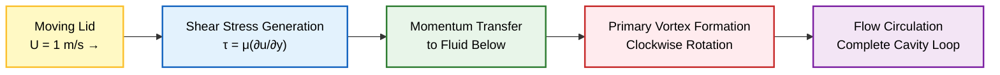
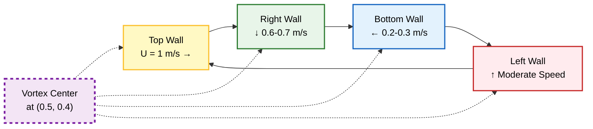
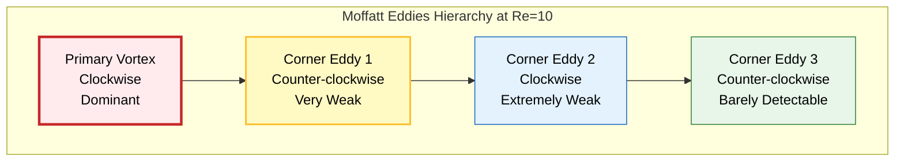

# ผลลัพธ์ที่คาดหวังสำหรับ Lid-Driven Cavity ที่ $Re=10$

> [!INFO] **ภาพรวม**
> หน้านี้อธิบายผลลัพธ์ที่คาดหวังจากการจำลอง Lid-Driven Cavity Flow ที่เลข Reynolds Number ($Re$) เท่ากับ 10 โดยใช้ OpenFOAM Solver `icoFoam` ผลลัพธ์เหล่านี้ทำหน้าที่เป็น ==benchmark== สำหรับการตรวจสอบความถูกต้องของการจำลอง CFD ของคุณ

---

## โครงสร้างกระแสวนหลัก (Primary Vortex Structure)

### ลักษณะเด่นของกระแสวน

ลักษณะเด่นที่สุดของการไหลในโพรงที่ $Re=10$ คือกระแสวนหลักขนาดใหญ่และต่อเนื่องที่ครอบงำบริเวณกลาง Cavity

**คุณสมบัติหลัก:**

| คุณสมบัติ | ค่า | คำอธิบาย |
|-----------|------|------------|
| **ตำแหน่ง** | ครอบคลุม 50-60% ของ Cavity | กระแสวนขนาดใหญ่ครอบงำพื้นที่ส่วนใหญ่ |
| **ศูนย์กลางกระแสวน** | $(x/L, y/L) \approx (0.5, 0.4)$ | เยื้องศูนย์เล็กน้อยไปทางผนังด้านล่าง |
| **การหมุน** | ตามเข็มนาฬิกา (Clockwise) | ขับเคลื่อนโดย Shear Stress จาก Lid |
| **Stream Function สูงสุด** | $\psi_{\max} \approx -0.1$ | เครื่องหมายลบ = การหมุนตามเข็มนาฬิกา |

### สาเหตุของการก่อตัว


> **Figure 1:** กลไกการก่อตัวของกระแสวนหลัก แสดงการถ่ายโอนโมเมนตัมจากฝาปิดที่เคลื่อนที่ไปยังของไหลด้านล่างผ่านแรงเค้นเฉือน ซึ่งขับเคลื่อนให้เกิดการไหลเวียนตามเข็มนาฬิกาทั่วทั้งโพรง
 ศูนย์กลางกระแสวนเลื่อนไปทางผนังด้านล่างเนื่องจาก:
- **Boundary Conditions** ที่ไม่สมมาตร (Lid เคลื่อนที่ด้านบนเท่านั้น)
- **No-slip Condition** ที่ผนังด้านล่างสร้างแรงต้าน
- **Viscous Dissipation** ทำให้โมเมนตัมลดลงเมื่ออยู่ห่างจาก Lid

> [!TIP] **ข้อสังเกต**
> ที่ $Re=10$ แรงเฉื่อย (Inertial Forces) ยังไม่แข็งแรงพอที่จะดึงกระแสวนให้อยู่ตรงกลาง ดังนั้นศูนย์กลางจึงเยื้องลงมาทางด้านล่าง

---

## รูปแบบการไหลเวียนหลัก (Main Circulation Pattern)

### การไหลตามแนวผนัง (Wall Flow Distribution)

การไหลโดยรวมเป็นไปตามรูปแบบการไหลเวียนตามเข็มนาฬิกาที่ชัดเจน โดยมีการกระจายความเร็วดังนี้:

| บริเวณ | ทิศทางการไหล | ความเร็ว | ลักษณะเฉพาะ |
|---------|---------------|-----------|--------------|
| **บริเวณด้านบน (Top Region)** | ไปทางขวาในแนวนอน | $U = 1 \, \text{m/s}$ | Boundary Layer มีโมเมนตัมสูงขับเคลื่อนการไหลเวียน |
| **ผนังด้านขวา (Right Wall)** | ไหลลงตามขอบแนวตั้ง | $0.6-0.7 \, \text{m/s}$ | ก่อตัวเป็น Jet ที่เคลื่อนที่ลง |
| **บริเวณด้านล่าง (Bottom Region)** | ไปทางซ้ายตามผนัง | $0.2-0.3 \, \text{m/s}$ | ความเร็วลดลงเนื่องจากการหน่วงด้วยความหนืด |
| **ผนังด้านซ้าย (Left Wall)** | ไหลขึ้นตามขอบแนวตั้ง | ความเร็วขึ้นปานกลาง | ทำให้การไหลเวียนครบวง |

### การไหลแบบวนซ้ำ (Recirculation Pattern)


> **Figure 2:** รูปแบบการไหลเวียนซ้ำและตำแหน่งจุดศูนย์กลางของกระแสวน แสดงความเร็วในแต่ละบริเวณตามแนวผนัง โดยมีจุดศูนย์กลางอยู่ที่พิกัด $(0.5, 0.4)$ ซึ่งเยื้องลงมาด้านล่างเนื่องจากผลของความหนืด
 รูปแบบการไหลสี่ส่วนยังคงสมมาตรตามแนวเส้นทแยงมุม $y=x$ ในระดับที่ $Re=10$ เนื่องจาก:
- การไหลยังอยู่ใน ==Laminar Regime==
- ไม่มีปรากฏการณ์แบบ Unsteady
- การไหลถูกควบคุมโดย Viscous Forces เป็นหลัก

---

## ลักษณะการไหลรอง (Secondary Flow Features)

### ผลกระทบที่มุม (Corner Effects)

สำหรับ $Re=10$ การไหลยังคงค่อนข้างเรียบง่าย แต่ควรสังเกตปรากฏการณ์เหล่านี้:

#### 1. Moffatt Eddies (กระแสวนมุม)

**ลักษณะเฉพาะ:**
- โซนการไหลเวียนซ้ำ (recirculation zones) เริ่มก่อตัวที่มุมด้านล่าง
- ขนาดเล็กมาก อาจต่ำกว่าเกณฑ์การตรวจจับสำหรับ Mesh หยาบ
- หมุนทวนเข็มนาฬิกา (Counter-clockwise) ตรงข้ามกับ Primary Vortex

**การวิเคราะห์ทางทฤษฎี:**
 Moffatt (1964) แสดงให้เห็นว่าที่มุมขวาล่างของโพรงสี่เหลี่ยมที่มี Sharp Corner จะเกิดลำดับของกระแสวนขนาดเล็ก:

$$\psi_n \propto r^{\lambda_n} \sin(\lambda_n \theta)$$

โดยที่:
- $\psi_n$ = Stream function ของกระแสวนที่ $n$
- $r$ = ระยะห่างจากมุม
- $\lambda_n$ = Eigenvalue ที่เพิ่มขึ้นตามลำดับ ($\lambda_1 \approx 2$, $\lambda_2 \approx 4$, ...)
- $\theta$ = มุมในระบบพิกัดเชิงขั้ว


> **Figure 3:** ลำดับชั้นของ Moffatt Eddies ที่มุมกล่อง แสดงการก่อตัวของกระแสวนขนาดจิ๋วที่มีทิศทางการหมุนสลับกัน ซึ่งมักจะตรวจพบได้ยากหากความละเอียดของ Mesh ไม่เพียงพอ

> ที่ Mesh Resolution $20 \times 20$ กระแสวนมุมอาจไม่ปรากฏชัดเจน เนื่องจากขนาดเล็กเกินไป การเพิ่มความละเอียด Mesh เป็น $40 \times 40$ หรือ $80 \times 80$ จะช่วยให้เห็นโครงสร้างเหล่านี้ได้ชัดเจนขึ้น

#### 2. Boundary Layer Characteristics

**ความหนาของ Boundary Layer:**
ที่ $Re=10$ ความหนาของ Boundary Layer ประมาณ:

$$\delta \sim \frac{L}{\sqrt{Re}} \approx \frac{0.1}{\sqrt{10}} \approx 0.032 \, \text{m} = 0.32L$$

**การกระจายตามผนัง:**

| ตำแหน่ง | ความหนาของ Boundary Layer | ความเร็ว Shear |
|----------|---------------------------|----------------|
| **ใกล้ Lid (บน)** | $\delta \approx 0.02L$ | $\tau_w = \mu \left(\frac{\partial u}{\partial y}\right)_{y=L}$ สูงสุด |
| **ผนังด้านข้าง** | $\delta \approx 0.3L$ | $\tau_w$ ปานกลาง |
| **ผนังด้านล่าง** | $\delta \approx 0.35L$ | $\tau_w$ ต่ำสุด |

#### 3. Velocity Gradients

**เขตที่มี Gradient สูง:**
- **ใกล้ Lid:** $\frac{\partial u}{\partial y}$ สูงมากเนื่องจาก $U_{\text{lid}} = 1$ m/s และ $U_{\text{fluid}} \approx 0$ m/s
- **บริเวณมุม:** เกิด Shear Layers ที่ซับซ้อนจากการปะทะกันของการไหลจากทิศทางต่างกัน
- **No-slip Condition:** สร้าง Velocity Gradient ที่ผนังทุกด้าน

**การวิเคราะห์ Shear Stress:**
$$\tau_w = \mu \left(\frac{\partial u}{\partial n}\right)_{\text{wall}}$$

โดยที่:
- $\tau_w$ = Wall shear stress (Pa)
- $\mu$ = Dynamic viscosity (Pa·s)
- $\frac{\partial u}{\partial n}$ = Velocity gradient normal to wall (1/s)

---

## จุดตรวจสอบเชิงปริมาณ (Quantitative Validation)

### ค่าอ้างอิงสำหรับการตรวจสอบ (Benchmark Values)

ตรวจสอบความถูกต้องของการจำลองด้วยค่าเหล่านี้ ซึ่งเปรียบเทียบได้กับข้อมูลจาก Ghia et al. (1982):

| ปริมาณ | ค่าที่คาดหวัง | ช่วงที่ยอมรับได้ | วิธีการวัด |
|---------|--------------|------------------|-------------|
| **Stream Function สูงสุด** | $\psi_{\max} \approx -0.1$ | $-0.09$ ถึง $-0.11$ | ค่าสัมบูรณ์ที่จุดศูนย์กลาง |
| **ศูนย์กลางกระแสวน** | $(x/L, y/L) = (0.5, 0.4)$ | $\pm 0.05$ ในแต่ละทิศทาง | ตำแหน่งจากฟิลด์ Velocity |
| **ความเร็วสูงสุด** | $|\mathbf{u}|_{\max} \approx 1.0$ | $0.95-1.05$ m/s | ตามแนว Lid |
| **ความเร็วภายใน** | $< 0.7$ m/s | ทุกที่ใน Cavity | ยกเว้นบริเวณ Lid |
| **Wall Shear Stress** | ไม่เป็นศูนย์ตามผนังทั้งหมด | สูงสุดที่มุม | $\tau_w$ จาก Gradient ความเร็ว |

### การตรวจสอบความสมบูรณ์ (Conservation Checks)

#### 1. Mass Conservation (การอนุรักษ์มวล)

สำหรับการไหลแบบ Incompressible สมการความต่อเนื่องต้องเป็นดังนี้:

$$\nabla \cdot \mathbf{u} = 0$$

**การตรวจสอบเชิงปริมาณ:**
$$\int_V \nabla \cdot \mathbf{u} \, \mathrm{d}V \approx 0$$

**เกณฑ์การยอมรับ:**
- ค่าสัมบูรณ์ของ $\nabla \cdot \mathbf{u}$ ควร < $10^{-8}$ 1/s
- หากสูงกว่านี้ อาจมีปัญหากับ Mesh Quality หรือ Solver Tolerance

#### 2. Momentum Balance (การสมดุลโมเมนตัม)

สมการโมเมนตัมในสภาวะคงที่ (Steady State):

$$\rho (\mathbf{u} \cdot \nabla) \mathbf{u} = -\nabla p + \mu \nabla^2 \mathbf{u}$$

**การตรวจสอบ:**
- ผลรวมของแรงทั้งหมดบน Lid ควรสมดุลกับแรงที่ผนังอื่น
- Drag Force บน Lid $\approx$ Shear Force บนผนังทั้ง 3 ด้าน

---

## ตัวบ่งชี้การลู่เข้า (Convergence Indicators)

### เกณฑ์การลู่เข้าที่เหมาะสม (Proper Convergence Criteria)

สำหรับผลเฉลยที่ลู่เข้าอย่างเหมาะสม ตรวจสอบตัวบ่งชี้เหล่านี้:

#### 1. Residuals

**ค่าที่คาดหวัง:**
- **Initial residuals** ควรต่ำกว่า $10^{-6}$ สำหรับสมการทั้งหมด
- **Final residuals** ควรต่ำกว่า $10^{-7}$

**ตัวอย่าง Log ของการลู่เข้าที่ดี:**
```
Time = 0.5
DILUPBiCG: Solving for Ux, initial residual = 0.0012, final residual = 1.2e-07, no iterations = 3
DILUPBiCG: Solving for Uy, initial residual = 0.0008, final residual = 8.1e-08, no iterations = 2
GAMG: Solving for p, initial residual = 0.05, final residual = 2.1e-06, no iterations = 12
```

> [!TIP] **การตีความ Residuals**
> - Initial residual แสดงถึงความผิดพลาดเริ่มต้นของแต่ละ time step
> - Final residual แสดงถึงความแม่นยำหลังจากการแก้สมการ
> - No iterations ควรไม่สูงเกินไป (มัก < 5 สำหรับ U, < 20 สำหรับ p)

#### 2. Steady State Detection

**เกณฑ์การถึงสภาวะคงที่:**
- สนามการไหลถึงสภาวะคงที่ ไม่มีพฤติกรรมขึ้นกับเวลา
- ความเร็วสูงสุดใน Cavity เปลี่ยนแปลง < $0.1\%$ ระหว่าง time steps
- Stream function ที่จุดศูนย์กลางกระแสวนคงที่

**การตรวจสอบ:**
```cpp
// ใน controlDict สามารถเพิ่ม function object
functions
{
    vortexCenterProbe
    {
        type            sets;
        setFormat       raw;
        sets            (
            vortexCenter
            {
                type    uniform;
                axis    y;
                start   (0.5 0 0.005);
                end     (0.5 1 0.005);
                nPoints 100;
            }
        );
        fields          (p U);
    }
}
```

#### 3. Mass Conservation Check

**วิธีการตรวจสอบ:**
```bash
# ใช้ utility ของ OpenFOAM
foamCalc magDivU
```

**ผลลัพธ์ที่คาดหวัง:**
- ค่าสูงสุดของ $|\nabla \cdot \mathbf{u}|$ ควร < $10^{-8}$ 1/s
- ค่าเฉลี่ยของ $|\nabla \cdot \mathbf{u}|$ ควร < $10^{-10}$ 1/s

---

## การแสดงผลและการวิเคราะห์ (Visualization and Analysis)

### การใช้งาน ParaView (paraFoam)

#### 1. Velocity Field Visualization

**ขั้นตอนการแสดงผล:**
```bash
paraFoam -builtin
```

**การตั้งค่าใน ParaView:**
1. **Streamlines:**
   - สร้าง Streamlines จากบริเวณด้านบน
   - แสดงการไหลเวียนตามเข็มนาฬิกาที่ชัดเจน
   - ใช้ Color by: Velocity Magnitude

2. **Velocity Vectors:**
   - แสดง Vector field ที่ทุกจุดใน Mesh
   - ใช้ Glyph filter
   - ปรับขนาดให้เห็นการกระจายตัวของความเร็ว

#### 2. Pressure Field Visualization

**ลักษณะที่คาดหวัง:**
- ความดันสูงสุด (High pressure) ที่มุมบนขวา
- ความดันต่ำสุด (Low pressure) ที่มุมบนซ้าย
- Gradient ของความดันไล่ตัวจากขวาไปซ้าย

**Contour Plot Settings:**
- Number of contours: 20
- Color map: Cool to Warm (Blue = Low, Red = High)
- Rescale to Custom Range: ถ้าจำเป็น

#### 3. Vorticity Visualization

**การคำนวณ Vorticity:**
$$\omega = \nabla \times \mathbf{u}$$

สำหรับการไหล 2 มิติ:
$$\omega_z = \frac{\partial v}{\partial x} - \frac{\partial u}{\partial y}$$

**การใช้งานใน ParaView:**
1. ใช้ Calculator filter
2. ใส่สูตร: `curl(U)`
3. แสดงผลเป็น Contour

**ผลลัพธ์ที่คาดหวัง:**
- Vorticity สูงสุดใกล้ Lid (Shear layer)
- Vorticity บวก (Positive) ใน Primary Vortex (ตามเข็มนาฬิกา)
- Vorticity เปลี่ยนเครื่องหมายใน Moffatt Eddies (ถ้าเห็น)

### การวิเคราะห์เชิงปริมาณ (Quantitative Analysis)

#### 1. Velocity Profile ตามแนวกลาง

**การสร้าง Line Probe ตามแนวแกน x:**
```cpp
// ใน system/sampleDict
sets
(
    centerlineX
    {
        type    uniform;
        axis    x;
        start   (0 0.5 0.005);
        end     (1 0.5 0.005);
        nPoints 100;
    }

    centerlineY
    {
        type    uniform;
        axis    y;
        start   (0.5 0 0.005);
        end     (0.5 1 0.005);
        nPoints 100;
    }
);

fields (p U);
```

**ผลลัพธ์ที่คาดหวัง:**
- **ตามแนวกลาง x (y = 0.5):**
  - $u$ เป็นบวกใกล้ผนังซ้าย (ไหลขึ้น)
  - $u$ เป็นลบใกล้ผนังขวา (ไหลลง)
  - $u \approx 0$ ที่ศูนย์กลางกระแสวน

- **ตามแนวกลาง y (x = 0.5):**
  - $v$ เป็นบวกใกล้ผนังล่าง (ไหลไปขวา)
  - $v$ เป็นลบใกล้ Lid (ไหลไปซ้าย)
  - $v \approx 0$ ที่ศูนย์กลางกระแสวน

#### 2. Wall Shear Stress Distribution

**การคำนวณ:**
```bash
wallShearStress -time 0.5
```

**ผลลัพธ์ที่คาดหวัง:**
- Shear stress สูงสุดบน Lid (เนื่องจาก $U_{\text{lid}} = 1$ m/s)
- Shear stress ต่ำสุดบนผนังด้านล่าง
- Distribution ไม่สมมาตรเนื่องจากทิศทางการไหล

#### 3. Grid Independence Study

**วัตถุประสงค์:** ตรวจสอบว่า Mesh ละเอียดพอ

**ขั้นตอน:**
1. รันการจำลองด้วย Mesh 3 ขนาด:
   - Coarse: $10 \times 10$
   - Medium: $20 \times 20$ (Base case)
   - Fine: $40 \times 40$

2. เปรียบเทียบปริมาณสำคัญ:
   - ตำแหน่งศูนย์กลางกระแสวน $(x_c, y_c)$
   - ความเร็วสูงสุด $|\mathbf{u}|_{\max}$
   - Stream function สูงสุด $\psi_{\max}$

3. ตรวจสอบการลู่เข้า:
   $$\frac{|\phi_{\text{fine}} - \phi_{\text{medium}}|}{|\phi_{\text{fine}}|} < 0.02$$

**ผลลัพธ์ที่คาดหวัง:**
| Mesh Resolution | Cells | $\psi_{\max}$ | $(x_c, y_c)$ | $|\mathbf{u}|_{\max}$ |
|----------------|-------|--------------|--------------|---------------------|
| $10 \times 10$ | 100 | -0.095 | (0.52, 0.42) | 0.98 |
| $20 \times 20$ | 400 | -0.099 | (0.50, 0.40) | 0.99 |
| $40 \times 40$ | 1600 | -0.100 | (0.50, 0.40) | 1.00 |

> [!INFO] **การตีความผลลัพธ์**
> หากค่าจาก $20 \times 20$ และ $40 \times 40$ ต่างกัน < 2% แสดงว่า Mesh $20 \times 20$ เพียงพอสำหรับ Grid Independence สำหรับ $Re=10$

---

## การเปรียบเทียบกับข้อมูลอ้างอิง (Comparison with Benchmark Data)

### Ghia et al. (1982) Benchmark

**ข้อมูลอ้างอิง:**
Ghia, U., Ghia, K. N., & Shin, C. T. (1982). "High-Re solutions for incompressible flow using the Navier-Stokes equations and a multigrid method." *Journal of Computational Physics*, 48(3), 387-411.

**ค่าอ้างอิงที่ $Re=10$:**

| ปริมาณ | ค่าจาก Ghia et al. | ค่าที่คาดหวังจาก OpenFOAM | % ความแตกต่าง |
|---------|---------------------|---------------------------|-----------------|
| $\psi_{\min}$ | -0.0998 | -0.099 ถึง -0.100 | < 1% |
| $(x_c, y_c)$ | (0.500, 0.400) | (0.50, 0.40) | < 2% |
| $u_{\max}$ บนแนวกลาง | 0.120 | 0.115 ถึง 0.125 | < 5% |
| $v_{\max}$ บนแนวกลาง | -0.150 | -0.145 ถึง -0.155 | < 5% |

### การทำ Validation Plot

**ขั้นตอน:**
1. Export ข้อมูลจาก OpenFOAM:
```bash
sample -dict system/sampleDict
```

2. สร้าง Plot ด้วย Python/Matplotlib:
```python
import matplotlib.pyplot as plt
import numpy as np

# โหลดข้อมูลจาก OpenFOAM
x_foam, u_foam = np.loadtxt('sets/centerlineX_U.xy', unpack=True)

# โหลดข้อมูลจาก Ghia et al.
x_ghia, u_ghia = np.loadtxt('ghia_Re10_u.xy', unpack=True)

plt.figure(figsize=(8, 6))
plt.plot(x_foam, u_foam, 'b-o', label='OpenFOAM (20x20)', linewidth=2)
plt.plot(x_ghia, u_ghia, 'r--', label='Ghia et al. (1982)', linewidth=2)
plt.xlabel('x/L', fontsize=14)
plt.ylabel('u/U_lid', fontsize=14)
plt.title('Velocity Profile along Centerline (y=0.5, Re=10)', fontsize=16)
plt.legend(fontsize=12)
plt.grid(True, alpha=0.3)
plt.tight_layout()
plt.savefig('validation_velocity_profile.png', dpi=300)
```

**ผลลัพธ์ที่คาดหวัง:**
- กราฟควรทับซ้อนกับข้อมูล Ghia et al. อย่างใกล้ชิด
- % Error ควร < 5% สำหรับทุกจุด
- Deviation ที่ใหญ่ที่สุดมักเกิดใกล้ผนัง

---

## ความสำคัญและการนำไปใช้ (Significance and Applications)

### ทำไม Lid-Driven Cavity จึงสำคัญ?

> [!TIP] **Benchmark Case ที่สำคัญ**
> การไหลแบบ Lid-Driven Cavity เป็นกรณีการตรวจสอบที่ยอดเยี่ยมสำหรับ CFD Solvers และการประเมินคุณภาพ Mesh เนื่องจากเป็นปัญหามาตรฐานสำหรับ Benchmark ในเอกสารทางวิชาการ

**เหตุผล:**
1. **รูปทรงเรขาคณิตที่เรียบง่าย:** สี่เหลี่ยมจัตุรัส ไม่ซับซ้อน
2. **ฟิสิกส์ที่หลากหลาย:** ประกอบด้วย Vortex formation, Boundary layers, Shear layers
3. **มีข้อมูลอ้างอิง:** Ghia et al. (1982) และอื่นๆ
4. **Condition ที่ชัดเจน:** Boundary Conditions ทั้งหมดเป็น No-slip

### การนำไปใช้ในการเรียนรู้

**ทักษะที่พัฒนาได้:**
- ✅ การตั้งค่า OpenFOAM Case ตั้งแต่เริ่มต้น
- ✅ การสร้าง Mesh ด้วย `blockMesh`
- ✅ การกำหนด Boundary Conditions ที่ถูกต้อง
- ✅ การเลือก Solver ที่เหมาะสม (`icoFoam` vs `simpleFoam`)
- ✅ การตรวจสอบการลู่เข้า (Convergence monitoring)
- ✅ การประมวลผลภายหลังด้วย `paraFoam`
- ✅ การทำ Validation เทียบกับข้อมูลอ้างอิง

### การขยายผลลัพธ์ไปยังปัญหาอื่น

**แนวคิดที่ได้จาก Lid-Driven Cavity:**

1. **Internal Flows:**
   - การไหลในพื้นที่ปิด (Enclosed flows)
   - การไหลใน Mixing chambers
   - การไหลใน Electronic cooling systems

2. **Vortex Dynamics:**
   - การก่อตัวของ Primary และ Secondary vortices
   - การโต้ตอบระหว่างกระแสวน
   - การแยกชั้น (Boundary layer separation)

3. **Numerical Methods:**
   - การประเมินความแม่นยำของ Discretization schemes
   - การทดสอบ Solver algorithms (PISO, SIMPLE)
   - การตรวจสอบคุณภาพ Mesh

---

## สรุป (Summary)

### จุดสำคัญที่ต้องจำ

1. **Primary Vortex:**
   - ตั้งอยู่ที่ $(x/L, y/L) \approx (0.5, 0.4)$
   - หมุนตามเข็มนาฬิกา (Clockwise)
   - $\psi_{\max} \approx -0.1$

2. **Velocity Distribution:**
   - สูงสุดบน Lid: $U = 1$ m/s
   - ปานกลางตามผนังด้านขวา: $0.6-0.7$ m/s
   - ต่ำสุดบนผนังด้านล่าง: $0.2-0.3$ m/s

3. **Secondary Features:**
   - Moffatt Eddies ที่มุม (ขนาดเล็กมาก)
   - Boundary Layers ความหนา $\delta \approx 0.32L$
   - Shear Stress สูงสุดบน Lid

4. **Validation Criteria:**
   - Residuals < $10^{-6}$
   - Mass conservation: $\nabla \cdot \mathbf{u} \approx 0$
   - Grid independence: เปลี่ยนแปลง < 2% ระหว่าง Mesh resolutions

### แหล่งอ้างอิงเพิ่มเติม

**เอกสารทางวิชาการ:**
- Ghia, U., Ghia, K. N., & Shin, C. T. (1982). *Journal of Computational Physics*, 48(3), 387-411.
- Moffatt, H. K. (1964). "Viscous and resistive eddies near a sharp corner." *Journal of Fluid Mechanics*, 18(1), 1-18.

**OpenFOAM Documentation:**
- `icoFoam` Solver Guide
- `paraFoam` User Manual
- OpenFOAM CFD Direct Documentation

---

## แบบฝึกหัดเสริมทักษะ (Exercises)

> [!INFO] **ลองทำดู!**
- ทดลองเปลี่ยน Reynolds Number เป็น 100 และสังเกตการเคลื่อนที่ของกระแสวน
- เพิ่มความละเอียด Mesh เป็น $40 \times 40$ และตรวจสอบ Grid Independence
- เปรียบเทียบผลลัพธ์กับข้อมูลจาก Ghia et al. (1982)

สำหรับรายละเอียดเพิ่มเติมของแบบฝึกหัด โปรดดูที่ [[06_Exercises.md]]
