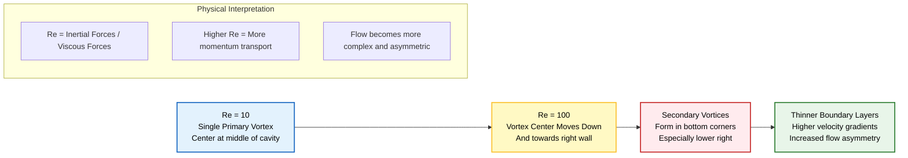
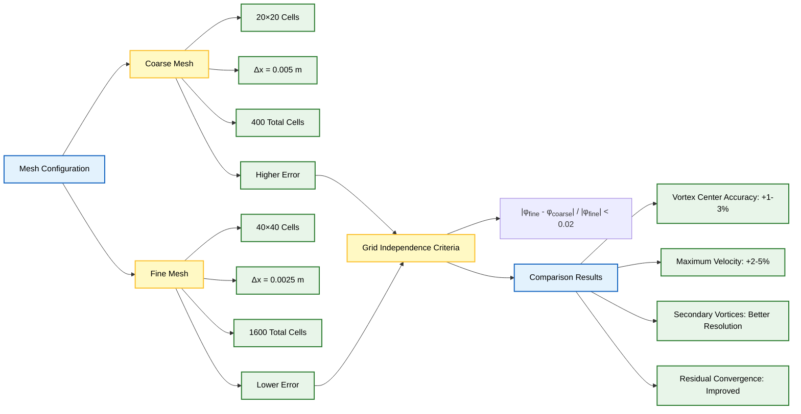

# แบบฝึกหัดเสริมทักษะ

> [!TIP] **วัตถุประสงค์ของแบบฝึกหัด**
> แบบฝึกหัดเหล่านี้ออกแบบมาเพื่อ **เสริมทักษะและความเข้าใจ** ในการใช้งาน OpenFOAM ผ่านการทดลองปรับเปลี่ยนพารามิเตอร์ต่างๆ ซึ่งจะช่วยให้คุณเข้าใจผลกระทบของแต่ละพารามิเตอร์ที่มีต่อผลลัพธ์การจำลอง

---

## 🎯 แบบฝึกหัดที่ 1: การปรับเปลี่ยน Reynolds Number

**เป้าหมาย:** เปลี่ยน `nu` ใน `constant/transportProperties` เป็น `0.001` ($Re=100$) และสังเกตพฤติกรรมการเคลื่อนที่ของจุดศูนย์กลางกระแสวน

### การวิเคราะห์การตั้งค่าปัจจุบัน

ก่อนทำการเปลี่ยนแปลง มาวิเคราะห์ค่าที่ตั้งไว้ในปัจจุบันกันก่อน

| พารามิเตอร์ | ค่าปัจจุบัน | หน่วย |
|------------|-------------|--------|
| **ความหนืดจลนศาสตร์ ($\nu$)** | 0.01 | m²/s |
| **ความเร็วของฝา ($U_{\text{lid}}$)** | 1 | m/s |
| **ความยาวลักษณะเฉพาะ ($L$)** | 0.1 | m |
| **Reynolds Number ($Re$)** | 10 | - |

### การคำนวณ Reynolds Number

Reynolds Number คำนวณได้จากสมการ:

$$Re = \frac{U_{\text{lid}} L}{\nu} = \frac{1 \times 0.1}{0.01} = \boxed{10}$$

### การดำเนินการ

ในไฟล์ `constant/transportProperties` เปลี่ยนค่าความหนืดเป็น:

```cpp
transportModel  Newtonian;

nu              [0 2 -1 0 0 0 0] 0.001;
```

**Reynolds Number ใหม่:**

$$Re_{\text{new}} = \frac{U_{\text{lid}} L}{\nu_{\text{new}}} = \frac{1 \times 0.1}{0.001} = \boxed{100}$$

### พฤติกรรมทางกายภาพที่คาดการณ์

#### ที่ $Re = 10$ (ปัจจุบัน)

- กระแสวนหลักเดียวที่ชัดเจน
- จุดศูนย์กลางอยู่ใกล้กึ่งกลาง Cavity
- การไหลยังคงสมมาตรค่อนข้างดี

#### ที่ $Re = 100$ (หลังการเปลี่ยนแปลง)

1. **การเคลื่อนที่ของจุดศูนย์กลางกระแสวน** — เลื่อน **ลงและไปทางผนังด้านขวา**
2. **กระแสวนรอง** — ปรากฏขึ้นใน **มุมด้านล่าง** (โดยเฉพาะมุมล่างขวา)
3. **ชั้นขอบเขต (Boundary Layer)** — บางลง ทำให้ Gradient ของความเร็วชันขึ้น
4. **ความไม่สมมาตร** — การไหลจะไม่สมมาตรมากขึ้น

### คำอธิบายทางกายภาพ

Reynolds Number แสดงถึงอัตราส่วนของแรงเฉื่อยต่อแรงหนืด:

$$Re = \frac{\text{Inertial Forces}}{\text{Viscous Forces}} = \frac{\rho \mathbf{u} \cdot \nabla \mathbf{u}}{\mu \nabla^2 \mathbf{u}}$$

**การนิยามตัวแปร:**

| สัญลักษณ์ | ความหมาย | หน่วย |
|---------|----------|--------|
| $\rho$ | ความหนาแน่นของของไหล | kg/m³ |
| $\mathbf{u}$ | เวกเตอร์ความเร็วของของไหล | m/s |
| $\mu$ | ความหนืดของของไหล | Pa·s |
| $\nabla$ | ตัวดำเนินการเกรเดียนต์ | - |
| $\nabla^2$ | ตัวดำเนินการ Laplacian | - |

ค่า $Re$ ที่สูงขึ้นหมายถึงแรงเฉื่อยมีอิทธิพลเหนือกว่า ทำให้โมเมนตัมของไหลพากระแสวนไปได้ไกลขึ้น


> **Figure 1:** การเปลี่ยนผ่านจากระบอบการไหลที่ $Re = 10$ ไปสู่ $Re = 100$ แสดงให้เห็นการเคลื่อนที่ของจุดศูนย์กลางกระแสวนหลักและการก่อตัวของกระแสวนรองในมุมของ Cavity เมื่อแรงเฉื่อยเริ่มมีอิทธิพลเหนือกว่าแรงหนืด

> หลังจากเปลี่ยนค่า `nu` แล้ว ให้รันคำสั่ง `blockMesh` และ `icoFoam` ใหม่ เพื่อดูผลลัพธ์ที่เปลี่ยนแปลงไป

---

## 🎯 แบบฝึกหัดที่ 2: การปรับปรุงความละเอียดของ Mesh

**เป้าหมาย:** เปลี่ยน `system/blockMeshDict` เป็น `(40 40 1)` และตรวจสอบ Grid Independence

### การตั้งค่า Mesh ปัจจุบัน

ในไฟล์ `system/blockMeshDict`:

```cpp
hex (0 1 2 3 4 5 6 7) (20 20 1) simpleGrading (1 1 1)
```

### การดำเนินการ

เปลี่ยนจำนวนเซลล์เป็น 40×40:

```cpp
hex (0 1 2 3 4 5 6 7) (40 40 1) simpleGrading (1 1 1)
```

### การเปรียบเทียบ Mesh

| คุณสมบัติ | Mesh หยาบ (20×20) | Mesh ละเอียด (40×40) |
|------------|-------------------|---------------------|
| **จำนวนเซลล์** | 400 เซลล์ | 1,600 เซลล์ (เพิ่ม 4×) |
| **ขนาดเซลล์ ($\Delta x$)** | 0.005 m | 0.0025 m |
| **ข้อผิดพลาด ($O(\Delta x^2)$)** | $\approx 2.5 \times 10^{-5}$ | $\approx 6.25 \times 10^{-6}$ |

### การเปลี่ยนแปลงที่คาดการณ์

1. **ตำแหน่งจุดศูนย์กลางกระแสวน** — แม่นยำขึ้น **1-3%**
2. **ขนาดความเร็ว** — ความเร็วสูงสุดอาจเพิ่มขึ้น **2-5%**
3. **กระแสวนรอง** — แสดงโครงสร้างขนาดเล็กในมุมต่างๆ ได้ดีขึ้น
4. **การลู่เข้า** — Residuals ลู่เข้าดีขึ้น

### เกณฑ์ Grid Independence

คำตอบถือว่าเป็น **Grid-independent** เมื่อ:

$$\frac{|\phi_{\text{fine}} - \phi_{\text{coarse}}|}{|\phi_{\text{fine}}|} < 0.02$$

**การนิยามตัวแปร:**

| สัญลักษณ์ | ความหมาย |
|---------|----------|
| $\phi_{\text{fine}}$ | ค่าจาก Mesh ละเอียด |
| $\phi_{\text{coarse}}$ | ค่าจาก Mesh หยาบ |
| $\phi$ | ปริมาณที่สนใจ (ตำแหน่งจุดศูนย์กลางกระแสวน, ความเร็วสูงสุด) |


> **Figure 2:** การเปรียบเทียบระหว่าง Mesh แบบหยาบ (20×20) และ Mesh แบบละเอียด (40×40) เพื่อใช้ในการตรวจสอบ Grid Independence โดยวิเคราะห์ความแม่นยำของตำแหน่งกระแสวนและความเร็วสูงสุดที่เพิ่มขึ้นเมื่อลดขนาดของเซลล์ลง

> Mesh ที่ละเอียดขึ้นจะใช้เวลาในการคำนวณนานขึ้น ให้พิจารณา Balance ระหว่างความแม่นยำและเวลาในการคำนวณ

---

## 🎯 แบบฝึกหัดที่ 3: การใช้ Solver แบบ Steady-State

**เป้าหมาย:** รัน `simpleFoam` แทน `icoFoam` และปรับ `system/controlDict` และ `system/fvSolution`

### ความแตกต่างของ Solver

| คุณสมบัติ | icoFoam (Transient) | simpleFoam (Steady-state) |
|------------|---------------------|---------------------------|
| **อัลกอริทึม** | PISO | SIMPLE |
| **สมการโมเมนตัม** | $\frac{\partial \mathbf{u}}{\partial t} + (\mathbf{u} \cdot \nabla)\mathbf{u} = -\frac{1}{\rho}\nabla p + \nu \nabla^2 \mathbf{u}$ | $(\mathbf{u} \cdot \nabla)\mathbf{u} = -\frac{1}{\rho}\nabla p + \nu \nabla^2 \mathbf{u}$ |
| **การหาคำตอบ** | Time marching | Iterative solution |

### การปรับ `system/controlDict`

```cpp
// For simpleFoam (steady-state)
application     simpleFoam;
startFrom       startTime;
startTime       0;
stopAt          endTime;
endTime         1000;
deltaT          1;
adjustTimeStep  no;
```

### การปรับ `system/fvSolution`

```cpp
solvers
{
    p
    {
        solver          GAMG;
        tolerance       1e-06;
        relTol          0.1;
        smoother        GaussSeidel;
        nCellsInCoarsestLevel 10;
    }

    U
    {
        solver          smoothSolver;
        smoother        GaussSeidel;
        tolerance       1e-05;
        relTol          0;
    }
}

SIMPLE
{
    nCorrectors      2;
    nNonOrthogonalCorrectors 0;
    pRefCell        0;
    pRefValue       0;
    residualControl
    {
        p               1e-5;
        U               1e-5;
    }
}

relaxationFactors
{
    fields
    {
        p               0.3;
    }
    equations
    {
        U               0.7;
    }
}
```

### ความแตกต่างสำคัญสำหรับ Steady-State

1. **Under-Relaxation** — จำเป็นสำหรับการลู่เข้า ช่วยป้องกันการสั่นของผลเฉลย
2. **Residual Monitoring** — ตรวจสอบว่า Residuals ลดลงต่ำกว่า Tolerance
3. **ไม่มี Time Marching** — ใช้ Pseudo-time stepping เพื่อความเสถียร
4. **Pressure Solver** — GAMG เป็นที่นิยมสำหรับปัญหา Steady-state

---

## 📊 การตรวจสอบคุณภาพการจำลอง

### การตรวจสอบการลู่เข้า (Convergence Monitoring)

#### สำหรับ transient solver (icoFoam)

- ตรวจสอบ Residuals ต่อเวลา
- ตรวจสอบความสมบูรณ์ของมวล: $\nabla \cdot \mathbf{u} = 0$

#### สำหรับ steady-state solver (simpleFoam)

```bash
foamJob simpleFoam -case cavity
```

### การตรวจสอบแรง (Force Monitoring)

เพิ่ม `functions` ใน `system/controlDict`:

```cpp
functions
{
    forces
    {
        type            forces;
        functionObjectLibs ("libforces.so");
        outputControl   timeStep;
        outputInterval  1;
        log             true;
        patches         ("movingWall");
        rho             rhoInf;
        rhoInf          1;
    }
}
```

### กลยุทธ์การตรวจสอบความถูกต้อง (Validation Strategy)

#### การเปรียบเทียบกับข้อมูลอ้างอิง

- **Ghia et al. (1982)** — ข้อมูลมาตรฐานสำหรับ Lid-driven cavity
- **Benchmark Solutions** — ตำแหน่งจุดศูนย์กลางกระแสวนและความเร็วสูงสุด

#### การตรวจสอบความสมบูรณ์

| ประเภท | เงื่อนไข |
|--------|-----------|
| **Mass Conservation** | $\nabla \cdot \mathbf{u} = 0$ |
| **Momentum Balance** | การสมดุลของแรงที่ผนัง |
| **Grid Independence** | การลู่เข้าของคำตอบเมื่อละเอียด Mesh |

---

## 🎯 บทสรุปแบบฝึกหัด

### ผลลัพธ์การเรียนรู้

1. **ผลกระทบของ Reynolds Number** — เข้าใจว่าการเปลี่ยนค่า $Re$ ส่งผลต่อรูปร่างกระแสวนอย่างไร
2. **Grid Independence** — เรียนรู้วิธีการตรวจสอบว่า Mesh มีความละเอียดเพียงพอ
3. **อัลกอริทึม Solver** — เปรียบเทียบ PISO และ SIMPLE และเข้าใจว่าเมื่อไหร่ควรใช้อัลกอริทึมใด

### ทักษะที่ได้รับ

| ทักษะ | คำอธิบาย |
|-------|----------|
| **การกำหนดค่า OpenFOAM** | สามารถปรับพารามิเตอร์ต่างๆ ได้อย่างถูกต้อง |
| **การวิเคราะห์ผลลัพธ์ CFD** | เข้าใจผลลัพธ์ที่ได้จากการจำลอง |
| **การตรวจสอบความถูกต้อง** | สามารถตรวจสอบความถูกต้องของผลลัพธ์ได้ |
| **การปรับปรุงความละเอียด Mesh** | สามารถสร้าง Mesh ที่เหมาะสมกับปัญหาได้ |

---

**🎉 การจำลอง OpenFOAM ครั้งแรกของคุณเสร็จสมบูรณ์!**

คุณได้ตั้งค่า Mesh, Boundary Conditions และ Physics ได้สำเร็จ และได้แก้สมการ Navier-Stokes แล้ว การทำแบบฝึกหัดเหล่านี้จะช่วยให้คุณเข้าใจการทำงานของ OpenFOAM ได้อย่างลึกซึ้งยิ่งขึ้น
