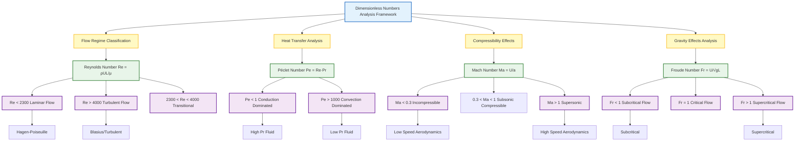
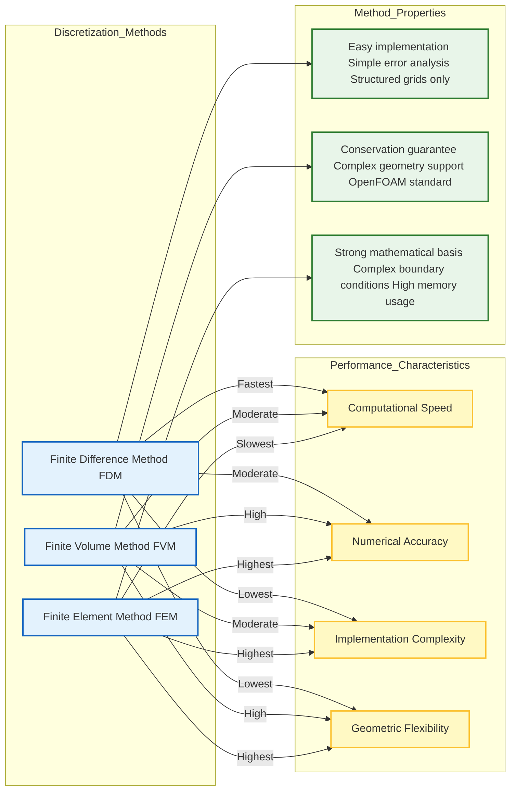
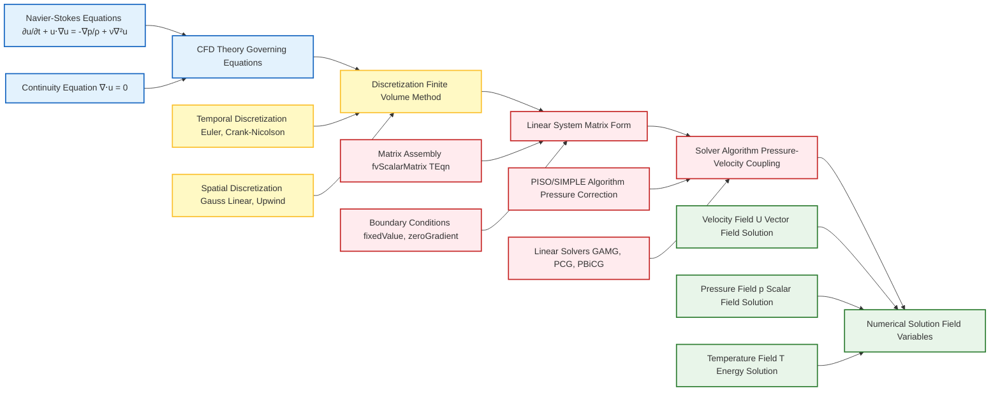

# MODULE 01: พื้นฐาน CFD

## ภาพรวมของโมดูล

- **ระยะเวลา**: 1 สัปดาห์
- **ข้อกำหนดเบื้องต้น**: MODULE_00: การเริ่มต้นใช้งาน
- **วัตถุประสงค์การเรียนรู้**: เชี่ยวชาญทฤษฎีพื้นฐานของพลศาสตร์ของไหลและระเบียบวิธีเชิงตัวเลขที่เป็นรากฐานของ CFD

## โครงสร้างของโมดูล

### 📚 บทเรียน

1. **พื้นฐานกลศาสตร์ของไหล**
2. **สมการควบคุมการไหลของไหล**
3. **ระเบียบวิธีเชิงตัวเลขใน CFD**
4. **ระเบียบวิธี Finite Volume**
5. **แผนการ Discretization**
6. **Boundary Conditions และ Initial Conditions**
7. **การสร้าง Grid และคุณภาพของ Mesh**
8. **Stability, Convergence และการวิเคราะห์ Error**

### 🛠️ แบบฝึกหัดปฏิบัติ

- การตรวจสอบผลลัพธ์ CFD ด้วยวิธีเชิงวิเคราะห์
- การศึกษา Mesh convergence
- การวิเคราะห์ Stability ของแผนการเชิงตัวเลข
- การเปรียบเทียบระเบียบวิธี Discretization ที่แตกต่างกัน

### 🎯 บทช่วยสอน

- **บทช่วยสอน 1**: การตรวจสอบความถูกต้องเชิงวิเคราะห์ของการไหลแบบง่าย
- **บทช่วยสอน 2**: การศึกษา Grid independence
- **บทช่วยสอน 3**: การวิเคราะห์ความแม่นยำเชิงเวลาและเชิงพื้นที่
- **บทช่วยสอน 4**: ขีดจำกัด Stability และเงื่อนไข CFL

## 🎯 ผลลัพธ์การเรียนรู้

เมื่อสำเร็จโมดูลนี้ คุณจะสามารถ:

- สามารถหาและอธิบายสมการ Navier-Stokes ได้
- เข้าใจพื้นฐานทางคณิตศาสตร์ของ CFD
- วิเคราะห์ Stability และ Convergence ของแผนการเชิงตัวเลข
- ทำการศึกษา Mesh independence
- ตรวจสอบผลลัพธ์ CFD เทียบกับผลเฉลยเชิงวิเคราะห์
- เลือกระเบียบวิธีเชิงตัวเลขที่เหมาะสมสำหรับปัญหาเฉพาะ

---

## 📐 ข้อกำหนดเบื้องต้นทางคณิตศาสตร์

### แคลคูลัสเวกเตอร์

**Gradient**:
$$\nabla \phi = \left(\frac{\partial \phi}{\partial x}, \frac{\partial \phi}{\partial y}, \frac{\partial \phi}{\partial z}\right)$$

- $\phi$: ฟังก์ชันสเกลาร์ใดๆ
- $\nabla$: Operator gradient

**Divergence**:
$$\nabla \cdot \mathbf{u} = \frac{\partial u}{\partial x} + \frac{\partial v}{\partial y} + \frac{\partial w}{\partial z}$$

- $\mathbf{u}$: เวกเตอร์ความเร็ว $(u, v, w)$
- $\nabla \cdot$: Operator divergence

**Curl**:
$$\nabla \times \mathbf{u}$$

- วัดการหมุนของเวกเตอร์ความเร็ว

**Laplacian**:
$$\nabla^2 \phi = \frac{\partial^2 \phi}{\partial x^2} + \frac{\partial^2 \phi}{\partial y^2} + \frac{\partial^2 \phi}{\partial z^2}$$

- วัดการแพร่กระจายของฟังก์ชันสเกลาร์

### การวิเคราะห์ Tensor

- **สัญกรณ์ Tensor และผลรวม Einstein**
- **Stress และ Strain Tensors**
- **ความสัมพันธ์เชิง Constitutive**

### สมการเชิงอนุพันธ์

- **สมการเชิงอนุพันธ์ย่อย (PDEs)**
- **การจำแนกประเภทของ PDEs (elliptic, parabolic, hyperbolic)**
- **ปัญหาค่าเริ่มต้นและค่าขอบเขต**

---

## ⚗️ หลักการพื้นฐานทางฟิสิกส์

### คุณสมบัติของไหล

| คุณสมบัติ | สัญลักษณ์ | หน่วย | ความหมาย |
|---------|--------|--------|---------|
| **ความหนาแน่น** | $\rho$ | kg/m³ | มวลต่อปริมาตร |
| **ความหนืด (Dynamic)** | $\mu$ | Pa·s | ความต้านทานต่อการไหล |
| **ความหนืด (Kinematic)** | $\nu = \mu/\rho$ | m²/s | ความหนืดต่อความหนาแน่น |
| **ความดัน** | $p$ | Pa | แรงต่อหน่วยพื้นที่ |
| **อุณหภูมิ** | $T$ | K | พลังงานความร้อน |

### เลขไร้มิติที่สำคัญ

| ชื่อเลข | สูตร | ความหมายทางฟิสิกส์ |
|---------|-------|-------------------|
| **Reynolds Number** | $\text{Re} = \frac{\rho U L}{\mu} = \frac{U L}{\nu}$ | อัตราส่วนของแรงเฉื่อยต่อแรงเฉื่อยยึด |
| **Péclet Number** | $\text{Pe} = \text{Re} \cdot \text{Pr}$ | อัตราส่วนการพาความร้อนต่อการนำความร้อน |
| **Mach Number** | $\text{Ma} = \frac{U}{a}$ | อัตราส่วนความเร็วต่อความเร็วเสียง |
| **Froude Number** | $\text{Fr} = \frac{U}{\sqrt{g L}}$ | อัตราส่วนแรงเฉื่อยต่อแรงโน้มถ่วง |



> **Figure 1:** กรอบแนวคิดสำหรับการวิเคราะห์เลขไร้มิติ โดยจำแนกระบอบการไหลตามผลกระทบทางกายภาพที่เด่นชัด (ความหนืด การถ่ายเทความร้อน ความสามารถในการอัดตัว และแรงโน้มถ่วง) พร้อมทั้งพารามิเตอร์ไร้มิติที่เกี่ยวข้อง (Re, Pe, Ma, Fr)
> **Figure 1:** Framework for dimensionless number analysis, categorizing flow regimes based on dominant physical effects (viscosity, heat transfer, compressibility, gravity) and their respective non-dimensional parameters (Re, Pe, Ma, Fr).


---

## 🔢 ภาพรวมระเบียบวิธีเชิงตัวเลข

### การเปรียบเทียบระเบียบวิธี Discretization

| ระเบียบวิธี | ข้อดี | ข้อเสีย | การนำไปใช้งาน |
|------------|--------|--------|----------------|
| **Finite Difference (FDM)** | การนำไปใช้งานง่าย, วิเคราะห์ Error ได้ง่าย | ใช้ได้กับ Structured grids เท่านั้น | ปัญหาเรขาคณิตศาสตร์ที่ง่าย |
| **Finite Volume (FVM)** | รับประกันการอนุรักษ์, รองรับรูปทรงเรขาคณิตที่ซับซ้อน | การนำไปใช้งานซับซ้อนกว่า | **OpenFOAM** และ CFD ทั่วไป |
| **Finite Element (FEM)** | พื้นฐานทางคณิตศาสตร์แน่นหนา, Boundary Conditions ซับซ้อนได้ | ซับซ้อน, ใช้หน่วยความจำสูง | การวิเคราะห์โครงสร้าง |

### เทคนิคการหาผลเฉลย

#### ระเบียบวิธี Direct
- **Gaussian elimination**
- **LU decomposition**

#### ระเบียบวิธี Iterative
- **Jacobi**
- **Gauss-Seidel**
- **SOR (Successive Over-Relaxation)**
- **Multigrid**

#### การอินทิเกรตเชิงเวลา
- **Explicit**: $u^{n+1} = u^n + \Delta t \cdot f(u^n)$
- **Implicit**: $u^{n+1} = u^n + \Delta t \cdot f(u^{n+1})$
- **Crank-Nicolson**: ผสมผสาน explicit และ implicit



> **Figure 2:** การวิเคราะห์เปรียบเทียบระเบียบวิธี Discretization เชิงตัวเลขหลัก (FDM, FVM, FEM) โดยประเมินข้อดีข้อเสียในด้านความเร็วในการคำนวณ ความแม่นยำ ความซับซ้อนในการนำไปใช้งาน และความยืดหยุ่นต่อรูปทรงเรขาคณิต
> **Figure 2:** Comparative analysis of major numerical discretization methods (FDM, FVM, FEM), evaluating their trade-offs in terms of computational speed, accuracy, implementation complexity, and geometric flexibility.


---

## 🔬 สมการควบคุม (Governing Equations)

### 1. การอนุรักษ์มวล (Continuity Equation)

**สมการความต่อเนื่อง** แสดงหลักการอนุรักษ์มวลในระบบของไหล:

**รูปแบบทั่วไป:**
$$\frac{\partial \rho}{\partial t} + \nabla \cdot (\rho \mathbf{u}) = 0$$

โดยที่:
* $\rho$ = ความหนาแน่นของของไหล (fluid density)
* $\mathbf{u}$ = เวกเตอร์ความเร็ว (velocity vector)

**สำหรับการไหลแบบอัดตัวไม่ได้** ($\rho = \text{constant}$):
$$\nabla \cdot \mathbf{u} = 0$$

เงื่อนไข **divergence-free condition** นี้ทำให้มั่นใจได้ว่าอัตราการไหลเชิงปริมาตรที่ไหลเข้าสู่ปริมาตรควบคุมขนาดเล็กมาก ๆ จะเท่ากับอัตราการไหลเชิงปริมาตรที่ไหลออก

### 2. การอนุรักษ์โมเมนตัม (Navier-Stokes Equation)

**สมการโมเมนตัม** ซึ่งได้มาจากกฎข้อที่สองของนิวตัน:

**รูปแบบทั่วไป:**
$$\rho \frac{\partial \mathbf{u}}{\partial t} + \rho (\mathbf{u} \cdot \nabla) \mathbf{u} = -\nabla p + \mu \nabla^2 \mathbf{u} + \mathbf{f}$$

โดยที่:
* $p$ = ความดันสถิต (static pressure)
* $\mu$ = ความหนืดจลน์ (dynamic viscosity)
* $\mathbf{f}$ = แรงที่กระทำต่อปริมาตร (body forces) เช่น แรงโน้มถ่วง ($\rho \mathbf{g}$)

**การวิเคราะห์แต่ละพจน์:**

**ด้านซ้ายมือ (Local + Convective Acceleration):**
* $\rho \frac{\partial \mathbf{u}}{\partial t}$ = ความเร่งเฉพาะที่ (local acceleration)
* $\rho (\mathbf{u} \cdot \nabla) \mathbf{u}$ = ความเร่งแบบพา (convective acceleration)

**ด้านขวามือ (Surface + Body Forces):**
* $-\nabla p$ = แรงดัน (pressure forces)
* $\mu \nabla^2 \mathbf{u}$ = แรงหนืด (viscous forces)
* $\mathbf{f}$ = แรงภายนอก (external body forces)

### 3. การอนุรักษ์พลังงาน (Energy Equation)

สำหรับของไหลที่มีอุณหภูมิ $T$ สมการพลังงานในรูปของอุณหภูมิคือ:

$$\rho c_p \frac{\partial T}{\partial t} + \rho c_p \mathbf{u} \cdot \nabla T = k \nabla^2 T + Q$$

โดยที่:
* $c_p$ = ความจุความร้อนจำเพาะที่ความดันคงที่ (specific heat capacity)
* $k$ = สภาพนำความร้อน (thermal conductivity)
* $Q$ = แหล่งกำเนิดความร้อน (heat sources) หรือตัวรับความร้อน (sinks)

### 4. การถ่ายเทชนิดสาร (Species Transport)

สำหรับการไหลแบบหลายองค์ประกอบ:

$$\frac{\partial (\rho Y_i)}{\partial t} + \nabla \cdot (\rho \mathbf{u} Y_i) = -\nabla \cdot \mathbf{J}_i + \dot{\omega}_i$$

โดยที่:
* $Y_i$ = สัดส่วนมวล (mass fraction) ของชนิดสาร $i$
* $\mathbf{J}_i$ = เวกเตอร์ฟลักซ์การแพร่ (diffusive flux vector)
* $\dot{\omega}_i$ = อัตราการผลิต/การทำลายสุทธิอันเนื่องมาจากปฏิกิริยาเคมี

### 5. สมการสภาวะ (Equation of State)

**ก๊าซในอุดมคติ (Ideal Gas):**

$$p = \rho R T$$

โดยที่ $R$ = ค่าคงที่ของก๊าซจำเพาะ (specific gas constant)

---

## 🔢 ระเบียบวิธี Finite Volume

### แนวคิดพื้นฐานของ Finite Volume Method

**Finite Volume Method** แบ่ง Computational Domain ออกเป็นชุดของ **Control Volume (Cells)** ที่ไม่ทับซ้อนกัน:

- **Governing Equations** จะถูกอินทิเกรตเหนือ Control Volume แต่ละอัน
- รับประกันการอนุรักษ์มวล โมเมนตัม และพลังงานในระดับท้องถิ่น (local conservation)
- เป็นรากฐานทางคณิตศาสต์ของ **Computational Framework ของ OpenFOAM**

### โครงสร้าง Mesh

#### แนวทางแบบ Cell-Centered

OpenFOAM ใช้แผนการทำให้เป็นส่วนย่อยแบบ **Finite Volume** ที่เน้น **cell-centered** โดยที่ตัวแปรหลักทั้งหมดจะถูกเก็บไว้ที่จุดศูนย์กลางทางเรขาคณิตของเซลล์คำนวณ

แนวทางนี้มีข้อดีหลายประการสำหรับการคำนวณ CFD:
- **คุณสมบัติการอนุรักษ์** (conservation properties)
- **การนำ Boundary Condition ที่ซับซ้อนไปใช้ได้อย่างตรงไปตรงมา**

**ข้อมูลทางเรขาคณิตที่จำเป็น**:
- ปริมาตรเซลล์ ($V_P$)
- พื้นที่ Face ($|\mathbf{S}_f|$)
- เวกเตอร์แนวฉากของ Face ($\mathbf{n}_f$)

### การคำนวณ Face Flux

#### นิพจน์ Flux ทั่วไป

ในกรอบ Finite Volume Terms การขนส่งทั้งหมดจะแสดงเป็น Fluxes ที่ผ่าน Cell Faces:

$$\sum_f \mathbf{F}_f \cdot \mathbf{S}_f = 0$$

#### 1. Convective Fluxes ($\nabla \cdot (\phi \mathbf{u})$)

**Term Convective สำหรับ Scalar Field $\phi$**:
$$\int_V \nabla \cdot (\phi \mathbf{u}) \, \mathrm{d}V = \sum_f \phi_f (\mathbf{u}_f \cdot \mathbf{S}_f) = \sum_f \phi_f \Phi_f$$

**Interpolation Schemes สำหรับ $\phi_f$**:

| Scheme | รูปแบบสมการ | ความแม่นยำ | ข้อดี | ข้อเสีย |
|--------|--------------|-------------|--------|--------|
| **CDS** (Central Differencing) | $\phi_f = 0.5(\phi_P + \phi_N)$ | Order 2 | High accuracy | Unbounded oscillations |
| **UDS** (Upwind) | $\phi_f = \phi_P$ if $\Phi_f > 0$ | Order 1 | Numerically stable | Significant numerical diffusion |
| **QUICK** | $\phi_f = \frac{6}{8}\phi_P + \frac{3}{8}\phi_N - \frac{1}{8}\phi_{NN}$ | Order 3 | Excellent accuracy | Can be unstable |
| **MUSCL/TVD** | $\phi_f = \phi_U + \phi(r) \cdot \frac{1}{2}(\phi_D - \phi_U)$ | Order 2 | High accuracy with boundedness | Complex implementation |

#### 2. Diffusive Fluxes ($\nabla \cdot (\Gamma \nabla \phi)$)

**Term Diffusive สำหรับ Scalar Field $\phi$**:
$$\int_V \nabla \cdot (\Gamma \nabla \phi) \, \mathrm{d}V = \sum_f \Gamma_f (\nabla \phi)_f \cdot \mathbf{S}_f$$

สำหรับ Orthogonal Meshes:
$$(\nabla \phi)_f \cdot \mathbf{S}_f = |\mathbf{S}_f| \frac{\phi_N - \phi_P}{|\mathbf{d}_{PN}|}$$

### การทำให้เป็นส่วนย่อยเชิงเวลา (Temporal Discretization)

#### Time Integration Schemes

| Scheme | รูปแบบสมการ | ความแม่นยำ | ความเสถียร | กรณีที่เหมาะสม |
|--------|--------------|-------------|------------|----------------|
| **Euler Explicit** | $\phi^{n+1} = \phi^n + \Delta t \cdot \mathcal{L}(\phi^n)$ | Order 1 | Conditionally stable | Explicit dynamics |
| **Euler Implicit** | $\phi^{n+1} = \phi^n + \Delta t \cdot \mathcal{L}(\phi^{n+1})$ | Order 1 | Unconditionally stable | Steady-state, large time steps |
| **Crank-Nicolson** | $\phi^{n+1} = \phi^n + \frac{\Delta t}{2} [\mathcal{L}(\phi^n) + \mathcal{L}(\phi^{n+1})]$ | Order 2 | Good stability | Accurate transient flows |
| **BDF (Order 2)** | $\phi^{n+1} = \frac{4}{3}\phi^n - \frac{1}{3}\phi^{n-1} + \frac{2}{3}\Delta t \cdot \mathcal{L}(\phi^{n+1})$ | Order 2 | Good stability | High accuracy transient |

### การประกอบ Matrix และการแก้ปัญหา

#### โครงสร้าง Coefficient Matrix

การทำให้เป็นส่วนย่อยเชิงพื้นที่และเชิงเวลาส่งผลให้เกิด Sparse Linear System:

$$\mathbf{A} \cdot \boldsymbol{\phi} = \mathbf{b}$$

**คุณสมบัติที่สำคัญ**:
- **Diagonal Dominance**: $|A_{PP}| \geq \sum_{N} |A_{PN}|$ เพื่อความเสถียร
- **Sparsity Pattern**: แต่ละแถวมี Non-Zero Entries เฉพาะสำหรับเซลล์นั้นเองและเซลล์ข้างเคียงโดยตรง

#### วิธีการแก้ปัญหา

| Solver Type | ชื่อวิธี | ระบบที่เหมาะสม | ประสิทธิภาพ |
|-------------|------------|-----------------|------------|
| **Direct** | LU Decomposition | Small-medium | Poor for large systems |
| **Iterative** | CG | Symmetric Positive Definite | Excellent for SPD |
| **Iterative** | BiCGStab | General Non-Symmetric | Good for general CFD |
| **Iterative** | GMRES | Highly Non-Symmetric | Good for difficult systems |
| **Multigrid** | GAMG | Large problems | Best scaling |

#### การเชื่อมโยง Pressure-Velocity (Pressure-Velocity Coupling)

| Algorithm | ลักษณะการทำงาน | ข้อดี | ข้อเสีย |
|-----------|-----------------|--------|----------|
| **SIMPLE** | Sequential solution with under-relaxation | Robust, steady-state | Slow convergence |
| **PISO** | Multiple pressure corrections per time step | Accurate for transient | Can be unstable |
| **PIMPLE** | Hybrid SIMPLE + PISO | Good for both steady/transient | More complex |

---

## 🚪 Boundary Conditions

### ประเภทของ Boundary Conditions

#### Dirichlet Boundary Conditions (Fixed Value)

กำหนดค่าของตัวแปร Field โดยตรงที่พื้นผิวขอบเขต:

$$\phi|_{\partial\Omega} = \phi_{\text{specified}}$$

**OpenFOAM Code Implementation**:
```cpp
boundaryField
{
    inlet
    {
        type            fixedValue;
        value           uniform (10 0 0);  // Fixed velocity vector in m/s
    }

    wallTemperature
    {
        type            fixedValue;
        value           uniform 300;       // Fixed temperature in Kelvin
    }
}
```

#### Neumann Boundary Conditions (Fixed Gradient)

กำหนด Normal Gradient ของตัวแปร Field ที่ขอบเขต:

$$\frac{\partial \phi}{\partial n}\bigg|_{\partial\Omega} = g_{\text{specified}}$$

**OpenFOAM Code Implementation**:
```cpp
boundaryField
{
    outlet
    {
        type            fixedGradient;
        gradient        uniform (0 0 0);   // Zero gradient (fully developed flow)
    }

    heatFluxWall
    {
        type            fixedGradient;
        gradient        uniform 1000;      // Heat flux in W/m²
    }
}
```

#### Mixed Boundary Conditions (Robin Conditions)

รวมการกำหนดทั้งค่าและ Gradient ผ่านพารามิเตอร์การถ่วงน้ำหนัก:

$$\alpha \phi + \beta \frac{\partial \phi}{\partial n} = \gamma$$

**OpenFOAM Code Implementation**:
```cpp
boundaryField
{
    convectiveWall
    {
        type            mixed;
        refGradient     uniform 0;
        refValue        uniform 300;
        valueFraction   uniform 0.5;     // Weighting factor (0 = gradient, 1 = value)
    }
}
```

### Wall Functions สำหรับ Turbulence

**กฎ Logarithmic Law of the Wall**:
$$u^+ = \frac{1}{\kappa} \ln(y^+) + B$$

* $u^+ = \frac{u}{u_\tau}$ (non-dimensional velocity)
* $y^+ = \frac{y u_\tau}{\nu}$ (non-dimensional distance)
* $\kappa \approx 0.41$ (von Kármán constant)
* $B \approx 5.2$ (log-law constant)

**OpenFOAM Code Implementation**:
```cpp
boundaryField
{
    wall
    {
        type            nutkWallFunction;
        value           uniform 0;
        Cmu             0.09;
        kappa           0.41;
        E               9.8;
    }
}
```

---

## 🔗 ความเชื่อมโยงกับ OpenFOAM

### การนำ FVM ไปใช้งาน

OpenFOAM นำระเบียบวิธี Finite Volume ไปใช้งานดังนี้:

```cpp
// OpenFOAM Code Implementation
// การ discretize สมการควบคุม
fvScalarMatrix TEqn
(
    fvm::ddt(T) + fvm::div(phi, T)
  - fvm::laplacian(DT, T)
 ==
    fvOptions(T)
);

TEqn.relax();
TEqn.solve();
```

### อัลกอริทึมของ Solver

ทำความเข้าใจว่า `icoFoam`, `simpleFoam` ทำอะไรจริง ๆ:

**icoFoam (Transient incompressible flow)**:
```cpp
while (runTime.loop())
{
    #include "CourantNo.H"
    #include "UEqn.H"

    // Pressure-velocity correction
    #include "pEqn.H"

    runTime.write();
}
```

### แผนการ Discretization

การเลือก `fvSchemes` ส่งผลต่อความแม่นยำอย่างไร:

```cpp
// ตัวอย่าง fvSchemes
ddtSchemes
{
    default         Euler;
}

gradSchemes
{
    default         Gauss linear;
}

divSchemes
{
    default         none;
    div(phi,U)      Gauss linear;
}
```

### Boundary Conditions ใน OpenFOAM

ความหมายทางฟิสิกส์และการนำไปใช้งานเชิงตัวเลข:

```cpp
// ตัวอย่าง boundary condition
inlet
{
    type            fixedValue;
    value           uniform (10 0 0);  // m/s
}

outlet
{
    type            zeroGradient;
}
```



> **Figure 3:** กระบวนการหาผลเฉลย CFD ที่สมบูรณ์ภายในโครงสร้างของ OpenFOAM โดยไล่เรียงเส้นทางตั้งแต่สมการควบคุมทางทฤษฎี ผ่านการ Discretization แบบ Finite Volume และการประกอบ Matrix ไปจนถึงการหาผลเฉลยเชิงตัวเลขของตัวแปรสนามสุดท้าย
> **Figure 3:** The complete CFD solution process within the OpenFOAM framework, tracing the path from governing theoretical equations through finite volume discretization and matrix assembly to the final numerical solution of field variables.


### การประยุกต์ใช้งานจริง

#### การตั้งค่า Case
ทฤษฎีเบื้องหลังการเลือก Boundary Condition:
- การไหลแบบ incompressible ใช้ pressure-driven flow
- การไหลแบบ compressible ใช้ mass flux

#### การเลือก Solver
การจับคู่ฟิสิกส์กับ OpenFOAM Solver ที่เหมาะสม:
- `simpleFoam` → Steady-state incompressible turbulent flow
- `pimpleFoam` → Transient incompressible flow with large time steps
- `buoyantBoussinesqSimpleFoam` → Steady buoyancy-driven flow

#### ข้อกำหนดของ Mesh
การทำความเข้าใจพารามิเตอร์คุณภาพของ Mesh:
- **Aspect ratio**: ควร < 100
- **Non-orthogonality**: ควร < 70°
- **Skewness**: ควร < 4

#### การตรวจสอบ Convergence
การตีความผลลัพธ์ของ Solver:
- **Residual plots**: ดูการลดต่ำลงของ residual
- **Convergence criteria**: ตั้งค่า `tolerance` และ `relTol`

---

## 🎓 ปรัชญาของโมดูล

โมดูลนี้เชื่อมโยงช่องว่างระหว่างพลศาสตร์ของไหลเชิงทฤษฎีและการนำ CFD ไปใช้งานจริง

### สามด้านที่พัฒนา

#### 1️⃣ ความเข้าใจเชิงทฤษฎี
- พื้นฐานทางคณิตศาสตร์ของการไหลของไหล
- การหาอนุพันธ์ของสมการควบคุม
- การวิเคราะห์ปรากฏการณ์ทางฟิสิกส์

#### 2️⃣ ความสามารถเชิงตัวเลข
- ทฤษฎีและการปฏิบัติของ Discretization
- การวิเคราะห์ Error และเกณฑ์ Stability
- การประเมิน Convergence

#### 3️⃣ ทักษะการปฏิบัติ
- ขั้นตอนการ Verification และ Validation
- การประเมินคุณภาพของ Mesh
- การเลือกแผนการเชิงตัวเลขที่เหมาะสม

---

## 📊 กลยุทธ์การประเมินผล

### การประเมินเชิงทฤษฎี (40%)
- การหาอนุพันธ์ทางคณิตศาสตร์
- ความเข้าใจในหลักการทางฟิสิกส์
- การวิเคราะห์ระเบียบวิธีเชิงตัวเลข

### การประเมินเชิงปฏิบัติ (60%)
- การนำระเบียบวิธีเชิงตัวเลขไปใช้งาน
- การตรวจสอบผลลัพธ์ CFD
- การวิเคราะห์ความแม่นยำของการจำลอง
- การเปรียบเทียบกับผลเฉลยเชิงวิเคราะห์

---

## 📚 แหล่งข้อมูลสำคัญ

### ตำราเรียนหลัก

- **"Computational Fluid Dynamics: The Basics with Applications"** - Anderson
- **"Numerical Heat Transfer and Fluid Flow"** - Patankar
- **"Finite Volume Method for Computational Fluid Dynamics"** - Versteeg & Malalasekera

### เอกสารประกอบ OpenFOAM

- **Programmer's Guide**: สำหรับรายละเอียดการนำไปใช้งาน
- **User Guide**: สำหรับแง่มุมการปฏิบัติ
- **Source code**: สำหรับอัลกอริทึมเชิงตัวเลข

### เครื่องมือซอฟต์แวร์

- **OpenFOAM Solvers และ Utilities**
- **ParaView**: สำหรับการแสดงผล
- **Python/MATLAB**: สำหรับการวิเคราะห์ข้อมูล

---

**โมดูลถัดไป**: [[Module 02: OpenFOAM Basics|../MODULE_02_OPENFOAM_BASICS/README.md]]
