# บทเรียนที่ 1: พื้นฐานกลศาสตร์ของไหล

## 🎯 วัตถุประสงค์การเรียนรู้

เมื่อจบบทเรียนนี้ คุณจะเข้าใจ:

- **แนวคิดพื้นฐาน**ของกลศาสตร์ของไหล
- **คุณสมบัติของไหล**และการวิเคราะห์มิติ
- **การจำแนกประเภท**ของการไหลและระบอบการไหล
- **สมมติฐานคอนตินิวอัม (continuum hypothesis)** และข้อจำกัด

---

## 🌊 บทนำสู่ของไหล

### คำนิยามของของไหล

**ของไหล (fluid)** คือสสารที่เปลี่ยนรูปอย่างต่อเนื่องภายใต้แรงเฉือน (shear stress) ไม่ว่าจะเล็กน้อยเพียงใดก็ตาม ของไหลแตกต่างจากของแข็งตรงที่ของไหลไม่สามารถต้านทานแรงเฉือนได้เมื่ออยู่ในสภาวะหยุดนิ่ง

#### ลักษณะสำคัญ

- **เปลี่ยนรูปได้อย่างต่อเนื่อง (Continuously deformable)**: ไหลภายใต้แรงเฉือนใดๆ
- **ปรับเปลี่ยนรูปร่างตามภาชนะ (Takes shape of container)**: ปรับให้เข้ากับรูปทรงเรขาคณิตของขอบเขต
- **โมเลกุลเคลื่อนที่ได้ (Molecular mobility)**: โมเลกุลสามารถเคลื่อนที่สัมพันธ์กันได้

### สถานะของไหล

#### ของเหลว (Liquids)

- **ความหนาแน่น (Density)**: เกือบคงที่เมื่อความดันเปลี่ยนแปลง
- **การอัดตัว (Compressibility)**: ต่ำมาก (เกือบจะอัดไม่ได้)
- **ปริมาตร (Volume)**: โดยทั่วไปคงที่
- **ผลกระทบที่ผิว (Surface effects)**: แรงตึงผิว (surface tension) มีความสำคัญที่รอยต่อ

#### ก๊าซ (Gases)

- **ความหนาแน่น (Density)**: แตกต่างกันอย่างมากตามความดันและอุณหภูมิ
- **การอัดตัว (Compressibility)**: สูง (การไหลแบบอัดตัวได้)
- **ปริมาตร (Volume)**: ขยายตัวเพื่อเติมเต็มพื้นที่ที่มีอยู่
- **สมการสถานะ (Equation of state)**: $p = \rho R T$ (ก๊าซในอุดมคติ)

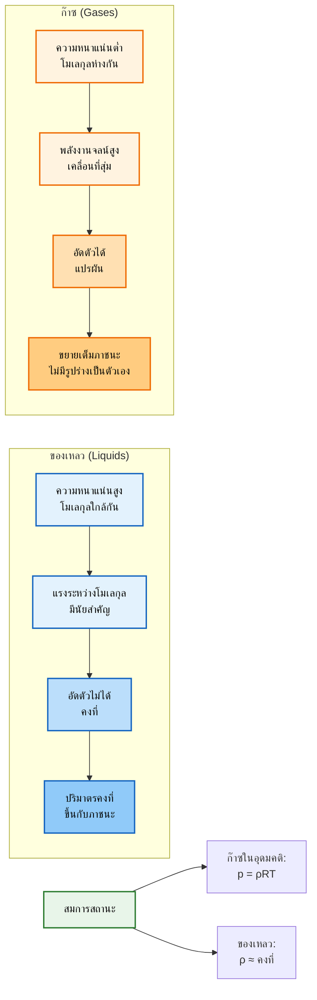
> **Figure 1:** การเปรียบเทียบคุณสมบัติทางกายภาพพื้นฐานระหว่างของเหลวและก๊าซ โดยเน้นที่ความแตกต่างของระยะห่างระหว่างโมเลกุล ความสามารถในการอัดตัว และพฤติกรรมของปริมาตร ซึ่งนำไปสู่สมการสถานะที่แตกต่างกัน
> **Figure 1:** Comparison of fundamental physical properties between liquids and gases, highlighting differences in molecular spacing, compressibility, and volume behavior, leading to their respective equations of state.

---

## 📊 คุณสมบัติของไหล

### คุณสมบัติพื้นฐาน

| คุณสมบัติ | สัญลักษณ์ | นิยาม | หน่วย SI |
|-------------|-------------|---------|-----------|
| ความหนาแน่น | $\rho$ | มวลต่อหนึ่งหน่วยปริมาตร: $\rho = \frac{m}{V}$ | kg/m³ |
| ความดัน | $p$ | แรงตั้งฉากต่อหนึ่งหน่วยพื้นที่: $p = \frac{F_n}{A}$ | Pa = N/m² |
| อุณหภูมิ | $T$ | การวัดพลังงานความร้อน | K |
| ความหนืดพลวัต | $\mu$ | ความต้านทานต่อการเปลี่ยนรูป | Pa·s |
| ความหนืดจลนศาสตร์ | $\nu$ | $\nu = \frac{\mu}{\rho}$ | m²/s |

#### ค่าอ้างอิงทั่วไป

- **ของเหลว**: $\rho_{water} \approx 1000$ kg/m³
- **ก๊าซ**: $\rho_{air,STP} \approx 1.225$ kg/m³

#### ประเภทความดัน

- **ความดันสัมบูรณ์ (Absolute pressure)**: วัดจากสุญญากาศสมบูรณ์
- **ความดันเกจ (Gauge pressure)**: วัดจากความดันบรรยากาศ
- **ความดันพลวัต (Dynamic pressure)**: $\frac{1}{2}\rho U^2$

### คุณสมบัติอนุพันธ์

| คุณสมบัติ | สัญลักษณ์ | ความหมาย | หน่วย SI |
|-------------|-------------|-------------|-----------|
| ความร้อนจำเพาะความดันคงที่ | $c_p$ | พลังงานความร้อนต่อมวสต่ออุณหภูมิ (ความดันคงที่) | J/(kg·K) |
| ความร้อนจำเพาะปริมาตรคงที่ | $c_v$ | พลังงานความร้อนต่อมวสต่ออุณหภูมิ (ปริมาตรคงที่) | J/(kg·K) |
| สภาพนำความร้อน | $k$ | ความสามารถในการถ่ายเทความร้อน | W/(m·K) |
| แรงตึงผิว | $\sigma$ | พลังงานต่อหนึ่งหน่วยพื้นที่ที่รอยต่อ | N/m |

---

## 📐 การวิเคราะห์มิติและความคล้ายคลึง

### มิติพื้นฐาน

- **มวล (Mass)**: [M]
- **ความยาว (Length)**: [L]
- **เวลา (Time)**: [T]
- **อุณหภูมิ (Temperature)**: [θ]
- **กระแสไฟฟ้า (Electric Current)**: [I]
- **ปริมาณสาร (Amount of Substance)**: [N]
- **ความเข้มของการส่องสว่าง (Luminous Intensity)**: [J]

### มิติคุณสมบัติของไหล

| Property | Symbol | Dimensions | SI Units |
|----------|--------|------------|----------|
| Density | $\rho$ | [M L⁻³] | kg/m³ |
| Velocity | $U$ | [L T⁻¹] | m/s |
| Pressure | $p$ | [M L⁻¹ T⁻²] | Pa |
| Dynamic Viscosity | $\mu$ | [M L⁻¹ T⁻¹] | Pa·s |
| Kinematic Viscosity | $\nu$ | [L² T⁻¹] | m²/s |

### 🔄 เลขไร้มิติ (Dimensionless Numbers)

#### เลขเรย์โนลด์ (Reynolds Number) ($\text{Re}$)

อัตราส่วนของแรงเฉื่อยต่อแรงหนืด:

$$
\text{Re} = \frac{\rho U L}{\mu} = \frac{U L}{\nu}
$$

**ความสำคัญทางกายภาพ**:

| ค่า Re | ระบอบการไหล | ลักษณะเฉพาะ |
|---------|---------------|----------------|
| $\text{Re} \ll 1$ | การไหลแบบคืบคลาน | แรงหนืดมีอิทธิพลเหนือกว่า |
| $1 < \text{Re} < 2000$ | การไหลแบบราบเรียบ | การไหลเป็นเลเยอร์ |
| $2000 < \text{Re} < 4000$ | การเปลี่ยนผ่าน | การเปลี่ยนจากราบเรียบเป็นปั่นป่วน |
| $\text{Re} \gg 1$ | การไหลแบบปั่นป่วน | แรงเฉื่อยมีอิทธิพลเหนือกว่า |

#### เลขมัค (Mach Number) ($\text{Ma}$)

อัตราส่วนของความเร็วการไหลต่อความเร็วเสียง:

$$
\text{Ma} = \frac{U}{a}
$$

**ระบอบการไหล (Flow regimes)**:

| ค่า Ma | ระบอบการไหล | คุณสมบัติ |
|---------|----------------|-------------|
| $\text{Ma} < 0.3$ | อัดตัวไม่ได้ | ความหนาแน่นคงที่ |
| $0.3 < \text{Ma} < 1$ | อัดตัวได้ความเร็วต่ำกว่าเสียง | ผลกระทบจากการอัดตัว |
| $\text{Ma} \approx 1$ | ทรานโซนิก | การเปลี่ยนผ่านระหว่างรอยเสียง |
| $\text{Ma} > 1$ | ความเร็วเหนือเสียง | คลื่นกระแทกและการบีบอัด |

#### เลขฟรูด (Froude Number) ($\text{Fr}$)

อัตราส่วนของแรงเฉื่อยต่อแรงโน้มถ่วง:

$$
\text{Fr} = \frac{U}{\sqrt{g L}}
$$

**ความสำคัญ**: มีความสำคัญในการไหลแบบผิวอิสระ (free-surface flows), แรงต้านทานเรือ, การไหลในช่องเปิด

#### เลขเวเบอร์ (Weber Number) ($\text{We}$)

อัตราส่วนของแรงเฉื่อยต่อแรงตึงผิว:

$$
\text{We} = \frac{\rho U^2 L}{\sigma}
$$

**ความสำคัญ**: มีความสำคัญในการก่อตัวของหยดน้ำ, พลวัตของฟองอากาศ, การวิเคราะห์ละอองสเปรย์

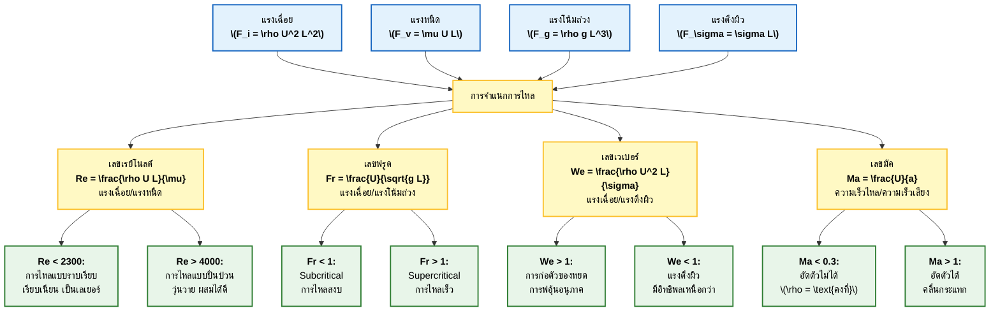
> **Figure 2:** การจำแนกประเภทของระบอบการไหลของไหลตามเลขไร้มิติ (เลขเรย์โนลด์, ฟรูด, เวเบอร์ และมัค) แสดงความสัมพันธ์ระหว่างแรงทางกายภาพที่เด่นชัดและลักษณะการไหลที่เกิดขึ้น
> **Figure 2:** Classification of fluid flow regimes based on dimensionless numbers (Reynolds, Froude, Weber, and Mach numbers), illustrating the relationship between dominant physical forces and resulting flow characteristics.

---

## 🔬 สมมติฐานคอนตินิวอัม (Continuum Hypothesis)

### คำนิยาม

**สมมติฐานคอนตินิวอัม (continuum hypothesis)** สมมติว่าคุณสมบัติของไหลสามารถนิยามได้ทุกจุดในอวกาศ โดยถือว่าของไหลเป็นตัวกลางต่อเนื่องแทนที่จะเป็นโมเลกุลแยกส่วน

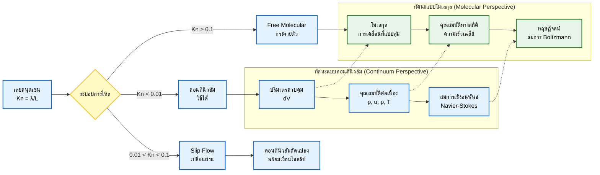
> **Figure 3:** กรอบแนวคิดของสมมติฐานคอนตินิวอัมเปรียบเทียบกับทัศนะแบบโมเลกุล ความถูกต้องของสมมติฐานนี้ถูกกำหนดโดยเลขคนุดเซน ($Kn$) ซึ่งบ่งบอกถึงการเปลี่ยนผ่านจากการคำนวณแบบ Navier-Stokes มาตรฐานไปสู่ระบอบการไหลแบบสลิปและแบบโมเลกุลอิสระ
> **Figure 3:** The Continuum Hypothesis framework contrasted with the molecular perspective. The validity of the continuum assumption is determined by the Knudsen number ($Kn$), which dictates the transition from standard Navier-Stokes formulations to slip-flow and free-molecular regimes.

### เลขคนุดเซน (Knudsen Number) ($\text{Kn}$)

อัตราส่วนของระยะทางอิสระเฉลี่ยของโมเลกุลต่อความยาวลักษณะเฉพาะ:

$$
\text{Kn} = \frac{\lambda}{L}
$$

**ระบอบการไหล (Flow regimes)**:

| ค่า Kn | ระบอบการไหล | คำอธิบาย |
|---------|----------------|------------|
| $\text{Kn} < 0.01$ | การไหลแบบคอนตินิวอัม | Navier-Stokes ใช้ได้ |
| $0.01 < \text{Kn} < 0.1$ | การไหลแบบสลิป | มีสลิปที่ผนัง |
| $0.1 < \text{Kn} < 10$ | การไหลแบบเปลี่ยนผ่าน | ระหว่างคอนตินิวอัมและโมเลกุล |
| $\text{Kn} > 10$ | การไหลแบบโมเลกุลอิสระ | ไม่สามารถใช้ Navier-Stokes |

### แนวคิดปริมาตรควบคุม (Control Volume Concept)

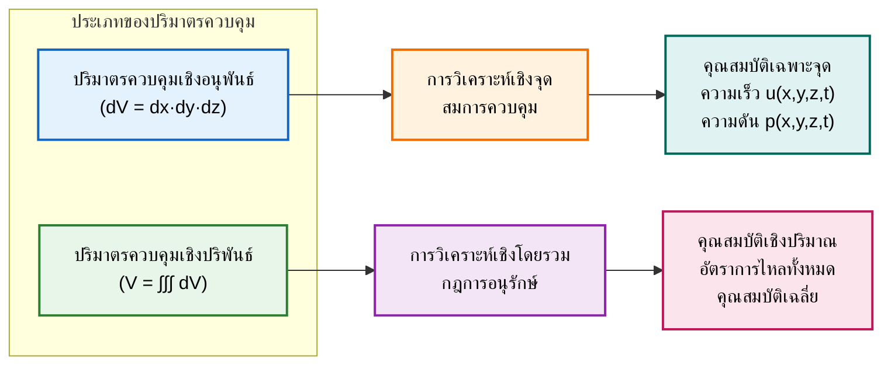
> **Figure 4:** การจำแนกแนวทางการใช้ปริมาตรควบคุมในกลศาสตร์ของไหล โดยปริมาตรควบคุมเชิงอนุพันธ์ ($\mathrm{d}V$) นำไปสู่สมการเชิงอนุพันธ์ย่อยที่อธิบายคุณสมบัติเฉพาะจุด ในขณะที่ปริมาตรควบคุมจำกัด ($V$) นำไปสู่รูปแบบปริพันธ์สำหรับการวิเคราะห์การไหลในภาพรวม
> **Figure 4:** Classification of Control Volume approaches in fluid mechanics. Differential control volumes ($\mathrm{d}V$) lead to partial differential equations describing point-wise properties, while finite control volumes ($V$) result in integral formulations for global flow analysis.

- **ปริมาตรควบคุมเชิงอนุพันธ์**: องค์ประกอบปริมาตรขนาดเล็ก $\mathrm{d}V = \mathrm{d}x \,\mathrm{d}y \,\mathrm{d}z$
- **ปริมาตรควบคุมเชิงปริพันธ์**: ปริมาตรจำกัด $V$ ที่ล้อมรอบด้วยพื้นผิว $S$

---

## 📖 สถิตยศาสตร์ของไหล (Fluid Statics)

### การกระจายความดันสถิตยศาสตร์ (Hydrostatic Pressure Distribution)

$$
\frac{\mathrm{d}p}{\mathrm{d}z} = -\rho g
$$

สำหรับความหนาแน่นคงที่:

$$
p = p_0 + \rho g h
$$

**คำอธิบายตัวแปร**:
- $p$ = ความดัน ณ ความสูง h
- $p_0$ = ความดัน ณ จุดอ้างอิง
- $\rho$ = ความหนาแน่นของของไหล
- $g$ = ความเร่งเนื่องจากแรงโน้มถ่วง
- $h$ = ความสูงเหนือจุดอ้างอิง

### แรงลอยตัว (Buoyancy) (หลักการของอาร์คิมิดีส)

แรงลอยตัวเท่ากับน้ำหนักของของไหลที่ถูกแทนที่:

$$
F_b = \rho_{fluid} g V_{displaced}
$$

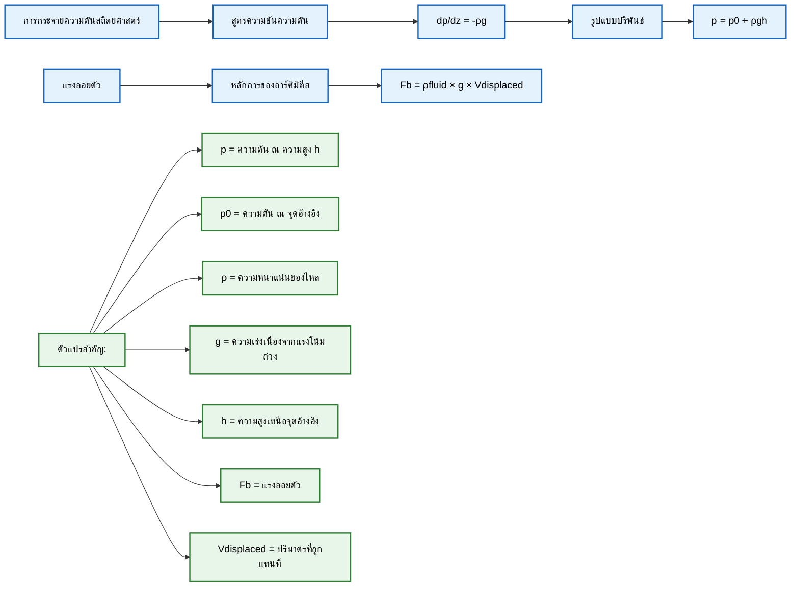
> **Figure 5:** หลักการของสถิตยศาสตร์ของไหล แสดงการหาการกระจายความดันสถิตยศาสตร์ ($p = p_0 + \rho g h$) และหลักการของอาร์คิมิดีสสำหรับแรงลอยตัว ($F_b$) ตามการแทนที่ของไหล
> **Figure 5:** Principles of fluid statics, showing the derivation of the hydrostatic pressure distribution ($p = p_0 + \rho g h$) and Archimedes' principle for buoyancy force ($F_b$) based on fluid displacement.

---

## 🌀 จลนศาสตร์ของไหล (Fluid Kinematics)

### วิธีการอธิบายการไหล (Flow Description Methods)

#### คำอธิบายแบบออยเลอร์ (Eulerian Description)
คุณสมบัติที่อธิบาย ณ จุดคงที่ในอวกาศ:
$$
\mathbf{u} = \mathbf{u}(\mathbf{x}, t)
$$

#### คำอธิบายแบบลากรางจ์ (Lagrangian Description)
คุณสมบัติที่อธิบายตามอนุภาคของไหล:
$$
\mathbf{x} = \mathbf{x}(\mathbf{x}_0, t)
$$

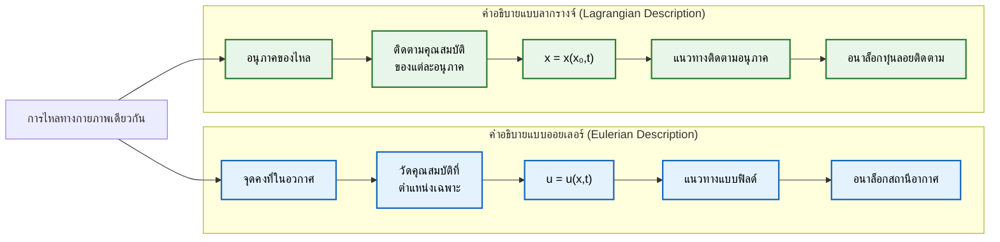
> **Figure 6:** การเปรียบเทียบระหว่างคำอธิบายการไหลแบบออยเลอร์และลากรางจ์ โดยวิธีแบบออยเลอร์จะสังเกตคุณสมบัติ ณ จุดคงที่ในอวกาศ (ซึ่งเป็นที่นิยมใน CFD) ในขณะที่วิธีแบบลากรางจ์จะติดตามการเคลื่อนที่ของแต่ละอนุภาคของไหลตามเวลา
> **Figure 6:** Contrast between Eulerian and Lagrangian flow descriptions. The Eulerian approach observes properties at fixed spatial points (typical in CFD), while the Lagrangian approach tracks individual fluid particles over time.

### การแสดงภาพสนามการไหล (Flow Field Visualization)

#### เส้นกระแส (Streamlines)
เส้นโค้งที่สัมผัสกับเวกเตอร์ความเร็ว ณ แต่ละขณะ:
$$
\frac{\mathrm{d}\mathbf{x}}{\mathrm{d}s} = \mathbf{u}(\mathbf{x}, t)
$$

#### เส้นทางเดินอนุภาค (Pathlines)
วิถีจริงของอนุภาคของไหล:
$$
\frac{\mathrm{d}\mathbf{x}}{\mathrm{d}t} = \mathbf{u}(\mathbf{x}, t)
$$

#### เส้นสาย (Streaklines)
ตำแหน่งของอนุภาคทั้งหมดที่เคยผ่านจุดที่กำหนด

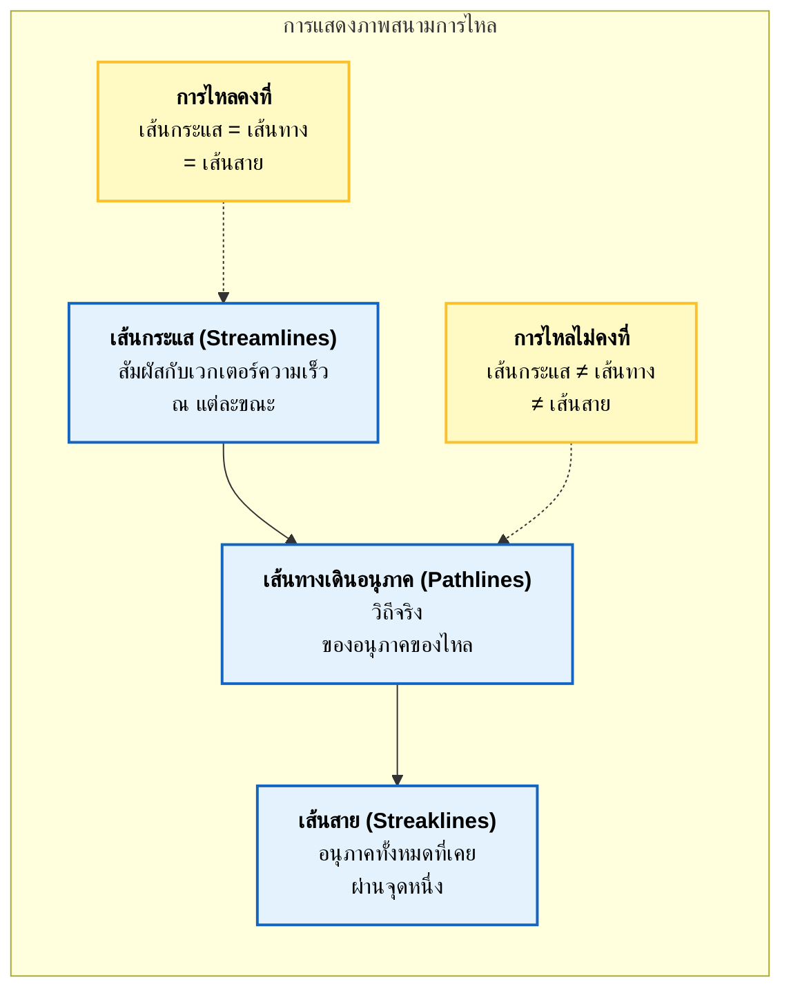
> **Figure 7:** ความสัมพันธ์ระหว่างเทคนิคการแสดงภาพสนามการไหลแบบต่าง ๆ ในการไหลแบบคงที่ เส้นกระแส เส้นทางเดินอนุภาค และเส้นสายจะทับซ้อนกัน แต่ในการไหลแบบไม่คงที่ เส้นเหล่านี้จะแยกจากกัน ซึ่งแสดงให้เห็นถึงประวัติการไหลและสนามการไหลในขณะนั้นที่แตกต่างกัน
> **Figure 7:** Relationship between different flow visualization techniques. In steady flows, streamlines, pathlines, and streaklines coincide; in unsteady flows, they diverge, revealing different aspects of the flow history and instantaneous field.

### การจำแนกประเภทการไหล (Flow Classification)

#### การไหลแบบคงที่ (Steady) เทียบกับการไหลแบบไม่คงที่ (Unsteady)

- **การไหลแบบคงที่**: $\frac{\partial}{\partial t} = 0$
- **การไหลแบบไม่คงที่**: ขึ้นอยู่กับเวลา

#### การไหลแบบสม่ำเสมอ (Uniform) เทียบกับการไหลแบบไม่สม่ำเสมอ (Non-uniform)

- **การไหลแบบสม่ำเสมอ**: ไม่มีการเปลี่ยนแปลงเชิงพื้นที่ในทิศทางการไหล
- **การไหลแบบไม่สม่ำเสมอ**: มีการเปลี่ยนแปลงเชิงพื้นที่

#### การไหลแบบอัดตัวได้ (Compressible) เทียบกับการไหลแบบอัดตัวไม่ได้ (Incompressible)

- **อัดตัวไม่ได้**: $\nabla \cdot \mathbf{u} = 0$
- **อัดตัวได้**: ความหนาแน่นแปรผันตามความดันและอุณหภูมิ

#### การไหลแบบราบเรียบ (Laminar) เทียบกับการไหลแบบปั่นป่วน (Turbulent)

| ลักษณะ | การไหลแบบราบเรียบ | การไหลแบบปั่นป่วน |
|----------|----------------------|----------------------|
| การเคลื่อนที่ | เป็นเลเยอร์ เรียบเนียน | วุ่นวาย สุ่ม |
| การผสม | ต่ำมาก | สูงมาก |
| การพึ่งพาเวลา | ไม่มี | มีมาก |
| พลังงาน | แรงเฉือยต่ำ | การพลัดเปลี่ยนพลังงาน |

---

## 💪 ความเค้นในของไหล (Stress in Fluids)

### เทนเซอร์ความเค้น (Stress Tensor)

สถานะความเค้น ณ จุดหนึ่งอธิบายโดยเทนเซอร์ความเค้น $\boldsymbol{\tau}$:

$$
\boldsymbol{\tau} = \begin{bmatrix}
\tau_{xx} & \tau_{xy} & \tau_{xz} \\
\tau_{yx} & \tau_{yy} & \tau_{yz} \\
\tau_{zx} & \tau_{zy} & \tau_{zz}
\end{bmatrix}
$$

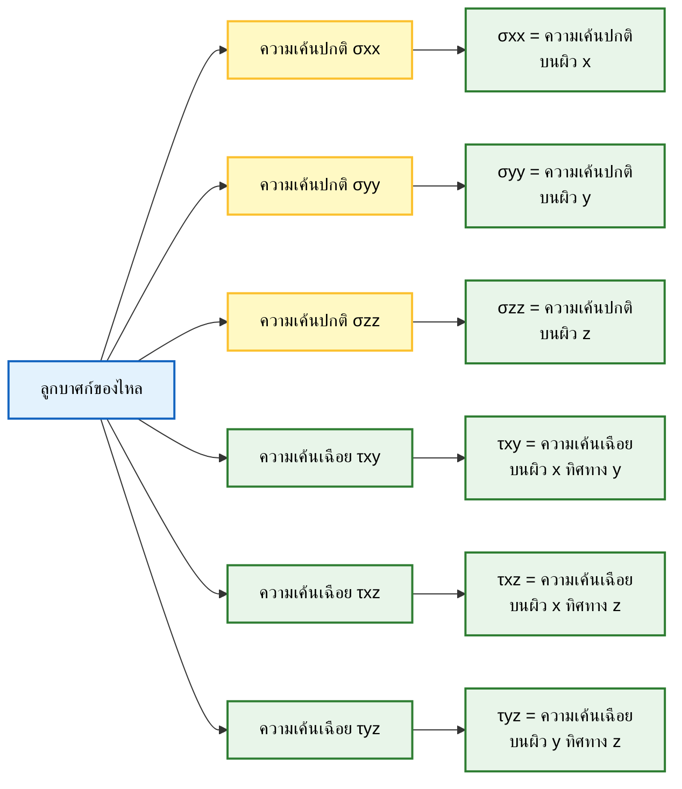
> **Figure 8:** ส่วนประกอบของเทนเซอร์ความเค้นที่กระทำต่อองค์ประกอบของไหล โดยแยกความแตกต่างระหว่างความเค้นปกติ ($\sigma$) และความเค้นเฉือน ($\tau$) บนระนาบที่ตั้งฉากกัน ($x, y, z$)
> **Figure 8:** Components of the stress tensor acting on a fluid element, distinguishing between normal stresses ($\sigma$) and shear stresses ($\tau$) on orthogonal planes ($x, y, z$).

### ความดันและความเค้นหนืด (Pressure and Viscous Stress)

การแยกส่วนความเค้นรวม:
$$
\boldsymbol{\tau} = -p\mathbf{I} + \boldsymbol{\tau}_{viscous}
$$

#### ความเค้นความดัน (Pressure Stress)
ส่วนไอโซทรอปิก: $-p\mathbf{I}$

#### ความเค้นหนืด (Viscous Stress) (ของไหลแบบนิวตัน)

สำหรับของไหลแบบนิวตัน (Newtonian fluid):
$$
\tau_{ij} = \mu\left(\frac{\partial u_i}{\partial x_j} + \frac{\partial u_j}{\partial x_i}\right) - \frac{2}{3}\mu(\nabla \cdot \mathbf{u})\delta_{ij}
$$

---

## 🌪️ Vorticity และ Circulation

### Vorticity ($\boldsymbol{\omega}$)

การวัดการหมุนเฉพาะที่:
$$
\boldsymbol{\omega} = \nabla \times \mathbf{u}
$$

#### ส่วนประกอบใน 3 มิติ
$$
\boldsymbol{\omega} = \left(\frac{\partial w}{\partial y} - \frac{\partial v}{\partial z}, \frac{\partial u}{\partial z} - \frac{\partial w}{\partial x}, \frac{\partial v}{\partial x} - \frac{\partial u}{\partial y}\right)
$$

### Circulation ($\Gamma$)

ปริพันธ์ตามเส้นของความเร็วรอบเส้นโค้งปิด:
$$
\Gamma = \oint_C \mathbf{u} \cdot \mathrm{d}\mathbf{l} = \int_S (\nabla \times \mathbf{u}) \cdot \mathrm{d}\mathbf{S} = \int_S \boldsymbol{\omega} \cdot \mathrm{d}\mathbf{S}
$$

**ทฤษฎี Circulation ของเคลวิน (Kelvin's Circulation Theorem)**: Circulation ถูกอนุรักษ์ในการไหลแบบไร้ความหนืด (inviscid), แบบบารอทรอปิก (barotropic) ที่มีแรงภายนอกแบบอนุรักษ์ (conservative body forces)

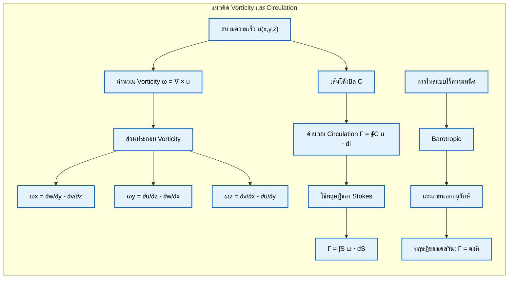
> **Figure 9:** คำนิยามทางคณิตศาสตร์ของ Vorticity ($\omega$) ในฐานะ curl ของความเร็ว และความสัมพันธ์กับ Circulation ($\Gamma$) ผ่านทฤษฎีของ Stokes รวมถึงทฤษฎี Circulation ของเคลวินสำหรับการไหลแบบไร้ความหนืดและบารอทรอปิก
> **Figure 9:** Mathematical definition of vorticity ($\omega$) as the curl of velocity and its relationship to circulation ($\Gamma$) via Stokes' theorem, including Kelvin's circulation theorem for inviscid, barotropic flows.

---

## 💧 การไหลแบบศักย์ (Potential Flow)

### ศักย์ความเร็ว (Velocity Potential) ($\phi$)

สำหรับการไหลแบบไร้การหมุน ($\nabla \times \mathbf{u} = 0$):
$$
\mathbf{u} = \nabla \phi
$$

**สมการลาปลาซ (Laplace equation)**:
$$
\nabla^2 \phi = 0
$$

### ฟังก์ชันกระแส (Stream Function) ($\psi$)

สำหรับการไหลแบบอัดตัวไม่ได้ 2 มิติ:
$$
u = \frac{\partial \psi}{\partial y}, \quad v = -\frac{\partial \psi}{\partial x}
$$

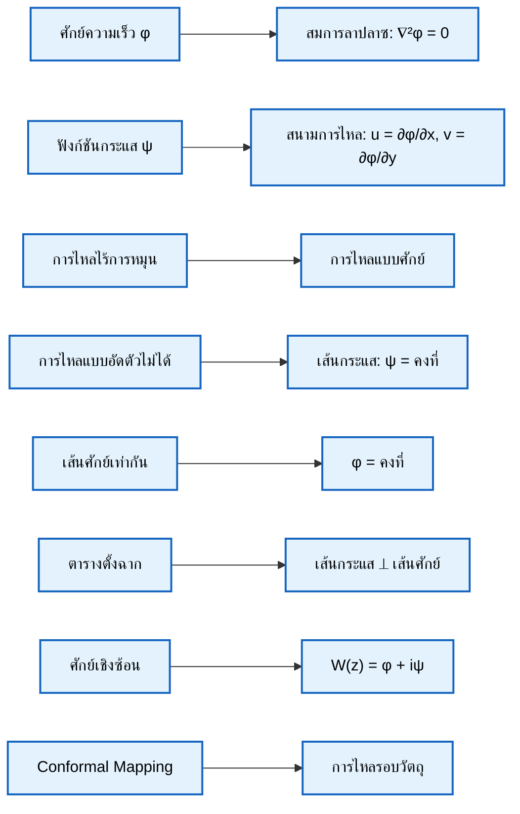
> **Figure 10:** โครงสร้างของทฤษฎีการไหลแบบศักย์ เชื่อมโยงศักย์ความเร็ว ($\phi$) และฟังก์ชันกระแส ($\psi$) เข้ากับสมการลาปลาซ ($\nabla^2\phi=0$) สำหรับการไหลที่ไร้การหมุน อัดตัวไม่ได้ และไร้ความหนืด
> **Figure 10:** Structure of Potential Flow theory, linking the velocity potential ($\phi$) and stream function ($\psi$) to the Laplace equation ($\nabla^2\phi=0$) for irrotational, incompressible, and inviscid flows.

---

## 🏔️ ชั้นขอบเขต (Boundary Layers)

### แนวคิด

บริเวณบางๆ ใกล้กับพื้นผิวแข็งที่ผลกระทบจากความหนืดมีความสำคัญ

### ความหนาของชั้นขอบเขต (Boundary Layer Thickness) ($\delta$)

ระยะทางลักษณะเฉพาะจากผนังที่ความเร็วถึง 99% ของความเร็วการไหลอิสระ (free-stream velocity)

#### ชั้นขอบเขตแบบราบเรียบ (Laminar Boundary Layer) (Blasius Solution)
$$
\delta \approx \frac{5.0x}{\sqrt{\text{Re}_x}} = 5.0\sqrt{\frac{\nu x}{U_\infty}}
$$

#### ชั้นขอบเขตแบบปั่นป่วน (Turbulent Boundary Layer)
$$
\delta \approx \frac{0.37x}{\text{Re}_x^{1/5}}
$$

### ความเค้นเฉือยที่ผนัง (Wall Shear Stress)
$$
\tau_w = \mu\left(\frac{\partial u}{\partial y}\right)_{y=0}
$$

#### สัมประสิทธิ์แรงเสียดทานผิว (Skin Friction Coefficient)
$$
C_f = \frac{\tau_w}{\frac{1}{2}\rho U_\infty^2}
$$

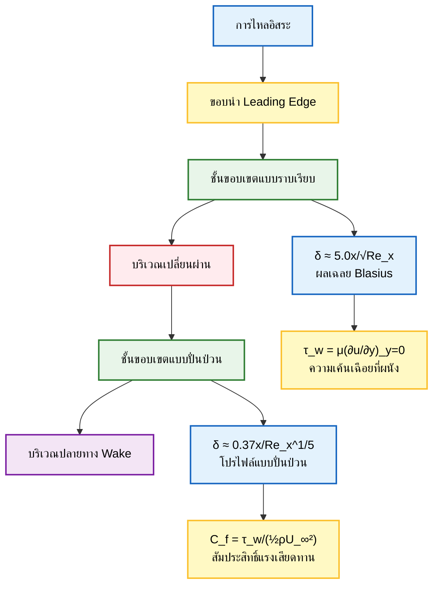
> **Figure 11:** แผนผังการพัฒนาของชั้นขอบเขตเหนือแผ่นเรียบ แสดงลำดับจากการไหลแบบราบเรียบไปสู่การไหลแบบปั่นป่วน การขยายตัวของความหนาชั้นขอบเขต ($\delta$) และการคำนวณความเค้นเฉือนที่ผนัง ($\tau_w$)
> **Figure 11:** Schematic of boundary layer development over a flat plate, showing the progression from laminar to turbulent flow, the associated growth of boundary layer thickness ($\delta$), and the calculation of wall shear stress ($\tau_w$).

### OpenFOAM Code Implementation

```cpp
// การคำนวณความหนาชั้นขอบเขตใน OpenFOAM
scalar delta = 5.0 * sqrt(nu * x / Uinf);
label wallCell = mesh.boundaryMesh()[wallPatchID].whichCell(x);
scalar yPlus = wallDist[wallCell] * sqrt(tauW[wallCell] / rho);
```

---

## 🌊 ปรากฏการณ์การไหลพื้นฐาน

### การแยกตัวของการไหล (Flow Separation)
เกิดขึ้นเมื่อชั้นขอบเขตหลุดออกจากพื้นผิวเนื่องจากความชันความดันที่ไม่เอื้ออำนวย (adverse pressure gradient)

### การก่อตัวของ Wake (Wake Formation)
บริเวณของการไหลที่ถูกรบกวนท้ายสิ่งกีดขวาง

### การหลุดของ Vortex (Vortex Shedding)
การก่อตัวของ Vortex สลับกันด้านหลังวัตถุที่มีรูปร่างทู่ (von Kármán vortex street)

### การไหลแบบ Jet และ Plume (Jet and Plume Flows)
กระแสของไหลความเร็วสูงที่พุ่งเข้าสู่ของไหลรอบข้าง

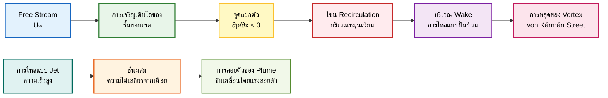
> **Figure 12:** ภาพรวมของปรากฏการณ์การไหลที่ซับซ้อน รวมถึงการแยกตัวของชั้นขอบเขตเนื่องจากความชันความดันที่ไม่เอื้ออำนวย การเกิด Wake การหลุดของ Vortex แบบ von Kármán และความไม่เสถียรของชั้นเฉือนใน Jet และ Plume
> **Figure 12:** Overview of complex flow phenomena including boundary layer separation due to adverse pressure gradients, wake formation, von Kármán vortex shedding, and shear-layer instabilities in jets and plumes.

---

## 💻 สัญชาตญาณทางกายภาพสำหรับ CFD

### 🎯 เหตุใดพื้นฐานเหล่านี้จึงสำคัญสำหรับ CFD

#### การออกแบบ Mesh
- **ชั้นขอบเขต (Boundary layers)**: ต้องการความละเอียดสูงใกล้ผนัง
- **เลขเรย์โนลด์สูง (High Reynolds number)**: อาจต้องใช้แบบจำลองความปั่นป่วน (turbulence modeling)
- **ผลกระทบจากการอัดตัว (Compressible effects)**: อาจต้องใช้แผนการจับคลื่นกระแทก (shock-capturing schemes)

#### การเลือก Solver
- **คงที่ (Steady) เทียบกับไม่คงที่ (unsteady)**: เลือกการรวมเวลาที่เหมาะสม
- **อัดตัวได้ (Compressible) เทียบกับอัดตัวไม่ได้ (incompressible)**: สมการควบคุมที่แตกต่างกัน
- **ราบเรียบ (Laminar) เทียบกับปั่นป่วน (turbulent)**: การสร้างแบบจำลองเทียบกับการจำลองโดยตรง

#### เงื่อนไขขอบเขต (Boundary Conditions)
- **ความหมายทางกายภาพ**: ทำความเข้าใจว่าแต่ละ BC แสดงถึงอะไร
- **พฤติกรรมทางคณิตศาสตร์**: ความสมบูรณ์ของปัญหาค่าขอบเขต (boundary value problem)

#### เกณฑ์การลู่เข้า (Convergence Criteria)
- **พื้นฐานทางกายภาพ**: Residuals แสดงถึงความไม่สมดุลของสมการ
- **ขีดจำกัดความเสถียร**: ข้อจำกัดของ Time step จากฟิสิกส์

### ⚠️ ข้อผิดพลาดที่พบบ่อยใน CFD จากกลศาสตร์ของไหล

#### ความละเอียดของชั้นขอบเขตไม่เพียงพอ (Inadequate Boundary Layer Resolution)
- **ปัญหา**: การจัดการผนังที่ไม่ดี
- **วิธีแก้ไข**: $y^+ < 1$ สำหรับชั้นขอบเขตที่แก้ไขได้

#### การสร้างแบบจำลองความปั่นป่วนไม่ถูกต้อง (Incorrect Turbulence Modeling)
- **ปัญหา**: ใช้ Solver แบบราบเรียบสำหรับการไหลแบบปั่นป่วน
- **วิธีแก้ไข**: ตรวจสอบ Reynolds number, เลือกแบบจำลองที่เหมาะสม

#### ละเลยผลกระทบจากการอัดตัว (Compressibility Effects Neglected)
- **ปัญหา**: สมมติว่าการไหลเป็นแบบอัดตัวไม่ได้ที่ Mach number สูง
- **วิธีแก้ไข**: ตรวจสอบ Mach number, ใช้ compressible Solver หากจำเป็น

#### เงื่อนไขเริ่มต้นไม่ดี (Poor Initial Conditions)
- **ปัญหา**: สถานะเริ่มต้นที่ไม่เป็นไปตามหลักฟิสิกส์
- **วิธีแก้ไข**: เริ่มต้นจากเงื่อนไขที่สมเหตุสมผลทางกายภาพ

### OpenFOAM Code Implementation

```cpp
// การคำนวณเลขเรย์โนลด์และตรวจสอบระบอบการไหล
scalar Re = rho * U * L / mu;

if (Re < 2000)
{
    Info << "ตรวจพบระบอบการไหลแบบราบเรียบ (Laminar flow regime detected)" << endl;
}
else if (Re > 4000)
{
    Info << "ตรวจพบระบอบการไหลแบบปั่นป่วน (Turbulent flow regime detected)" << endl;
    // เลือกแบบจำลองความปั่นป่วนที่เหมาะสม
}
else
{
    Info << "ตรวจพบระบอบการไหลแบบเปลี่ยนผ่าน (Transition flow regime detected)" << endl;
}
```

---

## 🧮 ตัวอย่างเชิงปฏิบัติ

### ตัวอย่างที่ 1: การไหลเหนือแผ่นเรียบ

คำนวณความหนาของชั้นขอบเขตที่ $x = 1$ m สำหรับอากาศที่ $U_\infty = 10$ m/s

**กำหนด**: $\nu_{air} = 1.5 \times 10^{-5}$ m²/s

**วิธีแก้**:

1. คำนวณเลขเรย์โนลด์:
   $$
   \text{Re}_x = \frac{U_\infty x}{\nu} = \frac{10 \times 1}{1.5 \times 10^{-5}} = 6.67 \times 10^5
   $$

2. ตรวจสอบระบอบการไหล:
   เนื่องจาก $\text{Re}_x < 5 \times 10^5$ จึงเป็นชั้นขอบเขตแบบราบเรียบ

3. คำนวณความหนาชั้นขอบเขต:
   $$
   \delta = 5.0\sqrt{\frac{\nu x}{U_\infty}} = 5.0\sqrt{\frac{1.5 \times 10^{-5} \times 1}{10}} = 6.1 \times 10^{-3} \text{ m}
   $$

### ตัวอย่างที่ 2: เลขเรย์โนลด์ของการไหลในท่อ

คำนวณเลขเรย์โนลด์สำหรับการไหลของน้ำในท่อขนาดเส้นผ่านศูนย์กลาง 10 cm ที่ความเร็ว 2 m/s

**กำหนด**: $\nu_{water} = 10^{-6}$ m²/s, $D = 0.1$ m

**วิธีแก้**:
$$
\text{Re} = \frac{U D}{\nu} = \frac{2 \times 0.1}{10^{-6}} = 2 \times 10^5
$$

เนื่องจาก $\text{Re} > 4000$ การไหลจึงเป็นแบบปั่นป่วน

### OpenFOAM Code Implementation

```cpp
// ตัวอย่างการคำนวณชั้นขอบเขต
scalar Re_x = Uinf * x / nu;
scalar delta;

if (Re_x < 5e5)
{
    // ชั้นขอบเขตแบบราบเรียบ
    delta = 5.0 * sqrt(nu * x / Uinf);
}
else
{
    // ชั้นขอบเขตแบบปั่นป่วน
    delta = 0.37 * x / pow(Re_x, 0.2);
}

Info << "ความหนาชั้นขอบเขตที่ x = " << x
     << " คือ " << delta << " m" << endl;
```

---

## 📚 สรุป

บทเรียนนี้ได้วางรากฐานของกลศาสตร์ของไหลที่จำเป็นสำหรับ CFD:

### 🔑 แนวคิดหลัก

- **คุณสมบัติของไหล (Fluid properties)** และการวิเคราะห์มิติ
- **สมมติฐานคอนตินิวอัม (Continuum hypothesis)** และขีดจำกัดความถูกต้อง
- **การจำแนกประเภทการไหล (Flow classification)** และระบอบการไหล
- **สมการพื้นฐาน (Fundamental equations)** ที่ควบคุมการเคลื่อนที่ของไหล

### 🔗 ความเกี่ยวข้องกับ CFD

- การทำความเข้าใจ**ปรากฏการณ์ทางกายภาพ (physical phenomena)** ช่วยในการตีความผลการจำลอง
- **การวิเคราะห์มิติ (Dimensional analysis)** เป็นแนวทางในการเลือกและตรวจสอบแบบจำลอง
- **ระบอบการไหล (Flow regimes)** กำหนดวิธีการเชิงตัวเลขที่เหมาะสม
- **เงื่อนไขขอบเขต (Boundary conditions)** ต้องสะท้อนความเป็นจริงทางกายภาพ

### 📈 ขั้นตอนต่อไป

พื้นฐานเหล่านี้จะมีความสำคัญเมื่อเรา:

- **อนุพันธ์สมการ Navier-Stokes** ในบทเรียนถัดไป
- **พัฒนาวิธีการเชิงตัวเลข (numerical methods)** สำหรับการแก้ปัญหา
- **นำเงื่อนไขขอบเขต (boundary conditions)** ไปใช้ใน OpenFOAM
- **ตรวจสอบความถูกต้องของผลลัพธ์ CFD (validate CFD results)** เทียบกับผลเฉลยเชิงวิเคราะห์

---

**บทเรียนถัดไป**: [[บทเรียนที่ 2: สมการควบคุมการไหลของไหล|02_governing_equations]]
