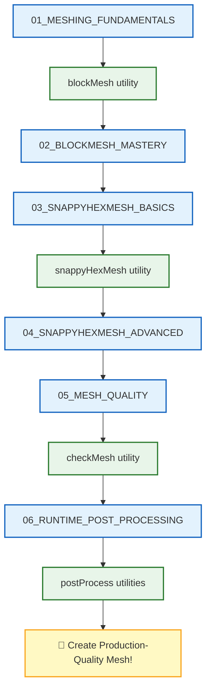

# 🗺️ Learning Navigator: Meshing and Case Setup

> **วัตถุประสงค์**: เอกสารนี้เป็น **เส้นทางการเรียนรู้แบบคู่ขนาน** ที่เชื่อมโยงเนื้อหาทฤษฎี (.md) กับ Source Code และ Utilities จริงใน OpenFOAM

---

## 📋 สารบัญ

1. [Meshing Fundamentals](#1-meshing-fundamentals-พื้นฐานการสร้างเมช)
2. [BlockMesh Mastery](#2-blockmesh-mastery-การใช้-blockmesh)
3. [snappyHexMesh Basics](#3-snappyhexmesh-basics-พื้นฐาน-snappyhexmesh)
4. [snappyHexMesh Advanced](#4-snappyhexmesh-advanced-snappyhexmesh-ขั้นสูง)
5. [Mesh Quality and Manipulation](#5-mesh-quality-and-manipulation-คุณภาพและการจัดการเมช)
6. [Runtime Post-Processing](#6-runtime-post-processing-การประมวลผลระหว่างรัน)

---

## 1. Meshing Fundamentals (พื้นฐานการสร้างเมช)

| 📖 เนื้อหา | 📝 คำอธิบาย | 🔧 Source Code ที่เกี่ยวข้อง |
|-----------|------------|---------------------------|
| [[00_Overview]] | ภาพรวมของโมดูล | - |
| [[01_MESHING_FUNDAMENTALS/01_Introduction_to_Meshing]] | แนะนำการสร้างเมช | `utilities/mesh/generation/blockMesh/` |
| [[01_MESHING_FUNDAMENTALS/02_OpenFOAM_Mesh_Structure]] | โครงสร้างเมชใน OpenFOAM | `utilities/mesh/manipulation/` |

---

## 2. BlockMesh Mastery (การใช้ blockMesh)

| 📖 เนื้อหา | 📝 คำอธิบาย | 🔧 Source Code ที่เกี่ยวข้อง |
|-----------|------------|---------------------------|
| [[02_BLOCKMESH_MASTERY/01_BlockMesh_Deep_Dive]] | การใช้ blockMesh แบบลึกซึ้ง | `utilities/mesh/generation/blockMesh/blockMesh.C` |
| [[02_BLOCKMESH_MASTERY/02_Parametric_Meshing]] | การสร้างเมชแบบ Parametric | `utilities/mesh/generation/blockMesh/` |

### 🎯 Study Guide

| ขั้นตอน | กิจกรรม | เวลาโดยประมาณ |
|--------|---------|--------------|
| 1 | อ่าน `01_BlockMesh_Deep_Dive` เข้าใจ syntax | 30 นาที |
| 2 | เปิด tutorial case ศึกษา `blockMeshDict` | 30 นาที |
| 3 | ลองสร้างเมชด้วย blockMesh | 45 นาที |

---

## 3. snappyHexMesh Basics (พื้นฐาน snappyHexMesh)

| 📖 เนื้อหา | 📝 คำอธิบาย | 🔧 Source Code ที่เกี่ยวข้อง |
|-----------|------------|---------------------------|
| [[03_SNAPPYHEXMESH_BASICS/01_The_sHM_Workflow]] | ขั้นตอนการทำงานของ sHM | `utilities/mesh/generation/snappyHexMesh/` |
| [[03_SNAPPYHEXMESH_BASICS/02_Geometry_Preparation]] | การเตรียม Geometry | `utilities/surface/` |
| [[03_SNAPPYHEXMESH_BASICS/03_Castellated_Mesh_Settings]] | การตั้งค่า Castellated Mesh | `utilities/mesh/generation/snappyHexMesh/` |

---

## 4. snappyHexMesh Advanced (snappyHexMesh ขั้นสูง)

| 📖 เนื้อหา | 📝 คำอธิบาย | 🔧 Source Code ที่เกี่ยวข้อง |
|-----------|------------|---------------------------|
| [[04_SNAPPYHEXMESH_ADVANCED/01_Layer_Addition_Strategy]] | กลยุทธ์การเพิ่ม Layer | `utilities/mesh/generation/snappyHexMesh/` |
| [[04_SNAPPYHEXMESH_ADVANCED/02_Refinement_Regions]] | การกำหนดพื้นที่ Refinement | `utilities/mesh/generation/snappyHexMesh/` |
| [[04_SNAPPYHEXMESH_ADVANCED/03_Multi_Region_Meshing]] | การสร้างเมชหลาย Region | `utilities/mesh/generation/snappyHexMesh/` |

---

## 5. Mesh Quality and Manipulation (คุณภาพและการจัดการเมช)

| 📖 เนื้อหา | 📝 คำอธิบาย | 🔧 Source Code ที่เกี่ยวข้อง |
|-----------|------------|---------------------------|
| [[05_MESH_QUALITY_AND_MANIPULATION/01_Mesh_Quality_Criteria]] | เกณฑ์คุณภาพเมช | `utilities/mesh/manipulation/checkMesh/` |
| [[05_MESH_QUALITY_AND_MANIPULATION/02_Using_TopoSet_and_CellZones]] | การใช้ topoSet และ cellZones | `utilities/mesh/manipulation/topoSet/` |
| [[05_MESH_QUALITY_AND_MANIPULATION/03_Mesh_Manipulation_Tools]] | เครื่องมือจัดการเมช | `utilities/mesh/manipulation/` |

---

## 6. Runtime Post-Processing (การประมวลผลระหว่างรัน)

| 📖 เนื้อหา | 📝 คำอธิบาย | 🔧 Source Code ที่เกี่ยวข้อง |
|-----------|------------|---------------------------|
| [[06_RUNTIME_POST_PROCESSING/01_Introduction_to_FunctionObjects]] | แนะนำ Function Objects | `utilities/postProcessing/` |
| [[06_RUNTIME_POST_PROCESSING/02_Forces_and_Coefficients]] | การคำนวณแรงและสัมประสิทธิ์ | `utilities/postProcessing/forces/` |
| [[06_RUNTIME_POST_PROCESSING/03_Sampling_and_Probes]] | การ Sampling และ Probes | `utilities/postProcessing/sampling/` |

---

## 📁 OpenFOAM Mesh Utilities Structure

```
applications/utilities/
├── mesh/
│   ├── generation/
│   │   ├── blockMesh/         ← 🌟 สร้างเมช structured
│   │   ├── snappyHexMesh/     ← 🌟 สร้างเมช unstructured
│   │   └── foamyMesh/         ← Alternative mesher
│   │
│   ├── manipulation/
│   │   ├── checkMesh/         ← ตรวจสอบคุณภาพเมช
│   │   ├── topoSet/           ← สร้าง cell/face zones
│   │   └── refineMesh/        ← Refine เมช
│   │
│   └── conversion/            ← แปลงรูปแบบเมช
│
├── postProcessing/
│   ├── forces/                ← คำนวณแรง
│   └── sampling/              ← Sampling probes
│
└── surface/                   ← จัดการ geometry surfaces
```

---

## 🎓 Learning Path



---

## 🆕 What's New (2025-12-26 Update)

### Enhanced Content Features

บทเรียนทุกไฟล์ใน MODULE_02 ได้รับการปรับปรุงเพื่อการเรียนรู้ที่ดีขึ้น:

1. **🎨 Mermaid Workflow Diagrams**
   - เพิ่ม Diagram ประกอบการอธิบายแต่ละหัวข้อ
   - ช่วยให้เข้าใจ Flow และความสัมพันธ์ระหว่าง Process ต่างๆ
   - Visualize แนวคิดที่ซับซ้อน (เช่น sHM workflow, topoSet operations, Function objects)

2. **🔗 Cross-Reference Links**
   - เพิ่มลิงก์เชื่อมโยงระหว่างบทเรียนที่เกี่ยวข้อง
   - ช่วยให้สามารถอ้างอิงและเปรียบเทียบแนวคิดได้ง่ายขึ้น

3. **📝 Hands-on Exercises**
   - เพิ่มแบบฝึกหัด 3 ระดับความยาก (Easy, Medium, Hard) ทุกไฟล์
   - **Easy**: True/False และ Multiple Choice ทบทวนแนวคิด
   - **Medium**: อธิบายและเขียนคำสั่ง ประยุกต์ใช้ความรู้
   - **Hard**: Hands-on และวิเคราะห์ ฝึกทักษะขั้นสูง
   - คำตอบทั้งหมดอยู่ใน `<details>` tags สามารถเปิดดูได้

### Statistics

- **Total Files Enhanced**: 17 content files
- **Sections**: 6 main sections
- **Mermaid Diagrams**: 17 workflow diagrams
- **Exercises**: 102 questions (34 Easy, 34 Medium, 34 Hard)

---

*Last Updated: 2025-12-26*
