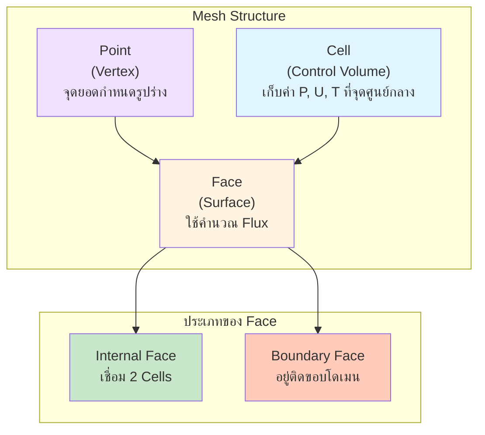

# บทนำสู่การสร้างเมช (Introduction to Meshing)

## 🎯 Learning Objectives

หลังจากศึกษาบทนี้ คุณควรจะสามารถ:
- **อธิบาย** ความสำคัญของคุณภาพเมชต่อความสำเร็จของการจำลอง CFD
- **จำแนก** ประเภทของเซลล์เมชที่แตกต่างกัน (Hex, Tet, Prism, Poly) และข้อดี-ข้อเสียของแต่ละประเภท
- **เปรียบเทียบ** ความแตกต่างระหว่าง Structured Mesh และ Unstructured Mesh
- **ประเมิน** คุณภาพของเมชด้วยตัวชี้วัดหลัก (Non-orthogonality, Skewness, Aspect Ratio)
- **อธิบาย** Workflow การสร้างเมชใน OpenFOAM ตั้งแต่เริ่มต้นจนถึงการตรวจสอบคุณภาพ

---

## 1. ทำไมต้องเรียนรู้เรื่อง Meshing?

ในโลกของ CFD **การสร้างเมช (Meshing)** หรือการทำ Discretization คือขั้นตอนที่แปลงโดเมนทางเรขาคณิตที่ต่อเนื่อง (Continuous Domain) ให้กลายเป็นชิ้นเล็กๆ ที่ไม่ต่อเนื่อง (Discrete Elements/Cells) เพื่อให้คอมพิวเตอร์สามารถคำนวณแก้สมการอนุรักษ์ (Conservation Equations) เช่น Navier-Stokes equations ในแต่ละจุดได้

ใน OpenFOAM เมชที่มีคุณภาพดีคือ **รากฐานของการจำลองที่ประสบผลสำเร็จ** หากเมชมีคุณภาพต่ำ ไม่ว่าคุณจะตั้งค่า Solver ดีแค่ไหน หรือเลือก Turbulence Model ที่ดีแค่ไหน ก็จะเกิดปัญหา **Divergence** (การลู่ออกของคำตอบ) หรือได้ผลลัพธ์ที่ **ไม่แม่นยำ** อย่างแน่นอน

> "A bad mesh is the root of all divergence." (เมชที่ไม่ดีคือต้นเหตุของความลู่ออกทั้งหมด)

### ผลกระทบของคุณภาพเมช

คุณภาพของเมชมีผลโดยตรงต่อ:

1. **ความแม่นยำ (Accuracy):** เมชที่ละเอียดพอจะจับปรากฏการณ์ฟิสิกส์ได้ครบถ้วน ไม่เกิด Numerical Diffusion
2. **ความเสถียร (Stability):** เมชที่คุณภาพแย่จะทำให้เกิด numerical error จน solver ลู่ออก (Diverge)
3. **ความเร็ว (Convergence Speed):** เมชที่ดีช่วยให้ solver หาคำตอบได้เร็วขึ้น ประหยัดเวลาคำนวณ

### ไฟล์และคำสั่งที่คุณจะพบใน OpenFOAM

| ประเภท | ชื่อไฟล์/คำสั่ง | คำอธิบาย |
|:---|:---|:---|
| **ไฟล์การตั้งค่า** | `system/blockMeshDict` | สร้าง Background Mesh (โครงหลัก) |
| | `system/snappyHexMeshDict` | ปรับแต่ง Mesh ตามรูปทรง Geometry |
| | `constant/polyMesh/` | เก็บข้อมูล Mesh ที่สร้างเสร็จแล้ว |
| **คำสั่งตรวจสอบ** | `checkMesh` | ตรวจสอบความผิดปกติของ Mesh |
| | `topoSet` / `createPatch` | จัดการ Boundary ของ Mesh |

---

## 2. แนวคิด Finite Volume Method (FVM) กับ Mesh

OpenFOAM ใช้ระเบียบวิธีปริมาตรจำกัด (Finite Volume Method) ซึ่งต่างจาก Finite Element (FEM) หรือ Finite Difference (FDM) ตรงที่ FVM จะแบ่งโดเมนออกเป็น **Control Volumes (Cells)** เล็กๆ และใช้ทฤษฎีบทของเกาส์ (Gauss's Theorem) แปลงสมการเชิงอนุพันธ์ให้อยู่ในรูปของ **Flux** ที่ไหลเข้า/ออกผ่านพื้นผิวของเซลล์

### องค์ประกอบหลักของ Mesh

1. **Cell (เซลล์):** ปริมาตรควบคุมที่เก็บค่าตัวแปรหลัก (Unknowns) เช่น $P, \mathbf{U}, T, k, \epsilon$ โดยเก็บไว้ที่ **จุดศูนย์กลางเซลล์ (Cell Center)**
2. **Face (หน้า):** พื้นผิวที่ปิดล้อม Cell ใช้คำนวณ Flux ($\phi$)
   - **Internal Face:** หน้าที่เชื่อมระหว่าง 2 Cells
   - **Boundary Face:** หน้าที่อยู่ติดขอบโดเมน (ผนัง, ทางเข้า, ทางออก)
3. **Point (จุด):** จุดยอด (Vertex) ที่กำหนดรูปร่างของ Cell
4. **Edge (ขอบ):** เส้นที่เชื่อมระหว่างจุด (มักไม่ถูกใช้อ้างอิงโดยตรงในการคำนวณ FVM แต่ใช้ในการวาด)

> [!NOTE]
> **OpenFOAM Context:** ใน OpenFOAM โครงสร้าง Mesh ถูกเก็บในรูปแบบ **Face-addressing format** ในไฟล์:
> - `constant/polyMesh/points` - เก็บพิกัดจุดยอด (Vertices) ทั้งหมด
> - `constant/polyMesh/faces` - เก็บรายการหน้า (Faces) และการเชื่อมต่อ
> - `constant/polyMesh/owner` - เก็บว่าแต่ละ Face ถูกครอบครองโดย Cell ไหน
> - `constant/polyMesh/neighbour` - เก็บว่าแต่ละ Internal Face เชื่อมระหว่าง Cell ใดกับใด
> - `constant/polyMesh/boundary` - นิยาม Boundary patches (inlet, outlet, walls ฯลฯ)
>
> ข้อมูลเหล่านี้เป็นหัวใจสำคัญที่ทำให้ OpenFOAM สามารถคำนวณ Flux ผ่านหน้าแต่ละหน้าได้

---

## 3. ประเภทของ Cell (Cell Types)

OpenFOAM รองรับ **General Polyhedral Mesh** คือ Cell จะมีกี่หน้าก็ได้ (ขอให้เป็น Convex) แต่ในทางปฏิบัติเรามักพบ 4 ประเภทหลัก:

| ประเภท | รูปทรง | ข้อดี | ข้อเสีย | การใช้งาน |
|:---|:---|:---|:---|:---|
| **Hexahedron** | ลูกบาศก์ (6 หน้า) | ความแม่นยำสูงสุด, ประหยัด Cells, ลู่เข้าเร็ว | สร้างยากสำหรับรูปทรงซับซ้อน | Background Mesh, ท่อ, กล่อง |
| **Tetrahedron** | พีระมิดฐานสามเหลี่ยม (4 หน้า) | สร้างง่ายและอัตโนมัติ | คุณภาพต่ำ, เปลือง Cells, Gradient Error | รูปทรงซับซ้อนทั่วไป |
| **Prism/Wedge** | ปริซึมฐานสามเหลี่ยม (5 หน้า) | เหมาะกับ Boundary Layer | ใช้ได้เฉพาะบริเวณผนัง | ชั้น Layer ติดผนัง (y+) |
| **Polyhedron** | หลายเหลี่ยม (12-20 หน้า) | Gradient reconstruction ดี, เสถียร | เกิดจากการแปลง Mesh | Dual-mesh ของ Tet |

> [!TIP]
> **Golden Rule of OpenFOAM Meshing:** พยายามสร้าง Mesh ให้เป็น **Hex-dominant** (มี Hex มากที่สุด > 80-90%) โดยใช้ `snappyHexMesh` หรือ `blockMesh` และใช้ Prism layer บริเวณผนังเสมอ

---

## 4. Structured vs Unstructured Mesh

| คุณสมบัติ | Structured Mesh | Unstructured Mesh |
|:---|:---|:---|
| **การเรียงตัว** | เป็นระเบียบ (Index i, j, k) | อิสระ (เก็บ ID ของเพื่อนบ้าน) |
| **ตัวอย่างเครื่องมือ** | `blockMesh` | `snappyHexMesh`, `Netgen`, `Gmsh` |
| **ความเหมาะสม** | ท่อ, กล่อง, Airfoil 2D | รถยนต์, เครื่องบิน, เมือง, ภูมิประเทศ |
| **Memory Usage** | ต่ำ (ไม่ต้องจำ Connectivity) | สูง (ต้องจำว่าใครอยู่ข้างใคร) |
| **OpenFOAM?** | รองรับ (แต่เก็บแบบ Unstructured) | **รองรับเต็มรูปแบบ** |

> [!NOTE]
> **OpenFOAM Context:** OpenFOAM มอง Mesh ทุกประเภทเป็น **Unstructured Mesh** (เก็บแบบ Face-addressing) แม้ว่าคุณจะสร้างเป็น Structured Mesh ด้วย `blockMesh` ก็ตาม
> - **สร้าง Structured Mesh:** ใช้ `system/blockMeshDict` → กำหนด `vertices` และ `blocks` (grading, nCells)
> - **สร้าง Unstructured Mesh:** ใช้ `system/snappyHexMeshDict` → กำหนด `castellatedMesh`, `snap`, `addLayers`
> - **Tools ภายนอก:** Gmsh → แปลงเป็น OpenFOAM ด้วย `gmshToFoam`

---

## 5. Workflow การสร้าง Mesh ใน OpenFOAM

### 5.1 ขั้นตอนหลัก

1. **Geometry Preparation:** เตรียมไฟล์ STL/OBJ ให้สะอาด (Watertight, Closed surface)
2. **Background Mesh:** สร้างกล่องครอบด้วย `blockMesh`
3. **Castellated Mesh:** ตัด Background mesh ตามรูปร่าง Geometry (`snappyHexMesh` step 1)
4. **Snapping:** ดึงจุดยอดเข้าหาผิว Geometry (`snappyHexMesh` step 2)
5. **Layer Addition:** สร้างชั้น Prism layer ติดผนัง (`snappyHexMesh` step 3)
6. **Quality Check:** รัน `checkMesh` และปรับแก้พารามิเตอร์จนกว่าจะผ่าน

### 5.2 ไฟล์และคำสั่งที่เกี่ยวข้อง

| ขั้นตอน | ไฟล์/คำสั่ง | คำอธิบาย |
|:---|:---|:---|
| **1. Geometry Preparation** | `constant/triSurface/geometry.stl` | ไฟล์เรขาคณิต |
| **2. Background Mesh** | `system/blockMeshDict` | กำหนด vertices และ blocks |
| | `blockMesh` | คำสั่งรัน |
| **3. Castellated Mesh** | `system/snappyHexMeshDict` | ส่วน `castellatedMesh true` |
| | `snappyHexMesh -overwrite` | คำสั่งรัน |
| **4. Snapping** | `system/snappyHexMeshDict` | ส่วน `snap true` |
| **5. Layer Addition** | `system/snappyHexMeshDict` | ส่วน `addLayersControls` |
| **6. Quality Check** | `checkMesh` | คำสั่งตรวจสอบคุณภาพ |

### 5.3 การตั้งค่าสำคัญใน `snappyHexMeshDict`

- **`refinementLevels`** - กำหนดความละเอียดของ Mesh
- **`features`** - กำหนดเส้นบอกขอบ (Edge features)
- **`locationInMesh`** - บอกว่าภายในโดเมนอยู่ที่ไหน
- **`layers`** - กำหนดความหนาและจำนวน Layer ติดผนัง

---

## 🧠 Concept Check: ทดสอบความเข้าใจ

### แบบฝึกหัดระดับง่าย (Easy)

1. **True/False**: OpenFOAM รองรับเฉพาะ Hexahedral Mesh เท่านั้น
   

   
คำตอบ

   ❌ เท็จ - OpenFOAM รองรับ General Polyhedral Mesh (หลายเหลี่ยม)
   

2. **เลือกตอบ**: Cell ประเภทไหนที่เหมาะสมที่สุดสำหรับ Boundary Layer?
   - a) Tetrahedron
   - b) Hexahedron
   - c) Prism / Wedge
   - d) Polyhedron
   

   
คำตอบ

   ✅ c) Prism / Wedge - ใช้สำหรับสร้าง Boundary Layer Mesh เพื่อจับ Gradient ของความเร็ว
   

### แบบฝึกหัดระดับปานกลาง (Medium)

3. **อธิบาย**: ทำไม Non-orthogonality ที่สูง (> 85°) ถึงทำให้ Solver ลู่ออก (Diverge) ได้?
   

   
คำตอบ

   เพราะสมการ Diffusion ต้องการคำนวณ Flux ผ่านหน้า หากเวกเตอร์เชื่อมจุดศูนย์กลางเซลล์กับ Normal vector ไม่ขนานกัน Flux จะถูกคำนวณผิด ทำให้เกิด numerical error สะสมจนลู่ออก
   

4. **คำนวณ**: ถ้า Background Mesh มีขนาด 0.1 m และกำหนด Refinement Level = 3 ขนาด Cell จะเล็กลงเป็นเท่าไหร่?
   

   
คำตอบ

   Cell Size = 0.1 / 2³ = 0.1 / 8 = 0.0125 m (1.25 cm)
   

### แบบฝึกหัดระดับสูง (Hard)

5. **Hands-on**: ใช้คำสั่ง `checkMesh` กับ Mesh จาก Tutorial ใดๆ แล้วตอบคำถาม:
   - ค่า Non-orthogonality เฉลี่ยเท่าไหร่?
   - มีกี่ Cell ที่ Skewness > 4?
   - Mesh นี้ผ่านเกณฑ์คุณภาพหรือไม่?

6. **วิเคราะห์**: เปรียบเทียบข้อดี-ข้อเสียระหว่าง Hex-dominant Mesh กับ Tetrahedral Mesh สำหรับโจทย์ External Aerodynamics (รถยนต์)

---

## 📋 Key Takeaways

### สิ่งสำคัญที่ต้องจำ

- **คุณภาพเมชคือรากฐาน** - เมชที่ไม่ดีจะทำให้การจำลองล้มเหลว ไม่ว่าจะตั้งค่า Solver ดีแค่ไหน
- **Hex-dominant เป็นเป้าหมาย** - พยายามใช้ Hexahedral cells > 80-90% และใช้ Prism layers ติดผนัง
- **OpenFOAM ใช้ Unstructured format** - แม้สร้างเป็น Structured mesh ด้วย `blockMesh` ก็จะถูกเก็บแบบ Face-addressing
- **Mesh ประกอบด้วย 4 องค์ประกอบ** - Cell, Face, Point, Edge โดย Face เป็นส่วนสำคัญที่สุดสำหรับการคำนวณ FVM
- **Workflow มาตรฐาน** - Geometry → BlockMesh → SnappyHexMesh (3 steps) → checkMesh

### เครื่องมือสำคัญ

| เครื่องมือ | วัตถุประสงค์ |
|:---|:---|
| `blockMesh` | สร้าง Background Mesh |
| `snappyHexMesh` | สร้าง Mesh ตาม Geometry และ Layers |
| `checkMesh` | ตรวจสอบคุณภาพ Mesh |
| `topoSet` / `createPatch` | จัดการ Boundary |

### ถัดไป

- รายละเอียดเกี่ยวกับโครงสร้าง Mesh ใน OpenFOAM → [02_OpenFOAM_Mesh_Structure.md](./02_OpenFOAM_Mesh_Structure.md)
- ตัวชี้วัดคุณภาพ Mesh และการแก้ปัญหา → [03_Mesh_Quality.md](./03_Mesh_Quality.md)
- คำสั่งและเทคนิคการใช้งาน → [04_Quick_Reference.md](./04_Quick_Reference.md)

---

## 📖 เอกสารที่เกี่ยวข้อง

- **บทก่อนหน้า**: [00_Overview.md](../00_Overview.md)
- **บทถัดไป**: [02_OpenFOAM_Mesh_Structure.md](./02_OpenFOAM_Mesh_Structure.md)