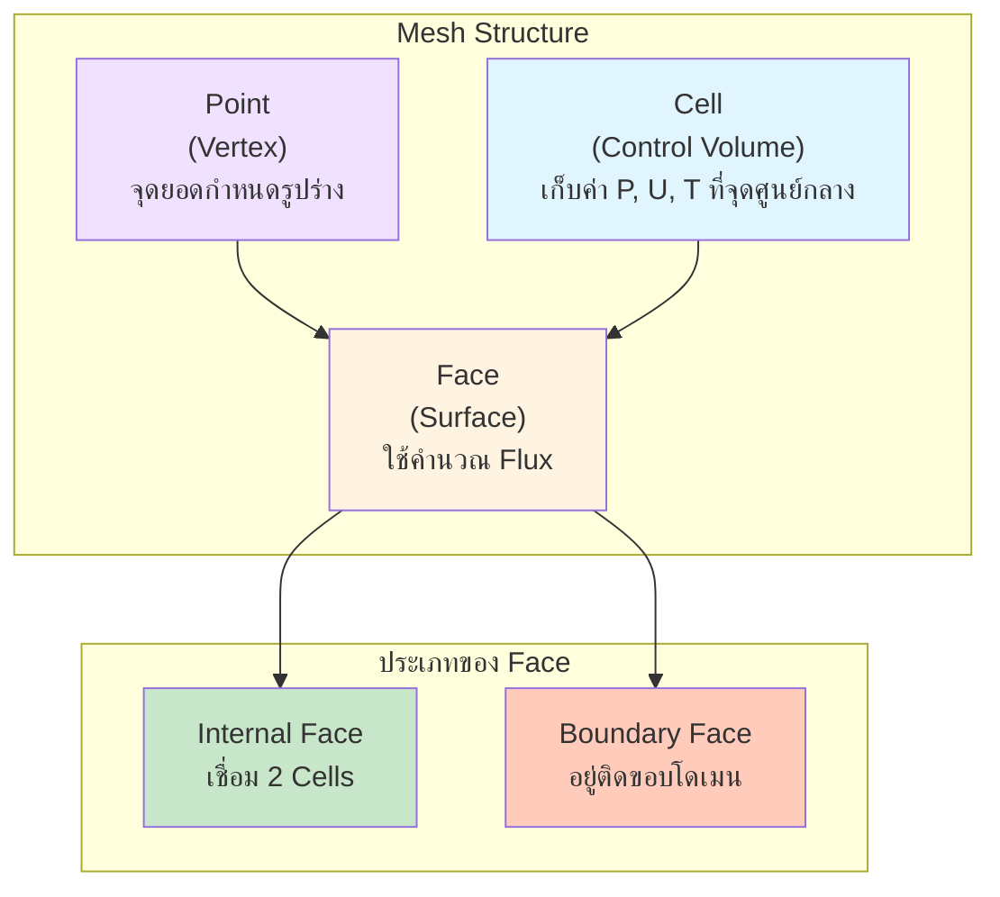

# บทนำสู่การสร้างเมช (Introduction to Meshing)

> "A bad mesh is the root of all divergence." (เมชที่ไม่ดีคือต้นเหตุของความลู่ออกทั้งหมด)

ในโลกของ CFD **การสร้างเมช (Meshing)** หรือการทำ Discretization คือขั้นตอนที่แปลงโดเมนทางเรขาคณิตที่ต่อเนื่อง (Continuous Domain) ให้กลายเป็นชิ้นเล็กๆ ที่ไม่ต่อเนื่อง (Discrete Elements/Cells) เพื่อให้คอมพิวเตอร์สามารถคำนวณแก้สมการอนุรักษ์ (Conservation Equations) เช่น Navier-Stokes equations ในแต่ละจุดได้

คุณภาพของเมชมีผลโดยตรงต่อ:
1.  **ความแม่นยำ (Accuracy):** เมชที่ละเอียดพอจะจับปรากฏการณ์ฟิสิกส์ได้ครบถ้วน
2.  **ความเสถียร (Stability):** เมชที่คุณภาพแย่จะทำให้เกิด numerical error จน solver ลู่ออก (Diverge)
3.  **ความเร็ว (Convergence Speed):** เมชที่ดีช่วยให้ solver หาคำตอบได้เร็วขึ้น

## 1. แนวคิด Finite Volume Method (FVM) กับ Mesh

OpenFOAM ใช้ระเบียบวิธีปริมาตรจำกัด (Finite Volume Method) ซึ่งต่างจาก Finite Element (FEM) หรือ Finite Difference (FDM) ตรงที่ FVM จะแบ่งโดเมนออกเป็น **Control Volumes (Cells)** เล็กๆ และใช้ทฤษฎีบทของเกาส์ (Gauss's Theorem) แปลงสมการเชิงอนุพันธ์ให้อยู่ในรูปของ **Flux** ที่ไหลเข้า/ออกผ่านพื้นผิวของเซลล์

องค์ประกอบหลักของ Mesh ใน OpenFOAM จึงประกอบด้วย:

1.  **Cell (เซลล์):** ปริมาตรควบคุมที่เก็บค่าตัวแปรหลัก (Unknowns) เช่น $P, \mathbf{U}, T, k, \epsilon$ โดยเก็บไว้ที่ **จุดศูนย์กลางเซลล์ (Cell Center)**
2.  **Face (หน้า):** พื้นผิวที่ปิดล้อม Cell ใช้คำนวณ Flux ($\phi$)
    *   **Internal Face:** หน้าที่เชื่อมระหว่าง 2 Cells
    *   **Boundary Face:** หน้าที่อยู่ติดขอบโดเมน (ผนัง, ทางเข้า, ทางออก)
3.  **Point (จุด):** จุดยอด (Vertex) ที่กำหนดรูปร่างของ Cell
4.  **Edge (ขอบ):** เส้นที่เชื่อมระหว่างจุด (มักไม่ถูกใช้อ้างอิงโดยตรงในการคำนวณ FVM แต่ใช้ในการวาด)

> [!NOTE]
> OpenFOAM ใช้ Face-addressing format ซึ่งจะกล่าวถึงในบทถัดไป → [02_OpenFOAM_Mesh_Structure.md](./02_OpenFOAM_Mesh_Structure.md)

## 2. ประเภทของ Cell (Cell Types)

OpenFOAM รองรับ **General Polyhedral Mesh** คือ Cell จะมีกี่หน้าก็ได้ (ขอให้เป็น Convex) แต่ในทางปฏิบัติเรามักพบ 4 ประเภทหลัก:

### 2.1 Hexahedron (Hex)
*   **รูปทรง:** ลูกบาศก์ (6 หน้าสี่เหลี่ยม)
*   **ข้อดี:**
    *   **ความแม่นยำสูงสุด:** เมื่อ Flow ไหลขนานกับเส้น grid (Alignment) จะเกิด Numerical Diffusion น้อยที่สุด
    *   **ประหยัด:** ใช้จำนวน Cell น้อยกว่า Tet เพื่อให้ได้ความแม่นยำเท่ากัน (ประมาณ 1 Hex $\approx$ 5-6 Tets)
    *   **ลู่เข้าเร็ว:** Solver ชอบโครงสร้างที่เป็นระเบียบ
*   **ข้อเสีย:** สร้างยากสำหรับรูปทรงที่ซับซ้อนมาก

### 2.2 Tetrahedron (Tet)
*   **รูปทรง:** พีระมิดฐานสามเหลี่ยม (4 หน้าสามเหลี่ยม)
*   **ข้อดี:** สร้างได้ง่ายและอัตโนมัติ (Automatic Generation) สำหรับรูปทรงซับซ้อนทุกรูปแบบ
*   **ข้อเสีย:**
    *   **คุณภาพต่ำ:** มักเกิด Non-orthogonality และ Skewness ได้ง่าย
    *   **เปลือง:** ต้องใช้จำนวน Cell เยอะมาก
    *   **Gradient Error:** การคำนวณ Gradient ไม่แม่นยำเท่า Hex

### 2.3 Prism / Wedge
*   **รูปทรง:** ปริซึมฐานสามเหลี่ยม (5 หน้า)
*   **การใช้งาน:** ใช้สำหรับสร้าง **Boundary Layer Mesh** (ชั้น Layer ติดผนัง) เพื่อจับ Gradient ของความเร็ว ($y+$)
*   **ความสำคัญ:** จำเป็นมากสำหรับการจำลอง Turbulence ที่ถูกต้อง

### 2.4 Polyhedron (Poly)
*   **รูปทรง:** หลายเหลี่ยม (เช่น 12-20 หน้า, รูปร่างเหมือนรังผึ้งหรือฟองสบู่)
*   **ที่มา:** มักเกิดจากการแปลง Dual-mesh ของ Tet mesh
*   **ข้อดี:** มีเพื่อนบ้าน (Neighbours) เยอะ ทำให้การเกลี่ยค่า Gradient (Gradient reconstruction) ทำได้ดีและเสถียรมาก

> [!TIP]
> **Golden Rule of OpenFOAM Meshing:**
> พยายามสร้าง Mesh ให้เป็น **Hex-dominant** (มี Hex มากที่สุด > 80-90%) โดยใช้ `snappyHexMesh` หรือ `blockMesh` และใช้ Prism layer บริเวณผนังเสมอ

## 3. Structured vs Unstructured Mesh

| คุณสมบัติ | Structured Mesh | Unstructured Mesh |
| :--- | :--- | :--- |
| **การเรียงตัว** | เป็นระเบียบ (Index i, j, k) | อิสระ (เก็บ ID ของเพื่อนบ้าน) |
| **ตัวอย่างเครื่องมือ** | `blockMesh` | `snappyHexMesh`, `Netgen`, `Gmsh` |
| **ความเหมาะสม** | ท่อ, กล่อง, Airfoil 2D | รถยนต์, เครื่องบิน, เมือง, ภูมิประเทศ |
| **Memory Usage** | ต่ำ (ไม่ต้องจำ Connectivity) | สูง (ต้องจำว่าใครอยู่ข้างใคร) |
| **OpenFOAM?** | รองรับ (แต่เก็บแบบ Unstructured) | **รองรับเต็มรูปแบบ** |

**หมายเหตุ:** OpenFOAM มอง Mesh ทุกแบบเป็น Unstructured (เก็บรายการ Faces, Owners, Neighbours) แม้ว่าเราจะสร้างมาจาก `blockMesh` ก็ตาม เพื่อความยืดหยุ่นสูงสุด

## 4. ตัวชี้วัดคุณภาพ Mesh (Mesh Quality Metrics)

OpenFOAM มีความไว (Sensitive) ต่อคุณภาพ Mesh มาก หาก Mesh แย่เพียง 1 Cell ก็อาจทำให้ Simulation ลู่ออกได้ ค่าที่ต้องตรวจสอบด้วยคำสั่ง `checkMesh` มีดังนี้:

### 4.1 Non-Orthogonality
คือมุม ($\theta$) ระหว่างเวกเตอร์เชื่อมจุดศูนย์กลางเซลล์ ($\\mathbf{d} = P - N$) กับเวกเตอร์ตั้งฉากของหน้า ($\\mathbf{n}$)
*   **สูตร:** $\theta = \arccos \left( \frac{\\mathbf{d} \cdot \\mathbf{n}}{|\\mathbf{d}| |\\mathbf{n}|} \right)$
*   **ผลกระทบ:** ทำให้การคำนวณ Diffusion term (Laplacian) ผิดพลาด เพราะ Flux ไม่ได้ไหลตั้งฉากกับหน้า
*   **ค่าที่ยอมรับได้:**
    *   $< 70^\circ$: ดีมาก (Safe)
    *   $70^\circ - 85^\circ$: พอใช้ได้ (ต้องเปิด `nonOrthogonalCorrector` ใน `fvSolution`)
    *   $> 85^\circ$: อันตราย (มัก Diverge)

### 4.2 Skewness (ความเบ้)
วัดระยะห่างระหว่างจุดตัดของเส้นเชื่อมเซลล์ ($f_{intersection}$) กับจุดกึ่งกลางทางเรขาคณิตของหน้า ($f_{centroid}$)
*   **ผลกระทบ:** ลดความแม่นยำของการประมาณค่า (Interpolation) จาก Cell center ไปสู่ Face center
*   **ค่าที่ยอมรับได้:** OpenFOAM internal skewness metric ควร $< 4$ (หรือ $< 0.8-0.9$ ใน software อื่น)

### 4.3 Aspect Ratio
อัตราส่วนด้านยาวสุดต่อด้านสั้นสุดของ Cell
*   **การใช้งาน:**
    *   ใน Free stream (ไหลอิสระ): ควรใกล้เคียง 1 (Isotropic)
    *   ใน Boundary Layer (ติดผนัง): ยอมรับค่าสูงๆ ได้ (เช่น 100-1000) หากทิศทางการไหลขนานกับด้านยาวของ Cell

### 4.4 Cell Volume
ต้องเป็นบวก (+) เสมอ ถ้าเจอ Negative Volume แสดงว่า Mesh พับหรือบิดเบี้ยวจนผิดรูป (Error ร้ายแรง)

## 5. Workflow การสร้าง Mesh ใน OpenFOAM

1.  **Geometry Preparation:** เตรียมไฟล์ STL/OBJ ให้สะอาด (Watertight, Closed surface)
2.  **Background Mesh:** สร้างกล่องครอบด้วย `blockMesh`
3.  **Castellated Mesh:** ตัด Background mesh ตามรูปร่าง Geometry (`snappyHexMesh` step 1)
4.  **Snapping:** ดึงจุดยอดเข้าหาผิว Geometry (`snappyHexMesh` step 2)
5.  **Layer Addition:** สร้างชั้น Prism layer ติดผนัง (`snappyHexMesh` step 3)
6.  **Quality Check:** รัน `checkMesh` และปรับแก้พารามิเตอร์จนกว่าจะผ่าน

---

## 📝 แบบฝึกหัด (Exercises)

### แบบฝึกหัดระดับง่าย (Easy)
1. **True/False**: OpenFOAM รองรับเฉพาะ Hexahedral Mesh เท่านั้น
   

   
คำตอบ

   ❌ เท็จ - OpenFOAM รองรับ General Polyhedral Mesh (หลายเหลี่ยม)
   

2. **เลือกตอบ**: Cell ประเภทไหนที่เหมาะสมที่สุดสำหรับ Boundary Layer?
   - a) Tetrahedron
   - b) Hexahedron
   - c) Prism / Wedge
   - d) Polyhedron
   

   
คำตอบ

   ✅ c) Prism / Wedge - ใช้สำหรับสร้าง Boundary Layer Mesh เพื่อจับ Gradient ของความเร็ว
   

### แบบฝึกหัดระดับปานกลาง (Medium)
3. **อธิบาย**: ทำไม Non-orthogonality ที่สูง (> 85°) ถึงทำให้ Solver ลู่ออก (Diverge) ได้?
   

   
คำตอบ

   เพราะสมการ Diffusion ต้องการคำนวณ Flux ผ่านหน้า หากเวกเตอร์เชื่อมจุดศูนย์กลางเซลล์กับ Normal vector ไม่ขนานกัน Flux จะถูกคำนวณผิด ทำให้เกิด numerical error สะสมจนลู่ออก
   

4. **คำนวณ**: ถ้า Background Mesh มีขนาด 0.1 m และกำหนด Refinement Level = 3 ขนาด Cell จะเล็กลงเป็นเท่าไหร่?
   

   
คำตอบ

   Cell Size = 0.1 / 2³ = 0.1 / 8 = 0.0125 m (1.25 cm)
   

### แบบฝึกหัดระดับสูง (Hard)
5. **Hands-on**: ใช้คำสั่ง `checkMesh` กับ Mesh จาก Tutorial ใดๆ แล้วตอบคำถาม:
   - ค่า Non-orthogonality เฉลี่ยเท่าไหร่?
   - มีกี่ Cell ที่ Skewness > 4?
   - Mesh นี้ผ่านเกณฑ์คุณภาพหรือไม่?

6. **วิเคราะห์**: เปรียบเทียบข้อดี-ข้อเสียระหว่าง Hex-dominant Mesh กับ Tetrahedral Mesh สำหรับโจทย์ External Aerodynamics (รถยนต์)

---

ในบทถัดไป เราจะเจาะลึกโครงสร้างไฟล์ `constant/polyMesh` เพื่อให้เข้าใจว่า OpenFOAM เก็บข้อมูลเหล่านี้อย่างไร