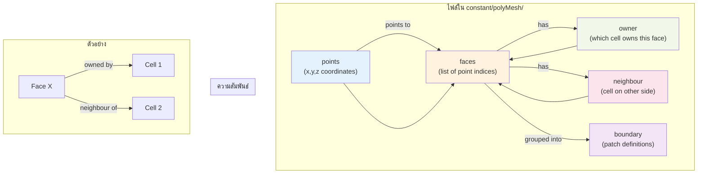

# โครงสร้างไฟล์เมชของ OpenFOAM (OpenFOAM Mesh Structure)

## 🎯 Learning Objectives

หลังจากอ่านบทนี้ คุณจะสามารถ:
- **อธิบาย** ความแตกต่างระหว่าง Face-based (OpenFOAM) กับ Element-based mesh formats
- **ระบุ** หน้าที่ของไฟล์หลัก 5 ไฟล์ใน `constant/polyMesh/` และความสัมพันธ์ระหว่างกัน
- **อ่านและตีความ** ข้อมูลในไฟล์ `points`, `faces`, `owner`, `neighbour`, และ `boundary`
- **แยกแยะ** ประเภทของ Boundary Types (geometric vs numeric) และเลือกใช้ได้อย่างถูกต้อง
- **ใช้งาน** Mesh utilities อย่าง `checkMesh`, `renumberMesh`, และ `transformPoints` ได้อย่างเหมาะสม

---

## 1. ภาพรวม: Distributed Text Files Philosophy

ในซอฟต์แวร์ CFD ทั่วไป ไฟล์ Mesh มักจะรวมเป็นไฟล์ก้อนเดียวใหญ่ๆ (Binary monolith) แต่ OpenFOAM ใช้ปรัชญาที่ต่างออกไป คือ **"Distributed Text Files"** โดยเก็บข้อมูล Mesh ไว้ในโฟลเดอร์ `constant/polyMesh/` ซึ่งประกอบด้วยไฟล์ย่อยๆ หลายไฟล์

การเข้าใจโครงสร้างนี้สำคัญมากเมื่อคุณต้องการ:
- **Debug ปัญหา Mesh** เช่น หาว่า Cell ที่ error อยู่ตรงไหน
- **เขียนโปรแกรม Manipulate Mesh** ด้วย Python/C++
- **ทำความเข้าใจ Output ของ `checkMesh`** ว่ามันบอกอะไร

> [!TIP]
> **ทำไมเรื่องนี้สำคัญ?**
> การเข้าใจโครงสร้างไฟล์ Mesh ของ OpenFOAM จะช่วยให้คุณ:
> - **แก้ปัญหาเมื่อ Simulation ล้มเหลว** เช่น หา Cell ที่มีค่า non-orthogonality สูงเกินไป หรือหาว่า Mesh มีปัญหาที่บริเวณไหน
> - **เขียนโปรแกรมหรือ Script ปรับแต่ง Mesh** ได้อย่างมีประสิทธิภาพ เช่น สร้าง refinement region แบบ dynamic หรือแก้ไข mesh ด้วย Python/C++
> - **ทำความเข้าใจ Output ของ `checkMesh`** ว่ามันบอกอะไร และควรแก้ไขตรงไหนใน mesh generation process
> - **สร้าง Custom Mesh Utilities** หรือทำงานกับ `cellZones`, `faceZones` สำหรับ porous media, MRF zones, หรือ monitoring surfaces

---

## 2. Face-Addressing Format: 5 ไฟล์พื้นฐาน

OpenFOAM ไม่ได้เก็บ Mesh แบบ Element-based (เช่น Cell 1 ประกอบด้วย Node A, B, C, D) แต่ใช้ **Face-based** หรือ Face-Addressing ซึ่งมีประสิทธิภาพสูงกว่าในการคำนวณ Flux

> [!NOTE]
> **OpenFOAM Context: การใช้งาน Face-Addressing ในการคำนวณ**
>
> แนวคิด Face-Addressing Format นี้เป็นพื้นฐานของการเก็บข้อมูล Mesh ใน OpenFOAM ซึ่งส่งผลกระทบต่อ:
> - **Finite Volume Method**: Solver คำนวณ Flux ผ่าน Face แต่ละหน้า ดังนั้นโครงสร้างนี้ถูกออกแบบมาเพื่อให้เข้าถึงข้อมูล Face ได้รวดเร็ว
> - **Mesh Utilities**: `checkMesh`, `renumberMesh`, `refineMesh` ทั้งหมดใช้ข้อมูล connectivity นี้
> - **Parallel Processing**: เมื่อแบ่ง Case ด้วย `decomposePar` OpenFOAM จะแบ่ง Cell และสร้าง processor patches โดยใช้ข้อมูล connectivity นี้

โครงสร้างหลักประกอบด้วย 5 ไฟล์พื้นฐาน (Primitives):

### 2.1 `points` (จุดยอด)
เก็บพิกัด $(x, y, z)$ ของจุดยอดทั้งหมดในระบบ
- **Format:** `vectorField` (List of vectors)
- **Index:** บรรทัดแรกคือจุด index 0, ถัดมาคือ 1, 2, ...
- **หน่วย:** เมตร (Meters) (หลังจากคูณ `convertToMeters` ใน blockMesh แล้ว)

```cpp
// constant/polyMesh/points
(
    (0 0 0)       // Point 0
    (1 0 0)       // Point 1
    (1 1 0)       // Point 2
    (0 1 0)       // Point 3
    ...
)
```

### 2.2 `faces` (หน้า)
นิยามหน้าโดยการระบุ **List ของ Point Indices** ที่ประกอบกันเป็นหน้านั้น
- **กฎสำคัญ:** ลำดับจุดต้องเรียงตาม **กฎมือขวา (Right-Hand Rule)** เพื่อกำหนดทิศทางของ Normal Vector
- **Normal vector** จะพุ่งออกจากหน้า
- **Format:** `faceList` (List of dynamic lists)

```cpp
// constant/polyMesh/faces
(
    4(0 1 2 3)    // Face 0: สี่เหลี่ยม (4 จุด)
    3(1 5 2)      // Face 1: สามเหลี่ยม (3 จุด)
    ...
)
```

### 2.3 `owner` (เจ้าของหน้า)
ระบุว่าแต่ละ Face "เป็นของ" Cell ไหน
- **ขนาด:** เท่ากับจำนวน Faces ทั้งหมด
- **ความหมาย:** Face $i$ เป็นหน้าของ Cell $C_{owner}$
- **กฎ:** สำหรับ Internal Face, Normal Vector จะพุ่ง **ออกจาก** Owner Cell เสมอ
- **Format:** `labelList` (List of integers)

### 2.4 `neighbour` (เพื่อนบ้าน)
ระบุว่า "อีกฝั่ง" ของ Face คือ Cell ไหน
- **ขนาด:** เท่ากับจำนวน **Internal Faces** เท่านั้น (น้อยกว่า `owner` และ `faces`)
- **หมายเหตุ:** Boundary Faces (หน้าที่อยู่ขอบ) จะ **ไม่มี** ข้อมูลในไฟล์นี้ (เพราะอีกฝั่งไม่ใช่ Cell แต่เป็นขอบเขต)
- **Format:** `labelList`

### 2.5 `boundary` (ขอบเขต)
นิยามกลุ่มของ Boundary Faces ว่าเป็น Patch ชื่ออะไร และประเภทไหน
- **Format:** `polyBoundaryMesh`

```cpp
// constant/polyMesh/boundary
(
    inlet           // ชื่อ Patch
    {
        type patch;     // ชนิด (Physical type)
        nFaces 50;      // จำนวนหน้าใน Patch นี้
        startFace 2000; // เริ่มต้นที่ Face index 2000 ในไฟล์ faces
    }
    ...
)
```

> [!NOTE]
> OpenFOAM เรียง Faces ในไฟล์ `faces` โดยเอา **Internal Faces ไว้ก่อน** แล้วตามด้วย Boundary Faces ของแต่ละ Patch เรียงกันไป ดังนั้น `startFace` ของ Patch แรกจะเท่ากับจำนวน Internal Faces พอดี

---

## 3. ความสัมพันธ์ระหว่างไฟล์ (Connectivity)



**การทำงานร่วมกันของ 5 ไฟล์:**
1. **`points`** → เก็บตำแหน่งพิกัดของจุดยอด
2. **`faces`** → ระบุจุดยอดไหนบ้างที่ประกอบเป็นหน้านั้น
3. **`owner`** → บอกว่าแต่ละหน้าเป็นของ Cell ไหน (Normal ชี้ออกจาก Owner)
4. **`neighbour`** → บอกว่าอีกฝั่งของหน้าคือ Cell ไหน (สำหรับ Internal Faces เท่านั้น)
5. **`boundary`** → จัดกลุ่ม Boundary Faces เป็น Patches พร้อมระบุ Type

---

## 4. Boundary Types: Geometric vs Numeric

ในไฟล์ `boundary` เราต้องกำหนด `type` ซึ่งแบ่งเป็น 2 กลุ่มที่แตกต่างกัน:

### 4.1 Geometric Types (ใน `constant/polyMesh/boundary`)

| Type | การใช้งาน | ตัวอย่าง |
|------|-------------|-----------|
| `patch` | ขอบเขตทั่วไป | Inlet, Outlet, Atmosphere |
| `wall` | ผนัง (ของแข็ง) | ผนังท่อ, พื้นผิวของแข็ง |
| `symmetry` / `symmetryPlane` | ระนาบสมมาตร | ระนาบตรงกลางท่อ |
| `empty` | สำหรับ 2D Simulation | ปิดหน้าประกับ z-axis |
| `wedge` | สำหรับ 2D Axisymmetric | ชิ้นส่วนเค้ก < 5° |
| `cyclic` | เชื่อมต่อหน้าสองฝั่ง | Periodic boundaries, Fan interfaces |

> [!WARNING]
> **ข้อควรระวัง**: การกำหนด type ผิด เช่น ใส่ `patch` แทนที่จะเป็น `wall` จะทำให้ Solver ไม่สามารถคำนวณ wall functions ได้

### 4.2 Numeric Types (ในไฟล์ `0/`)

นี่คือการกำหนดค่าตัวแปร (Boundary Conditions) เช่น `fixedValue`, `zeroGradient`, `fixedFluxPressure` ซึ่งเป็นคนละส่วนกับ `polyMesh/boundary`

**ตัวอย่างความสัมพันธ์:**
```cpp
// constant/polyMesh/boundary (Geometric type)
walls
{
    type wall;
    ...
}

// 0/U (Numeric BC สำหรับ velocity)
walls
{
    type noSlip;           // หรือ fixedValue (0 0 0)
    ...
}

// 0/k (Numeric BC สำหรับ turbulence)
walls
{
    type kqRWallFunction;
    ...
}
```

> [!NOTE]
> **OpenFOAM Context: ความสำคัญของการแยกส่วน**
> 
> หลายคนสับสนระหว่าง `wall` (geometric type ใน `polyMesh/boundary`) กับ `noSlip` (numeric BC ใน `0/U`) ซึ่งเป็นคนละสิ่งกัน:
> - **Geometric Type (`wall`)**: บอก OpenFOAM ว่า "นี่คือผนัง" เพื่อให้คำนวณ $y^+$ และ wall functions
> - **Numeric BC (`noSlip`)**: บอก Solver ว่า "velocity ที่ผนังเป็นศูนย์"

---

## 5. Zones: CellZones, FaceZones, PointZones

> [!NOTE]
> **OpenFOAM Context: การใช้งาน Zones ใน Advanced Features**
>
> Zones คือกลุ่มของ Mesh entities ที่ถูกตั้งชื่อและจัดกลุ่มไว้เพื่อการใช้งานเฉพาะทาง:
> - **Porous Media**: ใช้ `cellZones` ระบุบริเวณที่เป็น porous แล้วกำหนดค่าใน `constant/porousZone` หรือ `constant/fvOptions`
> - **MRF (Multiple Reference Frame)**: ใช้ `cellZones` ระบุบริเวณที่หมุน เช่น impeller zone ใน `constant/MRFProperties`
> - **Sliding Mesh / Dynamic Mesh**: ใช้ `cellZones` และ `faceZones` กำห้บริเวณที่เคลื่อนที่
> - **Baffles & Interior Surfaces**: ใช้ `faceZones` สร้างผนังบางๆ ภายในโดเมน หรือใช้ monitor flux ผ่านพื้นที่ตัดผ่าน

นอกจาก 5 ไฟล์หลัก ยังมีไฟล์ zones ใน `constant/polyMesh/` (ถ้าสร้างไว้):

| Zone Type | ความหมาย | การใช้งาน |
|-----------|-----------|-------------|
| **cellZones** | กลุ่มของ Cells | Porous media, MRF regions, Source terms |
| **faceZones** | กลุ่มของ Faces | Baffles, Fan, Interior monitoring surface |
| **pointZones** | กลุ่มของ Points | การจัดการจุดยอดเฉพาะทาง |

**การสร้าง Zones:**
- ใช้คำสั่ง `topoSet`, `setSet` 
- กำหนดโดยตรงใน `snappyHexMeshDict` (สำหรับ refinement zones)

---

## 6. Hands-On: การอ่านไฟล์ Mesh ด้วยตนเอง

### 6.1 ตัวอย่าง: การอ่าน Lid-Driven Cavity

ลองเปิด Tutorial case เช่น `incompressible/icoFoam/cavity` แล้วไปดูไฟล์ใน `constant/polyMesh/`

**Step 1: ตรวจสอบไฟล์ทั้งหมด**
```bash
ls constant/polyMesh/
# ควรเห็น: points, faces, owner, neighbour, boundary, cellZones (ถ้ามี)
```

**Step 2: อ่านไฟล์ points**
```bash
head -20 constant/polyMesh/points
```
ดูพิกัดของจุดยอด และสังเกตว่า:
- บรรทัดแรกคือจำนวน points ทั้งหมด
- แต่ละบรรทัดคือพิกัด (x y z)

**Step 3: อ่านไฟล์ faces**
```bash
head -20 constant/polyMesh/faces
```
ดูว่าหน้าแรกประกอบด้วยจุดไหนบ้าง และเป็น 3 จุด (สามเหลี่ยม) หรือ 4 จุด (สี่เหลี่ยม)

**Step 4: เปรียบเทียบ owner และ neighbour**
```bash
wc -l constant/polyMesh/owner
wc -l constant/polyMesh/neighbour
```
สังเกตว่า:
- ไฟล์ `owner` มีจำนวนบรรทัดเท่ากับ `faces`
- ไฟล์ `neighbour` มีจำนวนบรรทัดน้อยกว่า (เท่ากับจำนวน Internal Faces)

**Step 5: ตรวจสอบ boundary**
```bash
cat constant/polyMesh/boundary
```
ดูว่ามี patches ไหนบ้าง และแต่ละ patch มีกี่ faces

### 6.2 แบบฝึกหัด: การตรวจสอบ Connectivity

จาก Tutorial case ที่คุณเปิด:
1. นับจำนวน Internal Faces และ Boundary Faces
2. ตรวจสอบว่า `startFace` ในไฟล์ `boundary` ถูกต้องหรือไม่ (ควรเท่ากับจำนวน Internal Faces)
3. หาว่า Patch ไหนที่มีจำนวน faces มากที่สุด

---

## 7. Mesh Utilities: เครื่องมือสำคัญ

| คำสั่ง | หน้าที่ | ตัวอย่างการใช้งาน |
|---------|----------|---------------------|
| **`checkMesh`** | ตรวจสอบคุณภาพและ Topology | `checkMesh -allTopology -allGeometry` |
| **`renumberMesh`** | จัดเรียงลำดับ Cell ใหม่เพื่อลด Bandwidth | `renumberMesh -overwrite` |
| **`transformPoints`** | ย่อ/ขยาย/หมุน/ย้าย Mesh | `transformPoints "scale=(0.001 0.001 0.001)"` |
| **`foamToVTK`** | แปลงเป็น VTK สำหรับ ParaView | `foamToVTK` |
| **`topoSet`** | สร้าง cellZones/faceZones | `topoSet -dict system/topoSetDict` |

> [!TIP]
> **Best Practice**: ควรรัน `checkMesh` ก่อนเริ่ม Simulation ทุกครั้งเพื่อตรวจสอบว่า Mesh ผ่านเกณฑ์หรือไม่

---

## 📋 Key Takeaways

✅ **Face-Based Philosophy**: OpenFOAM ใช้ Face-Addressing format ซึ่งเหมาะกับ Finite Volume Method มากกว่า Element-based format

✅ **5 ไฟล์หลัก**: `points` → `faces` → `owner`/`neighbour` → `boundary` เชื่อมโยงกันเป็น Chain ที่สมบูรณ์

✅ **Right-Hand Rule**: ลำดับจุดใน `faces` ต้องเรียงตามกฎมือขวา Normal จะชี้ออกจาก Owner Cell

✅ **Internal vs Boundary**: `neighbour` มีเฉพาะ Internal Faces เท่านั้น Boundary Faces จะถูกจัดกลุ่มใน `boundary`

✅ **Geometric vs Numeric**: อย่าสับสนระหว่าง `wall` (geometric type ใน `polyMesh/boundary`) กับ `noSlip` (numeric BC ใน `0/U`)

✅ **Zones สำหรับ Advanced Features**: `cellZones`, `faceZones`, `pointZones` ใช้สำหรับ porous media, MRF, baffles และ dynamic mesh

✅ **Mesh Utilities**: `checkMesh`, `renumberMesh`, `transformPoints` เป็นเครื่องมือสำคัญสำหรับการตรวจสอบและปรับปรุง Mesh

---

## 🧠 Concept Check: ทดสอบความเข้าใจ

### แบบฝึกหัดระดับง่าย (Easy)

1. **True/False**: ไฟล์ `neighbour` มีขนาดเท่ากับจำนวน Faces ทั้งหมด
   <details>
   <summary>คำตอบ</summary>
   ❌ เท็จ - ไฟล์ `neighbour` มีขนาดเท่ากับจำนวน **Internal Faces** เท่านั้น (Boundary Faces ไม่มี neighbour)
   </details>

2. **เลือกตอบ**: ไฟล์ไหนที่เก็บพิกัด (x, y, z) ของจุดยอดทั้งหมด?
   - a) faces
   - b) points
   - c) owner
   - d) boundary
   <details>
   <summary>คำตอบ</summary>
   ✅ b) points
   </details>

### แบบฝึกหัดระดับปานกลาง (Medium)

3. **อธิบาย**: ทำไฟล์ `owner` และ `neighbour` จึงสำคัญต่อการคำนวณ Flux ระหว่างเซลล์?
   <details>
   <summary>คำตอบ</summary>
   เพราะ Solver ต้องรู้ว่า Face นั้นเชื่อมระหว่าง Cell ไหนกับ Cell ไหน เพื่อคำนวณการไหลของค่า (Flux) จาก Owner ไปยัง Neighbour ตามทิศทางของ Normal Vector
   </details>

4. **วิเคราะห์**: ถ้าหน้าสามเหลี่ยมถูกนิยามด้วยจุด `(0 0 0), (1 0 0), (0 1 0)` Normal Vector จะชี้ไปทางไหน?
   <details>
   <summary>คำตอบ</summary>
   ใช้กฎมือขวา (Right-Hand Rule) → ชี้ไปทาง +Z (ออกจากหน้าจอ)
   </details>

### แบบฝึกหัดระดับสูง (Hard)

5. **Hands-on**: เปิดไฟล์ `constant/polyMesh/faces` และ `constant/polyMesh/owner` จาก Tutorial case ใดๆ แล้ว:
   - นับจำนวน Internal Faces และ Boundary Faces
   - ตรวจสอบว่า `startFace` ในไฟล์ `boundary` ถูกต้องหรือไม่

6. **วิเคราะห์**: เปรียบเทียบข้อดีของ Face-addressing format (ของ OpenFOAM) กับ Element-based format (ของ FEM) ในแง่ของ:
   - หน่วยความจำที่ใช้ (Memory Usage)
   - ความเร็วในการคำนวณ Flux

---

## 📖 เอกสารที่เกี่ยวข้อง

- **บทก่อนหน้า**: [01_Introduction_to_Meshing.md](01_Introduction_to_Meshing.md)
- **บทถัดไป**: [03_Mesh_Quality.md](03_Mesh_Quality.md)
- **Mesh Quality Criteria**: [../05_MESH_QUALITY_AND_MANIPULATION/01_Mesh_Quality_Criteria.md](../05_MESH_QUALITY_AND_MANIPULATION/01_Mesh_Quality_Criteria.md)
- **Quick Reference**: [04_Quick_Reference.md](04_Quick_Reference.md)